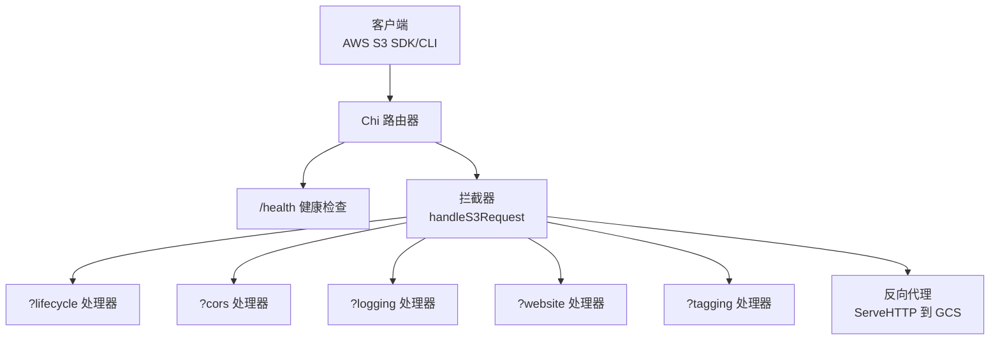
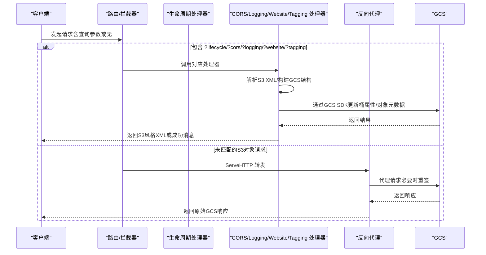
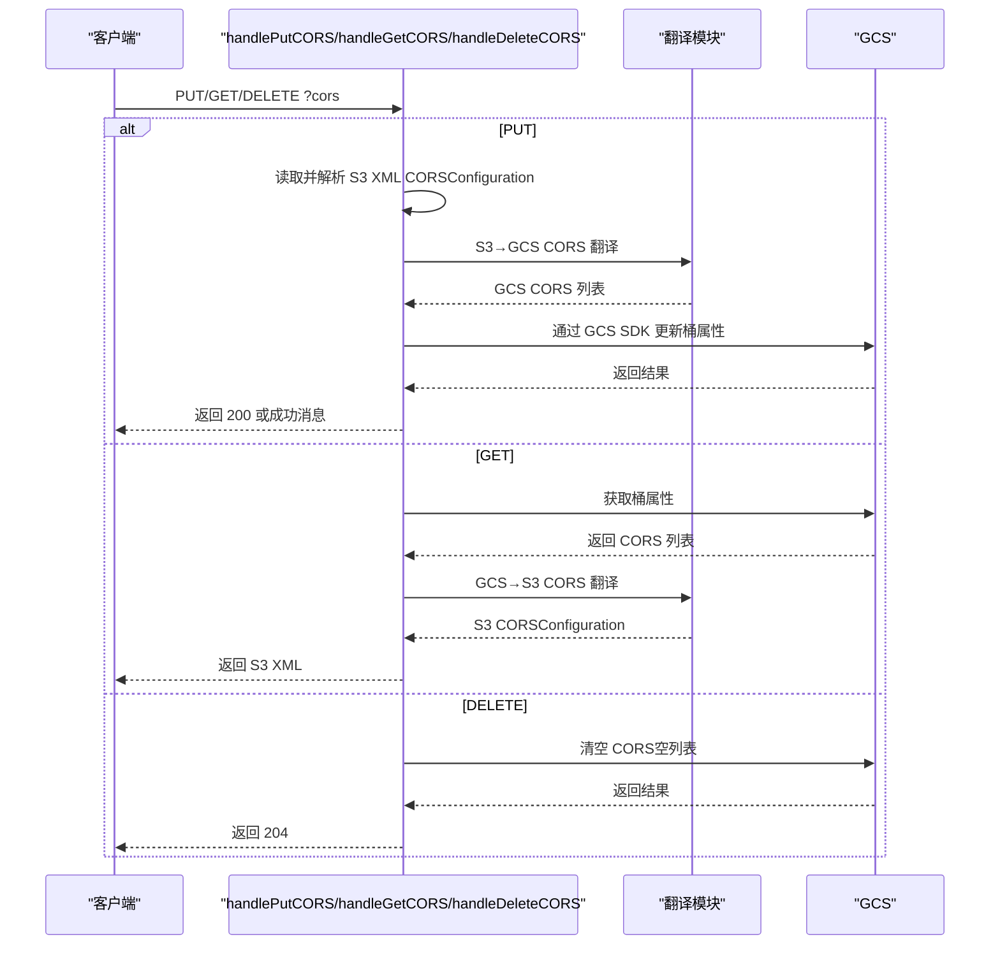
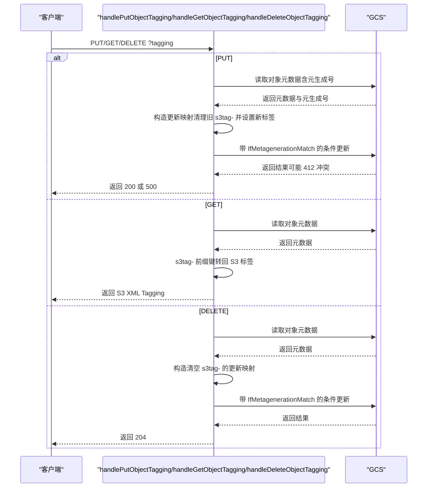
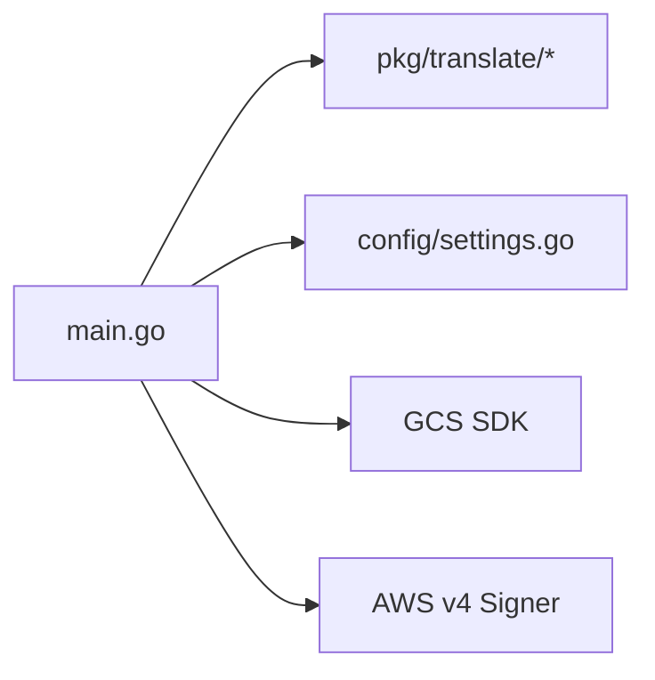

# API参考

<cite>
**本文引用的文件**
- [main.go](file://main.go)
- [README.md](file://README.md)
- [config/settings.go](file://config/settings.go)
- [pkg/translate/s3_cors.go](file://pkg/translate/s3_cors.go)
- [pkg/translate/s3_lifecycle.go](file://pkg/translate/s3_lifecycle.go)
- [pkg/translate/s3_logging.go](file://pkg/translate/s3_logging.go)
- [pkg/translate/s3_tagging.go](file://pkg/translate/s3_tagging.go)
- [pkg/translate/s3_website.go](file://pkg/translate/s3_website.go)
- [pkg/translate/gcs_cors.go](file://pkg/translate/gcs_cors.go)
- [pkg/translate/gcs_lifecycle.go](file://pkg/translate/gcs_lifecycle.go)
- [pkg/translate/gcs_logging.go](file://pkg/translate/gcs_logging.go)
- [pkg/translate/gcs_tagging.go](file://pkg/translate/gcs_tagging.go)
- [pkg/translate/gcs_website.go](file://pkg/translate/gcs_website.go)
- [integration_tests/test_utils.go](file://integration_tests/test_utils.go)
</cite>

## 目录
1. [简介](#简介)
2. [项目结构](#项目结构)
3. [核心组件](#核心组件)
4. [架构总览](#架构总览)
5. [详细组件分析](#详细组件分析)
6. [依赖分析](#依赖分析)
7. [性能考虑](#性能考虑)
8. [故障排查指南](#故障排查指南)
9. [结论](#结论)
10. [附录](#附录)

## 简介
本文件为 S3Proxy4GCS 的完整 API 参考文档，聚焦于以下公开 HTTP 端点与功能：
- 健康检查：GET /health
- 生命周期配置：?lifecycle（PUT）
- 跨域资源共享：?cors（PUT/GET/DELETE）
- 日志配置：?logging（PUT/GET/DELETE）
- 网站托管：?website（PUT）
- 对象标签：?tagging（PUT/GET/DELETE）

文档内容涵盖：
- 每个端点的 HTTP 方法、URL 模式、请求/响应模式
- 认证与签名要求（基于代理对请求进行重签）
- S3 XML 请求格式与 GCS JSON/SDK 类型对照
- 实际请求/响应示例路径与错误处理策略

## 项目结构
S3Proxy4GCS 采用“路由拦截 + 反向代理”的混合架构：
- 根路由注册健康检查与通用 S3 请求捕获
- 针对特定查询参数（如 ?lifecycle、?cors、?logging、?website、?tagging）的请求由专用处理器拦截并执行 S3 到 GCS 的双向转换
- 其余标准 S3 对象操作通过反向代理直达 GCS

图表来源
- [main.go:204-321](file://main.go#L204-L321)
- [main.go:253-321](file://main.go#L253-L321)

章节来源
- [main.go:197-251](file://main.go#L197-L251)
- [README.md:140-157](file://README.md#L140-L157)

## 核心组件
- 路由与入口
  - 健康检查：GET /health
  - 通用 S3 请求捕获：GET/PUT/POST/DELETE/HEAD /*，交由 handleS3Request 分发
- 请求分发与拦截
  - handleS3Request 根据 URL 查询参数判断是否为生命周期、CORS、Logging、Website 或 Tagging 请求，并调用对应处理器
- 反向代理
  - 默认将未匹配的请求转发至 GCS，同时在必要时对请求进行重签以满足 GCS S3 兼容签名要求

章节来源
- [main.go:204-321](file://main.go#L204-L321)

## 架构总览
下图展示从客户端到各处理器再到 GCS 的交互流程。

图表来源
- [main.go:253-321](file://main.go#L253-L321)
- [main.go:348-405](file://main.go#L348-L405)
- [main.go:407-486](file://main.go#L407-L486)
- [main.go:488-563](file://main.go#L488-L563)
- [main.go:565-608](file://main.go#L565-L608)
- [main.go:610-740](file://main.go#L610-L740)

## 详细组件分析

### 健康检查：GET /health
- 方法：GET
- URL：/health
- 功能：返回服务可用性状态
- 响应：
  - 200 OK，正文为“OK”
- 认证：无需认证
- 使用场景：容器编排、负载均衡探活

章节来源
- [main.go:204-207](file://main.go#L204-L207)

### 生命周期配置：?lifecycle（PUT）
- 方法：PUT
- URL：/{bucket}?lifecycle
- 请求体：S3 XML LifecycleConfiguration
- 响应：
  - 成功：200 OK，正文为成功消息
  - 失败：根据错误类型返回相应状态码；当解析失败时返回 S3 风格 XML 错误
- 认证：需具备目标桶写入权限
- 行为说明：
  - 将 S3 XML 规则映射为 GCS JSON 生命周期规则
  - 支持 Expiration（删除）、Transition（存储类别迁移）以及非当前版本过期
  - 不支持的对象尺寸过滤与标签过滤将导致转换错误
- S3 XML → GCS JSON 映射要点
  - Expiration.Days → GCS 条件 Age
  - Expiration.Date → GCS 条件 CreatedBefore（仅取日期部分）
  - Transition.StorageClass → GCS Action.StorageClass（映射标准/近线/冷存/归档）
  - 非当前版本过期 → GCS 条件 NumNewerVersions + IsLive=false
- 错误处理
  - 解析失败：400 Bad Request，返回 S3 风格 XML 错误
  - 翻译失败：500 Internal Error
  - GCS 更新失败：502 Bad Gateway

图表来源
- [main.go:348-405](file://main.go#L348-L405)
- [pkg/translate/gcs_lifecycle.go:38-105](file://pkg/translate/gcs_lifecycle.go#L38-L105)

章节来源
- [main.go:265-269](file://main.go#L265-L269)
- [main.go:348-405](file://main.go#L348-L405)
- [pkg/translate/s3_lifecycle.go:7-78](file://pkg/translate/s3_lifecycle.go#L7-L78)
- [pkg/translate/gcs_lifecycle.go:38-105](file://pkg/translate/gcs_lifecycle.go#L38-L105)

### 跨域资源共享：?cors（PUT/GET/DELETE）
- 方法：PUT/GET/DELETE
- URL：/{bucket}?cors
- 请求体：
  - PUT：S3 XML CORSConfiguration
  - GET/DELETE：无请求体
- 响应：
  - PUT/GET：返回 S3 XML CORSConfiguration
  - DELETE：204 No Content
  - 失败：返回相应状态码；解析失败返回 400 MalformedXML
- 认证：需具备目标桶写入权限
- 行为说明：
  - PUT/GET/DELETE 分别对应设置、读取、清除 CORS
  - S3 AllowedHeaders（请求头）在 GCS 中不原生支持，会被忽略并记录警告
- S3 XML → GCS CORS 映射要点
  - AllowedMethods → Methods
  - AllowedOrigins → Origins
  - ExposeHeaders → ResponseHeaders
  - MaxAgeSeconds → MaxAge（秒）
- 错误处理
  - 解析失败：400 MalformedXML
  - GCS 更新失败：502 Bad Gateway

图表来源
- [main.go:271-283](file://main.go#L271-L283)
- [main.go:407-486](file://main.go#L407-L486)
- [pkg/translate/gcs_cors.go:10-61](file://pkg/translate/gcs_cors.go#L10-L61)

章节来源
- [main.go:271-283](file://main.go#L271-L283)
- [main.go:407-486](file://main.go#L407-L486)
- [pkg/translate/s3_cors.go:5-19](file://pkg/translate/s3_cors.go#L5-L19)
- [pkg/translate/gcs_cors.go:10-61](file://pkg/translate/gcs_cors.go#L10-L61)

### 日志配置：?logging（PUT/GET/DELETE）
- 方法：PUT/GET/DELETE
- URL：/{bucket}?logging
- 请求体：
  - PUT：S3 XML BucketLoggingStatus
  - GET/DELETE：无请求体
- 响应：
  - PUT/GET：返回 S3 XML BucketLoggingStatus
  - DELETE：204 No Content
  - 失败：返回相应状态码；解析失败返回 400 MalformedXML
- 认证：需具备目标桶写入权限
- 行为说明：
  - PUT/GET/DELETE 分别对应设置、读取、清除日志
  - GCS 使用 IAM 控制日志投递，S3 的 TargetGrants 在翻译中被忽略
- S3 XML → GCS 日志映射要点
  - TargetBucket → LogBucket
  - TargetPrefix → LogObjectPrefix
- 错误处理
  - 解析失败：400 MalformedXML
  - GCS 更新失败：502 Bad Gateway

章节来源
- [main.go:285-297](file://main.go#L285-L297)
- [main.go:488-563](file://main.go#L488-L563)
- [pkg/translate/s3_logging.go:5-16](file://pkg/translate/s3_logging.go#L5-L16)
- [pkg/translate/gcs_logging.go:9-35](file://pkg/translate/gcs_logging.go#L9-L35)

### 网站托管：?website（PUT）
- 方法：PUT
- URL：/{bucket}?website
- 请求体：S3 XML WebsiteConfiguration
- 响应：
  - 成功：200 OK，正文为成功消息
  - 失败：返回相应状态码；解析失败返回 400 MalformedXML
- 认证：需具备目标桶写入权限
- 行为说明：
  - PUT 设置网站主页后缀与 404 页面键
  - RoutingRules 等高级路由规则在 GCS 中不原生支持，被忽略
- S3 XML → GCS 网站映射要点
  - IndexDocument.Suffix → MainPageSuffix
  - ErrorDocument.Key → NotFoundPage
- 错误处理
  - 解析失败：400 MalformedXML
  - GCS 更新失败：502 Bad Gateway

章节来源
- [main.go:299-303](file://main.go#L299-L303)
- [main.go:565-608](file://main.go#L565-L608)
- [pkg/translate/s3_website.go:5-22](file://pkg/translate/s3_website.go#L5-L22)
- [pkg/translate/gcs_website.go:9-26](file://pkg/translate/gcs_website.go#L9-L26)

### 对象标签：?tagging（PUT/GET/DELETE）
- 方法：PUT/GET/DELETE
- URL：/{bucket}/{object}?tagging
- 请求体：
  - PUT：S3 XML Tagging（TagSet）
  - GET/DELETE：无请求体
- 响应：
  - PUT：200 OK，正文为成功消息（使用乐观并发控制）
  - GET：返回 S3 XML Tagging
  - DELETE：204 No Content
  - 失败：返回相应状态码；解析失败返回 400 MalformedXML
- 认证：需具备目标对象读取/写入权限
- 行为说明：
  - PUT：将现有 s3tag- 前缀键标记为删除，再写入新标签，使用对象元数据的元生成号进行 OCC
  - GET：将 GCS 对象元数据中以 s3tag- 开头的键转回 S3 标签
  - DELETE：清空所有 s3tag- 前缀键
- S3 XML → GCS 元数据映射要点
  - Tag.Key → s3tag-Key
  - Tag.Value → 值
- 错误处理
  - 解析失败：400 MalformedXML
  - OCC 冲突或 GCS 更新失败：返回 500 Internal Error（可能提示 412 冲突）

图表来源
- [main.go:305-317](file://main.go#L305-L317)
- [main.go:610-740](file://main.go#L610-L740)
- [pkg/translate/gcs_tagging.go:10-47](file://pkg/translate/gcs_tagging.go#L10-L47)

章节来源
- [main.go:305-317](file://main.go#L305-L317)
- [main.go:610-740](file://main.go#L610-L740)
- [pkg/translate/s3_tagging.go:5-9](file://pkg/translate/s3_tagging.go#L5-L9)
- [pkg/translate/gcs_tagging.go:10-47](file://pkg/translate/gcs_tagging.go#L10-L47)

## 依赖分析
- 组件耦合
  - 主程序通过 Chi 路由器集中管理入口与拦截逻辑
  - 各处理器依赖 pkg/translate 包进行 S3 与 GCS 数据结构之间的双向转换
  - 反向代理负责标准对象操作的透明转发，并在需要时对请求进行重签
- 外部依赖
  - GCS 官方 Go SDK 用于桶属性与对象元数据的读写
  - AWS SDK v4 签名器用于对请求进行重新签名
- 配置依赖
  - config/settings.go 提供运行时配置（端口、目标桶、DryRun、连接池、代理凭据等）

图表来源
- [main.go:31-34](file://main.go#L31-L34)
- [config/settings.go:11-25](file://config/settings.go#L11-L25)

章节来源
- [main.go:31-34](file://main.go#L31-L34)
- [config/settings.go:11-25](file://config/settings.go#L11-L25)

## 性能考虑
- 连接池与超时
  - 反向代理传输层配置了最大空闲连接数与每主机空闲连接数、空闲超时、TLS 握手与期望继续超时，启用 HTTP/2 以提升多路复用
- 重签策略
  - 仅在检测到存储类别变更、x-id 参数或显式指定的编码时触发重签，避免不必要的签名开销
- 日志与可观测性
  - 使用结构化 JSON 日志，支持调试级别开关，便于生产环境观测

章节来源
- [main.go:77-90](file://main.go#L77-L90)
- [main.go:156-181](file://main.go#L156-L181)
- [README.md:93-97](file://README.md#L93-L97)

## 故障排查指南
- 常见错误与定位
  - 400 MalformedXML：S3 XML 解析失败，检查请求体格式与字段完整性
  - 500 Internal Error：翻译或 OCC 冲突（对象标签），检查目标对象是否存在且元生成号是否正确
  - 502 Bad Gateway：GCS API 调用失败，检查网络连通性与凭据配置
- 调试建议
  - 启用 DEBUG_LOGGING 查看请求/响应头与重签行为
  - 使用 DRY_RUN 模式验证转换逻辑与路径拼接
  - 结合集成测试工具获取真实桶名与前缀配置

章节来源
- [main.go:742-746](file://main.go#L742-L746)
- [config/settings.go:36-56](file://config/settings.go#L36-L56)
- [integration_tests/test_utils.go:9-60](file://integration_tests/test_utils.go#L9-L60)

## 结论
S3Proxy4GCS 通过统一的路由拦截与翻译层，将 S3 XML 配置能力映射到 GCS 的 JSON/SDK 接口，覆盖生命周期、CORS、日志、网站托管与对象标签等关键能力。配合反向代理与重签机制，确保与 GCS 的兼容性与稳定性。建议在生产环境中结合 DryRun 与调试日志进行充分验证，并合理配置连接池与凭据以获得最佳性能与可靠性。

## 附录

### S3 XML 与 GCS JSON/SDK 类型对照表

- 生命周期（Lifecycle）
  - S3 XML：LifecycleConfiguration → Rule → Expiration/Transition/NoncurrentVersionExpiration
  - GCS JSON：GCSLifecycle → GCSLifecycleRule → GCSLifecycleAction/GCSLifecycleCondition
  - 映射要点：Expiration.Days/Date → GCS Age/CreatedBefore；Transition.StorageClass → GCS Action.StorageClass；非当前版本过期 → GCS NumNewerVersions + IsLive=false
  - 不支持：对象尺寸过滤、标签过滤

- CORS
  - S3 XML：CORSConfiguration → CORSRule（AllowedMethods/AllowedOrigins/ExposeHeaders/MaxAgeSeconds）
  - GCS CORS：storage.CORS（Methods/Origins/ResponseHeaders/MaxAge）
  - 映射要点：AllowedHeaders 在 GCS 不原生支持，将被忽略

- 日志
  - S3 XML：BucketLoggingStatus → LoggingEnabled（TargetBucket/TargetPrefix）
  - GCS：storage.BucketLogging（LogBucket/LogObjectPrefix）

- 网站托管
  - S3 XML：WebsiteConfiguration → IndexDocument/ErrorDocument
  - GCS：storage.BucketWebsite（MainPageSuffix/NotFoundPage）

- 对象标签
  - S3 XML：Tagging → TagSet（Tag.Key/Value）
  - GCS：对象元数据（以 s3tag- 为前缀的键值）

章节来源
- [pkg/translate/s3_lifecycle.go:7-78](file://pkg/translate/s3_lifecycle.go#L7-L78)
- [pkg/translate/gcs_lifecycle.go:10-105](file://pkg/translate/gcs_lifecycle.go#L10-L105)
- [pkg/translate/s3_cors.go:5-19](file://pkg/translate/s3_cors.go#L5-L19)
- [pkg/translate/gcs_cors.go:10-61](file://pkg/translate/gcs_cors.go#L10-L61)
- [pkg/translate/s3_logging.go:5-16](file://pkg/translate/s3_logging.go#L5-L16)
- [pkg/translate/gcs_logging.go:9-35](file://pkg/translate/gcs_logging.go#L9-L35)
- [pkg/translate/s3_website.go:5-22](file://pkg/translate/s3_website.go#L5-L22)
- [pkg/translate/gcs_website.go:9-26](file://pkg/translate/gcs_website.go#L9-L26)
- [pkg/translate/s3_tagging.go:5-9](file://pkg/translate/s3_tagging.go#L5-L9)
- [pkg/translate/gcs_tagging.go:8-47](file://pkg/translate/gcs_tagging.go#L8-L47)