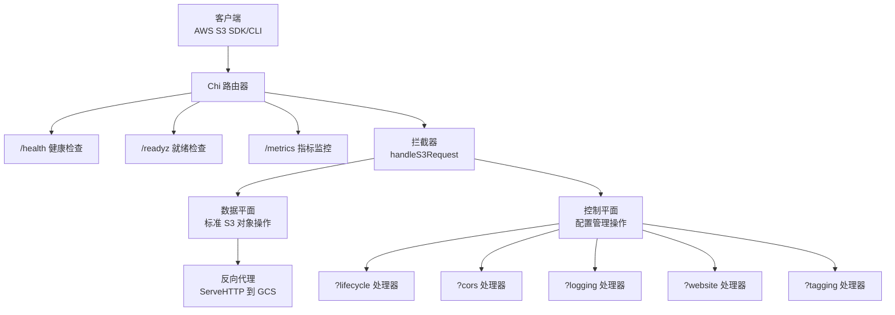
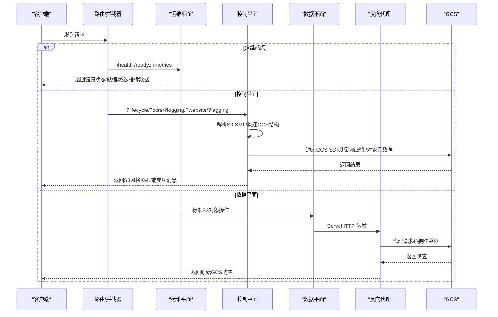
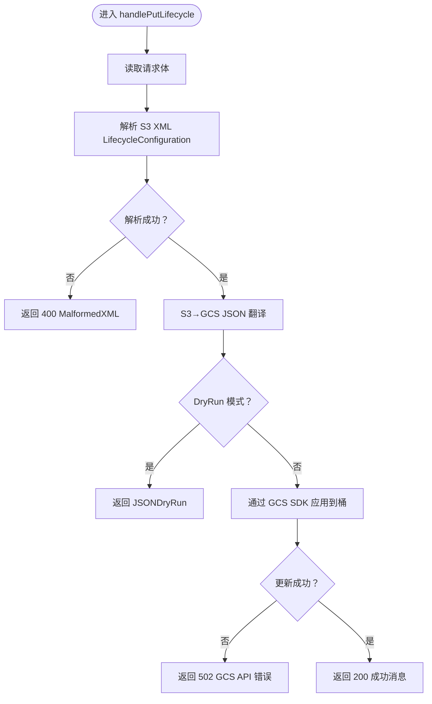
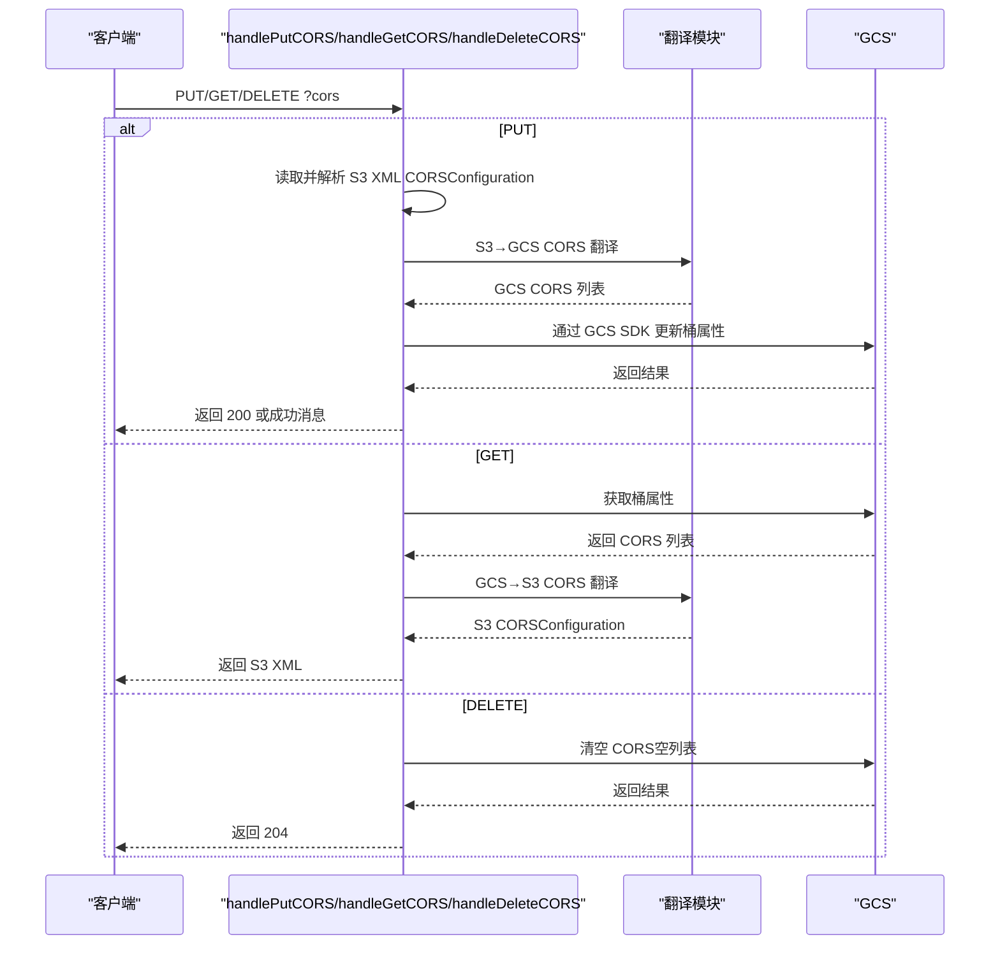
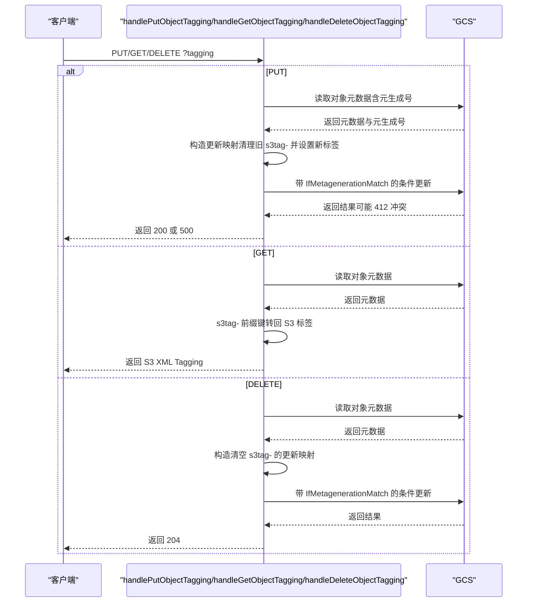
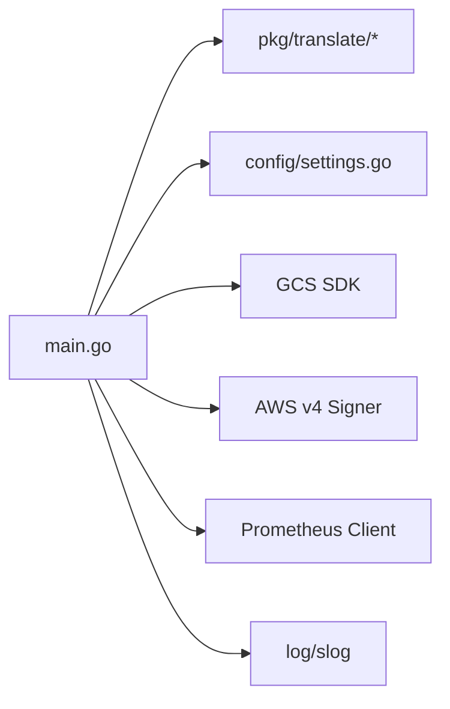

# API参考

<cite>
**本文引用的文件**
- [main.go](file://main.go)
- [README.md](file://README.md)
- [config/settings.go](file://config/settings.go)
- [pkg/translate/s3_cors.go](file://pkg/translate/s3_cors.go)
- [pkg/translate/s3_lifecycle.go](file://pkg/translate/s3_lifecycle.go)
- [pkg/translate/s3_logging.go](file://pkg/translate/s3_logging.go)
- [pkg/translate/s3_tagging.go](file://pkg/translate/s3_tagging.go)
- [pkg/translate/s3_website.go](file://pkg/translate/s3_website.go)
- [pkg/translate/gcs_cors.go](file://pkg/translate/gcs_cors.go)
- [pkg/translate/gcs_lifecycle.go](file://pkg/translate/gcs_lifecycle.go)
- [pkg/translate/gcs_logging.go](file://pkg/translate/gcs_logging.go)
- [pkg/translate/gcs_tagging.go](file://pkg/translate/gcs_tagging.go)
- [pkg/translate/gcs_website.go](file://pkg/translate/gcs_website.go)
- [integration_tests/test_utils.go](file://integration_tests/test_utils.go)
</cite>

## 更新摘要
**所做更改**
- 新增/readyz 就绪检查端点的详细说明
- 增强三层架构分类：数据平面、控制平面、运维平面
- 更新健康检查端点的实现细节和错误处理
- 完善 Prometheus 指标监控和可观测性说明
- 增加实现状态跟踪和架构演进说明
- 优化错误处理策略和调试日志配置

## 目录
1. [简介](#简介)
2. [项目结构](#项目结构)
3. [核心组件](#核心组件)
4. [架构总览](#架构总览)
5. [详细组件分析](#详细组件分析)
6. [依赖分析](#依赖分析)
7. [性能考虑](#性能考虑)
8. [故障排查指南](#故障排查指南)
9. [结论](#结论)
10. [附录](#附录)

## 简介
本文件为 S3Proxy4GCS 的完整 API 参考文档，聚焦于以下公开 HTTP 端点与功能：
- 健康检查：GET /health
- 就绪检查：GET /readyz
- 指标监控：GET /metrics
- 生命周期配置：?lifecycle（PUT/GET/DELETE）
- 跨域资源共享：?cors（PUT/GET/DELETE）
- 日志配置：?logging（PUT/GET/DELETE）
- 网站托管：?website（PUT/GET/DELETE）
- 对象标签：?tagging（PUT/GET/DELETE）

**更新** 新增 /readyz 就绪检查端点，增强三层架构分类，完善可观测性指标监控

文档内容涵盖：
- 每个端点的 HTTP 方法、URL 模式、请求/响应模式
- 认证与签名要求（基于代理对请求进行重签）
- S3 XML 请求格式与 GCS JSON/SDK 类型对照
- 实际请求/响应示例路径与错误处理策略
- Prometheus 指标监控和结构化日志记录

## 项目结构
S3Proxy4GCS 采用"路由拦截 + 反向代理"的混合架构，分为三个清晰的层次：

### 三层架构分类
- **数据平面（Data Plane）**：GET/PUT/DELETE 对象、列出对象等标准 S3 操作，通过反向代理直达 GCS
- **控制平面（Control Plane）**：?lifecycle、?cors、?logging、?website、?tagging 等配置操作，进行 S3 XML 与 GCS SDK 的双向转换
- **运维平面（Operations Plane）**：/health 健康检查、/readyz 就绪检查、/metrics 指标监控

**图表来源**
- [main.go:231-278](file://main.go#L231-L278)
- [main.go:388-473](file://main.go#L388-L473)
- [README.md:89-164](file://README.md#L89-L164)

**章节来源**
- [main.go:231-278](file://main.go#L231-L278)
- [README.md:89-164](file://README.md#L89-L164)

## 核心组件
- **路由与入口**
  - 健康检查：GET /health
  - 就绪检查：GET /readyz（检查 GCS 连接性和目标桶可用性）
  - 指标监控：GET /metrics（Prometheus 格式）
  - 通用 S3 请求捕获：GET/PUT/POST/DELETE/HEAD /*，交由 handleS3Request 分发
- **请求分发与拦截**
  - handleS3Request 根据 URL 查询参数判断是否为生命周期、CORS、Logging、Website 或 Tagging 请求，并调用对应处理器
  - 未匹配的请求默认通过反向代理转发至 GCS
- **可观测性中间件**
  - 结构化 JSON 日志记录（log/slog）
  - Prometheus 指标收集（请求计数、延迟、GCS API 调用时长）
  - 自动识别处理器类型（proxy/lifecycle/cors/logging/website/tagging）

**更新** 新增 /readyz 就绪检查端点和增强的可观测性中间件

**章节来源**
- [main.go:238-268](file://main.go#L238-L268)
- [main.go:328-362](file://main.go#L328-L362)
- [main.go:388-473](file://main.go#L388-L473)

## 架构总览
下图展示从客户端到各处理器再到 GCS 的交互流程，体现三层架构的设计理念。

**图表来源**
- [main.go:238-268](file://main.go#L238-L268)
- [main.go:388-473](file://main.go#L388-L473)
- [main.go:475-498](file://main.go#L475-L498)

**章节来源**
- [main.go:238-268](file://main.go#L238-L268)
- [main.go:388-473](file://main.go#L388-L473)

## 详细组件分析

### 健康检查：GET /health
- **方法**：GET
- **URL**：/health
- **功能**：返回服务可用性状态
- **响应**：
  - 200 OK，正文为"OK"
  - 无需认证
- **使用场景**：容器编排、负载均衡探活
- **实现细节**：直接返回简单文本响应，不涉及 GCS 调用

**章节来源**
- [main.go:239-242](file://main.go#L239-L242)

### 就绪检查：GET /readyz
- **方法**：GET
- **URL**：/readyz
- **功能**：检查服务就绪状态，包括 GCS 连接性和目标桶可用性
- **响应**：
  - 200 OK：`{"status":"ready","mode":"dry_run/live"}`
  - 503 Service Unavailable：`{"status":"not_ready","reason":"错误信息"}`
  - DRY_RUN 模式：始终返回就绪状态
  - LIVE 模式：通过轻量级桶属性查询验证连接
- **使用场景**：Kubernetes 就绪探针、部署前健康检查
- **实现细节**：使用 5 秒超时进行目标桶属性查询，确保 GCS 凭据有效

**新增** 完整的就绪检查端点实现

**章节来源**
- [main.go:244-266](file://main.go#L244-L266)

### 指标监控：GET /metrics
- **方法**：GET
- **URL**：/metrics
- **功能**：返回 Prometheus 格式的指标数据
- **指标类型**：
  - `s3proxy_http_requests_total`：HTTP 请求总数（按方法、处理器、状态码分类）
  - `s3proxy_http_request_duration_seconds`：HTTP 请求持续时间直方图
  - `s3proxy_gcs_api_duration_seconds`：GCS API 调用持续时间直方图
- **使用场景**：Prometheus 监控、性能分析、容量规划
- **实现细节**：通过 observabilityMiddleware 自动收集指标

**更新** 增强可观测性指标监控

**章节来源**
- [main.go:268](file://main.go#L268)
- [main.go:37-64](file://main.go#L37-L64)
- [main.go:328-362](file://main.go#L328-L362)

### 生命周期配置：?lifecycle（PUT/GET/DELETE）
- **方法**：PUT/GET/DELETE
- **URL**：/{bucket}?lifecycle
- **请求体**：
  - PUT：S3 XML LifecycleConfiguration
  - GET/DELETE：无请求体
- **响应**：
  - PUT/GET：返回 S3 XML LifecycleConfiguration
  - DELETE：204 No Content
  - 失败：返回相应状态码；解析失败返回 400 MalformedXML
- **认证**：需具备目标桶写入权限
- **行为说明**：
  - PUT/GET/DELETE 分别对应设置、读取、清除生命周期配置
  - 支持 Expiration（删除）、Transition（存储类别迁移）以及非当前版本过期
  - 不支持的对象尺寸过滤与标签过滤将导致转换错误
- **S3 XML → GCS JSON 映射要点**：
  - Expiration.Days → GCS 条件 Age
  - Expiration.Date → GCS 条件 CreatedBefore（仅取日期部分）
  - Transition.StorageClass → GCS Action.StorageClass（映射 STANDARD_IA→NEARLINE, GLACIER→COLDLINE, DEEP_ARCHIVE→ARCHIVE）
  - 非当前版本过期 → GCS 条件 NumNewerVersions + IsLive=false
- **错误处理**：
  - 解析失败：400 MalformedXML
  - 翻译失败：500 Internal Error
  - GCS 更新失败：502 Bad Gateway

**图表来源**
- [main.go:500-562](file://main.go#L500-L562)
- [pkg/translate/gcs_lifecycle.go:38-105](file://pkg/translate/gcs_lifecycle.go#L38-L105)

**章节来源**
- [main.go:401-413](file://main.go#L401-L413)
- [main.go:500-562](file://main.go#L500-L562)
- [pkg/translate/s3_lifecycle.go:7-78](file://pkg/translate/s3_lifecycle.go#L7-L78)
- [pkg/translate/gcs_lifecycle.go:38-105](file://pkg/translate/gcs_lifecycle.go#L38-L105)

### 跨域资源共享：?cors（PUT/GET/DELETE）
- **方法**：PUT/GET/DELETE
- **URL**：/{bucket}?cors
- **请求体**：
  - PUT：S3 XML CORSConfiguration
  - GET/DELETE：无请求体
- **响应**：
  - PUT/GET：返回 S3 XML CORSConfiguration
  - DELETE：204 No Content
  - 失败：返回相应状态码；解析失败返回 400 MalformedXML
- **认证**：需具备目标桶写入权限
- **行为说明**：
  - PUT/GET/DELETE 分别对应设置、读取、清除 CORS
  - S3 AllowedHeaders（请求头）在 GCS 中不原生支持，会被忽略并记录警告
- **S3 XML → GCS CORS 映射要点**：
  - AllowedMethods → Methods
  - AllowedOrigins → Origins
  - ExposeHeaders → ResponseHeaders
  - MaxAgeSeconds → MaxAge（秒）
- **错误处理**：
  - 解析失败：400 MalformedXML
  - GCS 更新失败：502 Bad Gateway

**图表来源**
- [main.go:415-427](file://main.go#L415-L427)
- [main.go:608-699](file://main.go#L608-L699)
- [pkg/translate/gcs_cors.go:10-61](file://pkg/translate/gcs_cors.go#L10-L61)

**章节来源**
- [main.go:415-427](file://main.go#L415-L427)
- [main.go:608-699](file://main.go#L608-L699)
- [pkg/translate/s3_cors.go:5-19](file://pkg/translate/s3_cors.go#L5-L19)
- [pkg/translate/gcs_cors.go:10-61](file://pkg/translate/gcs_cors.go#L10-L61)

### 日志配置：?logging（PUT/GET/DELETE）
- **方法**：PUT/GET/DELETE
- **URL**：/{bucket}?logging
- **请求体**：
  - PUT：S3 XML BucketLoggingStatus
  - GET/DELETE：无请求体
- **响应**：
  - PUT/GET：返回 S3 XML BucketLoggingStatus
  - DELETE：204 No Content
  - 失败：返回相应状态码；解析失败返回 400 MalformedXML
- **认证**：需具备目标桶写入权限
- **行为说明**：
  - PUT/GET/DELETE 分别对应设置、读取、清除日志
  - GCS 使用 IAM 控制日志投递，S3 的 TargetGrants 在翻译中被忽略
- **S3 XML → GCS 日志映射要点**：
  - TargetBucket → LogBucket
  - TargetPrefix → LogObjectPrefix
- **错误处理**：
  - 解析失败：400 MalformedXML
  - GCS 更新失败：502 Bad Gateway

**章节来源**
- [main.go:429-441](file://main.go#L429-L441)
- [main.go:701-783](file://main.go#L701-L783)
- [pkg/translate/s3_logging.go:5-16](file://pkg/translate/s3_logging.go#L5-L16)
- [pkg/translate/gcs_logging.go:9-35](file://pkg/translate/gcs_logging.go#L9-L35)

### 网站托管：?website（PUT/GET/DELETE）
- **方法**：PUT/GET/DELETE
- **URL**：/{bucket}?website
- **请求体**：
  - PUT：S3 XML WebsiteConfiguration
  - GET/DELETE：无请求体
- **响应**：
  - PUT/GET：返回 S3 XML WebsiteConfiguration
  - DELETE：204 No Content
  - 失败：返回相应状态码；解析失败返回 400 MalformedXML
- **认证**：需具备目标桶写入权限
- **行为说明**：
  - PUT/GET/DELETE 分别对应设置、读取、清除网站托管
  - RoutingRules 等高级路由规则在 GCS 中不原生支持，被忽略
- **S3 XML → GCS 网站映射要点**：
  - IndexDocument.Suffix → MainPageSuffix
  - ErrorDocument.Key → NotFoundPage
- **错误处理**：
  - 解析失败：400 MalformedXML
  - GCS 更新失败：502 Bad Gateway

**章节来源**
- [main.go:443-455](file://main.go#L443-L455)
- [main.go:785-840](file://main.go#L785-L840)
- [pkg/translate/s3_website.go:5-22](file://pkg/translate/s3_website.go#L5-L22)
- [pkg/translate/gcs_website.go:9-26](file://pkg/translate/gcs_website.go#L9-L26)

### 对象标签：?tagging（PUT/GET/DELETE）
- **方法**：PUT/GET/DELETE
- **URL**：/{bucket}/{object}?tagging
- **请求体**：
  - PUT：S3 XML Tagging（TagSet）
  - GET/DELETE：无请求体
- **响应**：
  - PUT：200 OK，正文为成功消息（使用乐观并发控制）
  - GET：返回 S3 XML Tagging
  - DELETE：204 No Content
  - 失败：返回相应状态码；解析失败返回 400 MalformedXML
- **认证**：需具备目标对象读取/写入权限
- **行为说明**：
  - PUT：将现有 s3tag- 前缀键标记为删除，再写入新标签，使用对象元数据的元生成号进行 OCC
  - GET：将 GCS 对象元数据中以 s3tag- 开头的键转回 S3 标签
  - DELETE：清空所有 s3tag- 前缀键
- **S3 XML → GCS 元数据映射要点**：
  - Tag.Key → s3tag-Key
  - Tag.Value → 值
- **错误处理**：
  - 解析失败：400 MalformedXML
  - OCC 冲突或 GCS 更新失败：返回 500 Internal Error（可能提示 412 冲突）

**图表来源**
- [main.go:457-469](file://main.go#L457-L469)
- [main.go:841-900](file://main.go#L841-L900)
- [pkg/translate/gcs_tagging.go:10-47](file://pkg/translate/gcs_tagging.go#L10-L47)

**章节来源**
- [main.go:457-469](file://main.go#L457-L469)
- [main.go:841-900](file://main.go#L841-L900)
- [pkg/translate/s3_tagging.go:5-9](file://pkg/translate/s3_tagging.go#L5-L9)
- [pkg/translate/gcs_tagging.go:10-47](file://pkg/translate/gcs_tagging.go#L10-L47)

## 依赖分析
- **组件耦合**
  - 主程序通过 Chi 路由器集中管理入口与拦截逻辑
  - 各处理器依赖 pkg/translate 包进行 S3 与 GCS 数据结构之间的双向转换
  - 反向代理负责标准对象操作的透明转发，并在需要时对请求进行重签
  - 可观测性中间件提供统一的日志记录和指标收集
- **外部依赖**
  - GCS 官方 Go SDK 用于桶属性与对象元数据的读写
  - AWS SDK v4 签名器用于对请求进行重新签名
  - Prometheus 客户端库用于指标收集
  - log/slog 用于结构化日志记录
- **配置依赖**
  - config/settings.go 提供运行时配置（端口、目标桶、DryRun、连接池、代理凭据等）

**图表来源**
- [main.go:31-32](file://main.go#L31-L32)
- [config/settings.go:11-25](file://config/settings.go#L11-L25)

**章节来源**
- [main.go:31-32](file://main.go#L31-L32)
- [config/settings.go:11-25](file://config/settings.go#L11-L25)

## 性能考虑
- **连接池与超时**
  - 反向代理传输层配置了最大空闲连接数与每主机空闲连接数、空闲超时、TLS 握手与期望继续超时，启用 HTTP/2 以提升多路复用
  - 连接池大小可通过 MAX_IDLE_CONNS 和 MAX_IDLE_CONNS_PER_HOST 配置
- **重签策略**
  - 仅在检测到存储类别变更、x-id 参数或显式指定的编码时触发重签，避免不必要的签名开销
  - 支持 Accept-Encoding: identity 的自动修复
- **可观测性与监控**
  - 使用结构化 JSON 日志，支持 DEBUG_LOGGING 级别切换，便于生产环境观测
  - Prometheus 指标自动收集，包括请求计数、延迟分布、GCS API 调用时长
- **DryRun 模式**
  - 完全禁用真实 GCS API 调用，仅用于本地开发和测试

**更新** 增强可观测性指标监控和性能优化

**章节来源**
- [main.go:112-124](file://main.go#L112-L124)
- [main.go:190-215](file://main.go#L190-L215)
- [main.go:374-386](file://main.go#L374-L386)
- [config/settings.go:36-56](file://config/settings.go#L36-L56)

## 故障排查指南
- **常见错误与定位**
  - 400 MalformedXML：S3 XML 解析失败，检查请求体格式与字段完整性
  - 500 Internal Error：翻译或 OCC 冲突（对象标签），检查目标对象是否存在且元生成号是否正确
  - 502 Bad Gateway：GCS API 调用失败，检查网络连通性与凭据配置
  - 503 Service Unavailable：/readyz 检查失败，检查 GCS 凭据和目标桶权限
- **调试建议**
  - 启用 DEBUG_LOGGING 查看请求/响应头与重签行为
  - 使用 DRY_RUN 模式验证转换逻辑与路径拼接
  - 检查 /metrics 端点确认指标正常收集
  - 使用 /readyz 端点验证 GCS 连接状态
  - 结合集成测试工具获取真实桶名与前缀配置

**更新** 新增 /readyz 故障排查指导

**章节来源**
- [main.go:742-746](file://main.go#L742-L746)
- [config/settings.go:36-56](file://config/settings.go#L36-L56)
- [integration_tests/test_utils.go:9-60](file://integration_tests/test_utils.go#L9-L60)

## 结论
S3Proxy4GCS 通过统一的三层架构设计，将 S3 XML 配置能力映射到 GCS 的 JSON/SDK 接口，覆盖生命周期、CORS、日志、网站托管与对象标签等关键能力。新增的 /readyz 就绪检查端点和增强的可观测性监控进一步提升了系统的可靠性和可维护性。配合反向代理与重签机制，确保与 GCS 的兼容性与稳定性。建议在生产环境中结合 DryRun 与调试日志进行充分验证，并合理配置连接池与凭据以获得最佳性能与可靠性。

## 附录

### S3 XML 与 GCS JSON/SDK 类型对照表

- **生命周期（Lifecycle）**
  - S3 XML：LifecycleConfiguration → Rule → Expiration/Transition/NoncurrentVersionExpiration
  - GCS JSON：GCSLifecycle → GCSLifecycleRule → GCSLifecycleAction/GCSLifecycleCondition
  - 映射要点：Expiration.Days/Date → GCS Age/CreatedBefore；Transition.StorageClass → GCS Action.StorageClass；非当前版本过期 → GCS NumNewerVersions + IsLive=false
  - 不支持：对象尺寸过滤、标签过滤

- **CORS**
  - S3 XML：CORSConfiguration → CORSRule（AllowedMethods/AllowedOrigins/ExposeHeaders/MaxAgeSeconds）
  - GCS CORS：storage.CORS（Methods/Origins/ResponseHeaders/MaxAge）
  - 映射要点：AllowedHeaders 在 GCS 不原生支持，将被忽略

- **日志**
  - S3 XML：BucketLoggingStatus → LoggingEnabled（TargetBucket/TargetPrefix）
  - GCS：storage.BucketLogging（LogBucket/LogObjectPrefix）

- **网站托管**
  - S3 XML：WebsiteConfiguration → IndexDocument/ErrorDocument
  - GCS：storage.BucketWebsite（MainPageSuffix/NotFoundPage）

- **对象标签**
  - S3 XML：Tagging → TagSet（Tag.Key/Value）
  - GCS：对象元数据（以 s3tag- 为前缀的键值）

**更新** 完善三层架构分类和实现状态跟踪

**章节来源**
- [pkg/translate/s3_lifecycle.go:7-78](file://pkg/translate/s3_lifecycle.go#L7-L78)
- [pkg/translate/gcs_lifecycle.go:10-105](file://pkg/translate/gcs_lifecycle.go#L10-L105)
- [pkg/translate/s3_cors.go:5-19](file://pkg/translate/s3_cors.go#L5-L19)
- [pkg/translate/gcs_cors.go:10-61](file://pkg/translate/gcs_cors.go#L10-L61)
- [pkg/translate/s3_logging.go:5-16](file://pkg/translate/s3_logging.go#L5-L16)
- [pkg/translate/gcs_logging.go:9-35](file://pkg/translate/gcs_logging.go#L9-L35)
- [pkg/translate/s3_website.go:5-22](file://pkg/translate/s3_website.go#L5-L22)
- [pkg/translate/gcs_website.go:9-26](file://pkg/translate/gcs_website.go#L9-L26)
- [pkg/translate/s3_tagging.go:5-9](file://pkg/translate/s3_tagging.go#L5-L9)
- [pkg/translate/gcs_tagging.go:8-47](file://pkg/translate/gcs_tagging.go#L8-L47)