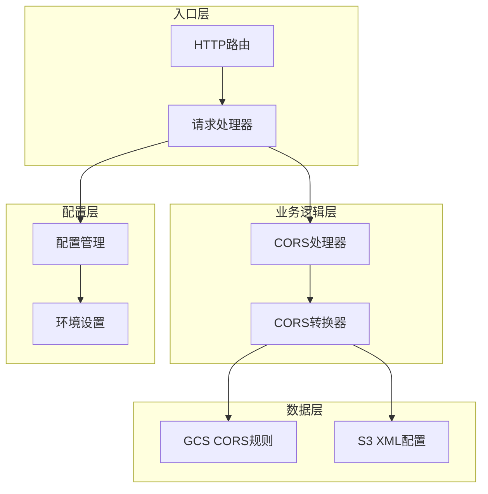
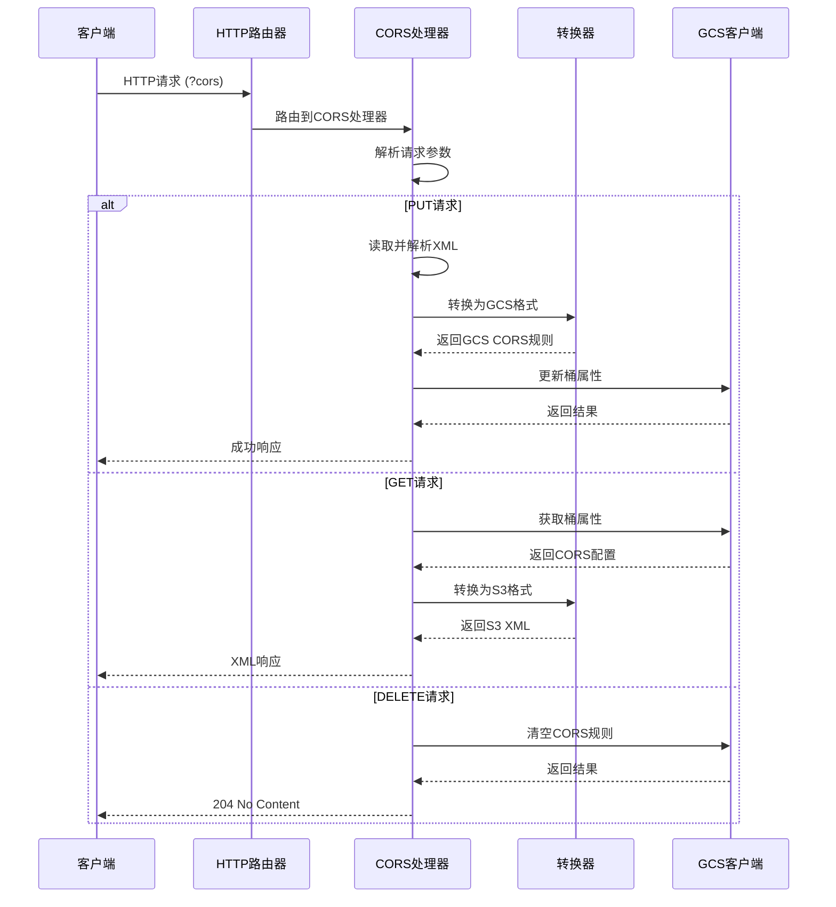
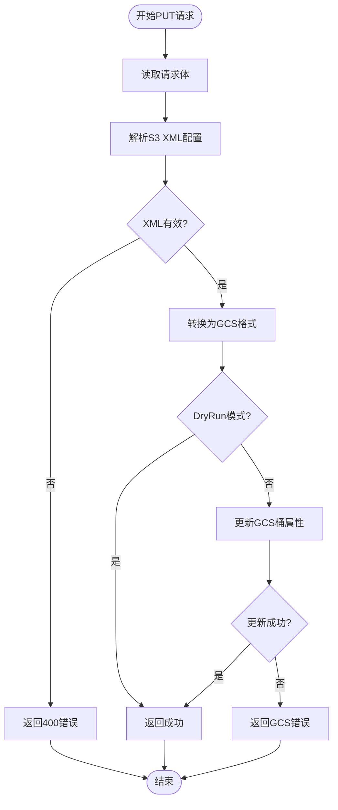
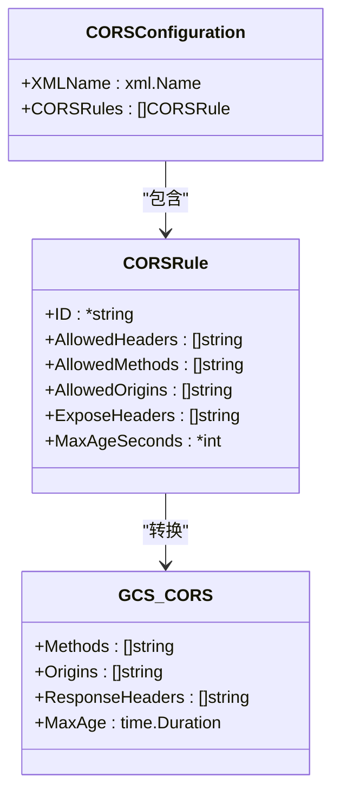
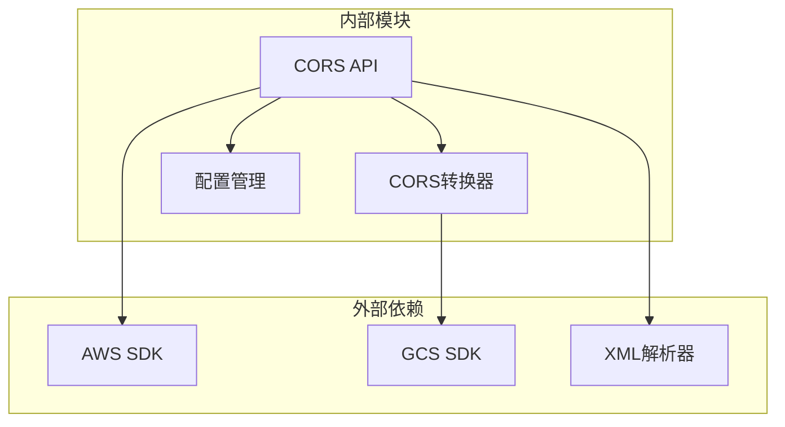

# CORS配置API

<cite>
**本文档引用的文件**
- [main.go](file://main.go)
- [s3_cors.go](file://pkg/translate/s3_cors.go)
- [gcs_cors.go](file://pkg/translate/gcs_cors.go)
- [gcs_cors_test.go](file://pkg/translate/gcs_cors_test.go)
- [cors_test.go](file://integration_tests/cors_test.go)
- [settings.go](file://config/settings.go)
- [README.md](file://README.md)
</cite>

## 目录
1. [简介](#简介)
2. [项目结构](#项目结构)
3. [核心组件](#核心组件)
4. [架构概览](#架构概览)
5. [详细组件分析](#详细组件分析)
6. [依赖关系分析](#依赖关系分析)
7. [性能考虑](#性能考虑)
8. [故障排除指南](#故障排除指南)
9. [结论](#结论)

## 简介

S3Proxy4GCS的CORS配置API提供了对Google Cloud Storage（GCS）CORS规则的完整支持，通过标准的AWS S3 CORS XML配置格式进行操作。该API实现了三个核心端点：`PUT ?cors`、`GET ?cors`和`DELETE ?cors`，能够实现S3 XML CORS配置与GCS CORS规则之间的双向转换。

该实现特别关注了S3与GCS在CORS支持上的差异，特别是S3允许请求头（AllowedHeaders）在GCS中不被原生支持的问题，提供了明确的警告和处理机制。

## 项目结构

S3Proxy4GCS采用模块化架构设计，CORS功能分布在多个关键组件中：



**图表来源**
- [main.go:254-338](file://main.go#L254-L338)
- [main.go:461-540](file://main.go#L461-L540)

**章节来源**
- [main.go:198-338](file://main.go#L198-L338)
- [README.md:140-157](file://README.md#L140-L157)

## 核心组件

### S3 CORS数据模型

S3 CORS配置使用标准的XML格式定义，包含以下核心元素：

- **CORSConfiguration**: 顶级容器元素
- **CORSRule**: 单个CORS规则定义
- **AllowedMethods**: 允许的HTTP方法列表
- **AllowedOrigins**: 允许的源列表
- **AllowedHeaders**: 允许的请求头（GCS不支持）
- **ExposeHeaders**: 暴露的响应头
- **MaxAgeSeconds**: 预检请求缓存时间

### GCS CORS数据模型

GCS使用Go SDK的结构体表示CORS规则：

- **storage.CORS**: GCS CORS规则结构
- **Methods**: HTTP方法数组
- **Origins**: 源数组
- **ResponseHeaders**: 响应头数组
- **MaxAge**: 最大年龄（time.Duration）

**章节来源**
- [s3_cors.go:5-19](file://pkg/translate/s3_cors.go#L5-L19)
- [gcs_cors.go:10-35](file://pkg/translate/gcs_cors.go#L10-L35)

## 架构概览

CORS配置API采用分层架构，实现了从HTTP请求到GCS API调用的完整流程：



**图表来源**
- [main.go:280-292](file://main.go#L280-L292)
- [main.go:461-540](file://main.go#L461-L540)

## 详细组件分析

### CORS处理器实现

#### PUT ?cors 处理器

PUT请求用于设置桶的CORS配置，实现步骤如下：

1. **请求读取**: 从HTTP请求体读取原始数据
2. **XML解析**: 使用标准XML解析器解析S3 CORS配置
3. **验证检查**: 确保XML格式正确且符合S3规范
4. **格式转换**: 将S3 XML配置转换为GCS存储格式
5. **GCS更新**: 通过GCS SDK更新桶属性
6. **响应返回**: 返回成功状态或错误信息



**图表来源**
- [main.go:461-504](file://main.go#L461-L504)

#### GET ?cors 处理器

GET请求用于检索当前的CORS配置：

1. **属性获取**: 从GCS获取桶的当前属性
2. **格式转换**: 将GCS CORS配置转换为S3 XML格式
3. **响应构建**: 设置适当的HTTP头和状态码
4. **XML输出**: 编码并返回S3兼容的XML配置

#### DELETE ?cors 处理器

DELETE请求用于移除所有CORS规则：

1. **属性更新**: 设置空的CORS规则数组
2. **GCS调用**: 通过GCS SDK执行更新操作
3. **状态返回**: 返回204 No Content状态

**章节来源**
- [main.go:461-540](file://main.go#L461-L540)

### CORS转换器实现

#### S3到GCS转换

转换器负责将S3 XML CORS配置转换为GCS存储格式，主要处理以下映射关系：

| S3字段 | GCS字段 | 处理方式 |
|--------|---------|----------|
| AllowedMethods | Methods | 直接映射 |
| AllowedOrigins | Origins | 直接映射 |
| ExposeHeaders | ResponseHeaders | 直接映射 |
| MaxAgeSeconds | MaxAge | 转换为time.Duration |
| AllowedHeaders | 不支持 | 记录警告并忽略 |



**图表来源**
- [s3_cors.go:5-19](file://pkg/translate/s3_cors.go#L5-L19)
- [gcs_cors.go:10-35](file://pkg/translate/gcs_cors.go#L10-L35)

#### GCS到S3转换

反向转换将GCS CORS配置转换为S3 XML格式：

1. **空规则检查**: 如果GCS没有CORS规则，返回空的S3配置
2. **字段映射**: 将GCS字段映射到S3 XML结构
3. **时间转换**: 将time.Duration转换为秒数
4. **XML生成**: 使用标准XML编码器生成响应

**章节来源**
- [gcs_cors.go:37-61](file://pkg/translate/gcs_cors.go#L37-L61)

### 错误处理机制

系统实现了标准的S3错误响应格式，确保与AWS SDK的兼容性：

- **MalformedXML**: XML格式无效时返回
- **InternalError**: 内部服务器错误
- **NoSuchLifecycleConfiguration**: 配置不存在时返回
- **StatusBadGateway**: GCS API调用失败时返回

错误响应遵循S3标准格式：
```xml
<?xml version="1.0" encoding="UTF-8"?>
<Error>
    <Code>错误代码</Code>
    <Message>错误描述</Message>
</Error>
```

**章节来源**
- [main.go:833-837](file://main.go#L833-L837)

## 依赖关系分析

CORS配置API的依赖关系相对简单，主要涉及以下模块：



**图表来源**
- [main.go:32-30](file://main.go#L32-L30)
- [gcs_cors.go:3-8](file://pkg/translate/gcs_cors.go#L3-L8)

**章节来源**
- [main.go:32-30](file://main.go#L32-L30)
- [gcs_cors.go:3-8](file://pkg/translate/gcs_cors.go#L3-L8)

## 性能考虑

### 连接池优化

代理使用经过优化的HTTP连接池配置：

- **最大空闲连接**: 默认1000个
- **每主机最大空闲连接**: 默认1000个
- **空闲连接超时**: 90秒
- **TLS握手超时**: 10秒
- **期望继续超时**: 1秒

### 请求重定向

为了支持本地开发，系统提供了灵活的请求重定向机制：

- **DialContext**: 自定义网络拨号器
- **条件重定向**: 仅重定向到GCS的流量
- **透明代理**: 对客户端完全透明

**章节来源**
- [main.go:79-91](file://main.go#L79-L91)
- [cors_test.go:19-27](file://integration_tests/cors_test.go#L19-L27)

## 故障排除指南

### 常见问题诊断

#### CORS配置不生效

1. **检查源匹配**: 确保AllowedOrigins与实际请求的源完全匹配
2. **验证方法列表**: 确认AllowedMethods包含实际使用的HTTP方法
3. **检查预检缓存**: 验证MaxAgeSeconds设置是否合理

#### 跨域请求失败

1. **查看日志**: 启用DEBUG_LOGGING获取详细请求信息
2. **验证凭据**: 确保JSON_KEY配置正确
3. **检查权限**: 验证服务账号具有适当的GCS权限

#### 预检请求处理

系统自动处理OPTIONS预检请求，无需额外配置。预检请求的响应头会包含适当的CORS信息。

### 调试技巧

#### 启用详细日志

```bash
DEBUG_LOGGING=true
DRY_RUN=true
```

#### 测试工具

使用集成测试套件验证CORS配置：

```bash
cd integration_tests
go test -v ./cors_test.go
```

**章节来源**
- [settings.go:36-56](file://config/settings.go#L36-L56)
- [cors_test.go:18-111](file://integration_tests/cors_test.go#L18-L111)

## 结论

S3Proxy4GCS的CORS配置API提供了完整的S3到GCS CORS规则转换功能，具有以下特点：

1. **完整的API覆盖**: 支持PUT、GET、DELETE三种操作
2. **双向转换**: 实现S3 XML与GCS格式的双向映射
3. **错误处理**: 提供标准的S3错误响应格式
4. **性能优化**: 使用高效的连接池和请求重定向
5. **易于调试**: 提供详细的日志和测试工具

该实现特别注意了S3与GCS在CORS支持上的差异，特别是AllowedHeaders字段的处理，为用户提供清晰的警告信息和最佳实践建议。