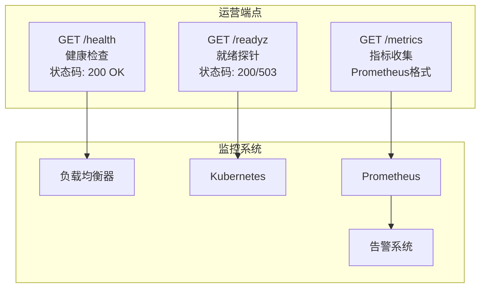
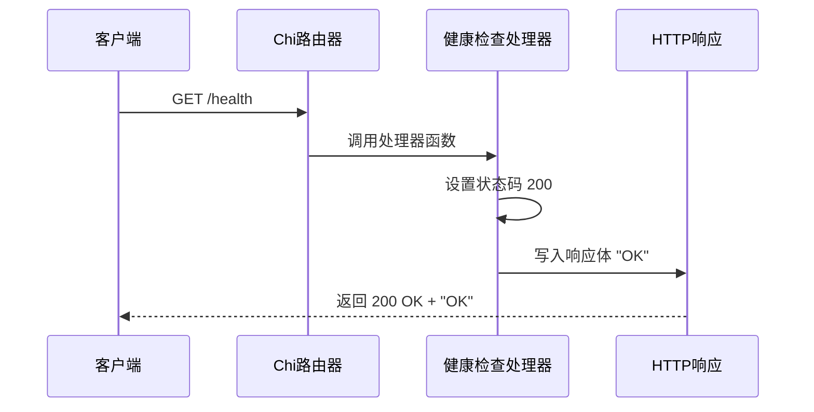
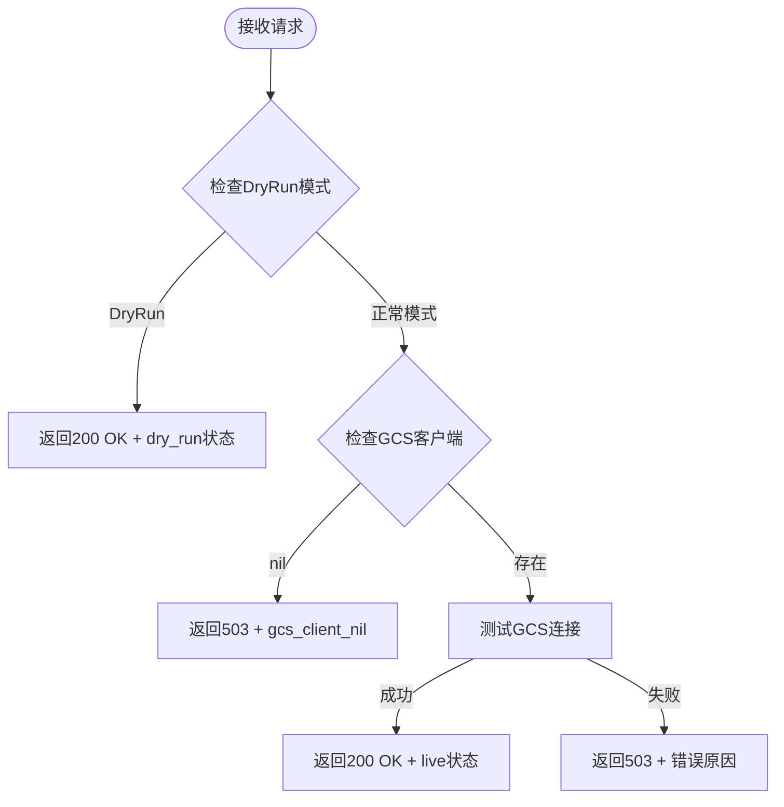
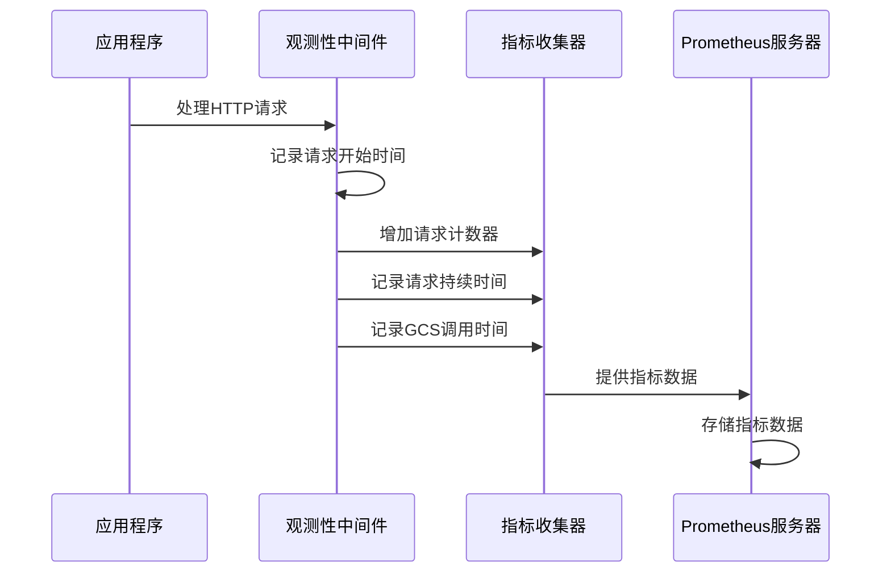
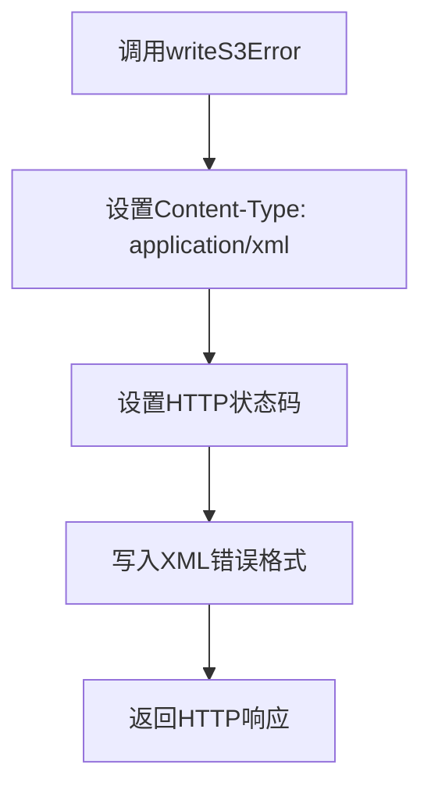
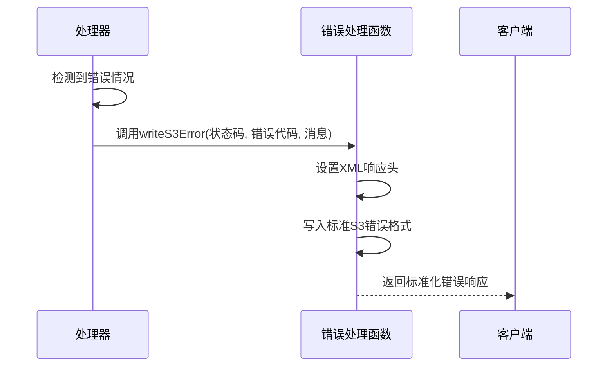

# 健康检查端点

<cite>
**本文档引用的文件**
- [main.go](file://main.go)
- [README.md](file://README.md)
- [config/settings.go](file://config/settings.go)
- [go.mod](file://go.mod)
</cite>

## 更新摘要
**变更内容**
- 新增就绪探针端点(/readyz)的详细文档
- 新增指标端点(/metrics)的完整说明
- 更新统一错误处理机制的描述
- 扩展监控和运维场景的应用指南
- 增强与Prometheus监控系统的集成说明

## 目录
1. [简介](#简介)
2. [运营端点概览](#运营端点概览)
3. [健康检查端点](#健康检查端点)
4. [就绪探针端点](#就绪探针端点)
5. [指标端点](#指标端点)
6. [统一错误处理机制](#统一错误处理机制)
7. [监控集成指南](#监控集成指南)
8. [最佳实践](#最佳实践)
9. [故障排除](#故障排除)
10. [总结](#总结)

## 简介

S3Proxy4GCS是一个中间件代理，用于在AWS S3兼容客户端SDK与Google Cloud Storage (GCS)之间进行桥接。该项目实现了三个关键的运营端点：`GET /health`（健康检查）、`GET /readyz`（就绪探针）和`GET /metrics`（指标收集），这些端点为服务健康状态监控、负载均衡器健康检查、容器编排系统监控和Prometheus指标收集提供了完整的支持。

## 运营端点概览

S3Proxy4GCS提供三个专门的运营端点，用于不同的监控和运维场景：



**图表来源**
- [main.go:238-268](file://main.go#L238-L268)
- [README.md:100-104](file://README.md#L100-L104)

## 健康检查端点

### 技术规格

#### HTTP端点定义
- **方法**: GET
- **路径**: `/health`
- **协议**: HTTP/1.1
- **内容类型**: text/plain
- **字符集**: UTF-8

#### 响应规范

| 元素 | 规范 |
|------|------|
| 状态码 | 200 OK |
| 响应体 | "OK" 字符串 |
| 编码格式 | ASCII |
| 内容长度 | 2字节 |

#### 请求处理流程



**图表来源**
- [main.go:239-242](file://main.go#L239-L242)

### 应用场景

健康检查端点适用于以下场景：
- **负载均衡器健康检查**: 简单的可达性检测
- **容器编排系统**: Kubernetes Liveness Probe的基础检查
- **CI/CD流水线**: 部署后的快速验证
- **监控系统**: 基础可用性监控

**章节来源**
- [main.go:239-242](file://main.go#L239-L242)

## 就绪探针端点

### 技术规格

#### HTTP端点定义
- **方法**: GET
- **路径**: `/readyz`
- **协议**: HTTP/1.1
- **内容类型**: application/json
- **字符集**: UTF-8

#### 响应规范

| 元素 | 规范 |
|------|------|
| 状态码 | 200 OK 或 503 Service Unavailable |
| 响应体 | JSON格式的就绪状态信息 |
| 编码格式 | UTF-8 |

#### 响应类型

**Dry Run模式响应**:
```json
{
  "status": "ready",
  "mode": "dry_run"
}
```

**正常模式响应**:
```json
{
  "status": "ready",
  "mode": "live"
}
```

**就绪失败响应**:
```json
{
  "status": "not_ready",
  "reason": "gcs_client_nil"
}
```

#### 请求处理流程



**图表来源**
- [main.go:244-266](file://main.go#L244-L266)

### 应用场景

就绪探针端点适用于以下场景：
- **容器编排系统**: Kubernetes Readiness Probe的就绪检查
- **服务网格**: 确保服务完全初始化后再接受流量
- **微服务架构**: 验证依赖服务的可用性
- **蓝绿部署**: 部署新版本前的完整性检查

**章节来源**
- [main.go:244-266](file://main.go#L244-L266)

## 指标端点

### 技术规格

#### HTTP端点定义
- **方法**: GET
- **路径**: `/metrics`
- **协议**: HTTP/1.1
- **内容类型**: application/openmetrics-text
- **字符集**: UTF-8

#### 指标类型

**HTTP请求指标**:
- `s3proxy_http_requests_total`: 总HTTP请求数量
  - 标签: method, handler, status
- `s3proxy_http_request_duration_seconds`: HTTP请求持续时间直方图
  - 标签: method, handler

**GCS API指标**:
- `s3proxy_gcs_api_duration_seconds`: GCS API调用持续时间直方图
  - 标签: operation

#### Prometheus集成

```mermaid
graph LR
Prom[Prometheus] --> Metrics[/metrics端点]
Metrics --> Exporter[Prometheus HTTP Exporter]
Exporter --> MetricsCollector[指标收集器]
MetricsCollector --> HTTPMetrics[HTTP指标]
MetricsCollector --> GCSCallMetrics[GCS调用指标]
HTTPMetrics --> Grafana[Grafana仪表板]
GCSCallMetrics --> Grafana
```

**图表来源**
- [main.go:39-68](file://main.go#L39-L68)
- [main.go:268](file://main.go#L268)

### 指标收集机制



**图表来源**
- [main.go:328-362](file://main.go#L328-L362)

**章节来源**
- [main.go:39-68](file://main.go#L39-L68)
- [main.go:268](file://main.go#L268)
- [main.go:328-362](file://main.go#L328-L362)

## 统一错误处理机制

### 错误响应格式

所有错误响应都遵循统一的S3 XML错误格式：

```xml
<?xml version="1.0" encoding="UTF-8"?>
<Error>
  <Code>错误代码</Code>
  <Message>错误消息</Message>
</Error>
```

### 错误处理函数

统一的错误处理函数`writeS3Error`负责生成标准的S3错误响应：



**图表来源**
- [main.go:1018-1022](file://main.go#L1018-L1022)

### 错误处理流程



**图表来源**
- [main.go:1018-1022](file://main.go#L1018-L1022)

**章节来源**
- [main.go:1018-1022](file://main.go#L1018-L1022)

## 监控集成指南

### Kubernetes集成

#### 基本配置

```yaml
apiVersion: v1
kind: Pod
metadata:
  name: s3proxy4gcs
spec:
  containers:
  - name: s3proxy4gcs
    image: s3proxy4gcs:latest
    ports:
    - containerPort: 8080
    livenessProbe:
      httpGet:
        path: /health
        port: 8080
      initialDelaySeconds: 5
      periodSeconds: 10
    readinessProbe:
      httpGet:
        path: /readyz
        port: 8080
      initialDelaySeconds: 5
      periodSeconds: 5
```

#### Prometheus集成

```yaml
apiVersion: monitoring.coreos.com/v1
kind: ServiceMonitor
metadata:
  name: s3proxy4gcs
spec:
  selector:
    matchLabels:
      app: s3proxy4gcs
  endpoints:
  - port: http
    path: /metrics
    interval: 15s
```

### 负载均衡器配置

#### AWS ALB配置

```yaml
- Type: HTTP
  TargetGroup:
    Protocol: HTTP
    Port: 8080
    Targets:
      - InstanceId: i-1234567890abcdef0
        Port: 8080
  HealthCheck:
    Path: /health
    Interval: 30
    Timeout: 5
    HealthyThresholdCount: 2
    UnhealthyThresholdCount: 2
```

### 监控仪表板

#### Prometheus查询示例

```promql
# HTTP请求成功率
100 - (sum(rate(s3proxy_http_requests_total{status=~"5.."}[5m])) / sum(rate(s3proxy_http_requests_total[5m])) * 100)

# 平均请求延迟
rate(s3proxy_http_request_duration_seconds_sum[5m]) / rate(s3proxy_http_request_duration_seconds_count[5m])

# GCS API调用成功率
100 - (sum(rate(s3proxy_gcs_api_duration_seconds_count{result="error"}[5m])) / sum(rate(s3proxy_gcs_api_duration_seconds_count[5m])) * 100)
```

**章节来源**
- [README.md:100-104](file://README.md#L100-L104)

## 最佳实践

### 健康检查配置

#### 推荐的探针配置

```yaml
livenessProbe:
  httpGet:
    path: /health
    port: 8080
  initialDelaySeconds: 30
  periodSeconds: 10
  timeoutSeconds: 3
  failureThreshold: 3

readinessProbe:
  httpGet:
    path: /readyz
    port: 8080
  initialDelaySeconds: 30
  periodSeconds: 5
  timeoutSeconds: 3
  failureThreshold: 3
```

### 指标监控

#### 关键指标监控

```promql
# 请求速率
rate(s3proxy_http_requests_total[5m])

# 错误率
sum(rate(s3proxy_http_requests_total{status=~"5.."}[5m])) / sum(rate(s3proxy_http_requests_total[5m]))

# P95延迟
histogram_quantile(0.95, sum by(le, method, handler) (rate(s3proxy_http_request_duration_seconds_bucket[5m])))
```

### 日志记录

#### 结构化日志配置

```json
{
  "level": "info",
  "time": "2023-01-01T00:00:00Z",
  "message": "HTTP request completed",
  "request_id": "abc123",
  "method": "GET",
  "uri": "/health",
  "status": 200,
  "duration_ms": 1,
  "content_length": 2,
  "handler": "proxy"
}
```

## 故障排除

### 常见问题诊断

#### /health端点故障

**症状**: 返回非200状态码

**可能原因**:
1. 服务器未启动
2. 端口被占用
3. 防火墙阻止访问
4. 负载均衡器配置错误

**解决方案**:
1. 检查服务器日志输出
2. 验证端口监听状态
3. 测试本地网络连通性
4. 验证负载均衡器规则

#### /readyz端点故障

**症状**: 返回503 Service Unavailable

**可能原因**:
1. GCS客户端初始化失败
2. GCS连接超时
3. 目标桶不存在
4. 认证凭据无效

**解决方案**:
1. 检查GCS凭据配置
2. 验证网络连接
3. 测试GCS API访问
4. 查看详细错误信息

#### /metrics端点故障

**症状**: Prometheus无法抓取指标

**可能原因**:
1. Prometheus配置错误
2. 网络访问权限问题
3. 指标注册失败
4. 内存不足

**解决方案**:
1. 验证Prometheus配置
2. 检查防火墙规则
3. 查看应用启动日志
4. 监控系统资源使用

### curl命令示例

#### 健康检查
```bash
curl -s http://localhost:8080/health
# 输出: OK
```

#### 就绪探针
```bash
curl -s http://localhost:8080/readyz
# DryRun模式输出: {"status":"ready","mode":"dry_run"}
# 正常模式输出: {"status":"ready","mode":"live"}
```

#### 指标收集
```bash
curl -s http://localhost:8080/metrics
# 输出: Prometheus指标格式
```

**章节来源**
- [main.go:239-266](file://main.go#L239-L266)

## 总结

S3Proxy4GCS的运营端点系统提供了完整的监控和运维支持：

### 核心优势

1. **健康检查端点** (`/health`): 简单可靠的可达性检测
2. **就绪探针端点** (`/readyz`): 智能的就绪状态检查，支持GCS连接验证
3. **指标端点** (`/metrics`): 完整的Prometheus指标收集
4. **统一错误处理**: 标准化的S3错误响应格式

### 部署价值

- **容器编排**: 完美支持Kubernetes等容器平台
- **监控系统**: 与Prometheus、Grafana等监控工具无缝集成
- **负载均衡**: 为各种负载均衡器提供标准的健康检查接口
- **可观测性**: 提供丰富的指标和日志信息

### 技术特性

- **高性能**: 指标收集几乎无额外开销
- **可靠性**: 统一的错误处理机制
- **可扩展**: 支持多种监控和运维场景
- **易集成**: 符合标准协议和格式

该运营端点系统为S3Proxy4GCS提供了企业级的监控和运维能力，是构建可靠云原生服务的重要基础设施。