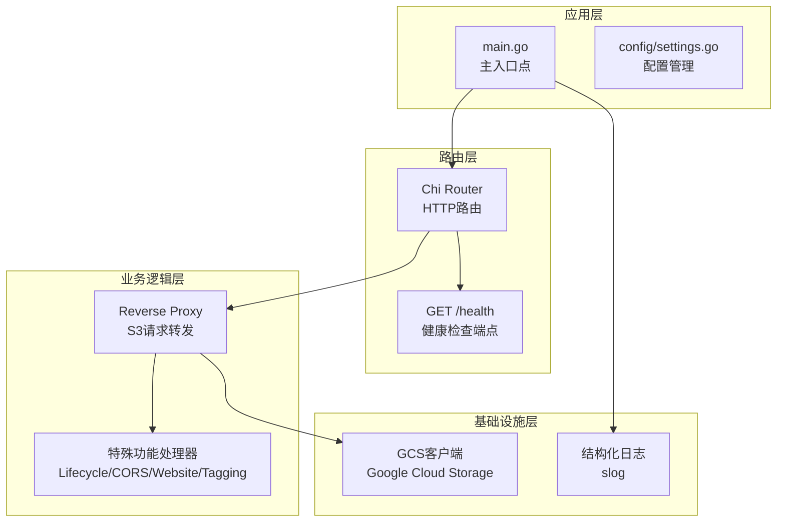
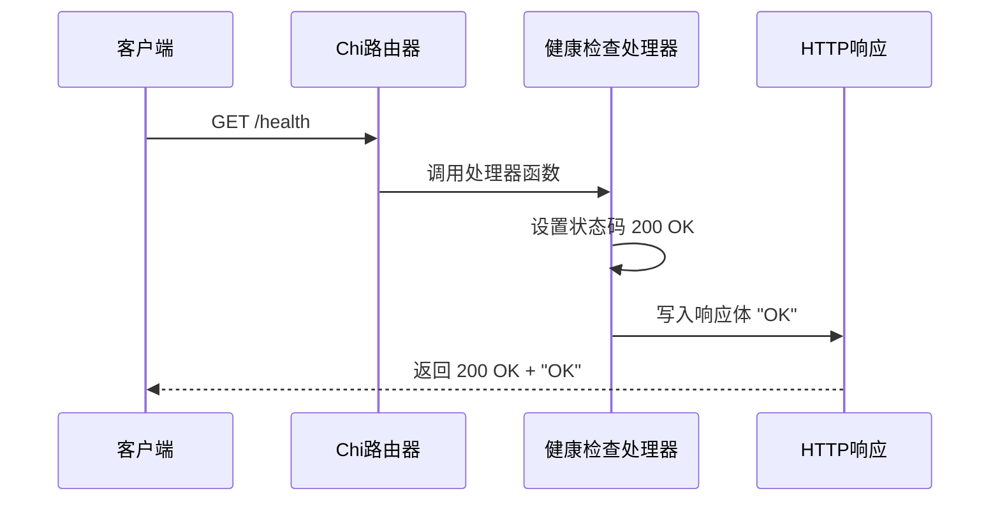
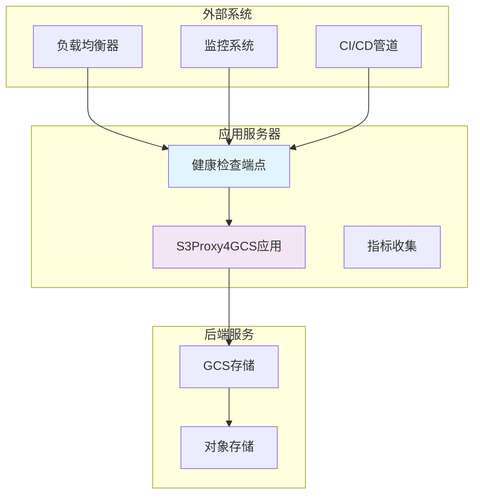
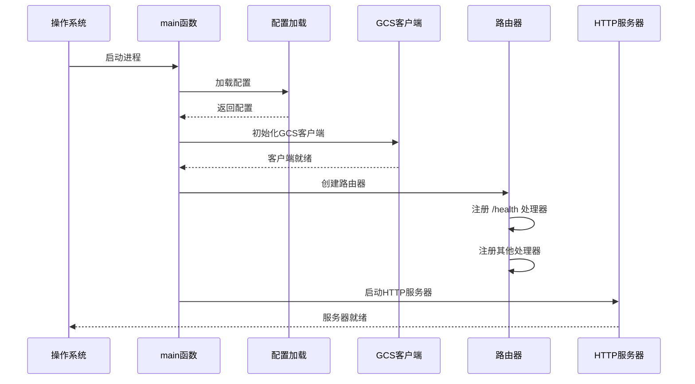
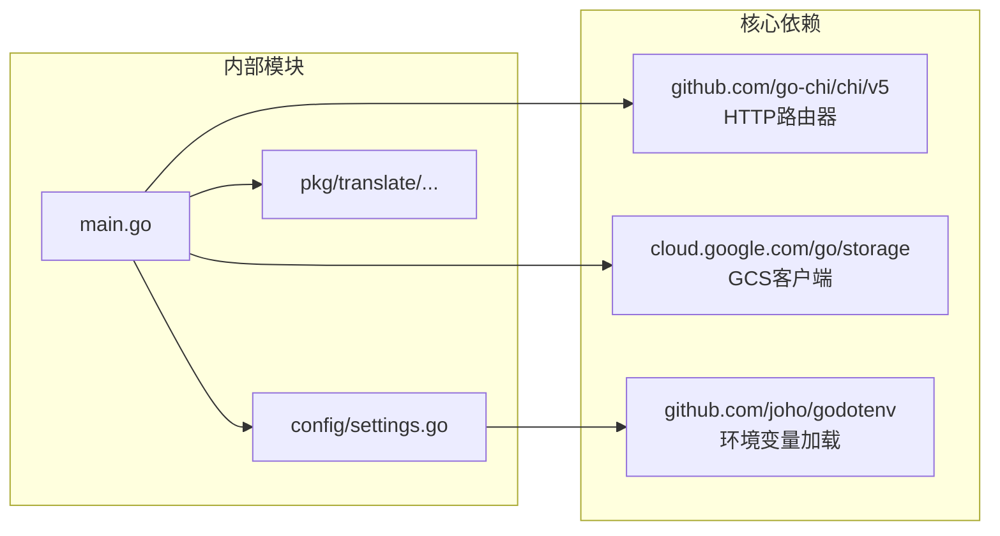
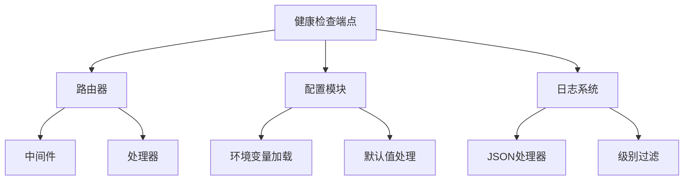

# 健康检查端点

<cite>
**本文档引用的文件**
- [main.go](file://main.go)
- [README.md](file://README.md)
- [config/settings.go](file://config/settings.go)
- [solutions.md](file://solutions.md)
- [go.mod](file://go.mod)
</cite>

## 目录
1. [简介](#简介)
2. [项目结构](#项目结构)
3. [核心组件](#核心组件)
4. [架构概览](#架构概览)
5. [详细组件分析](#详细组件分析)
6. [依赖关系分析](#依赖关系分析)
7. [性能考虑](#性能考虑)
8. [故障排除指南](#故障排除指南)
9. [结论](#结论)

## 简介

S3Proxy4GCS是一个中间件代理，用于在AWS S3兼容客户端SDK与Google Cloud Storage (GCS)之间进行桥接。该项目实现了标准的健康检查端点`GET /health`，该端点返回简单的"OK"字符串响应，状态码为200，用于服务健康状态监控和负载均衡器健康检查。

## 项目结构

S3Proxy4GCS采用模块化设计，主要包含以下核心组件：



**图表来源**
- [main.go:198-218](file://main.go#L198-L218)
- [config/settings.go:11-25](file://config/settings.go#L11-L25)

**章节来源**
- [main.go:1-838](file://main.go#L1-L838)
- [config/settings.go:1-65](file://config/settings.go#L1-L65)

## 核心组件

### 健康检查端点实现

健康检查端点位于主路由中，使用简洁的实现方式：



**图表来源**
- [main.go:205-208](file://main.go#L205-L208)

### 配置系统

应用通过环境变量和.env文件进行配置管理：

| 配置项 | 默认值 | 描述 |
|--------|--------|------|
| PORT | 8080 | 服务器监听端口 |
| DRY_RUN | true | 是否启用干运行模式 |
| DEBUG_LOGGING | false | 是否启用调试日志 |
| MAX_IDLE_CONNS | 1000 | 最大空闲连接数 |
| MAX_IDLE_CONNS_PER_HOST | 1000 | 每主机最大空闲连接数 |

**章节来源**
- [config/settings.go:11-56](file://config/settings.go#L11-L56)
- [README.md:18-29](file://README.md#L18-L29)

## 架构概览

S3Proxy4GCS采用分层架构设计，健康检查端点作为系统监控的重要组成部分：



**图表来源**
- [main.go:37-252](file://main.go#L37-L252)
- [solutions.md:9-11](file://solutions.md#L9-L11)

## 详细组件分析

### 健康检查端点技术规格

#### HTTP端点定义
- **方法**: GET
- **路径**: `/health`
- **协议**: HTTP/1.1
- **内容类型**: text/plain
- **字符集**: UTF-8

#### 响应规范

| 元素 | 规范 |
|------|------|
| 状态码 | 200 OK |
| 响应体 | "OK" 字符串 |
| 编码格式 | ASCII |
| 内容长度 | 2字节 |

#### 请求处理流程

```mermaid
flowchart TD
Start([接收请求]) --> ValidateMethod{验证HTTP方法}
ValidateMethod --> |GET| CheckHeaders{检查请求头}
ValidateMethod --> |其他| MethodNotAllowed[405 Method Not Allowed]
CheckHeaders --> SetStatus[设置状态码 200]
SetStatus --> WriteBody[写入响应体 "OK"]
WriteBody --> SetContentType[设置 Content-Type: text/plain]
SetContentType --> SendResponse[发送响应]
SendResponse --> End([请求完成])
MethodNotAllowed --> End
```

**图表来源**
- [main.go:205-208](file://main.go#L205-L208)

#### 错误处理机制

健康检查端点采用简化的错误处理策略：
- 不支持除GET以外的HTTP方法
- 不需要认证或授权
- 不处理查询参数
- 不修改请求头

**章节来源**
- [main.go:205-208](file://main.go#L205-L208)

### 应用程序启动流程

健康检查端点在整个应用程序生命周期中的位置：



**图表来源**
- [main.go:37-252](file://main.go#L37-L252)

**章节来源**
- [main.go:37-252](file://main.go#L37-L252)

## 依赖关系分析

### 外部依赖

S3Proxy4GCS的主要外部依赖包括：



**图表来源**
- [go.mod:5-9](file://go.mod#L5-L9)
- [main.go:3-30](file://main.go#L3-L30)

### 内部模块依赖

健康检查端点与其他模块的依赖关系：



**图表来源**
- [main.go:198-218](file://main.go#L198-L218)
- [config/settings.go:29-56](file://config/settings.go#L29-L56)

**章节来源**
- [go.mod:1-61](file://go.mod#L1-L61)
- [main.go:1-30](file://main.go#L1-L30)

## 性能考虑

### 健康检查端点性能特征

健康检查端点具有以下性能特点：
- **内存占用**: 极低（仅需常量内存）
- **CPU消耗**: 极低（简单状态码设置和字符串写入）
- **响应时间**: 微秒级延迟
- **并发处理**: 支持高并发请求
- **资源开销**: 几乎为零

### 监控集成优化

为了最大化监控效率，建议：
- 使用短超时时间（<1秒）
- 实施快速重试策略
- 避免不必要的认证
- 使用连接池复用

## 故障排除指南

### 常见问题诊断

#### 健康检查失败

**症状**: 返回非200状态码或响应体不正确

**可能原因**:
1. 服务器未启动
2. 端口被占用
3. 防火墙阻止访问
4. 负载均衡器配置错误

**解决方案**:
1. 验证服务器日志输出
2. 检查端口监听状态
3. 测试本地网络连通性
4. 验证负载均衡器规则

#### 性能问题

**症状**: 健康检查响应缓慢

**可能原因**:
1. 服务器过载
2. 网络延迟过高
3. 监控系统过多实例
4. DNS解析问题

**解决方案**:
1. 检查服务器资源使用率
2. 优化网络配置
3. 减少监控实例数量
4. 使用IP地址直接访问

**章节来源**
- [main.go:235-251](file://main.go#L235-L251)

## 结论

S3Proxy4GCS的健康检查端点`GET /health`是一个设计简洁、实现高效的监控接口。其核心优势包括：

1. **简单可靠**: 仅返回"OK"字符串和200状态码
2. **性能优异**: 几乎零资源消耗
3. **易于集成**: 符合标准HTTP协议
4. **部署灵活**: 可用于各种监控场景

该端点为S3Proxy4GCS提供了基础的健康状态监控能力，是构建完整监控体系的重要组成部分。通过与其他监控工具和服务的结合，可以实现全面的服务可用性保障。