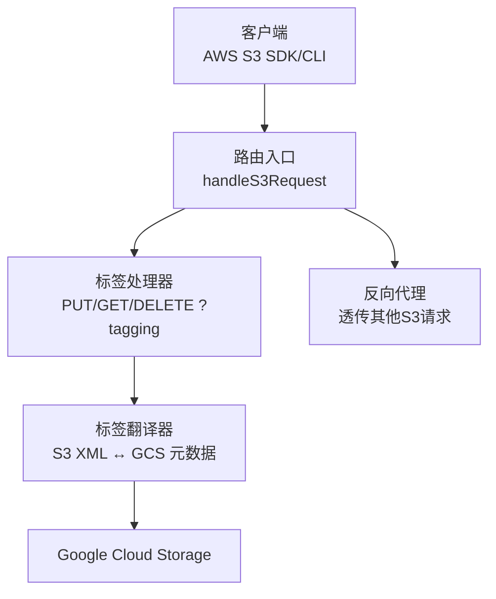
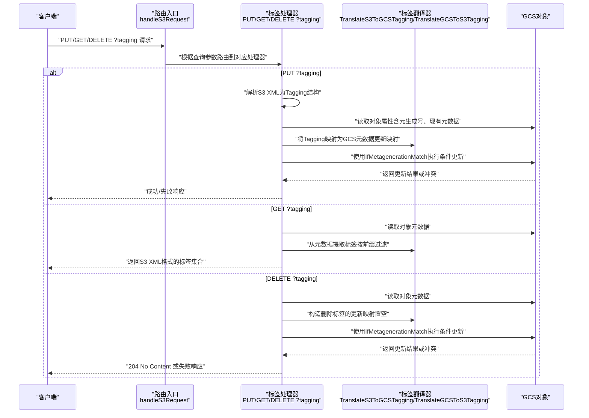
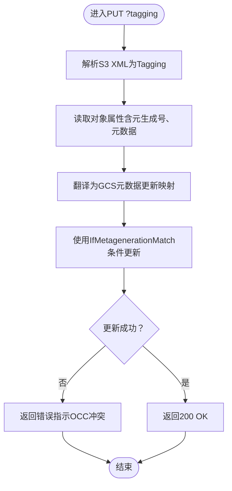
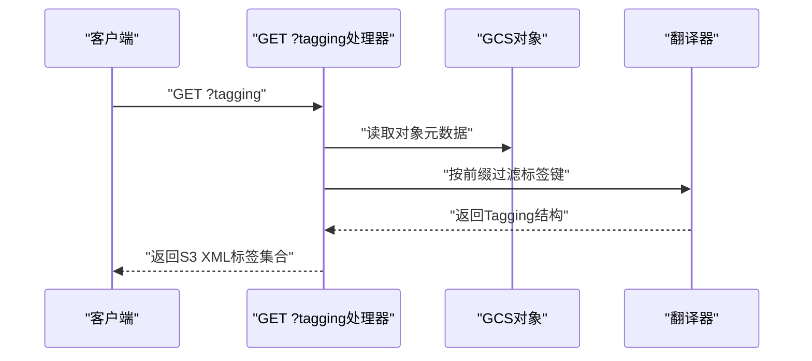
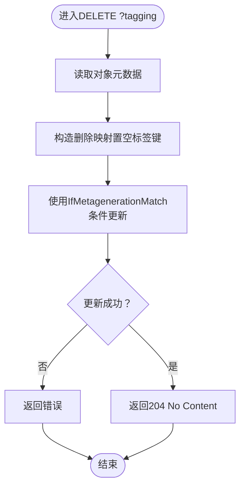
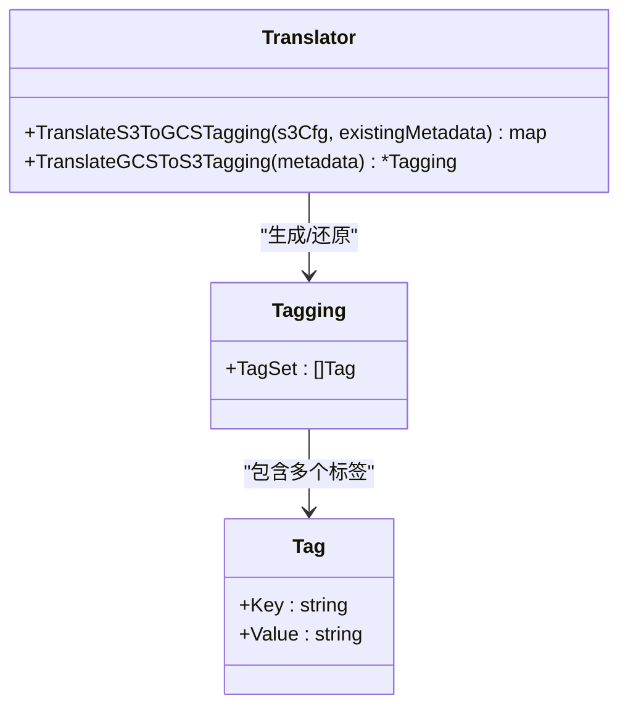
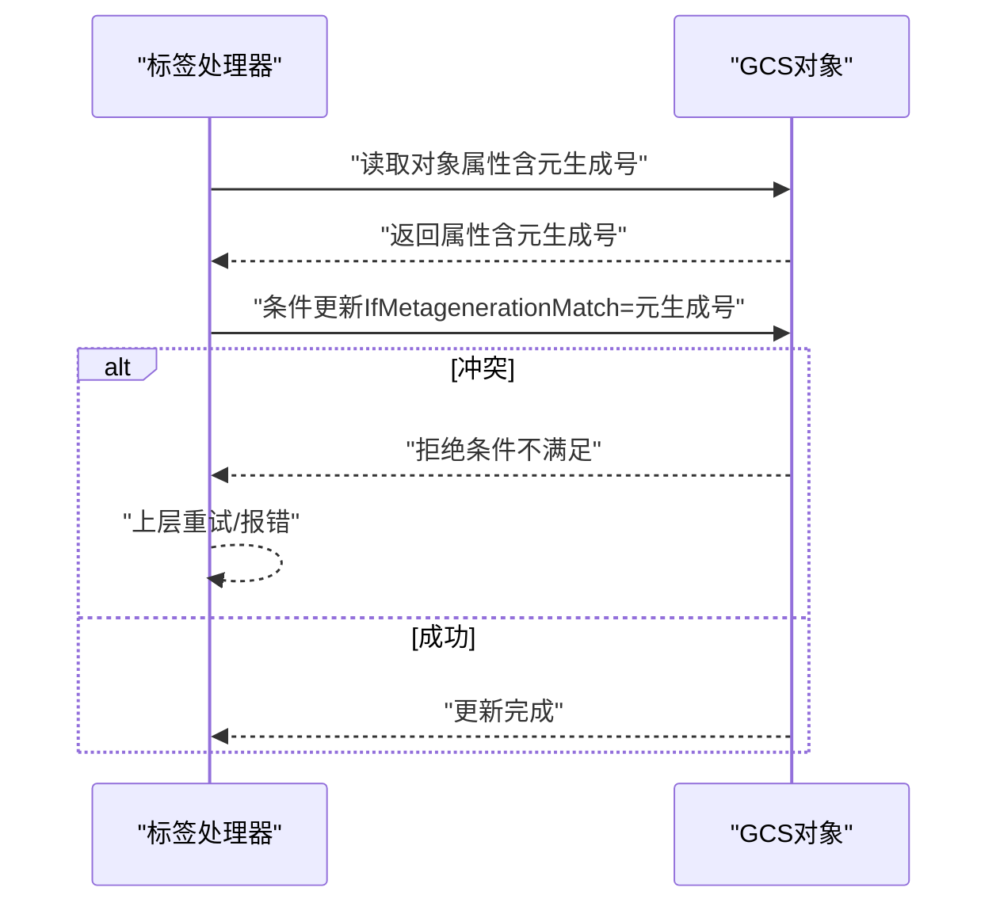
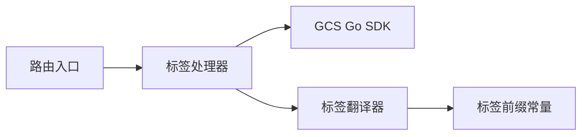

# 对象标签API

<cite>
**本文引用的文件**
- [main.go](file://main.go)
- [s3_tagging.go](file://pkg/translate/s3_tagging.go)
- [gcs_tagging.go](file://pkg/translate/gcs_tagging.go)
- [gcs_tagging_test.go](file://pkg/translate/gcs_tagging_test.go)
- [tagging_test.go](file://integration_tests/tagging_test.go)
- [settings.go](file://config/settings.go)
- [README.md](file://README.md)
- [solutions.md](file://solutions.md)
</cite>

## 目录
1. [简介](#简介)
2. [项目结构](#项目结构)
3. [核心组件](#核心组件)
4. [架构总览](#架构总览)
5. [详细组件分析](#详细组件分析)
6. [依赖分析](#依赖分析)
7. [性能考虑](#性能考虑)
8. [故障排除指南](#故障排除指南)
9. [结论](#结论)
10. [附录](#附录)

## 简介
本文件面向S3Proxy4GCS的对象标签API，系统性说明以下内容：
- PUT ?tagging、GET ?tagging、DELETE ?tagging三个端点的实现与行为
- S3对象标签到GCS元数据的转换机制：标签前缀处理、乐观并发控制（OCC）
- 完整的标签操作示例：批量标签、条件更新、冲突处理
- 标签命名规范、大小限制与性能考量
- If-MetagenerationMatch机制与并发冲突的解决方案

该实现通过拦截S3查询参数?tagging的请求，将其翻译为GCS对象自定义元数据的读取-修改-写入流程，并使用对象元数据的元生成号（Metageneration）进行乐观并发控制，避免丢失更新。

**章节来源**
- [README.md: 140-157:140-157](file://README.md#L140-L157)
- [solutions.md: 65-67:65-67](file://solutions.md#L65-L67)

## 项目结构
S3Proxy4GCS采用“路由入口 + 特定功能拦截 + 反向代理”的架构模式：
- 路由入口在根级处理函数中识别?tagging等特殊查询参数
- 对象标签API由独立处理器实现，其余S3 API透传至GCS
- 标签转换逻辑位于翻译包(pkg/translate)，包含S3 XML模型与GCS元数据映射

**图表来源**
- [main.go: 254-338:254-338](file://main.go#L254-L338)
- [main.go: 701-831:701-831](file://main.go#L701-L831)

**章节来源**
- [main.go: 254-338:254-338](file://main.go#L254-L338)
- [main.go: 701-831:701-831](file://main.go#L701-L831)

## 核心组件
- 路由与请求分发：在统一入口中检测?tagging查询参数，将对应方法路由到标签处理器
- 标签处理器：
  - PUT ?tagging：解析S3 XML标签集，读取现有对象元数据，构造更新映射，使用OCC写回
  - GET ?tagging：读取对象元数据，过滤出以特定前缀标识的标签，返回S3 XML
  - DELETE ?tagging：扫描现有元数据中标记为标签的键，清空这些键值，使用OCC写回
- 标签翻译器：
  - 将S3 Tagging结构体映射为GCS元数据更新映射（带前缀）
  - 将GCS元数据还原为S3 Tagging结构体（按前缀过滤）

**章节来源**
- [main.go: 322-334:322-334](file://main.go#L322-L334)
- [main.go: 701-766:701-766](file://main.go#L701-L766)
- [main.go: 768-789:768-789](file://main.go#L768-L789)
- [main.go: 791-831:791-831](file://main.go#L791-L831)
- [gcs_tagging.go: 8-35:8-35](file://pkg/translate/gcs_tagging.go#L8-L35)
- [gcs_tagging.go: 37-47:37-47](file://pkg/translate/gcs_tagging.go#L37-L47)

## 架构总览
对象标签API的端到端交互如下：

**图表来源**
- [main.go: 701-766:701-766](file://main.go#L701-L766)
- [main.go: 768-789:768-789](file://main.go#L768-L789)
- [main.go: 791-831:791-831](file://main.go#L791-L831)
- [gcs_tagging.go: 10-35:10-35](file://pkg/translate/gcs_tagging.go#L10-L35)
- [gcs_tagging.go: 37-47:37-47](file://pkg/translate/gcs_tagging.go#L37-L47)

## 详细组件分析

### 处理器：PUT ?tagging
- 输入解析：将请求体解析为S3 Tagging结构（包含多个标签键值对）
- 读取现状：获取对象当前属性，包含元生成号（Metageneration）与现有元数据
- 翻译更新：调用翻译器将S3标签映射为GCS元数据更新映射（清理旧标签键、设置新标签键）
- 条件更新：使用IfMetagenerationMatch携带当前元生成号，确保仅在未被并发修改时更新
- 错误处理：若发生并发冲突（典型为条件不满足），返回内部错误提示，便于上层重试

**图表来源**
- [main.go: 701-766:701-766](file://main.go#L701-L766)
- [gcs_tagging.go: 10-35:10-35](file://pkg/translate/gcs_tagging.go#L10-L35)

**章节来源**
- [main.go: 701-766:701-766](file://main.go#L701-L766)
- [gcs_tagging.go: 10-35:10-35](file://pkg/translate/gcs_tagging.go#L10-L35)

### 处理器：GET ?tagging
- 读取对象元数据
- 使用翻译器按前缀过滤出标签键值对
- 返回标准S3 XML格式的标签集合

**图表来源**
- [main.go: 768-789:768-789](file://main.go#L768-L789)
- [gcs_tagging.go: 37-47:37-47](file://pkg/translate/gcs_tagging.go#L37-L47)

**章节来源**
- [main.go: 768-789:768-789](file://main.go#L768-L789)
- [gcs_tagging.go: 37-47:37-47](file://pkg/translate/gcs_tagging.go#L37-L47)

### 处理器：DELETE ?tagging
- 读取对象元数据
- 构造删除映射：将所有以标签前缀标识的键设置为空字符串
- 使用IfMetagenerationMatch执行条件更新，确保并发安全

**图表来源**
- [main.go: 791-831:791-831](file://main.go#L791-L831)

**章节来源**
- [main.go: 791-831:791-831](file://main.go#L791-L831)

### 标签翻译器：S3 XML ↔ GCS元数据
- 前缀策略：S3标签键在GCS侧以固定前缀标识，避免与业务元数据冲突
- 清理策略：PUT时先将旧标签键置空，再设置新标签键，保证幂等
- 还原策略：GET时按前缀过滤并还原为S3标签结构

**图表来源**
- [s3_tagging.go: 5-9:5-9](file://pkg/translate/s3_tagging.go#L5-L9)
- [gcs_tagging.go: 10-35:10-35](file://pkg/translate/gcs_tagging.go#L10-L35)
- [gcs_tagging.go: 37-47:37-47](file://pkg/translate/gcs_tagging.go#L37-L47)

**章节来源**
- [s3_tagging.go: 5-9:5-9](file://pkg/translate/s3_tagging.go#L5-L9)
- [gcs_tagging.go: 8-35:8-35](file://pkg/translate/gcs_tagging.go#L8-L35)
- [gcs_tagging.go: 37-47:37-47](file://pkg/translate/gcs_tagging.go#L37-L47)

### 并发控制：If-MetagenerationMatch
- 读取对象属性时同时获得元生成号
- 更新时携带IfMetagenerationMatch条件，仅当对象未被并发修改时才允许更新
- 若冲突（如另一个进程已更新标签），GCS会拒绝更新；上层应捕获错误并重试

**图表来源**
- [main.go: 736-761:736-761](file://main.go#L736-L761)
- [main.go: 799-827:799-827](file://main.go#L799-L827)

**章节来源**
- [main.go: 736-761:736-761](file://main.go#L736-L761)
- [main.go: 799-827:799-827](file://main.go#L799-L827)

## 依赖分析
- 路由与处理器依赖于统一入口的查询参数检测逻辑
- 标签处理器依赖GCS Go SDK的对象属性读取与条件更新能力
- 标签翻译器独立于路由与SDK，仅依赖字符串前缀匹配与映射构建

**图表来源**
- [main.go: 254-338:254-338](file://main.go#L254-L338)
- [main.go: 701-831:701-831](file://main.go#L701-L831)
- [gcs_tagging.go: 8](file://pkg/translate/gcs_tagging.go#L8)

**章节来源**
- [main.go: 254-338:254-338](file://main.go#L254-L338)
- [main.go: 701-831:701-831](file://main.go#L701-L831)
- [gcs_tagging.go: 8](file://pkg/translate/gcs_tagging.go#L8)

## 性能考虑
- 读-改-写路径：每次标签操作均需两次网络往返（读取属性+条件更新），建议批量化标签变更以减少往返次数
- 前缀过滤：GET/PUT/DELETE均通过前缀快速定位标签键，避免全量扫描
- OCC冲突重试：在高并发场景下，建议实现指数退避的重试策略，降低冲突概率
- 连接池与超时：全局反向代理已配置连接池与超时，标签操作作为透传请求可复用该优化

**章节来源**
- [README.md: 94-96:94-96](file://README.md#L94-L96)
- [settings.go: 18-25:18-25](file://config/settings.go#L18-L25)

## 故障排除指南
- 并发冲突（412/条件不满足）
  - 现象：PUT/DELETE标签时报内部错误，日志提示OCC冲突
  - 原因：另一进程在同一时间更新了标签
  - 解决：重试请求，或在应用层实现重试与冲突解决
- 对象不存在
  - 现象：读取对象属性失败
  - 原因：目标对象尚未创建
  - 解决：先创建对象，再设置标签
- 标签前缀不匹配
  - 现象：GET返回空标签或部分标签缺失
  - 原因：历史标签未按前缀存储
  - 解决：确认翻译器使用的前缀一致，必要时迁移历史标签

**章节来源**
- [main.go: 736-761:736-761](file://main.go#L736-L761)
- [main.go: 799-827:799-827](file://main.go#L799-L827)

## 结论
S3Proxy4GCS的对象标签API通过“前缀隔离 + 乐观并发控制”实现了与GCS元数据的无缝映射。该方案具备以下优势：
- 语义清晰：标签以固定前缀存放在对象元数据中，避免污染业务元数据
- 并发安全：基于元生成号的OCC有效防止丢失更新
- 易于集成：保持S3 API语义不变，客户端无需感知后端差异

建议在生产环境配合重试与批量化策略，进一步提升稳定性与吞吐。

## 附录

### 端点与行为速查
- PUT ?tagging
  - 请求：S3 XML标签集合
  - 行为：清理旧标签键、设置新标签键，条件更新
  - 响应：200 OK 或错误（指示OCC冲突）
- GET ?tagging
  - 请求：无请求体
  - 行为：读取元数据，按前缀过滤标签
  - 响应：S3 XML标签集合
- DELETE ?tagging
  - 请求：无请求体
  - 行为：将所有标签键置空，条件更新
  - 响应：204 No Content 或错误

**章节来源**
- [main.go: 701-766:701-766](file://main.go#L701-L766)
- [main.go: 768-789:768-789](file://main.go#L768-L789)
- [main.go: 791-831:791-831](file://main.go#L791-L831)

### 标签命名规范与大小限制
- 命名规范
  - 标签键在GCS侧以固定前缀标识，避免与业务元数据冲突
  - 建议遵循S3标签键字符集（字母数字、空格及+ - = . _ : /），以兼容S3语义
- 大小限制
  - 单个标签键/值长度受GCS对象元数据限制约束
  - 建议在应用层进行长度校验与截断策略
- 批量标签
  - PUT ?tagging支持一次提交多组标签，翻译器会一次性清理旧键并设置新键
- 条件更新与冲突处理
  - 使用IfMetagenerationMatch进行条件更新
  - 高并发场景建议实现重试与冲突解决

**章节来源**
- [gcs_tagging.go: 8-35:8-35](file://pkg/translate/gcs_tagging.go#L8-L35)
- [gcs_tagging.go: 37-47:37-47](file://pkg/translate/gcs_tagging.go#L37-L47)

### 示例：端到端工作流
- 创建对象
  - 使用标准S3 PutObject创建对象
- 设置标签
  - 发送PUT ?tagging，携带S3 XML标签集合
  - 处理器读取属性、翻译映射、条件更新
- 查询标签
  - 发送GET ?tagging，处理器过滤标签并返回S3 XML
- 删除标签
  - 发送DELETE ?tagging，处理器清空标签键并条件更新

**章节来源**
- [tagging_test.go: 16-97:16-97](file://integration_tests/tagging_test.go#L16-L97)