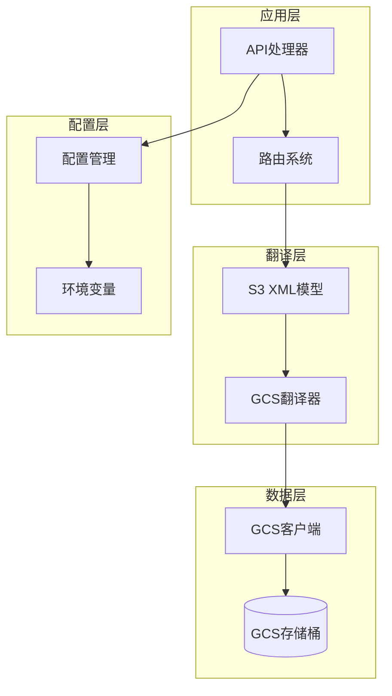
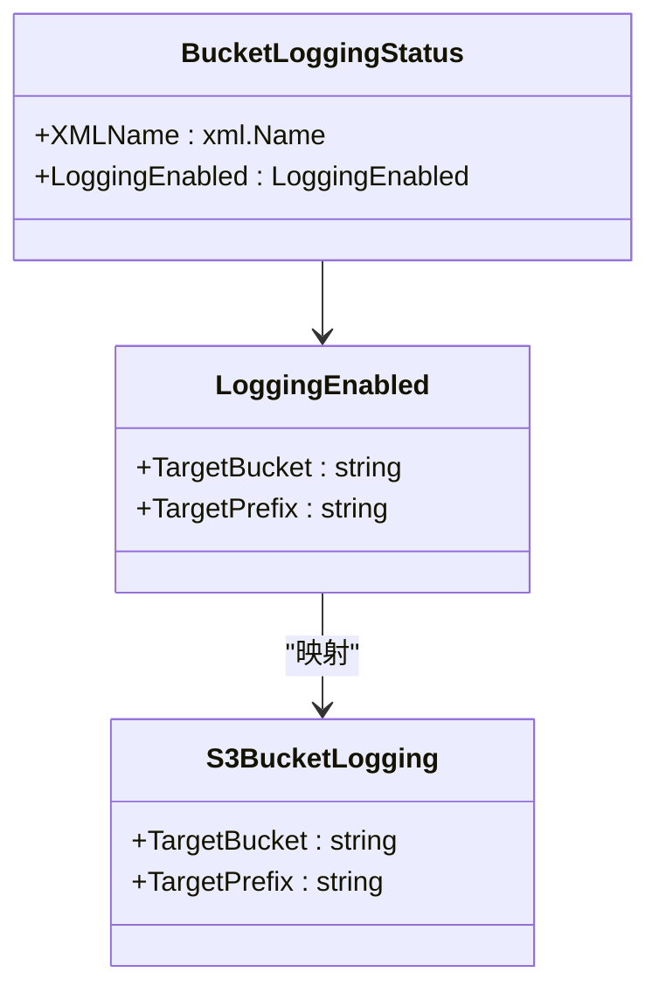
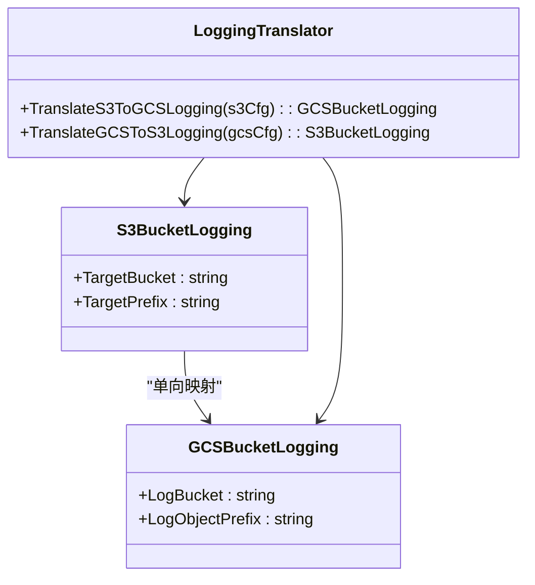
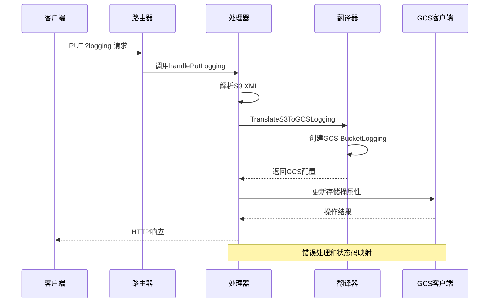
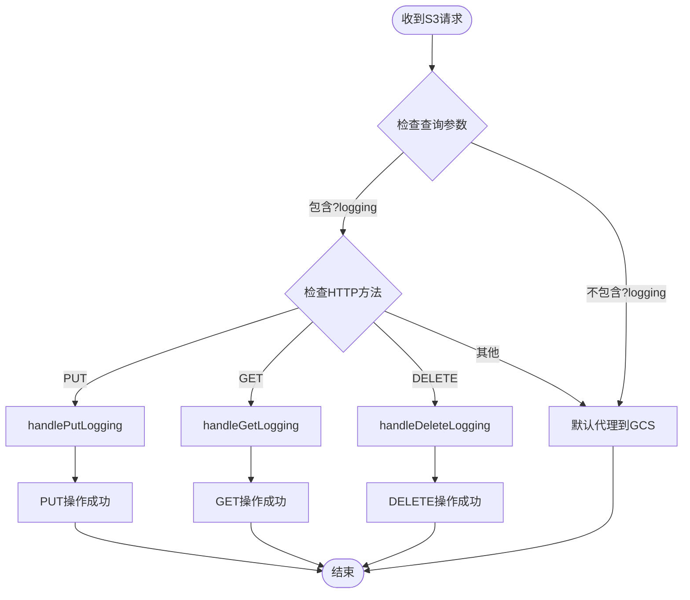
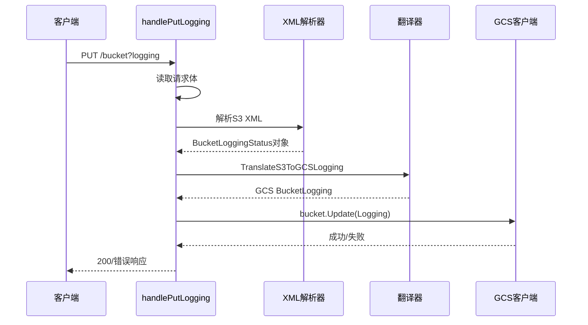
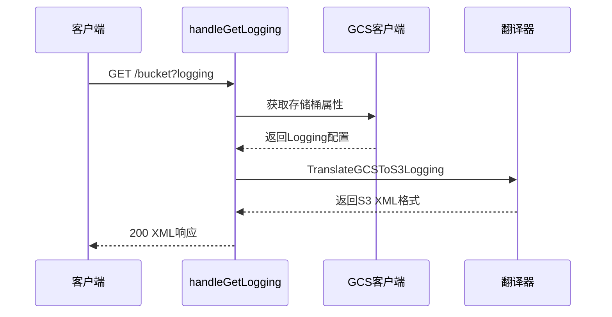
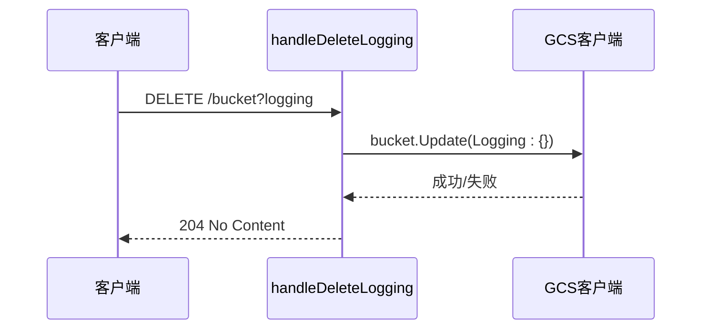
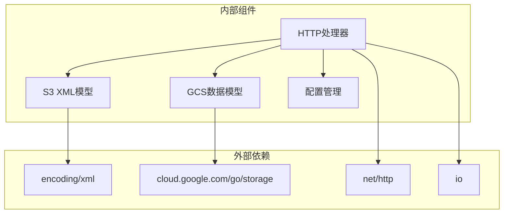

# 日志配置API

<cite>
**本文档引用的文件**
- [main.go](file://main.go)
- [s3_logging.go](file://pkg/translate/s3_logging.go)
- [gcs_logging.go](file://pkg/translate/gcs_logging.go)
- [logging_test.go](file://integration_tests/logging_test.go)
- [settings.go](file://config/settings.go)
- [gcs_logging_test.go](file://pkg/translate/gcs_logging_test.go)
- [README.md](file://README.md)
</cite>

## 目录
1. [简介](#简介)
2. [项目结构](#项目结构)
3. [核心组件](#核心组件)
4. [架构概览](#架构概览)
5. [详细组件分析](#详细组件分析)
6. [依赖关系分析](#依赖关系分析)
7. [性能考虑](#性能考虑)
8. [故障排除指南](#故障排除指南)
9. [结论](#结论)

## 简介

S3Proxy4GCS的日志配置API提供了S3 Bucket Logging功能到Google Cloud Storage访问日志功能的完整映射。该API允许用户通过标准的S3 XML接口配置和管理GCS存储桶的访问日志记录，实现了S3兼容性和GCS功能之间的无缝转换。

本API支持以下三个核心操作：
- PUT ?logging：启用或更新存储桶访问日志配置
- GET ?logging：获取当前存储桶的访问日志配置
- DELETE ?logging：禁用存储桶访问日志功能

## 项目结构

S3Proxy4GCS采用模块化架构设计，日志配置功能位于专门的翻译层中：



**图表来源**
- [main.go:254-338](file://main.go#L254-L338)
- [s3_logging.go:1-17](file://pkg/translate/s3_logging.go#L1-L17)
- [gcs_logging.go:1-36](file://pkg/translate/gcs_logging.go#L1-L36)

**章节来源**
- [main.go:198-338](file://main.go#L198-L338)
- [README.md:140-157](file://README.md#L140-L157)

## 核心组件

### S3 XML数据模型

日志配置API基于标准的S3 XML格式进行数据交换，定义了两个核心数据结构：



**图表来源**
- [s3_logging.go:5-16](file://pkg/translate/s3_logging.go#L5-L16)

### GCS访问日志映射

GCS使用不同的数据结构来表示访问日志配置，需要进行双向转换：



**图表来源**
- [gcs_logging.go:9-35](file://pkg/translate/gcs_logging.go#L9-L35)

**章节来源**
- [s3_logging.go:1-17](file://pkg/translate/s3_logging.go#L1-L17)
- [gcs_logging.go:1-36](file://pkg/translate/gcs_logging.go#L1-L36)

## 架构概览

日志配置API采用请求拦截和翻译的架构模式：



**图表来源**
- [main.go:542-585](file://main.go#L542-L585)
- [gcs_logging.go:9-21](file://pkg/translate/gcs_logging.go#L9-L21)

## 详细组件分析

### 请求路由和分发

日志配置API通过统一的请求路由系统进行处理：



**图表来源**
- [main.go:294-306](file://main.go#L294-L306)
- [main.go:542-617](file://main.go#L542-L617)

### PUT ?logging 操作流程

PUT操作用于启用或更新存储桶访问日志配置：



**图表来源**
- [main.go:542-585](file://main.go#L542-L585)
- [gcs_logging.go:9-21](file://pkg/translate/gcs_logging.go#L9-L21)

### GET ?logging 操作流程

GET操作用于获取当前的访问日志配置：



**图表来源**
- [main.go:587-600](file://main.go#L587-L600)
- [gcs_logging.go:23-35](file://pkg/translate/gcs_logging.go#L23-L35)

### DELETE ?logging 操作流程

DELETE操作用于禁用存储桶访问日志功能：



**图表来源**
- [main.go:602-617](file://main.go#L602-L617)

**章节来源**
- [main.go:542-617](file://main.go#L542-L617)

### 数据结构映射关系

日志配置在S3和GCS之间存在直接的一对一映射关系：

| S3字段 | GCS字段 | 描述 |
|--------|---------|------|
| TargetBucket | LogBucket | 目标日志存储桶名称 |
| TargetPrefix | LogObjectPrefix | 日志对象前缀 |

这种映射关系确保了配置的完整性和一致性，无需额外的权限映射或复杂的转换逻辑。

**章节来源**
- [gcs_logging.go:17-20](file://pkg/translate/gcs_logging.go#L17-L20)

## 依赖关系分析

日志配置API的依赖关系相对简单，主要涉及以下几个关键组件：



**图表来源**
- [main.go:3-30](file://main.go#L3-L30)
- [s3_logging.go:3](file://pkg/translate/s3_logging.go#L3)
- [gcs_logging.go:3-7](file://pkg/translate/gcs_logging.go#L3-L7)

**章节来源**
- [main.go:1-30](file://main.go#L1-L30)
- [s3_logging.go:1-17](file://pkg/translate/s3_logging.go#L1-L17)
- [gcs_logging.go:1-36](file://pkg/translate/gcs_logging.go#L1-L36)

## 性能考虑

日志配置API具有以下性能特征：

### 内存使用
- XML解析：一次性读取整个请求体，内存复杂度为O(n)
- 结构体转换：创建新的GCS配置对象，内存复杂度为O(1)
- 字符串处理：目标桶和前缀字符串复制，内存复杂度为O(m)

### 处理时间
- 解析S3 XML：线性时间复杂度O(n)，其中n为XML大小
- GCS API调用：网络延迟主导，通常在几十到几百毫秒范围内
- 错误处理：快速返回，避免不必要的计算

### 连接管理
- 使用连接池复用HTTP连接
- 避免长连接阻塞
- 支持并发请求处理

## 故障排除指南

### 常见错误类型和解决方案

#### XML解析错误
**症状**：返回400 Bad Request，错误代码为MalformedXML
**原因**：S3 XML格式不正确或缺少必需字段
**解决方案**：
- 验证XML格式是否符合S3规范
- 确保包含正确的命名空间声明
- 检查TargetBucket和TargetPrefix字段是否存在

#### GCS API错误
**症状**：返回502 Bad Gateway，包含具体的GCS错误信息
**原因**：GCS API调用失败
**解决方案**：
- 检查GCS凭据配置
- 验证目标存储桶是否存在
- 确认有足够的权限执行操作

#### 权限问题
**症状**：GCS API返回权限相关错误
**原因**：代理账户缺少必要的IAM权限
**解决方案**：
- 确保代理账户具有storage.buckets.update权限
- 验证目标日志存储桶的写入权限
- 检查服务账号的JSON密钥配置

#### 配置问题
**症状**：操作失败但错误信息不明确
**原因**：代理配置不正确
**解决方案**：
- 检查DRY_RUN模式设置
- 验证TARGET_BUCKET配置
- 确认STORAGE_BASE_URL设置正确

### 调试技巧

#### 启用调试日志
设置环境变量`DEBUG_LOGGING=true`以获取详细的请求和响应信息。

#### 测试工具
使用集成测试套件验证API功能：
- 运行`go test -v ./integration_tests/`查看测试结果
- 使用AWS SDK进行端到端测试

#### 常用诊断命令
```bash
# 检查代理状态
curl http://localhost:8080/health

# 获取当前日志配置
curl -X GET "http://localhost:8080/test-bucket?logging"

# 启用日志记录
curl -X PUT "http://localhost:8080/test-bucket?logging" -H "Content-Type: application/xml" -d @logging-config.xml
```

**章节来源**
- [main.go:833-837](file://main.go#L833-L837)
- [README.md:10-29](file://README.md#L10-L29)

## 结论

S3Proxy4GCS的日志配置API提供了一个简洁而强大的接口，实现了S3 Bucket Logging功能与GCS访问日志功能的无缝映射。该API具有以下优势：

### 技术优势
- **简单直观**：基于标准S3 XML格式，易于理解和使用
- **高效可靠**：直接映射减少转换开销，错误处理完善
- **安全可控**：支持DryRun模式进行安全测试
- **可观测性**：内置结构化日志支持

### 功能特性
- 完整支持PUT、GET、DELETE三种操作
- 自动权限映射（GCS使用IAM而非S3 Grants）
- 实时配置验证和错误报告
- 与AWS SDK完全兼容

### 最佳实践建议
- 在生产环境中禁用DRY_RUN模式
- 使用专用的服务账号进行日志记录
- 定期监控日志配置的变更历史
- 建立适当的日志轮转和存储策略

该API为S3应用程序迁移到GCS提供了重要的基础设施支持，简化了云平台间的迁移过程。