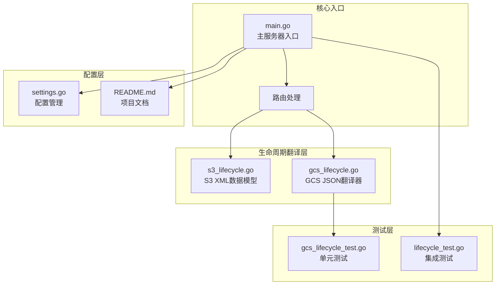
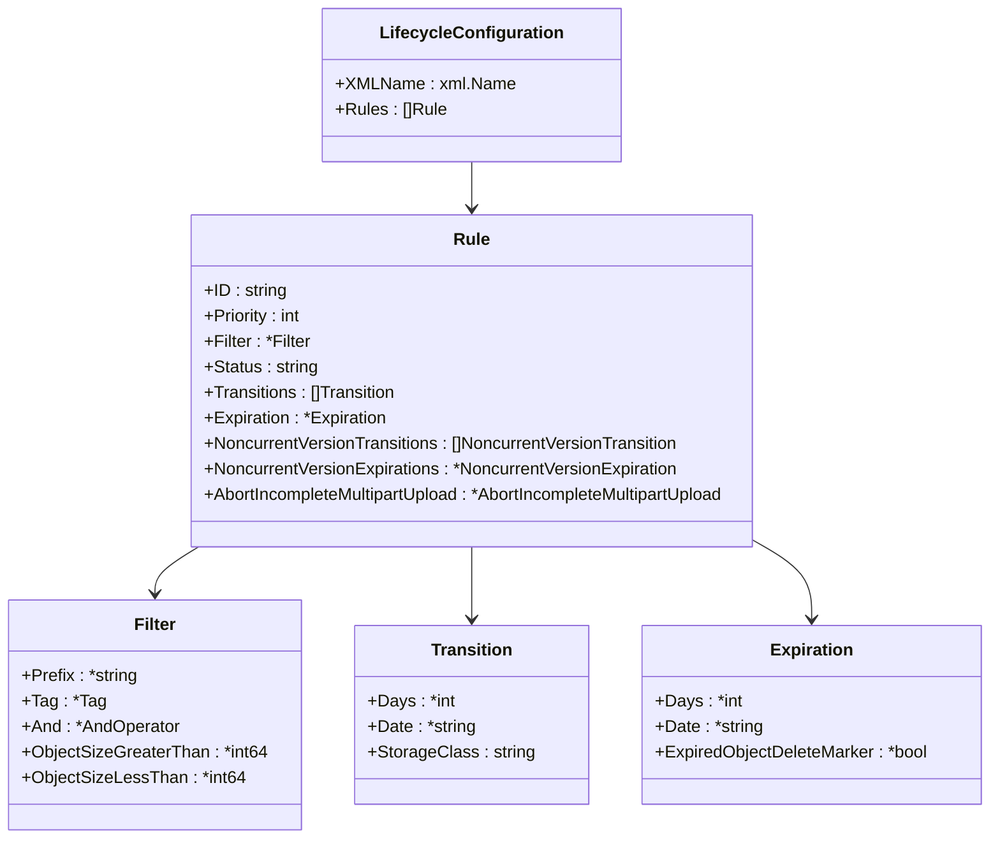
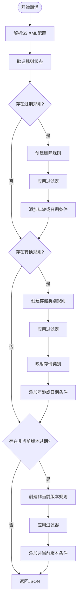
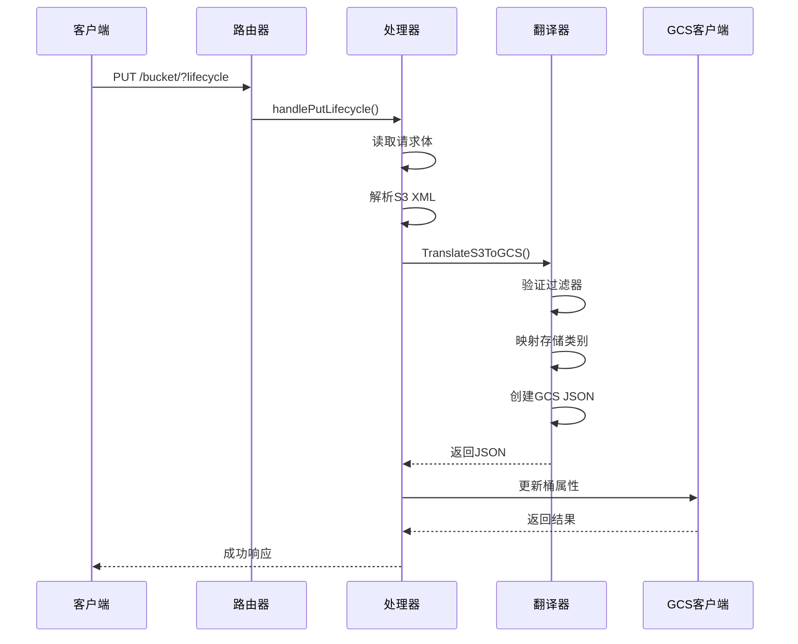
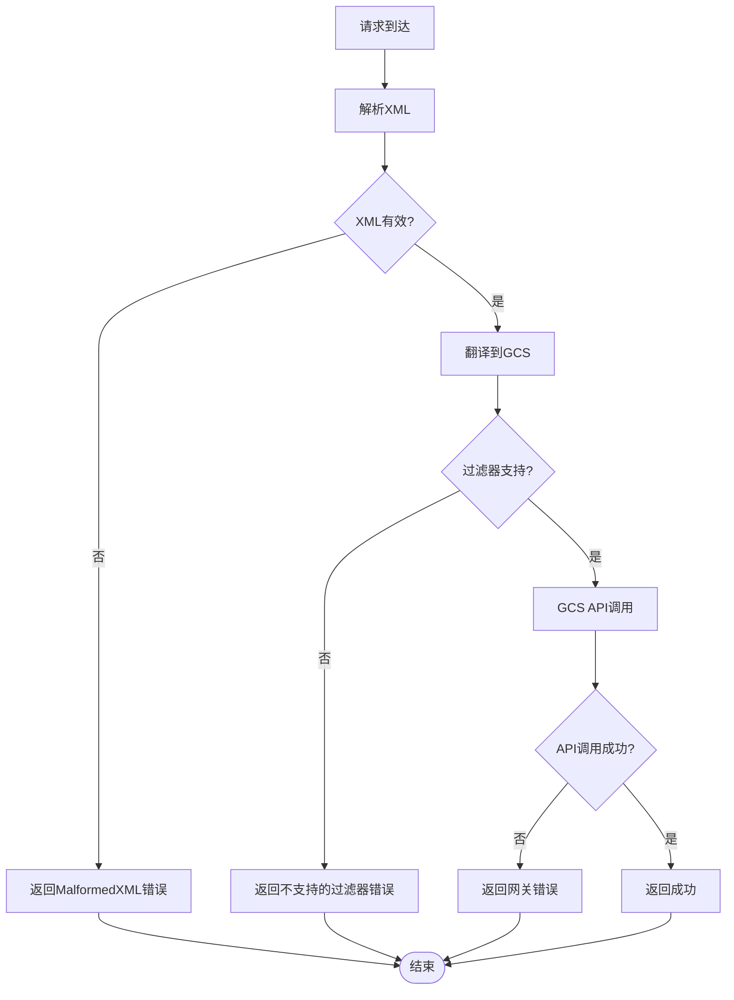
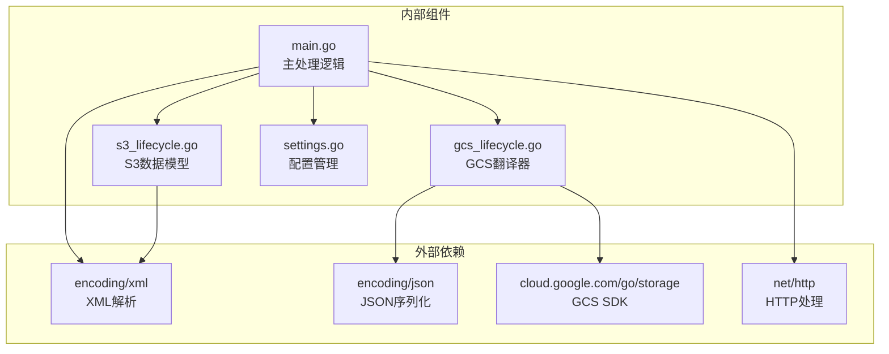

# 生命周期管理API

<cite>
**本文档引用的文件**
- [main.go](file://main.go)
- [s3_lifecycle.go](file://pkg/translate/s3_lifecycle.go)
- [gcs_lifecycle.go](file://pkg/translate/gcs_lifecycle.go)
- [gcs_lifecycle_test.go](file://pkg/translate/gcs_lifecycle_test.go)
- [lifecycle_test.go](file://integration_tests/lifecycle_test.go)
- [settings.go](file://config/settings.go)
- [README.md](file://README.md)
- [test_cases.md](file://test_cases.md)
</cite>

## 目录
1. [简介](#简介)
2. [项目结构](#项目结构)
3. [核心组件](#核心组件)
4. [架构概览](#架构概览)
5. [详细组件分析](#详细组件分析)
6. [依赖关系分析](#依赖关系分析)
7. [性能考虑](#性能考虑)
8. [故障排除指南](#故障排除指南)
9. [结论](#结论)
10. [附录](#附录)

## 简介

S3Proxy4GCS的生命周期管理API是该项目的核心功能之一，它实现了对Amazon S3生命周期配置的完整支持。该API允许用户通过标准的S3 XML格式配置对象生命周期规则，然后自动翻译为Google Cloud Storage兼容的JSON格式，并通过官方GCS Go SDK进行实际应用。

该系统支持多种生命周期规则类型，包括对象过期删除、存储类别转换、非当前版本处理以及不完整多部分上传清理等功能。所有操作都经过严格的错误处理和验证机制，确保与S3 API规范保持一致。

## 项目结构

S3Proxy4GCS采用模块化设计，生命周期管理功能分布在多个关键文件中：



**图表来源**
- [main.go:254-422](file://main.go#L254-L422)
- [s3_lifecycle.go:1-78](file://pkg/translate/s3_lifecycle.go#L1-L78)
- [gcs_lifecycle.go:1-249](file://pkg/translate/gcs_lifecycle.go#L1-L249)

**章节来源**
- [main.go:1-838](file://main.go#L1-L838)
- [README.md:1-157](file://README.md#L1-L157)

## 核心组件

### S3 XML数据模型

生命周期管理API基于完整的S3 XML数据模型，定义了所有支持的生命周期规则类型：



**图表来源**
- [s3_lifecycle.go:7-78](file://pkg/translate/s3_lifecycle.go#L7-L78)

### GCS JSON翻译器

GCS生命周期翻译器负责将S3 XML格式转换为GCS兼容的JSON格式：



**图表来源**
- [gcs_lifecycle.go:38-105](file://pkg/translate/gcs_lifecycle.go#L38-L105)

**章节来源**
- [s3_lifecycle.go:1-78](file://pkg/translate/s3_lifecycle.go#L1-L78)
- [gcs_lifecycle.go:1-249](file://pkg/translate/gcs_lifecycle.go#L1-L249)

## 架构概览

生命周期管理API采用分层架构设计，确保了清晰的职责分离和良好的可维护性：



**图表来源**
- [main.go:365-422](file://main.go#L365-L422)
- [gcs_lifecycle.go:38-105](file://pkg/translate/gcs_lifecycle.go#L38-L105)

## 详细组件分析

### 请求处理流程

生命周期管理API的请求处理遵循严格的步骤顺序：

#### 1. 请求接收与路由
路由器根据查询参数判断是否为生命周期请求：
- `?lifecycle` 查询参数触发生命周期处理
- 支持的HTTP方法：PUT、GET、DELETE
- 自动路由到相应的处理器函数

#### 2. S3 XML解析
使用Go的标准XML解析库将S3生命周期配置转换为内部数据结构：
- 验证XML格式的有效性
- 检查必需字段的存在性
- 处理可选字段和默认值

#### 3. 规则验证与过滤
对解析后的规则进行严格验证：
- 忽略状态为Disabled的规则
- 验证过滤器的兼容性
- 检查存储类别的有效性

#### 4. GCS JSON生成
将S3规则转换为GCS兼容的JSON格式：
- 映射S3存储类别到GCS存储类别
- 转换日期格式（YYYY-MM-DD）
- 应用过滤器条件

#### 5. GCS API调用
通过官方GCS Go SDK执行实际更新：
- 使用BucketHandle.Update方法
- 设置生命周期配置
- 处理可能的API错误

**章节来源**
- [main.go:266-278](file://main.go#L266-L278)
- [main.go:365-422](file://main.go#L365-L422)

### 错误处理机制

系统实现了多层次的错误处理机制：



**图表来源**
- [main.go:374-388](file://main.go#L374-L388)
- [gcs_lifecycle.go:107-137](file://pkg/translate/gcs_lifecycle.go#L107-L137)

### 支持的生命周期规则类型

系统支持以下主要的生命周期规则类型：

#### 1. 对象过期删除（Expiration）
- 基于天数的过期：`<Days>`
- 基于具体日期的过期：`<Date>`
- 删除标记支持：`<ExpiredObjectDeleteMarker>`

#### 2. 存储类别转换（Transition）
- 标准IA存储：映射到GCS NEARLINE
- 冷存储：映射到GCS COLDLINE  
- 深度归档：映射到GCS ARCHIVE
- 智能分层：映射到GCS STANDARD

#### 3. 非当前版本处理
- 非当前版本过期：`<NoncurrentDays>`
- 非当前版本存储类别转换

#### 4. 不完整多部分上传清理
- 基于初始化天数的清理：`<DaysAfterInitiation>`

**章节来源**
- [s3_lifecycle.go:13-78](file://pkg/translate/s3_lifecycle.go#L13-L78)
- [gcs_lifecycle.go:139-154](file://pkg/translate/gcs_lifecycle.go#L139-L154)

### XML字段映射关系

生命周期管理API实现了S3 XML与GCS JSON之间的精确映射：

| S3 XML字段 | GCS JSON字段 | 映射规则 |
|------------|-------------|----------|
| `Status` | 规则状态 | Enabled/Disabled → 仅启用Enabled规则 |
| `Filter.Prefix` | `condition.matchesPrefix` | 字符串数组格式 |
| `Expiration.Days` | `condition.age` | 直接映射 |
| `Expiration.Date` | `condition.createdBefore` | YYYY-MM-DD格式 |
| `Transition.StorageClass` | `action.storageClass` | 存储类别映射 |
| `NoncurrentVersionExpirations.NoncurrentDays` | `condition.numNewerVersions` | 非当前版本条件 |

**章节来源**
- [gcs_lifecycle.go:107-137](file://pkg/translate/gcs_lifecycle.go#L107-L137)
- [gcs_lifecycle.go:139-154](file://pkg/translate/gcs_lifecycle.go#L139-L154)

### 请求验证规则

系统实施了严格的请求验证规则以确保数据完整性：

#### 1. XML格式验证
- 必须符合S3生命周期配置的XML模式
- 所有必需字段必须存在
- 数据类型必须正确

#### 2. 过滤器支持检查
- 支持的过滤器：前缀过滤
- 不支持的过滤器：标签过滤、大小过滤
- And操作符中的限制：不允许标签和大小过滤

#### 3. 存储类别验证
- 支持的S3存储类别：STANDARD_IA、GLACIER、DEEP_ARCHIVE、INTELLIGENT_TIERING
- 自动映射到对应的GCS存储类别
- 默认回退到STANDARD

**章节来源**
- [gcs_lifecycle.go:107-137](file://pkg/translate/gcs_lifecycle.go#L107-L137)

## 依赖关系分析

生命周期管理API的依赖关系相对简单但功能完整：



**图表来源**
- [main.go:3-30](file://main.go#L3-L30)
- [gcs_lifecycle.go:3-8](file://pkg/translate/gcs_lifecycle.go#L3-L8)

**章节来源**
- [main.go:3-30](file://main.go#L3-L30)
- [gcs_lifecycle.go:3-8](file://pkg/translate/gcs_lifecycle.go#L3-L8)

## 性能考虑

生命周期管理API在设计时充分考虑了性能优化：

### 1. 内存效率
- 使用流式XML解析避免大文件内存占用
- 及时释放解析后的数据结构
- 最小化中间数据结构的创建

### 2. 网络优化
- 复用GCS客户端连接池
- 合理设置超时时间
- 避免不必要的API调用

### 3. 错误快速失败
- 在解析阶段尽早发现并报告错误
- 减少无效的API调用尝试
- 提供明确的错误信息

## 故障排除指南

### 常见错误及解决方案

#### 1. XML格式错误
**症状**：返回400 Bad Request，错误代码MalformedXML
**原因**：XML格式不符合S3规范
**解决方案**：
- 验证XML结构的完整性
- 检查必需字段的存在性
- 使用标准的S3生命周期XML模板

#### 2. 过滤器不支持错误
**症状**：返回500 Internal Error，提示过滤器不受支持
**原因**：使用了GCS不支持的过滤器类型
**解决方案**：
- 仅使用前缀过滤器
- 避免使用标签过滤器
- 移除对象大小过滤器

#### 3. GCS API错误
**症状**：返回502 Bad Gateway，包含具体的GCS错误信息
**原因**：GCS API调用失败
**解决方案**：
- 检查GCS凭据配置
- 验证目标桶的访问权限
- 查看GCS日志获取详细错误信息

#### 4. 存储类别映射错误
**症状**：存储类别未按预期工作
**原因**：S3存储类别与GCS存储类别的映射问题
**解决方案**：
- 确认使用的S3存储类别受支持
- 检查映射表的正确性
- 验证目标GCS存储类别的可用性

**章节来源**
- [main.go:374-388](file://main.go#L374-L388)
- [gcs_lifecycle.go:107-137](file://pkg/translate/gcs_lifecycle.go#L107-L137)

## 结论

S3Proxy4GCS的生命周期管理API提供了完整的S3生命周期配置支持，通过精心设计的翻译层实现了与GCS的无缝集成。该系统具有以下优势：

1. **完整的功能覆盖**：支持所有主要的S3生命周期规则类型
2. **严格的错误处理**：多层次的验证和错误报告机制
3. **清晰的架构设计**：模块化的组件结构便于维护和扩展
4. **良好的性能表现**：优化的内存使用和网络调用策略
5. **完善的测试覆盖**：单元测试和集成测试确保代码质量

该API为用户提供了透明的生命周期管理体验，无需修改现有的S3应用程序即可享受GCS的存储服务优势。

## 附录

### API规范摘要

#### 端点定义
- **路径**：`/{bucket}/?lifecycle`
- **方法**：PUT, GET, DELETE
- **内容类型**：XML（请求），XML（响应）

#### 请求示例

**成功请求示例**：
```xml
<?xml version="1.0" encoding="UTF-8"?>
<LifecycleConfiguration>
    <Rule>
        <ID>Rule1</ID>
        <Status>Enabled</Status>
        <Filter>
            <Prefix>logs/</Prefix>
        </Filter>
        <Transition>
            <Days>30</Days>
            <StorageClass>GLACIER</StorageClass>
        </Transition>
        <Expiration>
            <Days>365</Days>
        </Expiration>
    </Rule>
</LifecycleConfiguration>
```

#### 响应示例

**成功响应**：
- **状态码**：200 OK
- **内容**：`Successfully proxied and applied lifecycle to GCS.`

**错误响应**：
```xml
<?xml version="1.0" encoding="UTF-8"?>
<Error>
    <Code>MalformedXML</Code>
    <Message>The XML you provided was not well-formed or did not validate against our published schema.</Message>
</Error>
```

### 支持的存储类别映射

| S3存储类别 | GCS存储类别 | 描述 |
|-----------|------------|------|
| STANDARD | STANDARD | 标准存储 |
| STANDARD_IA | NEARLINE | 近线存储 |
| ONEZONE_IA | NEARLINE | 单区域近线存储 |
| INTELLIGENT_TIERING | STANDARD | 智能分层存储 |
| GLACIER | COLDLINE | 冷存储 |
| GLACIER_IR | COLDLINE | 冷存储（IR） |
| DEEP_ARCHIVE | ARCHIVE | 深度归档存储 |