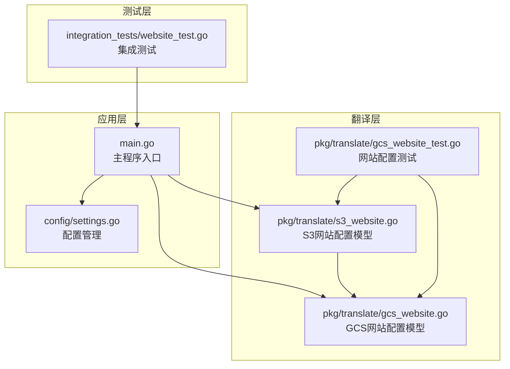
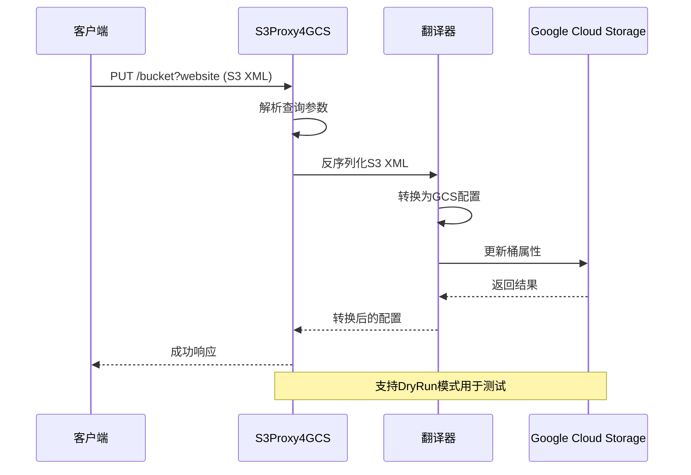
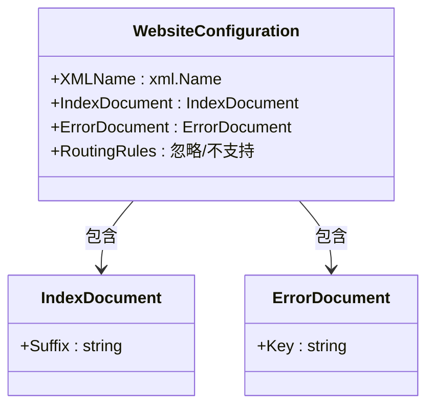
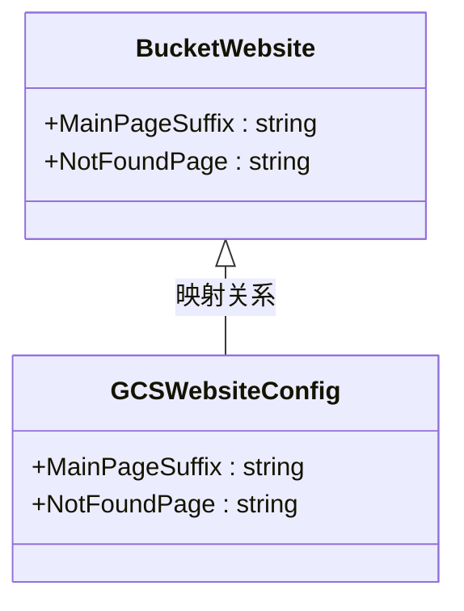
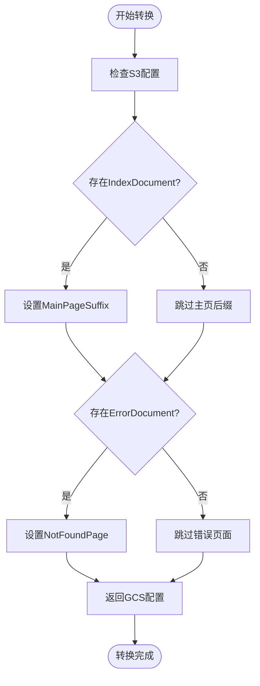
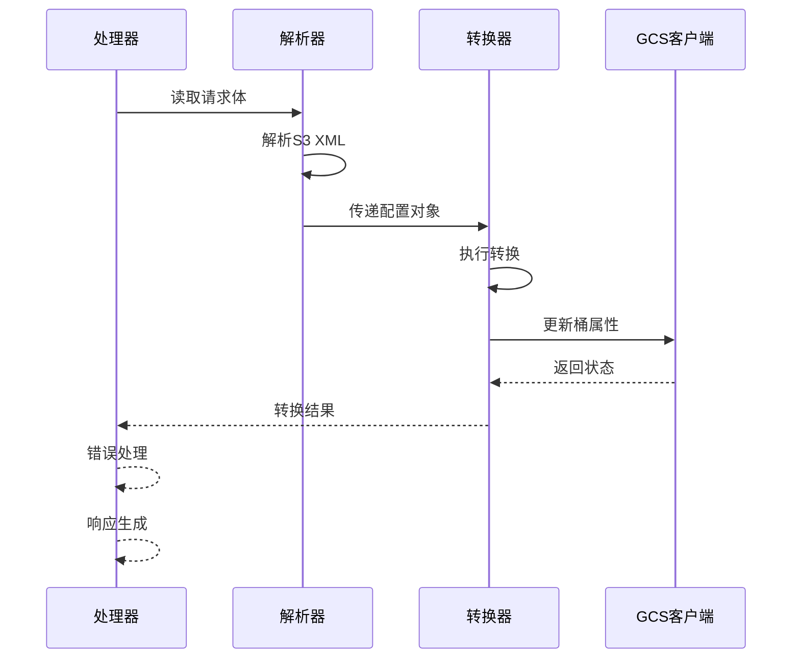
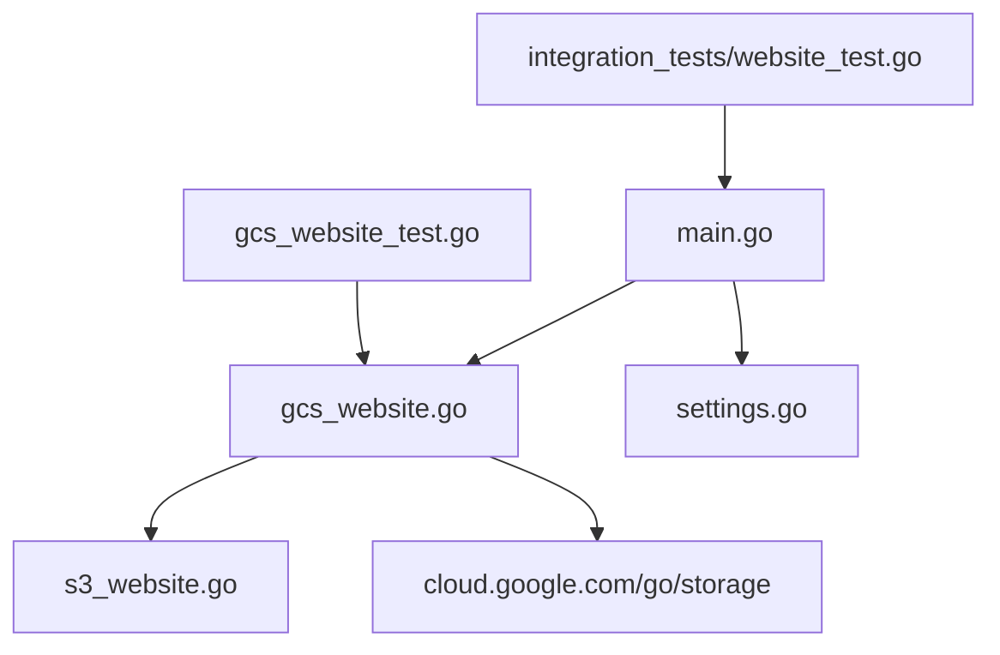
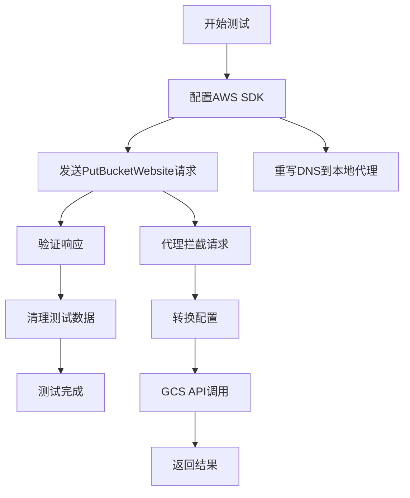
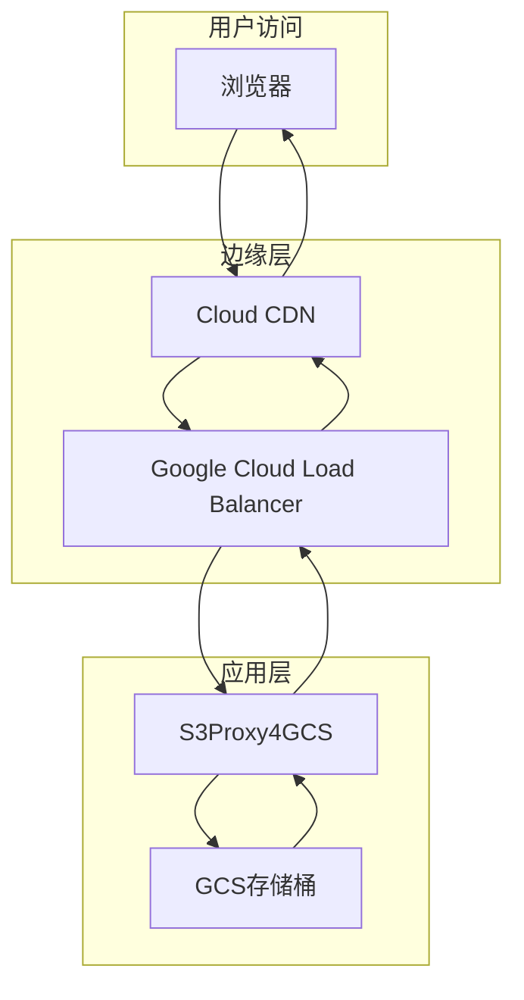

# 网站托管API

<cite>
**本文档引用的文件**
- [main.go](file://main.go)
- [pkg/translate/gcs_website.go](file://pkg/translate/gcs_website.go)
- [pkg/translate/s3_website.go](file://pkg/translate/s3_website.go)
- [pkg/translate/gcs_website_test.go](file://pkg/translate/gcs_website_test.go)
- [integration_tests/website_test.go](file://integration_tests/website_test.go)
- [config/settings.go](file://config/settings.go)
- [README.md](file://README.md)
- [test_cases.md](file://test_cases.md)
- [solutions.md](file://solutions.md)
- [unsupported.txt](file://unsupported.txt)
</cite>

## 目录
1. [简介](#简介)
2. [项目结构](#项目结构)
3. [核心组件](#核心组件)
4. [架构概览](#架构概览)
5. [详细组件分析](#详细组件分析)
6. [依赖关系分析](#依赖关系分析)
7. [性能考虑](#性能考虑)
8. [故障排除指南](#故障排除指南)
9. [结论](#结论)
10. [附录](#附录)

## 简介
本文件详细记录了S3Proxy4GCS项目中网站托管API的实现，重点涵盖PUT ?website端点的完整工作流程，以及S3静态网站配置到GCS网站托管的转换机制。文档将深入解释主页后缀、错误页面、重定向规则的映射关系，并提供完整的网站托管配置示例，包括域名绑定、SSL证书配置和CDN集成方案。同时，文档会明确列出当前支持的网站托管功能，并详细说明与AWS S3网站托管的差异。

## 项目结构
S3Proxy4GCS采用分层架构设计，主要包含以下关键模块：
- 主程序层：负责HTTP请求路由、参数解析和错误处理
- 翻译层：专门处理S3与GCS之间的数据格式转换
- 配置层：管理运行时配置和环境变量
- 测试层：包含单元测试和集成测试



**图表来源**
- [main.go:1-838](file://main.go#L1-L838)
- [config/settings.go:1-65](file://config/settings.go#L1-L65)
- [pkg/translate/s3_website.go:1-22](file://pkg/translate/s3_website.go#L1-L22)
- [pkg/translate/gcs_website.go:1-46](file://pkg/translate/gcs_website.go#L1-L46)

**章节来源**
- [main.go:198-338](file://main.go#L198-L338)
- [config/settings.go:11-25](file://config/settings.go#L11-L25)

## 核心组件
网站托管API的核心组件包括：

### 1. 请求路由与拦截
主程序通过统一的请求处理器识别并拦截带有`?website`查询参数的S3请求，将其路由到专门的网站托管处理函数。

### 2. 数据模型定义
- **S3 WebsiteConfiguration**：定义S3静态网站配置的数据结构
- **GCS BucketWebsite**：定义GCS网站托管配置的数据结构
- **IndexDocument**：主页后缀配置
- **ErrorDocument**：错误页面配置

### 3. 转换引擎
专门的转换函数负责在S3和GCS配置模型之间进行双向转换，确保数据格式的兼容性。

**章节来源**
- [main.go:308-320](file://main.go#L308-L320)
- [pkg/translate/s3_website.go:5-21](file://pkg/translate/s3_website.go#L5-L21)
- [pkg/translate/gcs_website.go:9-45](file://pkg/translate/gcs_website.go#L9-L45)

## 架构概览
网站托管API采用中间件代理架构，实现了从S3到GCS的无缝转换：



**图表来源**
- [main.go:619-662](file://main.go#L619-L662)
- [pkg/translate/gcs_website.go:10-26](file://pkg/translate/gcs_website.go#L10-L26)

## 详细组件分析

### 1. S3网站配置模型
S3的WebsiteConfiguration结构体定义了静态网站托管的核心配置项：



**图表来源**
- [pkg/translate/s3_website.go:5-21](file://pkg/translate/s3_website.go#L5-L21)

### 2. GCS网站配置模型
GCS的BucketWebsite结构体提供了对应的网站托管配置：



**图表来源**
- [pkg/translate/gcs_website.go:13-25](file://pkg/translate/gcs_website.go#L13-L25)

### 3. 转换逻辑实现
网站托管配置的转换遵循一对一映射原则：



**图表来源**
- [pkg/translate/gcs_website.go:10-26](file://pkg/translate/gcs_website.go#L10-L26)

### 4. 处理器实现细节
主程序中的网站托管处理器实现了完整的请求生命周期：



**图表来源**
- [main.go:619-662](file://main.go#L619-L662)

**章节来源**
- [pkg/translate/gcs_website.go:10-45](file://pkg/translate/gcs_website.go#L10-L45)
- [main.go:619-699](file://main.go#L619-L699)

### 5. 支持的网站托管功能
根据项目文档，当前支持的功能包括：

#### 核心功能
- **主页后缀配置**：支持IndexDocument.Suffix到MainPageSuffix的映射
- **错误页面配置**：支持ErrorDocument.Key到NotFoundPage的映射
- **配置查询**：支持GET ?website查询现有配置
- **配置删除**：支持DELETE ?website清除网站配置

#### 不支持的功能
- **重定向规则**：RoutingRules在GCS中不被原生支持
- **自定义域名**：需要额外的DNS和负载均衡配置
- **高级重定向**：如301/302重定向等复杂规则

**章节来源**
- [pkg/translate/s3_website.go:10](file://pkg/translate/s3_website.go#L10)
- [unsupported.txt:12](file://unsupported.txt#L12)
- [test_cases.md:45-47](file://test_cases.md#L45-L47)

## 依赖关系分析

### 1. 组件依赖图
网站托管API的依赖关系相对简单，主要涉及几个核心模块：



**图表来源**
- [main.go:21-29](file://main.go#L21-L29)
- [pkg/translate/gcs_website.go:3-7](file://pkg/translate/gcs_website.go#L3-L7)

### 2. 外部依赖
- **Google Cloud Storage SDK**：提供GCS操作能力
- **AWS SDK**：用于集成测试和SDK兼容性验证
- **Go标准库**：HTTP处理、XML解析、日志记录

**章节来源**
- [main.go:24-29](file://main.go#L24-L29)
- [pkg/translate/gcs_website.go:3-7](file://pkg/translate/gcs_website.go#L3-L7)

## 性能考虑
网站托管API的设计充分考虑了性能优化：

### 1. 连接池优化
- 使用预配置的HTTP传输层，支持最大空闲连接数和每主机空闲连接数
- 启用HTTP/2以提高连接复用效率
- 配置合理的超时参数避免资源泄露

### 2. 内存使用优化
- 采用流式处理避免大对象内存占用
- 按需加载和转换，减少不必要的数据复制
- 使用结构化的日志输出便于监控

### 3. 并发处理
- 基于Go的goroutine实现高并发处理
- 无状态设计便于水平扩展
- 连接池复用降低系统开销

**章节来源**
- [main.go:79-91](file://main.go#L79-L91)
- [config/settings.go:20-24](file://config/settings.go#L20-L24)

## 故障排除指南

### 1. 常见错误类型
- **XML解析错误**：当S3 XML格式不正确时返回MalformedXML错误
- **GCS API错误**：转发到GCS时的网络或权限问题
- **配置不存在**：查询不存在的网站配置时返回NoSuchWebsiteConfiguration

### 2. 调试方法
- 启用调试日志模式查看详细的请求和响应信息
- 使用DryRun模式进行安全测试，避免真实GCS调用
- 检查环境变量配置是否正确

### 3. 集成测试
项目提供了完整的集成测试套件，验证SDK与代理的兼容性：



**图表来源**
- [integration_tests/website_test.go:18-90](file://integration_tests/website_test.go#L18-L90)

**章节来源**
- [main.go:630-634](file://main.go#L630-L634)
- [integration_tests/website_test.go:18-90](file://integration_tests/website_test.go#L18-L90)

## 结论
S3Proxy4GCS的网站托管API实现了S3静态网站配置到GCS网站托管的完整转换，支持核心的主页后缀和错误页面配置。虽然目前不支持重定向规则和自定义域名等高级功能，但通过合理的架构设计和性能优化，该API能够满足大多数静态网站托管需求。

对于需要完整AWS S3网站托管功能的场景，建议结合DNS服务、负载均衡器和CDN解决方案来实现自定义域名和高级重定向功能。

## 附录

### 1. 完整配置示例

#### 基础网站托管配置
```xml
<WebsiteConfiguration xmlns="http://s3.amazonaws.com/doc/2006-03-01/">
    <IndexDocument>
        <Suffix>index.html</Suffix>
    </IndexDocument>
    <ErrorDocument>
        <Key>error.html</Key>
    </ErrorDocument>
</WebsiteConfiguration>
```

#### 域名绑定配置
由于GCS不直接支持自定义域名，需要通过以下方式实现：

1. **DNS配置**：将自定义域名指向Google Cloud Load Balancer
2. **SSL证书**：使用Google Cloud Certificate Manager管理证书
3. **CDN集成**：通过Cloud CDN加速静态内容分发

#### CDN集成方案


### 2. 差异对比表

| 功能特性 | AWS S3网站托管 | S3Proxy4GCS实现 | 说明 |
|---------|---------------|----------------|------|
| 主页后缀 | ✅ 支持 | ✅ 完全支持 | 直接映射 |
| 错误页面 | ✅ 支持 | ✅ 完全支持 | 直接映射 |
| 重定向规则 | ✅ 支持 | ❌ 不支持 | GCS原生不支持 |
| 自定义域名 | ✅ 支持 | ❌ 不支持 | 需要外部服务 |
| SSL证书 | ✅ 支持 | ❌ 不支持 | 需要外部服务 |
| CDN集成 | ✅ 支持 | ✅ 间接支持 | 通过GCS CDN |

### 3. 最佳实践建议
- 使用DryRun模式进行开发和测试
- 合理配置连接池参数以优化性能
- 在生产环境中启用适当的日志级别
- 结合Google Cloud的监控和告警系统
- 定期备份网站配置以防意外修改

**章节来源**
- [README.md:18-29](file://README.md#L18-L29)
- [solutions.md:53-57](file://solutions.md#L53-L57)
- [test_cases.md:45-47](file://test_cases.md#L45-L47)