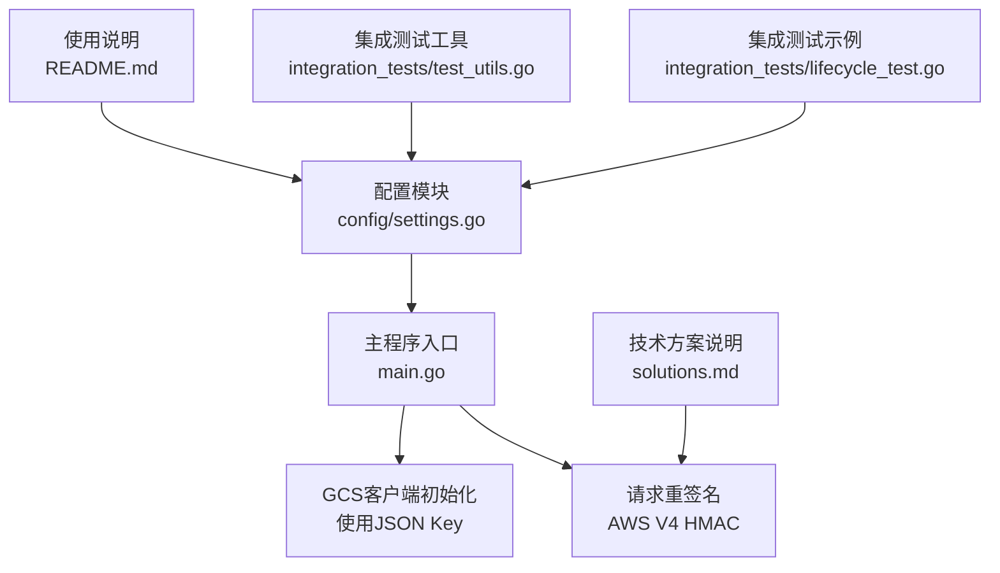
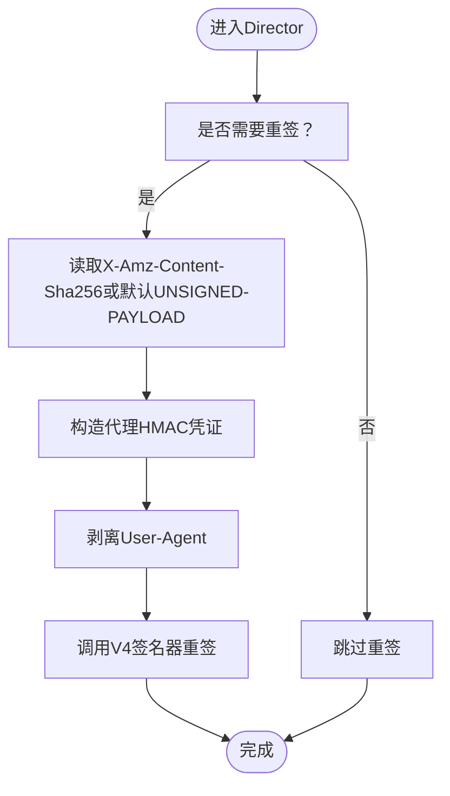
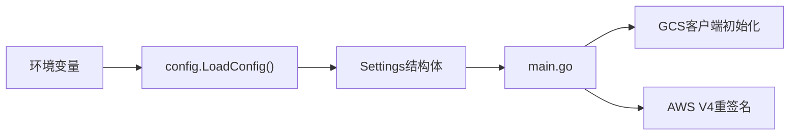

# 安全凭证配置

<cite>
**本文引用的文件**
- [main.go](file://main.go)
- [config/settings.go](file://config/settings.go)
- [README.md](file://README.md)
- [solutions.md](file://solutions.md)
- [integration_tests/test_utils.go](file://integration_tests/test_utils.go)
- [integration_tests/lifecycle_test.go](file://integration_tests/lifecycle_test.go)
</cite>

## 目录
1. [简介](#简介)
2. [项目结构](#项目结构)
3. [核心组件](#核心组件)
4. [架构总览](#架构总览)
5. [详细组件分析](#详细组件分析)
6. [依赖关系分析](#依赖关系分析)
7. [性能考量](#性能考量)
8. [故障排查指南](#故障排查指南)
9. [结论](#结论)
10. [附录](#附录)

## 简介
本文件面向S3Proxy4GCS的运维与开发人员，系统性阐述“安全凭证配置”的完整方案：包括GCS服务账号JSON密钥的获取与配置、AWS凭证（代理HMAC凭据）的配置与重签名机制、安全最佳实践（密钥存储、权限最小化、凭证轮换）、DRY_RUN模式下的安全注意事项、安全审计与验证方法，以及常见安全问题的排查与解决路径。内容基于仓库源码与配套文档进行提炼，确保可操作且与实际实现一致。

## 项目结构
围绕“凭证配置”这一主题，以下文件最为关键：
- 配置加载与环境变量解析：config/settings.go
- 凭证使用与重签名逻辑：main.go
- 使用说明与配置项清单：README.md
- 技术细节与重签名流程说明：solutions.md
- 测试中对AWS凭证的读取方式：integration_tests/test_utils.go
- 集成测试中对AWS凭证的注入方式：integration_tests/lifecycle_test.go



图表来源
- [config/settings.go:29-57](file://config/settings.go#L29-L57)
- [main.go:52-66](file://main.go#L52-L66)
- [main.go:157-182](file://main.go#L157-L182)
- [README.md:18-29](file://README.md#L18-L29)
- [solutions.md:135-145](file://solutions.md#L135-L145)
- [integration_tests/test_utils.go:62-112](file://integration_tests/test_utils.go#L62-L112)
- [integration_tests/lifecycle_test.go:68-74](file://integration_tests/lifecycle_test.go#L68-L74)

章节来源
- [config/settings.go:11-57](file://config/settings.go#L11-L57)
- [main.go:37-91](file://main.go#L37-L91)
- [README.md:10-29](file://README.md#L10-L29)
- [solutions.md:135-145](file://solutions.md#L135-L145)
- [integration_tests/test_utils.go:62-112](file://integration_tests/test_utils.go#L62-L112)
- [integration_tests/lifecycle_test.go:68-74](file://integration_tests/lifecycle_test.go#L68-L74)

## 核心组件
- GCS服务账号JSON密钥（用于初始化真实GCS客户端）
  - 配置项：JSON_KEY（指向服务账号JSON文件路径）
  - 加载位置：config/settings.go
  - 使用位置：main.go（在非DRY_RUN模式下通过option.WithCredentialsFile加载）
- AWS代理HMAC凭证（用于对修改后的请求进行重签名）
  - 配置项：PROXY_AWS_ACCESS_KEY_ID、PROXY_AWS_SECRET_ACCESS_KEY（或回退到AWS_ACCESS_KEY_ID/AWS_SECRET_ACCESS_KEY）
  - 加载位置：config/settings.go
  - 使用位置：main.go（在需要重签时构造aws.Credentials并调用v4.NewSigner进行签名）

章节来源
- [config/settings.go:12-25](file://config/settings.go#L12-L25)
- [config/settings.go:53-55](file://config/settings.go#L53-L55)
- [main.go:54-56](file://main.go#L54-L56)
- [main.go:166-180](file://main.go#L166-L180)

## 架构总览
下图展示“凭证配置”在系统中的作用与交互：

```mermaid
sequenceDiagram
participant Client as "S3客户端"
participant Proxy as "S3Proxy4GCS"
participant GCS as "GCS服务"
participant Cfg as "配置模块"
Client->>Proxy : 发送S3请求可能携带原始AWS签名
Proxy->>Cfg : 读取JSON_KEY与代理HMAC凭证
alt 需要重签如修改了请求体
Proxy->>Proxy : 计算payload哈希/剥离User-Agent
Proxy->>Proxy : 使用代理HMAC凭证重新签名
end
opt 非DRY_RUN模式
Proxy->>GCS : 以GCS服务账号身份发起真实调用
else DRY_RUN模式
Proxy-->>Client : 返回DryRun合成响应不访问GCS
end
```

图表来源
- [main.go:52-66](file://main.go#L52-L66)
- [main.go:157-182](file://main.go#L157-L182)
- [config/settings.go:53-55](file://config/settings.go#L53-L55)

## 详细组件分析

### GCS服务账号JSON密钥配置
- 获取途径
  - 在Google Cloud Console中创建服务账号，并下载其JSON密钥文件
  - 将该文件放置于受控的文件系统路径
- 配置方法
  - 设置环境变量：JSON_KEY 指向该JSON文件的绝对路径
  - 启动时由config.LoadConfig()读取并应用
- 使用时机
  - 当DRY_RUN=false时，main.go会使用该JSON密钥初始化GCS客户端
  - 当DRY_RUN=true时，跳过真实GCS调用，但仍需正确设置以便日志与一致性检查
- 安全要点
  - 仅在需要真实GCS调用时才启用非DRY_RUN模式
  - JSON密钥文件应限制访问权限（最小权限原则），避免泄露
  - 建议在CI/CD中通过密钥管理服务注入，而非硬编码在仓库

章节来源
- [config/settings.go:55](file://config/settings.go#L55)
- [main.go:54-56](file://main.go#L54-L56)
- [README.md:25](file://README.md#L25)

### AWS代理HMAC凭证配置与重签名机制
- 凭证来源
  - 通过环境变量PROXY_AWS_ACCESS_KEY_ID与PROXY_AWS_SECRET_ACCESS_KEY提供
  - 若未显式设置，将回退到AWS_ACCESS_KEY_ID与AWS_SECRET_ACCESS_KEY
- 何时重签
  - 当请求被修改（例如翻译Lifecycle/CORS/XML等控制面配置）导致payload哈希变化时
  - 重签前会剥离User-Agent以匹配已知良好模式
- 重签流程
  - 从请求头提取X-Amz-Content-Sha256，若为空则使用“UNSIGNED-PAYLOAD”
  - 使用aws.Credentials构造代理HMAC凭证
  - 调用v4.NewSigner进行HTTP重签
- 安全要点
  - 代理HMAC凭证必须与目标GCS项目的服务账号权限相匹配
  - 若未设置代理HMAC凭证，重签会被跳过，导致后续请求在GCS侧签名校验失败
  - 建议将代理HMAC凭证与业务数据访问分离，遵循最小权限原则



图表来源
- [main.go:157-182](file://main.go#L157-L182)

章节来源
- [config/settings.go:53-54](file://config/settings.go#L53-L54)
- [main.go:161-180](file://main.go#L161-L180)
- [solutions.md:137-144](file://solutions.md#L137-L144)

### DRY_RUN模式下的安全考虑
- 行为特征
  - 不发起真实GCS调用，返回DryRun合成响应
  - 仍会执行请求修改与重签逻辑，便于本地验证
- 安全影响
  - 由于不访问真实GCS，不会产生账单或暴露真实资源
  - 但代理HMAC凭证仍可能被用于重签，因此仍需妥善保管
- 最佳实践
  - 开发/测试阶段保持DRY_RUN=true
  - 生产切换前进行端到端验证（含真实GCS调用），并严格控制JSON_KEY与代理HMAC凭证的可见范围

章节来源
- [main.go:64-66](file://main.go#L64-L66)
- [main.go:340-363](file://main.go#L340-L363)
- [README.md:24](file://README.md#L24)

### 凭证配置的安全审计与验证
- 审计清单
  - JSON_KEY文件是否存在且可读
  - 代理HMAC凭证是否设置（PROXY_AWS_ACCESS_KEY_ID/SECRET_ACCESS_KEY）
  - DRY_RUN模式与实际部署环境是否一致
  - 日志中是否出现“代理HMAC凭证未设置”的警告
- 验证步骤
  - 启动后观察日志输出，确认GCS客户端初始化成功
  - 执行控制面操作（如Lifecycle/CORS/Logging/Website/Tagging），在DRY_RUN模式下验证翻译与响应格式
  - 切换至非DRY_RUN模式，执行一次小规模真实调用，确认重签成功且返回标准S3错误码

章节来源
- [main.go:58-63](file://main.go#L58-L63)
- [main.go:158-159](file://main.go#L158-L159)
- [README.md:24-26](file://README.md#L24-L26)

## 依赖关系分析
- 配置模块负责集中读取环境变量并提供全局配置对象
- 主程序根据配置决定是否使用JSON密钥初始化GCS客户端
- 主程序在请求处理链路中按需使用代理HMAC凭证进行重签名
- README与solutions文档提供配置项与重签名的技术背景



图表来源
- [config/settings.go:29-57](file://config/settings.go#L29-L57)
- [main.go:52-66](file://main.go#L52-L66)
- [main.go:157-182](file://main.go#L157-L182)

章节来源
- [config/settings.go:29-57](file://config/settings.go#L29-L57)
- [main.go:52-66](file://main.go#L52-L66)
- [main.go:157-182](file://main.go#L157-L182)

## 性能考量
- 连接池与传输优化
  - main.go中对http.Transport进行了连接池与超时参数的优化，减少握手开销
  - 与凭证配置无直接耦合，但间接影响整体吞吐与稳定性
- 重签名成本
  - 仅在请求被修改时触发，避免不必要的CPU消耗
  - 建议在生产中开启HTTP/2与合理的连接池上限，平衡延迟与资源占用

章节来源
- [main.go:79-91](file://main.go#L79-L91)
- [main.go:157-182](file://main.go#L157-L182)

## 故障排查指南
- “代理HMAC凭证未设置”警告
  - 现象：日志提示代理HMAC凭证未设置，重签被跳过
  - 处理：设置PROXY_AWS_ACCESS_KEY_ID与PROXY_AWS_SECRET_ACCESS_KEY；或回退到AWS_ACCESS_KEY_ID/AWS_SECRET_ACCESS_KEY
- “Failed to initialize GCS client”错误
  - 现象：启动时报GCS客户端初始化失败
  - 处理：检查JSON_KEY路径与文件权限；确认非DRY_RUN模式下才需要有效JSON密钥
- “Signature will fail at GCS”预期结果
  - 现象：当请求被修改但未设置代理HMAC凭证时，最终会在GCS侧签名校验失败
  - 处理：在非DRY_RUN模式下务必配置代理HMAC凭证
- “DryRun模式下仍看到真实行为”
  - 现象：期望DRY_RUN但实际有GCS调用
  - 处理：检查DRY_RUN环境变量是否正确设置；确认main.go中reverseProxy.Transport分支

章节来源
- [main.go:58-63](file://main.go#L58-L63)
- [main.go:158-159](file://main.go#L158-L159)
- [main.go:64-66](file://main.go#L64-L66)

## 结论
- GCS服务账号JSON密钥与AWS代理HMAC凭证是S3Proxy4GCS运行的两大关键凭证
- 正确配置与最小权限原则是保障安全的基础
- DRY_RUN模式适合开发与验证，但不应掩盖代理HMAC凭证的重要性
- 建议在CI/CD中采用密钥管理服务注入凭证，定期轮换并审计访问日志

## 附录

### 配置项速查表
- PORT：监听端口（默认8080）
- GCP_PROJECT_ID：目标GCP项目ID
- TARGET_BUCKET：目标GCS桶名
- STORAGE_BASE_URL：GCS端点URL（默认https://storage.googleapis.com）
- GCS_PREFIX：子目录前缀（用于隔离）
- DRY_RUN：DryRun模式开关（默认true）
- JSON_KEY：GCS服务账号JSON密钥文件路径（真实GCS调用必需）
- PROXY_AWS_ACCESS_KEY_ID / PROXY_AWS_SECRET_ACCESS_KEY：代理HMAC凭证（用于重签）
- MAX_IDLE_CONNS / MAX_IDLE_CONNS_PER_HOST：连接池上限

章节来源
- [README.md:18-29](file://README.md#L18-L29)
- [config/settings.go:12-25](file://config/settings.go#L12-L25)