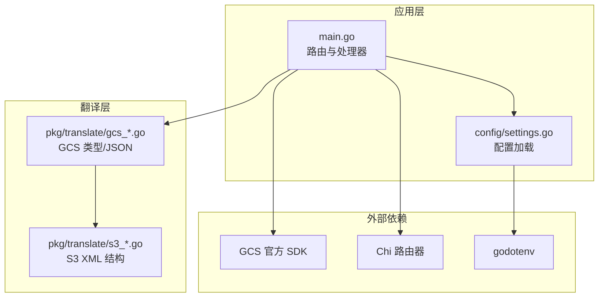
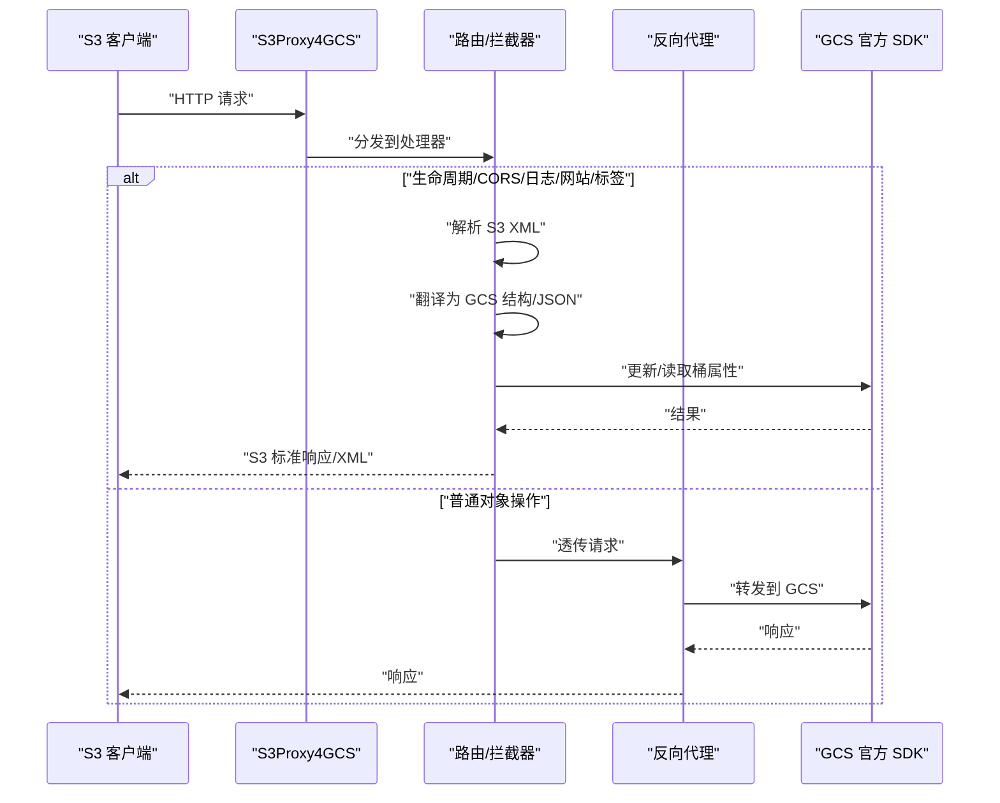
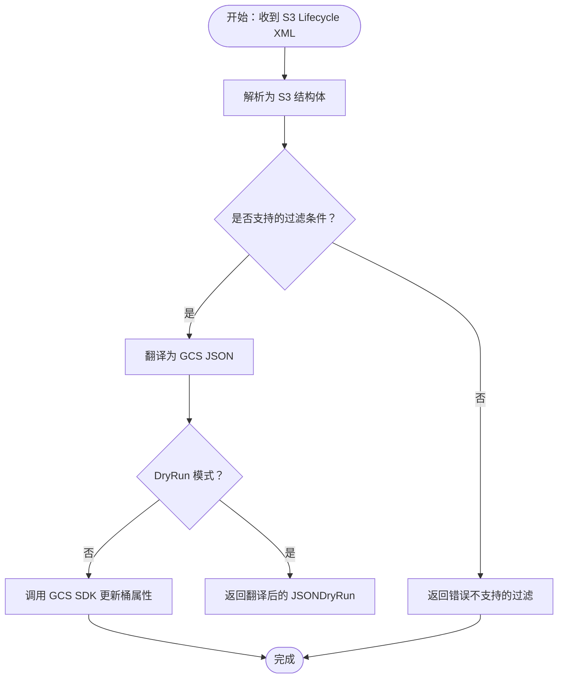
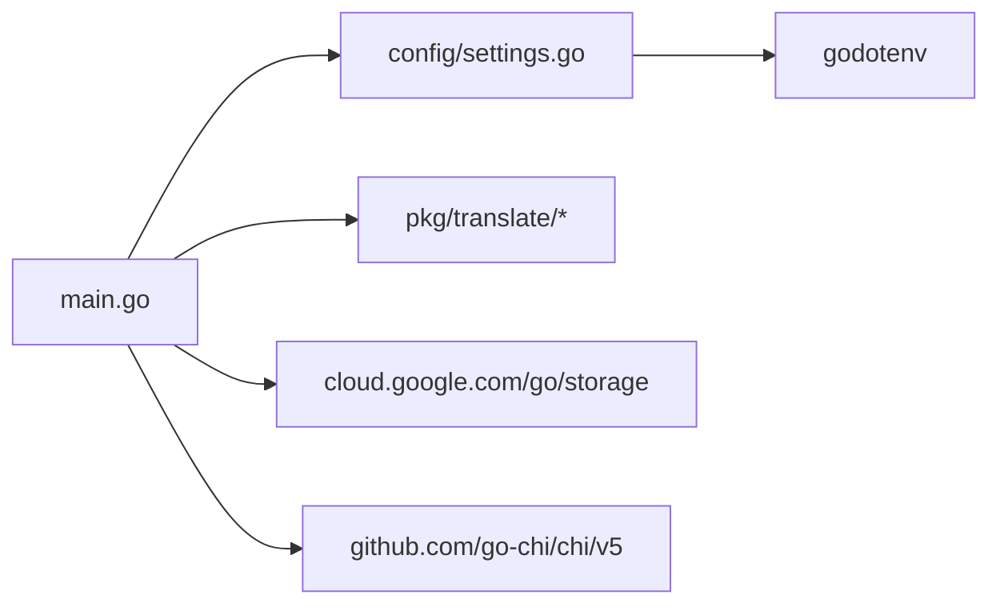

# 安装与配置

<cite>
**本文引用的文件**
- [README.md](file://README.md)
- [main.go](file://main.go)
- [config/settings.go](file://config/settings.go)
- [go.mod](file://go.mod)
- [pkg/translate/gcs_lifecycle.go](file://pkg/translate/gcs_lifecycle.go)
- [pkg/translate/gcs_cors.go](file://pkg/translate/gcs_cors.go)
- [pkg/translate/gcs_website.go](file://pkg/translate/gcs_website.go)
- [pkg/translate/gcs_tagging.go](file://pkg/translate/gcs_tagging.go)
- [pkg/translate/s3_lifecycle.go](file://pkg/translate/s3_lifecycle.go)
- [pkg/translate/s3_cors.go](file://pkg/translate/s3_cors.go)
- [integration_tests/data_plane_test.go](file://integration_tests/data_plane_test.go)
- [integration_tests/test_utils.go](file://integration_tests/test_utils.go)
</cite>

## 目录
1. [简介](#简介)
2. [项目结构](#项目结构)
3. [核心组件](#核心组件)
4. [架构总览](#架构总览)
5. [详细组件分析](#详细组件分析)
6. [依赖关系分析](#依赖关系分析)
7. [性能注意事项](#性能注意事项)
8. [故障排除指南](#故障排除指南)
9. [结论](#结论)
10. [附录](#附录)

## 简介
本项目是一个将 AWS S3 兼容客户端与 Google Cloud Storage（GCS）对接的中间件代理。它负责将 S3 的请求与响应进行适配与翻译，使标准 S3 客户端无需修改即可通过本地代理访问 GCS。项目支持生命周期、CORS、日志、静态网站托管以及对象标签等特性，并提供 DryRun 模式、连接池优化、结构化日志与优雅关闭等工程能力。

## 项目结构
- 根目录入口与路由：主程序负责初始化配置、GCS 客户端、反向代理与 HTTP 路由；拦截特定查询参数的 S3 请求（如生命周期、CORS、日志、网站、标签），其余流量透传至 GCS。
- 配置模块：集中从 .env 或环境变量加载运行参数，支持端口、GCS 项目、目标存储桶、GCS 基础 URL、前缀隔离、DryRun、调试日志、连接池、代理凭据与 JSON 凭证路径等。
- 翻译包：实现 S3 XML 与 GCS 结构之间的双向转换，覆盖生命周期、CORS、日志、网站、标签等。
- 集成测试：使用独立子模块的 AWS S3 SDK 进行端到端验证，演示如何在不污染主模块的情况下运行测试。

图表来源
- [main.go:36-251](file://main.go#L36-L251)
- [config/settings.go:29-57](file://config/settings.go#L29-L57)

章节来源
- [README.md:140-157](file://README.md#L140-L157)
- [main.go:36-251](file://main.go#L36-L251)
- [config/settings.go:29-57](file://config/settings.go#L29-L57)

## 核心组件
- 配置加载与默认值
  - 支持从 .env 或环境变量读取配置，未设置时采用默认值。
  - 关键配置项包括：端口、GCP 项目 ID、目标存储桶、GCS 基础 URL、GCS 前缀、DryRun、调试日志、最大空闲连接数、每主机最大空闲连接数、代理 AWS 凭据、JSON 凭证路径。
- 反向代理与传输层
  - 使用标准库的单主机反向代理，根据 DryRun 切换传输层：
    - DryRun：自定义传输层返回模拟响应。
    - 实际模式：启用 HTTP/2、超时控制、禁用压缩以保留 S3 签名兼容性、限制空闲连接数。
- 特定 S3 请求拦截
  - 对生命周期、CORS、日志、网站、对象标签等请求进行解析与翻译后调用 GCS SDK 更新或读取属性。
- 结构化日志与优雅关闭
  - 使用 slog 输出 JSON 日志，支持按需开启调试日志；监听 SIGTERM/SIGINT，在 10 秒内优雅关闭。

章节来源
- [config/settings.go:11-25](file://config/settings.go#L11-L25)
- [config/settings.go:29-57](file://config/settings.go#L29-L57)
- [main.go:67-90](file://main.go#L67-L90)
- [main.go:253-321](file://main.go#L253-L321)
- [main.go:204-250](file://main.go#L204-L250)

## 架构总览
下图展示了从客户端到代理再到 GCS 的整体流程，以及关键的拦截点与传输层配置。

图表来源
- [main.go:253-321](file://main.go#L253-L321)
- [main.go:348-405](file://main.go#L348-L405)
- [main.go:407-486](file://main.go#L407-L486)
- [main.go:488-563](file://main.go#L488-L563)
- [main.go:565-608](file://main.go#L565-L608)
- [main.go:610-675](file://main.go#L610-L675)

## 详细组件分析

### 配置系统
- 加载顺序与回退策略
  - 优先尝试加载 .env 文件；若不存在则直接从环境变量读取。
  - 多数配置项提供默认值，确保最小化配置即可启动。
- 关键配置项说明
  - PORT：监听端口，默认 8080。
  - GCP_PROJECT_ID：GCS 项目 ID。
  - TARGET_BUCKET：目标存储桶名称。
  - STORAGE_BASE_URL：GCS 终端 URL，默认 https://storage.googleapis.com。
  - GCS_PREFIX：命名空间前缀，用于测试隔离。
  - DRY_RUN：是否禁用真实 GCS API 调用，默认 true（适合本地测试）。
  - DEBUG_LOGGING：是否输出调试日志。
  - MAX_IDLE_CONNS / MAX_IDLE_CONNS_PER_HOST：反向代理连接池上限。
  - PROXY_AWS_ACCESS_KEY_ID / PROXY_AWS_SECRET_ACCESS_KEY：代理重签名所需的 HMAC 凭据（可与 AWS_* 兼容别名共存）。
  - JSON_KEY：GCS 服务账号 JSON 凭证路径（用于需要真实 GCS API 的场景，如网站/CORS）。
- 环境变量与 .env 的映射
  - 通过 godotenv 自动加载 .env；若无 .env，则直接读取系统环境变量。
  - 提供了测试工具从父级 .env 中解析关键变量的辅助方法，避免在集成测试中引入额外依赖。

章节来源
- [config/settings.go:29-57](file://config/settings.go#L29-L57)
- [README.md:18-29](file://README.md#L18-L29)
- [integration_tests/test_utils.go:9-112](file://integration_tests/test_utils.go#L9-L112)

### 反向代理与传输层
- 传输层选择
  - DryRun 模式：使用自定义传输层返回模拟响应，便于本地验证。
  - 实际模式：启用 HTTP/2、设置空闲连接上限与超时、禁用压缩以保持 S3 签名兼容。
- 请求重签与头处理
  - 当检测到非标准存储类、x-id 查询参数或 Accept-Encoding: identity 时，会剥离 User-Agent 并使用代理凭据重新签名，确保与 GCS S3 API 兼容。
- 响应头映射
  - 将 GCS 的版本元信息映射为 S3 的版本 ID，保证版本互操作性。

章节来源
- [main.go:67-90](file://main.go#L67-L90)
- [main.go:92-195](file://main.go#L92-L195)

### 生命周期（Lifecycle）
- 功能概述
  - 解析 S3 XML 生命周期配置，翻译为 GCS JSON 后提交到 GCS。
  - 支持过期删除、过渡到不同存储类、非当前版本过期等规则。
  - 不支持的过滤条件（如对象大小过滤、标签过滤）会在翻译阶段报错。
- 数据模型映射
  - S3 规则中的过期与过渡分别映射为 GCS 的删除动作与设置存储类动作。
  - 存储类映射遵循内置映射表，将 S3 存储类映射到 GCS 对应存储类。

图表来源
- [main.go:348-405](file://main.go#L348-L405)
- [pkg/translate/gcs_lifecycle.go:36-103](file://pkg/translate/gcs_lifecycle.go#L36-L103)
- [pkg/translate/s3_lifecycle.go:7-78](file://pkg/translate/s3_lifecycle.go#L7-L78)

章节来源
- [pkg/translate/gcs_lifecycle.go:36-135](file://pkg/translate/gcs_lifecycle.go#L36-L135)
- [pkg/translate/s3_lifecycle.go:7-78](file://pkg/translate/s3_lifecycle.go#L7-L78)

### CORS
- 功能概述
  - 支持 PUT/GET/DELETE CORS 配置，将 S3 XML 映射为 GCS CORS 列表，或将 GCS CORS 转换回 S3 XML。
  - 对于 S3 的请求头白名单（AllowedHeaders），GCS 不原生支持，翻译时会记录警告并忽略。
- 处理流程
  - PUT：解析 S3 XML，翻译为 GCS CORS 列表，实际模式下调用 GCS SDK 更新。
  - GET：读取 GCS 桶属性，转换为 S3 XML 返回。
  - DELETE：清空 CORS 配置。

章节来源
- [main.go:407-486](file://main.go#L407-L486)
- [pkg/translate/gcs_cors.go:10-35](file://pkg/translate/gcs_cors.go#L10-L35)
- [pkg/translate/s3_cors.go:5-19](file://pkg/translate/s3_cors.go#L5-L19)

### 日志（Logging）
- 功能概述
  - 支持 PUT/GET/DELETE 桶日志配置，将 S3 XML 映射为 GCS 日志结构，或反之。
- 处理流程
  - PUT：解析 S3 XML，翻译为 GCS 日志结构，实际模式下调用 GCS SDK 更新。
  - GET：读取 GCS 桶属性，转换为 S3 XML 返回。
  - DELETE：清空日志配置。

章节来源
- [main.go:488-563](file://main.go#L488-L563)

### 静态网站托管（Website）
- 功能概述
  - 支持 S3 网站配置（主页后缀、404 页面）到 GCS 网站配置的映射。
- 处理流程
  - PUT：解析 S3 XML，翻译为 GCS 网站配置，实际模式下调用 GCS SDK 更新。
  - GET/DELETE：读取或清空网站配置。

章节来源
- [main.go:565-608](file://main.go#L565-L608)
- [pkg/translate/gcs_website.go:9-26](file://pkg/translate/gcs_website.go#L9-L26)

### 对象标签（Tagging）
- 功能概述
  - 支持对象标签的 PUT/GET/DELETE，将 S3 XML 标签映射为 GCS 对象元数据。
  - 使用乐观并发控制（基于元生成号）防止覆盖冲突。
- 处理流程
  - PUT：解析 S3 XML，计算需要删除与新增的元数据键值对，使用 OCC 条件更新。
  - GET：读取对象元数据，转换为 S3 XML 返回。
  - DELETE：清理以特定前缀开头的元数据键。

章节来源
- [main.go:610-740](file://main.go#L610-L740)
- [pkg/translate/gcs_tagging.go:10-47](file://pkg/translate/gcs_tagging.go#L10-L47)

### 安装与运行
- 环境要求
  - Go 版本：1.25.0（模块声明）
  - 依赖：GCS 官方 SDK、Chi 路由器、godotenv
- 获取与构建
  - 初始化依赖：执行模块整理命令。
  - 运行本地服务：启动主程序。
- 测试运行
  - 在集成测试子模块中运行测试，使用独立的 Go 版本与模块管理，自动启动本地代理并通过真实 AWS SDK 验证数据面。

章节来源
- [go.mod:3](file://go.mod#L3)
- [README.md:126-138](file://README.md#L126-L138)
- [README.md:112-123](file://README.md#L112-L123)

### 使用方式
- 透明代理（系统级）
  - 设置 HTTP_PROXY/HTTPS_PROXY 指向本地代理端口，客户端无需修改代码即可走代理。
  - 需要使用路径风格地址（Path-Style）以满足 GCS S3 兼容性。
- 显式客户端传输
  - 通过自定义 DialContext 将 GCS 地址定向到本地代理，保持标准 S3 端点不变，避免影响其他流量。

章节来源
- [README.md:30-87](file://README.md#L30-L87)
- [integration_tests/data_plane_test.go:15-106](file://integration_tests/data_plane_test.go#L15-L106)

## 依赖关系分析
- 内部依赖
  - main.go 依赖 config.Settings 与 pkg/translate 包进行请求拦截与翻译。
  - config/settings.go 依赖 godotenv 读取 .env。
- 外部依赖
  - GCS 官方 SDK：用于桶与对象属性的读写。
  - Chi 路由器：提供高性能路由与中间件。
  - godotenv：支持 .env 文件加载。

图表来源
- [main.go:27-28](file://main.go#L27-L28)
- [config/settings.go:8](file://config/settings.go#L8)
- [go.mod:5-9](file://go.mod#L5-L9)

章节来源
- [go.mod:5-9](file://go.mod#L5-L9)
- [main.go:27-28](file://main.go#L27-L28)
- [config/settings.go:8](file://config/settings.go#L8)

## 性能注意事项
- 连接池配置
  - 通过 MAX_IDLE_CONNS 与 MAX_IDLE_CONNS_PER_HOST 控制反向代理的空闲连接上限，避免资源浪费与连接耗尽。
- 传输层优化
  - 启用 HTTP/2、设置合理的超时与禁用压缩，有助于提升吞吐与稳定性。
- DryRun 模式
  - 在开发与测试阶段启用 DryRun 可显著降低网络开销与外部依赖风险。

章节来源
- [config/settings.go:40-41](file://config/settings.go#L40-L41)
- [main.go:78-90](file://main.go#L78-L90)

## 故障排除指南
- 无法连接 GCS
  - 检查 STORAGE_BASE_URL 是否正确，确认网络可达。
  - 若使用真实 GCS API（如网站/CORS），请提供 JSON_KEY 或正确的服务账号凭据。
- 签名失败
  - 当请求涉及重签（如非标准存储类、x-id 参数或特定编码头）时，需设置代理 HMAC 凭据（PROXY_AWS_ACCESS_KEY_ID/PROXY_AWS_SECRET_ACCESS_KEY）。
- CORS 配置无效
  - 注意 S3 的请求头白名单在 GCS 上不被原生支持，翻译时会忽略并发出警告。
- 生命周期规则不生效
  - 某些 S3 过滤条件（如对象大小过滤、标签过滤）在 GCS 上不受支持，翻译阶段会报错，请调整规则。
- 对象标签冲突
  - 标签更新使用乐观并发控制，若出现冲突（如并发更新），请重试或检查并发策略。
- 日志与调试
  - 开启 DEBUG_LOGGING 查看详细请求/响应头与内部处理过程，便于定位问题。

章节来源
- [main.go:51-65](file://main.go#L51-L65)
- [main.go:156-181](file://main.go#L156-L181)
- [pkg/translate/gcs_cors.go:20-22](file://pkg/translate/gcs_cors.go#L20-L22)
- [pkg/translate/gcs_lifecycle.go:110-116](file://pkg/translate/gcs_lifecycle.go#L110-L116)
- [main.go:661-670](file://main.go#L661-L670)
- [config/settings.go:38](file://config/settings.go#L38)

## 结论
S3Proxy4GCS 提供了从 S3 到 GCS 的完整兼容层，具备灵活的配置、强大的翻译能力与稳健的工程特性。通过合理设置环境变量与连接池参数，并结合 DryRun 模式与调试日志，可在本地快速验证并在生产环境中稳定运行。

## 附录

### 环境变量与配置项对照表
- PORT：监听端口（默认 8080）
- GCP_PROJECT_ID：GCS 项目 ID
- TARGET_BUCKET：目标存储桶
- STORAGE_BASE_URL：GCS 终端 URL（默认 https://storage.googleapis.com）
- GCS_PREFIX：命名空间前缀
- DRY_RUN：DryRun 模式（默认 true）
- DEBUG_LOGGING：调试日志（默认 false）
- MAX_IDLE_CONNS：最大空闲连接数（默认 1000）
- MAX_IDLE_CONNS_PER_HOST：每主机最大空闲连接数（默认 1000）
- PROXY_AWS_ACCESS_KEY_ID / PROXY_AWS_SECRET_ACCESS_KEY：代理 HMAC 凭据（可与 AWS_* 兼容别名共存）
- JSON_KEY：GCS 服务账号 JSON 凭证路径

章节来源
- [README.md:18-29](file://README.md#L18-L29)
- [config/settings.go:43-56](file://config/settings.go#L43-L56)

### 配置文件模板（.env）
- 建议步骤
  - 复制模板文件并填写必要字段。
  - 在 DryRun 模式下先进行本地验证，再切换到实际模式。
- 最佳实践
  - 生产环境务必设置 PROXY_AWS_ACCESS_KEY_ID/PROXY_AWS_SECRET_ACCESS_KEY 以支持重签。
  - 对于需要真实 GCS API 的功能（网站/CORS），提供 JSON_KEY。
  - 合理设置连接池参数以平衡性能与资源占用。
  - 使用 GCS_PREFIX 进行多租户或测试隔离。

章节来源
- [README.md:13-16](file://README.md#L13-L16)
- [README.md:18-29](file://README.md#L18-L29)