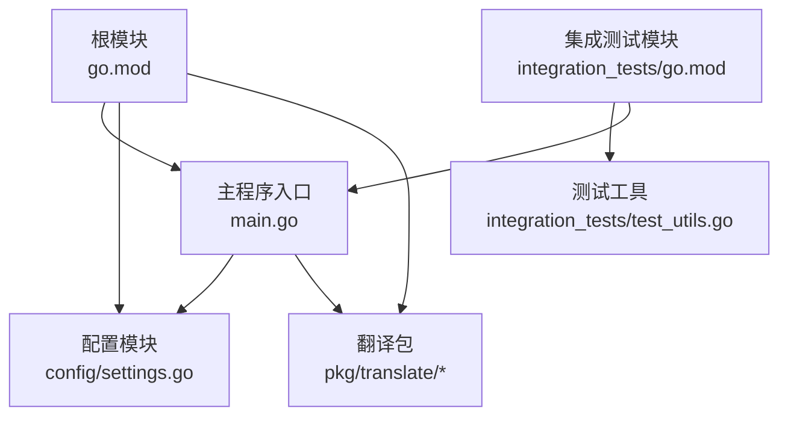
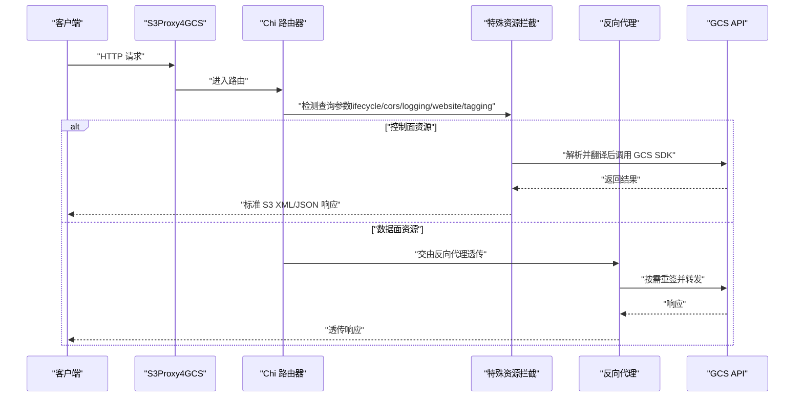
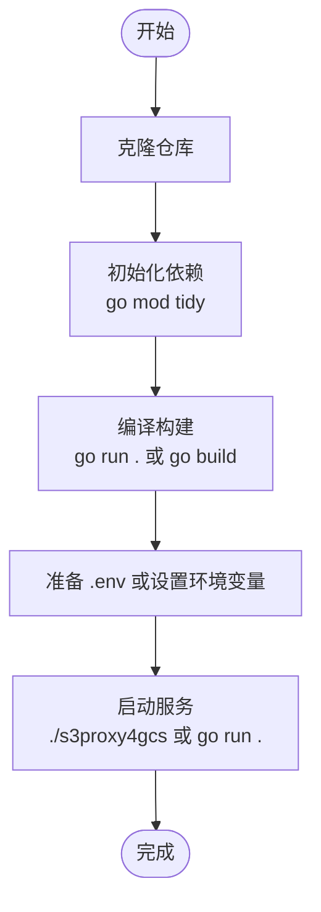
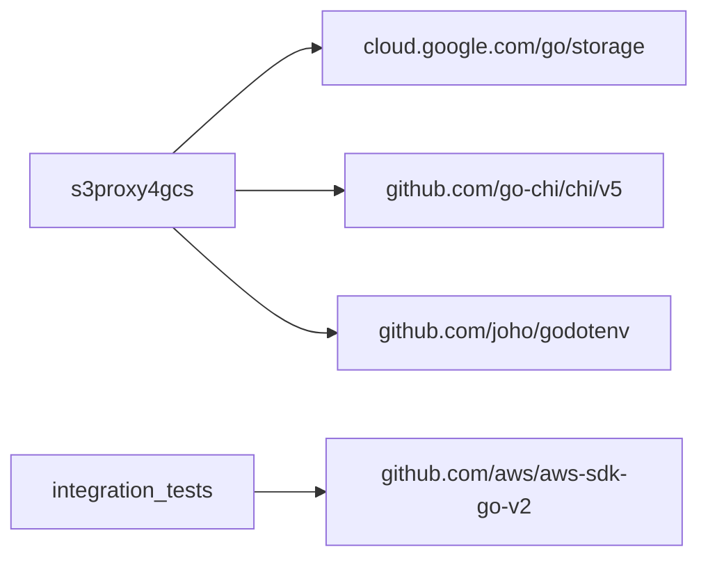

# 安装步骤

<cite>
**本文引用的文件**
- [README.md](file://README.md)
- [go.mod](file://go.mod)
- [main.go](file://main.go)
- [config/settings.go](file://config/settings.go)
- [integration_tests/go.mod](file://integration_tests/go.mod)
- [integration_tests/test_utils.go](file://integration_tests/test_utils.go)
- [AGENTS.md](file://AGENTS.md)
- [solutions.md](file://solutions.md)
</cite>

## 目录
1. [简介](#简介)
2. [项目结构](#项目结构)
3. [核心组件](#核心组件)
4. [架构总览](#架构总览)
5. [详细组件分析](#详细组件分析)
6. [依赖关系分析](#依赖关系分析)
7. [性能考虑](#性能考虑)
8. [故障排查指南](#故障排查指南)
9. [结论](#结论)
10. [附录](#附录)

## 简介
本指南面向希望在本地或生产环境中安装与运行 S3Proxy4GCS 的用户，覆盖以下内容：
- 从源码编译安装的完整流程（克隆仓库、安装依赖、编译构建）
- 二进制文件下载与安装方法（如适用）
- Docker 容器化部署指南（如适用）
- 不同操作系统（Linux、macOS、Windows）的具体安装命令与注意事项
- 常见问题与解决方案

本项目是一个 S3 到 GCS 的中间件代理，负责将不受支持或边缘场景的 S3 特性翻译为 GCS 兼容操作，并对标准对象流量进行高性能反向代理转发。

**章节来源**
- [README.md:1-157](file://README.md#L1-L157)

## 项目结构
- 根模块：使用 Go 模块管理，主程序入口位于根目录
- 配置模块：集中于 config/settings.go，支持 .env 文件与环境变量加载
- 功能包：pkg/translate 提供 S3 与 GCS 之间的双向翻译逻辑
- 集成测试：独立子模块 integration_tests，使用 AWS S3 SDK 进行端到端验证
- 文档：README.md、AGENTS.md、solutions.md 等

**图表来源**
- [go.mod:1-61](file://go.mod#L1-L61)
- [main.go:1-30](file://main.go#L1-L30)
- [config/settings.go:1-65](file://config/settings.go#L1-L65)
- [integration_tests/go.mod:1-32](file://integration_tests/go.mod#L1-L32)
- [integration_tests/test_utils.go:1-113](file://integration_tests/test_utils.go#L1-L113)

**章节来源**
- [go.mod:1-61](file://go.mod#L1-L61)
- [README.md:140-157](file://README.md#L140-L157)

## 核心组件
- 主程序入口：初始化配置、日志、GCS 客户端、反向代理与路由，监听指定端口并处理健康检查与请求拦截
- 配置模块：统一加载 .env 或环境变量，解析端口、目标桶、DryRun、连接池参数、代理 HMAC 凭据与 JSON 密钥路径等
- 翻译包：实现 S3 XML 与 GCS JSON 的双向转换，覆盖生命周期、CORS、日志、网站与对象标签等特性
- 集成测试：独立模块，使用 AWS S3 SDK 对代理进行自动化验证

**章节来源**
- [main.go:37-252](file://main.go#L37-L252)
- [config/settings.go:11-56](file://config/settings.go#L11-L56)
- [README.md:140-157](file://README.md#L140-L157)

## 架构总览
下图展示从客户端到代理再到 GCS 的典型请求路径，以及代理内部如何区分“控制面”（带查询参数的特殊资源）与“数据面”（对象读写）处理逻辑。

**图表来源**
- [main.go:254-338](file://main.go#L254-L338)
- [main.go:365-422](file://main.go#L365-L422)
- [main.go:461-504](file://main.go#L461-L504)
- [main.go:542-585](file://main.go#L542-L585)
- [main.go:619-662](file://main.go#L619-L662)
- [main.go:701-766](file://main.go#L701-L766)

## 详细组件分析

### 从源码编译安装（通用流程）
- 克隆仓库
  - 使用 Git 克隆项目到本地工作目录
- 初始化依赖
  - 执行模块依赖初始化，确保所有依赖正确拉取
- 编译与运行
  - 可直接运行开发版本，或构建可执行文件用于部署

**图表来源**
- [README.md:126-137](file://README.md#L126-L137)
- [go.mod:1-61](file://go.mod#L1-L61)

**章节来源**
- [README.md:126-137](file://README.md#L126-L137)
- [go.mod:1-61](file://go.mod#L1-L61)

### 二进制文件下载与安装（如适用）
- 当前仓库未提供预编译二进制发布页面；建议通过源码编译安装
- 若需要分发二进制，请在 CI 中构建多平台产物并在发布页提供下载链接（此为建议做法）

**章节来源**
- [README.md:126-137](file://README.md#L126-L137)

### Docker 容器化部署（如适用）
- 当前仓库未包含 Dockerfile 或 docker-compose 文件
- 如需容器化部署，可在 CI 中生成镜像并推送至镜像仓库，同时提供部署清单（如 Deployment/Service/ConfigMap）

**章节来源**
- [README.md:126-137](file://README.md#L126-L137)

### 不同操作系统安装要点

- Linux/macOS
  - 安装 Go（满足版本要求）
  - 克隆仓库并初始化依赖
  - 运行或构建后设置 .env 并启动
  - 注意：若使用系统代理环境变量，需确保路径样式与 GCS 兼容（参见配置说明）

- Windows
  - 安装 Go（满足版本要求）
  - 在 PowerShell 或 Git Bash 中执行相同流程
  - 注意：路径分隔符与环境变量设置方式与类 Unix 系统一致

**章节来源**
- [README.md:7-8](file://README.md#L7-L8)
- [README.md:126-137](file://README.md#L126-L137)

### 配置与环境变量
- .env 模板复制与配置
  - 复制模板文件以生成 .env
  - 设置端口、目标桶、项目 ID、存储基础 URL、前缀、DryRun、调试日志、连接池参数、代理 HMAC 凭据与 JSON 密钥路径等
- 环境变量优先级
  - 支持 .env 与环境变量混合加载，后者优先

**章节来源**
- [README.md:13-28](file://README.md#L13-L28)
- [config/settings.go:29-56](file://config/settings.go#L29-L56)

### 集成测试与验证
- 集成测试模块
  - 独立子模块，使用 AWS S3 SDK 进行自动化验证
  - 可在 integration_tests 目录中执行测试，自动启动本地代理并发起真实请求
- 测试工具
  - 从环境变量或父级 .env 解析目标桶、前缀与访问凭据，避免额外依赖

**章节来源**
- [README.md:112-123](file://README.md#L112-L123)
- [integration_tests/go.mod:1-32](file://integration_tests/go.mod#L1-L32)
- [integration_tests/test_utils.go:9-112](file://integration_tests/test_utils.go#L9-L112)

## 依赖关系分析
- 核心依赖
  - GCS 官方 SDK：用于桶与对象属性更新、元数据读写
  - HTTP 路由框架：提供高性能路由器与中间件
  - 环境变量加载：简化本地开发与 CI 环境配置
- 间接依赖
  - AWS SDK（用于测试）、OpenTelemetry、gRPC、Protobuf 等生态组件

**图表来源**
- [go.mod:5-9](file://go.mod#L5-L9)
- [integration_tests/go.mod:8-12](file://integration_tests/go.mod#L8-L12)

**章节来源**
- [go.mod:1-61](file://go.mod#L1-L61)
- [integration_tests/go.mod:1-32](file://integration_tests/go.mod#L1-L32)

## 性能考虑
- 反向代理传输层优化
  - 合理设置最大空闲连接数与每主机空闲连接数，启用 HTTP/2，禁用压缩以保留签名完整性
- 连接复用与超时
  - 为传输层设置合理的空闲超时、TLS 握手超时与期望继续超时，避免悬挂连接
- 日志与可观测性
  - 使用结构化 JSON 日志，便于云原生日志收集与分析
- 关键路径优化
  - 数据面对象读写保持流式处理，避免将整个请求体载入内存

**章节来源**
- [main.go:74-91](file://main.go#L74-L91)
- [main.go:185-196](file://main.go#L185-L196)
- [AGENTS.md:19](file://AGENTS.md#L19)

## 故障排查指南
- 启动失败或端口占用
  - 检查端口是否被占用，修改 PORT 或释放占用进程
- GCS 认证失败
  - 确认 JSON_KEY 路径有效且权限正确；DryRun 模式下不会调用真实 API
- S3 签名不匹配
  - 若修改了请求体（如生命周期 XML），需提供代理 HMAC 凭据以重新签名
- 存储类不兼容
  - 代理会自动将 AWS 存储类映射到 GCS 等价值；如仍报错，请确认客户端未传递不受支持的值
- 版本化互操作
  - 列表版本时注入特定头以获得 S3 兼容输出；响应中将映射 Generation 到 VersionId
- 客户端兼容性
  - 某些 SDK 默认使用灵活校验和导致签名不匹配，可通过环境变量或客户端配置规避

**章节来源**
- [main.go:52-66](file://main.go#L52-L66)
- [main.go:157-182](file://main.go#L157-L182)
- [main.go:113-133](file://main.go#L113-L133)
- [main.go:151-155](file://main.go#L151-L155)
- [solutions.md:93-123](file://solutions.md#L93-L123)

## 结论
S3Proxy4GCS 提供了从源码到运行的完整安装路径。通过 .env 或环境变量进行配置，结合 Go 模块管理与高性能反向代理，可在本地与生产环境中快速部署。对于需要更高吞吐与更低延迟的场景，可进一步优化传输层参数与部署架构。

[无章节来源：总结性内容]

## 附录

### A. 从源码编译安装步骤（汇总）
- 步骤
  - 克隆仓库
  - 初始化依赖
  - 运行或构建
  - 准备 .env 或设置环境变量
  - 启动服务
- 参考
  - [README.md:126-137](file://README.md#L126-L137)
  - [go.mod:1-61](file://go.mod#L1-L61)

**章节来源**
- [README.md:126-137](file://README.md#L126-L137)
- [go.mod:1-61](file://go.mod#L1-L61)

### B. 配置项速查
- 必填项
  - PORT、TARGET_BUCKET、GCP_PROJECT_ID（如需）
- 可选项
  - STORAGE_BASE_URL、GCS_PREFIX、DRY_RUN、JSON_KEY、AWS_ACCESS_KEY_ID/AWS_SECRET_ACCESS_KEY、MAX_IDLE_CONNS、MAX_IDLE_CONNS_PER_HOST、DEBUG_LOGGING
- 加载顺序
  - .env 优先于环境变量

**章节来源**
- [README.md:18-28](file://README.md#L18-L28)
- [config/settings.go:29-56](file://config/settings.go#L29-L56)

### C. 集成测试运行
- 在 integration_tests 目录中执行
- 自动拉起本地代理并使用 AWS S3 SDK 发起测试请求

**章节来源**
- [README.md:112-123](file://README.md#L112-L123)
- [integration_tests/go.mod:1-32](file://integration_tests/go.mod#L1-L32)