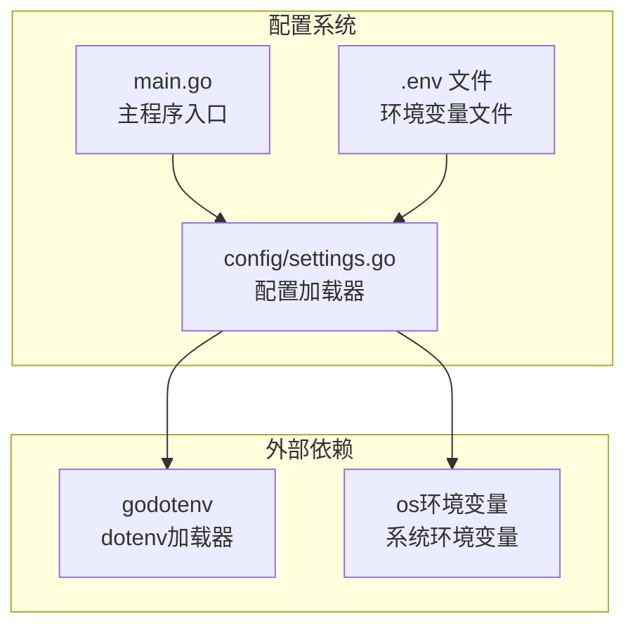
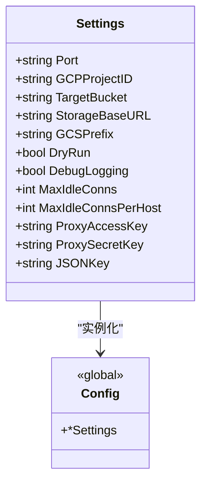
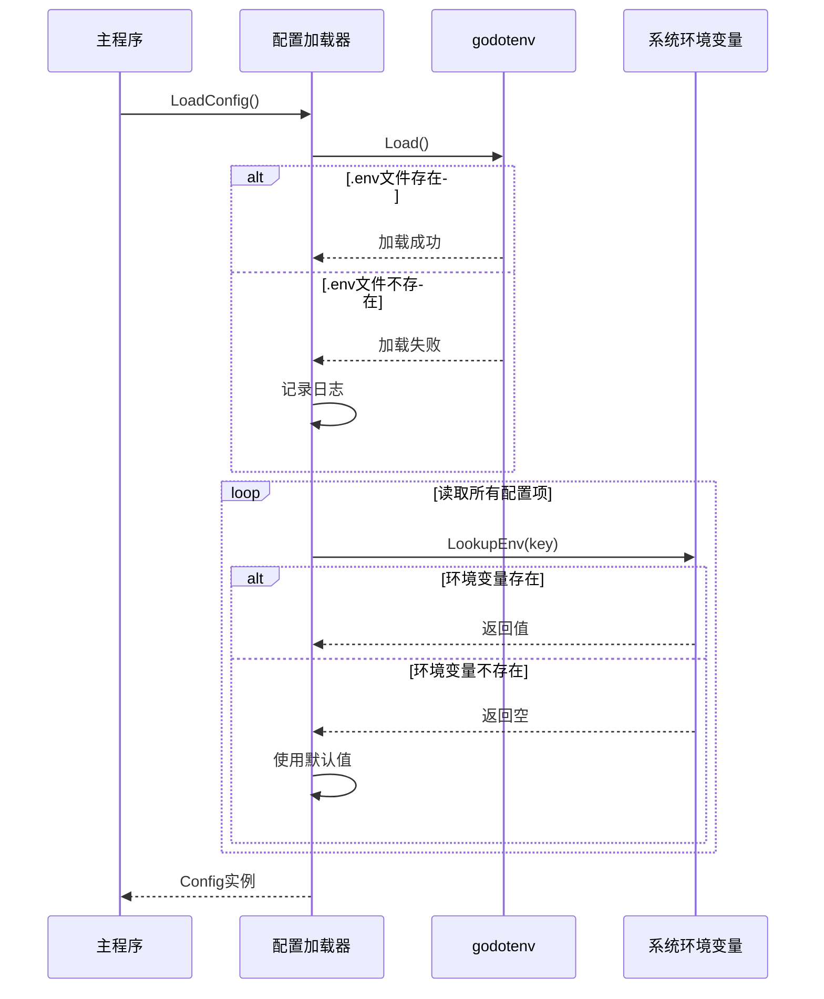
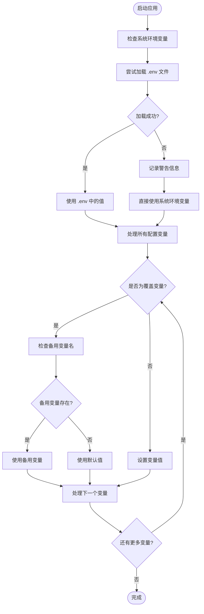
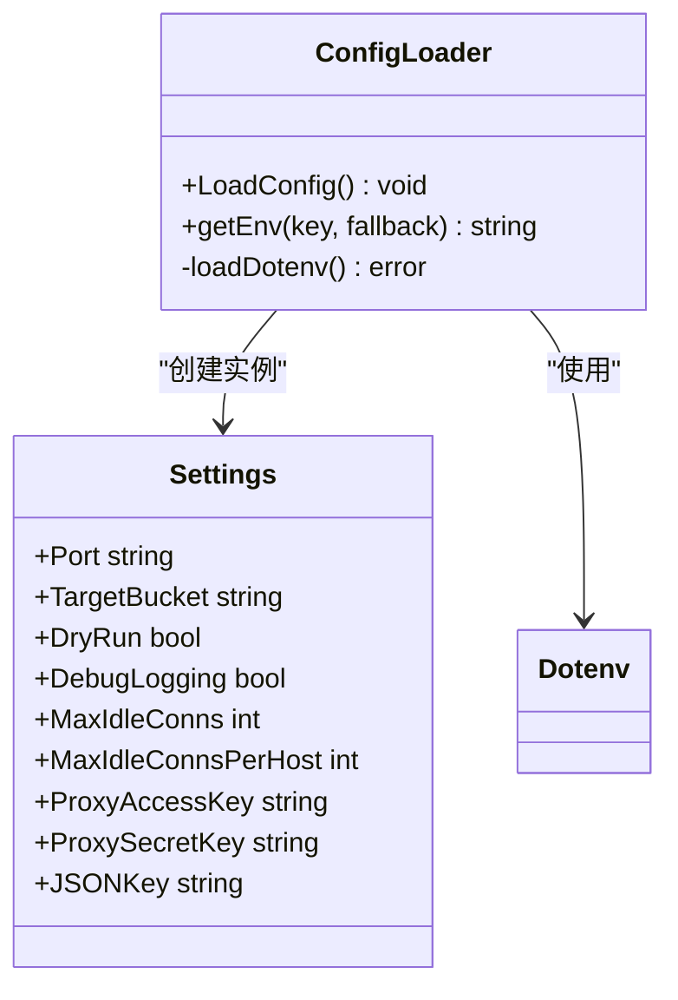
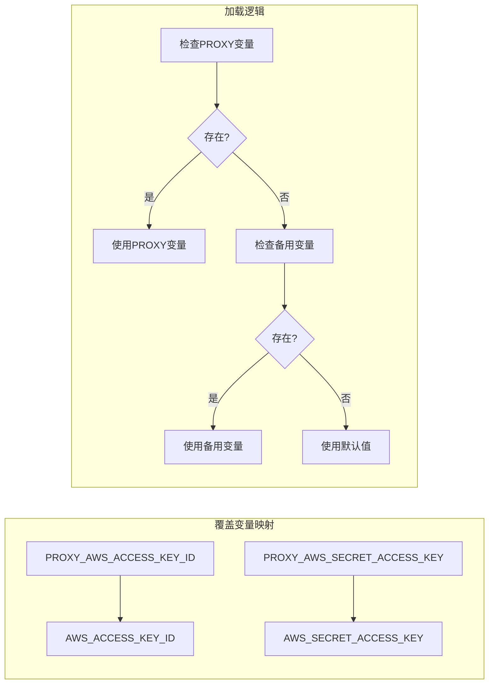
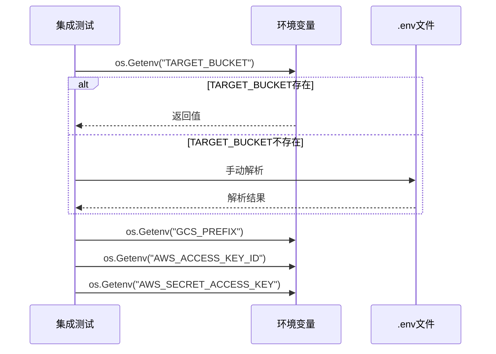
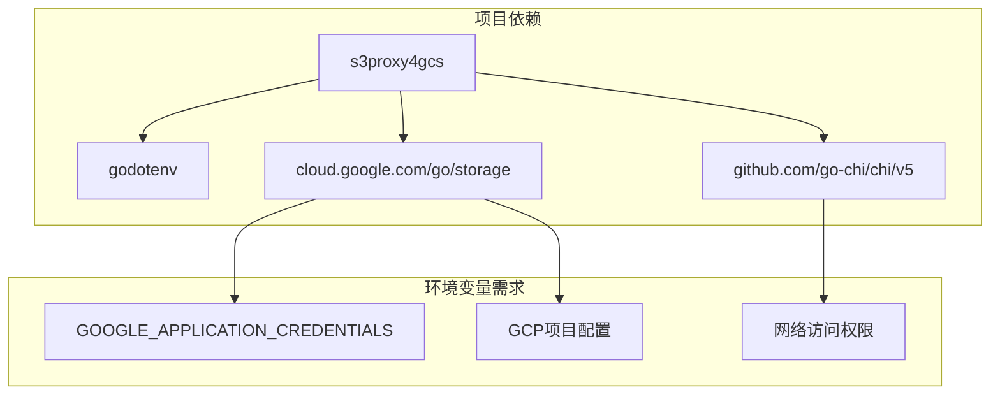
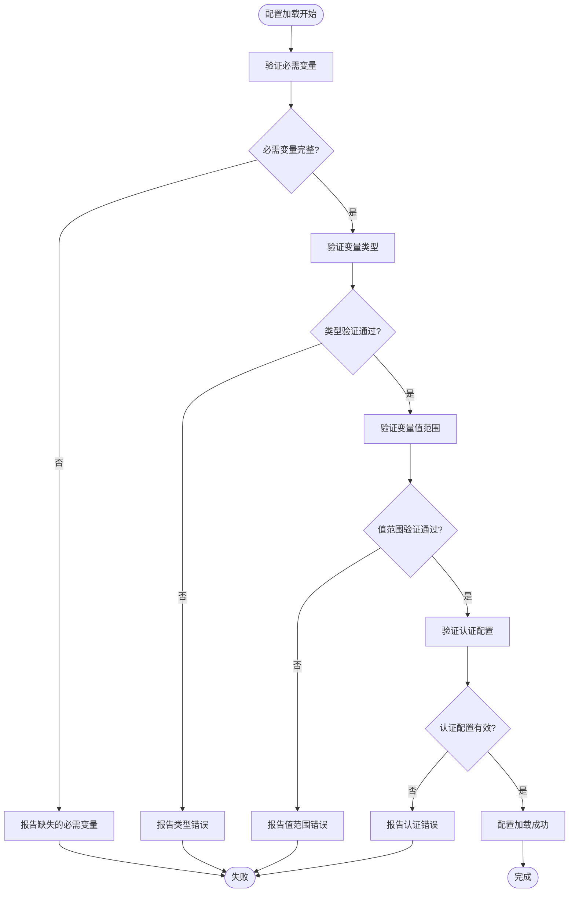

# 环境变量配置

<cite>
**本文档引用的文件**
- [main.go](file://main.go)
- [config/settings.go](file://config/settings.go)
- [README.md](file://README.md)
- [integration_tests/test_utils.go](file://integration_tests/test_utils.go)
- [go.mod](file://go.mod)
</cite>

## 目录
1. [简介](#简介)
2. [项目结构](#项目结构)
3. [核心组件](#核心组件)
4. [架构概览](#架构概览)
5. [详细组件分析](#详细组件分析)
6. [依赖关系分析](#依赖关系分析)
7. [性能考虑](#性能考虑)
8. [故障排除指南](#故障排除指南)
9. [结论](#结论)

## 简介

本指南详细说明了 S3Proxy4GCS 项目中的环境变量配置系统。该项目是一个 AWS S3 兼容客户端 SDK 与 Google Cloud Storage (GCS) 之间的中间件代理。环境变量配置是该系统的核心组成部分，负责控制代理的行为、连接参数以及认证设置。

## 项目结构

该项目采用模块化架构，环境变量配置主要集中在以下组件中：



**图表来源**
- [config/settings.go:1-65](file://config/settings.go#L1-L65)
- [main.go:37-39](file://main.go#L37-L39)

**章节来源**
- [config/settings.go:1-65](file://config/settings.go#L1-L65)
- [main.go:1-30](file://main.go#L1-L30)

## 核心组件

### 配置结构体定义

配置系统通过 `Settings` 结构体统一管理所有环境变量：



**图表来源**
- [config/settings.go:11-25](file://config/settings.go#L11-L25)

### 配置加载流程

配置系统支持两种加载方式：`.env` 文件加载和直接环境变量读取。



**图表来源**
- [config/settings.go:29-57](file://config/settings.go#L29-L57)

**章节来源**
- [config/settings.go:11-65](file://config/settings.go#L11-L65)

## 架构概览

### 环境变量优先级系统

环境变量系统实现了明确的优先级规则：



**图表来源**
- [config/settings.go:30-56](file://config/settings.go#L30-L56)

### 支持的环境变量列表

以下是项目支持的所有环境变量及其详细说明：

| 变量名称 | 类型 | 默认值 | 描述 | 用途 |
|---------|------|--------|------|------|
| PORT | 字符串 | "8080" | 服务器监听端口 | 控制代理服务的端口 |
| GCP_PROJECT_ID | 字符串 | "" | Google Cloud项目ID | GCS项目标识 |
| TARGET_BUCKET | 字符串 | "" | 目标GCS存储桶 | 指定操作的目标存储桶 |
| STORAGE_BASE_URL | 字符串 | "https://storage.googleapis.com" | GCS基础URL | 自定义GCS端点 |
| GCS_PREFIX | 字符串 | "" | GCS前缀 | 测试隔离和命名空间 |
| DRY_RUN | 布尔值 | "true" | 干运行模式 | 安全测试模式 |
| DEBUG_LOGGING | 布尔值 | "false" | 调试日志模式 | 详细日志输出 |
| MAX_IDLE_CONNS | 整数 | 1000 | 最大空闲连接数 | 连接池配置 |
| MAX_IDLE_CONNS_PER_HOST | 整数 | 1000 | 每主机最大空闲连接 | 连接池配置 |
| PROXY_AWS_ACCESS_KEY_ID | 字符串 | "" | 代理访问密钥ID | 请求重签名 |
| PROXY_AWS_SECRET_ACCESS_KEY | 字符串 | "" | 代理秘密访问密钥 | 请求重签名 |
| AWS_ACCESS_KEY_ID | 字符串 | "" | 备用访问密钥ID | 兼容性支持 |
| AWS_SECRET_ACCESS_KEY | 字符串 | "" | 备用秘密访问密钥 | 兼容性支持 |
| JSON_KEY | 字符串 | "" | GCS服务账号JSON密钥路径 | 认证凭据 |

**章节来源**
- [config/settings.go:12-25](file://config/settings.go#L12-L25)
- [config/settings.go:43-56](file://config/settings.go#L43-L56)

## 详细组件分析

### 配置加载器实现

配置加载器使用 `godotenv` 库来支持 `.env` 文件格式，并提供回退机制：



**图表来源**
- [config/settings.go:29-64](file://config/settings.go#L29-L64)

### 覆盖变量机制

系统实现了智能的变量覆盖机制，支持备用变量名：



**图表来源**
- [config/settings.go:53-54](file://config/settings.go#L53-L54)

**章节来源**
- [config/settings.go:29-64](file://config/settings.go#L29-L64)

### 集成测试中的环境变量使用

集成测试模块展示了环境变量在测试场景中的实际应用：



**图表来源**
- [integration_tests/test_utils.go:9-112](file://integration_tests/test_utils.go#L9-L112)

**章节来源**
- [integration_tests/test_utils.go:9-112](file://integration_tests/test_utils.go#L9-L112)

## 依赖关系分析

### 外部依赖关系

项目对外部依赖的环境变量配置要求：



**图表来源**
- [go.mod:5-9](file://go.mod#L5-L9)

**章节来源**
- [go.mod:1-61](file://go.mod#L1-L61)

### 配置验证流程

系统提供了完整的配置验证机制：



**图表来源**
- [config/settings.go:30-56](file://config/settings.go#L30-L56)

## 性能考虑

### 连接池配置

环境变量对性能的影响主要体现在连接池配置上：

- `MAX_IDLE_CONNS`: 控制全局空闲连接数，默认1000
- `MAX_IDLE_CONNS_PER_HOST`: 控制每主机空闲连接数，默认1000

这些配置直接影响代理的并发处理能力和资源消耗。

### 日志级别控制

- `DEBUG_LOGGING`: 启用详细日志输出，影响性能但提供更好的调试能力
- `DRY_RUN`: 在测试模式下禁用真实GCS调用，提高测试速度

## 故障排除指南

### 常见配置错误

1. **缺少必需变量**
   - `TARGET_BUCKET` 未设置会导致GCS操作失败
   - `JSON_KEY` 或服务账号配置不正确导致认证失败

2. **类型转换错误**
   - `MAX_IDLE_CONNS` 和 `MAX_IDLE_CONNS_PER_HOST` 必须为整数值
   - `DRY_RUN` 和 `DEBUG_LOGGING` 必须为布尔值字符串

3. **认证配置问题**
   - `PROXY_AWS_ACCESS_KEY_ID` 和 `PROXY_AWS_SECRET_ACCESS_KEY` 必须同时设置
   - GCS JSON密钥文件路径必须正确

### 调试方法

1. **启用调试日志**
   ```bash
   export DEBUG_LOGGING=true
   ```

2. **检查配置加载**
   ```bash
   # 查看当前配置
   go run . --help
   ```

3. **验证环境变量**
   ```bash
   # 检查所有环境变量
   env | grep -E '^(PORT|TARGET_BUCKET|DRY_RUN|DEBUG_LOGGING)'
   ```

### 部署环境模板

#### 开发环境 (.env.development)
```env
PORT=8080
TARGET_BUCKET=my-dev-bucket
DRY_RUN=true
DEBUG_LOGGING=true
MAX_IDLE_CONNS=100
MAX_IDLE_CONNS_PER_HOST=100
```

#### 测试环境 (.env.test)
```env
PORT=8081
TARGET_BUCKET=my-test-bucket
DRY_RUN=true
DEBUG_LOGGING=false
MAX_IDLE_CONNS=500
MAX_IDLE_CONNS_PER_HOST=500
```

#### 生产环境 (.env.production)
```env
PORT=8080
TARGET_BUCKET=my-prod-bucket
DRY_RUN=false
DEBUG_LOGGING=false
MAX_IDLE_CONNS=2000
MAX_IDLE_CONNS_PER_HOST=2000
```

## 结论

S3Proxy4GCS 的环境变量配置系统设计精良，提供了灵活的配置管理机制。通过 `.env` 文件支持和直接环境变量读取的双重机制，用户可以根据不同的部署环境轻松配置应用。系统的覆盖变量机制确保了向后兼容性和灵活性。

建议的最佳实践：
1. 使用 `.env` 文件进行本地开发配置
2. 在生产环境中使用系统环境变量
3. 为不同环境准备专门的配置文件
4. 定期验证配置的有效性
5. 启用适当的日志级别进行监控