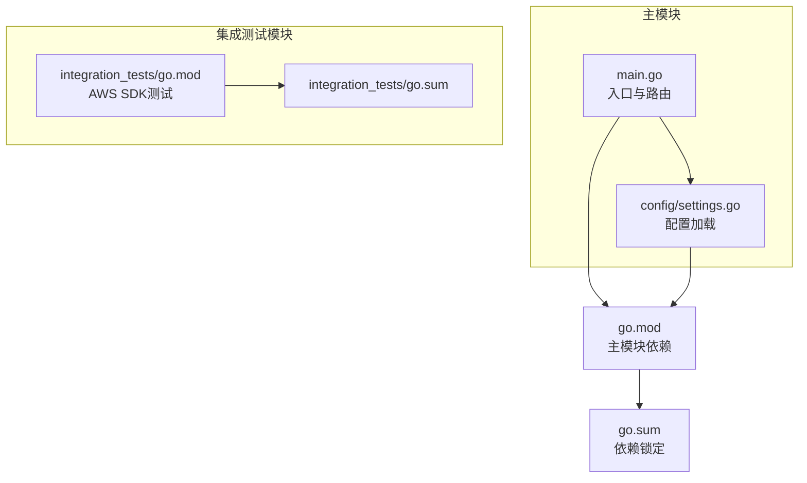
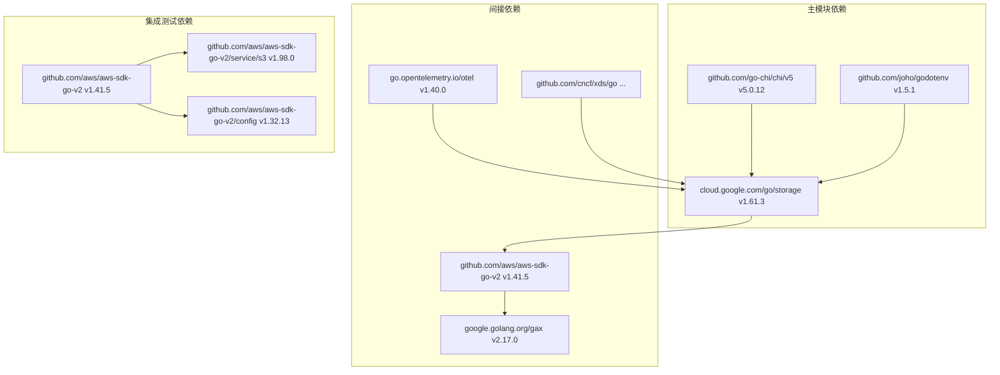
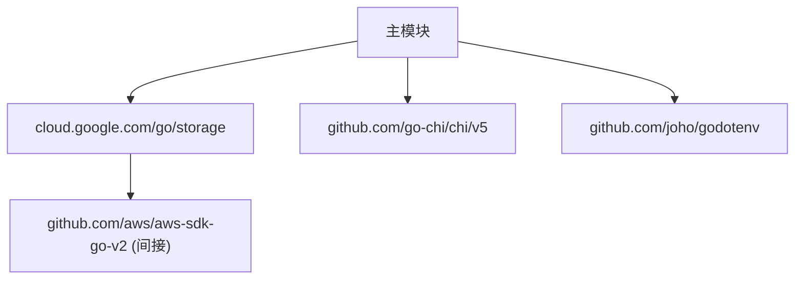

# 环境要求与依赖

<cite>
**本文档引用的文件**
- [go.mod](file://go.mod)
- [go.sum](file://go.sum)
- [README.md](file://README.md)
- [main.go](file://main.go)
- [config/settings.go](file://config/settings.go)
- [integration_tests/go.mod](file://integration_tests/go.mod)
- [integration_tests/go.sum](file://integration_tests/go.sum)
- [solutions.md](file://solutions.md)
</cite>

## 目录
1. [简介](#简介)
2. [项目结构](#项目结构)
3. [核心组件](#核心组件)
4. [架构总览](#架构总览)
5. [详细组件分析](#详细组件分析)
6. [依赖分析](#依赖分析)
7. [性能考虑](#性能考虑)
8. [故障排除指南](#故障排除指南)
9. [结论](#结论)
10. [附录](#附录)

## 简介
本文件面向S3Proxy4GCS项目的环境要求与依赖管理，重点涵盖：
- Go语言版本要求与兼容性
- 必需第三方依赖库及其作用与版本兼容性
- 操作系统与硬件资源建议
- 开发环境与生产环境的环境要求对比
- 依赖版本来源与锁定机制说明

## 项目结构
S3Proxy4GCS采用模块化设计，主模块负责代理服务与路由，集成测试模块独立使用AWS SDK进行端到端验证。配置通过dotenv加载，支持环境变量覆盖。

**图表来源**
- [main.go:1-50](file://main.go#L1-L50)
- [config/settings.go:1-30](file://config/settings.go#L1-L30)
- [go.mod:1-61](file://go.mod#L1-L61)
- [integration_tests/go.mod:1-32](file://integration_tests/go.mod#L1-L32)

**章节来源**
- [go.mod:1-61](file://go.mod#L1-L61)
- [integration_tests/go.mod:1-32](file://integration_tests/go.mod#L1-L32)

## 核心组件
- 入口与路由：基于HTTP路由器拦截S3子资源请求（如生命周期、CORS、日志、网站、标签），其余流量透传至GCS反向代理。
- 配置系统：支持从.env或环境变量加载，包含端口、目标桶、DryRun模式、连接池参数、代理HMAC凭据、GCS凭据路径等。
- 反向代理：针对GCS进行连接池优化与超时控制，必要时对请求重新签名以适配GCS S3兼容层。

**章节来源**
- [main.go:197-251](file://main.go#L197-L251)
- [config/settings.go:29-57](file://config/settings.go#L29-L57)

## 架构总览
下图展示主模块依赖与间接依赖的关系，以及集成测试模块的AWS SDK依赖。

**图表来源**
- [go.mod:5-60](file://go.mod#L5-L60)
- [integration_tests/go.mod:8-12](file://integration_tests/go.mod#L8-L12)

**章节来源**
- [go.mod:5-60](file://go.mod#L5-L60)
- [integration_tests/go.mod:8-12](file://integration_tests/go.mod#L8-L12)

## 详细组件分析

### Go语言版本要求
- 主模块要求Go 1.25.0，确保使用较新的标准库与工具链特性。
- 集成测试模块使用Go 1.24，用于验证与AWS SDK的兼容性，但主模块仍需满足1.25.0以上。

**章节来源**
- [go.mod:3](file://go.mod#L3)
- [integration_tests/go.mod:3](file://integration_tests/go.mod#L3)

### 必需第三方依赖库与作用
- cloud.google.com/go/storage v1.61.3
  - 作用：与GCS交互，执行桶属性更新、对象元数据读写、生命周期规则等。
  - 版本兼容性：与Go 1.25.0兼容；间接依赖包含cloud.google.com/go、cloud.google.com/go/auth等。
- github.com/go-chi/chi/v5 v5.0.12
  - 作用：高性能HTTP路由与中间件，处理S3子资源请求拦截与转发。
  - 版本兼容性：与Go 1.25.0兼容。
- github.com/joho/godotenv v1.5.1
  - 作用：从.env文件加载环境变量，便于本地开发与测试。
  - 版本兼容性：与Go 1.25.0兼容。
- github.com/aws/aws-sdk-go-v2（间接）
  - 作用：在集成测试中使用AWS SDK v2进行端到端验证；主模块内部也使用其签名器进行请求重签。
  - 版本兼容性：与Go 1.25.0兼容。

**章节来源**
- [go.mod:5-9](file://go.mod#L5-L9)
- [go.mod:22](file://go.mod#L22)
- [main.go:24-26](file://main.go#L24-L26)

### 配置与运行时参数
- 端口：默认8080，可通过环境变量PORT覆盖。
- 目标项目与桶：GCP_PROJECT_ID与TARGET_BUCKET。
- GCS基础URL：STORAGE_BASE_URL，默认https://storage.googleapis.com。
- 前缀隔离：GCS_PREFIX用于测试或命名空间隔离。
- DryRun模式：DRY_RUN默认true，禁用真实GCS调用，适合本地测试。
- 调试日志：DEBUG_LOGGING开启后输出结构化JSON日志。
- 连接池：MAX_IDLE_CONNS与MAX_IDLE_CONNS_PER_HOST默认1000。
- 代理HMAC凭据：PROXY_AWS_ACCESS_KEY_ID/PROXY_AWS_SECRET_ACCESS_KEY，用于请求重签。
- GCS凭据：JSON_KEY指向服务账号密钥文件路径。

**章节来源**
- [config/settings.go:12-25](file://config/settings.go#L12-L25)
- [config/settings.go:43-56](file://config/settings.go#L43-L56)

### 依赖版本来源与锁定机制
- go.mod：声明直接依赖与Go版本。
- go.sum：记录所有直接与间接依赖的精确版本与校验和，确保可复现构建。
- 集成测试模块：独立的go.mod/go.sum，避免污染主模块依赖树。

**章节来源**
- [go.mod:1-61](file://go.mod#L1-L61)
- [go.sum:1-134](file://go.sum#L1-L134)
- [integration_tests/go.mod:1-32](file://integration_tests/go.mod#L1-L32)
- [integration_tests/go.sum:1-39](file://integration_tests/go.sum#L1-L39)

## 依赖分析
下图展示主模块依赖之间的直接与间接关系，以及与集成测试模块的AWS SDK依赖。

**图表来源**
- [go.mod:5-60](file://go.mod#L5-L60)

**章节来源**
- [go.mod:5-60](file://go.mod#L5-L60)

## 性能考虑
- 连接池与超时：反向代理使用MaxIdleConns、MaxIdleConnsPerHost、IdleConnTimeout、TLSHandshakeTimeout等参数优化吞吐与延迟。
- HTTP/2：启用ForceAttemptHTTP2提升多路复用效率。
- 请求重签：当修改请求体（如生命周期XML）时，使用AWS SDK签名器重新计算签名，保证GCS兼容性。
- DryRun模式：本地测试阶段避免真实GCS调用，降低延迟与成本。

**章节来源**
- [main.go:78-90](file://main.go#L78-L90)
- [main.go:156-181](file://main.go#L156-L181)

## 故障排除指南
- 签名失败（SignatureDoesNotMatch）
  - 可能原因：请求体被修改导致原始签名失效。
  - 解决方案：确保设置代理HMAC凭据（PROXY_AWS_ACCESS_KEY_ID/PROXY_AWS_SECRET_ACCESS_KEY），以便在需要时重新签名。
- GCS认证错误
  - 可能原因：未正确配置JSON_KEY或缺少服务账号权限。
  - 解决方案：提供正确的JSON_KEY路径，并确保服务账号具备相应权限。
- 连接池耗尽或超时
  - 可能原因：并发过高或连接池过小。
  - 解决方案：调整MAX_IDLE_CONNS与MAX_IDLE_CONNS_PER_HOST，适当增大超时时间。
- 日志定位
  - 使用DEBUG_LOGGING开启结构化JSON日志，便于排查请求头、响应头与重签过程。

**章节来源**
- [config/settings.go:53-56](file://config/settings.go#L53-L56)
- [main.go:50-65](file://main.go#L50-L65)
- [main.go:156-181](file://main.go#L156-L181)

## 结论
- 主模块要求Go 1.25.0及以上，集成测试模块使用Go 1.24以验证SDK兼容性。
- 必需依赖包括cloud.google.com/go/storage、github.com/go-chi/chi/v5、github.com/joho/godotenv，以及AWS SDK v2（间接）。
- 通过dotenv与环境变量实现灵活配置，结合连接池与HTTP/2优化，满足高并发场景需求。
- 生产环境建议启用HTTPS出站、合理设置连接池与超时、配置代理HMAC凭据以支持请求重签。

## 附录

### 开发环境与生产环境对比
- 开发环境
  - 推荐：DRY_RUN=true，DEBUG_LOGGING=true，端口8080，MAX_IDLE_CONNS/PER_HOST=1000。
  - 用途：本地快速验证，避免真实GCS调用。
- 生产环境
  - 推荐：DRY_RUN=false，启用HTTPS出站，合理设置连接池与超时，配置代理HMAC凭据与GCS凭据。
  - 安全：在可信内网可使用HTTP入站以降低握手开销，但出站必须使用HTTPS。

**章节来源**
- [README.md:7-29](file://README.md#L7-L29)
- [config/settings.go:36-56](file://config/settings.go#L36-L56)
- [solutions.md:150-159](file://solutions.md#L150-L159)