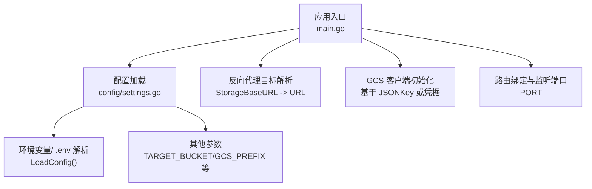
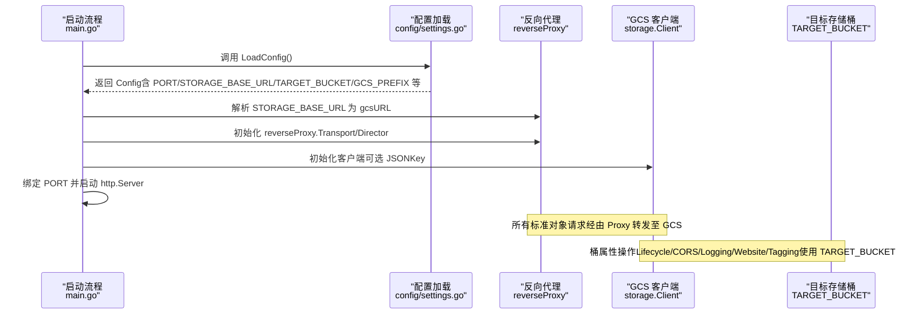

# 基础配置

<cite>
**本文引用的文件**
- [main.go](file://main.go)
- [config/settings.go](file://config/settings.go)
- [README.md](file://README.md)
- [integration_tests/test_utils.go](file://integration_tests/test_utils.go)
- [pkg/translate/gcs_lifecycle.go](file://pkg/translate/gcs_lifecycle.go)
</cite>

## 目录
1. [简介](#简介)
2. [项目结构与配置入口](#项目结构与配置入口)
3. [核心配置参数详解](#核心配置参数详解)
4. [架构与配置关系图](#架构与配置关系图)
5. [部署场景与最佳实践](#部署场景与最佳实践)
6. [故障排查与常见问题](#故障排查与常见问题)
7. [结论](#结论)

## 简介
本章节面向首次接触 S3Proxy4GCS 的用户，概述基础配置项的作用、取值范围、默认值以及在不同部署阶段（开发、测试、生产）的推荐做法。重点参数包括：
- 端口设置（PORT，默认 8080）
- GCP 项目 ID（GCP_PROJECT_ID）
- 目标存储桶（TARGET_BUCKET）
- 存储基础 URL（STORAGE_BASE_URL，默认 https://storage.googleapis.com）
- GCS 前缀（GCS_PREFIX）

这些参数通过统一的配置加载机制集中管理，并在启动时被主程序读取，用于决定监听端口、GCS 客户端初始化、反向代理目标地址以及各类资源操作的目标对象空间。

## 项目结构与配置入口
- 配置定义与加载位于 config/settings.go，包含 Settings 结构体及 LoadConfig() 函数。
- 主程序 main.go 在启动时调用 LoadConfig() 并读取 PORT、STORAGE_BASE_URL、TARGET_BUCKET 等关键参数。
- README.md 提供了配置项的简要说明与默认值来源。
- 测试工具 integration_tests/test_utils.go 展示了如何从环境变量或父级 .env 文件中解析 TARGET_BUCKET、GCS_PREFIX、AWS_ACCESS_KEY_ID、AWS_SECRET_ACCESS_KEY 等参数，便于集成测试与本地验证。

图表来源
- [main.go:37-252](file://main.go#L37-L252)
- [config/settings.go:29-57](file://config/settings.go#L29-L57)

章节来源
- [main.go:37-252](file://main.go#L37-L252)
- [config/settings.go:29-57](file://config/settings.go#L29-L57)
- [README.md:10-29](file://README.md#L10-L29)

## 核心配置参数详解

### 端口设置（PORT，默认 8080）
- 作用：指定 HTTP 服务器监听的端口，用于接收来自 S3 客户端的请求。
- 必需性：是必填项；若未设置，将使用默认值 8080。
- 默认值：8080
- 取值范围：1–65535（通常使用非特权端口如 8080、8081 等进行本地开发）
- 配置方式：支持通过环境变量或 .env 文件设置；主程序直接读取该值用于 http.Server.Addr。
- 使用位置：主程序在启动时将 ":PORT" 绑定到 http.Server。
- 示例路径：
  - 设置示例：参考 [config/settings.go:44](file://config/settings.go#L44)
  - 启动绑定：参考 [main.go:220-223](file://main.go#L220-L223)

章节来源
- [config/settings.go:44](file://config/settings.go#L44)
- [main.go:220-223](file://main.go#L220-L223)
- [README.md:19](file://README.md#L19)

### GCP 项目 ID（GCP_PROJECT_ID）
- 作用：标识目标 GCP 项目，用于后续与 GCS 资源关联（例如日志、监控等）。当前实现中该字段主要用于日志输出与上下文标识，不直接影响 GCS API 调用。
- 必需性：非必需；可为空字符串。
- 默认值：空字符串
- 配置方式：可通过环境变量或 .env 文件设置；主程序读取后写入 Config 结构体。
- 使用位置：主程序在初始化 GCS 客户端时会记录项目 ID 信息（仅日志），并不作为认证或资源定位的唯一依据。
- 示例路径：
  - 设置示例：参考 [config/settings.go:45](file://config/settings.go#L45)
  - 日志记录：参考 [main.go:54-62](file://main.go#L54-L62)

章节来源
- [config/settings.go:45](file://config/settings.go#L45)
- [main.go:54-62](file://main.go#L54-L62)

### 目标存储桶（TARGET_BUCKET）
- 作用：指定最终操作的目标 GCS 存储桶名称。所有针对对象的操作（如 PutObject、GetObject、ListObjects 等）都会落到该桶内。
- 必需性：是必填项；若未设置，将导致后续对 GCS 的读写失败。
- 默认值：空字符串
- 配置方式：可通过环境变量或 .env 文件设置；主程序在处理生命周期、CORS、日志、网站配置等桶属性更新时会使用该值。
- 使用位置：
  - 生命周期、CORS、日志、网站配置等桶属性更新时，均通过 gcsClient.Bucket(Config.TargetBucket) 操作。
  - 对象标签（Tagging）处理时，会从 URL 路径解析出目标桶名，但 TARGET_BUCKET 仍作为兜底或校验来源。
- 示例路径：
  - 设置示例：参考 [config/settings.go:46](file://config/settings.go#L46)
  - 生命周期更新：参考 [main.go:407](file://main.go#L407)
  - CORS 更新：参考 [main.go:489](file://main.go#L489)
  - 日志更新：参考 [main.go:570](file://main.go#L570)
  - 网站配置更新：参考 [main.go:647](file://main.go#L647)
  - 对象标签更新：参考 [main.go:737](file://main.go#L737)

章节来源
- [config/settings.go:46](file://config/settings.go#L46)
- [main.go:407](file://main.go#L407)
- [main.go:489](file://main.go#L489)
- [main.go:570](file://main.go#L570)
- [main.go:647](file://main.go#L647)
- [main.go:737](file://main.go#L737)

### 存储基础 URL（STORAGE_BASE_URL，默认 https://storage.googleapis.com）
- 作用：指定 GCS 的基础访问地址，主程序会将其解析为 URL 并用于反向代理的目标主机与协议。
- 必需性：是必填项；若未设置，将使用默认值 https://storage.googleapis.com。
- 默认值：https://storage.googleapis.com
- 配置方式：可通过环境变量或 .env 文件设置；主程序在启动时解析该 URL 并初始化反向代理。
- 使用位置：主程序解析 STORAGE_BASE_URL 为 gcsURL，并设置 reverseProxy 的 Director 和 Transport。
- 示例路径：
  - 设置示例：参考 [config/settings.go:47](file://config/settings.go#L47)
  - URL 解析与反向代理初始化：参考 [main.go:68-91](file://main.go#L68-L91)

章节来源
- [config/settings.go:47](file://config/settings.go#L47)
- [main.go:68-91](file://main.go#L68-L91)

### GCS 前缀（GCS_PREFIX）
- 作用：为测试或命名空间隔离提供前缀，所有对象键（Key）将自动加上该前缀，便于在同一存储桶内区分不同环境或测试场景。
- 必需性：非必需；可为空字符串。
- 默认值：空字符串
- 配置方式：可通过环境变量或 .env 文件设置；测试工具会在构造对象键时拼接该前缀。
- 使用位置：
  - 对象标签（Tagging）处理时，会从 URL 路径解析出目标对象名，但 GCS_PREFIX 作为命名空间隔离的补充。
  - 测试工具 getTestPrefix() 会从环境变量或父级 .env 中读取该值，用于构造测试对象键。
- 示例路径：
  - 设置示例：参考 [config/settings.go:48](file://config/settings.go#L48)
  - 测试工具解析前缀：参考 [integration_tests/test_utils.go:36-60](file://integration_tests/test_utils.go#L36-L60)

章节来源
- [config/settings.go:48](file://config/settings.go#L48)
- [integration_tests/test_utils.go:36-60](file://integration_tests/test_utils.go#L36-L60)

## 架构与配置关系图
下图展示了配置参数在启动流程中的关键作用点，以及它们如何影响服务行为（监听端口、反向代理目标、GCS 客户端初始化、桶属性操作）。

图表来源
- [main.go:37-252](file://main.go#L37-L252)
- [config/settings.go:29-57](file://config/settings.go#L29-L57)

章节来源
- [main.go:37-252](file://main.go#L37-L252)
- [config/settings.go:29-57](file://config/settings.go#L29-L57)

## 部署场景与最佳实践

### 开发环境（本地调试）
- 推荐配置
  - PORT：8080 或其他非特权端口（如 8081），避免冲突
  - STORAGE_BASE_URL：保持默认 https://storage.googleapis.com
  - TARGET_BUCKET：设置为本地测试使用的存储桶名称
  - GCS_PREFIX：可设置为测试前缀（如 test-），便于隔离
  - DRY_RUN：建议设为 true，避免真实 API 调用
  - JSON_KEY：可留空或指向本地服务账号密钥文件路径（按需）
  - AWS_ACCESS_KEY_ID/AWS_SECRET_ACCESS_KEY：可留空或设置为代理重签凭证（按需）
- 说明
  - DRY_RUN 模式下，反向代理不会真正访问 GCS，适合快速验证请求转发与签名重签逻辑。
  - GCS_PREFIX 可帮助在同一存储桶内区分不同开发者或测试场景的数据。

章节来源
- [config/settings.go:36-56](file://config/settings.go#L36-L56)
- [README.md:24](file://README.md#L24)

### 测试环境（CI/集成测试）
- 推荐配置
  - PORT：与测试工具约定的端口（如 8081）
  - STORAGE_BASE_URL：同上
  - TARGET_BUCKET：指向测试专用存储桶
  - GCS_PREFIX：设置为测试前缀（如 ci-），确保与开发/生产隔离
  - DRY_RUN：根据测试策略选择；若需要验证真实 API 行为，可设为 false
  - JSON_KEY：指向测试环境的服务账号密钥文件
  - AWS_ACCESS_KEY_ID/AWS_SECRET_ACCESS_KEY：指向测试环境的代理凭证
- 说明
  - 测试工具会优先从环境变量读取 TARGET_BUCKET、GCS_PREFIX、AWS 凭证，若未设置则回退到父级 .env 文件解析，便于在 CI 环境中注入变量。

章节来源
- [integration_tests/test_utils.go:9-60](file://integration_tests/test_utils.go#L9-L60)
- [README.md:24-28](file://README.md#L24-L28)

### 生产环境（线上运行）
- 推荐配置
  - PORT：使用容器/负载均衡器暴露的端口（如 80 或 443，配合反向代理）
  - STORAGE_BASE_URL：保持默认 https://storage.googleapis.com
  - TARGET_BUCKET：指向生产存储桶
  - GCS_PREFIX：可设置为业务前缀（如 app-prod-），用于多租户或多应用隔离
  - DRY_RUN：必须设为 false，启用真实 API 调用
  - JSON_KEY：指向生产服务账号密钥文件（建议通过平台机密管理服务注入）
  - AWS_ACCESS_KEY_ID/AWS_SECRET_ACCESS_KEY：设置为代理重签凭证，确保请求在转发到 GCS 时具备有效签名
- 说明
  - 生产环境务必开启真实 API 调用（DRY_RUN=false），并确保 JSON_KEY 正确配置，以便执行网站、CORS、日志等桶属性操作。
  - 建议结合连接池参数（MAX_IDLE_CONNS/MAX_IDLE_CONNS_PER_HOST）优化性能与稳定性。

章节来源
- [config/settings.go:36-56](file://config/settings.go#L36-L56)
- [README.md:24-28](file://README.md#L24-L28)

## 故障排查与常见问题
- 无法启动或端口占用
  - 症状：启动时报端口冲突或无法绑定
  - 排查：检查 PORT 是否被占用；修改为其他可用端口
  - 参考：[main.go:220-223](file://main.go#L220-L223)
- 目标存储桶未设置或无效
  - 症状：生命周期、CORS、日志、网站配置等桶属性操作报错
  - 排查：确认 TARGET_BUCKET 已正确设置；检查存储桶是否存在且具备相应权限
  - 参考：[main.go:407](file://main.go#L407)、[main.go:489](file://main.go#L489)、[main.go:570](file://main.go#L570)、[main.go:647](file://main.go#L647)
- GCS 前缀导致对象键不匹配
  - 症状：对象读写失败或找不到数据
  - 排查：确认 GCS_PREFIX 与客户端使用的前缀一致；注意对象键拼接规则
  - 参考：[integration_tests/test_utils.go:36-60](file://integration_tests/test_utils.go#L36-L60)
- 反向代理目标错误
  - 症状：请求转发失败或返回异常
  - 排查：确认 STORAGE_BASE_URL 格式正确；检查 URL 解析与反向代理初始化
  - 参考：[main.go:68-91](file://main.go#L68-L91)
- DRY_RUN 模式误用
  - 症状：期望看到真实 API 响应但实际无网络调用
  - 排查：将 DRY_RUN 设为 false，确保启用真实 GCS API 调用
  - 参考：[config/settings.go:36](file://config/settings.go#L36)

章节来源
- [main.go:68-91](file://main.go#L68-L91)
- [main.go:407](file://main.go#L407)
- [main.go:489](file://main.go#L489)
- [main.go:570](file://main.go#L570)
- [main.go:647](file://main.go#L647)
- [integration_tests/test_utils.go:36-60](file://integration_tests/test_utils.go#L36-L60)
- [config/settings.go:36](file://config/settings.go#L36)

## 结论
- PORT、TARGET_BUCKET、STORAGE_BASE_URL、GCS_PREFIX 是 S3Proxy4GCS 的四大基础配置参数，分别控制监听端口、目标存储桶、GCS 访问地址与命名空间隔离。
- 配置加载采用环境变量或 .env 文件的方式，主程序在启动阶段集中读取并应用。
- 不同部署阶段应遵循相应的最佳实践：开发环境建议启用 DRY_RUN 并设置测试前缀；测试环境强调隔离与凭证注入；生产环境必须启用真实 API 调用并完善安全与性能参数。
- 若遇到问题，优先检查端口占用、存储桶配置、前缀一致性与反向代理目标地址，并结合 DRY_RUN 模式进行定位。