# 安全凭证配置

<cite>
**本文档引用的文件**
- [main.go](file://main.go)
- [config/settings.go](file://config/settings.go)
- [README.md](file://README.md)
- [go.mod](file://go.mod)
- [integration_tests/test_utils.go](file://integration_tests/test_utils.go)
- [pkg/translate/gcs_cors.go](file://pkg/translate/gcs_cors.go)
- [pkg/translate/gcs_website.go](file://pkg/translate/gcs_website.go)
</cite>

## 目录
1. [简介](#简介)
2. [项目结构概览](#项目结构概览)
3. [核心凭证组件](#核心凭证组件)
4. [架构概览](#架构概览)
5. [详细组件分析](#详细组件分析)
6. [依赖关系分析](#依赖关系分析)
7. [性能考量](#性能考量)
8. [故障排除指南](#故障排除指南)
9. [结论](#结论)

## 简介

S3Proxy4GCS是一个在AWS S3兼容客户端SDK与Google Cloud Storage (GCS)之间充当中间代理的系统。该系统需要两种类型的凭证来实现安全的身份验证和授权：

1. **AWS代理凭证**：用于重新签名请求到GCS（PROXY_AWS_ACCESS_KEY_ID、PROXY_AWS_SECRET_ACCESS_KEY）
2. **GCS JSON密钥**：用于GCS客户端身份验证（JSON_KEY）

本文档提供了这些凭证的完整配置指南，包括作用机制、安全性考虑、最佳实践以及不同认证方式的配置示例。

## 项目结构概览

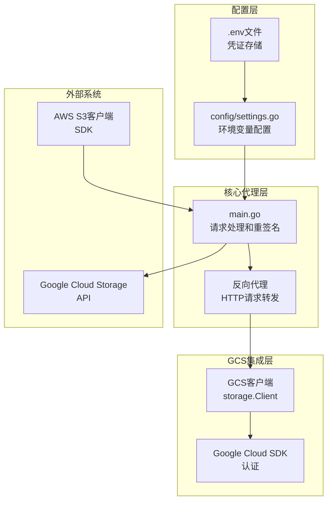

**图表来源**
- [config/settings.go:1-65](file://config/settings.go#L1-L65)
- [main.go:37-91](file://main.go#L37-L91)

**章节来源**
- [config/settings.go:1-65](file://config/settings.go#L1-L65)
- [main.go:1-838](file://main.go#L1-L838)

## 核心凭证组件

### AWS代理凭证配置

AWS代理凭证是S3Proxy4GCS的核心安全组件，用于重新签名发送到GCS的请求。

#### 配置参数

| 参数名称 | 环境变量 | 默认值 | 描述 |
|---------|----------|--------|------|
| 访问密钥ID | PROXY_AWS_ACCESS_KEY_ID | 无 | AWS访问密钥ID |
| 秘密访问密钥 | PROXY_AWS_SECRET_ACCESS_KEY | 无 | AWS秘密访问密钥 |
| 兼容支持 | AWS_ACCESS_KEY_ID | 无 | 兼容旧版本环境变量 |
| 兼容支持 | AWS_SECRET_ACCESS_KEY | 无 | 兼容旧版本环境变量 |

#### 配置优先级

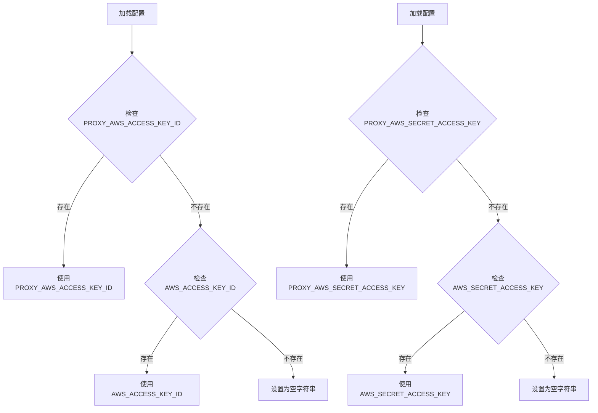

**图表来源**
- [config/settings.go:52-55](file://config/settings.go#L52-L55)

#### 重签名机制

当检测到需要重新签名的请求时，系统会使用以下流程：

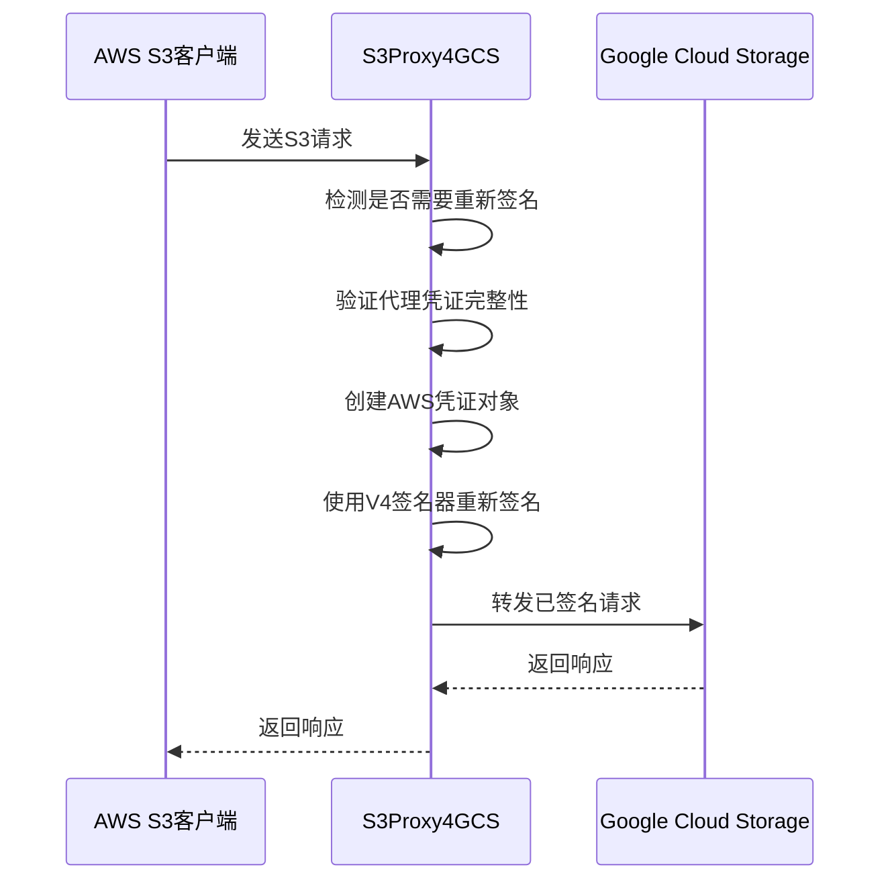

**图表来源**
- [main.go:157-182](file://main.go#L157-L182)

**章节来源**
- [config/settings.go:52-55](file://config/settings.go#L52-L55)
- [main.go:157-182](file://main.go#L157-L182)

### GCS JSON密钥配置

GCS JSON密钥用于建立与Google Cloud Storage的客户端连接。

#### 配置参数

| 参数名称 | 环境变量 | 默认值 | 描述 |
|---------|----------|--------|------|
| JSON密钥路径 | JSON_KEY | 空字符串 | GCS服务账号JSON密钥文件路径 |

#### 客户端初始化流程

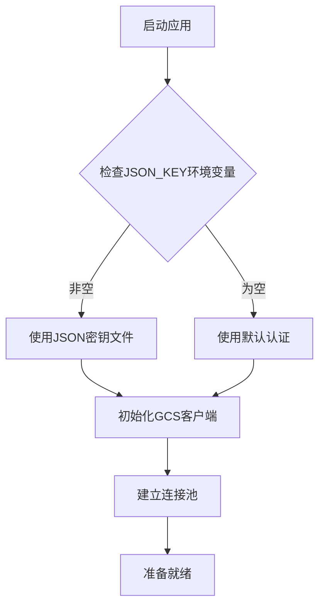

**图表来源**
- [main.go:52-62](file://main.go#L52-L62)

**章节来源**
- [main.go:52-62](file://main.go#L52-L62)

## 架构概览

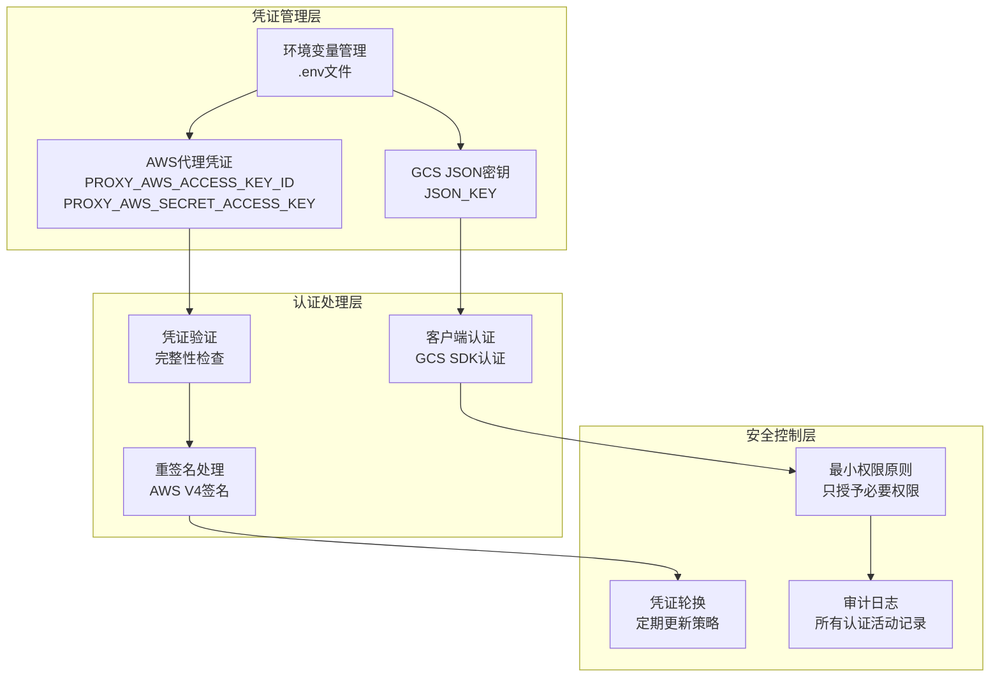

**图表来源**
- [config/settings.go:12-25](file://config/settings.go#L12-L25)
- [main.go:157-182](file://main.go#L157-L182)

## 详细组件分析

### 凭证配置类结构

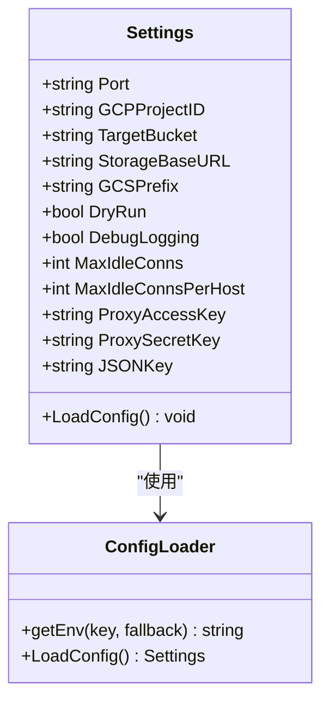

**图表来源**
- [config/settings.go:11-27](file://config/settings.go#L11-L27)

### 重签名处理流程

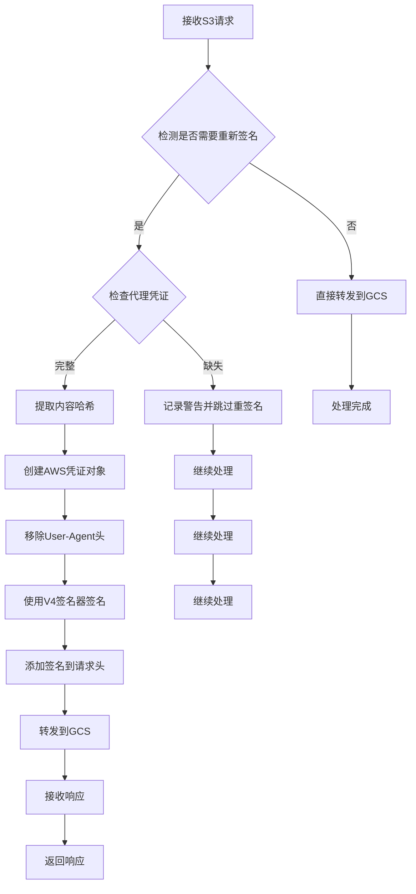

**图表来源**
- [main.go:157-182](file://main.go#L157-L182)

**章节来源**
- [config/settings.go:11-27](file://config/settings.go#L11-L27)
- [main.go:157-182](file://main.go#L157-L182)

### 安全认证序列

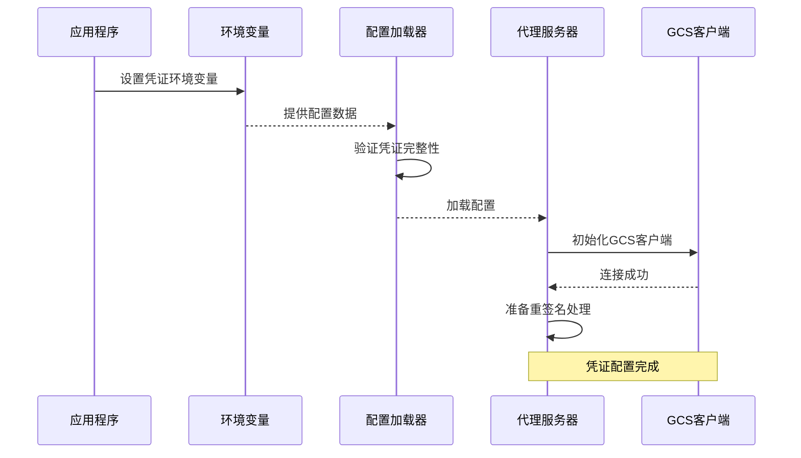

**图表来源**
- [config/settings.go:29-57](file://config/settings.go#L29-L57)
- [main.go:52-62](file://main.go#L52-L62)

**章节来源**
- [config/settings.go:29-57](file://config/settings.go#L29-L57)
- [main.go:52-62](file://main.go#L52-L62)

## 依赖关系分析

### 外部依赖关系

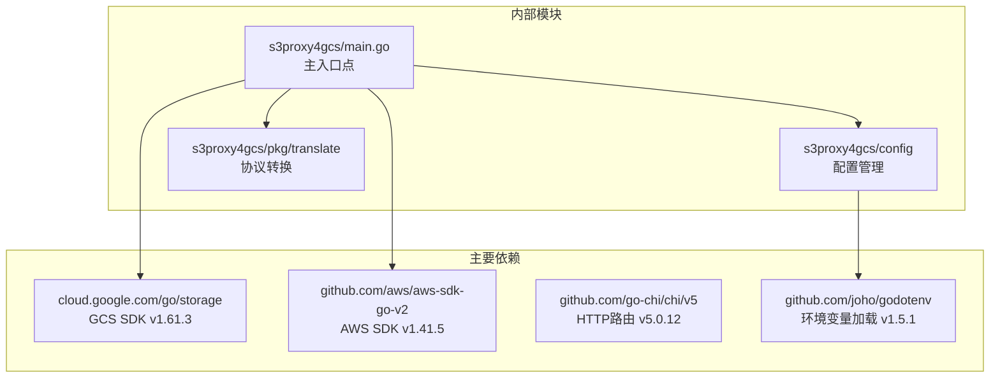

**图表来源**
- [go.mod:5-9](file://go.mod#L5-L9)
- [main.go:24-29](file://main.go#L24-L29)

**章节来源**
- [go.mod:1-61](file://go.mod#L1-L61)
- [main.go:24-29](file://main.go#L24-L29)

### 凭证相关依赖

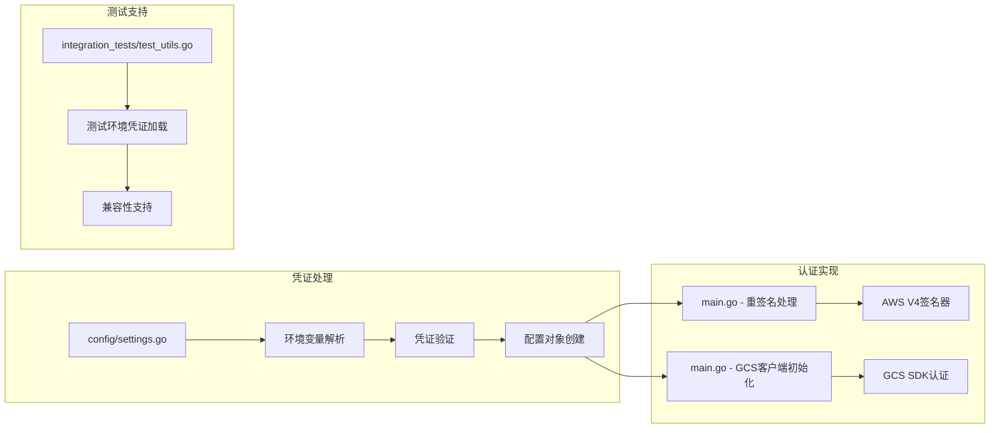

**图表来源**
- [config/settings.go:29-57](file://config/settings.go#L29-L57)
- [main.go:52-62](file://main.go#L52-L62)
- [integration_tests/test_utils.go:62-112](file://integration_tests/test_utils.go#L62-L112)

**章节来源**
- [config/settings.go:29-57](file://config/settings.go#L29-L57)
- [main.go:52-62](file://main.go#L52-L62)
- [integration_tests/test_utils.go:62-112](file://integration_tests/test_utils.go#L62-L112)

## 性能考量

### 连接池优化

系统使用经过优化的HTTP传输配置来提高性能：

- **最大空闲连接数**：默认1000个连接
- **每主机最大空闲连接数**：默认1000个连接
- **空闲连接超时**：90秒
- **TLS握手超时**：10秒
- **ExpectContinue超时**：1秒
- **禁用压缩**：保留Accept-Encoding以匹配AWS4GCS模式

### 凭证缓存策略

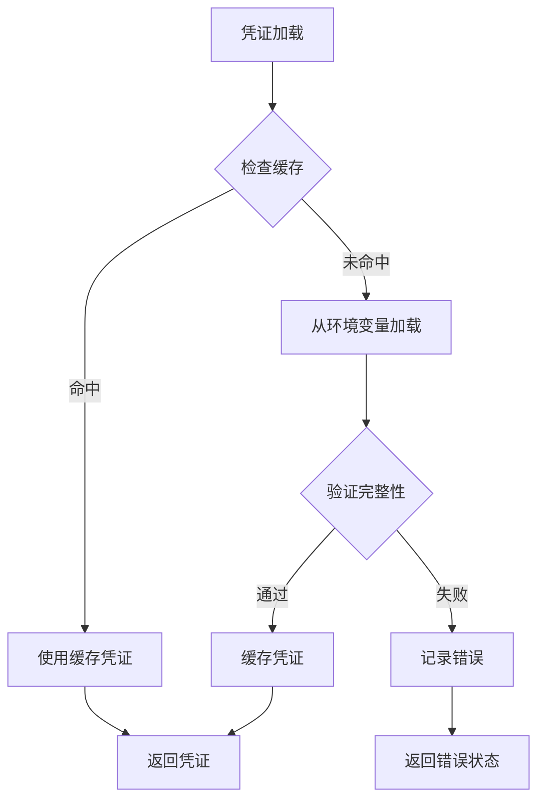

**图表来源**
- [config/settings.go:29-57](file://config/settings.go#L29-L57)

## 故障排除指南

### 常见凭证问题

#### 1. 凭证加载失败

**症状**：应用程序启动时出现认证错误

**诊断步骤**：
1. 检查环境变量是否正确设置
2. 验证JSON密钥文件路径的有效性
3. 确认代理凭证的完整性

**解决方案**：
```bash
# 验证环境变量
echo $PROXY_AWS_ACCESS_KEY_ID
echo $PROXY_AWS_SECRET_ACCESS_KEY
echo $JSON_KEY

# 检查文件权限
ls -la $JSON_KEY
```

#### 2. 请求重签名失败

**症状**：GCS API调用返回签名错误

**诊断步骤**：
1. 检查代理凭证是否正确配置
2. 验证请求头中是否包含必要的签名信息
3. 确认时间同步状态

**解决方案**：
```bash
# 启用调试日志
export DEBUG_LOGGING=true

# 验证时间同步
ntpdate -q pool.ntp.org
```

#### 3. 权限不足错误

**症状**：GCS API调用返回403权限错误

**诊断步骤**：
1. 检查GCS服务账号的角色分配
2. 验证所需的GCS权限
3. 确认项目ID配置正确

**解决方案**：
```bash
# 检查服务账号权限
gcloud projects get-iam-policy PROJECT_ID

# 验证GCS权限
gsutil ls gs://BUCKET_NAME
```

**章节来源**
- [config/settings.go:29-57](file://config/settings.go#L29-L57)
- [main.go:157-182](file://main.go#L157-L182)

## 结论

S3Proxy4GCS的安全凭证配置涉及两个关键组件：AWS代理凭证和GCS JSON密钥。通过合理的配置和最佳实践，可以确保系统的安全性和可靠性。

### 关键要点总结

1. **最小权限原则**：仅授予执行必要操作所需的最小权限
2. **定期轮换**：建立自动化的凭证轮换机制
3. **监控审计**：启用详细的日志记录和监控
4. **环境隔离**：使用不同的凭证配置用于开发、测试和生产环境
5. **备份恢复**：建立凭证丢失的应急响应计划

### 推荐配置实践

- **开发环境**：使用DRY_RUN模式，避免真实GCS调用
- **测试环境**：使用专用的服务账号，限制权限范围
- **生产环境**：实施严格的访问控制和审计日志
- **监控告警**：设置凭证使用异常的告警机制

通过遵循这些指导原则，可以确保S3Proxy4GCS系统的安全运行和长期稳定性。