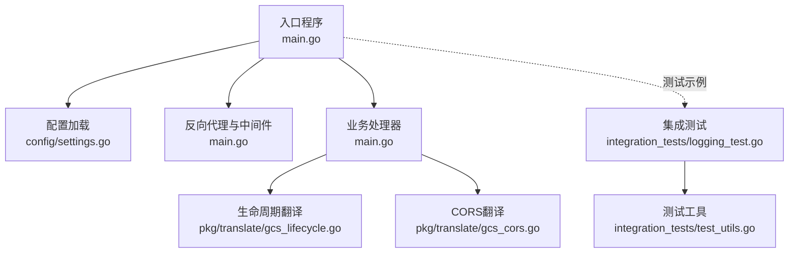
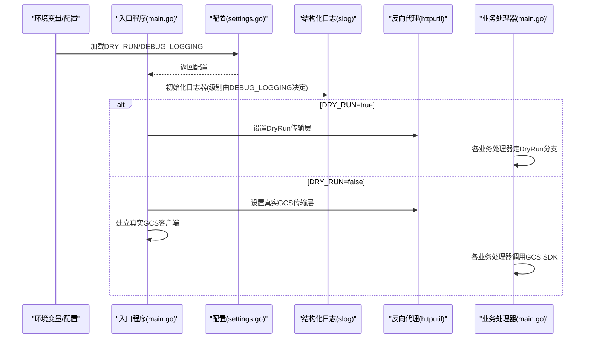
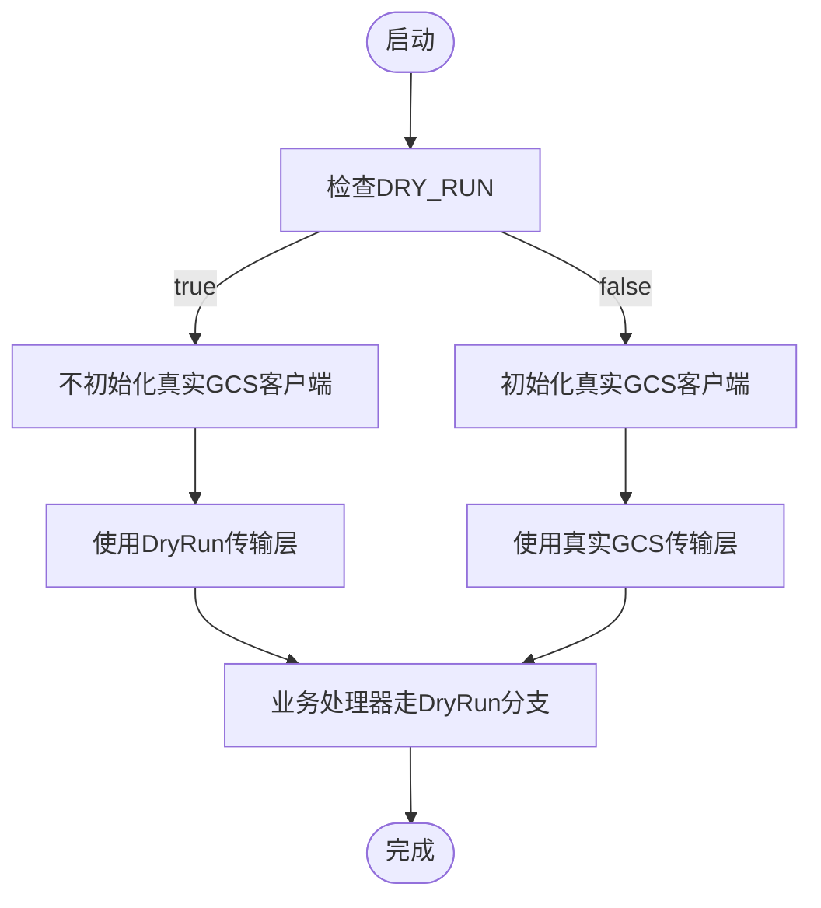
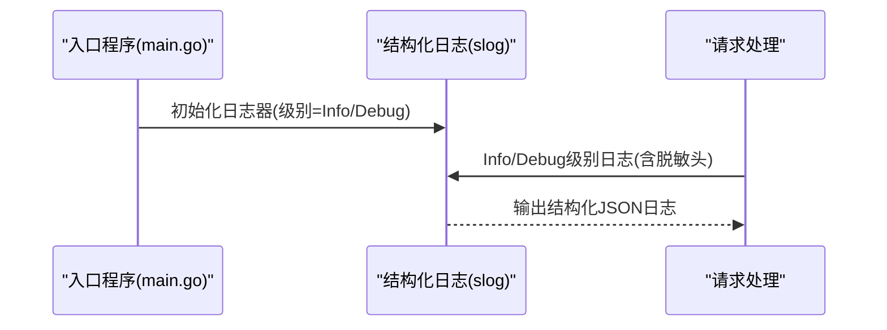
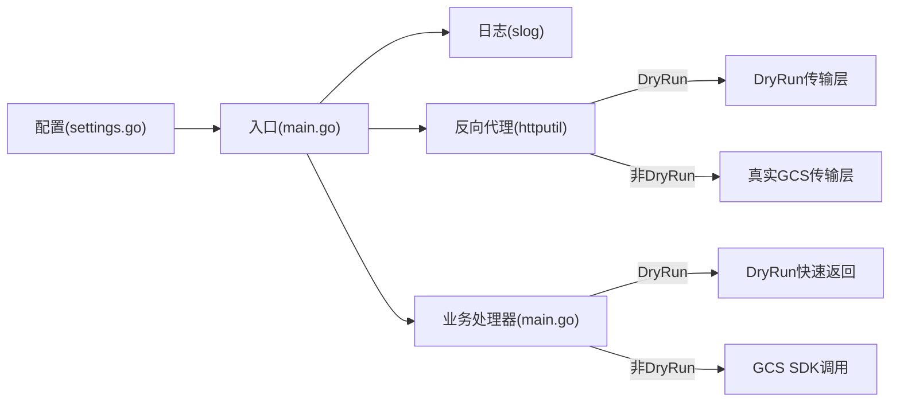

# 运行模式配置

<cite>
**本文引用的文件**
- [main.go](file://main.go)
- [config/settings.go](file://config/settings.go)
- [README.md](file://README.md)
- [pkg/translate/gcs_lifecycle.go](file://pkg/translate/gcs_lifecycle.go)
- [pkg/translate/gcs_cors.go](file://pkg/translate/gcs_cors.go)
- [integration_tests/logging_test.go](file://integration_tests/logging_test.go)
- [integration_tests/test_utils.go](file://integration_tests/test_utils.go)
</cite>

## 目录
1. [简介](#简介)
2. [项目结构](#项目结构)
3. [核心组件](#核心组件)
4. [架构总览](#架构总览)
5. [详细组件分析](#详细组件分析)
6. [依赖分析](#依赖分析)
7. [性能考量](#性能考量)
8. [故障排查指南](#故障排查指南)
9. [结论](#结论)
10. [附录](#附录)

## 简介
本文件聚焦于S3Proxy4GCS的运行模式配置，重点说明两个关键运行参数：
- DryRun（DRY_RUN，默认true）：禁用真实GCS API调用，仅进行本地模拟与日志记录，适合本地开发与测试。
- 调试日志（DEBUG_LOGGING，默认false）：启用结构化JSON日志的详细级别，便于问题定位与可观测性。

本文将从系统架构、处理逻辑、数据流、错误处理、性能与安全等方面，给出DryRun与调试日志的完整说明，并提供不同开发与运维阶段的模式选择建议及注意事项。

## 项目结构
- 入口与主流程位于根目录的入口文件中，负责初始化配置、构建日志器、按模式选择反向代理传输层、路由S3请求并执行业务处理。
- 配置集中管理在配置模块，负责从环境变量或.env加载所有运行参数，包括DryRun与调试日志开关。
- 特定功能（如生命周期、CORS、日志、网站、标签）通过独立翻译包实现S3与GCS之间的双向映射。
- 集成测试模块使用标准AWS S3 SDK验证代理行为，同时演示如何在测试中通过网络层重定向到本地代理。

图表来源
- [main.go:37-252](file://main.go#L37-L252)
- [config/settings.go:29-57](file://config/settings.go#L29-L57)
- [pkg/translate/gcs_lifecycle.go:38-105](file://pkg/translate/gcs_lifecycle.go#L38-L105)
- [pkg/translate/gcs_cors.go:10-35](file://pkg/translate/gcs_cors.go#L10-L35)
- [integration_tests/logging_test.go:18-98](file://integration_tests/logging_test.go#L18-L98)
- [integration_tests/test_utils.go:9-113](file://integration_tests/test_utils.go#L9-L113)

章节来源
- [main.go:37-252](file://main.go#L37-L252)
- [config/settings.go:29-57](file://config/settings.go#L29-L57)
- [README.md:10-29](file://README.md#L10-L29)

## 核心组件
- 运行模式开关
  - DryRun：控制是否建立真实GCS客户端、是否使用真实GCS传输层、以及各业务处理器是否真正调用GCS SDK。
  - DEBUG_LOGGING：控制日志器的级别，启用后输出结构化JSON日志的详细信息。
- 日志系统
  - 使用Go标准库结构化日志模块，输出JSON格式日志，支持Info/Debug/Error等语义化级别。
- 反向代理
  - 按DryRun模式选择不同的传输层：DryRun时使用自定义传输层；非DryRun时使用优化的HTTP传输层。

章节来源
- [config/settings.go:18-19](file://config/settings.go#L18-L19)
- [config/settings.go:36-38](file://config/settings.go#L36-L38)
- [main.go:41-47](file://main.go#L41-L47)
- [main.go:74-91](file://main.go#L74-L91)

## 架构总览
下图展示了DryRun与调试日志在启动阶段对系统行为的影响，以及它们如何贯穿请求处理链路。

图表来源
- [config/settings.go:36-38](file://config/settings.go#L36-L38)
- [main.go:41-47](file://main.go#L41-L47)
- [main.go:52-66](file://main.go#L52-L66)
- [main.go:74-91](file://main.go#L74-L91)

## 详细组件分析

### DryRun模式（DRY_RUN）
- 默认值与含义
  - 默认true，表示“安全的笔记本测试模式”，不发起任何真实GCS API调用。
- 启动阶段影响
  - 不初始化真实GCS客户端，避免连接与认证开销。
  - 将反向代理的传输层替换为DryRun传输层，拦截所有请求并返回合成响应。
- 请求处理阶段影响
  - 生命周期、CORS、日志、网站、标签等业务处理器在DryRun模式下直接返回成功消息，不调用GCS SDK。
  - 对版本互操作头、存储类映射、签名重签等数据平面处理仍会执行，但不会写入真实GCS。
- 使用场景
  - 本地开发与单元测试：无需真实GCS凭据即可验证请求路径与错误码。
  - 集成测试：配合SDK网络层重定向到本地代理，验证端到端行为。
- 注意事项
  - 在DryRun模式下，某些需要真实GCS状态的特性（如获取对象元数据）无法验证。
  - 若业务需要真实GCS行为，请切换到非DryRun模式并正确配置凭据。

图表来源
- [config/settings.go:36](file://config/settings.go#L36)
- [main.go:52-66](file://main.go#L52-L66)
- [main.go:74-91](file://main.go#L74-L91)

章节来源
- [config/settings.go:36](file://config/settings.go#L36)
- [main.go:52-66](file://main.go#L52-L66)
- [main.go:74-91](file://main.go#L74-L91)
- [README.md:24](file://README.md#L24)

### 调试日志（DEBUG_LOGGING）
- 默认值与含义
  - 默认false，启用后将日志器级别提升至Debug，输出更详细的结构化JSON日志。
- 行为表现
  - 启动时根据DEBUG_LOGGING设置选择日志级别。
  - 在请求处理过程中，当启用调试日志时，会打印请求/响应头（敏感头已脱敏）等细节。
- 输出格式
  - 结构化JSON，字段键名明确，便于云平台日志收集与查询。
- 使用场景
  - 开发调试：查看请求头、重签过程、版本互操作映射等内部细节。
  - 运维排障：结合日志聚合系统定位问题。
- 注意事项
  - Debug级别会产生大量日志，可能影响性能与存储成本。
  - 生产环境建议关闭调试日志，或限制到特定时间段。

图表来源
- [main.go:41-47](file://main.go#L41-L47)
- [main.go:98-102](file://main.go#L98-L102)
- [main.go:186-188](file://main.go#L186-L188)

章节来源
- [main.go:41-47](file://main.go#L41-L47)
- [main.go:98-102](file://main.go#L98-L102)
- [main.go:186-188](file://main.go#L186-L188)
- [README.md:93](file://README.md#L93)

### 数据平面与签名重签（与DryRun协同）
- 数据平面处理在DryRun模式下仍会执行，包括：
  - 存储类映射与x-id参数剥离
  - Accept-Encoding处理
  - 版本互操作头注入
  - 条件重签（若代理凭据可用）
- 这些处理有助于在DryRun模式下尽可能接近真实行为，便于验证签名与兼容性。

章节来源
- [main.go:110-182](file://main.go#L110-L182)

### 业务处理器与DryRun分支
- 生命周期、CORS、日志、网站、标签等处理器均在DryRun模式下走“返回成功”的快速路径，不调用GCS SDK。
- 这保证了在本地或测试环境中，这些接口不会产生副作用。

章节来源
- [main.go:390-422](file://main.go#L390-L422)
- [main.go:481-504](file://main.go#L481-L504)
- [main.go:562-585](file://main.go#L562-L585)
- [main.go:639-662](file://main.go#L639-L662)
- [main.go:729-734](file://main.go#L729-L734)

## 依赖分析
- 配置模块集中定义运行参数，入口程序按配置初始化日志器与代理传输层。
- 业务处理器在DryRun模式下绕过GCS SDK，减少对外部依赖的耦合。
- 日志系统统一使用结构化JSON输出，便于与云平台日志系统对接。

图表来源
- [config/settings.go:29-57](file://config/settings.go#L29-L57)
- [main.go:41-47](file://main.go#L41-L47)
- [main.go:74-91](file://main.go#L74-L91)
- [main.go:390-422](file://main.go#L390-L422)

章节来源
- [config/settings.go:29-57](file://config/settings.go#L29-L57)
- [main.go:41-47](file://main.go#L41-L47)
- [main.go:74-91](file://main.go#L74-L91)

## 性能考量
- DryRun模式
  - 优点：无外部网络调用，启动快、资源占用低，适合高频本地开发与测试。
  - 缺点：无法验证真实GCS行为，可能掩盖某些边界条件。
- 调试日志
  - 优点：便于定位问题，支持结构化日志聚合。
  - 缺点：Debug级别日志量大，可能增加I/O与存储成本，建议在生产环境谨慎开启。
- 反向代理传输层
  - 非DryRun模式下启用HTTP/2、连接池与超时控制，提升吞吐与稳定性。

章节来源
- [main.go:79-91](file://main.go#L79-L91)
- [README.md:93](file://README.md#L93)

## 故障排查指南
- 启动阶段
  - 若未找到.env文件，配置模块会回退到环境变量；确认环境变量是否正确设置。
  - 启动时会根据DEBUG_LOGGING设置日志级别，若日志异常，检查该变量。
- 运行阶段
  - DryRun模式下，生命周期/CORS/日志/网站/标签等接口返回“DryRun成功”消息，属于预期行为。
  - 若需要真实GCS行为，请切换到非DryRun模式并确保凭据与目标桶配置正确。
- 日志定位
  - 使用结构化JSON日志，关注请求/响应头（已脱敏）、版本互操作头映射、重签结果等关键信息。
- 集成测试
  - 集成测试模块通过网络层重定向到本地代理，验证SDK行为；可参考测试用例中的端口与路径配置。

章节来源
- [config/settings.go:32-34](file://config/settings.go#L32-L34)
- [main.go:41-47](file://main.go#L41-L47)
- [main.go:390-422](file://main.go#L390-L422)
- [integration_tests/logging_test.go:18-98](file://integration_tests/logging_test.go#L18-L98)

## 结论
- DRY_RUN默认true，确保本地开发与测试的安全性与稳定性；非DryRun模式用于真实GCS集成。
- DEBUG_LOGGING默认false，建议在开发与排障时临时开启，生产环境谨慎使用。
- 两者配合可覆盖从开发到运维的全生命周期需求，DryRun优先保障安全，调试日志优先保障可观测性。

## 附录
- 模式选择建议
  - 本地开发/单元测试：DRY_RUN=true，DEBUG_LOGGING=false。
  - 集成测试：DRY_RUN=true，DEBUG_LOGGING视情况开启。
  - 预生产/灰度：DRY_RUN=false，DEBUG_LOGGING按需开启。
  - 生产：DRY_RUN=false，DEBUG_LOGGING=false。
- 安全考虑
  - DryRun模式避免真实GCS调用，降低误操作风险。
  - 调试日志避免输出敏感头信息（已在日志中脱敏），但仍建议在生产环境关闭调试日志。

章节来源
- [README.md:24](file://README.md#L24)
- [README.md:93](file://README.md#L93)
- [main.go:98-102](file://main.go#L98-L102)