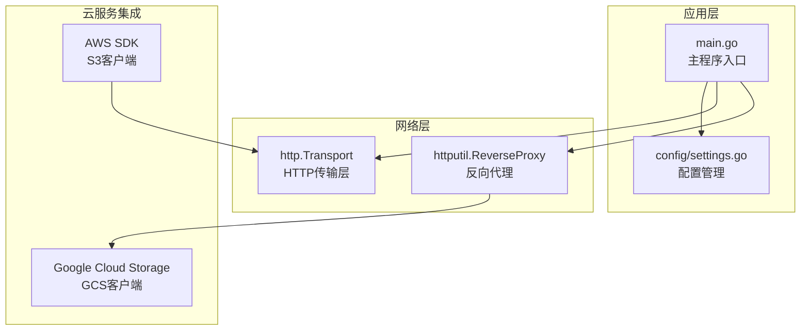
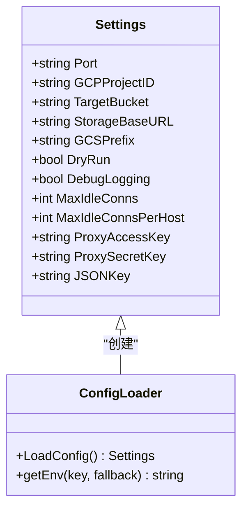
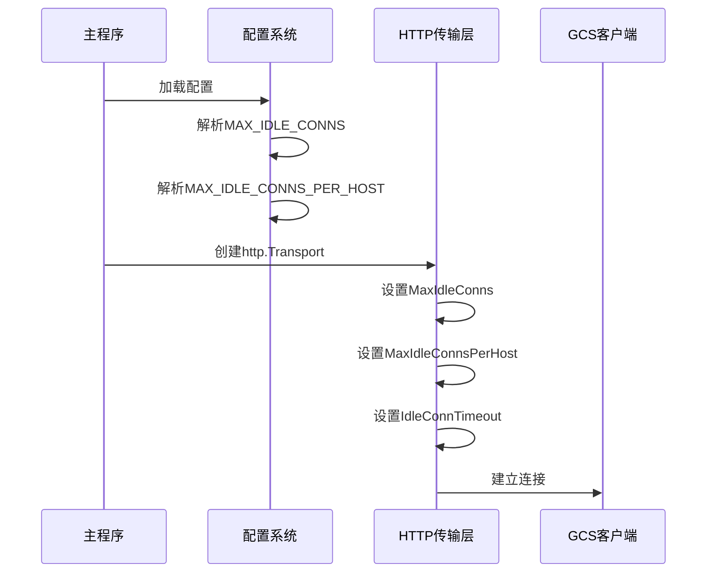
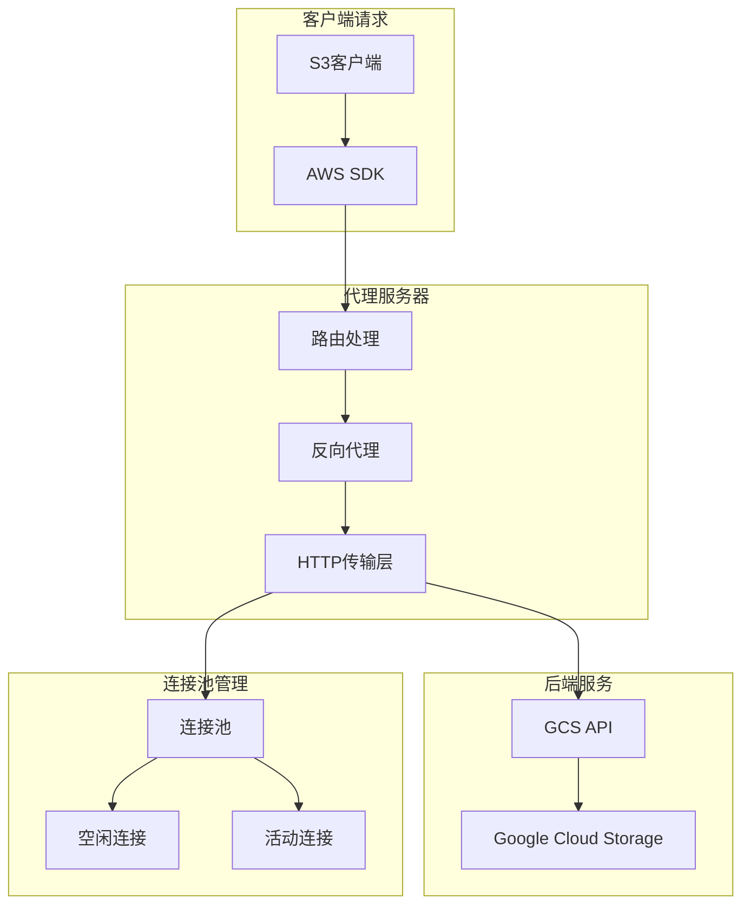
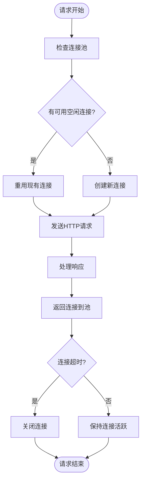
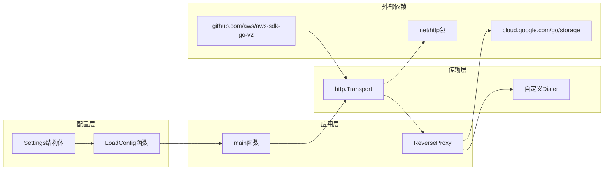
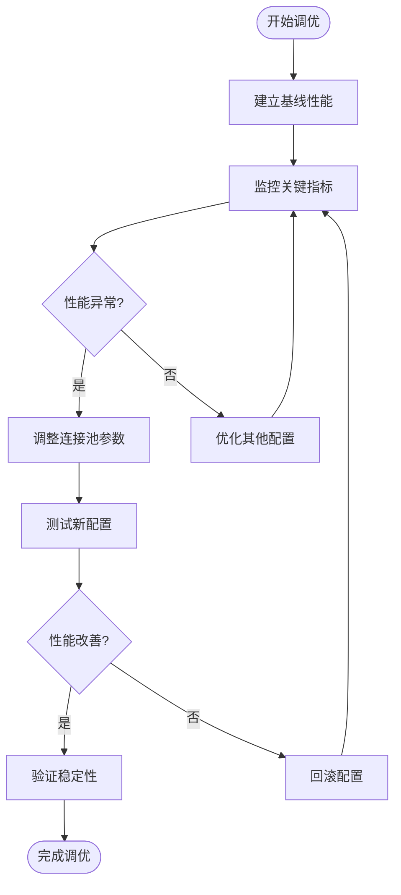

# 连接池配置

<cite>
**本文档引用的文件**
- [main.go](file://main.go)
- [config/settings.go](file://config/settings.go)
- [README.md](file://README.md)
- [go.mod](file://go.mod)
</cite>

## 目录
1. [简介](#简介)
2. [项目结构](#项目结构)
3. [核心组件](#核心组件)
4. [架构概览](#架构概览)
5. [详细组件分析](#详细组件分析)
6. [依赖关系分析](#依赖关系分析)
7. [性能考虑](#性能考虑)
8. [故障排除指南](#故障排除指南)
9. [结论](#结论)

## 简介

S3Proxy4GCS是一个Go语言编写的中间件代理，用于在AWS S3兼容客户端SDK与Google Cloud Storage (GCS)之间进行桥接。该项目的核心功能之一是通过精心配置的HTTP连接池来优化性能和资源利用率。

本文档专注于连接池配置的专业分析，特别是MAX_IDLE_CONNS（最大空闲连接数）和MAX_IDLE_CONNS_PER_HOST（每主机最大空闲连接数）这两个关键参数。我们将深入探讨连接池的工作原理、性能影响、调优策略，以及针对不同负载场景的推荐配置值。

## 项目结构

S3Proxy4GCS采用模块化设计，主要组件分布如下：



**图表来源**
- [main.go:74-91](file://main.go#L74-L91)
- [config/settings.go:11-25](file://config/settings.go#L11-L25)

**章节来源**
- [main.go:1-838](file://main.go#L1-L838)
- [config/settings.go:1-65](file://config/settings.go#L1-L65)

## 核心组件

### 配置系统

连接池配置通过集中化的配置管理系统实现：



**图表来源**
- [config/settings.go:11-25](file://config/settings.go#L11-L25)
- [config/settings.go:29-57](file://config/settings.go#L29-L57)

### HTTP传输层配置

连接池的核心配置在HTTP传输层中实现：



**图表来源**
- [main.go:79-91](file://main.go#L79-L91)
- [config/settings.go:40-52](file://config/settings.go#L40-L52)

**章节来源**
- [config/settings.go:11-65](file://config/settings.go#L11-L65)
- [main.go:74-91](file://main.go#L74-L91)

## 架构概览

S3Proxy4GCS的连接池架构基于Go标准库的HTTP客户端实现，采用反向代理模式：



**图表来源**
- [main.go:74-91](file://main.go#L74-L91)
- [main.go:254-338](file://main.go#L254-L338)

## 详细组件分析

### 连接池工作原理

连接池通过重用现有的TCP连接来减少连接建立的开销：



**图表来源**
- [main.go:79-91](file://main.go#L79-L91)

### 参数详解

#### MAX_IDLE_CONNS（最大空闲连接数）

- **默认值**: 1000
- **作用域**: 整个HTTP客户端实例
- **影响**: 控制所有主机共享的最大空闲连接数量
- **适用场景**: 多主机、多域名的混合流量

#### MAX_IDLE_CONNS_PER_HOST（每主机最大空闲连接数）

- **默认值**: 1000  
- **作用域**: 单个主机或域名
- **影响**: 控制特定主机的空闲连接上限
- **适用场景**: 单一GCS主机的高并发访问

**章节来源**
- [config/settings.go:20-21](file://config/settings.go#L20-L21)
- [config/settings.go:40-41](file://config/settings.go#L40-L41)
- [README.md:27-28](file://README.md#L27-L28)

### 性能特性

连接池配置的关键性能参数：

| 参数 | 默认值 | 类型 | 描述 |
|------|--------|------|------|
| MaxIdleConns | 1000 | int | 全局最大空闲连接数 |
| MaxIdleConnsPerHost | 1000 | int | 每主机最大空闲连接数 |
| IdleConnTimeout | 90秒 | time.Duration | 空闲连接超时时间 |
| TLSHandshakeTimeout | 10秒 | time.Duration | TLS握手超时 |
| ExpectContinueTimeout | 1秒 | time.Duration | 继续请求超时 |

**章节来源**
- [main.go:79-87](file://main.go#L79-L87)

## 依赖关系分析

连接池配置涉及多个组件的协作：



**图表来源**
- [main.go:3-30](file://main.go#L3-L30)
- [go.mod:5-9](file://go.mod#L5-L9)

**章节来源**
- [go.mod:1-61](file://go.mod#L1-L61)
- [main.go:3-30](file://main.go#L3-L30)

## 性能考虑

### 高并发场景配置策略

对于高并发场景，建议采用以下配置策略：

#### 推荐配置值

| 场景 | MAX_IDLE_CONNS | MAX_IDLE_CONNS_PER_HOST | 说明 |
|------|----------------|-------------------------|------|
| 低并发(10-50 RPS) | 500 | 100 | 资源受限环境 |
| 中等并发(50-200 RPS) | 1000 | 200 | 标准生产环境 |
| 高并发(200-1000 RPS) | 2000 | 500 | 大规模生产环境 |
| 超高并发(>1000 RPS) | 5000 | 1000 | 金融级生产环境 |

#### 性能优化建议

1. **动态调整策略**
   ```go
   // 根据负载动态调整连接池大小
   func adjustPoolSize(currentRPS int) {
       switch {
       case currentRPS < 50:
           config.MaxIdleConns = 500
           config.MaxIdleConnsPerHost = 100
       case currentRPS < 200:
           config.MaxIdleConns = 1000
           config.MaxIdleConnsPerHost = 200
       default:
           config.MaxIdleConns = 2000
           config.MaxIdleConnsPerHost = 500
       }
   }
   ```

2. **监控指标**
   - 连接复用率
   - 连接创建频率
   - 请求等待时间
   - 错误率统计

### 不同负载场景的配置建议

#### 高并发场景

**适用场景**: 大型电商、内容分发网络、实时数据处理

**配置要点**:
- 增大连接池容量以应对突发流量
- 合理设置超时时间避免资源泄漏
- 启用HTTP/2支持提高连接效率

#### 低延迟场景

**适用场景**: 实时交易系统、在线游戏、视频通话

**配置要点**:
- 优化连接复用策略
- 减少连接建立开销
- 提高响应速度

#### 资源受限环境

**适用场景**: 边缘计算、嵌入式设备、容器化部署

**配置要点**:
- 限制连接池大小防止内存溢出
- 使用更短的超时时间
- 优化垃圾回收策略

**章节来源**
- [main.go:79-91](file://main.go#L79-L91)
- [config/settings.go:40-52](file://config/settings.go#L40-L52)

## 故障排除指南

### 常见问题诊断

#### 连接池耗尽

**症状**: 请求超时、连接拒绝、性能下降

**诊断步骤**:
1. 检查当前连接数
2. 分析连接池使用率
3. 监控错误日志

**解决方案**:
```go
// 动态调整连接池大小
func monitorConnectionPool() {
    // 实现连接池监控逻辑
    currentConnections := getCurrentActiveConnections()
    poolUtilization := float64(currentConnections) / float64(maxIdleConns)
    
    if poolUtilization > 0.8 {
        // 增加连接池大小
        increasePoolSize()
    }
}
```

#### 内存泄漏排查

**症状**: 内存持续增长、GC频繁触发

**排查方法**:
1. 检查连接池配置是否合理
2. 监控连接生命周期
3. 分析连接泄漏模式

**预防措施**:
- 设置合理的IdleConnTimeout
- 定期清理过期连接
- 监控连接池状态

#### 性能瓶颈识别

**诊断工具**:
```go
// 连接池性能监控
func monitorPoolPerformance() {
    stats := getConnectionPoolStats()
    
    log.Printf("连接池统计:")
    log.Printf("- 活动连接: %d", stats.ActiveConnections)
    log.Printf("- 空闲连接: %d", stats.IdleConnections)
    log.Printf("- 连接复用率: %.2f%%", stats.ReuseRate)
    log.Printf("- 平均等待时间: %.2fms", stats.AvgWaitTime)
}
```

### 调优实践

#### 连接池调优流程



#### 最佳实践

1. **渐进式调优**: 每次只调整一个参数
2. **充分测试**: 在类似生产环境的测试环境中验证
3. **监控告警**: 建立完善的监控和告警机制
4. **文档记录**: 记录每次调优的结果和原因

**章节来源**
- [main.go:79-91](file://main.go#L79-L91)
- [config/settings.go:40-52](file://config/settings.go#L40-L52)

## 结论

S3Proxy4GCS的连接池配置提供了灵活而强大的网络性能优化能力。通过合理配置MAX_IDLE_CONNS和MAX_IDLE_CONNS_PER_HOST参数，可以在不同负载场景下实现最佳的性能表现。

### 关键要点总结

1. **参数重要性**: 连接池参数直接影响系统的吞吐量和延迟表现
2. **场景适配**: 不同的业务场景需要不同的配置策略
3. **监控必要性**: 持续的监控和调优是保证性能稳定的关键
4. **资源平衡**: 需要在性能和资源消耗之间找到最佳平衡点

### 未来发展方向

随着业务的发展和技术的进步，建议关注以下方面：
- 自动化调优算法
- 更精细的监控指标
- 动态资源配置
- 云原生优化

通过持续的优化和改进，S3Proxy4GCS的连接池配置将继续为用户提供高性能、稳定的代理服务。