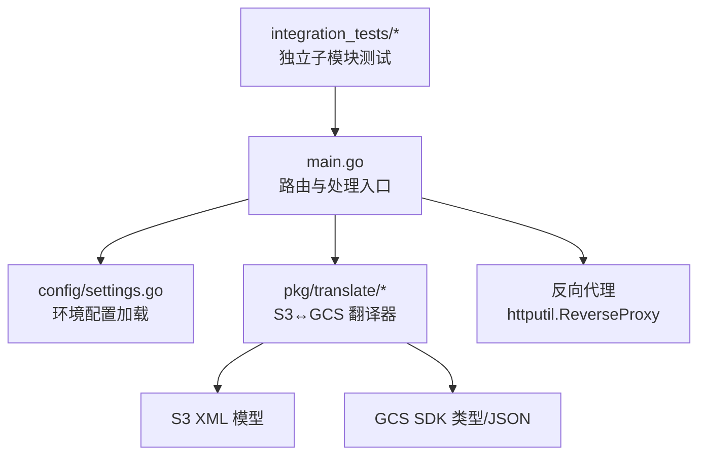
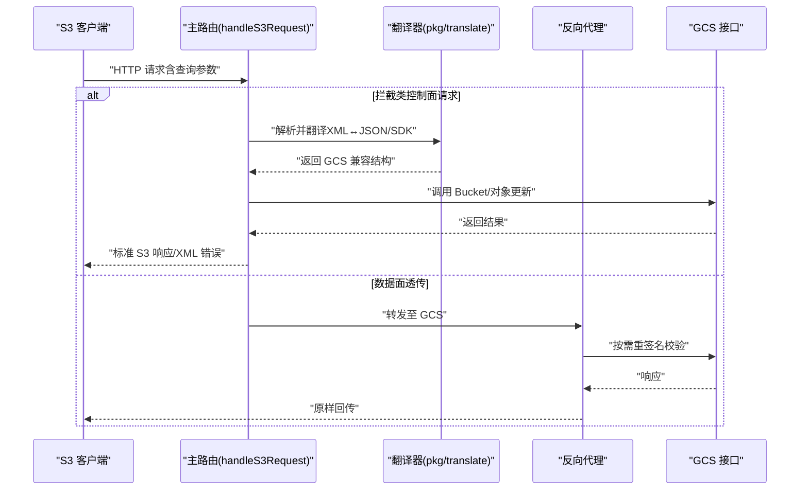
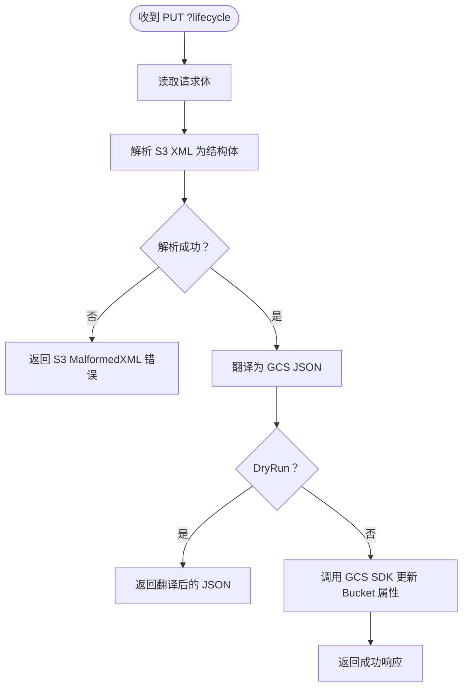
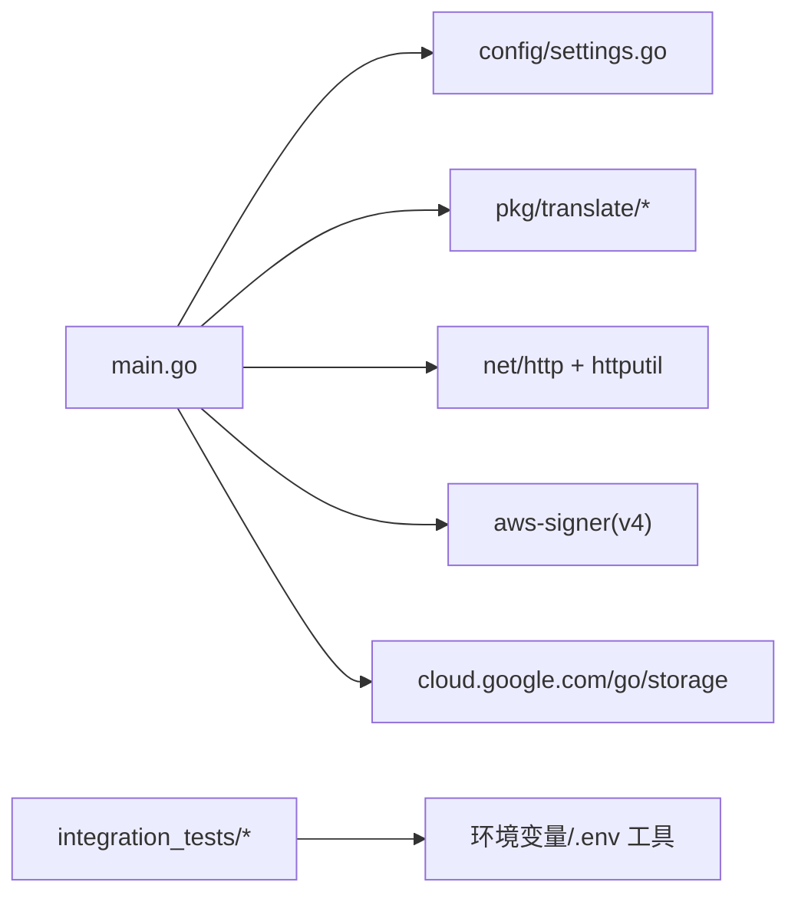
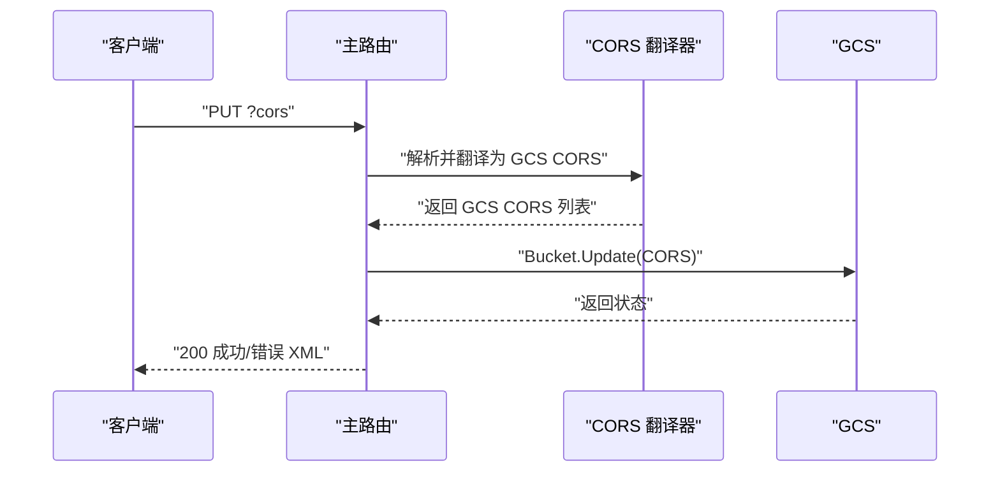

# 开发指南

<cite>
**本文引用的文件**
- [README.md](file://README.md)
- [main.go](file://main.go)
- [go.mod](file://go.mod)
- [config/settings.go](file://config/settings.go)
- [pkg/translate/s3_cors.go](file://pkg/translate/s3_cors.go)
- [pkg/translate/gcs_cors.go](file://pkg/translate/gcs_cors.go)
- [pkg/translate/s3_lifecycle.go](file://pkg/translate/s3_lifecycle.go)
- [pkg/translate/gcs_lifecycle.go](file://pkg/translate/gcs_lifecycle.go)
- [pkg/translate/s3_logging.go](file://pkg/translate/s3_logging.go)
- [pkg/translate/gcs_logging.go](file://pkg/translate/gcs_logging.go)
- [pkg/translate/s3_website.go](file://pkg/translate/s3_website.go)
- [pkg/translate/gcs_website.go](file://pkg/translate/gcs_website.go)
- [pkg/translate/s3_tagging.go](file://pkg/translate/s3_tagging.go)
- [pkg/translate/gcs_tagging.go](file://pkg/translate/gcs_tagging.go)
- [integration_tests/test_utils.go](file://integration_tests/test_utils.go)
- [integration_tests/data_plane_test.go](file://integration_tests/data_plane_test.go)
</cite>

## 目录
1. [简介](#简介)
2. [项目结构](#项目结构)
3. [核心组件](#核心组件)
4. [架构总览](#架构总览)
5. [组件详解](#组件详解)
6. [依赖关系分析](#依赖关系分析)
7. [性能与可扩展性](#性能与可扩展性)
8. [开发与贡献指南](#开发与贡献指南)
9. [常见问题排查](#常见问题排查)
10. [结论](#结论)
11. [附录](#附录)

## 简介
本项目是一个在 AWS S3 兼容客户端与 Google Cloud Storage 之间的中间代理，负责将 S3 不支持或存在差异的特性透明地转换为 GCS 兼容操作。其核心能力包括：
- 生命周期（Lifecycle）规则的双向翻译与应用
- CORS、日志、静态网站托管等存储属性的翻译与同步
- 对象级标签（Tagging）的读写与并发控制
- 反向代理与请求重签名校验，确保与 GCS S3 兼容接口一致
- 结构化日志输出与优雅停机

## 项目结构
项目采用“根入口 + 配置模块 + 翻译模块 + 集成测试子模块”的组织方式，便于职责分离与独立测试。

图表来源
- [main.go:1-747](file://main.go#L1-L747)
- [config/settings.go:1-65](file://config/settings.go#L1-L65)

章节来源
- [README.md:140-157](file://README.md#L140-L157)
- [main.go:197-321](file://main.go#L197-L321)
- [config/settings.go:29-57](file://config/settings.go#L29-L57)

## 核心组件
- 路由与请求分发：统一入口拦截特定查询参数（如 ?lifecycle、?cors、?logging、?website、?tagging），其余流量走高性能反向代理。
- 配置中心：集中加载 .env 或环境变量，支持端口、目标桶、DryRun、连接池、代理凭据等。
- 翻译器：提供 S3 XML 与 GCS JSON/SDK 类型之间的双向映射，覆盖生命周期、CORS、日志、网站、对象标签。
- 反向代理：对非拦截请求进行透传，并在必要时重签名校验以适配 GCS S3 兼容层。
- 集成测试：使用独立的 integration_tests 子模块，通过 AWS SDK 验证数据面与控制面行为。

章节来源
- [main.go:253-321](file://main.go#L253-L321)
- [config/settings.go:11-25](file://config/settings.go#L11-L25)
- [README.md:140-157](file://README.md#L140-L157)

## 架构总览
下图展示了从客户端到代理再到 GCS 的整体调用路径，以及关键的拦截点与翻译流程。

图表来源
- [main.go:253-321](file://main.go#L253-L321)
- [main.go:348-405](file://main.go#L348-L405)
- [main.go:407-486](file://main.go#L407-L486)
- [main.go:488-563](file://main.go#L488-L563)
- [main.go:565-608](file://main.go#L565-L608)
- [main.go:610-740](file://main.go#L610-L740)

## 组件详解

### 路由与请求分发
- 拦截逻辑：根据查询参数识别控制面操作（lifecycle/cors/logging/website/tagging），分别调用对应处理器；否则进入反向代理。
- 版本互操作：在特定查询场景注入互操作头，保证版本列表等行为与 S3 语义一致。
- 重签名校验：当检测到需要调整的头部或参数时，使用代理凭据重新签名，确保 GCS 认证通过。

章节来源
- [main.go:253-321](file://main.go#L253-L321)
- [main.go:92-182](file://main.go#L92-L182)

### 配置中心
- 支持从 .env 或环境变量加载，包含端口、项目 ID、目标桶、GCS 基础 URL、前缀隔离、DryRun、调试日志、连接池上限、代理凭据、服务账号密钥等。
- 默认值安全：DryRun 默认开启，避免本地测试误触真实 API。

章节来源
- [config/settings.go:29-57](file://config/settings.go#L29-L57)
- [README.md:18-29](file://README.md#L18-L29)

### 翻译器模块（pkg/translate）
- 生命周期（Lifecycle）
  - 输入：S3 XML LifecycleConfiguration
  - 输出：GCS JSON（GCSLifecycle）或反向映射
  - 不支持过滤：对象大小与标签过滤不支持，将返回错误
- CORS
  - 输入：S3 XML CORSConfiguration
  - 输出：GCS storage.CORS 列表；请求头白名单不支持，会记录警告
- 日志（Logging）
  - 输入：S3 BucketLoggingStatus
  - 输出：GCS storage.BucketLogging
- 静态网站（Website）
  - 输入：S3 WebsiteConfiguration
  - 输出：GCS storage.BucketWebsite（主页后缀与 404 页面键）
- 对象标签（Tagging）
  - 输入：S3 Tagging
  - 输出：GCS 对象元数据映射（带前缀隔离），使用条件更新防止覆盖丢失

章节来源
- [pkg/translate/s3_lifecycle.go:1-78](file://pkg/translate/s3_lifecycle.go#L1-L78)
- [pkg/translate/gcs_lifecycle.go:38-137](file://pkg/translate/gcs_lifecycle.go#L38-L137)
- [pkg/translate/gcs_lifecycle.go:167-227](file://pkg/translate/gcs_lifecycle.go#L167-L227)
- [pkg/translate/s3_cors.go:1-20](file://pkg/translate/s3_cors.go#L1-L20)
- [pkg/translate/gcs_cors.go:10-35](file://pkg/translate/gcs_cors.go#L10-L35)
- [pkg/translate/gcs_cors.go:37-61](file://pkg/translate/gcs_cors.go#L37-L61)
- [pkg/translate/s3_logging.go:1-17](file://pkg/translate/s3_logging.go#L1-L17)
- [pkg/translate/gcs_logging.go:9-21](file://pkg/translate/gcs_logging.go#L9-L21)
- [pkg/translate/gcs_logging.go:23-35](file://pkg/translate/gcs_logging.go#L23-L35)
- [pkg/translate/s3_website.go:1-22](file://pkg/translate/s3_website.go#L1-L22)
- [pkg/translate/gcs_website.go:9-26](file://pkg/translate/gcs_website.go#L9-L26)
- [pkg/translate/s3_tagging.go:1-10](file://pkg/translate/s3_tagging.go#L1-L10)
- [pkg/translate/gcs_tagging.go:8-35](file://pkg/translate/gcs_tagging.go#L8-L35)
- [pkg/translate/gcs_tagging.go:37-47](file://pkg/translate/gcs_tagging.go#L37-L47)

### 反向代理与重签名校验
- 使用 httputil.NewSingleHostReverseProxy 将未拦截请求转发至 GCS。
- 在 Director 中执行：
  - 存储类映射与 x-id 参数剥离
  - Accept-Encoding 修正
  - 版本互操作头注入
  - 必要时使用代理凭据重新签名
- ModifyResponse 中将 GCS 版本号映射回 S3 版本头。

章节来源
- [main.go:67-90](file://main.go#L67-L90)
- [main.go:92-182](file://main.go#L92-L182)
- [main.go:184-195](file://main.go#L184-L195)

### 控制面处理器（以生命周期为例）

图表来源
- [main.go:348-405](file://main.go#L348-L405)

章节来源
- [main.go:348-405](file://main.go#L348-L405)

### 对象标签处理器（并发控制）
- 读取现有对象元数据，计算待删除与新增的 s3tag- 前缀键值
- 使用条件更新（基于元数据生成版本）避免并发覆盖

章节来源
- [main.go:610-675](file://main.go#L610-L675)
- [pkg/translate/gcs_tagging.go:10-35](file://pkg/translate/gcs_tagging.go#L10-L35)

## 依赖关系分析
- 主程序依赖配置模块与翻译模块，同时引入第三方库用于路由、签名与 GCS SDK。
- 翻译模块仅依赖云存储 SDK 类型与标准库，保持低耦合。
- 集成测试子模块独立于主模块，通过环境变量与工具函数读取配置。

图表来源
- [main.go:1-29](file://main.go#L1-L29)
- [go.mod:5-9](file://go.mod#L5-L9)
- [integration_tests/test_utils.go:9-34](file://integration_tests/test_utils.go#L9-L34)

章节来源
- [go.mod:1-61](file://go.mod#L1-L61)
- [main.go:1-29](file://main.go#L1-L29)

## 性能与可扩展性
- 连接池优化：通过 MaxIdleConns 与 MaxIdleConnsPerHost 提升复用率，减少握手开销。
- HTTP/2 多路复用：启用 ForceAttemptHTTP2，提升吞吐。
- 传输层超时：设置合理的空闲、TLS 握手与 ExpectContinue 超时，避免资源泄漏。
- DryRun 模式：本地开发与回归测试中禁用真实 API 调用，降低延迟与成本。
- 扩展点建议：
  - 新增控制面特性时，优先在翻译器中实现双向映射，再在主路由中注册拦截处理。
  - 对象标签可扩展为批量更新或更细粒度的冲突策略。
  - 反向代理可增加自定义 Header 注入与限流策略。

章节来源
- [main.go:78-90](file://main.go#L78-L90)
- [README.md:93-97](file://README.md#L93-L97)

## 开发与贡献指南

### 新功能开发流程（以新增控制面特性为例）
- 设计阶段
  - 明确 S3 XML 模型与 GCS SDK/JSON 映射关系，必要时扩展翻译器。
  - 编写单元测试，覆盖边界与错误场景。
- 实现阶段
  - 在 pkg/translate 下新增翻译函数与模型定义（若需要）。
  - 在 main.go 中添加路由拦截与处理器，遵循现有错误响应格式。
  - 若涉及对象级操作，使用条件更新与 OCC 防止覆盖。
- 测试阶段
  - 单元测试：在 pkg/translate 下补充测试用例。
  - 集成测试：在 integration_tests 下新增用例，参考数据面与控制面测试模板。
  - 使用 DryRun 验证流程正确性，再切换到真实环境验证。
- 文档与发布
  - 更新 README 中的功能列表与使用说明。
  - 提交 PR 并通过代码评审。

章节来源
- [main.go:253-321](file://main.go#L253-L321)
- [pkg/translate/gcs_tagging.go:10-35](file://pkg/translate/gcs_tagging.go#L10-L35)
- [README.md:112-124](file://README.md#L112-L124)

### 代码规范
- 命名与结构：遵循 Go 命名约定，结构体字段首字母大写，方法首字母小写。
- 错误处理：统一返回 S3 标准 XML 错误格式，便于客户端解析。
- 日志：使用结构化日志输出关键上下文，便于可观测性。
- 并发与一致性：对象更新使用条件更新与 OCC，避免竞态。

章节来源
- [main.go:742-746](file://main.go#L742-L746)
- [pkg/translate/gcs_tagging.go:10-35](file://pkg/translate/gcs_tagging.go#L10-L35)

### 提交流程与评审标准
- 分支策略：feature/* 分支开发，master 作为受保护分支。
- 提交信息：清晰描述变更目的、影响范围与测试要点。
- 评审关注点：功能正确性、错误处理、性能影响、可维护性与文档完整性。

章节来源
- [README.md:126-137](file://README.md#L126-L137)

### 集成测试配置
- 子模块独立：integration_tests 使用独立 go.mod，避免污染主模块。
- 环境准备：通过环境变量或 .env 提供 TARGET_BUCKET、GCS_PREFIX、AWS 凭证等。
- 测试工具：使用 test_utils 从父目录 .env 解析关键配置，保证跨环境一致性。
- 数据面示例：通过 AWS SDK 针对 Put/Get/List/Delete 与分片上传进行端到端验证。

章节来源
- [README.md:112-124](file://README.md#L112-L124)
- [integration_tests/test_utils.go:9-34](file://integration_tests/test_utils.go#L9-L34)
- [integration_tests/data_plane_test.go:15-106](file://integration_tests/data_plane_test.go#L15-L106)
- [integration_tests/data_plane_test.go:108-201](file://integration_tests/data_plane_test.go#L108-L201)

## 常见问题排查
- 无法连接 GCS
  - 检查 STORAGE_BASE_URL 与网络连通性；确认 JSON_KEY 是否正确。
- 签名失败
  - 确认 PROXY_AWS_ACCESS_KEY_ID 与 PROXY_AWS_SECRET_ACCESS_KEY 设置；检查是否因剥离 User-Agent 导致签名不匹配。
- 生命周期翻译报错
  - 不支持的对象大小与标签过滤，需调整 S3 XML 规则。
- CORS 允许头无效
  - GCS 不支持请求头白名单，忽略 AllowedHeaders 并记录警告。
- 对象标签被覆盖
  - 使用条件更新与 OCC，确保并发安全。

章节来源
- [main.go:156-181](file://main.go#L156-L181)
- [pkg/translate/gcs_lifecycle.go:112-137](file://pkg/translate/gcs_lifecycle.go#L112-L137)
- [pkg/translate/gcs_cors.go:20-22](file://pkg/translate/gcs_cors.go#L20-L22)
- [main.go:661-670](file://main.go#L661-L670)

## 结论
本项目通过清晰的路由分发、完善的翻译器与稳健的反向代理机制，实现了 S3 与 GCS 的无缝对接。建议在新增特性时严格遵循“翻译器先行、单元测试完备、集成测试覆盖、文档同步更新”的流程，持续提升系统的稳定性与可维护性。

## 附录

### 关键处理序列（以 CORS 为例）

图表来源
- [main.go:407-450](file://main.go#L407-L450)
- [pkg/translate/gcs_cors.go:10-35](file://pkg/translate/gcs_cors.go#L10-L35)