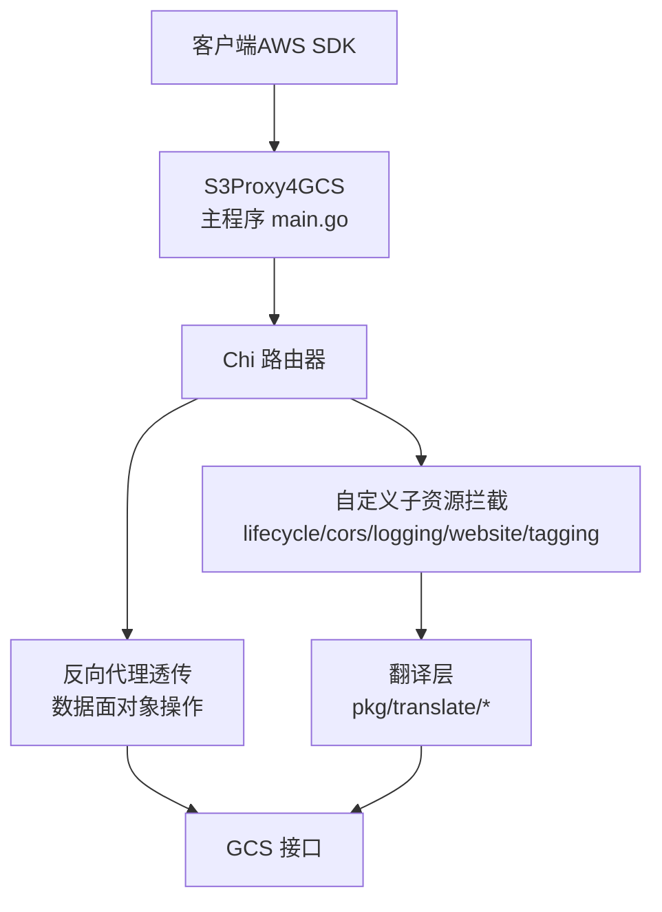
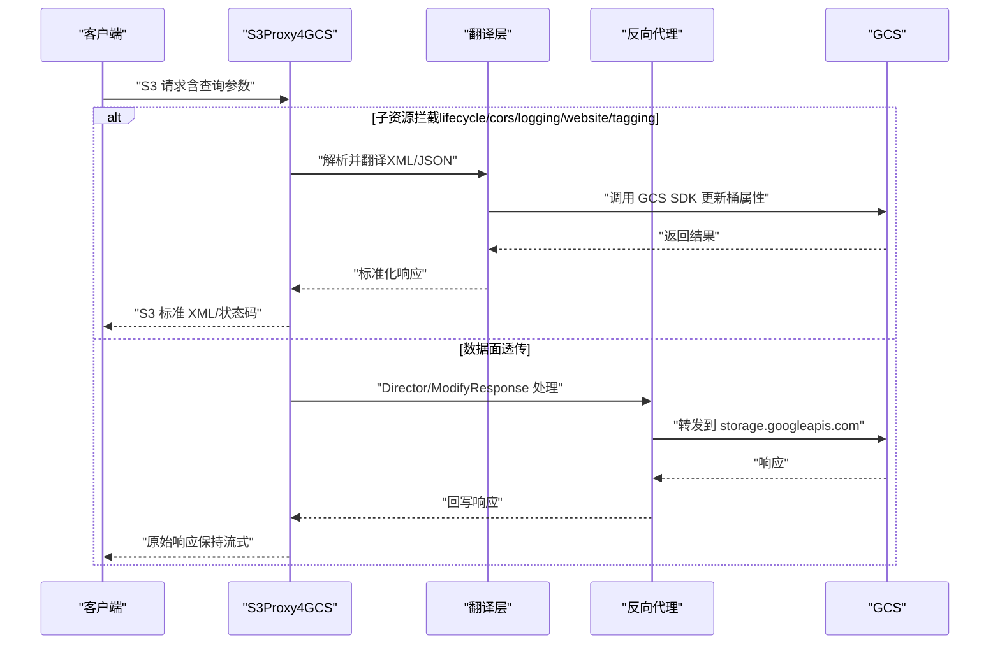
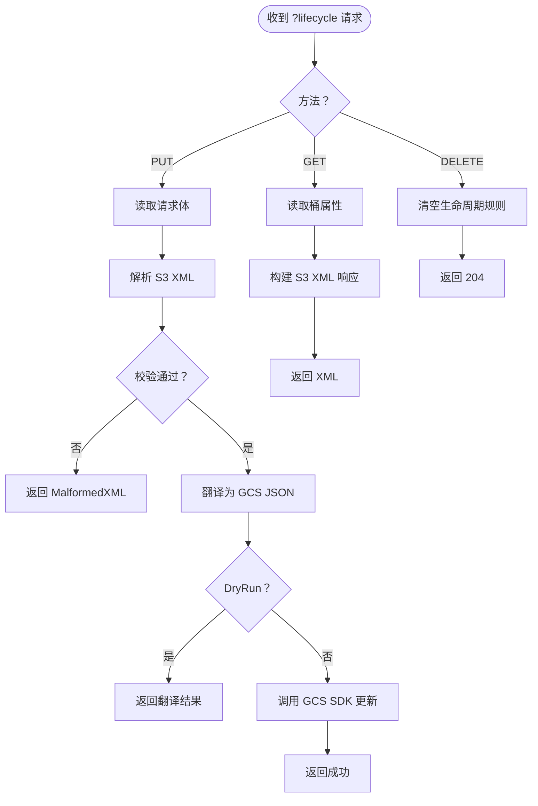
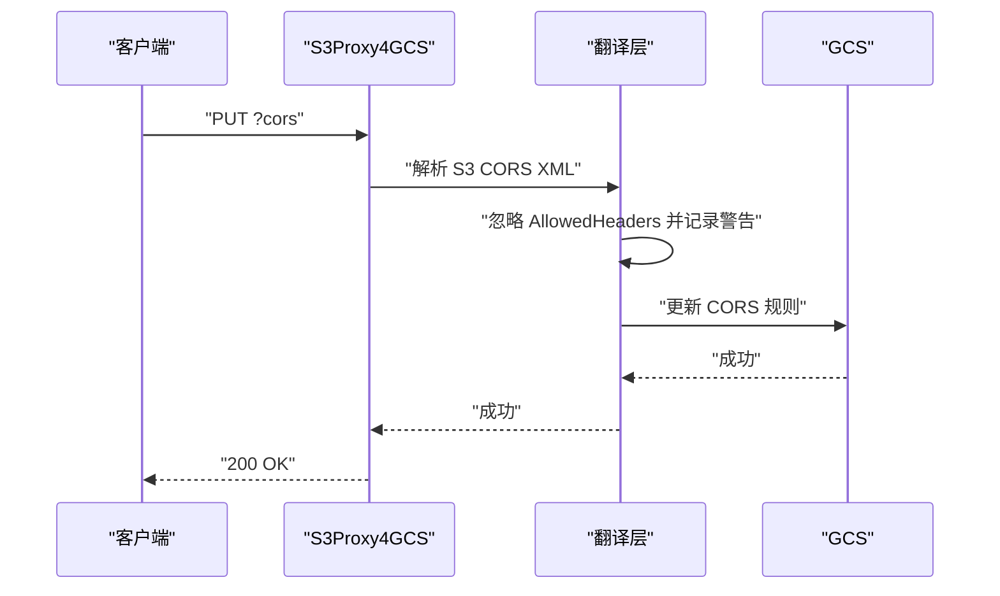
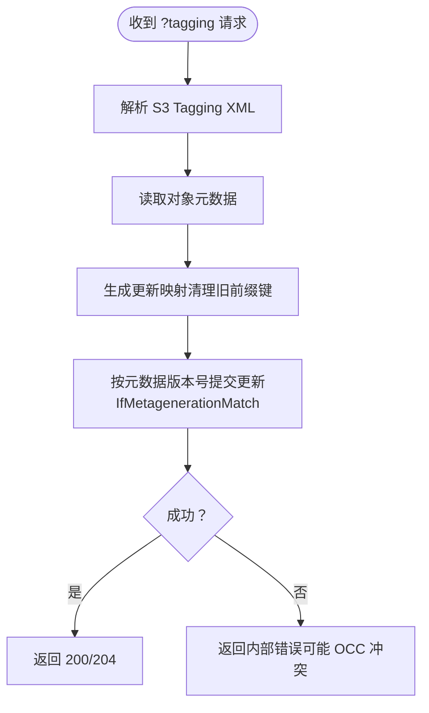
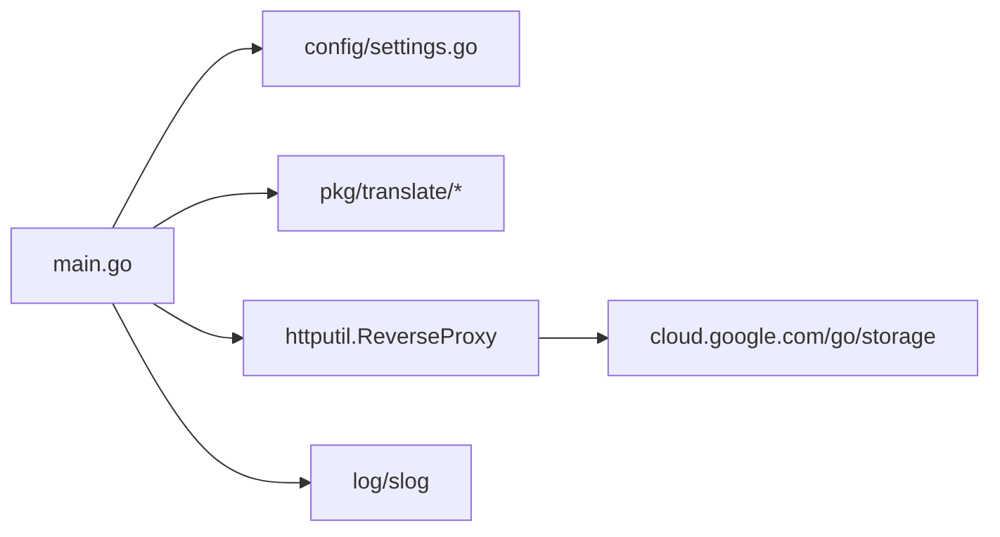

# 故障排除与FAQ

<cite>
**本文引用的文件**
- [README.md](file://README.md)
- [main.go](file://main.go)
- [config/settings.go](file://config/settings.go)
- [solutions.md](file://solutions.md)
- [unsupported.txt](file://unsupported.txt)
- [test_cases.md](file://test_cases.md)
- [test_results.md](file://test_results.md)
- [pkg/translate/gcs_cors.go](file://pkg/translate/gcs_cors.go)
- [pkg/translate/gcs_lifecycle.go](file://pkg/translate/gcs_lifecycle.go)
- [pkg/translate/gcs_tagging.go](file://pkg/translate/gcs_tagging.go)
- [pkg/translate/gcs_website.go](file://pkg/translate/gcs_website.go)
- [pkg/translate/s3_cors.go](file://pkg/translate/s3_cors.go)
- [integration_tests/logging_test.go](file://integration_tests/logging_test.go)
- [integration_tests/test_utils.go](file://integration_tests/test_utils.go)
- [AGENTS.md](file://AGENTS.md)
</cite>

## 目录
1. [简介](#简介)
2. [项目结构](#项目结构)
3. [核心组件](#核心组件)
4. [架构总览](#架构总览)
5. [详细组件分析](#详细组件分析)
6. [依赖关系分析](#依赖关系分析)
7. [性能考量](#性能考量)
8. [故障排除指南](#故障排除指南)
9. [结论](#结论)
10. [附录](#附录)

## 简介
本文件面向使用 S3Proxy4GCS 的工程师与运维人员，提供系统化的故障排除与常见问题解答（FAQ）。内容覆盖不支持的功能与已知限制、替代方案与绕过方法、常见错误诊断与修复步骤、调试技巧与日志分析方法、性能问题识别与优化策略、配置问题排查流程与解决方案，并给出社区支持渠道与问题报告指南。

## 项目结构
- 根入口与路由：主程序负责拦截 S3 自定义子资源请求（如生命周期、CORS、日志、静态网站、对象标签），其余标准数据面请求通过高性能反向代理透传至 GCS。
- 配置模块：集中读取环境变量或 .env 文件，统一管理端口、目标桶、DryRun、连接池上限、代理 HMAC 凭证等。
- 翻译包：在 pkg/translate 下实现 S3 XML 与 GCS JSON/SDK 类型之间的双向映射与转换。
- 集成测试：独立子模块 integration_tests 使用真实 AWS SDK 客户端验证关键路径，包含日志、CORS、数据面等场景。

**图表来源**
- [main.go:197-329](file://main.go#L197-L329)
- [config/settings.go:29-56](file://config/settings.go#L29-L56)

**章节来源**
- [README.md:140-157](file://README.md#L140-L157)
- [main.go:197-329](file://main.go#L197-L329)
- [config/settings.go:29-56](file://config/settings.go#L29-L56)

## 核心组件
- 主程序与路由
  - 拦截 ?lifecycle、?cors、?logging、?website、?tagging 等子资源请求，调用对应处理器；其他请求走反向代理。
  - 反向代理传输层可配置连接池上限、空闲超时、TLS 握手超时、强制 HTTP/2、禁用压缩等，确保签名完整性与高并发稳定性。
  - 对存储类、版本互操作头、x-id 参数进行透明处理与必要时重新签名。
- 配置中心
  - 支持从 .env 或环境变量加载，包括端口、项目 ID、目标桶、GCS 基础 URL、前缀隔离、DryRun、调试日志、连接池参数、代理 HMAC 凭证、JSON 密钥路径等。
- 翻译层
  - 生命周期：S3 XML → GCS JSON，拒绝不支持的过滤条件（大小、标签），并进行存储类映射。
  - CORS：S3 XML ↔ GCS CORS 列表，注意请求头白名单在 GCS 上不生效。
  - 日志：S3 XML → GCS 日志设置。
  - 静态网站：S3 索引页/错误页 → GCS 网站配置。
  - 对象标签：S3 Tagging → GCS 自定义元数据（带乐观并发控制 OCC）。
- 集成测试
  - 使用独立子模块运行，验证日志、CORS、数据面、生命周期、存储类、标签、版本互操作、静态网站等路径。

**章节来源**
- [main.go:67-90](file://main.go#L67-L90)
- [main.go:109-182](file://main.go#L109-L182)
- [main.go:253-329](file://main.go#L253-L329)
- [config/settings.go:11-25](file://config/settings.go#L11-L25)
- [pkg/translate/gcs_lifecycle.go:38-104](file://pkg/translate/gcs_lifecycle.go#L38-L104)
- [pkg/translate/gcs_cors.go:10-35](file://pkg/translate/gcs_cors.go#L10-L35)
- [pkg/translate/gcs_tagging.go:10-35](file://pkg/translate/gcs_tagging.go#L10-L35)
- [pkg/translate/gcs_website.go:9-26](file://pkg/translate/gcs_website.go#L9-L26)
- [integration_tests/logging_test.go:18-98](file://integration_tests/logging_test.go#L18-L98)

## 架构总览
下图展示典型请求流：客户端发起 S3 请求，代理根据查询参数决定是否拦截并翻译，否则直接透传到 GCS。代理在必要时对请求进行重签名以匹配 GCS 的 HMAC 要求。

**图表来源**
- [main.go:253-329](file://main.go#L253-L329)
- [main.go:356-413](file://main.go#L356-L413)
- [main.go:452-495](file://main.go#L452-L495)
- [main.go:533-576](file://main.go#L533-L576)
- [main.go:610-653](file://main.go#L610-L653)
- [main.go:655-720](file://main.go#L655-L720)

## 详细组件分析

### 组件A：生命周期（Lifecycle）处理流程
- 入口：拦截 ?lifecycle 的 PUT/GET/DELETE。
- 解析与翻译：读取 S3 XML，转为 GCS JSON；对不支持的过滤条件（大小、标签）直接报错。
- 执行：DryRun 模式下仅返回翻译结果；否则通过 GCS SDK 更新桶生命周期。
- 错误处理：返回标准 S3 XML 错误格式。

**图表来源**
- [main.go:356-413](file://main.go#L356-L413)
- [main.go:415-450](file://main.go#L415-L450)
- [pkg/translate/gcs_lifecycle.go:38-104](file://pkg/translate/gcs_lifecycle.go#L38-L104)

**章节来源**
- [main.go:356-450](file://main.go#L356-L450)
- [pkg/translate/gcs_lifecycle.go:107-137](file://pkg/translate/gcs_lifecycle.go#L107-L137)

### 组件B：CORS 处理流程
- 入口：拦截 ?cors 的 PUT/GET/DELETE。
- 解析与翻译：S3 XML → GCS CORS 列表；GET 时反向转换。
- 注意事项：S3 的 AllowedHeaders（请求头白名单）在 GCS 上不生效，会被忽略并记录警告。

**图表来源**
- [main.go:452-495](file://main.go#L452-L495)
- [pkg/translate/gcs_cors.go:10-35](file://pkg/translate/gcs_cors.go#L10-L35)

**章节来源**
- [pkg/translate/gcs_cors.go:20-22](file://pkg/translate/gcs_cors.go#L20-L22)

### 组件C：对象标签（Tagging）处理流程
- 入口：拦截 ?tagging 的 PUT/GET/DELETE。
- 读取现有对象元数据，基于前缀 s3tag- 进行读改写（OCC），避免覆盖丢失。
- 返回标准 S3 XML 响应或 204。

**图表来源**
- [main.go:655-720](file://main.go#L655-L720)
- [pkg/translate/gcs_tagging.go:10-35](file://pkg/translate/gcs_tagging.go#L10-L35)

**章节来源**
- [main.go:690-715](file://main.go#L690-L715)
- [pkg/translate/gcs_tagging.go:17-22](file://pkg/translate/gcs_tagging.go#L17-L22)

### 组件D：静态网站（Website）处理流程
- 入口：拦截 ?website 的 PUT。
- 将 S3 索引页/错误页映射到 GCS 网站字段后更新。

**章节来源**
- [main.go:610-653](file://main.go#L610-L653)
- [pkg/translate/gcs_website.go:9-26](file://pkg/translate/gcs_website.go#L9-L26)

### 组件E：日志（Logging）处理流程
- 入口：拦截 ?logging 的 PUT/GET/DELETE。
- S3 XML → GCS 日志设置；GET 返回 S3 XML。

**章节来源**
- [main.go:533-576](file://main.go#L533-L576)

## 依赖关系分析
- 主程序依赖配置模块与翻译包；反向代理依赖 GCS Go SDK；日志使用标准库 slog。
- 关键耦合点：
  - 反向代理传输层参数直接影响吞吐与延迟。
  - 重签名逻辑依赖代理 HMAC 凭证，缺失会导致签名失败。
  - 版本互操作头注入与响应头映射需在重签名之前完成。

**图表来源**
- [main.go:31-29](file://main.go#L31-L29)
- [config/settings.go:11-25](file://config/settings.go#L11-L25)

**章节来源**
- [main.go:73-90](file://main.go#L73-L90)
- [main.go:156-181](file://main.go#L156-L181)

## 性能考量
- 连接池与超时
  - 合理设置 MaxIdleConns 与 MaxIdleConnsPerHost，避免连接耗尽导致排队。
  - 启用 HTTP/2 与禁用压缩以减少握手开销并保留签名完整性。
- 重签名成本
  - 仅在确需修改请求（如存储类、x-id、Accept-Encoding）时触发，避免不必要的重算。
- 版本互操作
  - 在 ListObjectVersions 前注入互操作头，在 HeadObject 响应中映射版本号，避免额外往返。
- 数据面透传
  - 保持流式传输，避免将整个响应体载入内存；利用请求上下文传播以支持取消。

**章节来源**
- [main.go:78-86](file://main.go#L78-L86)
- [main.go:109-154](file://main.go#L109-L154)
- [main.go:184-195](file://main.go#L184-L195)
- [AGENTS.md:16-17](file://AGENTS.md#L16-L17)

## 故障排除指南

### 一、不支持的功能与已知限制
- 已明确不支持或延迟支持的功能清单参见：
  - 不支持列表：[unsupported.txt:4-16](file://unsupported.txt#L4-L16)
  - 测试用例与状态：[test_cases.md:61-76](file://test_cases.md#L61-L76)
  - 测试结果汇总：[test_results.md:26-36](file://test_results.md#L26-L36)
- 常见受限特性
  - 多对象删除（DeleteObjects）：GCS S3 兼容 API 不原生支持，代理侧无法安全地进行扇出聚合。
  - UploadPartCopy：跨对象分片复制受 GCS 限制。
  - RestoreObject：归档类对象在 GCS 默认视为“可用”，无需恢复。
  - 灵活校验和（aws-chunked）：现代 SDK 默认的 Trailer 校验不被 GCS 支持，需客户端降级。

**章节来源**
- [unsupported.txt:4-16](file://unsupported.txt#L4-L16)
- [test_cases.md:61-76](file://test_cases.md#L61-L76)
- [test_results.md:26-36](file://test_results.md#L26-L36)

### 二、常见错误与诊断步骤

- 现象：签名不匹配（SignatureDoesNotMatch）
  - 可能原因：Payload 内容哈希变化导致原签名失效；或客户端默认启用灵活校验和（aws-chunked）。
  - 诊断要点：
    - 检查代理是否正确重签名（代理 HMAC 凭证是否配置）。
    - 检查客户端是否启用了 aws-chunked（可通过环境变量降级）。
  - 修复建议：
    - 在客户端设置请求校验计算策略为 WHEN_REQUIRED。
    - 若必须使用 Trailer，考虑在客户端手动计算 Content-MD5。
  - 参考资料：
    - 客户端兼容性与工作区：[solutions.md:93-98](file://solutions.md#L93-L98)

- 现象：CORS 设置无效或被忽略
  - 可能原因：S3 的 AllowedHeaders 在 GCS 上不生效。
  - 诊断要点：确认翻译日志是否提示忽略 AllowedHeaders。
  - 修复建议：将请求头白名单逻辑迁移到应用层或使用预签名 URL。
  - 参考资料：
    - CORS 翻译行为：[pkg/translate/gcs_cors.go:20-22](file://pkg/translate/gcs_cors.go#L20-L22)

- 现象：多对象删除（DeleteObjects）失败或超时
  - 可能原因：GCS 不支持该 API，代理未实现扇出。
  - 诊断要点：确认请求是否命中 ?delete（S3 多对象删除）。
  - 修复建议：改为逐个 DeleteObject；或在应用层批量调度。
  - 参考资料：
    - 功能限制说明：[test_cases.md:65-66](file://test_cases.md#L65-L66)

- 现象：RestoreObject 报错（InvalidArgument）
  - 可能原因：GCS 归档对象默认“可用”，无需恢复。
  - 诊断要点：检查对象存储类别是否为归档类。
  - 修复建议：移除客户端对该 API 的调用，或在代理层返回合成 200 OK。
  - 参考资料：
    - 行为说明：[solutions.md:104-106](file://solutions.md#L104-L106)

- 现象：版本号显示异常（x-goog-generation vs x-amz-version-id）
  - 可能原因：未注入互操作头或未映射响应头。
  - 诊断要点：确认 ListObjectVersions 是否携带互操作头；响应头是否映射。
  - 修复建议：确保代理已注入互操作头并在 ModifyResponse 中映射。
  - 参考资料：
    - 互操作头注入与映射：[main.go:150-154](file://main.go#L150-L154)、[main.go:189-193](file://main.go#L189-L193)

- 现象：存储类值不被接受（如 STANDARD_IA、GLACIER）
  - 可能原因：未进行存储类翻译。
  - 诊断要点：检查 x-amz-storage-class 是否被映射。
  - 修复建议：使用代理内置映射或将值改为 GCS 原生值。
  - 参考资料：
    - 存储类映射与重签名：[main.go:112-132](file://main.go#L112-L132)、[main.go:156-181](file://main.go#L156-L181)

- 现象：对象标签更新冲突（412 Precondition Failed）
  - 可能原因：并发更新导致元数据版本冲突。
  - 诊断要点：检查 OCC 条件是否匹配。
  - 修复建议：重试并合并最新元数据；或降低并发。
  - 参考资料：
    - OCC 实现位置：[main.go:706-715](file://main.go#L706-L715)

- 现象：Java V2 CopyObject 返回 411（Length Required）
  - 可能原因：默认 HTTP 客户端未发送 Content-Length: 0。
  - 修复建议：切换到 ApacheHttpClient 以正确发送空请求体。
  - 参考资料：
    - 客户端兼容性：[solutions.md:100-102](file://solutions.md#L100-L102)

### 三、调试技巧与日志分析

- 开启结构化日志
  - 设置 DEBUG_LOGGING=true，使用 JSON 结构化日志，便于云平台日志检索与分析。
  - 关注请求/响应头（已脱敏 Authorization）、重签名状态、版本互操作头注入情况。
- 关键日志定位
  - 代理启动与端口：[main.go:227](file://main.go#L227)
  - 反向代理传输配置：[main.go:78-90](file://main.go#L78-L90)
  - 重签名触发与结果：[main.go:156-181](file://main.go#L156-L181)
  - 版本互操作头注入/映射：[main.go:150-154](file://main.go#L150-L154)、[main.go:189-193](file://main.go#L189-L193)
  - CORS 翻译警告：[pkg/translate/gcs_cors.go:20-22](file://pkg/translate/gcs_cors.go#L20-L22)
- 集成测试辅助
  - 使用集成测试子模块验证日志、CORS、数据面等路径，便于快速复现问题。
  - 参考：[integration_tests/logging_test.go:18-98](file://integration_tests/logging_test.go#L18-L98)

**章节来源**
- [main.go:40-46](file://main.go#L40-L46)
- [main.go:78-90](file://main.go#L78-L90)
- [main.go:156-181](file://main.go#L156-L181)
- [main.go:189-193](file://main.go#L189-L193)
- [pkg/translate/gcs_cors.go:20-22](file://pkg/translate/gcs_cors.go#L20-L22)
- [integration_tests/logging_test.go:18-98](file://integration_tests/logging_test.go#L18-L98)

### 四、配置问题排查流程

- 必备配置核对
  - 端口、目标桶、GCS 基础 URL、DryRun、代理 HMAC 凭证、JSON 密钥路径、连接池参数。
  - 参考：[config/settings.go:43-56](file://config/settings.go#L43-L56)
- 常见配置错误与修复
  - 代理 HMAC 未配置：重签名跳过，GCS 返回签名错误。
    - 修复：设置 PROXY_AWS_ACCESS_KEY_ID 与 PROXY_AWS_SECRET_ACCESS_KEY。
  - JSON 密钥路径错误：GCS 客户端初始化失败。
    - 修复：确认 JSON_KEY 指向有效密钥文件。
  - 连接池过小：高并发下连接争用。
    - 修复：增大 MAX_IDLE_CONNS 与 MAX_IDLE_CONNS_PER_HOST。
  - 路径样式未启用：与 GCS S3 兼容性相关。
    - 修复：确保客户端使用路径样式地址。
- 环境变量优先级
  - .env 不存在时，直接从环境变量读取；若两者同时存在，以环境变量为准。
  - 参考：[config/settings.go:32-34](file://config/settings.go#L32-L34)

**章节来源**
- [config/settings.go:29-56](file://config/settings.go#L29-L56)
- [main.go:50-65](file://main.go#L50-L65)

### 五、替代方案与绕过方法

- 多对象删除
  - 应用层逐个删除；或在业务侧拆分为多个小批次。
  - 参考：[test_cases.md:65-66](file://test_cases.md#L65-L66)
- UploadPartCopy
  - 使用单对象上传后替换，或改用服务端复制（取决于具体场景）。
  - 参考：[test_cases.md:71-72](file://test_cases.md#L71-L72)
- RestoreObject
  - 移除调用；或在代理层拦截并返回 200 OK。
  - 参考：[solutions.md:104-106](file://solutions.md#L104-L106)
- 灵活校验和（aws-chunked）
  - 客户端降级为 WHEN_REQUIRED；或手动计算 Content-MD5。
  - 参考：[solutions.md:93-98](file://solutions.md#L93-L98)

**章节来源**
- [test_cases.md:65-76](file://test_cases.md#L65-L76)
- [solutions.md:93-106](file://solutions.md#L93-L106)

### 六、社区支持与问题报告

- 社区支持渠道
  - GitHub Issues：用于报告缺陷、功能请求与兼容性问题。
  - 讨论区：用于交流最佳实践、部署经验与疑难问题。
- 问题报告模板建议
  - 环境信息：Go 版本、操作系统、网络拓扑、客户端 SDK 版本。
  - 配置信息：关键环境变量摘要（端口、目标桶、DryRun、代理 HMAC、连接池）。
  - 复现步骤：最小可复现示例（代码片段路径或测试用例）。
  - 日志与抓包：开启 DEBUG_LOGGING 后的结构化日志，以及必要的抓包信息。
  - 期望与实际差异：明确指出行为差异与影响范围。

[本节为通用指导，不直接分析具体文件]

## 结论
S3Proxy4GCS 提供了对主流 S3 控制面配置（生命周期、CORS、日志、静态网站、对象标签）的可靠翻译与透传能力。针对不支持或延迟支持的功能，建议采用应用层替代、客户端降级或代理层拦截等策略。通过合理配置连接池、启用结构化日志、遵循重签名与版本互操作的最佳实践，可在生产环境中获得稳定且可观的性能表现。

## 附录

### A. 关键实现路径索引
- 主程序入口与路由：[main.go:197-329](file://main.go#L197-L329)
- 反向代理与重签名：[main.go:73-90](file://main.go#L73-L90)、[main.go:156-181](file://main.go#L156-L181)
- 生命周期处理：[main.go:356-450](file://main.go#L356-L450)、[pkg/translate/gcs_lifecycle.go:38-104](file://pkg/translate/gcs_lifecycle.go#L38-L104)
- CORS 处理：[main.go:452-531](file://main.go#L452-L531)、[pkg/translate/gcs_cors.go:10-35](file://pkg/translate/gcs_cors.go#L10-L35)
- 日志处理：[main.go:533-608](file://main.go#L533-L608)
- 静态网站处理：[main.go:610-653](file://main.go#L610-L653)、[pkg/translate/gcs_website.go:9-26](file://pkg/translate/gcs_website.go#L9-L26)
- 对象标签处理：[main.go:655-785](file://main.go#L655-L785)、[pkg/translate/gcs_tagging.go:10-35](file://pkg/translate/gcs_tagging.go#L10-L35)
- 配置加载：[config/settings.go:29-56](file://config/settings.go#L29-L56)
- 集成测试参考：[integration_tests/logging_test.go:18-98](file://integration_tests/logging_test.go#L18-L98)

### B. 已验证功能清单
- CORS、数据面、分段上传、生命周期、日志、存储类、对象标签、版本互操作、静态网站等均已在测试结果中验证通过。
- 参考：[test_results.md:7-22](file://test_results.md#L7-L22)