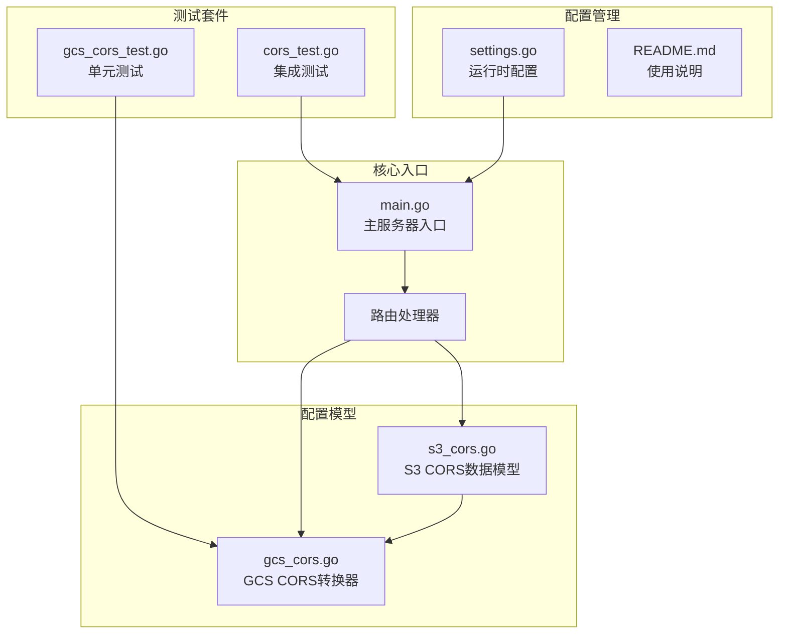
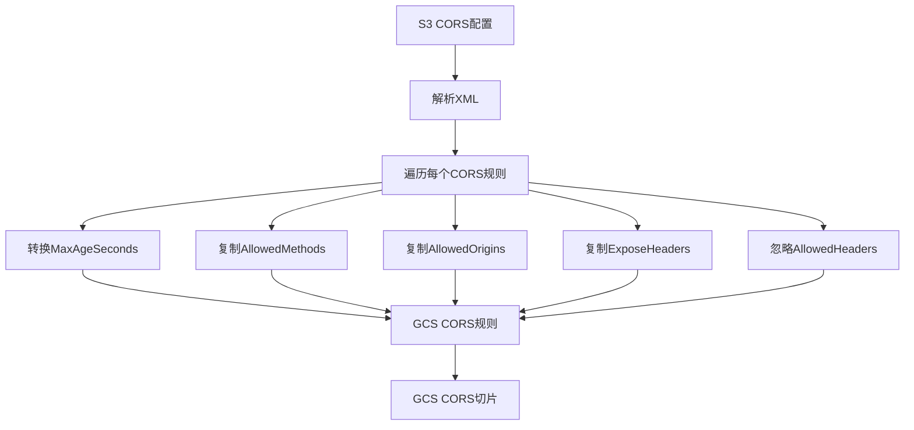
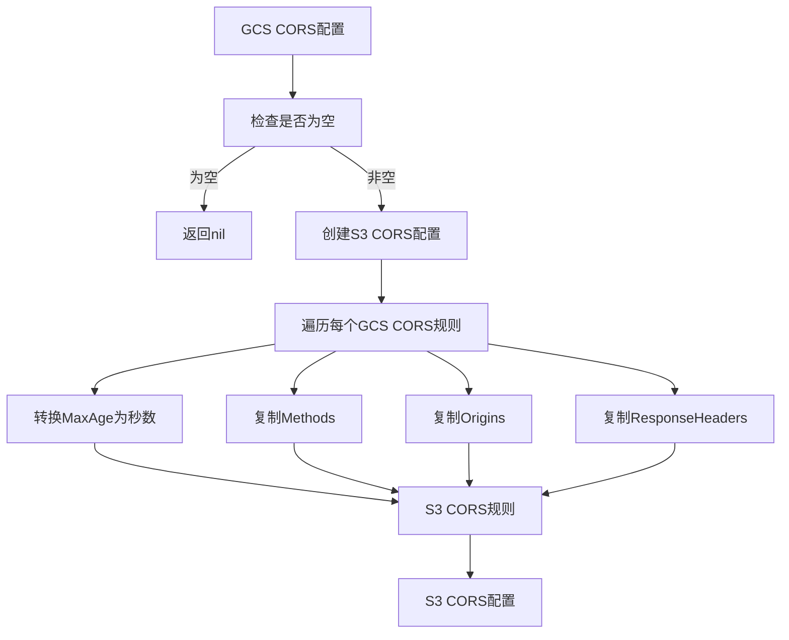
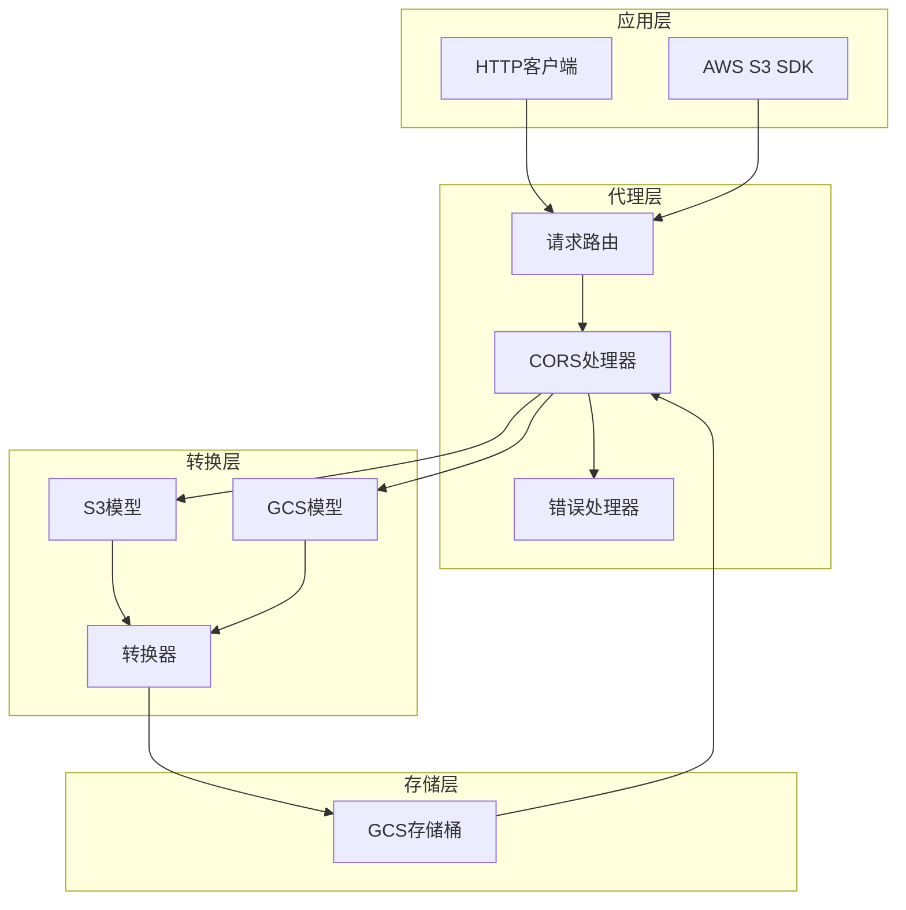
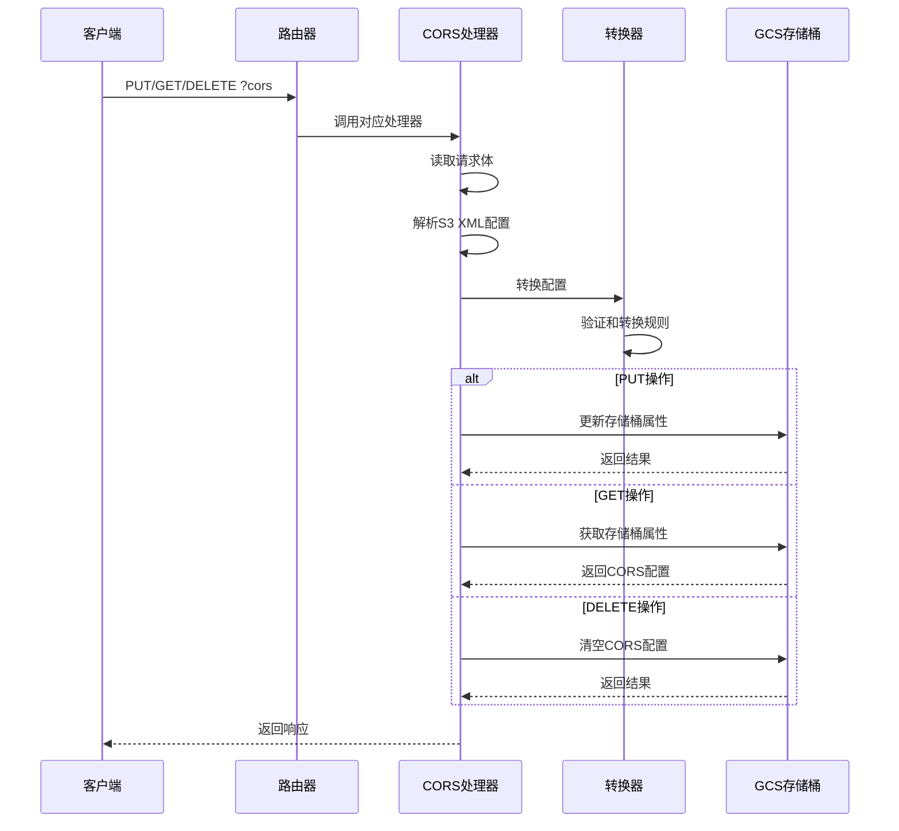
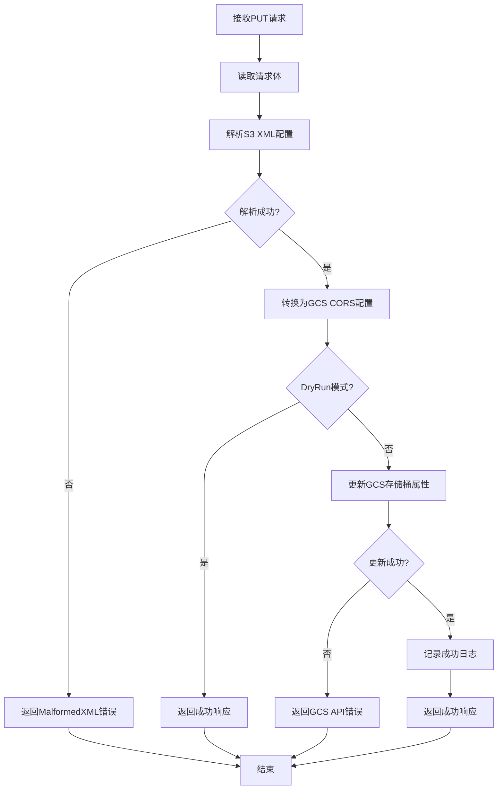
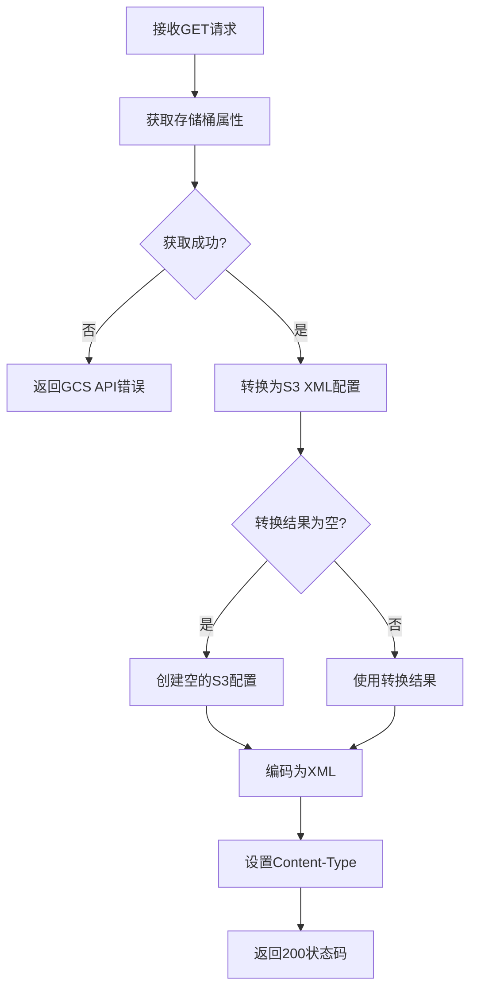
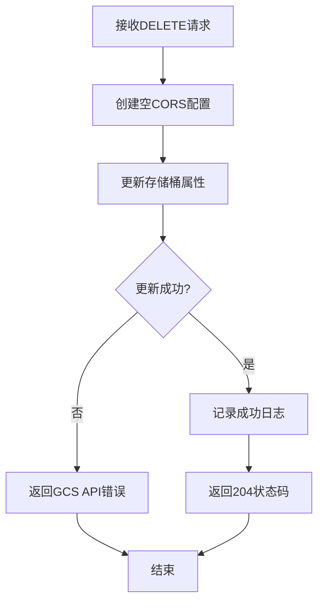
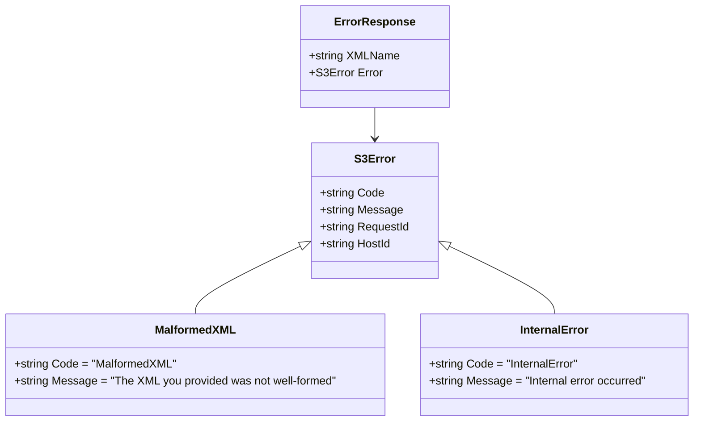
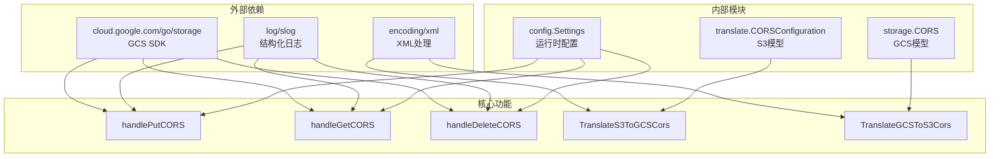

# CORS配置管理

<cite>
**本文档引用的文件**
- [main.go](file://main.go)
- [s3_cors.go](file://pkg/translate/s3_cors.go)
- [gcs_cors.go](file://pkg/translate/gcs_cors.go)
- [gcs_cors_test.go](file://pkg/translate/gcs_cors_test.go)
- [cors_test.go](file://integration_tests/cors_test.go)
- [settings.go](file://config/settings.go)
- [README.md](file://README.md)
- [test_cases.md](file://test_cases.md)
</cite>

## 目录
1. [简介](#简介)
2. [项目结构](#项目结构)
3. [核心组件](#核心组件)
4. [架构概览](#架构概览)
5. [详细组件分析](#详细组件分析)
6. [依赖关系分析](#依赖关系分析)
7. [性能考虑](#性能考虑)
8. [故障排除指南](#故障排除指南)
9. [结论](#结论)
10. [附录](#附录)

## 简介

S3Proxy4GCS的CORS（跨域资源共享）配置管理功能是该项目的核心特性之一，它实现了S3 XML CORS配置与Google Cloud Storage CORS配置之间的双向转换。该功能允许使用标准AWS S3 SDK的客户端透明地配置GCS存储桶的跨域访问策略，而无需修改任何应用程序代码。

CORS配置管理功能支持以下操作：
- PUT：设置存储桶的CORS配置
- GET：获取存储桶的CORS配置
- DELETE：删除存储桶的CORS配置

该功能通过拦截S3请求中的`?cors`查询参数来识别CORS操作，并在本地内存中进行配置转换，而不是直接调用GCS API，从而避免了不必要的网络往返。

## 项目结构

S3Proxy4GCS项目采用模块化架构设计，CORS配置管理功能分布在多个关键文件中：



**图表来源**
- [main.go:280-292](file://main.go#L280-L292)
- [s3_cors.go:5-19](file://pkg/translate/s3_cors.go#L5-L19)
- [gcs_cors.go:10-61](file://pkg/translate/gcs_cors.go#L10-L61)

**章节来源**
- [main.go:198-218](file://main.go#L198-L218)
- [README.md:140-157](file://README.md#L140-L157)

## 核心组件

### 数据模型定义

CORS配置管理功能的核心是两个数据模型之间的转换：

#### S3 CORS配置模型
S3使用XML格式定义CORS配置，包含以下关键字段：
- `CORSConfiguration`：顶级容器元素
- `CORSRule`：单个CORS规则
- `AllowedMethods`：允许的HTTP方法列表
- `AllowedOrigins`：允许的源站点列表
- `AllowedHeaders`：允许的请求头（GCS不支持）
- `ExposeHeaders`：暴露的响应头
- `MaxAgeSeconds`：预检请求缓存时间

#### GCS CORS配置模型
GCS使用Go SDK的`storage.CORS`结构体表示CORS配置：
- `Methods`：允许的HTTP方法切片
- `Origins`：允许的源站点切片
- `ResponseHeaders`：暴露的响应头切片
- `MaxAge`：预检请求缓存时间（time.Duration）

**章节来源**
- [s3_cors.go:5-19](file://pkg/translate/s3_cors.go#L5-L19)
- [gcs_cors.go:24-29](file://pkg/translate/gcs_cors.go#L24-L29)

### 转换器实现

CORS配置转换器提供了双向转换功能：

#### S3到GCS转换


**图表来源**
- [gcs_cors.go:10-35](file://pkg/translate/gcs_cors.go#L10-L35)

#### GCS到S3转换


**图表来源**
- [gcs_cors.go:37-61](file://pkg/translate/gcs_cors.go#L37-L61)

**章节来源**
- [gcs_cors.go:10-61](file://pkg/translate/gcs_cors.go#L10-L61)

## 架构概览

CORS配置管理功能采用分层架构设计，实现了清晰的关注点分离：



**图表来源**
- [main.go:254-338](file://main.go#L254-L338)
- [main.go:461-540](file://main.go#L461-L540)

### 请求处理流程

CORS请求的完整处理流程如下：



**图表来源**
- [main.go:461-540](file://main.go#L461-L540)
- [gcs_cors.go:10-61](file://pkg/translate/gcs_cors.go#L10-L61)

**章节来源**
- [main.go:280-292](file://main.go#L280-L292)
- [main.go:461-540](file://main.go#L461-L540)

## 详细组件分析

### 处理器实现分析

#### handlePutCORS函数

handlePutCORS函数负责处理CORS配置的PUT操作，实现了完整的请求处理流程：



**图表来源**
- [main.go:461-504](file://main.go#L461-L504)

##### 实现细节

1. **请求体读取**：使用`io.ReadAll`安全地读取请求体内容
2. **XML解析**：通过`xml.Unmarshal`将S3 XML配置转换为Go结构体
3. **错误处理**：对解析失败的情况返回标准的S3错误格式
4. **配置转换**：调用`TranslateS3ToGCSCors`进行双向转换
5. **DryRun支持**：在DryRun模式下跳过实际的GCS API调用
6. **GCS更新**：使用`bucket.Update`方法更新存储桶属性

**章节来源**
- [main.go:461-504](file://main.go#L461-L504)

#### handleGetCORS函数

handleGetCORS函数处理CORS配置的GET操作，提供了配置查询功能：



**图表来源**
- [main.go:506-523](file://main.go#L506-L523)

##### 实现细节

1. **属性获取**：通过`bucket.Attrs`获取存储桶的当前配置
2. **转换处理**：使用`TranslateGCSToS3Cors`将GCS配置转换为S3格式
3. **空配置处理**：当GCS没有配置时返回空但有效的S3 XML
4. **响应编码**：使用`xml.NewEncoder`将配置编码为XML格式

**章节来源**
- [main.go:506-523](file://main.go#L506-L523)

#### handleDeleteCORS函数

handleDeleteCORS函数处理CORS配置的DELETE操作，实现了配置清理功能：



**图表来源**
- [main.go:525-540](file://main.go#L525-L540)

##### 实现细节

1. **配置清理**：创建一个空的`storage.CORS`切片来清除所有CORS规则
2. **原子更新**：通过单次`bucket.Update`操作完成配置清理
3. **状态码处理**：返回标准的HTTP 204 No Content状态码

**章节来源**
- [main.go:525-540](file://main.go#L525-L540)

### 验证规则和默认值处理

#### S3 XML验证规则

CORS配置在解析过程中遵循严格的验证规则：

1. **XML格式验证**：必须符合S3 CORS配置的XML Schema
2. **必需字段检查**：`AllowedMethods`和`AllowedOrigins`是必需的
3. **数据类型验证**：确保所有字段的数据类型正确
4. **范围限制**：对`MaxAgeSeconds`等数值字段进行范围检查

#### 默认值处理

在转换过程中，系统会处理各种默认值和边界情况：

1. **空数组处理**：当`AllowedHeaders`为空时，系统会发出警告但继续处理
2. **可选字段**：`ID`和`MaxAgeSeconds`等字段可以省略
3. **兼容性处理**：某些S3特有的字段在GCS中会被忽略

**章节来源**
- [gcs_cors.go:20-22](file://pkg/translate/gcs_cors.go#L20-L22)

### 错误响应格式

系统实现了标准的S3错误响应格式，确保与AWS SDK的兼容性：



**图表来源**
- [main.go:833-837](file://main.go#L833-L837)

**章节来源**
- [main.go:833-837](file://main.go#L833-L837)

## 依赖关系分析

CORS配置管理功能的依赖关系相对简单，主要涉及以下几个方面：



**图表来源**
- [main.go:32-35](file://main.go#L32-L35)
- [gcs_cors.go:3-8](file://pkg/translate/gcs_cors.go#L3-L8)

### 组件耦合度分析

CORS配置管理功能具有以下特点：

1. **低耦合**：处理器函数与具体实现分离，便于测试和维护
2. **高内聚**：所有CORS相关功能集中在单一模块中
3. **清晰边界**：与GCS SDK的交互通过转换器抽象层进行

**章节来源**
- [main.go:254-338](file://main.go#L254-L338)
- [gcs_cors.go:10-61](file://pkg/translate/gcs_cors.go#L10-L61)

## 性能考虑

### 内存优化策略

1. **零拷贝转换**：转换器直接操作现有数据结构，避免不必要的内存分配
2. **批量处理**：支持多条CORS规则的批量转换
3. **延迟初始化**：仅在需要时才创建新的数据结构

### 并发安全性

1. **只读操作**：GET和DELETE操作都是只读的，天然线程安全
2. **原子更新**：PUT操作通过单次GCS API调用完成，保证原子性
3. **上下文传播**：所有操作都正确传播请求上下文，支持超时控制

### 缓存策略

虽然CORS配置通常很小，但系统仍考虑了以下优化：

1. **配置缓存**：对于频繁的GET请求，可以在应用层面实现缓存
2. **转换结果复用**：对于相同的输入，转换结果可以被缓存

## 故障排除指南

### 常见问题诊断

#### XML解析错误

**症状**：收到`MalformedXML`错误
**可能原因**：
1. XML格式不符合S3 Schema
2. 缺少必需的XML标签
3. 字段值超出允许范围

**解决方案**：
1. 使用标准的AWS S3 SDK生成正确的XML
2. 验证XML格式的有效性
3. 检查所有必需字段是否完整

#### GCS API错误

**症状**：收到GCS API相关的错误响应
**可能原因**：
1. 权限不足
2. 存储桶不存在
3. 配额限制

**解决方案**：
1. 验证GCS服务账户权限
2. 确认目标存储桶存在
3. 检查配额限制

#### DryRun模式问题

**症状**：在DryRun模式下无法看到预期的配置
**可能原因**：
1. DryRun配置错误
2. 期望的行为误解

**解决方案**：
1. 检查`DRY_RUN`环境变量设置
2. 理解DryRun模式下的行为差异

### 调试技巧

1. **启用调试日志**：设置`DEBUG_LOGGING=true`获取详细的请求/响应信息
2. **检查转换过程**：使用单元测试验证转换逻辑
3. **监控GCS配额**：关注GCS API的使用情况

**章节来源**
- [settings.go:36-37](file://config/settings.go#L36-L37)
- [README.md:18-29](file://README.md#L18-L29)

## 结论

S3Proxy4GCS的CORS配置管理功能通过精心设计的双向转换机制，成功实现了S3和GCS之间CORS配置的无缝对接。该功能具有以下优势：

1. **完全兼容**：与标准AWS S3 SDK完全兼容
2. **易于使用**：无需修改任何应用程序代码
3. **安全可靠**：通过严格的验证和错误处理机制
4. **性能优秀**：采用高效的内存管理和并发处理

该功能为用户提供了透明的跨域资源共享配置能力，使得现有的S3应用程序能够无缝迁移到GCS平台，同时保持原有的开发体验和功能完整性。

## 附录

### 配置示例

#### 基本CORS配置
```xml
<?xml version="1.0" encoding="UTF-8"?>
<CORSConfiguration>
    <CORSRule>
        <AllowedOrigin>https://example.com</AllowedOrigin>
        <AllowedMethod>GET</AllowedMethod>
        <AllowedMethod>POST</AllowedMethod>
        <AllowedHeader>Authorization</AllowedHeader>
        <ExposeHeader>x-amz-request-id</ExposeHeader>
        <MaxAgeSeconds>3600</MaxAgeSeconds>
    </CORSRule>
</CORSConfiguration>
```

#### 允许所有来源的配置
```xml
<?xml version="1.0" encoding="UTF-8"?>
<CORSConfiguration>
    <CORSRule>
        <AllowedOrigin>*</AllowedOrigin>
        <AllowedMethod>GET</AllowedMethod>
        <AllowedMethod>PUT</AllowedMethod>
        <AllowedMethod>POST</AllowedMethod>
        <AllowedMethod>DELETE</AllowedMethod>
    </CORSRule>
</CORSConfiguration>
```

### 测试用例

#### 单元测试场景
1. **基本转换测试**：验证S3到GCS的正确转换
2. **空配置测试**：验证空CORS配置的处理
3. **边界条件测试**：测试各种边界情况和异常输入

#### 集成测试场景
1. **完整工作流测试**：从SDK调用到GCS配置的完整流程
2. **错误处理测试**：验证各种错误情况的处理
3. **性能基准测试**：评估转换性能

**章节来源**
- [gcs_cors_test.go:11-54](file://pkg/translate/gcs_cors_test.go#L11-L54)
- [cors_test.go:18-111](file://integration_tests/cors_test.go#L18-L111)

### 安全最佳实践

1. **最小权限原则**：为GCS服务账户分配最小必要的权限
2. **来源白名单**：避免使用通配符`*`作为允许来源
3. **定期审计**：定期检查和更新CORS配置
4. **监控告警**：设置适当的监控和告警机制