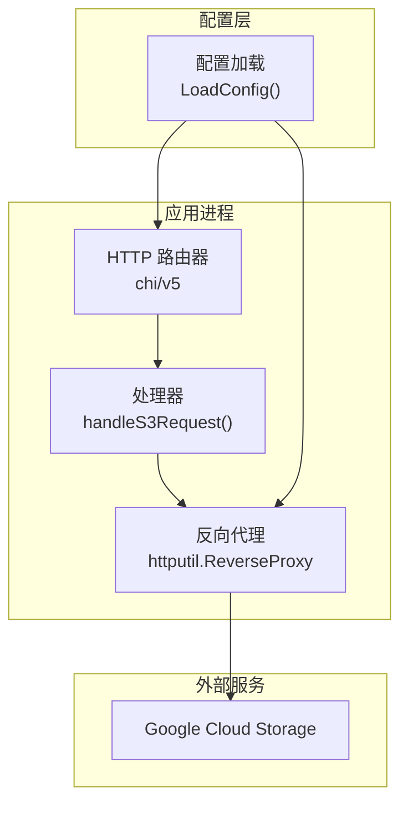
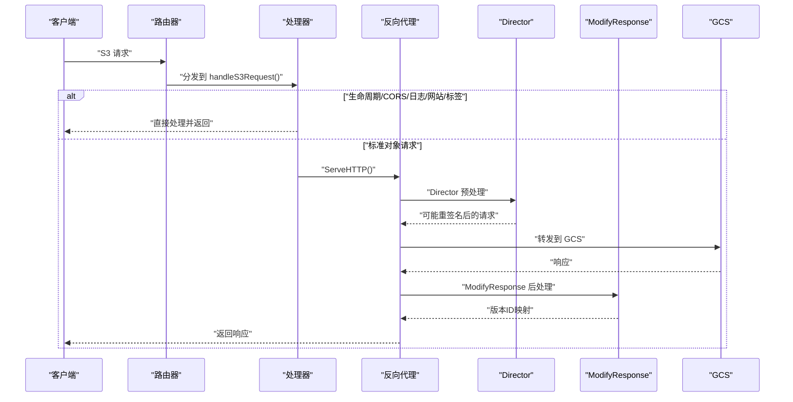
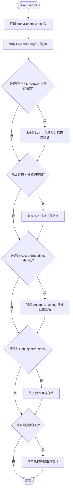
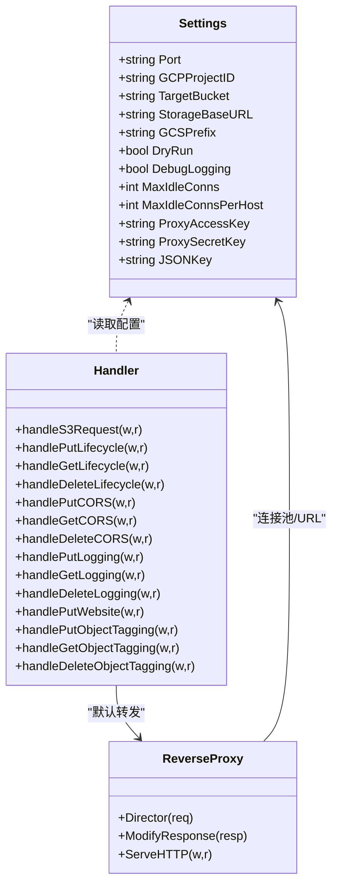
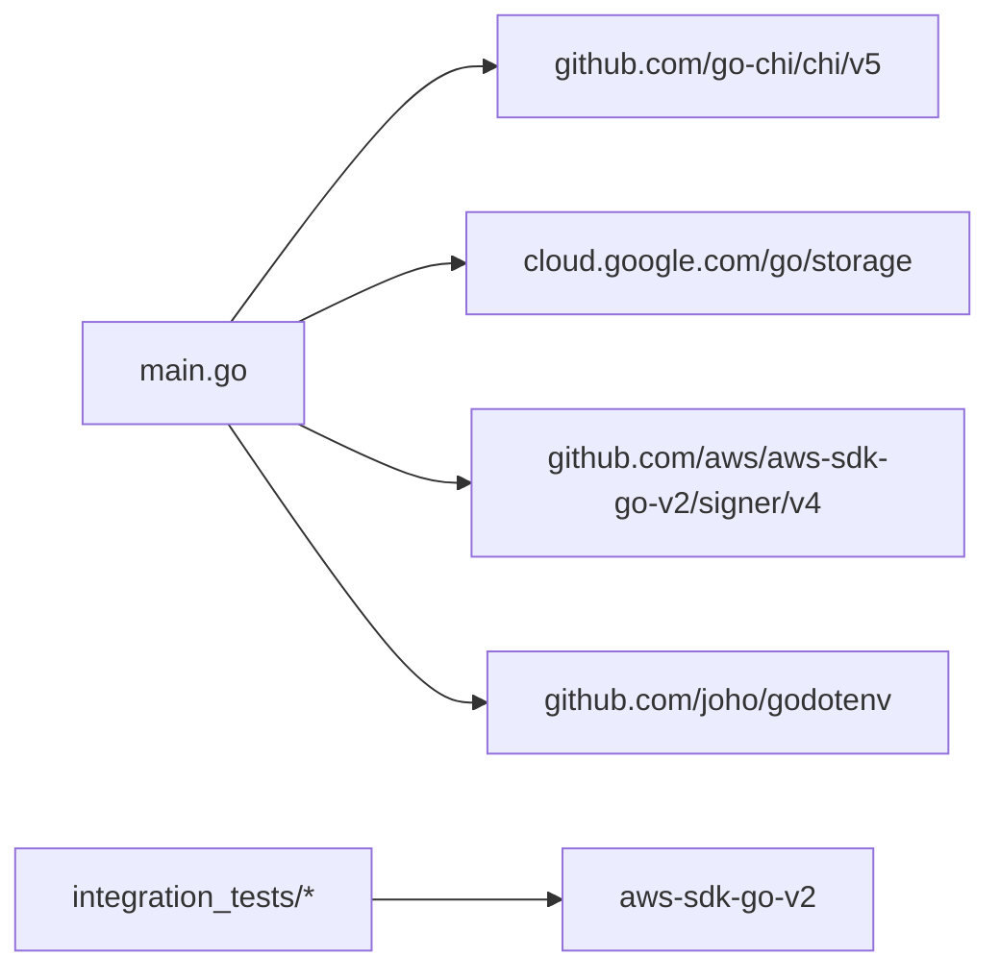

# 反向代理核心

<cite>
**本文引用的文件**
- [main.go](file://main.go)
- [config/settings.go](file://config/settings.go)
- [README.md](file://README.md)
- [pkg/translate/gcs_lifecycle.go](file://pkg/translate/gcs_lifecycle.go)
- [pkg/translate/gcs_cors.go](file://pkg/translate/gcs_cors.go)
- [pkg/translate/gcs_tagging.go](file://pkg/translate/gcs_tagging.go)
- [integration_tests/versioning_test.go](file://integration_tests/versioning_test.go)
- [integration_tests/storage_class_test.go](file://integration_tests/storage_class_test.go)
- [integration_tests/test_utils.go](file://integration_tests/test_utils.go)
- [go.mod](file://go.mod)
</cite>

## 目录
1. [简介](#简介)
2. [项目结构](#项目结构)
3. [核心组件](#核心组件)
4. [架构总览](#架构总览)
5. [详细组件分析](#详细组件分析)
6. [依赖分析](#依赖分析)
7. [性能考虑](#性能考虑)
8. [故障排查指南](#故障排查指南)
9. [结论](#结论)
10. [附录](#附录)

## 简介
本文件聚焦于S3Proxy4GCS的反向代理核心机制，系统性阐述HTTP服务器配置、连接池优化、请求重签名机制与响应处理流程。重点解析Director函数中的请求预处理（存储类转换、x-id参数剥离、Accept-Encoding处理、版本互操作性设置），以及ModifyResponse中的响应后处理（版本ID映射）。同时提供连接池参数调优指南与调试技巧，并给出可直接定位到源码位置的参考路径，便于读者在仓库中快速定位实现细节。

## 项目结构
- 根入口：main.go负责路由、日志、GCS客户端初始化、反向代理配置与Director/ModifyResponse钩子注册。
- 配置中心：config/settings.go集中管理端口、目标桶、连接池上限、DryRun开关、调试日志、代理签名凭据等。
- 功能扩展：pkg/translate目录提供生命周期、CORS、标签等S3与GCS之间的双向翻译能力。
- 测试模块：integration_tests使用独立模块验证版本化、存储类等关键特性，采用显式HTTP Transport路由策略。

图表来源
- [main.go:37-252](file://main.go#L37-L252)
- [config/settings.go:29-56](file://config/settings.go#L29-L56)

章节来源
- [main.go:37-252](file://main.go#L37-L252)
- [config/settings.go:29-56](file://config/settings.go#L29-L56)

## 核心组件
- HTTP服务器与路由
  - 使用chi/v5构建路由器，注册健康检查与S3方法通配路由，统一交由handleS3Request处理。
  - 通过slog输出结构化日志，支持DEBUG级别。
- 反向代理与传输层
  - 使用httputil.NewSingleHostReverseProxy，针对GCS目标地址进行转发。
  - 自定义http.Transport，启用HTTP/2、禁用压缩（保留S3签名所需的Accept-Encoding）、设置空闲连接上限与超时。
- Director函数（请求预处理）
  - 设置Host、Scheme、Host头，确保TLS握手正确。
  - 存储类转换：将S3存储类映射至GCS对应值；当发生转换或检测到特殊查询参数/头部时触发重签名。
  - x-id参数剥离：Go SDK v2跟踪参数，剥离后触发重签名。
  - Accept-Encoding处理：移除“identity”以避免与GCS S3 API冲突。
  - 版本互操作性：对ListObjectVersions注入x-amz-interop-list-objects-format头；若未重签名则记录警告。
  - 重签名：使用aws-sdk-go-v2的v4签名器，基于代理凭据重新计算签名。
- ModifyResponse（响应后处理）
  - 将GCS响应头x-goog-generation映射为S3的x-amz-version-id，用于版本化兼容。
- 处理器分发
  - 对lifecycle、cors、logging、website、tagging等非标准对象数据平面请求进行拦截与翻译，其余走反向代理。

章节来源
- [main.go:68-91](file://main.go#L68-L91)
- [main.go:93-183](file://main.go#L93-L183)
- [main.go:185-196](file://main.go#L185-L196)
- [main.go:254-330](file://main.go#L254-L330)

## 架构总览
下图展示从客户端到GCS的关键交互路径，突出Director与ModifyResponse在请求/响应两端的处理点。

图表来源
- [main.go:254-330](file://main.go#L254-L330)
- [main.go:93-183](file://main.go#L93-L183)
- [main.go:185-196](file://main.go#L185-L196)

## 详细组件分析

### HTTP服务器与路由
- 路由器：使用chi/v5中间件链（日志、恢复）与多方法通配路由，将所有S3方法交由handleS3Request处理。
- 健康检查：/health返回OK。
- 优雅关闭：监听SIGTERM/SIGINT，最多等待10秒平滑退出。

章节来源
- [main.go:198-251](file://main.go#L198-L251)

### 连接池与传输层优化
- 传输层配置要点：
  - MaxIdleConns/MaxIdleConnsPerHost：根据吞吐需求调整，避免连接过多导致资源浪费或过少导致频繁建连。
  - IdleConnTimeout：空闲连接回收时间，平衡内存占用与建连成本。
  - TLSHandshakeTimeout/ExpectContinueTimeout：控制握手与短请求等待时间，防止阻塞。
  - DisableCompression：保留原始Accept-Encoding，以便后续重签名。
  - ForceAttemptHTTP2：启用HTTP/2，提升并发与复用效率。
- DryRun模式：使用自定义Transport（dryRunTransport）模拟响应，便于本地验证Director/ModifyResponse行为。

章节来源
- [main.go:79-91](file://main.go#L79-L91)
- [main.go:332-355](file://main.go#L332-L355)

### Director函数：请求预处理逻辑
- Host/Scheme/Host头设置：确保TLS握手与主机名一致。
- 内容长度修正：读取Content-Length并同步到req.ContentLength。
- 存储类转换：
  - 将S3存储类映射到GCS对应值（如STANDARD_IA→NEARLINE、GLACIER→ARCHIVE等）。
  - 发生转换时标记shouldResign并准备重签名。
- x-id参数剥离：
  - Go SDK v2特定参数，剥离后触发重签名。
- Accept-Encoding处理：
  - 移除“identity”，避免与GCS S3 API冲突。
- 版本互操作性：
  - 对包含“versions”的查询字符串注入x-amz-interop-list-objects-format头，以返回S3兼容的ListObjectVersions格式。
- 重签名：
  - 使用aws-sdk-go-v2 v4签名器，基于代理凭据重新签名。
  - 重签名前删除User-Agent，保持与已知良好模式一致。
  - 若未配置代理凭据，记录警告但不中断流程（DryRun场景常见）。

图表来源
- [main.go:93-183](file://main.go#L93-L183)

章节来源
- [main.go:93-183](file://main.go#L93-L183)

### ModifyResponse：响应后处理
- 版本ID映射：
  - 将GCS响应头x-goog-generation映射为S3的x-amz-version-id，保证上层SDK看到一致的版本语义。
- 其他响应头透传：未做额外修改，保持原样返回。

章节来源
- [main.go:185-196](file://main.go#L185-L196)

### 处理器分发与非标准数据平面
- 生命周期、CORS、日志、网站、标签等请求被handleS3Request识别并拦截，分别调用对应的处理函数：
  - 生命周期：读取XML→解析→翻译→（DryRun）→写回GCS或返回翻译结果。
  - CORS/日志/网站：读取XML→翻译→更新GCS Bucket属性。
  - 标签：读取XML→翻译→基于元数据进行乐观并发控制（OCC）更新对象元数据。
- 默认：未命中上述条件的请求交由reverseProxy转发至GCS。

章节来源
- [main.go:254-330](file://main.go#L254-L330)
- [main.go:357-414](file://main.go#L357-L414)
- [main.go:453-532](file://main.go#L453-L532)
- [main.go:534-592](file://main.go#L534-L592)
- [main.go:611-654](file://main.go#L611-L654)
- [main.go:656-786](file://main.go#L656-L786)

### 配置中心与环境变量
- 关键配置项：
  - PORT、GCP_PROJECT_ID、TARGET_BUCKET、STORAGE_BASE_URL、GCS_PREFIX、DRY_RUN、DEBUG_LOGGING、MAX_IDLE_CONNS、MAX_IDLE_CONNS_PER_HOST、PROXY_AWS_ACCESS_KEY_ID、PROXY_AWS_SECRET_ACCESS_KEY、JSON_KEY。
- 加载顺序：优先读取.env，不存在则从环境变量读取；DryRun默认开启，便于本地安全测试。

章节来源
- [config/settings.go:11-25](file://config/settings.go#L11-L25)
- [config/settings.go:29-56](file://config/settings.go#L29-L56)

### 代码级类图（核心类型与关系）

图表来源
- [config/settings.go:11-25](file://config/settings.go#L11-L25)
- [main.go:254-330](file://main.go#L254-L330)
- [main.go:68-91](file://main.go#L68-L91)

## 依赖分析
- 模块依赖：使用cloud.google.com/go/storage与aws-sdk-go-v2 v4签名器，路由框架为chi/v5，dotenv用于配置加载。
- 传输层依赖：http.Transport提供连接池、超时与HTTP/2支持。
- 测试依赖：integration_tests子模块使用AWS S3 Go SDK进行端到端验证，采用显式Transport路由策略。

图表来源
- [go.mod:5-9](file://go.mod#L5-L9)
- [main.go:24-29](file://main.go#L24-L29)

章节来源
- [go.mod:5-9](file://go.mod#L5-L9)
- [main.go:24-29](file://main.go#L24-L29)

## 性能考虑
- 连接池参数调优建议
  - MaxIdleConns：建议与峰值并发接近，避免过高导致内存压力，过低导致频繁建连。
  - MaxIdleConnsPerHost：按目标主机数量与并发度设定，避免单主机连接积压。
  - IdleConnTimeout：结合业务延迟与流量波动，适当缩短以回收空闲连接。
  - TLSHandshakeTimeout/ExpectContinueTimeout：根据网络质量与上游延迟调整，避免长时间阻塞。
  - DisableCompression：保留原始Accept-Encoding，配合重签名使用，减少不必要的压缩/解压。
  - ForceAttemptHTTP2：启用HTTP/2可显著提升多路复用与并发性能。
- 日志与可观测性
  - DEBUG_LOGGING开启时会输出请求/响应头，便于诊断但会增加IO开销，生产环境建议关闭。
- 版本化与存储类
  - 版本互操作头仅在ListObjectVersions场景注入，避免对其他请求产生额外负担。
  - 存储类映射在请求阶段完成，减少下游错误与重试。

章节来源
- [main.go:79-91](file://main.go#L79-L91)
- [main.go:93-183](file://main.go#L93-L183)
- [main.go:185-196](file://main.go#L185-L196)
- [README.md:18-29](file://README.md#L18-L29)

## 故障排查指南
- 代理凭据缺失导致签名失败
  - 现象：Director中记录“代理HMAC凭据未设置”，重签名被跳过。
  - 处理：配置PROXY_AWS_ACCESS_KEY_ID与PROXY_AWS_SECRET_ACCESS_KEY，或在DryRun模式下预期签名失败。
  - 参考：[main.go:157-182](file://main.go#L157-L182)
- Accept-Encoding: identity 导致API异常
  - 现象：Director移除该头并触发重签名。
  - 处理：确认客户端未强制发送“identity”，或允许代理自动剥离。
  - 参考：[main.go:144-149](file://main.go#L144-L149)
- 版本ID为空或不一致
  - 现象：ModifyResponse将x-goog-generation映射为x-amz-version-id。
  - 处理：确认请求包含versions参数或为HeadObject等元数据操作；检查GCS响应头。
  - 参考：[main.go:185-196](file://main.go#L185-L196)
- 连接池耗尽或超时
  - 现象：请求堆积、超时或连接不足。
  - 处理：调整MaxIdleConns/MaxIdleConnsPerHost与超时参数；观察IdleConnTimeout回收效果。
  - 参考：[main.go:79-91](file://main.go#L79-L91)
- DryRun模式下的行为差异
  - 现象：不实际调用GCS，响应头x-goog-generation在DryRun中模拟存在。
  - 处理：利用DryRun验证Director/ModifyResponse逻辑，再切换到真实模式。
  - 参考：[main.go:332-355](file://main.go#L332-L355)

章节来源
- [main.go:157-182](file://main.go#L157-L182)
- [main.go:144-149](file://main.go#L144-L149)
- [main.go:185-196](file://main.go#L185-L196)
- [main.go:79-91](file://main.go#L79-L91)
- [main.go:332-355](file://main.go#L332-L355)

## 结论
S3Proxy4GCS通过精心设计的Director与ModifyResponse钩子，在请求与响应两端实现了S3与GCS之间的协议适配与语义映射。Director负责存储类转换、参数剥离、头部修正与版本互操作性设置，并在必要时使用代理凭据重签名；ModifyResponse负责版本ID映射，确保上层SDK一致性体验。配合可调的连接池参数与DryRun模式，项目在功能完备性、性能与可维护性之间取得良好平衡。

## 附录
- 配置项速查
  - PORT、GCP_PROJECT_ID、TARGET_BUCKET、STORAGE_BASE_URL、GCS_PREFIX、DRY_RUN、DEBUG_LOGGING、MAX_IDLE_CONNS、MAX_IDLE_CONNS_PER_HOST、PROXY_AWS_ACCESS_KEY_ID、PROXY_AWS_SECRET_ACCESS_KEY、JSON_KEY
  - 参考：[config/settings.go:11-25](file://config/settings.go#L11-L25)，[config/settings.go:29-56](file://config/settings.go#L29-L56)
- 关键实现定位
  - 反向代理与传输层：[main.go:68-91](file://main.go#L68-L91)
  - Director预处理：[main.go:93-183](file://main.go#L93-L183)
  - ModifyResponse后处理：[main.go:185-196](file://main.go#L185-L196)
  - 生命周期翻译：[pkg/translate/gcs_lifecycle.go:38-105](file://pkg/translate/gcs_lifecycle.go#L38-L105)
  - CORS翻译：[pkg/translate/gcs_cors.go:10-35](file://pkg/translate/gcs_cors.go#L10-L35)
  - 标签翻译：[pkg/translate/gcs_tagging.go:10-35](file://pkg/translate/gcs_tagging.go#L10-L35)
  - 版本化测试策略：[integration_tests/versioning_test.go:15-61](file://integration_tests/versioning_test.go#L15-L61)，[integration_tests/versioning_test.go:63-135](file://integration_tests/versioning_test.go#L63-L135)
  - 存储类测试策略：[integration_tests/storage_class_test.go:16-64](file://integration_tests/storage_class_test.go#L16-L64)
  - 测试工具（环境变量解析）：[integration_tests/test_utils.go:9-34](file://integration_tests/test_utils.go#L9-L34)