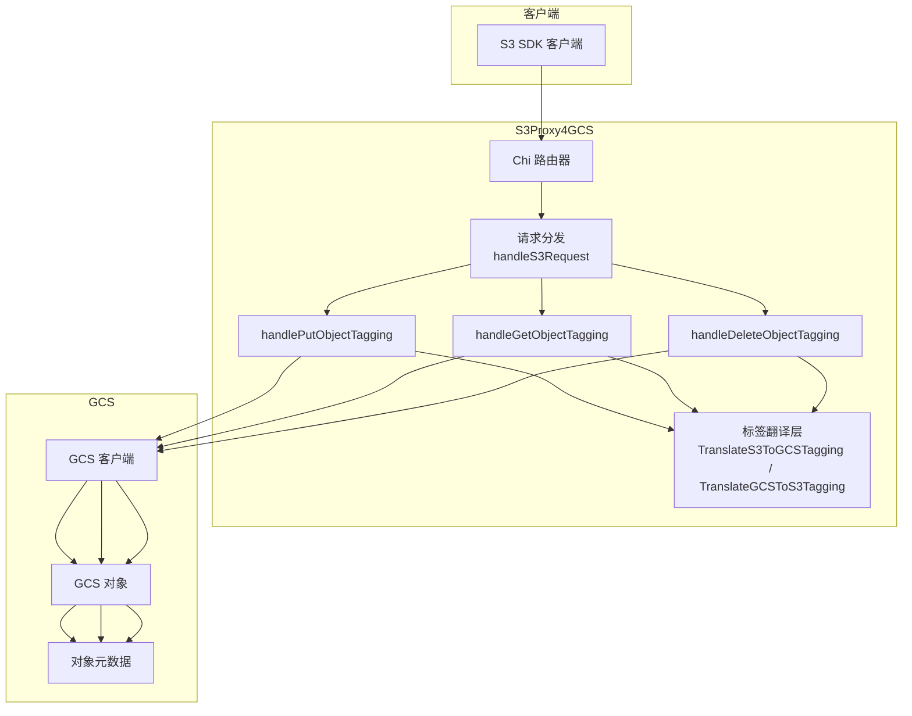
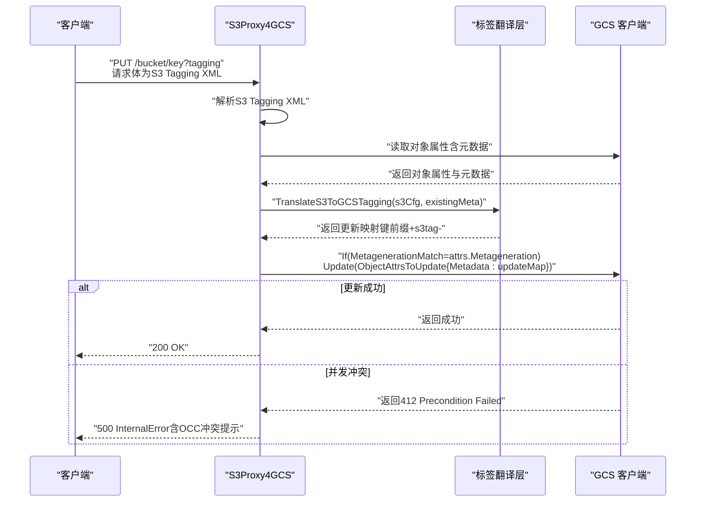
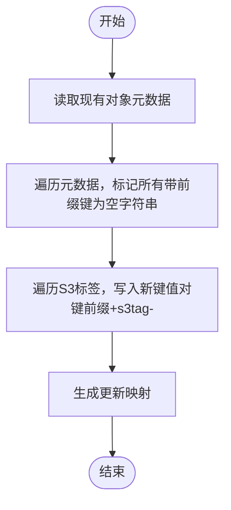
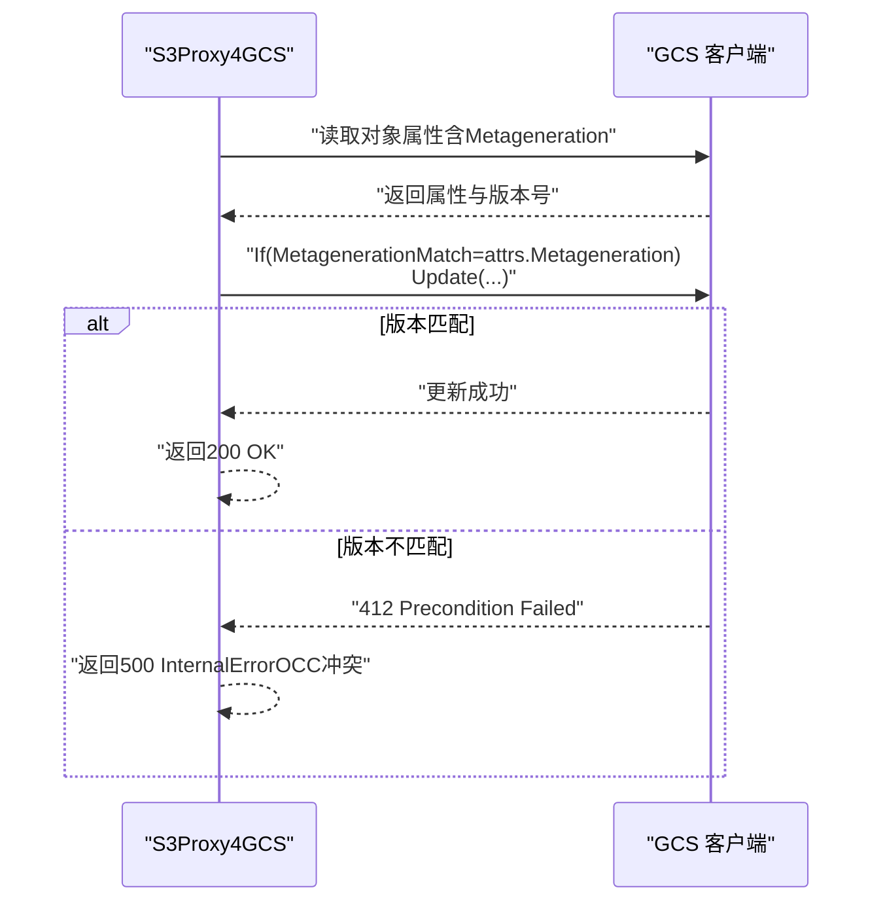
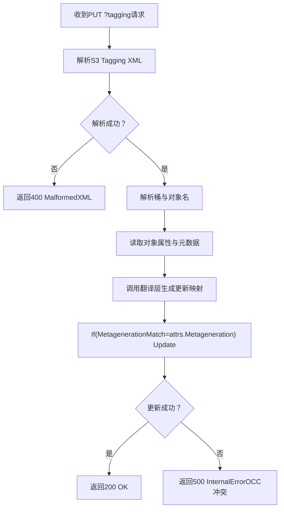
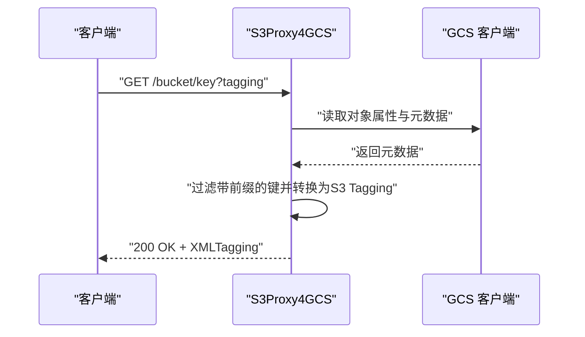
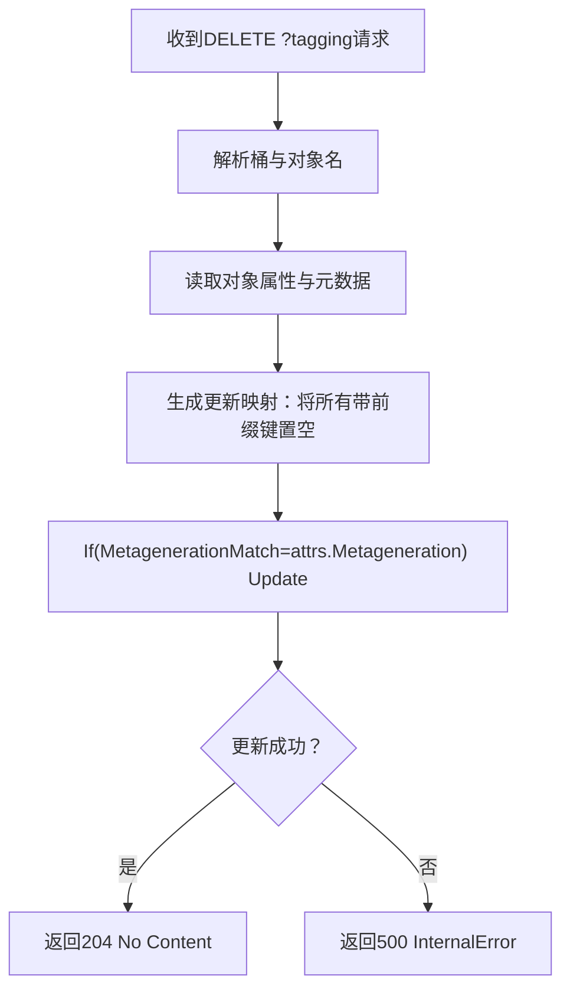
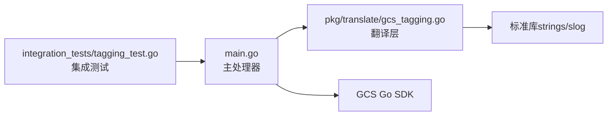

# 对象标签系统

<cite>
**本文档引用的文件**
- [main.go](file://main.go)
- [gcs_tagging.go](file://pkg/translate/gcs_tagging.go)
- [s3_tagging.go](file://pkg/translate/s3_tagging.go)
- [gcs_tagging_test.go](file://pkg/translate/gcs_tagging_test.go)
- [tagging_test.go](file://integration_tests/tagging_test.go)
- [settings.go](file://config/settings.go)
- [solutions.md](file://solutions.md)
- [test_cases.md](file://test_cases.md)
- [test_results.md](file://test_results.md)
</cite>

## 目录
1. [简介](#简介)
2. [项目结构](#项目结构)
3. [核心组件](#核心组件)
4. [架构总览](#架构总览)
5. [详细组件分析](#详细组件分析)
6. [依赖分析](#依赖分析)
7. [性能考虑](#性能考虑)
8. [故障排除指南](#故障排除指南)
9. [结论](#结论)
10. [附录](#附录)

## 简介
本文件面向S3Proxy4GCS的对象标签系统，系统性阐述标签到元数据的转换机制与乐观并发控制（Optimistic Concurrency Control, OCC）在对象标签写入中的应用。重点解析以下三个核心函数的实现逻辑：
- handlePutObjectTagging：接收S3 PutObjectTagging请求，将S3标签转换为GCS自定义元数据，并通过If-MetagenerationMatch进行乐观并发控制。
- handleGetObjectTagging：从GCS对象元数据中提取标签，返回标准S3 Tagging XML格式。
- handleDeleteObjectTagging：删除对象上所有以特定前缀标记的标签键值对，同样采用乐观并发控制。

同时，本文提供标签管理最佳实践、命名规范、批量操作建议以及并发冲突的解决方案与配置示例。

## 项目结构
S3Proxy4GCS采用“反向代理 + 特定子资源拦截”的架构设计。对象标签功能位于主入口路由中，针对URL查询参数为“tagging”的请求进行拦截与处理；标签到元数据的转换由翻译层完成；GCS客户端负责实际的读取与更新操作。

图表来源
- [main.go:254-338](file://main.go#L254-L338)
- [main.go:701-831](file://main.go#L701-L831)
- [gcs_tagging.go:10-47](file://pkg/translate/gcs_tagging.go#L10-L47)

章节来源
- [main.go:254-338](file://main.go#L254-L338)
- [main.go:701-831](file://main.go#L701-L831)
- [gcs_tagging.go:10-47](file://pkg/translate/gcs_tagging.go#L10-L47)

## 核心组件
- 标签模型与翻译层
  - S3标签模型：Tagging（顶层XML节点），内部包含Tag数组（每个Tag含Key与Value）。
  - 翻译层：将S3标签映射为GCS对象元数据键值对，键以固定前缀标识，便于后续提取与清理。
- 主处理器
  - handlePutObjectTagging：解析S3 XML，读取现有元数据，生成更新映射，使用If-MetagenerationMatch执行乐观并发控制。
  - handleGetObjectTagging：读取对象元数据，筛选出带前缀的键，转换为S3 Tagging XML。
  - handleDeleteObjectTagging：清空所有带前缀的元数据键，使用相同乐观并发控制策略。

章节来源
- [s3_tagging.go:5-9](file://pkg/translate/s3_tagging.go#L5-L9)
- [gcs_tagging.go:10-47](file://pkg/translate/gcs_tagging.go#L10-L47)
- [main.go:701-831](file://main.go#L701-L831)

## 架构总览
对象标签系统的关键流程如下：
- 请求识别：根据URL查询参数“tagging”判断是否为标签相关请求。
- 解析与路由：解析S3 Tagging XML，或直接解析路径获取桶与对象名。
- 读取与合并：读取现有对象元数据，构建更新映射（覆盖旧标签、设置新标签）。
- 乐观并发控制：基于对象的元数据版本号（Metageneration）进行条件更新，避免丢失更新。
- 响应生成：返回成功状态或标准S3错误XML。

图表来源
- [main.go:701-766](file://main.go#L701-L766)
- [gcs_tagging.go:10-35](file://pkg/translate/gcs_tagging.go#L10-L35)

## 详细组件分析

### 组件A：标签到元数据的转换机制
- 键前缀策略
  - 所有标签键均以固定前缀标识，便于在元数据中检索与清理。
  - 清理策略：先将所有带前缀的键设置为空字符串，再写入新的标签键值对，确保原子性与幂等性。
- 数据结构与复杂度
  - 遍历现有元数据以标记删除键：O(N)，N为现有元数据项数。
  - 写入新标签：O(M)，M为新标签数量。
  - 总体时间复杂度：O(N+M)；空间复杂度：O(N+M)用于更新映射。
- 字符集与兼容性
  - S3允许的字符集与GCS元数据允许的HTTP头字符存在差异，当前实现假设标准键名，必要时可扩展字符替换逻辑。

图表来源
- [gcs_tagging.go:10-35](file://pkg/translate/gcs_tagging.go#L10-L35)

章节来源
- [gcs_tagging.go:10-35](file://pkg/translate/gcs_tagging.go#L10-L35)
- [gcs_tagging_test.go:8-51](file://pkg/translate/gcs_tagging_test.go#L8-L51)

### 组件B：乐观并发控制（OCC）实现原理
- OCC策略
  - 在更新前读取对象的元数据版本号（Metageneration）。
  - 使用条件更新（IfMetagenerationMatch）提交修改，若版本不匹配则返回预条件失败。
- 冲突处理
  - 返回500 InternalError并提示OCC冲突，调用方需重试或回退。
  - 可结合指数退避策略降低竞争峰值。
- 与GCS交互
  - 通过GCS Go SDK的If条件与ObjectAttrsToUpdate实现原子更新。

图表来源
- [main.go:736-761](file://main.go#L736-L761)
- [main.go:819-827](file://main.go#L819-L827)

章节来源
- [main.go:736-761](file://main.go#L736-L761)
- [main.go:819-827](file://main.go#L819-L827)

### 组件C：handlePutObjectTagging 实现逻辑
- 步骤概览
  - 读取并解析S3 Tagging XML。
  - 解析URL路径获取桶与对象名。
  - 读取现有对象属性与元数据。
  - 调用翻译层生成更新映射。
  - 使用If-MetagenerationMatch执行条件更新。
  - 返回成功或错误响应。
- 错误处理
  - 解析失败返回400 MalformedXML。
  - 获取属性失败返回404。
  - OCC冲突返回500（含冲突提示）。

图表来源
- [main.go:701-766](file://main.go#L701-L766)

章节来源
- [main.go:701-766](file://main.go#L701-L766)

### 组件D：handleGetObjectTagging 实现逻辑
- 步骤概览
  - 解析URL路径获取桶与对象名。
  - 读取对象属性与元数据。
  - 过滤带前缀的键，转换为S3 Tagging模型。
  - 以XML形式返回标签集合。
- 注意事项
  - 若对象不存在或读取失败，返回404。
  - 若无标签，返回空TagSet。

图表来源
- [main.go:768-789](file://main.go#L768-L789)
- [gcs_tagging.go:37-47](file://pkg/translate/gcs_tagging.go#L37-L47)

章节来源
- [main.go:768-789](file://main.go#L768-L789)
- [gcs_tagging.go:37-47](file://pkg/translate/gcs_tagging.go#L37-L47)

### 组件E：handleDeleteObjectTagging 实现逻辑
- 步骤概览
  - 解析URL路径获取桶与对象名。
  - 读取对象属性与元数据。
  - 生成更新映射：将所有带前缀的键设置为空字符串以删除。
  - 使用If-MetagenerationMatch执行条件更新。
  - 返回204 No Content或错误。
- 幂等性
  - 多次删除同一组标签是幂等的，不会产生副作用。

图表来源
- [main.go:791-831](file://main.go#L791-L831)

章节来源
- [main.go:791-831](file://main.go#L791-L831)

### 组件F：If-Metageneration-Match 条件与并发冲突处理
- 条件使用
  - 在更新前读取attrs.Metageneration，并在条件中指定IfMetagenerationMatch。
  - 若其他进程已更新元数据导致版本变化，则更新被拒绝。
- 冲突策略
  - 返回500 InternalError，提示OCC冲突。
  - 建议调用方进行重试（指数退避）或回退到读-改-写循环。
- 与SDK行为一致性
  - GCS Go SDK返回412 Precondition Failed，代理将其映射为500并明确提示OCC冲突。

章节来源
- [main.go:752-761](file://main.go#L752-L761)
- [main.go:819-827](file://main.go#L819-L827)

## 依赖分析
- 模块耦合
  - 主处理器依赖翻译层进行标签到元数据的转换。
  - 主处理器依赖GCS客户端进行属性读取与条件更新。
  - 翻译层仅依赖标准库（strings、slog），内聚性高。
- 外部依赖
  - GCS Go SDK：用于对象属性读取与条件更新。
  - AWS SDK（集成测试）：验证S3 API兼容性。
- 潜在循环依赖
  - 当前模块间无循环导入，结构清晰。

图表来源
- [main.go:701-831](file://main.go#L701-L831)
- [gcs_tagging.go:10-47](file://pkg/translate/gcs_tagging.go#L10-L47)
- [tagging_test.go:16-97](file://integration_tests/tagging_test.go#L16-L97)

章节来源
- [main.go:701-831](file://main.go#L701-L831)
- [gcs_tagging.go:10-47](file://pkg/translate/gcs_tagging.go#L10-L47)
- [tagging_test.go:16-97](file://integration_tests/tagging_test.go#L16-L97)

## 性能考虑
- 时间复杂度
  - 单次标签更新为O(N+M)，适合小规模标签集。
- 空间复杂度
  - 更新映射大小为O(N+M)，内存占用可控。
- 并发与重试
  - OCC冲突时建议指数退避重试，避免热点竞争。
- 批量操作
  - 当前实现逐标签写入，批量场景建议在调用方聚合后再一次提交，减少往返次数。
- 日志与可观测性
  - 使用结构化日志记录关键事件，便于定位并发冲突与性能瓶颈。

## 故障排除指南
- 常见错误与排查
  - 400 MalformedXML：检查S3 Tagging XML格式是否正确。
  - 404 Not Found：确认对象是否存在且路径解析正确。
  - 500 InternalError（OCC冲突）：出现412 Precondition Failed，需重试或回退。
- 测试验证
  - 集成测试覆盖Put/Get标签的基本流程，验证OCC元数据更新。
- 配置检查
  - 确认代理运行模式（DryRun）与GCS凭据配置正确。

章节来源
- [main.go:701-766](file://main.go#L701-L766)
- [main.go:768-789](file://main.go#L768-L789)
- [main.go:791-831](file://main.go#L791-L831)
- [tagging_test.go:16-97](file://integration_tests/tagging_test.go#L16-L97)

## 结论
S3Proxy4GCS的对象标签系统通过“标签到元数据的转换 + 乐观并发控制”的组合，实现了与S3 API一致的对象标签能力。该方案具备以下优势：
- 透明兼容：无需修改客户端代码即可使用标准S3标签API。
- 原子安全：通过If-MetagenerationMatch避免并发冲突导致的数据丢失。
- 易于扩展：翻译层独立，便于未来支持更复杂的标签规则与字符集。

建议在生产环境中配合重试策略与监控告警，确保高并发下的稳定性与一致性。

## 附录

### 最佳实践与命名规范
- 命名规范
  - 标签键建议使用字母数字与常见符号（如“-”、“_”、“.”），避免特殊字符导致的兼容性问题。
  - 避免使用与系统保留前缀相同的键名，防止冲突。
- 幂等性
  - 删除标签操作是幂等的，可安全重复执行。
- 批量操作
  - 将多个标签变更在调用方聚合后一次性提交，减少往返与冲突概率。
- 重试策略
  - 针对OCC冲突采用指数退避重试，最大重试次数与等待时间需结合业务SLA设定。

### 并发冲突的解决方案
- OCC重试
  - 捕获500 InternalError并提示OCC冲突，执行指数退避重试。
- 回退策略
  - 若持续冲突，回退到“读-改-写”循环并在循环中再次应用OCC。
- 监控与告警
  - 记录冲突频率与重试耗时，及时发现热点对象与异常峰值。

### 标签配置示例（路径指引）
- PutObjectTagging
  - 示例请求体：S3 Tagging XML（包含多个Tag），通过PUT /bucket/key?tagging发送。
  - 参考路径：[tagging_test.go:62-83](file://integration_tests/tagging_test.go#L62-L83)
- GetObjectTagging
  - 示例响应：标准S3 Tagging XML。
  - 参考路径：[main.go:768-789](file://main.go#L768-L789)
- DeleteObjectTagging
  - 示例操作：删除对象上所有带前缀的标签键。
  - 参考路径：[main.go:791-831](file://main.go#L791-L831)

### 相关文档与测试
- 功能列表与测试结果
  - 对象标签功能已纳入测试用例与结果汇总。
  - 参考路径：[test_cases.md:48-51](file://test_cases.md#L48-L51)、[test_results.md:18](file://test_results.md#L18)