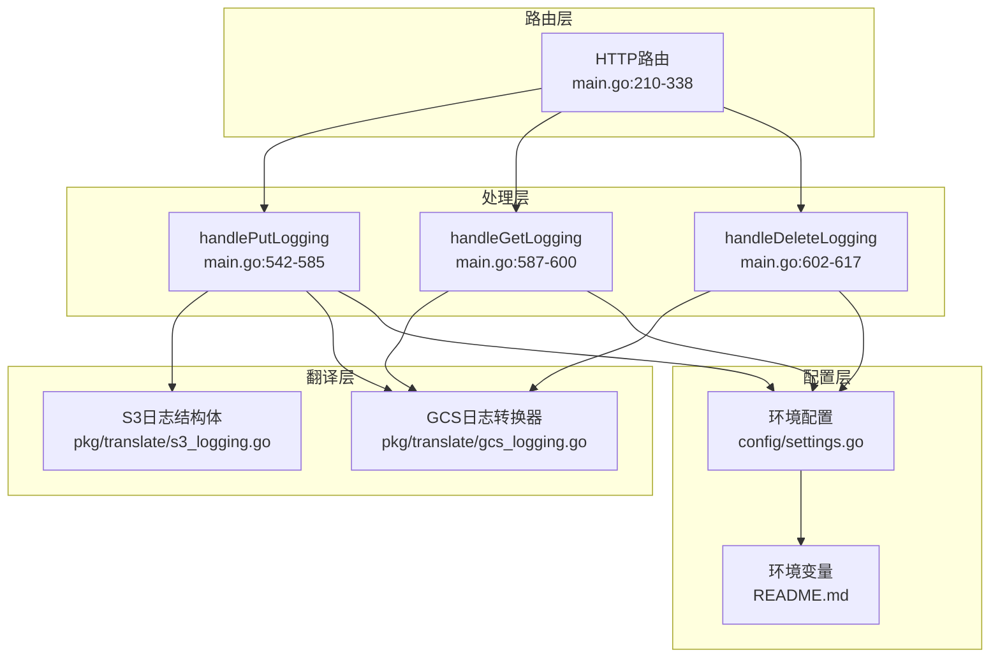
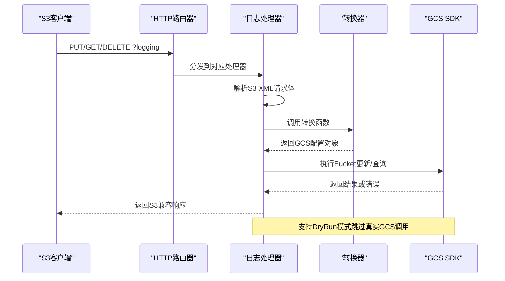
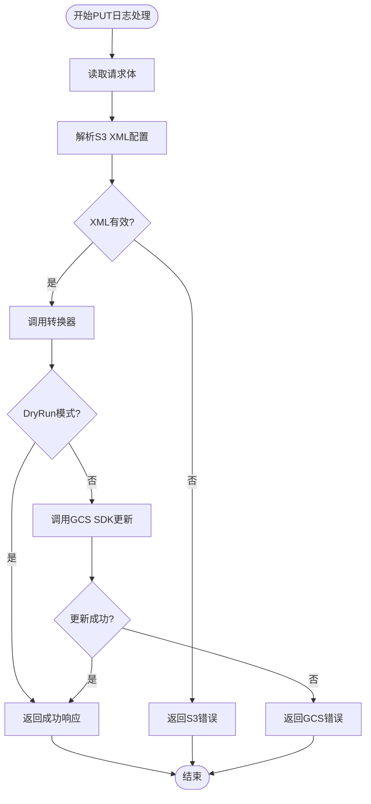
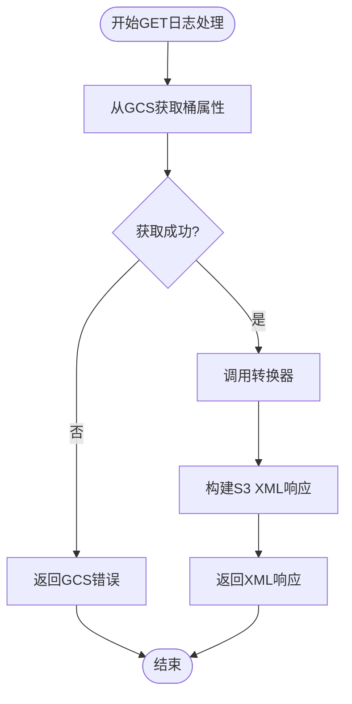
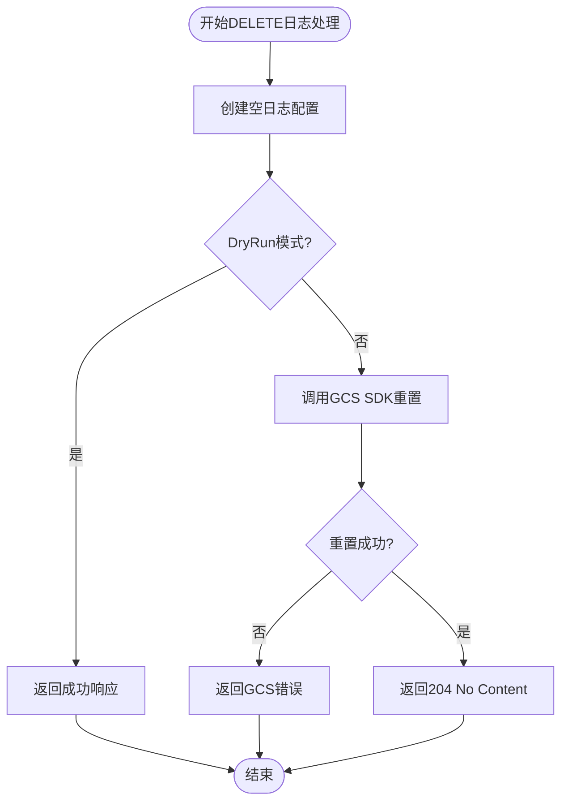
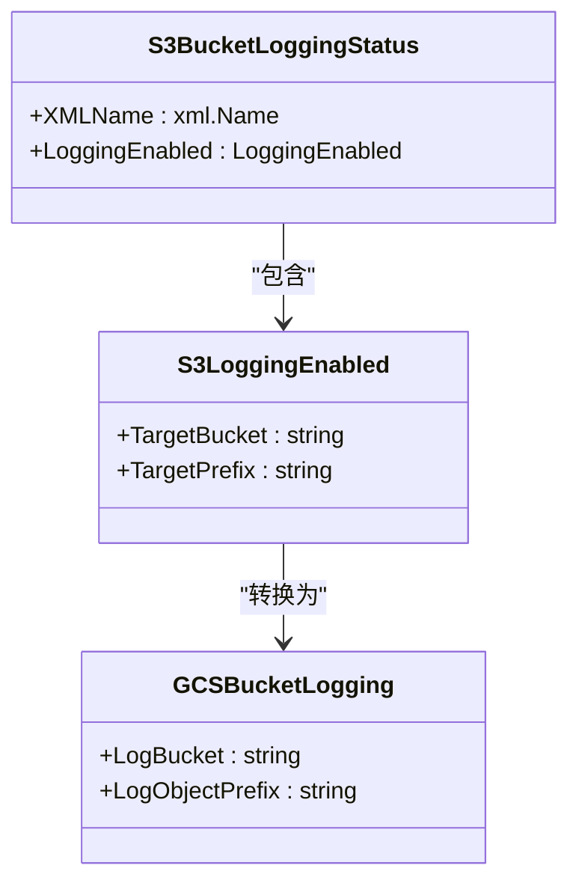
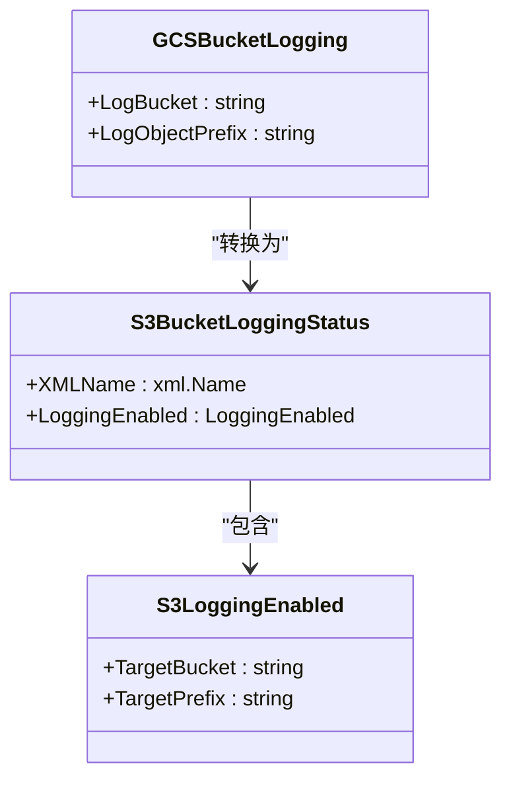
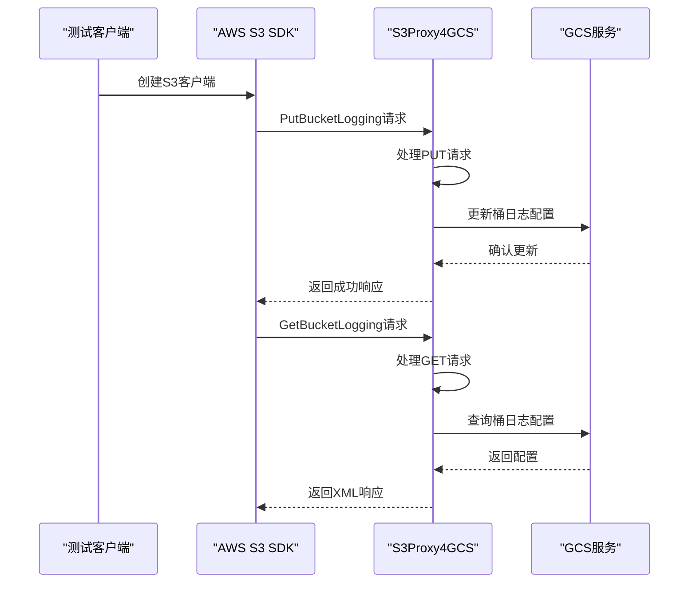
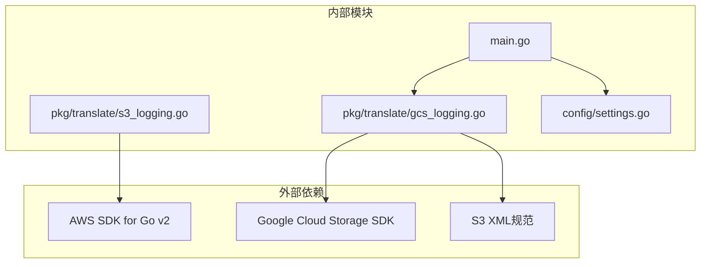

# 日志配置管理

<cite>
**本文档引用的文件**
- [main.go](file://main.go)
- [pkg/translate/gcs_logging.go](file://pkg/translate/gcs_logging.go)
- [pkg/translate/s3_logging.go](file://pkg/translate/s3_logging.go)
- [pkg/translate/gcs_logging_test.go](file://pkg/translate/gcs_logging_test.go)
- [pkg/translate/s3_logging_test.go](file://pkg/translate/s3_logging_test.go)
- [integration_tests/logging_test.go](file://integration_tests/logging_test.go)
- [config/settings.go](file://config/settings.go)
- [README.md](file://README.md)
</cite>

## 目录
1. [简介](#简介)
2. [项目结构](#项目结构)
3. [核心组件](#核心组件)
4. [架构概览](#架构概览)
5. [详细组件分析](#详细组件分析)
6. [依赖分析](#依赖分析)
7. [性能考虑](#性能考虑)
8. [故障排除指南](#故障排除指南)
9. [结论](#结论)
10. [附录](#附录)

## 简介
本文件为S3Proxy4GCS的日志配置管理功能提供全面技术文档。重点解释存储桶访问日志的配置与查询机制，涵盖S3 XML到GCS日志配置的转换过程，深入分析handlePutLogging、handleGetLogging和handleDeleteLogging的实现细节。同时说明日志格式规范、目标存储位置配置以及权限要求，并提供最佳实践、监控方案和故障排除指南，包含完整配置示例和验证方法。

## 项目结构
S3Proxy4GCS采用分层架构设计：
- 路由层：在主程序中定义HTTP路由，识别特定查询参数（如logging）进行拦截处理
- 处理层：针对不同操作（PUT/GET/DELETE）调用相应的处理器函数
- 翻译层：在pkg/translate包中实现S3与GCS之间的数据结构转换
- 配置层：通过环境变量控制代理行为（端口、目标桶、DryRun模式等）



**图表来源**
- [main.go:210-338](file://main.go#L210-L338)
- [main.go:542-617](file://main.go#L542-L617)
- [pkg/translate/s3_logging.go:1-17](file://pkg/translate/s3_logging.go#L1-L17)
- [pkg/translate/gcs_logging.go:1-36](file://pkg/translate/gcs_logging.go#L1-L36)
- [config/settings.go:1-65](file://config/settings.go#L1-L65)

**章节来源**
- [main.go:210-338](file://main.go#L210-L338)
- [README.md:140-157](file://README.md#L140-L157)

## 核心组件
日志配置管理功能由以下核心组件构成：

### S3日志配置数据模型
- **BucketLoggingStatus**：S3端点返回的XML根元素，包含可选的LoggingEnabled节点
- **LoggingEnabled**：实际启用的日志配置，包含目标存储桶和前缀信息

### GCS日志配置数据模型
- **storage.BucketLogging**：GCS SDK中的日志配置结构，包含LogBucket和LogObjectPrefix字段

### 转换器
- **TranslateS3ToGCSLogging**：将S3日志配置转换为GCS日志配置
- **TranslateGCSToS3Logging**：将GCS日志配置转换回S3 XML格式

**章节来源**
- [pkg/translate/s3_logging.go:5-16](file://pkg/translate/s3_logging.go#L5-L16)
- [pkg/translate/gcs_logging.go:9-35](file://pkg/translate/gcs_logging.go#L9-L35)

## 架构概览
日志配置管理采用请求拦截-解析-转换-执行的流水线架构：



**图表来源**
- [main.go:294-306](file://main.go#L294-L306)
- [main.go:542-617](file://main.go#L542-L617)
- [pkg/translate/gcs_logging.go:9-35](file://pkg/translate/gcs_logging.go#L9-L35)

## 详细组件分析

### 处理器实现分析

#### handlePutLogging - 日志配置设置
该处理器负责处理S3的PutBucketLogging操作：



**图表来源**
- [main.go:542-585](file://main.go#L542-L585)

#### handleGetLogging - 日志配置查询
该处理器负责处理S3的GetBucketLogging操作：



**图表来源**
- [main.go:587-600](file://main.go#L587-L600)

#### handleDeleteLogging - 日志配置删除
该处理器负责处理S3的DeleteBucketLogging操作：



**图表来源**
- [main.go:602-617](file://main.go#L602-L617)

### 数据转换器分析

#### S3到GCS转换器
转换器将S3的BucketLoggingStatus结构转换为GCS的storage.BucketLogging结构：



**图表来源**
- [pkg/translate/s3_logging.go:5-16](file://pkg/translate/s3_logging.go#L5-L16)
- [pkg/translate/gcs_logging.go:9-21](file://pkg/translate/gcs_logging.go#L9-L21)

#### GCS到S3转换器
转换器将GCS的storage.BucketLogging结构转换回S3的BucketLoggingStatus结构：



**图表来源**
- [pkg/translate/gcs_logging.go:23-35](file://pkg/translate/gcs_logging.go#L23-L35)
- [pkg/translate/s3_logging.go:5-16](file://pkg/translate/s3_logging.go#L5-L16)

**章节来源**
- [main.go:542-617](file://main.go#L542-L617)
- [pkg/translate/gcs_logging.go:9-35](file://pkg/translate/gcs_logging.go#L9-L35)

### 集成测试分析
集成测试展示了完整的日志配置工作流程：



**图表来源**
- [integration_tests/logging_test.go:18-98](file://integration_tests/logging_test.go#L18-L98)

**章节来源**
- [integration_tests/logging_test.go:18-98](file://integration_tests/logging_test.go#L18-L98)

## 依赖分析
日志配置管理功能的依赖关系如下：



**图表来源**
- [main.go:1-30](file://main.go#L1-L30)
- [pkg/translate/gcs_logging.go:1-7](file://pkg/translate/gcs_logging.go#L1-L7)
- [pkg/translate/s3_logging.go:1-3](file://pkg/translate/s3_logging.go#L1-L3)

**章节来源**
- [main.go:1-30](file://main.go#L1-L30)
- [pkg/translate/gcs_logging.go:1-7](file://pkg/translate/gcs_logging.go#L1-L7)
- [pkg/translate/s3_logging.go:1-3](file://pkg/translate/s3_logging.go#L1-L3)

## 性能考虑
日志配置管理功能在性能方面的特点：

### 连接池优化
- 使用经过调优的HTTP传输层，支持最大空闲连接数和每主机空闲连接数
- 启用HTTP/2以提高多路复用效率
- 设置合理的超时时间防止连接挂起

### 内存使用
- XML解析仅在必要时进行，避免不必要的内存分配
- 转换器直接映射字段，减少中间结构体的创建
- 错误处理路径快速返回，避免额外的计算开销

### 并发处理
- 处理器函数独立运行，互不阻塞
- GCS API调用使用异步模式，充分利用连接池
- 日志记录采用结构化JSON格式，便于日志聚合系统处理

## 故障排除指南

### 常见错误类型及解决方案

#### S3 XML解析错误
**症状**：返回MalformedXML错误
**原因**：请求体不符合S3 XML规范
**解决方案**：
- 检查XML命名空间是否正确
- 确认TargetBucket和TargetPrefix字段存在
- 验证XML格式的完整性

#### GCS API调用失败
**症状**：返回GCS API错误
**原因**：
- 缺少必要的GCS凭据
- 目标存储桶不存在
- 权限不足

**解决方案**：
- 确保设置了正确的JSON_KEY环境变量
- 验证目标存储桶名称的正确性
- 检查服务账号的适当权限

#### DryRun模式问题
**症状**：所有操作都返回成功但没有实际效果
**原因**：DRY_RUN环境变量设置为true
**解决方案**：
- 将DRY_RUN设置为false以启用真实GCS调用
- 或者在开发环境中继续使用DryRun模式

### 调试技巧
1. **启用调试日志**：设置DEBUG_LOGGING=true以获取详细的结构化日志
2. **检查环境变量**：确认所有必需的配置项都已正确设置
3. **验证网络连接**：确保能够访问GCS端点
4. **查看转换结果**：在转换器中添加日志输出以验证数据映射

**章节来源**
- [main.go:553-556](file://main.go#L553-L556)
- [main.go:577-579](file://main.go#L577-L579)
- [config/settings.go:36-56](file://config/settings.go#L36-L56)

## 结论
S3Proxy4GCS的日志配置管理功能提供了完整的S3到GCS日志配置转换能力。通过清晰的分层架构、完善的错误处理机制和灵活的配置选项，该功能能够满足生产环境的需求。关键优势包括：

1. **完整的生命周期支持**：支持日志配置的创建、查询和删除操作
2. **双向转换能力**：能够准确地在S3 XML和GCS配置之间进行转换
3. **灵活的部署模式**：支持DryRun模式用于开发和测试
4. **健壮的错误处理**：提供符合S3规范的错误响应
5. **高性能设计**：优化的连接池和并发处理能力

建议在生产环境中结合适当的监控和告警机制，定期验证日志配置的有效性，并建立完善的故障恢复流程。

## 附录

### 配置示例

#### 环境变量配置
```bash
# 基础配置
PORT=8080
GCP_PROJECT_ID=your-project-id
TARGET_BUCKET=your-target-bucket

# 认证配置
JSON_KEY=/path/to/service-account-key.json
AWS_ACCESS_KEY_ID=your-access-key
AWS_SECRET_ACCESS_KEY=your-secret-key

# 行为配置
DRY_RUN=false
DEBUG_LOGGING=true
MAX_IDLE_CONNS=1000
MAX_IDLE_CONNS_PER_HOST=1000
```

#### S3日志配置XML示例
```xml
<BucketLoggingStatus xmlns="http://doc.s3.amazonaws.com/2006-03-01/">
  <LoggingEnabled>
    <TargetBucket>log-bucket</TargetBucket>
    <TargetPrefix>access-logs/</TargetPrefix>
  </LoggingEnabled>
</BucketLoggingStatus>
```

### 验证方法

#### 单元测试验证
```bash
cd pkg/translate
go test -run TestTranslateS3ToGCSLogging -v
```

#### 集成测试验证
```bash
cd integration_tests
go test -run TestPutLoggingWithAWSSDK -v
```

#### 手动验证步骤
1. 启动代理服务器
2. 使用AWS CLI或SDK发送日志配置请求
3. 验证GCS存储桶属性中的日志配置
4. 测试日志生成和存储

### 最佳实践

#### 安全配置
- 使用专用的服务账号进行日志写入
- 限制日志存储桶的访问权限
- 定期轮换访问密钥

#### 性能优化
- 合理设置连接池参数
- 使用适当的日志前缀组织日志文件
- 定期清理过期的日志文件

#### 监控建议
- 监控GCS API调用的错误率
- 设置日志配置变更的审计日志
- 建立日志可用性的告警机制

**章节来源**
- [README.md:18-29](file://README.md#L18-L29)
- [pkg/translate/gcs_logging_test.go:8-54](file://pkg/translate/gcs_logging_test.go#L8-L54)
- [integration_tests/logging_test.go:70-98](file://integration_tests/logging_test.go#L70-L98)