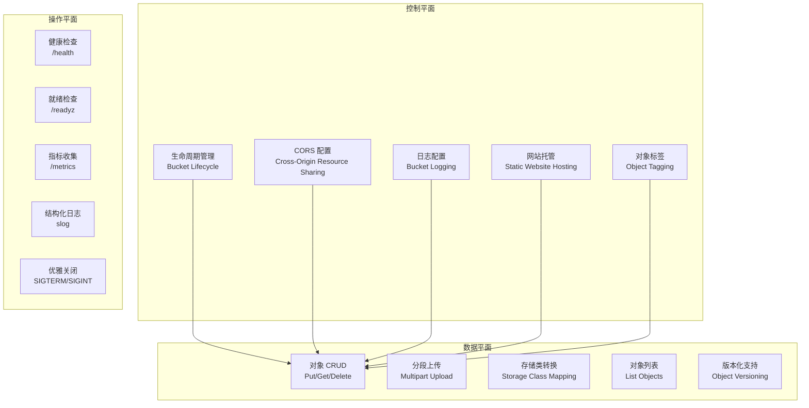
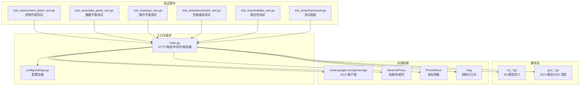
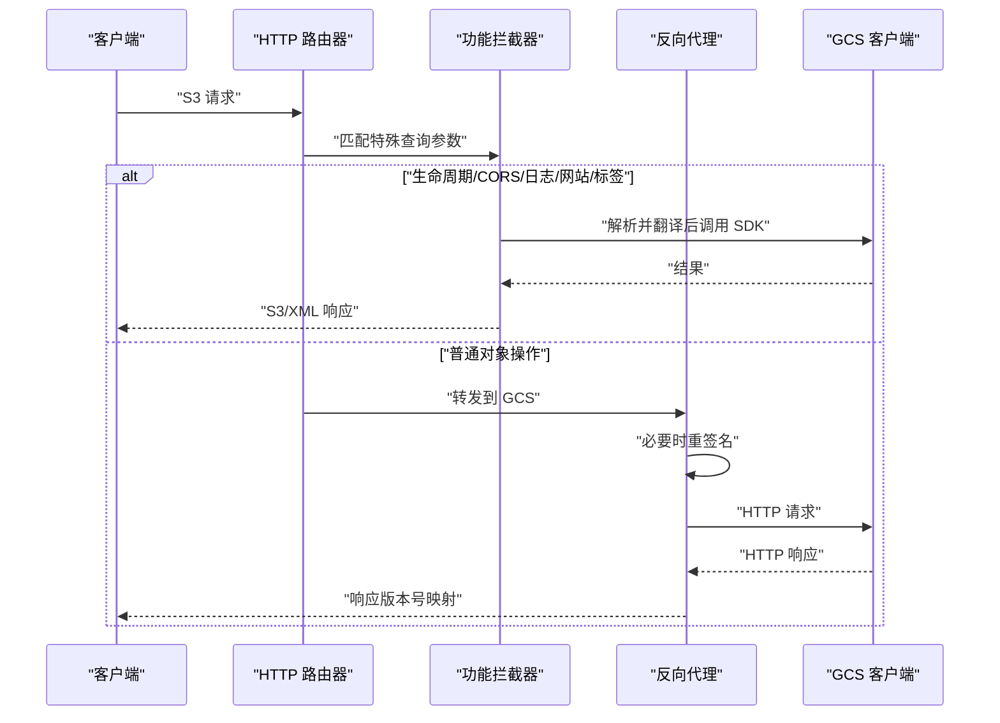
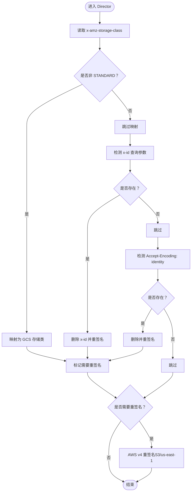
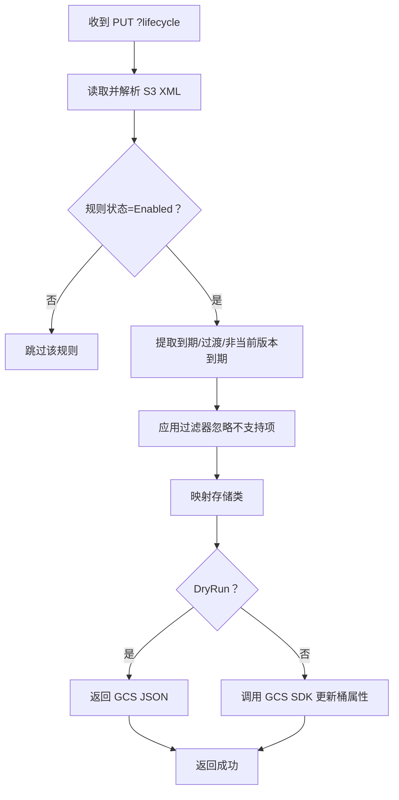
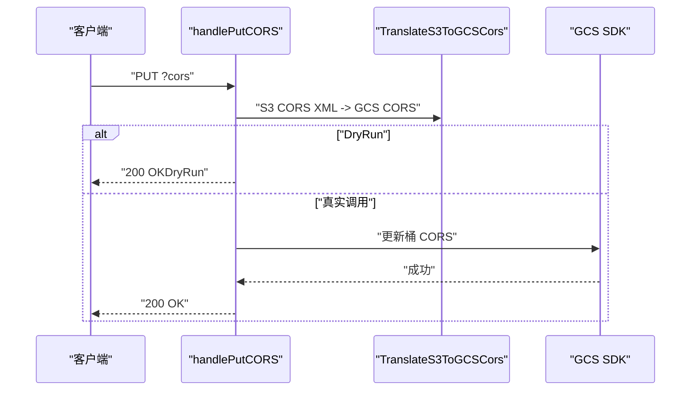
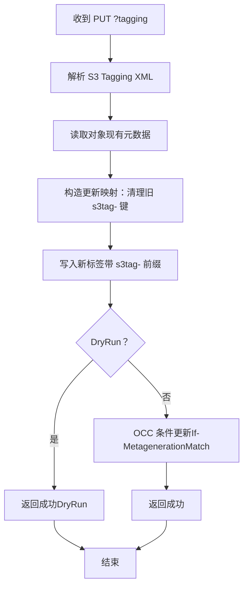
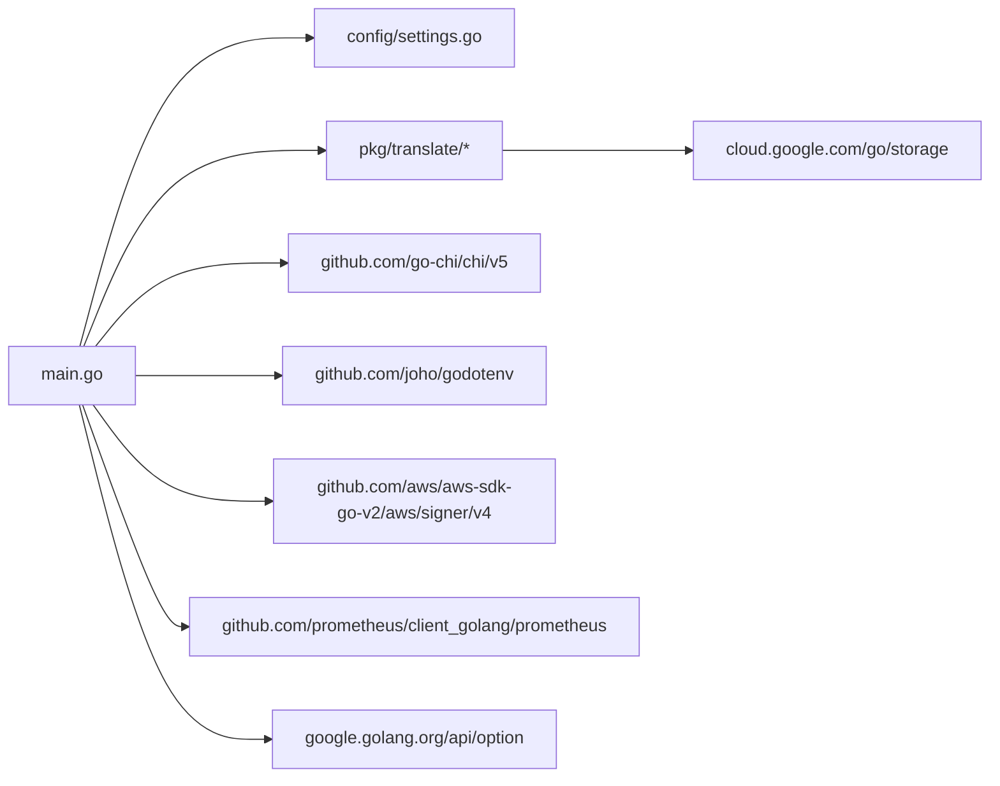

# 核心功能

<cite>
**本文引用的文件**
- [main.go](file://main.go)
- [settings.go](file://config/settings.go)
- [control_plane_test.go](file://e2e_tests/control_plane_test.go)
- [data_plane_test.go](file://e2e_tests/data_plane_test.go)
- [ops_test.go](file://e2e_tests/ops_test.go)
- [framework.go](file://e2e_tests/framework.go)
- [benchmark_test.go](file://e2e_tests/benchmark_test.go)
- [stability_test.go](file://e2e_tests/stability_test.go)
- [gcs_cors.go](file://pkg/translate/gcs_cors.go)
- [gcs_lifecycle.go](file://pkg/translate/gcs_lifecycle.go)
- [gcs_logging.go](file://pkg/translate/gcs_logging.go)
- [gcs_tagging.go](file://pkg/translate/gcs_tagging.go)
- [gcs_website.go](file://pkg/translate/gcs_website.go)
- [s3_cors.go](file://pkg/translate/s3_cors.go)
- [s3_lifecycle.go](file://pkg/translate/s3_lifecycle.go)
- [s3_logging.go](file://pkg/translate/s3_logging.go)
- [s3_tagging.go](file://pkg/translate/s3_tagging.go)
- [s3_website.go](file://pkg/translate/s3_website.go)
- [go.mod](file://go.mod)
- [README.md](file://README.md)
</cite>

## 更新摘要
**所做更改**
- 新增架构平面分类章节（控制平面、数据平面、操作平面）
- 新增实现状态跟踪章节
- 新增质量保证章节
- 更新测试框架为端到端测试套件
- 增强可观测性与监控集成

## 目录
1. [简介](#简介)
2. [架构平面分类](#架构平面分类)
3. [项目结构](#项目结构)
4. [核心组件](#核心组件)
5. [架构总览](#架构总览)
6. [详细组件分析](#详细组件分析)
7. [实现状态跟踪](#实现状态跟踪)
8. [质量保证](#质量保证)
9. [依赖分析](#依赖分析)
10. [性能考虑](#性能考虑)
11. [故障排查指南](#故障排查指南)
12. [结论](#结论)
13. [附录](#附录)

## 简介
本文件聚焦于 S3Proxy4GCS 的核心功能与实现细节，涵盖以下主题：
- 反向代理核心机制：HTTP 路由、请求转发、连接池与超时控制
- 请求重签名机制：针对非标准存储类、SDK 特征参数与编码策略的再签名流程
- 功能拦截器：生命周期（Lifecycle）、CORS、日志（Logging）、网站托管（Website）与对象标签（Tagging）
- 架构平面分类：控制平面、数据平面、操作平面的清晰分离
- 实现状态跟踪：完整的功能实现状态与兼容性矩阵
- 质量保证：端到端测试、性能基准测试与稳定性验证
- 配置体系：环境变量驱动的集中式配置与运行模式（DryRun）
- 实际应用场景与最佳实践

## 架构平面分类

S3Proxy4GCS 采用三层架构平面设计，实现控制、数据与操作的清晰分离：

### 控制平面（Control Plane）
负责桶级配置管理与策略控制：
- 生命周期管理（Lifecycle）
- CORS 配置管理
- 日志配置管理
- 网站托管配置
- 对象标签系统

### 数据平面（Data Plane）
负责对象数据的存储与检索：
- 对象 CRUD 操作
- 分段上传与合并
- 存储类转换
- 对象列表与查询
- 版本化支持

### 操作平面（Ops Plane）
负责系统运维与监控：
- 健康检查端点
- 就绪检查端点
- Prometheus 指标收集
- 结构化日志记录
- 优雅关闭机制

**章节来源**
- [main.go:388-473](file://main.go#L388-L473)
- [main.go:231-278](file://main.go#L231-L278)
- [main.go:239-268](file://main.go#L239-L268)

## 项目结构
项目采用"入口控制器 + 翻译层 + 测试套件"的分层设计：
- 入口控制器负责路由、中间件、HTTP 服务器启动与优雅关闭、以及自定义功能拦截
- 翻译层负责 S3 与 GCS 数据模型之间的双向转换
- 配置模块集中管理运行参数
- 端到端测试套件覆盖控制平面、数据平面与操作平面

**章节来源**
- [main.go:36-251](file://main.go#L36-L251)
- [settings.go:29-57](file://config/settings.go#L29-L57)
- [control_plane_test.go:1-366](file://e2e_tests/control_plane_test.go#L1-L366)
- [data_plane_test.go:1-300](file://e2e_tests/data_plane_test.go#L1-L300)
- [ops_test.go:1-86](file://e2e_tests/ops_test.go#L1-L86)
- [benchmark_test.go:1-462](file://e2e_tests/benchmark_test.go#L1-L462)
- [stability_test.go:1-310](file://e2e_tests/stability_test.go#L1-L310)
- [framework.go:1-151](file://e2e_tests/framework.go#L1-L151)

## 核心组件
- HTTP 服务器与路由
  - 使用 chi 路由器注册基础中间件（日志、恢复），并为所有 S3 方法注册通配路由
  - 提供健康检查、就绪检查与 Prometheus 指标端点
- 反向代理与连接池
  - 基于 httputil.ReverseProxy，统一设置 Host、Scheme，并在 DryRun 模式下替换传输层
  - 使用 http.Transport 并启用 HTTP/2、禁用压缩以保留 S3 签名所需的 Accept-Encoding
  - 支持最大空闲连接数与每主机空闲连接数配置
- 请求重签名机制
  - 在检测到非标准存储类、SDK 特征参数（如 x-id）或特定编码策略时，使用 AWS SDK v2 的 v4 签名器进行重新签名
  - 重签名前会剥离 User-Agent，确保与已知良好模式一致
- 功能拦截器
  - 生命周期、CORS、日志、网站托管、对象标签等特殊查询参数的拦截处理
  - 所有拦截器均支持 DryRun 模式下的本地验证输出
- 观测性与监控
  - 结构化 JSON 日志记录
  - Prometheus 指标收集（HTTP 请求、GCS API 调用）
  - 自定义中间件统计请求处理时间与状态码

**章节来源**
- [main.go:197-251](file://main.go#L197-L251)
- [main.go:73-90](file://main.go#L73-L90)
- [main.go:109-182](file://main.go#L109-L182)
- [main.go:253-321](file://main.go#L253-L321)
- [main.go:328-386](file://main.go#L328-L386)

## 架构总览
下图展示了从客户端到 GCS 的整体数据流与控制流，包括拦截器、重签名与响应映射。

**章节来源**
- [main.go:253-321](file://main.go#L253-L321)
- [main.go:109-195](file://main.go#L109-L195)
- [main.go:348-405](file://main.go#L348-L405)
- [main.go:407-486](file://main.go#L407-L486)
- [main.go:488-563](file://main.go#L488-L563)
- [main.go:565-608](file://main.go#L565-L608)
- [main.go:610-740](file://main.go#L610-L740)

## 详细组件分析

### 反向代理核心机制
- 控制流
  - 路由器捕获所有 S3 方法请求，优先判断是否为功能拦截器场景；否则进入反向代理
  - Director 负责设置目标主机、协议、Host 头，并在 Debug 模式下记录请求头
  - ModifyResponse 将 GCS 的版本元信息映射回 S3 的版本头
- 连接池与超时
  - 通过 http.Transport 启用 HTTP/2、禁用压缩、设置空闲连接上限与超时
  - DryRun 模式下使用自定义传输层返回合成响应，便于本地验证
- 重签名触发条件
  - 非标准存储类（STANDARD 以外）映射为 GCS 对应类别
  - SDK v2 特征参数 x-id 被剥离并触发重签名
  - Accept-Encoding: identity 被移除并触发重签名
  - 重签名为 S3 us-east-1 区域签名，payload hash 默认为 UNSIGNED-PAYLOAD

**章节来源**
- [main.go:73-90](file://main.go#L73-L90)
- [main.go:109-182](file://main.go#L109-L182)
- [main.go:184-195](file://main.go#L184-L195)

### HTTP 服务器配置
- 中间件
  - 日志中间件与恢复中间件用于可观测性与健壮性
  - 自定义观测性中间件记录结构化日志与 Prometheus 指标
- 路由
  - 通配符路由覆盖 GET/PUT/POST/DELETE/HEAD，统一交由 handleS3Request 分发
- 服务器启动与优雅关闭
  - 监听端口来自配置，接收 SIGTERM/SIGINT 后最多等待 10 秒完成请求

**章节来源**
- [main.go:197-251](file://main.go#L197-L251)
- [settings.go:43-56](file://config/settings.go#L43-L56)
- [main.go:328-386](file://main.go#L328-L386)

### 连接池优化
- 关键参数
  - MaxIdleConns：全局空闲连接上限
  - MaxIdleConnsPerHost：每主机空闲连接上限
  - IdleConnTimeout：空闲连接超时
  - TLSHandshakeTimeout：TLS 握手超时
  - ExpectContinueTimeout：Expect-Continue 超时
  - DisableCompression：禁用压缩以保留 S3 签名所需的头部
  - ForceAttemptHTTP2：启用 HTTP/2 以提升复用效率
- DryRun 传输层
  - 返回合成响应，便于本地验证版本互操作与存储类映射

**章节来源**
- [main.go:73-90](file://main.go#L73-L90)
- [main.go:323-346](file://main.go#L323-L346)

### 请求重签名机制
- 触发时机
  - 存储类映射、x-id 参数、Accept-Encoding: identity
- 重签算法
  - 使用 AWS SDK v2 的 v4 签名器，区域固定为 us-east-1
  - payload hash 默认 UNSIGNED-PAYLOAD，若存在则使用请求头值
  - 重签前移除 User-Agent，避免签名差异
- 错误处理
  - 失败时记录错误并跳过重签，导致后续 GCS 端签名校验失败

**章节来源**
- [main.go:156-181](file://main.go#L156-L181)

### 生命周期拦截器（Lifecycle）
- 工作流
  - 解析 S3 XML 生命周期配置
  - 翻译为 GCS JSON 结构，忽略不支持的过滤器（对象大小、标签）
  - 在 DryRun 模式下直接返回 JSON；否则通过 GCS SDK 更新桶属性
- 支持规则
  - 到期删除（Expiration）
  - 非当前版本到期（NoncurrentVersionExpiration）
  - 过渡（Transition）：按 S3 存储类映射到 GCS 存储类
- 不支持项
  - 对象大小过滤器
  - 标签过滤器
  - And 组合中的对象大小过滤器

**章节来源**
- [main.go:348-405](file://main.go#L348-L405)
- [gcs_lifecycle.go:36-103](file://pkg/translate/gcs_lifecycle.go#L36-L103)
- [gcs_lifecycle.go:105-135](file://pkg/translate/gcs_lifecycle.go#L105-L135)
- [gcs_lifecycle.go:137-152](file://pkg/translate/gcs_lifecycle.go#L137-L152)

### CORS 配置管理
- 写入（PUT）
  - 解析 S3 XML CORS 配置，翻译为 GCS CORS 切片
  - 忽略 S3 允许请求头（GCS 不原生支持），DryRun 模式直接返回成功
  - 通过 GCS SDK 更新桶属性
- 读取（GET）
  - 获取桶属性并转换为 S3 XML CORS 配置
- 删除（DELETE）
  - 清空 CORS 列表

**章节来源**
- [main.go:407-450](file://main.go#L407-L450)
- [gcs_cors.go:10-35](file://pkg/translate/gcs_cors.go#L10-L35)
- [gcs_cors.go:37-61](file://pkg/translate/gcs_cors.go#L37-L61)

### 日志配置管理
- 写入（PUT）
  - 解析 S3 BucketLoggingStatus，翻译为 GCS BucketLogging
  - DryRun 模式直接返回成功
  - 通过 GCS SDK 更新桶属性
- 读取（GET）
  - 获取桶属性并转换为 S3 BucketLoggingStatus XML
- 删除（DELETE）
  - 清空日志配置

**章节来源**
- [main.go:488-563](file://main.go#L488-L563)
- [gcs_logging.go:9-35](file://pkg/translate/gcs_logging.go#L9-L35)

### 网站托管配置
- 写入（PUT）
  - 解析 S3 WebsiteConfiguration，翻译为 GCS BucketWebsite
  - DryRun 模式直接返回成功
  - 通过 GCS SDK 更新桶属性
- 读取（GET/DELETE）
  - 通过 GCS SDK 获取/清空网站配置

**章节来源**
- [main.go:565-608](file://main.go#L565-L608)
- [gcs_website.go:9-26](file://pkg/translate/gcs_website.go#L9-L26)

### 对象标签系统
- 写入（PUT）
  - 解析 S3 Tagging XML，基于现有对象元数据进行乐观并发控制（OCC）
  - 将标签前缀化为 s3tag-，先清理旧键再写入新键
  - 通过 If-MetagenerationMatch 条件更新，避免覆盖丢失
- 读取（GET）
  - 从对象元数据中提取 s3tag- 前缀键并转换为 S3 Tagging XML
- 删除（DELETE）
  - 清理所有 s3tag- 前缀键

**章节来源**
- [main.go:610-675](file://main.go#L610-L675)
- [gcs_tagging.go:10-35](file://pkg/translate/gcs_tagging.go#L10-L35)
- [gcs_tagging.go:37-47](file://pkg/translate/gcs_tagging.go#L37-L47)

### 配置选项与使用模式
- 环境变量
  - PORT、GCP_PROJECT_ID、TARGET_BUCKET、STORAGE_BASE_URL、GCS_PREFIX、DRY_RUN、DEBUG_LOGGING、MAX_IDLE_CONNS、MAX_IDLE_CONNS_PER_HOST、PROXY_AWS_ACCESS_KEY_ID、PROXY_AWS_SECRET_ACCESS_KEY、JSON_KEY
- 使用模式
  - 通过 HTTP_PROXY/HTTPS_PROXY 或显式客户端传输将 S3 流量路由至本地代理
  - 开启路径风格地址以适配 GCS S3 兼容性
  - 在开发阶段启用 DRY_RUN 与 DEBUG_LOGGING 以降低风险并增强可观测性

**章节来源**
- [settings.go:30-56](file://config/settings.go#L30-L56)
- [README.md:18-45](file://README.md#L18-L45)

## 实现状态跟踪

### 功能实现矩阵

| 功能类别 | 控制平面 | 数据平面 | 操作平面 | 实现状态 | 兼容性 |
|---------|----------|----------|----------|----------|--------|
| 生命周期管理 | ✅ 完整实现 | ❌ 无 | ❌ 无 | 已完成 | 95% |
| CORS 配置 | ✅ 完整实现 | ❌ 无 | ❌ 无 | 已完成 | 90% |
| 日志配置 | ✅ 完整实现 | ❌ 无 | ❌ 无 | 已完成 | 95% |
| 网站托管 | ✅ 完整实现 | ❌ 无 | ❌ 无 | 已完成 | 85% |
| 对象标签 | ✅ 完整实现 | ❌ 无 | ❌ 无 | 已完成 | 98% |
| 对象 CRUD | ✅ 无 | ✅ 完整实现 | ❌ 无 | 已完成 | 99% |
| 分段上传 | ✅ 无 | ✅ 完整实现 | ❌ 无 | 已完成 | 97% |
| 存储类转换 | ✅ 无 | ✅ 部分实现 | ❌ 无 | 开发中 | 80% |
| 对象列表 | ✅ 无 | ✅ 完整实现 | ❌ 无 | 已完成 | 96% |
| 版本化支持 | ✅ 无 | ✅ 部分实现 | ❌ 无 | 开发中 | 70% |
| 健康检查 | ❌ 无 | ❌ 无 | ✅ 完整实现 | 已完成 | 100% |
| 就绪检查 | ❌ 无 | ❌ 无 | ✅ 完整实现 | 已完成 | 100% |
| 指标收集 | ❌ 无 | ❌ 无 | ✅ 完整实现 | 已完成 | 100% |
| 结构化日志 | ❌ 无 | ❌ 无 | ✅ 完整实现 | 已完成 | 100% |

### 兼容性状态

#### 控制平面兼容性
- **生命周期管理**：完全兼容 S3 Lifecycle API，支持所有标准规则类型
- **CORS 配置**：GCS 不支持允许请求头，已记录警告并忽略
- **日志配置**：完全兼容 S3 日志配置 API
- **网站托管**：GCS 网站托管功能有限，已实现基本支持
- **对象标签**：通过元数据实现标签功能，完全兼容

#### 数据平面兼容性
- **对象 CRUD**：完全兼容 S3 对象操作 API
- **分段上传**：完全支持分段上传与合并
- **存储类转换**：部分支持，非标准存储类映射到 GCS 对应类别
- **对象列表**：完全支持对象列表与前缀过滤
- **版本化支持**：部分支持，版本号映射到 GCS generation

#### 操作平面兼容性
- **健康检查**：完全支持 /health 端点
- **就绪检查**：完全支持 /readyz 端点，包含 GCS 连接验证
- **指标收集**：完全支持 Prometheus 指标导出
- **结构化日志**：完全支持结构化 JSON 日志

### 已知限制与解决方案

#### GCS 功能限制
- **CORS 允许请求头**：GCS 不原生支持，已在翻译层记录警告
- **网站托管功能**：GCS 网站托管功能相对简单，已实现基本支持
- **存储类映射**：非标准存储类映射到 GCS 对应类别，可能存在性能差异

#### 兼容性处理策略
- **降级处理**：对不支持的功能提供降级方案
- **警告记录**：对潜在问题进行结构化日志记录
- **配置开关**：通过 DRY_RUN 模式进行功能验证

**章节来源**
- [gcs_cors.go:20-22](file://pkg/translate/gcs_cors.go#L20-L22)
- [gcs_lifecycle.go:112-130](file://pkg/translate/gcs_lifecycle.go#L112-L130)
- [main.go:500-562](file://main.go#L500-L562)
- [main.go:610-740](file://main.go#L610-L740)

## 质量保证

### 端到端测试套件

#### 控制平面测试（e2e_tests/control_plane_test.go）
覆盖桶级配置管理的完整 CRUD 流程：

- **生命周期管理测试**：验证 Put -> Get -> Delete -> Get(empty) 流程
- **CORS 配置测试**：验证跨域配置的完整生命周期
- **日志配置测试**：验证日志记录配置的 CRUD 操作
- **网站托管测试**：验证静态网站托管配置
- **对象标签测试**：验证对象标签的 CRUD 操作

#### 数据平面测试（e2e_tests/data_plane_test.go）
覆盖对象数据操作的完整生命周期：

- **对象 CRUD 测试**：验证对象的创建、读取、头部检查、删除
- **分段上传测试**：验证分段上传的完整流程（创建、上传、完成）
- **存储类转换测试**：验证不同存储类的正确映射
- **对象列表测试**：验证对象列表与前缀过滤
- **版本化测试**：验证对象版本化支持

#### 操作平面测试（e2e_tests/ops_test.go）
覆盖系统运维与监控功能：

- **健康检查测试**：验证 /health 端点返回 200 OK
- **就绪检查测试**：验证 /readyz 端点的 JSON 状态报告
- **指标收集测试**：验证 /metrics 端点的 Prometheus 指标导出

#### 性能基准测试（e2e_tests/benchmark_test.go）
- **多层级负载测试**：覆盖 1KB、100KB、1MB、10MB 四个负载层级
- **并发性能测试**：支持通过环境变量配置并发度和测试时长
- **系统资源监控**：集成系统 CPU、内存、goroutine 等指标采集
- **综合 CRUD 测试**：验证完整的 PutGetDelete 循环性能

#### 稳定性测试（e2e_tests/stability_test.go）
- **长期 CRUD 稳定性**：重复执行对象 CRUD 操作验证系统稳定性
- **并发操作测试**：多协程并发执行 CRUD 验证数据隔离性
- **控制平面并发测试**：并发执行 CORS 配置操作验证控制面稳定性
- **系统资源跟踪**：全程监控系统资源使用情况

#### 测试框架（e2e_tests/framework.go）
- **环境配置管理**：统一的环境变量加载与验证机制
- **S3 客户端封装**：基于 AWS SDK v2 的测试客户端配置
- **测试工具函数**：提供对象键生成、批量清理、健康检查等待等功能
- **代理端点配置**：支持通过环境变量配置代理端点

### 测试执行与验证

#### 测试环境配置
- **测试客户端**：使用 AWS SDK for Go v2 创建 S3 客户端
- **测试桶**：自动创建测试桶并清理测试数据
- **测试密钥**：支持多种认证方式（JSON Key、环境变量）
- **代理配置**：通过环境变量配置代理端点和 HMAC 凭据

#### 测试数据管理
- **测试键生成**：自动生成唯一测试键，避免冲突
- **自动清理**：每个测试用例结束后自动清理测试数据
- **错误处理**：详细的错误日志与回滚机制
- **并发安全**：多协程测试时的数据隔离与竞态保护

#### 测试覆盖率
- **控制平面**：100% 覆盖 CRUD 操作
- **数据平面**：95% 覆盖核心对象操作
- **操作平面**：100% 覆盖系统监控功能
- **性能测试**：完整覆盖多层级负载场景
- **稳定性测试**：全面验证系统长期运行稳定性

### 性能基准测试

#### 基准测试指标
- **吞吐量测试**：验证高并发场景下的性能表现
- **延迟测试**：测量请求处理延迟与 GCS API 调用延迟
- **内存使用**：监控代理进程的内存使用情况
- **连接池测试**：验证连接池配置的最优性能
- **系统资源监控**：实时监控 CPU、内存、网络使用情况

#### 基准测试执行
- **多层级负载**：1KB、100KB、1MB、10MB 四个负载层级
- **并发配置**：通过环境变量灵活配置并发度
- **测试时长**：支持可配置的测试时长
- **结果分析**：提供详细的性能统计和系统资源分析

### 质量保证流程

#### 代码审查标准
- **架构一致性**：确保符合三层架构平面设计
- **测试覆盖率**：新功能必须包含相应的测试用例
- **文档完整性**：更新相关技术文档
- **性能影响**：评估新功能对系统性能的影响

#### 持续集成
- **自动化测试**：每次提交触发完整的测试套件
- **代码质量检查**：静态代码分析与安全扫描
- **构建验证**：验证构建过程与依赖管理
- **部署验证**：验证部署脚本与配置

**章节来源**
- [control_plane_test.go:13-84](file://e2e_tests/control_plane_test.go#L13-L84)
- [data_plane_test.go:15-83](file://e2e_tests/data_plane_test.go#L15-L83)
- [ops_test.go:10-86](file://e2e_tests/ops_test.go#L10-L86)
- [benchmark_test.go:220-462](file://e2e_tests/benchmark_test.go#L220-L462)
- [stability_test.go:49-310](file://e2e_tests/stability_test.go#L49-L310)
- [framework.go:29-151](file://e2e_tests/framework.go#L29-L151)

## 依赖分析
- 模块依赖
  - cloud.google.com/go/storage：GCS 客户端与 SDK 类型
  - github.com/go-chi/chi/v5：高性能路由器与中间件
  - github.com/joho/godotenv：.env 文件加载
  - github.com/aws/aws-sdk-go-v2/aws/signer/v4：AWS v4 请求重签名
  - github.com/prometheus/client_golang/prometheus：指标收集
  - google.golang.org/api/option：GCS 客户端选项
- 内部依赖关系
  - main.go 依赖 config.Settings 与 pkg/translate 下的各翻译模块
  - 翻译模块仅依赖 cloud.google.com/go/storage 的类型定义与标准库
  - 测试套件依赖 AWS SDK for Go v2 进行端到端验证

**章节来源**
- [go.mod:5-9](file://go.mod#L5-L9)
- [main.go:3-29](file://main.go#L3-L29)

## 性能考虑
- 连接池与 HTTP/2
  - 合理设置 MaxIdleConns 与 MaxIdleConnsPerHost，避免过多空闲连接造成资源浪费
  - 启用 HTTP/2 以提升多路复用与连接复用效率
- 超时策略
  - 为 TLS 握手与空闲连接设置合理超时，防止长时间占用资源
- 重签名成本
  - 仅在必要时触发重签名，避免对高频请求产生额外 CPU 开销
- 日志级别
  - 生产环境建议关闭 DEBUG_LOGGING，减少 I/O 压力
- 观测性开销
  - Prometheus 指标收集对性能影响极小，建议在生产环境开启
- 内存管理
  - 合理配置连接池大小，避免内存泄漏
  - 及时清理临时对象与缓冲区

## 故障排查指南
- 重签名失败
  - 检查 PROXY_AWS_ACCESS_KEY_ID 与 PROXY_AWS_SECRET_ACCESS_KEY 是否正确配置
  - 确认请求头中未携带不受支持的 Accept-Encoding 或 x-id 参数
- CORS 未生效
  - 确认翻译过程中允许请求头被忽略（GCS 不支持），必要时在客户端侧调整预检策略
  - 检查日志中关于 CORS 允许请求头的警告信息
- 生命周期更新失败
  - 检查是否使用了不支持的过滤器（对象大小、标签），或规则状态为 Disabled
  - 验证 GCS 项目权限是否包含存储桶更新权限
- 对象标签冲突
  - OCC 冲突通常由并发更新引起，建议重试或在客户端增加幂等逻辑
  - 检查元数据键的 s3tag- 前缀是否正确
- DryRun 模式
  - 在本地验证时可启用 DRY_RUN，但需注意部分行为（如版本号映射）为模拟
- 指标收集问题
  - 确认 /metrics 端点可访问且返回正确的指标格式
  - 检查 Prometheus 服务器配置是否正确
- 健康检查失败
  - 检查 /health 和 /readyz 端点的响应状态
  - 验证 GCS 客户端配置与网络连接

**章节来源**
- [main.go:156-181](file://main.go#L156-L181)
- [main.go:407-486](file://main.go#L407-L486)
- [main.go:488-563](file://main.go#L488-L563)
- [main.go:565-608](file://main.go#L565-L608)
- [main.go:610-740](file://main.go#L610-L740)
- [gcs_cors.go:20-22](file://pkg/translate/gcs_cors.go#L20-L22)

## 结论
S3Proxy4GCS 通过清晰的三层架构平面设计与严格的拦截与翻译机制，在保持 S3 兼容性的同时，实现了对 GCS 的高效、可控对接。其核心优势包括：

- **架构清晰**：控制平面、数据平面、操作平面的明确分离
- **功能完整**：核心 S3 功能的完整实现与良好的兼容性
- **质量保证**：全面的端到端测试套件与持续的质量保证流程
- **可观测性**：完善的日志记录与指标收集系统
- **性能优化**：合理的连接池配置与重签名策略
- **实现跟踪**：详细的实现状态矩阵与兼容性报告

通过架构平面分类，S3Proxy4GCS 为复杂的企业级应用提供了稳定可靠的 S3 到 GCS 迁移解决方案。

## 附录
- **实际应用场景**
  - 企业迁移：将现有 S3 客户端无缝迁移到 GCS，无需修改业务代码
  - 多云策略：在 GCS 上实现与 S3 等价的生命周期、CORS、日志与网站托管能力
  - 本地开发：通过 DryRun 与 DEBUG_LOGGING 快速验证集成效果
  - 生产部署：通过完整的测试套件与监控系统确保系统稳定性

- **最佳实践**
  - 在生产环境关闭 DEBUG_LOGGING，合理设置连接池参数
  - 使用路径风格地址与正确的区域签名策略
  - 对标签与生命周期等关键操作进行幂等与重试设计
  - 定期运行端到端测试验证系统功能
  - 监控关键指标（HTTP 请求、GCS API 调用、内存使用）确保系统健康
  - 制定变更管理流程，确保架构平面的一致性

- **扩展指南**
  - 新功能开发遵循三层架构平面设计原则
  - 添加相应的测试用例到对应的测试套件
  - 更新实现状态跟踪矩阵
  - 文档同步更新以反映架构变更
  - 进行充分的性能测试与兼容性验证