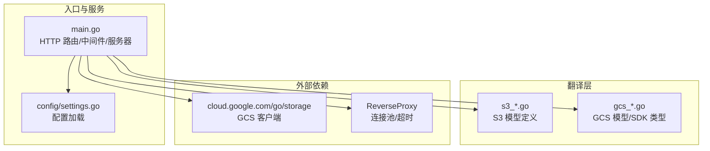
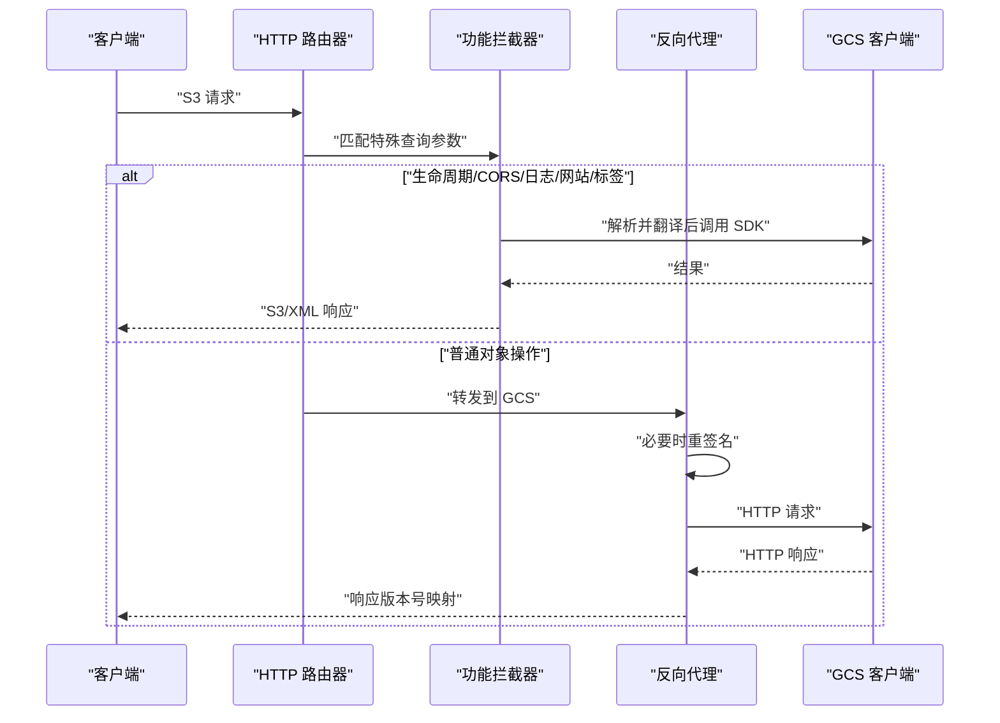
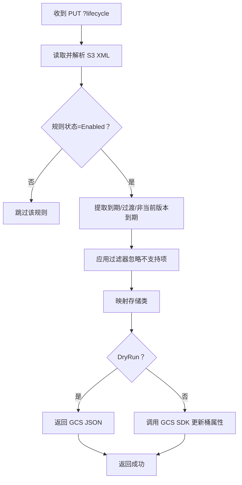
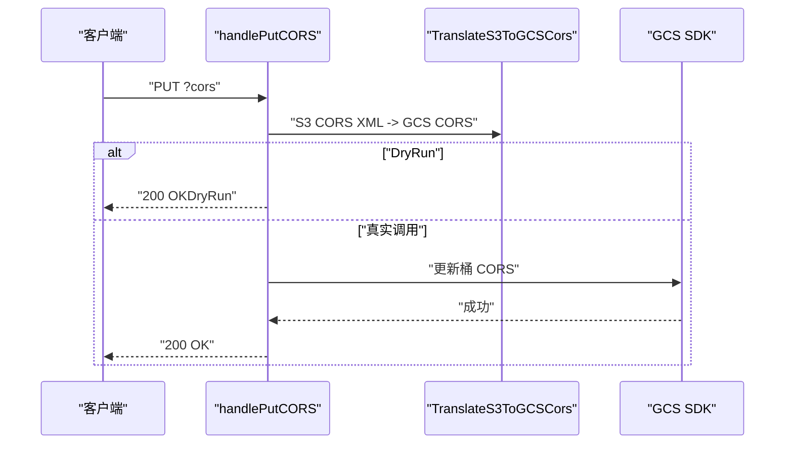
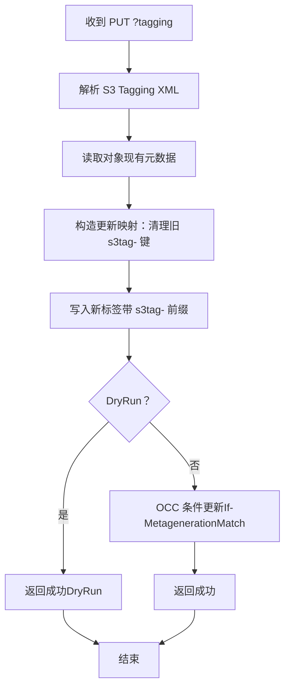
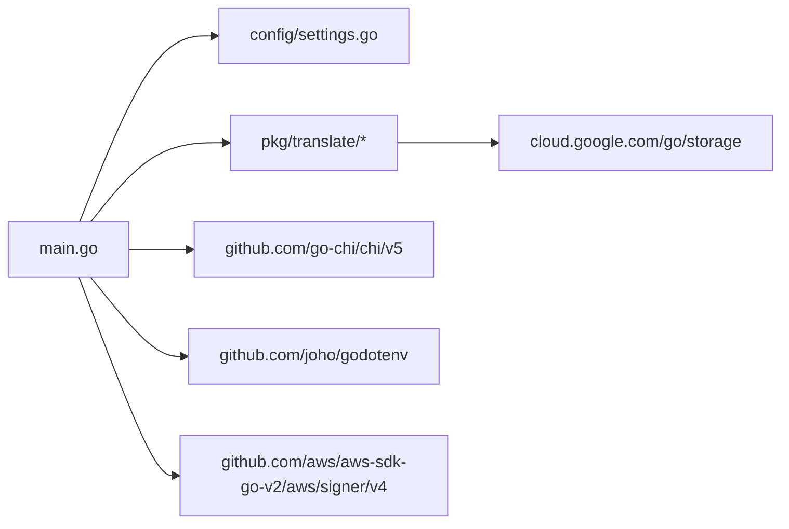

# 核心功能

<cite>
**本文引用的文件**
- [main.go](file://main.go)
- [settings.go](file://config/settings.go)
- [gcs_cors.go](file://pkg/translate/gcs_cors.go)
- [gcs_lifecycle.go](file://pkg/translate/gcs_lifecycle.go)
- [gcs_logging.go](file://pkg/translate/gcs_logging.go)
- [gcs_tagging.go](file://pkg/translate/gcs_tagging.go)
- [gcs_website.go](file://pkg/translate/gcs_website.go)
- [s3_cors.go](file://pkg/translate/s3_cors.go)
- [s3_lifecycle.go](file://pkg/translate/s3_lifecycle.go)
- [s3_logging.go](file://pkg/translate/s3_logging.go)
- [s3_tagging.go](file://pkg/translate/s3_tagging.go)
- [s3_website.go](file://pkg/translate/s3_website.go)
- [go.mod](file://go.mod)
- [README.md](file://README.md)
- [test_utils.go](file://integration_tests/test_utils.go)
</cite>

## 目录
1. [简介](#简介)
2. [项目结构](#项目结构)
3. [核心组件](#核心组件)
4. [架构总览](#架构总览)
5. [详细组件分析](#详细组件分析)
6. [依赖分析](#依赖分析)
7. [性能考虑](#性能考虑)
8. [故障排查指南](#故障排查指南)
9. [结论](#结论)
10. [附录](#附录)

## 简介
本文件聚焦于 S3Proxy4GCS 的核心功能与实现细节，涵盖以下主题：
- 反向代理核心机制：HTTP 路由、请求转发、连接池与超时控制
- 请求重签名机制：针对非标准存储类、SDK 特征参数与编码策略的再签名流程
- 功能拦截器：生命周期（Lifecycle）、CORS、日志（Logging）、网站托管（Website）与对象标签（Tagging）
- 配置体系：环境变量驱动的集中式配置与运行模式（DryRun）
- 实际应用场景与最佳实践

## 项目结构
项目采用“入口控制器 + 翻译层”的分层设计：
- 入口控制器负责路由、中间件、HTTP 服务器启动与优雅关闭、以及自定义功能拦截
- 翻译层负责 S3 与 GCS 数据模型之间的双向转换
- 配置模块集中管理运行参数

图表来源
- [main.go:36-251](file://main.go#L36-L251)
- [settings.go:29-57](file://config/settings.go#L29-L57)
- [gcs_cors.go:10-61](file://pkg/translate/gcs_cors.go#L10-L61)
- [gcs_lifecycle.go:36-103](file://pkg/translate/gcs_lifecycle.go#L36-L103)
- [gcs_logging.go:9-35](file://pkg/translate/gcs_logging.go#L9-L35)
- [gcs_tagging.go:8-47](file://pkg/translate/gcs_tagging.go#L8-L47)
- [gcs_website.go:9-26](file://pkg/translate/gcs_website.go#L9-L26)

章节来源
- [main.go:36-251](file://main.go#L36-L251)
- [settings.go:11-57](file://config/settings.go#L11-L57)
- [README.md:140-157](file://README.md#L140-L157)

## 核心组件
- HTTP 服务器与路由
  - 使用 chi 路由器注册基础中间件（日志、恢复），并为所有 S3 方法注册通配路由
  - 提供健康检查端点
- 反向代理与连接池
  - 基于 httputil.ReverseProxy，统一设置 Host、Scheme，并在 DryRun 模式下替换传输层
  - 使用 http.Transport 并启用 HTTP/2、禁用压缩以保留 S3 签名所需的 Accept-Encoding
  - 支持最大空闲连接数与每主机空闲连接数配置
- 请求重签名机制
  - 在检测到非标准存储类、SDK 特征参数（如 x-id）或特定编码策略时，使用 AWS SDK v2 的 v4 签名器进行重新签名
  - 重签名前会剥离 User-Agent，确保与已知良好模式一致
- 功能拦截器
  - 生命周期、CORS、日志、网站托管、对象标签等特殊查询参数的拦截处理
  - 所有拦截器均支持 DryRun 模式下的本地验证输出

章节来源
- [main.go:197-251](file://main.go#L197-L251)
- [main.go:73-90](file://main.go#L73-L90)
- [main.go:109-182](file://main.go#L109-L182)
- [main.go:253-321](file://main.go#L253-L321)

## 架构总览
下图展示了从客户端到 GCS 的整体数据流与控制流，包括拦截器、重签名与响应映射。

图表来源
- [main.go:253-321](file://main.go#L253-L321)
- [main.go:109-195](file://main.go#L109-L195)
- [main.go:348-405](file://main.go#L348-L405)
- [main.go:407-486](file://main.go#L407-L486)
- [main.go:488-563](file://main.go#L488-L563)
- [main.go:565-608](file://main.go#L565-L608)
- [main.go:610-740](file://main.go#L610-L740)

## 详细组件分析

### 反向代理核心机制
- 控制流
  - 路由器捕获所有 S3 方法请求，优先判断是否为功能拦截器场景；否则进入反向代理
  - Director 负责设置目标主机、协议、Host 头，并在 Debug 模式下记录请求头
  - ModifyResponse 将 GCS 的版本元信息映射回 S3 的版本头
- 连接池与超时
  - 通过 http.Transport 启用 HTTP/2、禁用压缩、设置空闲连接上限与超时
  - DryRun 模式下使用自定义传输层返回合成响应，便于本地验证
- 重签名触发条件
  - 非标准存储类（STANDARD 以外）映射为 GCS 对应类别
  - SDK v2 特征参数 x-id 被剥离并触发重签名
  - Accept-Encoding: identity 被移除并触发重签名
  - 重签名为 S3 us-east-1 区域签名，payload hash 默认为 UNSIGNED-PAYLOAD

图表来源
- [main.go:109-182](file://main.go#L109-L182)

章节来源
- [main.go:73-90](file://main.go#L73-L90)
- [main.go:109-182](file://main.go#L109-L182)
- [main.go:184-195](file://main.go#L184-L195)

### HTTP 服务器配置
- 中间件
  - 日志中间件与恢复中间件用于可观测性与健壮性
- 路由
  - 通配符路由覆盖 GET/PUT/POST/DELETE/HEAD，统一交由 handleS3Request 分发
- 服务器启动与优雅关闭
  - 监听端口来自配置，接收 SIGTERM/SIGINT 后最多等待 10 秒完成请求

章节来源
- [main.go:197-251](file://main.go#L197-L251)
- [settings.go:43-56](file://config/settings.go#L43-L56)

### 连接池优化
- 关键参数
  - MaxIdleConns：全局空闲连接上限
  - MaxIdleConnsPerHost：每主机空闲连接上限
  - IdleConnTimeout：空闲连接超时
  - TLSHandshakeTimeout：TLS 握手超时
  - ExpectContinueTimeout：Expect-Continue 超时
  - DisableCompression：禁用压缩以保留 S3 签名所需的头部
  - ForceAttemptHTTP2：启用 HTTP/2 以提升复用效率
- DryRun 传输层
  - 返回合成响应，便于本地验证版本互操作与存储类映射

章节来源
- [main.go:73-90](file://main.go#L73-L90)
- [main.go:323-346](file://main.go#L323-L346)

### 请求重签名机制
- 触发时机
  - 存储类映射、x-id 参数、Accept-Encoding: identity
- 重签算法
  - 使用 AWS SDK v2 的 v4 签名器，区域固定为 us-east-1
  - payload hash 默认 UNSIGNED-PAYLOAD，若存在则使用请求头值
  - 重签前移除 User-Agent，避免签名差异
- 错误处理
  - 失败时记录错误并跳过重签，导致后续 GCS 端签名校验失败

章节来源
- [main.go:156-181](file://main.go#L156-L181)

### 生命周期拦截器（Lifecycle）
- 工作流
  - 解析 S3 XML 生命周期配置
  - 翻译为 GCS JSON 结构，忽略不支持的过滤器（对象大小、标签）
  - 在 DryRun 模式下直接返回 JSON；否则通过 GCS SDK 更新桶属性
- 支持规则
  - 到期删除（Expiration）
  - 非当前版本到期（NoncurrentVersionExpiration）
  - 过渡（Transition）：按 S3 存储类映射到 GCS 存储类
- 不支持项
  - 对象大小过滤器
  - 标签过滤器
  - And 组合中的对象大小过滤器

图表来源
- [main.go:348-405](file://main.go#L348-L405)
- [gcs_lifecycle.go:36-103](file://pkg/translate/gcs_lifecycle.go#L36-L103)
- [gcs_lifecycle.go:105-135](file://pkg/translate/gcs_lifecycle.go#L105-L135)
- [gcs_lifecycle.go:137-152](file://pkg/translate/gcs_lifecycle.go#L137-L152)

章节来源
- [main.go:348-405](file://main.go#L348-L405)
- [gcs_lifecycle.go:36-164](file://pkg/translate/gcs_lifecycle.go#L36-L164)

### CORS 配置管理
- 写入（PUT）
  - 解析 S3 XML CORS 配置，翻译为 GCS CORS 切片
  - 忽略 S3 允许请求头（GCS 不原生支持），DryRun 模式直接返回成功
  - 通过 GCS SDK 更新桶属性
- 读取（GET）
  - 获取桶属性并转换为 S3 XML CORS 配置
- 删除（DELETE）
  - 清空 CORS 列表

图表来源
- [main.go:407-450](file://main.go#L407-L450)
- [gcs_cors.go:10-35](file://pkg/translate/gcs_cors.go#L10-L35)
- [gcs_cors.go:37-61](file://pkg/translate/gcs_cors.go#L37-L61)

章节来源
- [main.go:407-486](file://main.go#L407-L486)
- [gcs_cors.go:10-61](file://pkg/translate/gcs_cors.go#L10-L61)

### 日志配置管理
- 写入（PUT）
  - 解析 S3 BucketLoggingStatus，翻译为 GCS BucketLogging
  - DryRun 模式直接返回成功
  - 通过 GCS SDK 更新桶属性
- 读取（GET）
  - 获取桶属性并转换为 S3 BucketLoggingStatus XML
- 删除（DELETE）
  - 清空日志配置

章节来源
- [main.go:488-563](file://main.go#L488-L563)
- [gcs_logging.go:9-35](file://pkg/translate/gcs_logging.go#L9-L35)

### 网站托管配置
- 写入（PUT）
  - 解析 S3 WebsiteConfiguration，翻译为 GCS BucketWebsite
  - DryRun 模式直接返回成功
  - 通过 GCS SDK 更新桶属性
- 读取（GET/DELETE）
  - 通过 GCS SDK 获取/清空网站配置

章节来源
- [main.go:565-608](file://main.go#L565-L608)
- [gcs_website.go:9-26](file://pkg/translate/gcs_website.go#L9-L26)

### 对象标签系统
- 写入（PUT）
  - 解析 S3 Tagging XML，基于现有对象元数据进行乐观并发控制（OCC）
  - 将标签前缀化为 s3tag-，先清理旧键再写入新键
  - 通过 If-MetagenerationMatch 条件更新，避免覆盖丢失
- 读取（GET）
  - 从对象元数据中提取 s3tag- 前缀键并转换为 S3 Tagging XML
- 删除（DELETE）
  - 清理所有 s3tag- 前缀键

图表来源
- [main.go:610-675](file://main.go#L610-L675)
- [gcs_tagging.go:10-35](file://pkg/translate/gcs_tagging.go#L10-L35)
- [gcs_tagging.go:37-47](file://pkg/translate/gcs_tagging.go#L37-L47)

章节来源
- [main.go:610-740](file://main.go#L610-L740)
- [gcs_tagging.go:8-47](file://pkg/translate/gcs_tagging.go#L8-L47)

### 配置选项与使用模式
- 环境变量
  - PORT、GCP_PROJECT_ID、TARGET_BUCKET、STORAGE_BASE_URL、GCS_PREFIX、DRY_RUN、DEBUG_LOGGING、MAX_IDLE_CONNS、MAX_IDLE_CONNS_PER_HOST、PROXY_AWS_ACCESS_KEY_ID、PROXY_AWS_SECRET_ACCESS_KEY、JSON_KEY
- 使用模式
  - 通过 HTTP_PROXY/HTTPS_PROXY 或显式客户端传输将 S3 流量路由至本地代理
  - 开启路径风格地址以适配 GCS S3 兼容性
  - 在开发阶段启用 DRY_RUN 与 DEBUG_LOGGING 以降低风险并增强可观测性

章节来源
- [settings.go:30-56](file://config/settings.go#L30-L56)
- [README.md:18-45](file://README.md#L18-L45)

## 依赖分析
- 模块依赖
  - cloud.google.com/go/storage：GCS 客户端与 SDK 类型
  - github.com/go-chi/chi/v5：高性能路由器与中间件
  - github.com/joho/godotenv：.env 文件加载
  - github.com/aws/aws-sdk-go-v2/aws/signer/v4：AWS v4 请求重签名
- 内部依赖关系
  - main.go 依赖 config.Settings 与 pkg/translate 下的各翻译模块
  - 翻译模块仅依赖 cloud.google.com/go/storage 的类型定义与标准库

图表来源
- [go.mod:5-9](file://go.mod#L5-L9)
- [main.go:3-29](file://main.go#L3-L29)

章节来源
- [go.mod:1-61](file://go.mod#L1-L61)
- [main.go:3-29](file://main.go#L3-L29)

## 性能考虑
- 连接池与 HTTP/2
  - 合理设置 MaxIdleConns 与 MaxIdleConnsPerHost，避免过多空闲连接造成资源浪费
  - 启用 HTTP/2 以提升多路复用与连接复用效率
- 超时策略
  - 为 TLS 握手与空闲连接设置合理超时，防止长时间占用资源
- 重签名成本
  - 仅在必要时触发重签名，避免对高频请求产生额外 CPU 开销
- 日志级别
  - 生产环境建议关闭 DEBUG_LOGGING，减少 I/O 压力

## 故障排查指南
- 重签名失败
  - 检查 PROXY_AWS_ACCESS_KEY_ID 与 PROXY_AWS_SECRET_ACCESS_KEY 是否正确配置
  - 确认请求头中未携带不受支持的 Accept-Encoding 或 x-id 参数
- CORS 未生效
  - 确认翻译过程中允许请求头被忽略（GCS 不支持），必要时在客户端侧调整预检策略
- 生命周期更新失败
  - 检查是否使用了不支持的过滤器（对象大小、标签），或规则状态为 Disabled
- 对象标签冲突
  - OCC 冲突通常由并发更新引起，建议重试或在客户端增加幂等逻辑
- DryRun 模式
  - 在本地验证时可启用 DRY_RUN，但需注意部分行为（如版本号映射）为模拟

章节来源
- [main.go:156-181](file://main.go#L156-L181)
- [main.go:407-486](file://main.go#L407-L486)
- [main.go:488-563](file://main.go#L488-L563)
- [main.go:565-608](file://main.go#L565-L608)
- [main.go:610-740](file://main.go#L610-L740)

## 结论
S3Proxy4GCS 通过清晰的分层设计与严格的拦截与翻译机制，在保持 S3 兼容性的同时，实现了对 GCS 的高效、可控对接。其核心优势包括：
- 高效的反向代理与连接池配置
- 精准的请求重签名与版本互操作
- 完整的功能拦截器生态（Lifecycle/CORS/Logging/Website/Tagging）
- 易于扩展的翻译层与完善的 DryRun 支持

## 附录
- 实际应用场景
  - 企业迁移：将现有 S3 客户端无缝迁移到 GCS，无需修改业务代码
  - 多云策略：在 GCS 上实现与 S3 等价的生命周期、CORS、日志与网站托管能力
  - 本地开发：通过 DryRun 与 DEBUG_LOGGING 快速验证集成效果
- 最佳实践
  - 在生产环境关闭 DEBUG_LOGGING，合理设置连接池参数
  - 使用路径风格地址与正确的区域签名策略
  - 对标签与生命周期等关键操作进行幂等与重试设计