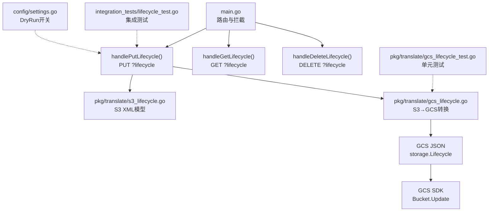
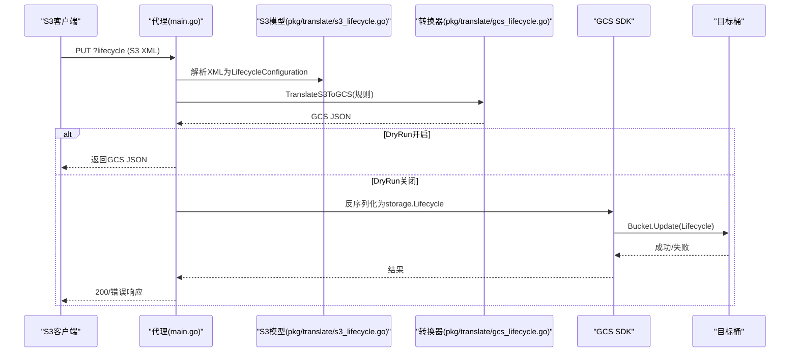
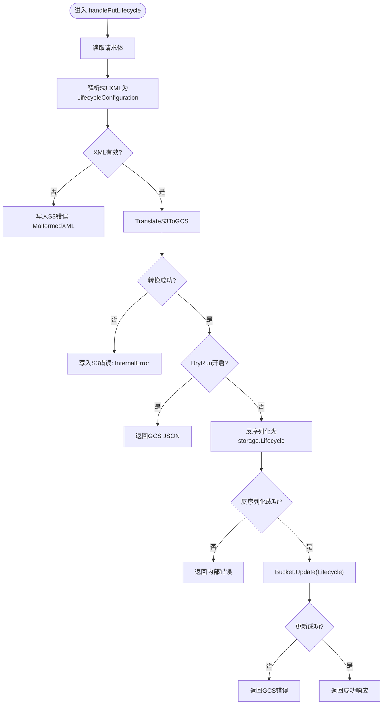
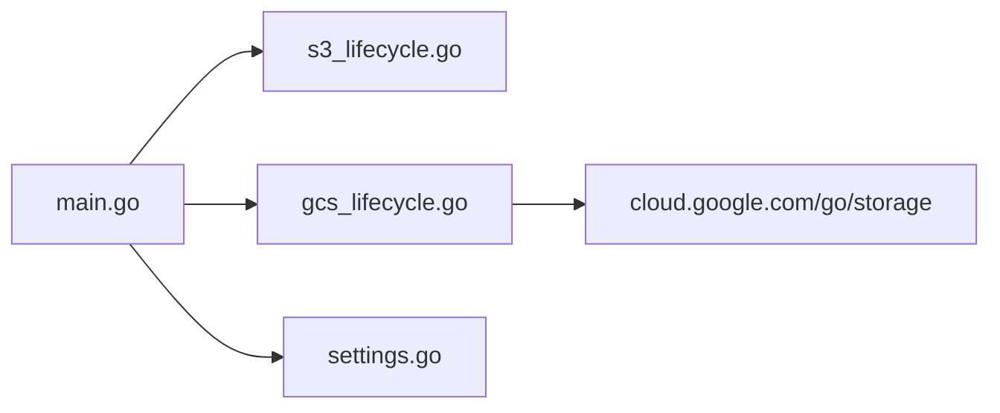

# 生命周期管理拦截

<cite>
**本文引用的文件**
- [main.go](file://main.go)
- [pkg/translate/gcs_lifecycle.go](file://pkg/translate/gcs_lifecycle.go)
- [pkg/translate/s3_lifecycle.go](file://pkg/translate/s3_lifecycle.go)
- [pkg/translate/gcs_lifecycle_test.go](file://pkg/translate/gcs_lifecycle_test.go)
- [pkg/translate/s3_lifecycle_test.go](file://pkg/translate/s3_lifecycle_test.go)
- [integration_tests/lifecycle_test.go](file://integration_tests/lifecycle_test.go)
- [config/settings.go](file://config/settings.go)
- [README.md](file://README.md)
- [unsupported.txt](file://unsupported.txt)
- [test_cases.md](file://test_cases.md)
</cite>

## 目录
1. [简介](#简介)
2. [项目结构](#项目结构)
3. [核心组件](#核心组件)
4. [架构总览](#架构总览)
5. [详细组件分析](#详细组件分析)
6. [依赖分析](#依赖分析)
7. [性能考虑](#性能考虑)
8. [故障排除指南](#故障排除指南)
9. [结论](#结论)
10. [附录](#附录)

## 简介
本技术文档聚焦于S3Proxy4GCS的“生命周期管理拦截”能力，系统性阐述从S3 XML生命周期配置到GCS JSON生命周期配置的双向转换机制，覆盖规则解析、条件映射、不支持功能的错误处理，以及handlePutLifecycle函数的完整实现流程（从XML解析到GCS JSON转换再到SDK调用）。同时提供最佳实践、常见配置示例、DryRun模式下的测试方法与调试技巧，帮助开发者在本地安全验证生命周期策略并在生产环境中可靠落地。

## 项目结构
围绕生命周期管理的关键文件组织如下：
- 路由入口与拦截逻辑：main.go中的请求分发与生命周期处理函数
- S3与GCS生命周期数据模型定义：pkg/translate/s3_lifecycle.go与pkg/translate/gcs_lifecycle.go
- 转换实现与双向映射：pkg/translate/gcs_lifecycle.go
- 单元测试与集成测试：pkg/translate/gcs_lifecycle_test.go、pkg/translate/s3_lifecycle_test.go、integration_tests/lifecycle_test.go
- 配置与DryRun开关：config/settings.go
- 项目说明与特性清单：README.md、test_cases.md、unsupported.txt

图表来源
- [main.go:254-459](file://main.go#L254-L459)
- [pkg/translate/s3_lifecycle.go:1-78](file://pkg/translate/s3_lifecycle.go#L1-L78)
- [pkg/translate/gcs_lifecycle.go:1-249](file://pkg/translate/gcs_lifecycle.go#L1-L249)
- [config/settings.go:11-25](file://config/settings.go#L11-L25)

章节来源
- [README.md:89-139](file://README.md#L89-L139)
- [test_cases.md:30-34](file://test_cases.md#L30-L34)

## 核心组件
- S3生命周期XML模型：定义LifecycleConfiguration、Rule、Filter、Transition、Expiration等结构，用于解析来自S3客户端的XML请求。
- GCS生命周期JSON模型：定义GCSLifecycle、GCSLifecycleRule、GCSLifecycleAction、GCSLifecycleCondition等结构，用于生成GCS可接受的JSON。
- 转换器：TranslateS3ToGCS负责将S3 XML规则转换为GCS JSON；TranslateGCSToS3Lifecycle负责反向映射。
- 生命周期处理函数：handlePutLifecycle、handleGetLifecycle、handleDeleteLifecycle分别处理PUT/GET/DELETE生命周期请求。
- 配置与DryRun：通过config.Settings控制是否直接调用GCS SDK或仅返回翻译结果。

章节来源
- [pkg/translate/s3_lifecycle.go:7-78](file://pkg/translate/s3_lifecycle.go#L7-L78)
- [pkg/translate/gcs_lifecycle.go:10-165](file://pkg/translate/gcs_lifecycle.go#L10-L165)
- [main.go:365-459](file://main.go#L365-L459)
- [config/settings.go:11-25](file://config/settings.go#L11-L25)

## 架构总览
生命周期拦截的整体流程如下：
- 客户端发送PUT ?lifecycle请求（S3 XML）
- 代理解析XML为S3模型
- 将S3规则转换为GCS JSON（含过滤器映射、存储类映射、日期格式化）
- 若启用DryRun，则直接返回GCS JSON；否则将JSON反序列化为storage.Lifecycle并通过GCS SDK更新桶属性
- GET ?lifecycle时，从GCS读取并反向映射回S3 XML
- DELETE ?lifecycle时，清空桶生命周期

图表来源
- [main.go:365-422](file://main.go#L365-L422)
- [pkg/translate/gcs_lifecycle.go:38-105](file://pkg/translate/gcs_lifecycle.go#L38-L105)

## 详细组件分析

### S3 XML生命周期模型
- LifecycleConfiguration：顶层容器，包含多个Rule
- Rule：包含ID、Priority、Status、Filter、Expiration、Transitions、NoncurrentVersionTransitions、NoncurrentVersionExpirations、AbortIncompleteMultipartUpload等字段
- Filter：支持Prefix、Tag、And组合，以及ObjectSizeGreaterThan/LessThan
- Transition/Expiration：支持Days、Date、StorageClass等
- NoncurrentVersionTransition/Expiration：针对版本化对象的过期与迁移
- AbortIncompleteMultipartUpload：针对未完成多部分上传的清理

章节来源
- [pkg/translate/s3_lifecycle.go:7-78](file://pkg/translate/s3_lifecycle.go#L7-L78)

### GCS生命周期模型与转换
- GCSLifecycle/GCSLifecycleRule：顶层与单条规则
- GCSLifecycleAction：Action类型（Delete/SetStorageClass）与可选StorageClass
- GCSLifecycleCondition：Age、CreatedBefore、IsLive、MatchesStorageClass、MatchesPrefix、MatchesSuffix、NumNewerVersions等
- 转换逻辑要点：
  - Status为Disabled的规则会被忽略
  - Expiration映射为Delete动作，Days映射为Age，Date映射为CreatedBefore
  - Transitions映射为SetStorageClass动作，StorageClass进行映射（STANDARD_IA/ONEZONE_IA→NEARLINE，INTELLIGENT_TIERING→STANDARD，GLACIER/GLACIER_IR→COLDLINE，DEEP_ARCHIVE→ARCHIVE）
  - NoncurrentVersionExpirations映射为Delete动作且IsLive=false，NumNewerVersions保留
  - 过滤器映射：Prefix直接映射为MatchesPrefix；And.Prefix追加到MatchesPrefix；ObjectSizeGreaterThan/LessThan与Tag在Filter与And中均不支持，遇到则报错
  - 日期格式：S3日期字符串截断为yyyy-mm-dd作为GCS的CreatedBefore

章节来源
- [pkg/translate/gcs_lifecycle.go:10-165](file://pkg/translate/gcs_lifecycle.go#L10-L165)

### 双向映射与反向转换
- TranslateGCSToS3Lifecycle：将GCS storage.Lifecycle反向映射为S3 LifecycleConfiguration
  - Delete动作映射为Expiration（Age/Date），Archived映射为NoncurrentVersionExpiration
  - SetStorageClass映射为Transition（Days/Date），StorageClass反向映射
  - Prefix映射为Filter.Prefix
  - AbortIncompleteMPU映射为AbortIncompleteMultipartUpload（DaysAfterInitiation）

章节来源
- [pkg/translate/gcs_lifecycle.go:167-248](file://pkg/translate/gcs_lifecycle.go#L167-L248)

### handlePutLifecycle实现流程
- 读取请求体
- 使用xml.Unmarshal解析为S3 LifecycleConfiguration
- 调用TranslateS3ToGCS进行转换
- 若DryRun为true，直接返回GCS JSON
- 否则将GCS JSON反序列化为storage.Lifecycle并调用gcsClient.Bucket(...).Update
- 记录日志并返回成功或错误响应

图表来源
- [main.go:365-422](file://main.go#L365-L422)

章节来源
- [main.go:365-422](file://main.go#L365-L422)

### GET/DELETE生命周期处理
- GET：从GCS读取桶属性，若无生命周期则返回“NoSuchLifecycleConfiguration”，否则反向映射为S3 XML并返回
- DELETE：将BucketAttrsToUpdate.Lifecycle设置为空，调用Bucket.Update并返回204

章节来源
- [main.go:424-459](file://main.go#L424-L459)

### 错误处理与边界情况
- XML解析失败：返回S3标准错误码MalformedXML
- 转换失败：返回InternalError
- 不支持的过滤器（ObjectSize、Tag）：在applyRuleFilter阶段直接返回错误
- GCS SDK调用失败：返回状态码为BadGateway的错误信息
- 无生命周期配置：GET返回NoSuchLifecycleConfiguration

章节来源
- [pkg/translate/gcs_lifecycle.go:107-137](file://pkg/translate/gcs_lifecycle.go#L107-L137)
- [main.go:376-387](file://main.go#L376-L387)
- [main.go:424-437](file://main.go#L424-L437)

## 依赖分析
- main.go依赖pkg/translate中的模型与转换器
- 转换器依赖cloud.google.com/go/storage以进行JSON与SDK类型的互转
- 配置模块提供DryRun开关，影响是否调用真实GCS SDK

图表来源
- [main.go:365-422](file://main.go#L365-L422)
- [pkg/translate/gcs_lifecycle.go:3-8](file://pkg/translate/gcs_lifecycle.go#L3-L8)
- [config/settings.go:11-25](file://config/settings.go#L11-L25)

章节来源
- [main.go:365-422](file://main.go#L365-L422)
- [pkg/translate/gcs_lifecycle.go:3-8](file://pkg/translate/gcs_lifecycle.go#L3-L8)
- [config/settings.go:11-25](file://config/settings.go#L11-L25)

## 性能考虑
- 连接池与超时：README中建议在HTTP传输层设置超时，避免挂起连接
- DryRun模式：在本地开发与测试中禁用真实GCS调用，显著降低延迟与成本
- JSON序列化/反序列化：转换器使用标准库进行JSON处理，复杂度与规则数量线性相关
- 建议：对大量规则的生命周期配置，优先在DryRun下验证转换正确性，再切换到真实环境

章节来源
- [README.md:93-97](file://README.md#L93-L97)
- [config/settings.go:36-56](file://config/settings.go#L36-L56)

## 故障排除指南
- XML格式错误
  - 现象：返回MalformedXML
  - 排查：检查S3 XML结构是否符合Schema；确保Status为Enabled的规则才会被转换
- 不支持的过滤器
  - 现象：返回InternalError，日志提示ObjectSize/Tag不支持
  - 排查：移除Filter/ObjectSizeGreaterThan/LessThan/Tag；仅使用Prefix与And.Prefix
- GCS API错误
  - 现象：返回BadGateway，包含GCS错误详情
  - 排查：确认目标桶存在、凭据正确、网络可达；查看代理日志
- GET返回“NoSuchLifecycleConfiguration”
  - 现象：GET生命周期返回404错误
  - 排查：确认已通过PUT设置生命周期；确认DryRun未导致策略未生效
- DryRun模式下仅返回JSON
  - 现象：PUT生命周期返回GCS JSON而非实际应用
  - 排查：确认DRY_RUN=true；如需真实应用，请关闭DryRun

章节来源
- [pkg/translate/gcs_lifecycle.go:107-137](file://pkg/translate/gcs_lifecycle.go#L107-L137)
- [main.go:376-387](file://main.go#L376-L387)
- [main.go:413-417](file://main.go#L413-L417)
- [main.go:433-437](file://main.go#L433-L437)

## 结论
S3Proxy4GCS的生命周期拦截通过明确的S3→GCS转换规则与严格的过滤器支持范围，实现了对主流生命周期场景的可靠支持。handlePutLifecycle串联了XML解析、规则转换、DryRun分支与GCS SDK调用，形成闭环。配合DryRun模式与完善的错误处理，开发者可在本地安全验证策略，再在生产环境稳定落地。

## 附录

### 最佳实践
- 仅使用受支持的过滤器：Prefix与And.Prefix；避免ObjectSize与Tag
- 明确规则状态：仅启用Status=Enabled的规则
- 存储类映射：了解S3与GCS存储类之间的映射关系，确保预期行为一致
- 多过渡规则：允许在同一规则内配置多个Transition，按顺序生效
- 版本化对象：合理使用NoncurrentVersionExpirations与NoncurrentVersionTransition

章节来源
- [pkg/translate/gcs_lifecycle.go:139-154](file://pkg/translate/gcs_lifecycle.go#L139-L154)
- [pkg/translate/gcs_lifecycle.go:107-137](file://pkg/translate/gcs_lifecycle.go#L107-L137)

### 常见配置示例（路径指引）
- 单一过渡与过期：参考单元测试中的示例，验证S3 XML到GCS JSON的转换
  - 示例路径：[pkg/translate/gcs_lifecycle_test.go:12-59](file://pkg/translate/gcs_lifecycle_test.go#L12-L59)
- 前缀过滤：验证Prefix映射为MatchesPrefix
  - 示例路径：[pkg/translate/gcs_lifecycle_test.go:73-105](file://pkg/translate/gcs_lifecycle_test.go#L73-L105)
- 多过渡规则：验证同一规则内的多个Transition
  - 示例路径：[integration_tests/lifecycle_test.go:154-178](file://integration_tests/lifecycle_test.go#L154-L178)

### DryRun模式下的测试方法与调试技巧
- 启用DryRun：设置DRY_RUN=true，代理将仅返回GCS JSON而不调用真实GCS
  - 配置路径：[config/settings.go:36-37](file://config/settings.go#L36-L37)
- 单元测试：运行pkg/translate/gcs_lifecycle_test.go验证转换逻辑
  - 测试路径：[pkg/translate/gcs_lifecycle_test.go:11-59](file://pkg/translate/gcs_lifecycle_test.go#L11-L59)
- 集成测试：使用AWS S3 SDK通过本地代理发送PUT生命周期请求
  - 测试路径：[integration_tests/lifecycle_test.go:57-119](file://integration_tests/lifecycle_test.go#L57-L119)
- 调试技巧：
  - 开启DEBUG_LOGGING以获得更详细的日志
  - 在本地启动代理后，使用curl或SDK直连localhost:PORT进行快速验证
  - 对比DryRun返回的GCS JSON与期望值，确认映射正确后再关闭DryRun

章节来源
- [README.md:97-97](file://README.md#L97-L97)
- [pkg/translate/gcs_lifecycle_test.go:11-59](file://pkg/translate/gcs_lifecycle_test.go#L11-L59)
- [integration_tests/lifecycle_test.go:57-119](file://integration_tests/lifecycle_test.go#L57-L119)
- [config/settings.go:36-56](file://config/settings.go#L36-L56)

### 不支持功能与限制
- Lifecycle在unsupported列表中被标记为“Lifecycle”（参见unsupported.txt第6行）
- 在Filter与And中不支持ObjectSizeGreaterThan/LessThan与Tag（参见applyRuleFilter的错误处理）
- 建议：如需基于对象大小或标签的生命周期策略，可在客户端侧通过其他方式实现（例如预处理或外部调度）

章节来源
- [unsupported.txt:4-16](file://unsupported.txt#L4-L16)
- [pkg/translate/gcs_lifecycle.go:107-137](file://pkg/translate/gcs_lifecycle.go#L107-L137)