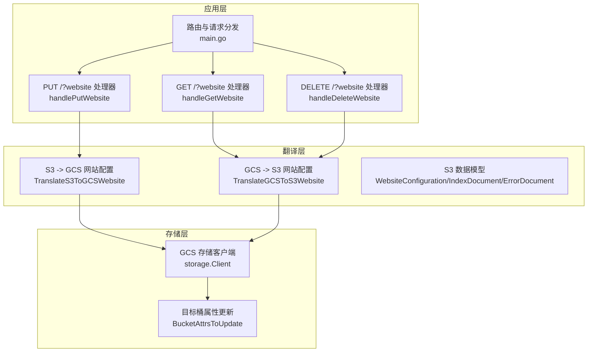
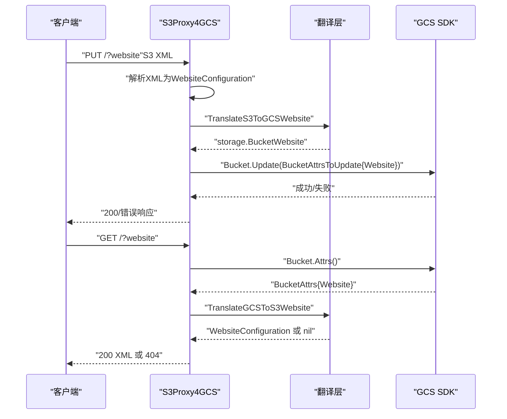
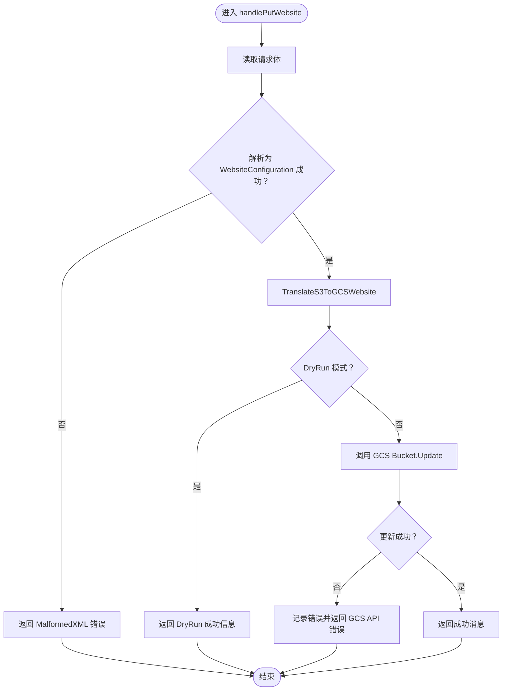
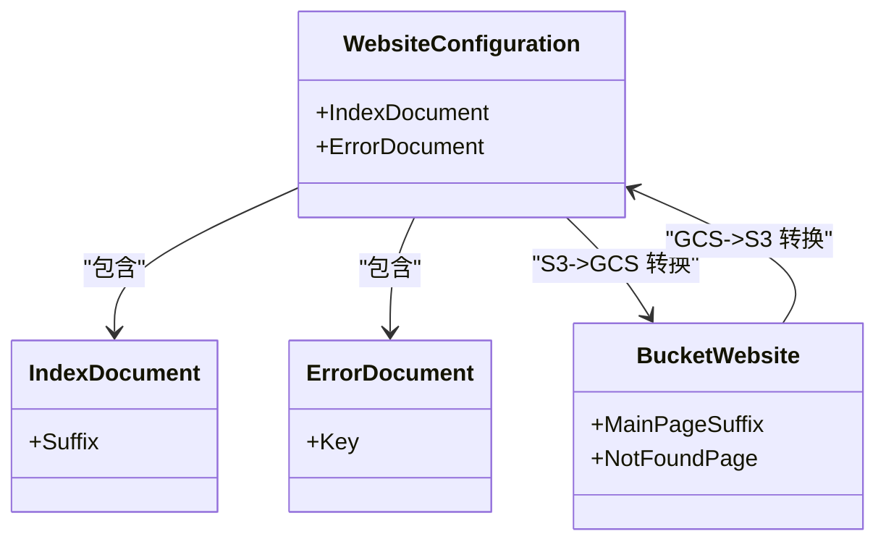
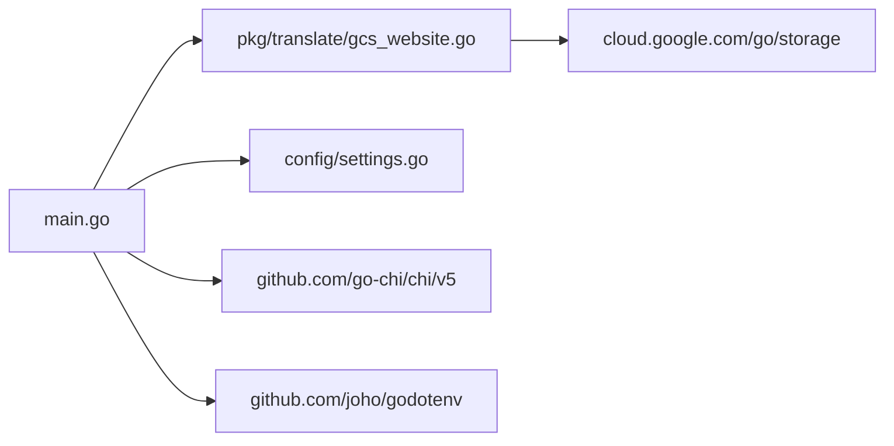

# 网站托管配置

<cite>
**本文引用的文件**
- [main.go](file://main.go)
- [gcs_website.go](file://pkg/translate/gcs_website.go)
- [s3_website.go](file://pkg/translate/s3_website.go)
- [website_test.go](file://integration_tests/website_test.go)
- [settings.go](file://config/settings.go)
- [README.md](file://README.md)
- [gcs_website_test.go](file://pkg/translate/gcs_website_test.go)
- [go.mod](file://go.mod)
</cite>

## 目录
1. [简介](#简介)
2. [项目结构](#项目结构)
3. [核心组件](#核心组件)
4. [架构总览](#架构总览)
5. [详细组件分析](#详细组件分析)
6. [依赖关系分析](#依赖关系分析)
7. [性能考量](#性能考量)
8. [故障排除指南](#故障排除指南)
9. [结论](#结论)
10. [附录](#附录)

## 简介
本文件面向S3Proxy4GCS的“网站托管配置”能力，系统性阐述静态网站托管在S3与GCS之间的双向转换机制，重点覆盖：
- 主页后缀映射（IndexDocument）与错误页面配置（ErrorDocument）
- 域名绑定与访问路径的注意事项
- handlePutWebsite 的实现流程与配置校验逻辑
- GCS网站托管与S3静态网站托管的差异与注意事项
- 部署流程、域名配置指南与性能优化建议
- 完整配置示例与故障排除方法

## 项目结构
围绕网站托管功能的关键文件与职责如下：
- 路由与入口：main.go 提供统一路由，识别 ?website 查询参数并分派到对应处理器
- 网站托管翻译层：pkg/translate/gcs_website.go 实现S3与GCS网站配置的双向转换
- S3侧数据模型：pkg/translate/s3_website.go 定义S3 WebsiteConfiguration的XML结构
- 集成测试：integration_tests/website_test.go 展示通过AWS SDK调用代理执行网站配置
- 配置中心：config/settings.go 提供运行时配置项（端口、目标桶、DryRun等）
- 文档与特性说明：README.md 概述项目能力与使用方式

图表来源
- [main.go:307-320](file://main.go#L307-L320)
- [main.go:619-662](file://main.go#L619-L662)
- [main.go:664-682](file://main.go#L664-L682)
- [main.go:684-699](file://main.go#L684-L699)
- [gcs_website.go:9-26](file://pkg/translate/gcs_website.go#L9-L26)
- [gcs_website.go:28-45](file://pkg/translate/gcs_website.go#L28-L45)
- [s3_website.go:5-21](file://pkg/translate/s3_website.go#L5-L21)

章节来源
- [main.go:307-320](file://main.go#L307-L320)
- [main.go:619-699](file://main.go#L619-L699)
- [gcs_website.go:9-45](file://pkg/translate/gcs_website.go#L9-L45)
- [s3_website.go:5-21](file://pkg/translate/s3_website.go#L5-L21)

## 核心组件
- S3侧网站配置模型
  - WebsiteConfiguration：顶层XML标签，包含IndexDocument与ErrorDocument两个可选子元素
  - IndexDocument：定义主页后缀（Suffix），用于匹配目录索引
  - ErrorDocument：定义404错误页面键（Key）

- GCS侧网站配置模型
  - storage.BucketWebsite：包含MainPageSuffix与NotFoundPage字段，分别对应S3的IndexDocument与ErrorDocument

- 双向转换函数
  - TranslateS3ToGCSWebsite：将S3 WebsiteConfiguration转换为storage.BucketWebsite
  - TranslateGCSToS3Website：将storage.BucketWebsite转换回S3 WebsiteConfiguration；当两者均为空时返回nil

章节来源
- [s3_website.go:5-21](file://pkg/translate/s3_website.go#L5-L21)
- [gcs_website.go:9-26](file://pkg/translate/gcs_website.go#L9-L26)
- [gcs_website.go:28-45](file://pkg/translate/gcs_website.go#L28-L45)

## 架构总览
S3Proxy4GCS在接收到带查询参数?website的请求后，会根据HTTP方法分派到对应的处理器：
- PUT：解析S3 XML网站配置，转换为GCS BucketWebsite并调用GCS SDK更新桶属性
- GET：从GCS读取桶属性中的Website配置，转换为S3 XML返回
- DELETE：清空Website配置

图表来源
- [main.go:619-662](file://main.go#L619-L662)
- [main.go:664-682](file://main.go#L664-L682)
- [gcs_website.go:9-26](file://pkg/translate/gcs_website.go#L9-L26)
- [gcs_website.go:28-45](file://pkg/translate/gcs_website.go#L28-L45)

## 详细组件分析

### handlePutWebsite 实现流程与配置校验
- 请求读取与解析
  - 读取请求体为字节数组，尝试解析为WebsiteConfiguration
  - 解析失败时返回S3风格的“MalformedXML”错误
- 转换与落库
  - 将WebsiteConfiguration转换为storage.BucketWebsite
  - 若处于DryRun模式，直接返回成功信息（不调用真实GCS）
  - 否则通过GCS SDK对目标桶进行属性更新
- 错误处理
  - 更新失败时记录日志并返回“GCS API error”的状态码
  - 成功时返回标准成功消息

图表来源
- [main.go:619-662](file://main.go#L619-L662)

章节来源
- [main.go:619-662](file://main.go#L619-L662)

### handleGetWebsite 与 handleDeleteWebsite
- handleGetWebsite
  - 从GCS读取桶属性，若Website为空则返回“NoSuchWebsiteConfiguration”
  - 否则将storage.BucketWebsite转换为S3 XML并返回
- handleDeleteWebsite
  - 清空Website配置并通过GCS SDK更新

章节来源
- [main.go:664-682](file://main.go#L664-L682)
- [main.go:684-699](file://main.go#L684-L699)

### 双向转换机制
- S3 -> GCS
  - IndexDocument.Suffix 映射到 MainPageSuffix
  - ErrorDocument.Key 映射到 NotFoundPage
- GCS -> S3
  - MainPageSuffix -> IndexDocument.Suffix
  - NotFoundPage -> ErrorDocument.Key
  - 当两者均为空时，返回nil以表示无网站配置

图表来源
- [s3_website.go:5-21](file://pkg/translate/s3_website.go#L5-L21)
- [gcs_website.go:9-26](file://pkg/translate/gcs_website.go#L9-L26)
- [gcs_website.go:28-45](file://pkg/translate/gcs_website.go#L28-L45)

章节来源
- [gcs_website.go:9-45](file://pkg/translate/gcs_website.go#L9-L45)
- [s3_website.go:5-21](file://pkg/translate/s3_website.go#L5-L21)

### 集成测试与SDK调用
- integration_tests/website_test.go 使用AWS SDK v2调用本地代理，发送PutBucketWebsite请求
- 通过自定义HTTP Transport将storage.googleapis.com的流量重定向到本地代理端口
- 测试验证了S3 XML到GCS配置的端到端流程

章节来源
- [website_test.go:18-90](file://integration_tests/website_test.go#L18-L90)

## 依赖关系分析
- 运行时依赖
  - cloud.google.com/go/storage：GCS SDK客户端与类型
  - github.com/go-chi/chi/v5：HTTP路由器
  - github.com/joho/godotenv：环境变量加载
- 代码依赖
  - main.go 依赖 pkg/translate 中的网站托管转换函数
  - 配置模块 config/settings.go 提供运行时参数（如DRY_RUN、TARGET_BUCKET等）

图表来源
- [main.go:21-30](file://main.go#L21-L30)
- [gcs_website.go:3-7](file://pkg/translate/gcs_website.go#L3-L7)
- [settings.go:3-9](file://config/settings.go#L3-L9)
- [go.mod:5-9](file://go.mod#L5-L9)

章节来源
- [go.mod:5-9](file://go.mod#L5-L9)
- [main.go:21-30](file://main.go#L21-L30)
- [settings.go:3-9](file://config/settings.go#L3-L9)

## 性能考量
- 连接池与传输优化
  - main.go中对http.Transport设置了最大空闲连接数、每主机空闲连接数、空闲超时、TLS握手超时等参数，有助于提升并发与稳定性
- 日志与调试
  - 通过DEBUG_LOGGING控制日志级别，便于在生产与开发场景间切换
- DryRun模式
  - DRY_RUN开启时，不调用真实GCS API，适合本地联调与压测

章节来源
- [main.go:74-91](file://main.go#L74-L91)
- [settings.go:36-56](file://config/settings.go#L36-L56)
- [README.md:18-29](file://README.md#L18-L29)

## 故障排除指南
- 常见错误与定位
  - MalformedXML：S3 XML格式不正确或未按Schema校验
  - GCS API error：GCS SDK调用失败，检查凭据、网络与目标桶权限
  - NoSuchWebsiteConfiguration：GET网站配置时目标桶未设置网站配置
- 排查步骤
  - 开启DEBUG_LOGGING查看请求/响应头与内部日志
  - 在DRY_RUN模式下验证S3 XML与转换逻辑是否符合预期
  - 使用integration_tests/website_test.go作为参考，确认SDK调用链路
- 配置核对
  - TARGET_BUCKET、JSON_KEY、PROXY_AWS_ACCESS_KEY_ID/SECRET_ACCESS_KEY等关键配置是否正确
  - 是否使用Path-Style地址与正确的BaseEndpoint

章节来源
- [main.go:630-634](file://main.go#L630-L634)
- [main.go:653-657](file://main.go#L653-L657)
- [main.go:674-677](file://main.go#L674-L677)
- [settings.go:43-56](file://config/settings.go#L43-L56)
- [README.md:18-29](file://README.md#L18-L29)

## 结论
S3Proxy4GCS通过pkg/translate层实现了S3与GCS网站托管配置的双向转换，结合main.go中的路由与处理器，提供了完整的PUT/GET/DELETE网站托管生命周期管理。其设计遵循最小差异原则：仅映射S3支持的主页后缀与错误页面，忽略S3中存在但GCS不原生支持的路由规则。配合DryRun与集成测试，开发者可以安全地验证配置并在生产环境中稳定运行。

## 附录

### 部署流程
- 准备环境变量
  - 参考README.md中的配置项，设置PORT、GCP_PROJECT_ID、TARGET_BUCKET、STORAGE_BASE_URL、JSON_KEY、PROXY_AWS_ACCESS_KEY_ID/SECRET_ACCESS_KEY、MAX_IDLE_CONNS、MAX_IDLE_CONNS_PER_HOST等
- 启动服务
  - 运行go run .启动代理
- 验证
  - 使用AWS SDK v2或curl等工具调用PUT /?website、GET /?website、DELETE /?website进行验证

章节来源
- [README.md:18-29](file://README.md#L18-L29)
- [README.md:133-136](file://README.md#L133-L136)

### 域名绑定与访问路径
- GCS网站托管与S3静态网站托管的差异
  - GCS不提供原生的“自定义域名绑定”能力；S3静态网站托管通常需要配合CloudFront或自定义域名
  - 本项目专注于“网站配置”的双向转换（主页后缀与错误页面），不涉及域名绑定
- 访问路径
  - 由于本项目为S3兼容代理，实际访问路径与S3一致；具体域名与CDN配置不在本项目范围内

章节来源
- [gcs_website.go:9-26](file://pkg/translate/gcs_website.go#L9-L26)
- [gcs_website.go:28-45](file://pkg/translate/gcs_website.go#L28-L45)

### 配置示例与最佳实践
- 示例：S3 XML网站配置（主页后缀与错误页面）
  - 可参考单元测试中的XML输入样例，用于PUT /?website
- 最佳实践
  - 使用DRY_RUN进行本地联调，确认XML与转换逻辑
  - 在生产环境关闭DRY_RUN并确保JSON_KEY与代理凭据正确
  - 使用Path-Style地址与正确的BaseEndpoint，避免签名问题

章节来源
- [gcs_website_test.go:11-19](file://pkg/translate/gcs_website_test.go#L11-L19)
- [website_test.go:70-81](file://integration_tests/website_test.go#L70-L81)
- [README.md:42-44](file://README.md#L42-L44)