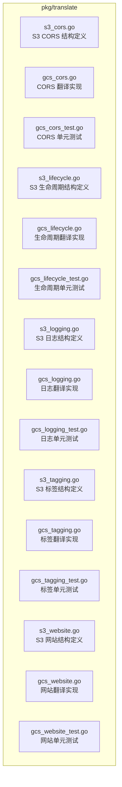
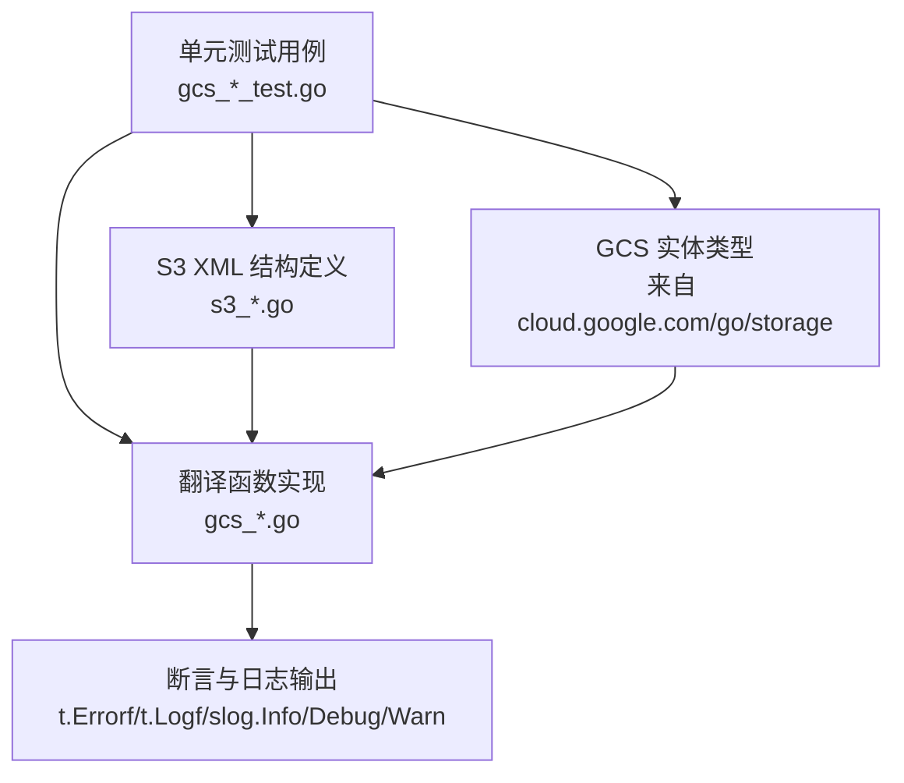
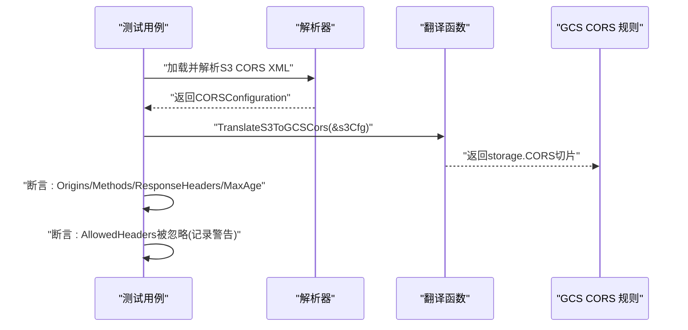
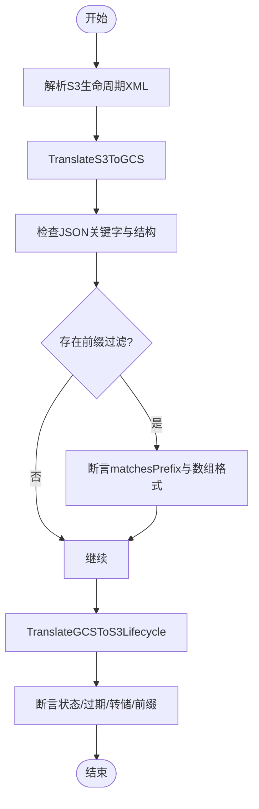
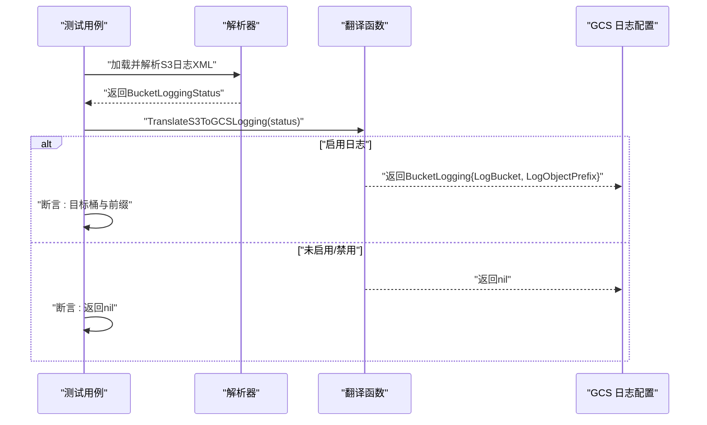
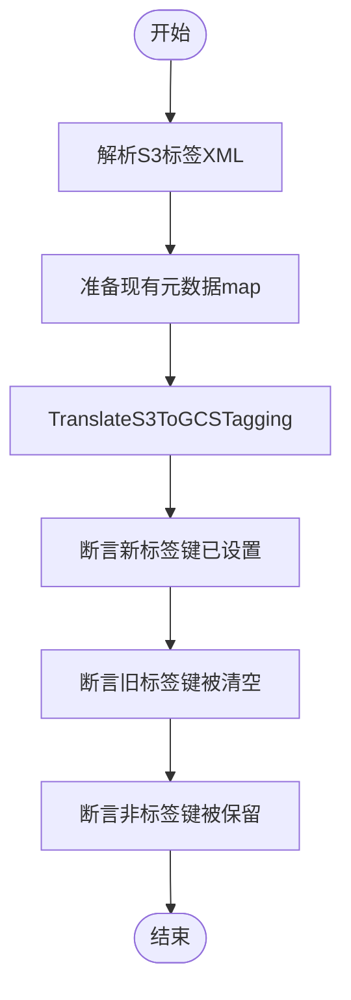
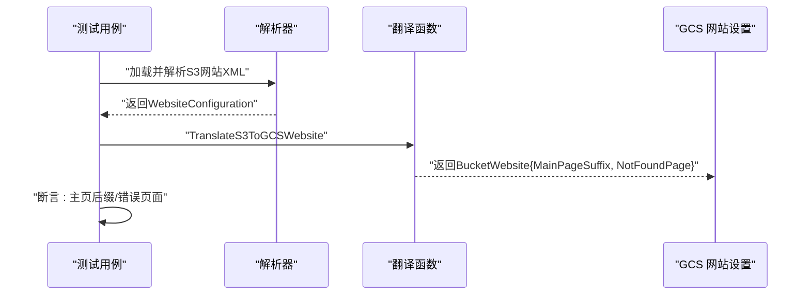
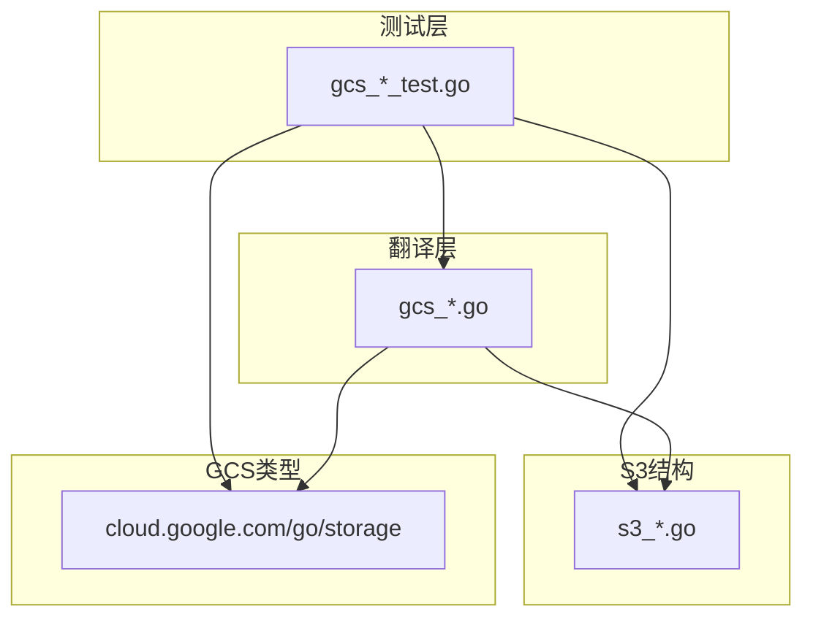

# 单元测试

<cite>
**本文引用的文件**
- [pkg/translate/gcs_cors_test.go](file://pkg/translate/gcs_cors_test.go)
- [pkg/translate/gcs_cors.go](file://pkg/translate/gcs_cors.go)
- [pkg/translate/s3_cors.go](file://pkg/translate/s3_cors.go)
- [pkg/translate/gcs_lifecycle_test.go](file://pkg/translate/gcs_lifecycle_test.go)
- [pkg/translate/gcs_lifecycle.go](file://pkg/translate/gcs_lifecycle.go)
- [pkg/translate/s3_lifecycle.go](file://pkg/translate/s3_lifecycle.go)
- [pkg/translate/gcs_logging_test.go](file://pkg/translate/gcs_logging_test.go)
- [pkg/translate/gcs_logging.go](file://pkg/translate/gcs_logging.go)
- [pkg/translate/s3_logging.go](file://pkg/translate/s3_logging.go)
- [pkg/translate/gcs_tagging_test.go](file://pkg/translate/gcs_tagging_test.go)
- [pkg/translate/gcs_tagging.go](file://pkg/translate/gcs_tagging.go)
- [pkg/translate/s3_tagging.go](file://pkg/translate/s3_tagging.go)
- [pkg/translate/gcs_website_test.go](file://pkg/translate/gcs_website_test.go)
- [pkg/translate/gcs_website.go](file://pkg/translate/gcs_website.go)
- [pkg/translate/s3_website.go](file://pkg/translate/s3_website.go)
</cite>

## 目录
1. [简介](#简介)
2. [项目结构](#项目结构)
3. [核心组件](#核心组件)
4. [架构总览](#架构总览)
5. [详细组件分析](#详细组件分析)
6. [依赖分析](#依赖分析)
7. [性能考虑](#性能考虑)
8. [故障排查指南](#故障排查指南)
9. [结论](#结论)
10. [附录：测试最佳实践与扩展建议](#附录测试最佳实践与扩展建议)

## 简介
本文件面向S3Proxy4GCS项目的单元测试，聚焦于翻译器模块（CORS、生命周期、日志、网站托管、对象标签）的测试实现与设计。内容涵盖：
- 测试用例设计思路与断言策略
- 测试数据准备与边界条件处理
- 生命周期管理、CORS配置、日志配置、网站托管、对象标签的测试要点
- 测试覆盖率分析与最佳实践
- 如何编写新测试用例与扩展现有测试套件

## 项目结构
本项目采用按功能域划分的包结构，翻译器模块位于pkg/translate目录，每个功能均包含独立的源文件与单元测试文件，便于维护与扩展。

图表来源
- [pkg/translate/s3_cors.go:1-20](file://pkg/translate/s3_cors.go#L1-L20)
- [pkg/translate/gcs_cors.go:1-62](file://pkg/translate/gcs_cors.go#L1-L62)
- [pkg/translate/gcs_cors_test.go:1-55](file://pkg/translate/gcs_cors_test.go#L1-L55)
- [pkg/translate/s3_lifecycle.go:1-78](file://pkg/translate/s3_lifecycle.go#L1-L78)
- [pkg/translate/gcs_lifecycle.go:1-249](file://pkg/translate/gcs_lifecycle.go#L1-L249)
- [pkg/translate/gcs_lifecycle_test.go:1-231](file://pkg/translate/gcs_lifecycle_test.go#L1-L231)
- [pkg/translate/s3_logging.go:1-17](file://pkg/translate/s3_logging.go#L1-L17)
- [pkg/translate/gcs_logging.go:1-36](file://pkg/translate/gcs_logging.go#L1-L36)
- [pkg/translate/gcs_logging_test.go:1-55](file://pkg/translate/gcs_logging_test.go#L1-L55)
- [pkg/translate/s3_tagging.go:1-10](file://pkg/translate/s3_tagging.go#L1-L10)
- [pkg/translate/gcs_tagging.go:1-48](file://pkg/translate/gcs_tagging.go#L1-L48)
- [pkg/translate/gcs_tagging_test.go:1-52](file://pkg/translate/gcs_tagging_test.go#L1-L52)
- [pkg/translate/s3_website.go:1-22](file://pkg/translate/s3_website.go#L1-L22)
- [pkg/translate/gcs_website.go:1-46](file://pkg/translate/gcs_website.go#L1-L46)
- [pkg/translate/gcs_website_test.go:1-68](file://pkg/translate/gcs_website_test.go#L1-L68)

章节来源
- [pkg/translate/gcs_cors_test.go:1-55](file://pkg/translate/gcs_cors_test.go#L1-L55)
- [pkg/translate/gcs_lifecycle_test.go:1-231](file://pkg/translate/gcs_lifecycle_test.go#L1-L231)
- [pkg/translate/gcs_logging_test.go:1-55](file://pkg/translate/gcs_logging_test.go#L1-L55)
- [pkg/translate/gcs_tagging_test.go:1-52](file://pkg/translate/gcs_tagging_test.go#L1-L52)
- [pkg/translate/gcs_website_test.go:1-68](file://pkg/translate/gcs_website_test.go#L1-L68)

## 核心组件
本节概述各翻译器模块在单元测试中的职责与关注点：
- CORS：验证S3到GCS的CORS规则映射，检查允许方法、来源、暴露头与最大缓存时间等字段；同时验证双向转换的完整性。
- 生命周期：验证S3生命周期规则到GCS JSON的正确生成，覆盖前缀过滤、过期与转储（存储类变更）、非当前版本过期、日期格式转换等；并验证GCS到S3的反向转换。
- 日志：验证S3日志状态到GCS日志配置的映射，以及禁用状态的正确处理。
- 对象标签：验证S3标签到GCS元数据的映射，确保旧标签被清空、新标签被设置，并保留非标签元数据。
- 网站托管：验证S3网站配置到GCS网站设置的映射，支持主页后缀与错误页面键值，以及部分配置场景。

章节来源
- [pkg/translate/gcs_cors_test.go:11-54](file://pkg/translate/gcs_cors_test.go#L11-L54)
- [pkg/translate/gcs_lifecycle_test.go:11-59](file://pkg/translate/gcs_lifecycle_test.go#L11-L59)
- [pkg/translate/gcs_logging_test.go:8-36](file://pkg/translate/gcs_logging_test.go#L8-L36)
- [pkg/translate/gcs_tagging_test.go:8-51](file://pkg/translate/gcs_tagging_test.go#L8-L51)
- [pkg/translate/gcs_website_test.go:8-38](file://pkg/translate/gcs_website_test.go#L8-L38)

## 架构总览
下图展示了单元测试与翻译器实现之间的关系，以及测试数据准备与断言流程：

图表来源
- [pkg/translate/gcs_cors_test.go:11-54](file://pkg/translate/gcs_cors_test.go#L11-L54)
- [pkg/translate/gcs_cors.go:10-35](file://pkg/translate/gcs_cors.go#L10-L35)
- [pkg/translate/s3_cors.go:5-19](file://pkg/translate/s3_cors.go#L5-L19)
- [pkg/translate/gcs_lifecycle_test.go:11-59](file://pkg/translate/gcs_lifecycle_test.go#L11-L59)
- [pkg/translate/gcs_lifecycle.go:38-105](file://pkg/translate/gcs_lifecycle.go#L38-L105)
- [pkg/translate/s3_lifecycle.go:7-24](file://pkg/translate/s3_lifecycle.go#L7-L24)
- [pkg/translate/gcs_logging_test.go:8-36](file://pkg/translate/gcs_logging_test.go#L8-L36)
- [pkg/translate/gcs_logging.go:9-21](file://pkg/translate/gcs_logging.go#L9-L21)
- [pkg/translate/s3_logging.go:5-16](file://pkg/translate/s3_logging.go#L5-L16)
- [pkg/translate/gcs_tagging_test.go:8-51](file://pkg/translate/gcs_tagging_test.go#L8-L51)
- [pkg/translate/gcs_tagging.go:10-35](file://pkg/translate/gcs_tagging.go#L10-L35)
- [pkg/translate/s3_tagging.go:5-9](file://pkg/translate/s3_tagging.go#L5-L9)
- [pkg/translate/gcs_website_test.go:8-38](file://pkg/translate/gcs_website_test.go#L8-L38)
- [pkg/translate/gcs_website.go:9-26](file://pkg/translate/gcs_website.go#L9-L26)
- [pkg/translate/s3_website.go:5-21](file://pkg/translate/s3_website.go#L5-L21)

## 详细组件分析

### CORS 模块单元测试
- 测试目标
  - 验证S3 CORS配置到GCS storage.CORS数组的映射是否正确，包括允许来源、方法、暴露头与最大缓存时间。
  - 验证双向转换（S3↔GCS）的一致性与完整性。
- 测试数据准备
  - 使用XML字符串构造CORSConfiguration，解析为结构体后调用翻译函数。
- 断言策略
  - 检查规则数量、来源集合、方法集合、响应头集合与最大缓存时间。
  - 对于S3请求头（AllowedHeaders），记录警告日志以提示不被GCS原生支持。
- 边界条件
  - 缺失MaxAge时应为零时长。
  - 允许来源为通配符“*”时的处理。
- 可观测性
  - 通过日志记录转换过程与忽略项，便于调试与审计。

图表来源
- [pkg/translate/gcs_cors_test.go:11-54](file://pkg/translate/gcs_cors_test.go#L11-L54)
- [pkg/translate/gcs_cors.go:10-35](file://pkg/translate/gcs_cors.go#L10-L35)
- [pkg/translate/s3_cors.go:5-19](file://pkg/translate/s3_cors.go#L5-L19)

章节来源
- [pkg/translate/gcs_cors_test.go:11-54](file://pkg/translate/gcs_cors_test.go#L11-L54)
- [pkg/translate/gcs_cors.go:10-35](file://pkg/translate/gcs_cors.go#L10-L35)
- [pkg/translate/s3_cors.go:5-19](file://pkg/translate/s3_cors.go#L5-L19)

### 生命周期模块单元测试
- 测试目标
  - 验证S3生命周期规则到GCS JSON的正确生成，覆盖前缀过滤、过期与转储（存储类变更）、非当前版本过期、日期格式转换等。
  - 验证GCS storage.Lifecycle到S3生命周期配置的反向转换。
- 测试数据准备
  - 使用XML字符串构造LifecycleConfiguration，解析为结构体后调用翻译函数。
- 断言策略
  - 对生成的JSON进行关键字检查（如动作类型、存储类映射）。
  - 对前缀过滤场景，断言匹配前缀条件与数组格式。
  - 对反向转换，断言状态、过期天数、日期、存储类映射与过滤前缀。
- 边界条件
  - 空生命周期：期望无规则。
  - 不支持的过滤器（对象大小、标签）：翻译时返回错误。
  - 日期格式：S3日期截断为“yyyy-mm-dd”。

图表来源
- [pkg/translate/gcs_lifecycle_test.go:11-59](file://pkg/translate/gcs_lifecycle_test.go#L11-L59)
- [pkg/translate/gcs_lifecycle.go:38-105](file://pkg/translate/gcs_lifecycle.go#L38-L105)
- [pkg/translate/s3_lifecycle.go:7-24](file://pkg/translate/s3_lifecycle.go#L7-L24)

章节来源
- [pkg/translate/gcs_lifecycle_test.go:11-59](file://pkg/translate/gcs_lifecycle_test.go#L11-L59)
- [pkg/translate/gcs_lifecycle_test.go:72-105](file://pkg/translate/gcs_lifecycle_test.go#L72-L105)
- [pkg/translate/gcs_lifecycle_test.go:107-142](file://pkg/translate/gcs_lifecycle_test.go#L107-L142)
- [pkg/translate/gcs_lifecycle_test.go:144-178](file://pkg/translate/gcs_lifecycle_test.go#L144-L178)
- [pkg/translate/gcs_lifecycle_test.go:180-201](file://pkg/translate/gcs_lifecycle_test.go#L180-L201)
- [pkg/translate/gcs_lifecycle_test.go:203-222](file://pkg/translate/gcs_lifecycle_test.go#L203-L222)
- [pkg/translate/gcs_lifecycle_test.go:224-230](file://pkg/translate/gcs_lifecycle_test.go#L224-L230)
- [pkg/translate/gcs_lifecycle.go:107-137](file://pkg/translate/gcs_lifecycle.go#L107-L137)
- [pkg/translate/gcs_lifecycle.go:139-154](file://pkg/translate/gcs_lifecycle.go#L139-L154)
- [pkg/translate/gcs_lifecycle.go:156-161](file://pkg/translate/gcs_lifecycle.go#L156-L161)
- [pkg/translate/gcs_lifecycle.go:167-232](file://pkg/translate/gcs_lifecycle.go#L167-L232)
- [pkg/translate/gcs_lifecycle.go:234-248](file://pkg/translate/gcs_lifecycle.go#L234-L248)
- [pkg/translate/s3_lifecycle.go:7-78](file://pkg/translate/s3_lifecycle.go#L7-L78)

### 日志模块单元测试
- 测试目标
  - 验证S3日志状态到GCS日志配置的映射，以及禁用状态的正确处理。
- 测试数据准备
  - 使用XML字符串构造BucketLoggingStatus，解析为结构体后调用翻译函数。
- 断言策略
  - 启用场景：断言目标桶与前缀。
  - 禁用场景：断言返回nil。
- 可观测性
  - 转换过程中记录日志信息，便于追踪。

图表来源
- [pkg/translate/gcs_logging_test.go:8-36](file://pkg/translate/gcs_logging_test.go#L8-L36)
- [pkg/translate/gcs_logging.go:9-21](file://pkg/translate/gcs_logging.go#L9-L21)
- [pkg/translate/s3_logging.go:5-16](file://pkg/translate/s3_logging.go#L5-L16)

章节来源
- [pkg/translate/gcs_logging_test.go:8-36](file://pkg/translate/gcs_logging_test.go#L8-L36)
- [pkg/translate/gcs_logging.go:9-21](file://pkg/translate/gcs_logging.go#L9-L21)
- [pkg/translate/s3_logging.go:5-16](file://pkg/translate/s3_logging.go#L5-L16)

### 对象标签模块单元测试
- 测试目标
  - 验证S3标签到GCS元数据的映射，确保旧标签被清空、新标签被设置，并保留非标签元数据。
- 测试数据准备
  - 使用XML字符串构造Tagging，解析为结构体；准备现有元数据map。
- 断言策略
  - 新增标签键以“s3tag-”前缀写入。
  - 清理旧的“s3tag-”键（设为空字符串）。
  - 非标签键保持不变。
- 可观测性
  - 记录标签翻译详情，便于审计。

图表来源
- [pkg/translate/gcs_tagging_test.go:8-51](file://pkg/translate/gcs_tagging_test.go#L8-L51)
- [pkg/translate/gcs_tagging.go:10-35](file://pkg/translate/gcs_tagging.go#L10-L35)
- [pkg/translate/s3_tagging.go:5-9](file://pkg/translate/s3_tagging.go#L5-L9)

章节来源
- [pkg/translate/gcs_tagging_test.go:8-51](file://pkg/translate/gcs_tagging_test.go#L8-L51)
- [pkg/translate/gcs_tagging.go:10-35](file://pkg/translate/gcs_tagging.go#L10-L35)
- [pkg/translate/s3_tagging.go:5-9](file://pkg/translate/s3_tagging.go#L5-L9)

### 网站托管模块单元测试
- 测试目标
  - 验证S3网站配置到GCS网站设置的映射，支持主页后缀与错误页面键值，以及部分配置场景。
- 测试数据准备
  - 使用XML字符串构造WebsiteConfiguration，解析为结构体后调用翻译函数。
- 断言策略
  - 完整配置：断言主页后缀与错误页面。
  - 部分配置：仅主页后缀存在时，错误页面应为空。
- 可观测性
  - 记录网站配置翻译详情。

图表来源
- [pkg/translate/gcs_website_test.go:8-38](file://pkg/translate/gcs_website_test.go#L8-L38)
- [pkg/translate/gcs_website.go:9-26](file://pkg/translate/gcs_website.go#L9-L26)
- [pkg/translate/s3_website.go:5-21](file://pkg/translate/s3_website.go#L5-L21)

章节来源
- [pkg/translate/gcs_website_test.go:8-38](file://pkg/translate/gcs_website_test.go#L8-L38)
- [pkg/translate/gcs_website_test.go:40-67](file://pkg/translate/gcs_website_test.go#L40-L67)
- [pkg/translate/gcs_website.go:9-26](file://pkg/translate/gcs_website.go#L9-L26)
- [pkg/translate/s3_website.go:5-21](file://pkg/translate/s3_website.go#L5-L21)

## 依赖分析
- 组件内聚与耦合
  - 每个翻译器模块内部高度内聚，单元测试仅依赖对应源文件与S3结构定义。
  - 与GCS实体类型（storage.*）的交互通过cloud.google.com/go/storage引入，测试中直接使用该库类型。
- 外部依赖
  - 解析S3 XML依赖标准库encoding/xml。
  - 日志记录依赖log/slog。
- 反向转换
  - CORS、生命周期、日志、网站、标签均提供双向转换函数，测试覆盖正向与反向路径。

图表来源
- [pkg/translate/gcs_cors_test.go:1-9](file://pkg/translate/gcs_cors_test.go#L1-L9)
- [pkg/translate/gcs_cors.go:3-8](file://pkg/translate/gcs_cors.go#L3-L8)
- [pkg/translate/s3_cors.go](file://pkg/translate/s3_cors.go#L3)
- [pkg/translate/gcs_lifecycle_test.go:1-9](file://pkg/translate/gcs_lifecycle_test.go#L1-L9)
- [pkg/translate/gcs_lifecycle.go:3-8](file://pkg/translate/gcs_lifecycle.go#L3-L8)
- [pkg/translate/s3_lifecycle.go:3-5](file://pkg/translate/s3_lifecycle.go#L3-L5)
- [pkg/translate/gcs_logging_test.go:1-6](file://pkg/translate/gcs_logging_test.go#L1-L6)
- [pkg/translate/gcs_logging.go:3-7](file://pkg/translate/gcs_logging.go#L3-L7)
- [pkg/translate/s3_logging.go](file://pkg/translate/s3_logging.go#L3)
- [pkg/translate/gcs_tagging_test.go:1-6](file://pkg/translate/gcs_tagging_test.go#L1-L6)
- [pkg/translate/gcs_tagging.go:3-6](file://pkg/translate/gcs_tagging.go#L3-L6)
- [pkg/translate/s3_tagging.go](file://pkg/translate/s3_tagging.go#L3)
- [pkg/translate/gcs_website_test.go:1-6](file://pkg/translate/gcs_website_test.go#L1-L6)
- [pkg/translate/gcs_website.go:3-7](file://pkg/translate/gcs_website.go#L3-L7)
- [pkg/translate/s3_website.go](file://pkg/translate/s3_website.go#L3)

章节来源
- [pkg/translate/gcs_cors.go:3-8](file://pkg/translate/gcs_cors.go#L3-L8)
- [pkg/translate/gcs_lifecycle.go:3-8](file://pkg/translate/gcs_lifecycle.go#L3-L8)
- [pkg/translate/gcs_logging.go:3-7](file://pkg/translate/gcs_logging.go#L3-L7)
- [pkg/translate/gcs_tagging.go:3-6](file://pkg/translate/gcs_tagging.go#L3-L6)
- [pkg/translate/gcs_website.go:3-7](file://pkg/translate/gcs_website.go#L3-L7)

## 性能考虑
- 测试执行效率
  - 单元测试避免外部系统依赖，执行速度快，适合频繁运行。
  - XML解析与JSON序列化在测试中开销较小，主要瓶颈在断言与日志输出。
- 内存与复杂度
  - 测试数据规模小，内存占用低；翻译函数的时间复杂度多为线性，与规则数量成正比。
- 建议
  - 在大规模规则场景下，可增加边界测试（大量规则、超长前缀、复杂日期）以评估性能与稳定性。

## 故障排查指南
- CORS相关
  - 若出现“AllowedHeaders被忽略”的日志，请确认GCS不支持原生请求头白名单，需在应用层处理。
- 生命周期相关
  - 若翻译失败并返回错误，检查是否存在不支持的过滤器（对象大小、标签）或日期格式问题。
  - 对于空生命周期，确认生成的S3配置规则数为0。
- 日志相关
  - 若返回nil，请确认S3日志状态是否启用；禁用状态下返回nil为预期行为。
- 标签相关
  - 若旧标签未被清空，请检查元数据map中是否包含“s3tag-”前缀键。
- 网站相关
  - 若错误页面为空，确认S3网站配置中是否提供了错误文档键。

章节来源
- [pkg/translate/gcs_cors.go:20-22](file://pkg/translate/gcs_cors.go#L20-L22)
- [pkg/translate/gcs_lifecycle.go:112-118](file://pkg/translate/gcs_lifecycle.go#L112-L118)
- [pkg/translate/gcs_lifecycle.go:224-230](file://pkg/translate/gcs_lifecycle.go#L224-L230)
- [pkg/translate/gcs_logging.go:11-13](file://pkg/translate/gcs_logging.go#L11-L13)
- [pkg/translate/gcs_tagging.go:17-22](file://pkg/translate/gcs_tagging.go#L17-L22)
- [pkg/translate/gcs_website.go:11-12](file://pkg/translate/gcs_website.go#L11-L12)

## 结论
本项目的单元测试围绕五大翻译器模块构建，覆盖了从S3到GCS的关键配置映射与双向转换。测试用例设计注重：
- 明确的断言策略与可观测性日志
- 典型场景与边界条件的覆盖
- 对不支持能力的显式处理与错误提示

通过持续完善测试用例与引入更多边界与集成测试，可进一步提升代码质量与系统稳定性。

## 附录：测试最佳实践与扩展建议
- 测试断言方法
  - 使用明确的断言消息，便于定位失败原因。
  - 对于JSON/XML字符串，优先断言关键字段与结构，而非完整内容。
  - 对日志输出，断言关键键值与上下文信息。
- 测试数据准备
  - 使用最小可验证的XML片段，减少无关字段干扰。
  - 对边界场景（空值、通配符、缺失字段）单独构造用例。
- 边界条件处理
  - 不支持的过滤器与字段应返回错误或忽略并记录日志。
  - 日期格式统一转换，避免跨平台差异。
- 测试覆盖率分析
  - 建议结合工具统计各模块的行覆盖率与分支覆盖率，重点关注：
    - 双向转换的对称性
    - 错误路径与异常输入
    - 空配置与禁用状态
- 扩展测试套件
  - 为每个翻译器新增场景：复杂前缀组合、多规则生命周期、混合标签与元数据、部分网站配置等。
  - 引入参数化测试（table-driven tests）以提高用例复用与可维护性。
  - 将日志级别与忽略项纳入断言，确保行为一致性。