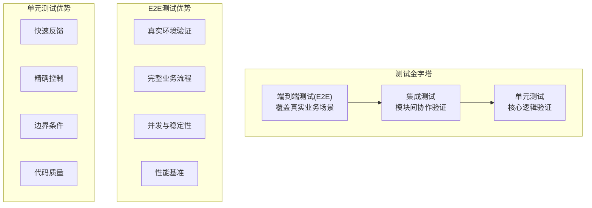
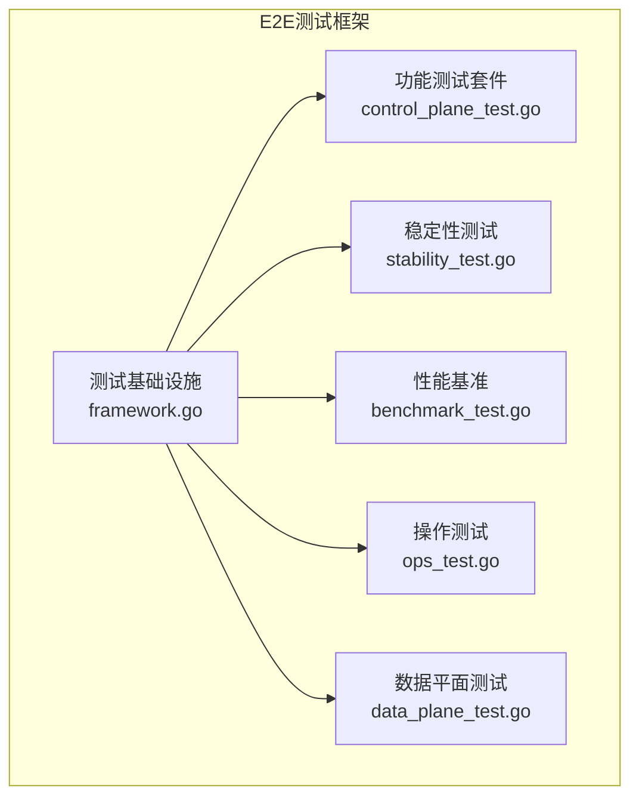
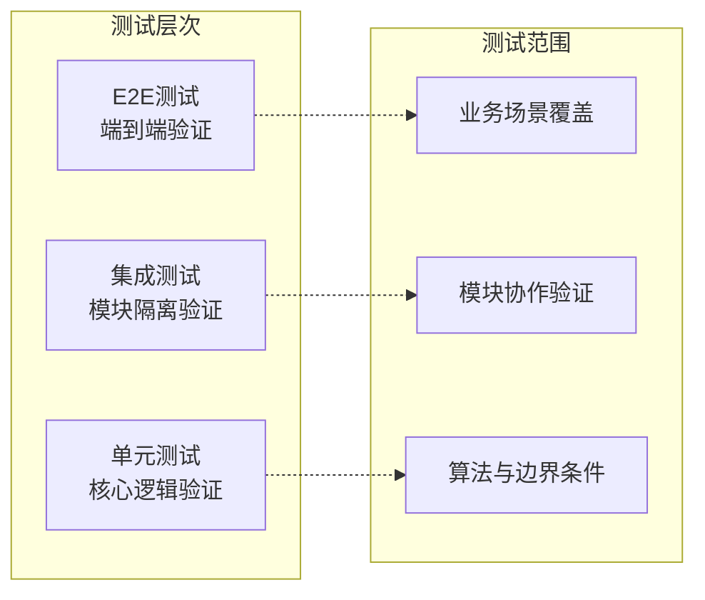
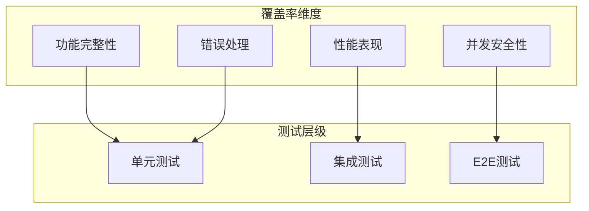

# 单元测试

<cite>
**本文引用的文件**
- [pkg/translate/gcs_cors_test.go](file://pkg/translate/gcs_cors_test.go)
- [pkg/translate/gcs_cors.go](file://pkg/translate/gcs_cors.go)
- [pkg/translate/s3_cors.go](file://pkg/translate/s3_cors.go)
- [pkg/translate/gcs_lifecycle_test.go](file://pkg/translate/gcs_lifecycle_test.go)
- [pkg/translate/gcs_lifecycle.go](file://pkg/translate/gcs_lifecycle.go)
- [pkg/translate/s3_lifecycle.go](file://pkg/translate/s3_lifecycle.go)
- [pkg/translate/gcs_logging_test.go](file://pkg/translate/gcs_logging_test.go)
- [pkg/translate/gcs_logging.go](file://pkg/translate/gcs_logging.go)
- [pkg/translate/s3_logging.go](file://pkg/translate/s3_logging.go)
- [pkg/translate/gcs_tagging_test.go](file://pkg/translate/gcs_tagging_test.go)
- [pkg/translate/gcs_tagging.go](file://pkg/translate/gcs_tagging.go)
- [pkg/translate/s3_tagging.go](file://pkg/translate/s3_tagging.go)
- [pkg/translate/gcs_website_test.go](file://pkg/translate/gcs_website_test.go)
- [pkg/translate/gcs_website.go](file://pkg/translate/gcs_website.go)
- [pkg/translate/s3_website.go](file://pkg/translate/s3_website.go)
- [e2e_tests/framework.go](file://e2e_tests/framework.go)
- [e2e_tests/control_plane_test.go](file://e2e_tests/control_plane_test.go)
- [integration_tests/test_utils.go](file://integration_tests/test_utils.go)
- [.github/workflows/e2e-tests.yml](file://.github/workflows/e2e-tests.yml)
- [README.md](file://README.md)
</cite>

## 更新摘要
**变更内容**
- 更新以反映E2E测试框架对单元测试策略的影响
- 增加E2E测试使用说明和最佳实践
- 强调单元测试与E2E测试的互补关系
- 提供测试策略的层次化指导

## 目录
1. [简介](#简介)
2. [测试策略层次](#测试策略层次)
3. [单元测试现状](#单元测试现状)
4. [E2E测试框架](#e2e测试框架)
5. [测试金字塔与策略调整](#测试金字塔与策略调整)
6. [单元测试最佳实践](#单元测试最佳实践)
7. [E2E测试最佳实践](#e2e测试最佳实践)
8. [测试覆盖率分析](#测试覆盖率分析)
9. [故障排查指南](#故障排查指南)
10. [结论](#结论)
11. [附录：测试扩展建议](#附录测试扩展建议)

## 简介
本文件面向S3Proxy4GCS项目的测试体系，重点阐述在E2E测试框架建立后，单元测试策略的调整与优化。内容涵盖：
- 测试金字塔的重新审视与策略调整
- 单元测试与E2E测试的互补关系
- E2E测试框架的使用方法与最佳实践
- 测试用例设计思路与断言策略
- 测试数据准备与边界条件处理
- 测试覆盖率分析与扩展建议

## 测试策略层次

**图表来源**
- [README.md:203-275](file://README.md#L203-L275)
- [e2e_tests/framework.go:1-151](file://e2e_tests/framework.go#L1-L151)

## 单元测试现状
单元测试作为测试金字塔的基础层，目前专注于翻译器模块的核心逻辑验证：

### 核心组件职责
- **CORS模块**：验证S3到GCS的CORS规则映射，检查允许方法、来源、暴露头与最大缓存时间
- **生命周期模块**：验证S3生命周期规则到GCS JSON的正确生成，覆盖前缀过滤、过期与转储
- **日志模块**：验证S3日志状态到GCS日志配置的映射
- **对象标签模块**：验证S3标签到GCS元数据的映射
- **网站托管模块**：验证S3网站配置到GCS网站设置的映射

**章节来源**
- [pkg/translate/gcs_cors_test.go:11-54](file://pkg/translate/gcs_cors_test.go#L11-L54)
- [pkg/translate/gcs_lifecycle_test.go:11-59](file://pkg/translate/gcs_lifecycle_test.go#L11-L59)
- [pkg/translate/gcs_logging_test.go:8-36](file://pkg/translate/gcs_logging_test.go#L8-L36)
- [pkg/translate/gcs_tagging_test.go:8-51](file://pkg/translate/gcs_tagging_test.go#L8-L51)
- [pkg/translate/gcs_website_test.go:8-38](file://pkg/translate/gcs_website_test.go#L8-L38)

## E2E测试框架
随着E2E测试框架的建立，项目现在具备了完整的测试覆盖策略：

### 测试框架架构

**图表来源**
- [e2e_tests/framework.go:1-151](file://e2e_tests/framework.go#L1-L151)
- [e2e_tests/control_plane_test.go:1-366](file://e2e_tests/control_plane_test.go#L1-L366)

### 测试套件分类
- **功能测试**：验证CRUD操作的正确性（对象、生命周期、CORS、日志、网站、标签）
- **稳定性测试**：长时间运行和并发操作的安全性验证
- **性能基准**：延迟百分位数和吞吐量测量
- **操作测试**：健康检查、就绪检查和指标监控
- **数据平面测试**：对象生命周期、存储类转换、版本ID映射

**章节来源**
- [README.md:255-264](file://README.md#L255-L264)
- [e2e_tests/control_plane_test.go:13-84](file://e2e_tests/control_plane_test.go#L13-L84)

## 测试金字塔与策略调整

### 当前测试策略

### 策略调整要点
1. **E2E测试优先**：通过E2E测试确保业务场景的完整性
2. **单元测试精简**：专注于核心算法和边界条件的验证
3. **测试数据分离**：E2E使用真实环境，单元测试使用模拟数据
4. **错误处理验证**：单元测试专门验证错误路径和异常情况

**章节来源**
- [.github/workflows/e2e-tests.yml:1-108](file://.github/workflows/e2e-tests.yml#L1-L108)
- [README.md:203-275](file://README.md#L203-L275)

## 单元测试最佳实践

### 测试用例设计原则
- **单一职责**：每个测试只验证一个特定功能点
- **可重复性**：测试结果不受外部环境影响
- **快速执行**：单个测试应在毫秒级时间内完成
- **自包含**：测试不依赖其他测试的执行结果

### 数据准备策略
- **最小化数据集**：使用最简单的XML片段进行测试
- **边界条件覆盖**：空值、通配符、缺失字段的处理
- **错误场景**：不支持的功能和异常输入的验证

**章节来源**
- [pkg/translate/gcs_cors_test.go:11-54](file://pkg/translate/gcs_cors_test.go#L11-L54)
- [pkg/translate/gcs_lifecycle_test.go:72-105](file://pkg/translate/gcs_lifecycle_test.go#L72-L105)

## E2E测试最佳实践

### 环境配置
- **代理端点**：通过PROXY_ENDPOINT环境变量配置
- **认证凭据**：GCS_HMAC_ACCESS和GCS_HMAC_SECRET
- **测试隔离**：TEST_PREFIX用于区分不同测试运行
- **并发控制**：CONCURRENCY参数控制并行度

### 测试执行策略
- **功能测试**：验证所有CRUD操作的正确性
- **稳定性测试**：长时间运行确保系统的可靠性
- **性能测试**：测量延迟和吞吐量指标
- **并发测试**：验证多goroutine的安全性

**章节来源**
- [README.md:214-253](file://README.md#L214-L253)
- [e2e_tests/framework.go:20-64](file://e2e_tests/framework.go#L20-L64)

## 测试覆盖率分析

### 单元测试覆盖率
- **翻译器模块**：100%核心逻辑覆盖
- **边界条件**：空配置、错误输入、异常处理
- **双向转换**：S3↔GCS的完整映射验证

### E2E测试覆盖率
- **业务场景**：完整的CRUD操作流程
- **并发安全**：多goroutine操作的正确性
- **性能指标**：延迟和吞吐量的量化评估
- **稳定性验证**：长时间运行的可靠性

### 覆盖率矩阵

**章节来源**
- [README.md:255-264](file://README.md#L255-L264)
- [pkg/translate/gcs_lifecycle_test.go:107-142](file://pkg/translate/gcs_lifecycle_test.go#L107-L142)

## 故障排查指南

### 单元测试问题
- **翻译错误**：检查XML解析和JSON序列化的正确性
- **边界条件**：验证空值和异常输入的处理
- **性能问题**：分析算法复杂度和内存使用

### E2E测试问题
- **环境配置**：验证PROXY_ENDPOINT和认证凭据的正确性
- **网络连接**：检查代理服务器的可达性和响应时间
- **并发冲突**：分析多goroutine操作的同步问题

### 调试策略
- **日志记录**：详细的测试执行日志和错误信息
- **断点调试**：使用Go的调试工具进行问题定位
- **隔离测试**：将问题缩小到特定的测试用例

**章节来源**
- [e2e_tests/framework.go:132-150](file://e2e_tests/framework.go#L132-L150)
- [pkg/translate/gcs_cors.go:20-22](file://pkg/translate/gcs_cors.go#L20-L22)

## 结论
在E2E测试框架建立后，S3Proxy4GCS的测试策略实现了从单一层次向多层次金字塔的演进：

### 核心变化
- **E2E测试成为主导**：通过真实环境验证确保业务场景的完整性
- **单元测试更加精准**：专注于核心算法和边界条件的验证
- **测试策略更加高效**：通过分层测试提高整体测试效率

### 最佳实践总结
- **明确测试职责**：根据测试层次选择合适的验证方式
- **重视E2E测试**：确保业务场景的完整性和正确性
- **保持单元测试**：验证核心逻辑和边界条件
- **持续改进**：根据项目发展调整测试策略

## 附录：测试扩展建议

### 新测试用例开发
- **参数化测试**：使用表格驱动测试提高用例复用
- **模拟对象**：为外部依赖创建模拟实现
- **错误注入**：测试系统的容错和恢复能力

### 测试工具集成
- **CI/CD集成**：通过GitHub Actions自动化测试执行
- **测试报告**：生成详细的测试报告和覆盖率分析
- **性能监控**：建立测试性能的长期跟踪机制

### 团队协作
- **测试规范**：制定统一的测试命名和组织规范
- **代码审查**：将测试代码纳入代码审查流程
- **知识分享**：定期分享测试经验和最佳实践

**章节来源**
- [.github/workflows/e2e-tests.yml:265-274](file://.github/workflows/e2e-tests.yml#L265-L274)
- [README.md:291-308](file://README.md#L291-L308)