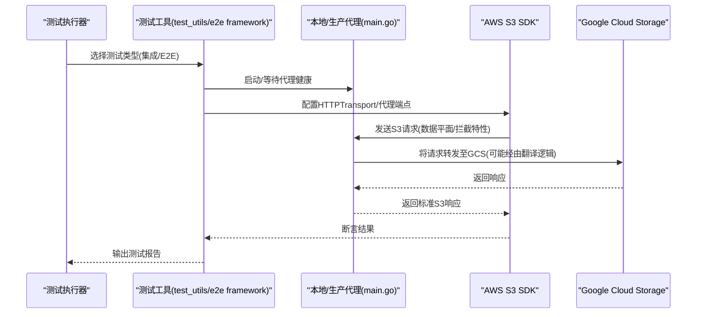
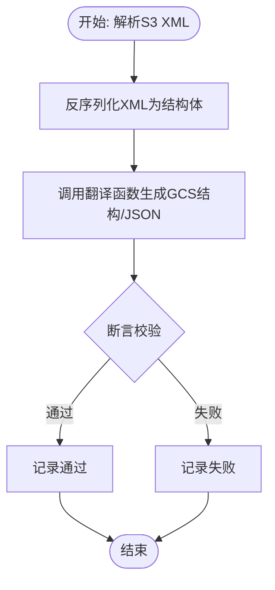
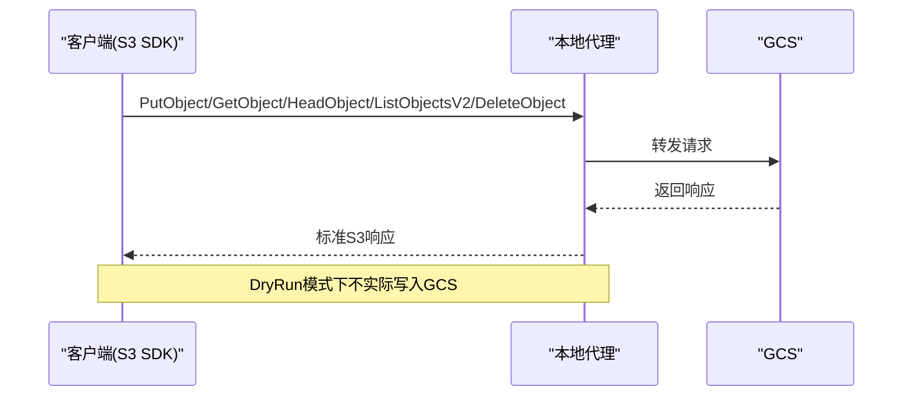
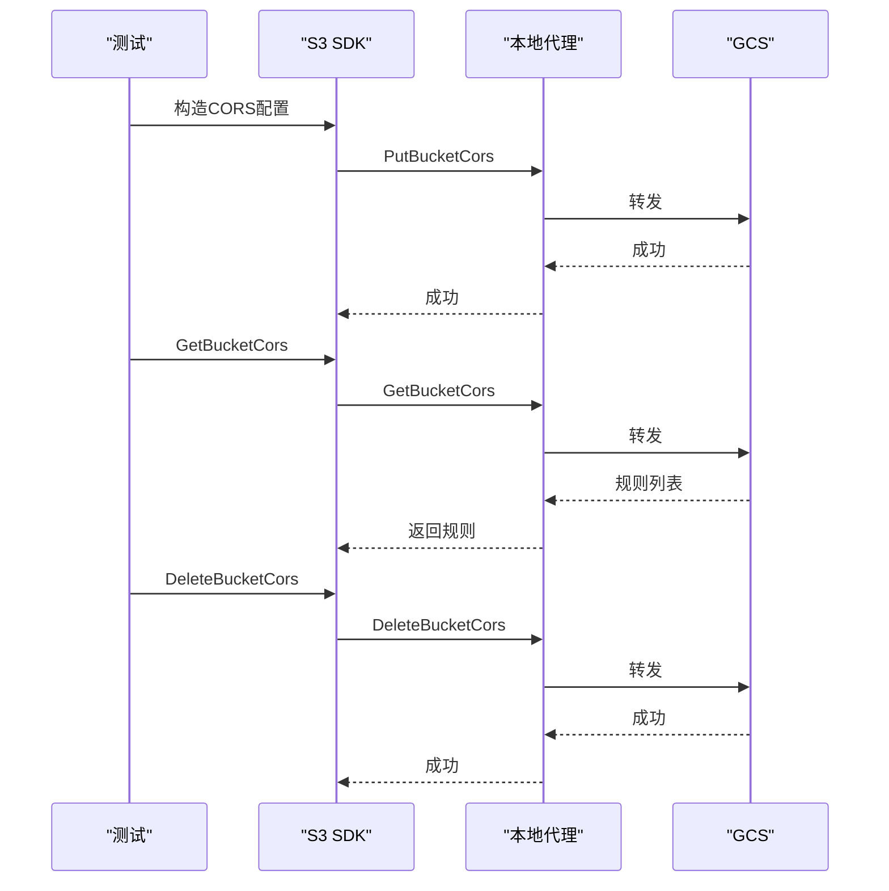
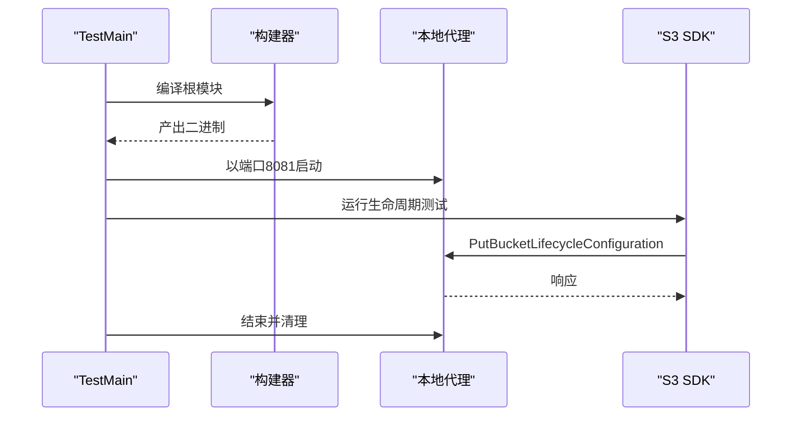
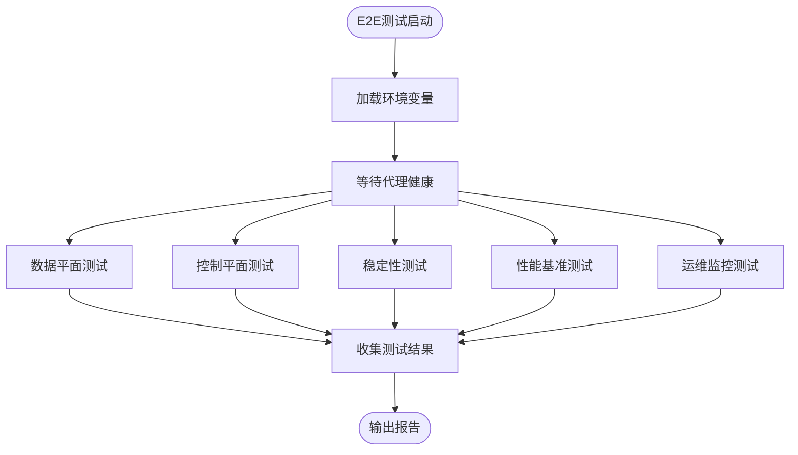
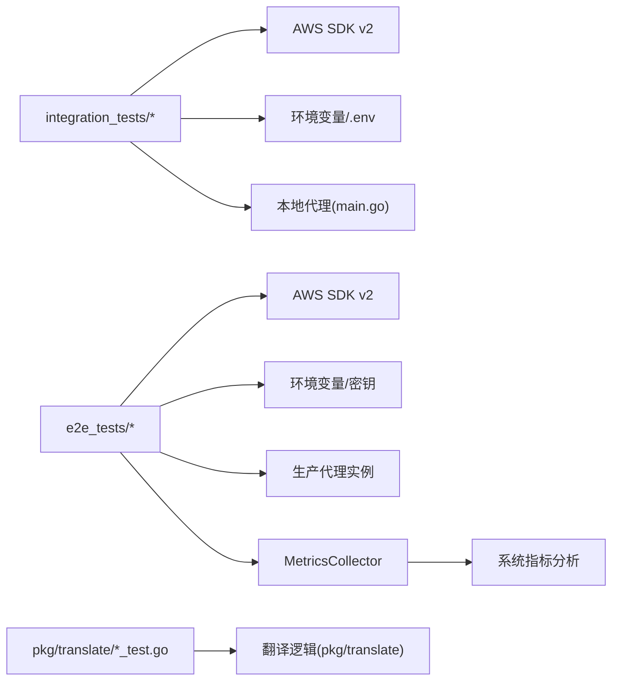

# 测试策略

<cite>
**本文引用的文件**
- [README.md](file://README.md)
- [test_cases.md](file://test_cases.md)
- [test_results.md](file://test_results.md)
- [integration_tests/go.mod](file://integration_tests/go.mod)
- [integration_tests/test_utils.go](file://integration_tests/test_utils.go)
- [integration_tests/data_plane_test.go](file://integration_tests/data_plane_test.go)
- [integration_tests/cors_test.go](file://integration_tests/cors_test.go)
- [integration_tests/lifecycle_test.go](file://integration_tests/lifecycle_test.go)
- [integration_tests/logging_test.go](file://integration_tests/logging_test.go)
- [integration_tests/storage_class_test.go](file://integration_tests/storage_class_test.go)
- [integration_tests/tagging_test.go](file://integration_tests/tagging_test.go)
- [integration_tests/versioning_test.go](file://integration_tests/versioning_test.go)
- [pkg/translate/gcs_cors_test.go](file://pkg/translate/gcs_cors_test.go)
- [pkg/translate/gcs_lifecycle_test.go](file://pkg/translate/gcs_lifecycle_test.go)
- [pkg/translate/gcs_logging_test.go](file://pkg/translate/gcs_logging_test.go)
- [pkg/translate/gcs_tagging_test.go](file://pkg/translate/gcs_tagging_test.go)
- [e2e_tests/go.mod](file://e2e_tests/go.mod)
- [e2e_tests/framework.go](file://e2e_tests/framework.go)
- [e2e_tests/data_plane_test.go](file://e2e_tests/data_plane_test.go)
- [e2e_tests/control_plane_test.go](file://e2e_tests/control_plane_test.go)
- [e2e_tests/stability_test.go](file://e2e_tests/stability_test.go)
- [e2e_tests/benchmark_test.go](file://e2e_tests/benchmark_test.go)
- [e2e_tests/ops_test.go](file://e2e_tests/ops_test.go)
- [e2e_tests/framework_test.go](file://e2e_tests/framework_test.go)
- [e2e_tests/metrics_collector.go](file://e2e_tests/metrics_collector.go)
- [.github/workflows/e2e-tests.yml](file://.github/workflows/e2e-tests.yml)
</cite>

## 目录
1. [引言](#引言)
2. [项目结构](#项目结构)
3. [核心组件](#核心组件)
4. [架构总览](#架构总览)
5. [详细组件分析](#详细组件分析)
6. [依赖关系分析](#依赖关系分析)
7. [性能考量](#性能考量)
8. [故障排查指南](#故障排查指南)
9. [结论](#结论)
10. [附录](#附录)

## 引言
本测试策略文档面向 S3Proxy4GCS 的单元测试、集成测试和端到端(E2E)测试，系统化阐述测试组织结构、工具与辅助函数、用例设计思路与覆盖范围，并提供测试运行指南、结果分析与持续集成建议。项目采用"隔离的集成测试子模块"(integration_tests)、"独立的E2E测试模块"(e2e_tests)与"核心包内单元测试"(pkg/translate)三轨并行的方式，确保对数据平面、拦截翻译功能、真实GCS交互以及完整端到端验证的全面覆盖。

**更新** 新增端到端测试套件章节，详细介绍 e2e_tests 模块的完整测试框架，包括数据平面、控制平面、稳定性、性能基准和运维监控测试。

## 项目结构
- 根目录提供主程序入口与配置模块，集成测试位于独立子模块 integration_tests，E2E测试位于独立子模块 e2e_tests，核心翻译逻辑位于 pkg/translate。
- README 提供了集成测试和E2E测试运行方式与模块隔离说明；integration_tests/go.mod 和 e2e_tests/go.mod 分别明确其对外部AWS SDK的依赖；各测试文件按功能分组，便于扩展与维护。

```mermaid
graph TB
subgraph "根模块"
MAIN["main.go"]
CFG["config/settings.go"]
end
subgraph "翻译包"
TPKG["pkg/translate/*_test.go"]
end
subgraph "集成测试模块"
ITMOD["integration_tests/"]
ITDATA["data_plane_test.go"]
ITLIFE["lifecycle_test.go"]
ITLOG["logging_test.go"]
ITTAG["tagging_test.go"]
ITSC["storage_class_test.go"]
ITVER["versioning_test.go"]
ITUTIL["test_utils.go"]
ITGO["go.mod"]
end
subgraph "E2E测试模块"
E2EMOD["e2e_tests/"]
E2EFW["framework.go"]
E2EDATA["data_plane_test.go"]
E2ECONTROL["control_plane_test.go"]
E2ESTABILITY["stability_test.go"]
E2EBENCH["benchmark_test.go"]
E2EOPS["ops_test.go"]
E2EMETRICS["metrics_collector.go"]
E2EFRAMEWORK["framework_test.go"]
E2EGO["go.mod"]
end
MAIN --> ITMOD
CFG --> ITMOD
MAIN --> E2EMOD
CFG --> E2EMOD
TPKG --> ITMOD
TPKG --> E2EMOD
ITUTIL --> ITDATA
ITUTIL --> ITLIFE
ITUTIL --> ITLOG
ITUTIL --> ITTAG
ITUTIL --> ITSC
ITUTIL --> ITVER
E2EFW --> E2EDATA
E2EFW --> E2ECONTROL
E2EFW --> E2ESTABILITY
E2EFW --> E2EBENCH
E2EFW --> E2EOPS
E2EMETRICS --> E2ESTABILITY
E2EMETRICS --> E2EBENCH
```

**图表来源**
- [README.md:112-124](file://README.md#L112-L124)
- [integration_tests/go.mod:1-32](file://integration_tests/go.mod#L1-L32)
- [e2e_tests/go.mod:1-33](file://e2e_tests/go.mod#L1-L33)

**章节来源**
- [README.md:112-124](file://README.md#L112-L124)
- [integration_tests/go.mod:1-32](file://integration_tests/go.mod#L1-L32)
- [e2e_tests/go.mod:1-33](file://e2e_tests/go.mod#L1-L33)

## 核心组件
- 单元测试（pkg/translate）
  - 针对 S3 到 GCS 的 XML/JSON 转换逻辑进行断言，覆盖 CORS、生命周期、日志、标签等特性。
  - 使用轻量字符串匹配与 XML 解析验证输出结构，避免引入重型依赖。
- 集成测试（integration_tests）
  - 使用 AWS SDK v2 构造真实请求，通过本地代理路由到 GCS，验证端到端行为。
  - 通过环境变量或父级 .env 解析测试参数，支持 DryRun 模式下的安全验证。
  - 以独立 go.mod 隔离外部依赖，保证与主模块解耦。
- E2E测试（e2e_tests）
  - 使用独立的Go模块，针对**生产环境**的实时代理实例进行端到端验证。
  - 提供数据平面测试、控制平面测试、稳定性测试、性能基准测试和健康监控测试。
  - 通过环境变量配置代理端点、GCS凭证和测试参数，支持并发和长时运行测试。

**更新** E2E测试模块包含完整的测试框架，包括环境配置、客户端创建、健康检查、辅助函数和系统指标收集。

**章节来源**
- [pkg/translate/gcs_cors_test.go:1-55](file://pkg/translate/gcs_cors_test.go#L1-L55)
- [pkg/translate/gcs_lifecycle_test.go:1-103](file://pkg/translate/gcs_lifecycle_test.go#L1-L103)
- [pkg/translate/gcs_logging_test.go:1-55](file://pkg/translate/gcs_logging_test.go#L1-L55)
- [pkg/translate/gcs_tagging_test.go:1-52](file://pkg/translate/gcs_tagging_test.go#L1-L52)
- [integration_tests/test_utils.go:1-113](file://integration_tests/test_utils.go#L1-L113)
- [e2e_tests/framework.go:1-151](file://e2e_tests/framework.go#L1-L151)
- [e2e_tests/go.mod:1-33](file://e2e_tests/go.mod#L1-L33)

## 架构总览
下图展示了三种测试层次从启动到执行的整体流程，以及与翻译包单元测试的职责边界。

**图表来源**
- [integration_tests/data_plane_test.go:15-106](file://integration_tests/data_plane_test.go#L15-L106)
- [integration_tests/lifecycle_test.go:20-55](file://integration_tests/lifecycle_test.go#L20-L55)
- [integration_tests/logging_test.go:18-99](file://integration_tests/logging_test.go#L18-L99)
- [integration_tests/tagging_test.go:16-98](file://integration_tests/tagging_test.go#L16-L98)
- [integration_tests/storage_class_test.go:16-65](file://integration_tests/storage_class_test.go#L16-L65)
- [integration_tests/versioning_test.go:15-136](file://integration_tests/versioning_test.go#L15-L136)
- [integration_tests/test_utils.go:9-113](file://integration_tests/test_utils.go#L9-L113)
- [e2e_tests/framework_test.go:14-52](file://e2e_tests/framework_test.go#L14-L52)
- [e2e_tests/data_plane_test.go:15-300](file://e2e_tests/data_plane_test.go#L15-L300)

## 详细组件分析

### 单元测试：翻译包（pkg/translate）
- CORS 翻译
  - 输入：S3 XML CORS 配置
  - 断言：规则数量、允许源、方法、暴露头、最大缓存时间等字段映射正确
- 生命周期翻译
  - 输入：S3 XML 生命周期配置（含前缀过滤、多过渡）
  - 断言：生成 JSON 包含删除与存储类转换动作，且包含期望的前缀匹配条件
- 日志配置翻译
  - 输入：S3 XML BucketLoggingStatus
  - 断言：启用时返回目标桶与前缀，禁用时返回空值
- 标签翻译
  - 输入：S3 XML Tagging
  - 断言：键值对映射为 GCS 自定义元数据，旧键被清理，其他元数据保留

**图表来源**
- [pkg/translate/gcs_cors_test.go:11-54](file://pkg/translate/gcs_cors_test.go#L11-L54)
- [pkg/translate/gcs_lifecycle_test.go:8-56](file://pkg/translate/gcs_lifecycle_test.go#L8-L56)
- [pkg/translate/gcs_logging_test.go:8-36](file://pkg/translate/gcs_logging_test.go#L8-L36)
- [pkg/translate/gcs_tagging_test.go:8-51](file://pkg/translate/gcs_tagging_test.go#L8-L51)

**章节来源**
- [pkg/translate/gcs_cors_test.go:1-55](file://pkg/translate/gcs_cors_test.go#L1-L55)
- [pkg/translate/gcs_lifecycle_test.go:1-103](file://pkg/translate/gcs_lifecycle_test.go#L1-L103)
- [pkg/translate/gcs_logging_test.go:1-55](file://pkg/translate/gcs_logging_test.go#L1-L55)
- [pkg/translate/gcs_tagging_test.go:1-52](file://pkg/translate/gcs_tagging_test.go#L1-L52)

### 集成测试：数据平面与多部分上传
- 数据平面
  - 行为：PutObject、GetObject、HeadObject、ListObjectsV2、DeleteObject
  - 断言：每个操作成功返回，对象存在性与可访问性得到验证
- 多部分上传
  - 行为：CreateMultipartUpload、UploadPart、CompleteMultipartUpload、AbortMultipartUpload
  - 断言：创建与上传成功，完成/中止在 DryRun 下可选失败但不阻塞测试

**图表来源**
- [integration_tests/data_plane_test.go:15-106](file://integration_tests/data_plane_test.go#L15-L106)

**章节来源**
- [integration_tests/data_plane_test.go:1-202](file://integration_tests/data_plane_test.go#L1-L202)

### 集成测试：CORS 配置
- 行为：PutBucketCors、GetBucketCors、DeleteBucketCors
- 断言：获取规则数量非零，删除后状态一致
- 特殊处理：移除 x-id 查询参数与 User-Agent，适配 GCS 参数要求

**图表来源**
- [integration_tests/cors_test.go:18-112](file://integration_tests/cors_test.go#L18-L112)

**章节来源**
- [integration_tests/cors_test.go:1-112](file://integration_tests/cors_test.go#L1-L112)

### 集成测试：生命周期管理
- 行为：PutBucketLifecycleConfiguration（单/多过渡）
- 断言：请求成功或按代理预期响应
- 启动流程：构建根模块二进制 → 启动本地代理 → 运行测试 → 清理

**图表来源**
- [integration_tests/lifecycle_test.go:20-188](file://integration_tests/lifecycle_test.go#L20-L188)

**章节来源**
- [integration_tests/lifecycle_test.go:1-188](file://integration_tests/lifecycle_test.go#L1-L188)

### 集成测试：日志配置
- 行为：PutBucketLogging、GetBucketLogging
- 断言：设置后能正确读取目标桶与前缀

**章节来源**
- [integration_tests/logging_test.go:1-99](file://integration_tests/logging_test.go#L1-L99)

### 集成测试：对象标签
- 行为：PutObject、PutObjectTagging、GetObjectTagging
- 断言：标签数量与内容正确

**章节来源**
- [integration_tests/tagging_test.go:1-98](file://integration_tests/tagging_test.go#L1-L98)

### 集成测试：存储类别
- 行为：PutObject（带 STANDARD_IA）
- 断言：请求成功（DryRun）

**章节来源**
- [integration_tests/storage_class_test.go:1-65](file://integration_tests/storage_class_test.go#L1-L65)

### 集成测试：版本控制互操作
- 行为：ListObjectVersions、HeadObject（VersionId 映射）
- 断言：响应包含 VersionId 并与创建时一致

**章节来源**
- [integration_tests/versioning_test.go:1-136](file://integration_tests/versioning_test.go#L1-L136)

### E2E测试：端到端验证框架
- **测试框架**
  - 环境配置：LoadEnv() 读取 PROXY_ENDPOINT、GCS_HMAC_ACCESS、GCS_HMAC_SECRET、TEST_BUCKET、TEST_PREFIX
  - 客户端创建：NewS3Client() 配置AWS SDK使用代理端点和GCS HMAC认证
  - 健康检查：WaitForProxy() 等待 /health 端点可用
  - 辅助函数：GenerateTestKey() 生成唯一测试键，Cleanup() 清理测试对象
- **数据平面测试**
  - ObjectCRUD：完整的对象生命周期验证（Put → Get → Head → Delete → Get(404)）
  - MultipartUpload：多部分上传的 Create → Upload 2 parts → Complete → Get → Cleanup
  - StorageClassTranslation：存储类别头部正确翻译
  - ListObjectsV2：前缀过滤的对象列表验证
  - Versioning：版本控制通过代理的验证
- **控制平面测试**
  - LifecycleCRUD：生命周期配置的完整 CRUD 循环
  - CORSCRUD：CORS 配置的完整 CRUD 循环
  - LoggingCRUD：日志配置的完整 CRUD 循环
  - WebsiteCRUD：静态网站配置的完整 CRUD 循环
  - TaggingCRUD：对象标签的完整 CRUD 循环
- **稳定性测试**
  - LongRunningCRUD：重复执行对象 CRUD 循环验证稳定性
  - ConcurrentOperations：N个协程并发执行 CRUD 验证并发安全性
  - ControlPlaneConcurrency：并发访问控制平面验证稳定性
- **性能基准测试**
  - PutObject_1KB：1KB 对象的 Put 性能
  - GetObject_1KB：1KB 对象的 Get 性能
  - PutGetDelete_CRUD：完整的 CRUD 循环性能
  - PutBucketLifecycle：控制平面 Put 操作性能
  - 输出 JSON 报告包含时间戳、代理端点和各项指标
- **运维监控测试**
  - HealthEndpoint：GET /health 返回 200 OK
  - ReadyzEndpoint：GET /readyz 返回 200 并包含 ready 字段
  - MetricsEndpoint：GET /metrics 返回 Prometheus 指标，验证 s3proxy_* 前缀指标

**图表来源**
- [e2e_tests/framework.go:29-64](file://e2e_tests/framework.go#L29-L64)
- [e2e_tests/framework_test.go:14-52](file://e2e_tests/framework_test.go#L14-L52)
- [e2e_tests/data_plane_test.go:15-300](file://e2e_tests/data_plane_test.go#L15-L300)
- [e2e_tests/control_plane_test.go:13-366](file://e2e_tests/control_plane_test.go#L13-L366)
- [e2e_tests/stability_test.go:38-235](file://e2e_tests/stability_test.go#L38-L235)
- [e2e_tests/benchmark_test.go:89-241](file://e2e_tests/benchmark_test.go#L89-L241)
- [e2e_tests/ops_test.go:10-86](file://e2e_tests/ops_test.go#L10-L86)

**章节来源**
- [e2e_tests/framework.go:1-151](file://e2e_tests/framework.go#L1-L151)
- [e2e_tests/data_plane_test.go:1-300](file://e2e_tests/data_plane_test.go#L1-L300)
- [e2e_tests/control_plane_test.go:1-366](file://e2e_tests/control_plane_test.go#L1-L366)
- [e2e_tests/stability_test.go:1-235](file://e2e_tests/stability_test.go#L1-L235)
- [e2e_tests/benchmark_test.go:1-241](file://e2e_tests/benchmark_test.go#L1-L241)
- [e2e_tests/ops_test.go:1-86](file://e2e_tests/ops_test.go#L1-L86)

### E2E测试：系统指标收集与分析
- **MetricsCollector**
  - 通过 /metrics 端点抓取 Prometheus 指标，包括 CPU 使用率、内存、goroutines、HTTP 请求计数等
  - 支持快照对比计算系统资源变化，用于稳定性测试和性能基准分析
  - 提供解析 Prometheus 文本格式指标的辅助函数
- **ComputeDelta**
  - 计算两次快照之间的系统资源变化，包括 CPU 百分比、内存增量、goroutine 增量等
  - 用于量化测试对系统资源的影响

**章节来源**
- [e2e_tests/metrics_collector.go:1-154](file://e2e_tests/metrics_collector.go#L1-L154)

## 依赖关系分析
- 集成测试模块依赖 AWS SDK v2（S3、Config），并通过自定义 HTTP Transport 将 GCS 地址重定向到本地代理。
- E2E测试模块依赖 AWS SDK v2（S3、Config），但直接连接生产环境代理实例，使用GCS HMAC凭证进行认证。
- 测试工具从环境变量或父级 .env 文件解析 TARGET_BUCKET、GCS_PREFIX、AWS 凭证等参数，避免硬编码。
- 单元测试仅依赖标准库与翻译包内部逻辑，不涉及网络。
- E2E测试框架提供统一的环境配置、客户端创建和健康检查机制。

**图表来源**
- [integration_tests/go.mod:8-31](file://integration_tests/go.mod#L8-L31)
- [integration_tests/test_utils.go:9-113](file://integration_tests/test_utils.go#L9-L113)
- [e2e_tests/go.mod:9-32](file://e2e_tests/go.mod#L9-L32)
- [e2e_tests/framework.go:66-109](file://e2e_tests/framework.go#L66-L109)

**章节来源**
- [integration_tests/go.mod:1-32](file://integration_tests/go.mod#L1-L32)
- [integration_tests/test_utils.go:1-113](file://integration_tests/test_utils.go#L1-L113)
- [e2e_tests/go.mod:1-33](file://e2e_tests/go.mod#L1-L33)
- [e2e_tests/framework.go:1-151](file://e2e_tests/framework.go#L1-L151)

## 性能考量
- AWS SDK 校验开销：在集成测试中通过环境变量将请求/响应校验设为按需，减少不必要的校验成本。
- 连接池与传输层：通过自定义 Transport 控制 DialContext，降低网络延迟并避免不必要的重试。
- DryRun 模式：在本地快速验证请求路径，避免真实 GCS 写入带来的性能与成本开销。
- E2E测试优化：
  - 连接池配置：MaxIdleConns=100，MaxIdleConnsPerHost=100，IdleConnTimeout=90s
  - 超时设置：HTTP客户端超时60s，健康检查超时30s
  - 并发控制：稳定性测试支持可配置的并发级别和轮次
  - 基准测试：固定迭代次数50次，计算p50/p95/p99百分位数
  - 系统指标收集：通过 Prometheus 指标监控 CPU、内存、goroutines 等资源使用
- CI/CD优化：GitHub Actions工作流支持并行执行三个测试套件，分别针对功能、稳定性和性能

**章节来源**
- [integration_tests/lifecycle_test.go:28-31](file://integration_tests/lifecycle_test.go#L28-L31)
- [integration_tests/data_plane_test.go:16-24](file://integration_tests/data_plane_test.go#L16-L24)
- [README.md:24](file://README.md#L24)
- [e2e_tests/framework.go:94-106](file://e2e_tests/framework.go#L94-L106)
- [e2e_tests/stability_test.go:20-36](file://e2e_tests/stability_test.go#L20-L36)
- [e2e_tests/benchmark_test.go:87](file://e2e_tests/benchmark_test.go#L87)
- [e2e_tests/metrics_collector.go:70-82](file://e2e_tests/metrics_collector.go#L70-L82)
- [.github/workflows/e2e-tests.yml:21-108](file://.github/workflows/e2e-tests.yml#L21-L108)

## 故障排查指南
- 环境变量未生效
  - 检查 .env 或环境变量是否正确设置 TARGET_BUCKET、GCS_PREFIX、AWS_ACCESS_KEY_ID、AWS_SECRET_ACCESS_KEY。
  - 若 .env 不存在，测试工具会回退到默认值，可能导致测试失败。
  - E2E测试需要 PROXY_ENDPOINT、GCS_HMAC_ACCESS、GCS_HMAC_SECRET、TEST_BUCKET 等环境变量。
- 代理未启动或端口占用
  - 确认本地代理以端口 8081 正常启动；若 TestMain 中构建失败或进程无法终止，需检查根模块编译与权限。
  - E2E测试使用 WaitForProxy() 等待代理健康，超时时间为30秒。
- 请求被拒绝或参数错误
  - 对于 CORS/日志/网站等特性，确认已移除 x-id 与 User-Agent，或在 APIOptions 中添加必要的中间件修复。
  - E2E测试框架自动处理代理端点配置和认证。
- DryRun 导致某些操作失败
  - 如 CompleteMultipartUpload 在 DryRun 下可能失败，属于预期行为；关注日志与代理响应即可。
- E2E测试特定问题
  - 代理健康检查失败：检查 PROXY_ENDPOINT 是否可达，确认代理已启动
  - GCS认证失败：验证 GCS_HMAC_ACCESS 和 GCS_HMAC_SECRET 是否正确
  - 测试超时：调整 STABILITY_ROUNDS 和 CONCURRENCY 环境变量
  - 并发测试失败：检查代理资源限制和网络连接数
  - 系统指标收集失败：确认 /metrics 端点可访问且返回有效指标

**章节来源**
- [integration_tests/test_utils.go:9-113](file://integration_tests/test_utils.go#L9-L113)
- [integration_tests/lifecycle_test.go:20-55](file://integration_tests/lifecycle_test.go#L20-L55)
- [integration_tests/cors_test.go:51-68](file://integration_tests/cors_test.go#L51-L68)
- [integration_tests/logging_test.go:51-68](file://integration_tests/logging_test.go#L51-L68)
- [e2e_tests/framework_test.go:30-35](file://e2e_tests/framework_test.go#L30-L35)
- [e2e_tests/framework.go:31-64](file://e2e_tests/framework.go#L31-L64)

## 结论
本测试策略通过"单元测试 + 集成测试 + E2E测试"的三层测试体系，既保证了翻译逻辑的精确性，又验证了真实 S3 客户端与本地代理到 GCS 的端到端行为，最终提供了针对生产环境的完整端到端验证能力。隔离的集成测试模块和独立的E2E测试模块分别服务于不同场景：集成测试适合本地开发和CI流水线，E2E测试适合生产环境验证和性能评估。DryRun 模式和独立模块设计提升了本地开发效率和测试可靠性。

**更新** 新的 E2E测试框架提供了更全面的测试覆盖，包括数据平面、控制平面、稳定性、性能基准和运维监控测试，配合系统指标收集功能，能够深入分析代理在不同负载下的表现和资源使用情况。

建议在新增特性时同步补充单元、集成和E2E测试，并遵循现有断言风格与环境参数解析模式。

## 附录

### 测试用例设计思路与覆盖范围
- 数据平面：覆盖常见对象操作与多部分上传关键路径，确保代理转发与错误码符合预期。
- 拦截特性：CORS、日志、静态网站、标签、生命周期、存储类别、版本控制互操作，均以单元与集成测试双重验证。
- E2E测试覆盖：数据平面、控制平面、稳定性、性能基准和运维监控的完整端到端验证。
- 覆盖范围参考：测试用例清单与当前验证状态见 test_cases.md 与 test_results.md。

**章节来源**
- [test_cases.md:1-76](file://test_cases.md#L1-L76)
- [test_results.md:1-36](file://test_results.md#L1-L36)

### 测试运行指南
- 单元测试
  - 在根目录执行：go test -v ./pkg/translate
- 集成测试
  - 进入 integration_tests 目录，初始化模块并运行测试：
    - go mod tidy
    - go test -v ./...
  - README 提供了直接运行集成测试的步骤与注意事项。
- E2E测试
  - 进入 e2e_tests 目录，设置环境变量并运行：
    - go mod tidy
    - go test -v -count=1 ./...
  - 支持按套件运行：Functional、Stability、Benchmark
  - README 提供了详细的环境变量配置和运行示例。

**更新** E2E测试支持多种运行模式：
- 全量测试：运行所有测试套件
- 功能测试：仅运行数据平面和控制平面测试
- 稳定性测试：运行长时间运行和并发测试
- 性能基准测试：运行性能测试并生成基准报告

**章节来源**
- [README.md:112-124](file://README.md#L112-L124)
- [integration_tests/go.mod:1-32](file://integration_tests/go.mod#L1-L32)
- [README.md:203-274](file://README.md#L203-L274)
- [e2e_tests/go.mod:1-33](file://e2e_tests/go.mod#L1-L33)

### 测试结果分析
- 已验证特性：CORS、数据平面、多部分上传、生命周期（单/多过渡）、日志、存储类别、标签、版本控制互操作。
- E2E测试结果：数据平面、控制平面、稳定性、性能基准和运维监控的完整验证。
- 不支持/延期特性：多对象删除、UploadPartCopy、RestoreObject、aws-chunked trailers 等，详见 test_results.md。

**更新** E2E测试结果包含：
- 功能测试：验证 CRUD 操作和各种配置的正确性
- 稳定性测试：长时间运行和并发场景下的系统稳定性
- 性能基准：多负载级别的性能指标和资源使用情况
- 运维监控：健康检查、就绪检查和指标监控的有效性

**章节来源**
- [test_results.md:1-36](file://test_results.md#L1-L36)

### 持续集成配置建议
- 构建与测试矩阵
  - 单元测试：在根模块执行 go test ./pkg/translate
  - 集成测试：在 integration_tests 执行 go test ./...
  - E2E测试：在 e2e_tests 执行 go test ./...，支持并行执行三个测试套件
- 环境准备
  - 设置 AWS 凭证与 GCS 目标桶信息（建议使用受控测试账号）
  - 可选：开启 DEBUG_LOGGING 以便 CI 收集日志
  - E2E测试需要 GitHub Secrets：GCS_HMAC_ACCESS、GCS_HMAC_SECRET、TEST_BUCKET
- 并发与超时
  - 为代理启动与测试执行设置合理超时，避免 CI 资源浪费
  - E2E测试工作流支持并行执行，提高测试效率
- 报告与归档
  - 归档测试日志与代理输出，便于问题复现与审计
  - E2E基准测试输出 benchmark_report.json 作为工件
  - 稳定性测试和性能测试的系统指标可用于长期趋势分析

**更新** GitHub Actions 工作流现已支持：
- 功能测试：验证基本 CRUD 和配置操作
- 稳定性测试：长时间运行和并发压力测试
- 性能基准测试：多负载级别的性能评估
- 并行执行：三个测试套件并行运行，缩短整体测试时间

**章节来源**
- [.github/workflows/e2e-tests.yml:1-108](file://.github/workflows/e2e-tests.yml#L1-L108)

### 编写新测试用例与扩展现有套件
- 新增单元测试
  - 在 pkg/translate 下新增 *_test.go，遵循现有断言风格（XML 解析 + 结构体/JSON 关键字检查）
- 新增集成测试
  - 在 integration_tests 下新增 *_test.go，复用 test_utils 的环境解析函数
  - 如需代理参与，可在 TestMain 中构建并启动本地代理，或在测试中直接构造 S3 SDK 客户端
- 新增E2E测试
  - 在 e2e_tests 下新增 *_test.go，使用现有的测试框架和辅助函数
  - 遵循统一的环境变量配置和断言风格
  - 支持数据平面、控制平面、稳定性、性能基准和运维监控测试
  - 利用 MetricsCollector 进行系统资源监控
- 最佳实践
  - 使用 DryRun 模式进行本地快速验证
  - 对于需要真实 GCS 的场景，确保 .env 或环境变量正确配置
  - 保持测试命名与现有风格一致，便于维护与检索
  - E2E测试应包含健康检查、清理和错误处理
  - 性能测试应包含适当的统计分析和报告输出
  - 稳定性测试应考虑系统资源监控和异常处理

**更新** 新增测试用例时建议：
- 遵循现有的测试命名约定（如 TestObjectCRUD、TestLifecycleCRUD）
- 使用统一的断言风格和错误处理机制
- 在稳定性测试中考虑系统资源监控
- 性能测试应包含多负载级别的基准数据
- 运维监控测试应验证关键操作端点的可用性