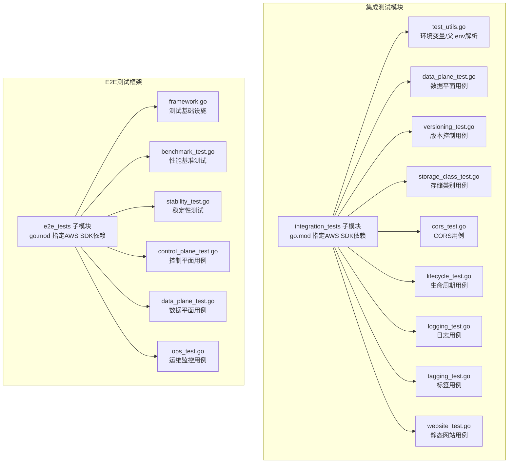
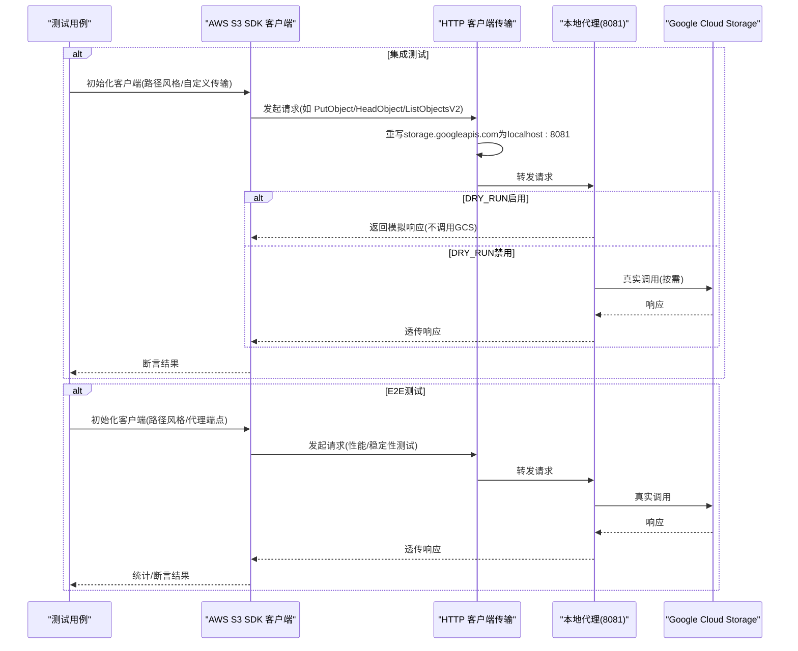
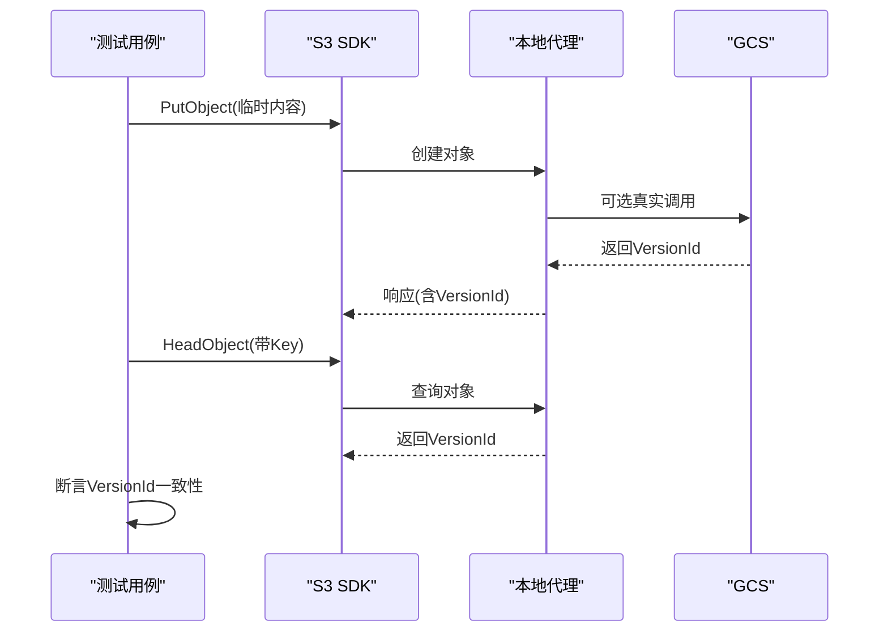
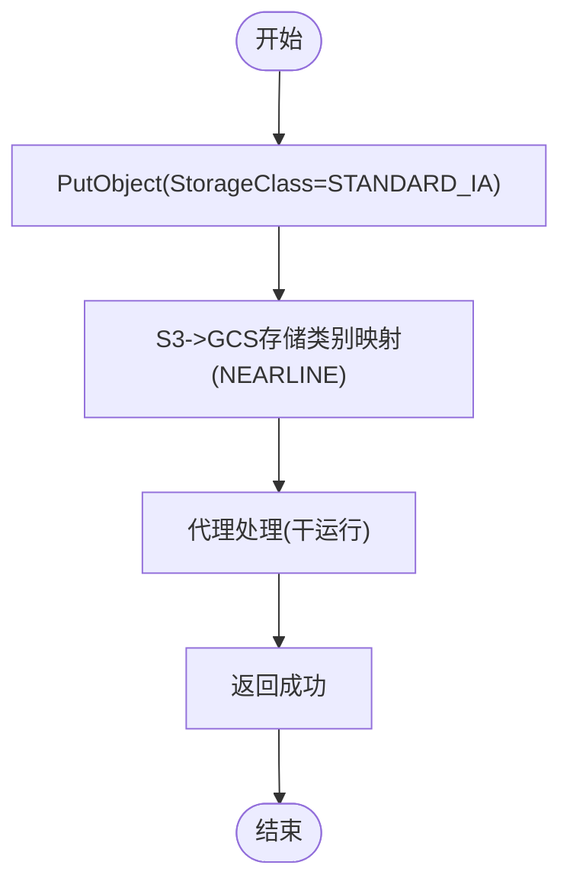
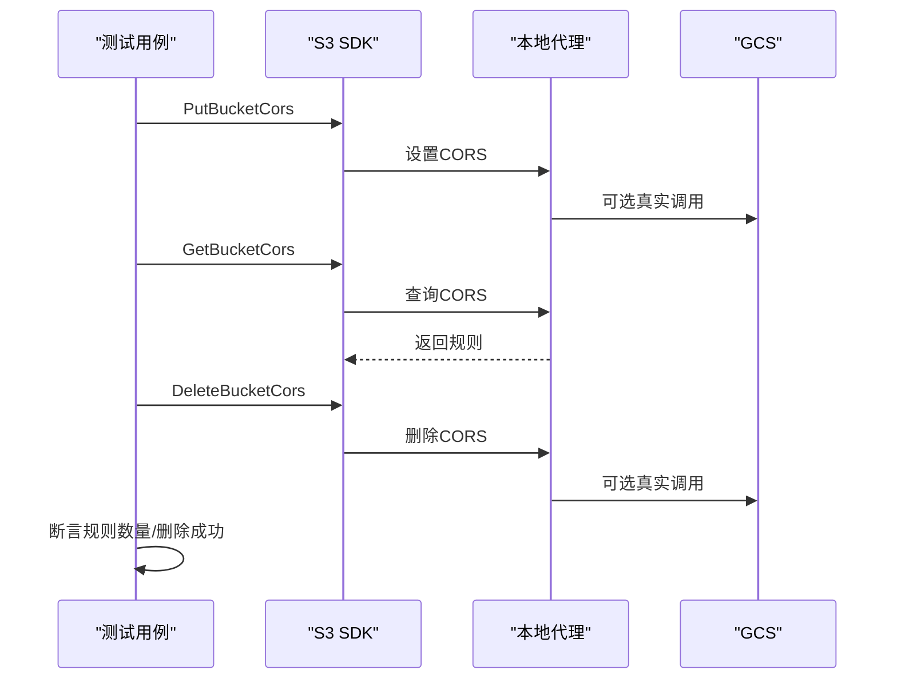
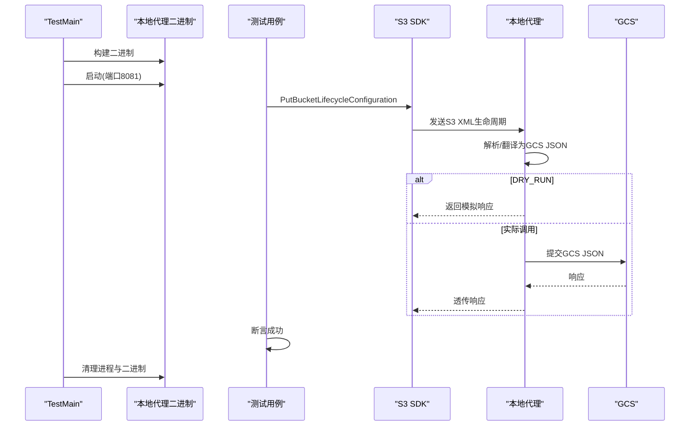
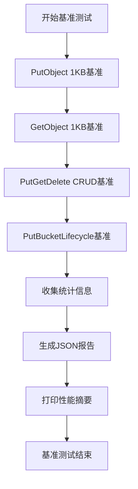
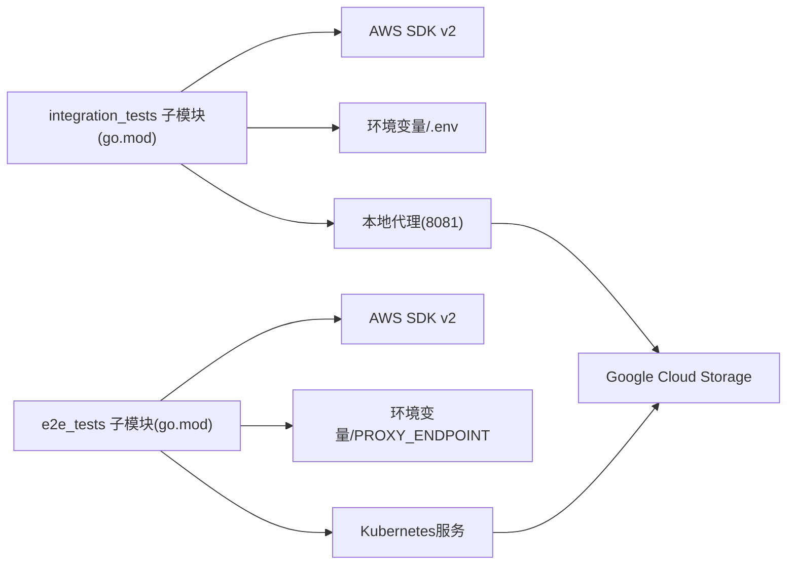

# 集成测试

<cite>
**本文引用的文件**
- [README.md](file://README.md)
- [integration_tests/go.mod](file://integration_tests/go.mod)
- [integration_tests/test_utils.go](file://integration_tests/test_utils.go)
- [integration_tests/data_plane_test.go](file://integration_tests/data_plane_test.go)
- [integration_tests/versioning_test.go](file://integration_tests/versioning_test.go)
- [integration_tests/storage_class_test.go](file://integration_tests/storage_class_test.go)
- [integration_tests/cors_test.go](file://integration_tests/cors_test.go)
- [integration_tests/lifecycle_test.go](file://integration_tests/lifecycle_test.go)
- [integration_tests/logging_test.go](file://integration_tests/logging_test.go)
- [integration_tests/tagging_test.go](file://integration_tests/tagging_test.go)
- [integration_tests/website_test.go](file://integration_tests/website_test.go)
- [e2e_tests/go.mod](file://e2e_tests/go.mod)
- [e2e_tests/framework.go](file://e2e_tests/framework.go)
- [e2e_tests/benchmark_test.go](file://e2e_tests/benchmark_test.go)
- [e2e_tests/stability_test.go](file://e2e_tests/stability_test.go)
- [e2e_tests/control_plane_test.go](file://e2e_tests/control_plane_test.go)
- [e2e_tests/data_plane_test.go](file://e2e_tests/data_plane_test.go)
- [e2e_tests/ops_test.go](file://e2e_tests/ops_test.go)
- [.github/workflows/e2e-tests.yml](file://.github/workflows/e2e-tests.yml)
- [pkg/translate/gcs_lifecycle.go](file://pkg/translate/gcs_lifecycle.go)
- [pkg/translate/gcs_cors.go](file://pkg/translate/gcs_cors.go)
</cite>

## 更新摘要
**变更内容**
- 新增E2E测试框架章节，详细介绍端到端验收测试策略
- 增强测试策略分析，涵盖性能基准和稳定性测试
- 更新测试架构图，展示E2E测试与集成测试的协同关系
- 新增运维监控测试章节，包括健康检查、就绪检查和指标监控
- 扩展持续集成配置，支持E2E测试的完整流水线

## 目录
1. [简介](#简介)
2. [项目结构](#项目结构)
3. [核心组件](#核心组件)
4. [架构总览](#架构总览)
5. [详细组件分析](#详细组件分析)
6. [E2E测试框架](#e2e测试框架)
7. [依赖分析](#依赖分析)
8. [性能考虑](#性能考虑)
9. [故障排查指南](#故障排查指南)
10. [结论](#结论)
11. [附录](#附录)

## 简介
本文件面向S3Proxy4GCS的测试体系，系统性阐述集成测试模块（integration_tests）和E2E测试框架的设计与架构。集成测试专注于AWS S3 Go SDK的端到端验证，而E2E测试框架则提供更全面的端到端验收测试，包括性能基准和稳定性测试。两者共同构成了完整的测试策略，覆盖数据平面、控制平面、运维监控等关键场景，并提供持续集成配置支持。

## 项目结构
项目包含两个独立的测试模块：integration_tests用于传统集成测试，e2e_tests用于端到端验收测试。每个模块都有独立的Go模块和专用的测试工具函数。

**图表来源**
- [integration_tests/go.mod:1-32](file://integration_tests/go.mod#L1-L32)
- [e2e_tests/go.mod:1-33](file://e2e_tests/go.mod#L1-L33)
- [e2e_tests/framework.go:1-151](file://e2e_tests/framework.go#L1-L151)

**章节来源**
- [README.md:112-123](file://README.md#L112-L123)
- [integration_tests/go.mod:1-32](file://integration_tests/go.mod#L1-L32)
- [e2e_tests/go.mod:1-33](file://e2e_tests/go.mod#L1-L33)

## 核心组件
- **独立子模块**：integration_tests和e2e_tests各自使用独立go.mod隔离AWS SDK依赖，避免相互影响。
- **测试工具函数**：集成测试通过test_utils.go解析环境变量或父级.env文件，E2E测试通过framework.go提供统一的测试基础设施。
- **显式HTTP客户端传输**：集成测试通过自定义DialContext将storage.googleapis.com请求重定向到本地代理，E2E测试通过NewS3Client配置路径风格和代理端点。
- **自动化生命周期**：集成测试在lifecycle_test.go中构建并启动本地代理二进制，E2E测试通过WaitForProxy等待代理健康状态。
- **干运行模式**：集成测试支持DRY_RUN配置，E2E测试通过环境变量控制测试行为。

**章节来源**
- [integration_tests/go.mod:1-32](file://integration_tests/go.mod#L1-L32)
- [integration_tests/test_utils.go:1-113](file://integration_tests/test_utils.go#L1-L113)
- [e2e_tests/framework.go:66-109](file://e2e_tests/framework.go#L66-L109)
- [integration_tests/lifecycle_test.go:20-55](file://integration_tests/lifecycle_test.go#L20-L55)

## 架构总览
测试体系采用双层架构：底层是传统的集成测试，专注于功能验证；上层是E2E测试框架，提供端到端验收测试。两者都通过AWS S3 Go SDK与本地代理交互，但E2E测试增加了性能基准和稳定性测试。

**图表来源**
- [integration_tests/data_plane_test.go:15-106](file://integration_tests/data_plane_test.go#L15-L106)
- [e2e_tests/data_plane_test.go:15-300](file://e2e_tests/data_plane_test.go#L15-L300)
- [e2e_tests/framework.go:66-109](file://e2e_tests/framework.go#L66-L109)

## 详细组件分析

### 数据平面测试（对象操作）
- **目标**：验证标准对象操作（Put/Get/Head/List/Delete）与分段上传（Create/Upload/Complete/Abort）。
- **关键点**：
  - 集成测试使用自定义DialContext将GCS域名请求重定向到本地代理。
  - E2E测试通过NewS3Client配置BaseEndpoint指向代理端点，确保所有请求通过代理。
  - 分段上传测试采用"干运行"策略：创建上传后直接完成/中止，不依赖真实Part ETag。
- **断言**：每个步骤均记录日志并失败时终止，确保端到端链路可用。

**图表来源**
- [integration_tests/data_plane_test.go:15-201](file://integration_tests/data_plane_test.go#L15-L201)
- [e2e_tests/data_plane_test.go:85-166](file://e2e_tests/data_plane_test.go#L85-L166)

**章节来源**
- [integration_tests/data_plane_test.go:15-201](file://integration_tests/data_plane_test.go#L15-L201)
- [e2e_tests/data_plane_test.go:15-300](file://e2e_tests/data_plane_test.go#L15-L300)

### 版本控制测试
- **目标**：验证列出对象版本与带版本号的HeadObject行为。
- **关键点**：
  - 集成测试先创建对象以获取VersionId，再断言HeadObject返回的VersionId与预期一致。
  - E2E测试同样验证版本控制功能，但增加了更严格的版本ID检查。
  - 列出版本接口用于验证代理对版本列表的支持。
- **断言**：VersionId非空且与Put响应一致（若存在）。

**图表来源**
- [integration_tests/versioning_test.go:99-135](file://integration_tests/versioning_test.go#L99-L135)
- [e2e_tests/data_plane_test.go:250-299](file://e2e_tests/data_plane_test.go#L250-L299)

**章节来源**
- [integration_tests/versioning_test.go:15-136](file://integration_tests/versioning_test.go#L15-L136)
- [e2e_tests/data_plane_test.go:250-299](file://e2e_tests/data_plane_test.go#L250-L299)

### 存储类别测试
- **目标**：验证S3 STANDARD_IA映射到GCS NEARLINE的行为。
- **关键点**：
  - 集成测试通过PutObject时指定StorageClass为S3 STANDARD_IA，期望代理将其转换为GCS NEARLINE。
  - E2E测试同样验证存储类别翻译，但增加了更详细的日志记录。
  - 采用干运行策略，不实际写入GCS即可验证映射与转发逻辑。
- **断言**：请求成功返回（代理侧验证通过）。

**图表来源**
- [integration_tests/storage_class_test.go:51-63](file://integration_tests/storage_class_test.go#L51-L63)
- [e2e_tests/data_plane_test.go:168-198](file://e2e_tests/data_plane_test.go#L168-L198)
- [pkg/translate/gcs_lifecycle.go:139-154](file://pkg/translate/gcs_lifecycle.go#L139-L154)

**章节来源**
- [integration_tests/storage_class_test.go:16-64](file://integration_tests/storage_class_test.go#L16-L64)
- [e2e_tests/data_plane_test.go:168-198](file://e2e_tests/data_plane_test.go#L168-L198)
- [pkg/translate/gcs_lifecycle.go:139-154](file://pkg/translate/gcs_lifecycle.go#L139-L154)

### CORS测试
- **目标**：验证桶级CORS的设置、查询与删除。
- **关键点**：
  - 集成测试使用PutBucketCors设置规则，GetBucketCors校验返回规则数量，DeleteBucketCors清理。
  - E2E测试同样验证CORS功能，但增加了更严格的规则验证。
  - 通过自定义APIOptions移除特定中间件并修正参数，保证与GCS兼容。
- **断言**：各步骤均成功返回，Get返回至少一条规则。

**图表来源**
- [integration_tests/cors_test.go:70-111](file://integration_tests/cors_test.go#L70-L111)
- [e2e_tests/control_plane_test.go:86-153](file://e2e_tests/control_plane_test.go#L86-L153)
- [pkg/translate/gcs_cors.go:10-35](file://pkg/translate/gcs_cors.go#L10-L35)

**章节来源**
- [integration_tests/cors_test.go:18-111](file://integration_tests/cors_test.go#L18-L111)
- [e2e_tests/control_plane_test.go:86-153](file://e2e_tests/control_plane_test.go#L86-L153)
- [pkg/translate/gcs_cors.go:10-35](file://pkg/translate/gcs_cors.go#L10-L35)

### 生命周期测试
- **目标**：验证桶级生命周期配置的设置与多过渡规则支持。
- **关键点**：
  - 集成测试在TestMain中构建并启动本地代理二进制，测试完成后清理。
  - E2E测试通过WaitForProxy等待代理健康状态，确保测试环境准备就绪。
  - PutBucketLifecycleConfiguration发送S3 XML生命周期配置，代理将其翻译为GCS JSON。
  - 支持单个与多个过渡规则的场景。
- **断言**：请求成功返回（代理侧验证通过）。

**图表来源**
- [integration_tests/lifecycle_test.go:20-55](file://integration_tests/lifecycle_test.go#L20-L55)
- [integration_tests/lifecycle_test.go:57-187](file://integration_tests/lifecycle_test.go#L57-L187)
- [e2e_tests/control_plane_test.go:13-84](file://e2e_tests/control_plane_test.go#L13-L84)
- [pkg/translate/gcs_lifecycle.go:38-105](file://pkg/translate/gcs_lifecycle.go#L38-L105)

**章节来源**
- [integration_tests/lifecycle_test.go:20-188](file://integration_tests/lifecycle_test.go#L20-L188)
- [e2e_tests/control_plane_test.go:13-84](file://e2e_tests/control_plane_test.go#L13-L84)
- [pkg/translate/gcs_lifecycle.go:38-105](file://pkg/translate/gcs_lifecycle.go#L38-L105)

### 日志测试
- **目标**：验证桶级日志配置的设置与查询。
- **关键点**：
  - 集成测试通过PutBucketLogging设置目标桶与前缀，GetBucketLogging校验返回值。
  - E2E测试同样验证日志功能，但增加了更详细的配置验证。
  - 通过自定义APIOptions移除特定中间件并修正参数，保证与GCS兼容。
- **断言**：返回的LoggingEnabled非空，目标桶与前缀正确。

**章节来源**
- [integration_tests/logging_test.go:18-98](file://integration_tests/logging_test.go#L18-L98)
- [e2e_tests/control_plane_test.go:155-220](file://e2e_tests/control_plane_test.go#L155-L220)

### 标签测试
- **目标**：验证对象标签的设置与查询。
- **关键点**：
  - 集成测试先创建对象，再设置标签，最后查询标签集合。
  - E2E测试同样验证标签功能，但增加了更严格的标签验证。
- **断言**：标签集合非空，包含预期键值对。

**章节来源**
- [integration_tests/tagging_test.go:16-97](file://integration_tests/tagging_test.go#L16-L97)
- [e2e_tests/control_plane_test.go:283-365](file://e2e_tests/control_plane_test.go#L283-L365)

### 静态网站测试
- **目标**：验证桶级静态网站配置的设置。
- **关键点**：
  - 集成测试通过PutBucketWebsite设置首页与错误页文档。
  - E2E测试同样验证网站功能，但增加了更详细的配置验证。
- **断言**：请求成功返回（代理侧验证通过）。

**章节来源**
- [integration_tests/website_test.go:18-90](file://integration_tests/website_test.go#L18-L90)
- [e2e_tests/control_plane_test.go:222-281](file://e2e_tests/control_plane_test.go#L222-L281)

## E2E测试框架

### 框架概述
E2E测试框架提供了专门的端到端验收测试基础设施，包含测试环境配置、客户端创建、工具函数和专用的测试用例。该框架独立于集成测试，专注于验证代理在真实环境中的表现。

### 核心组件
- **环境配置**：LoadEnv函数从环境变量读取PROXY_ENDPOINT、GCS_HMAC_ACCESS、GCS_HMAC_SECRET、TEST_BUCKET、TEST_PREFIX等配置。
- **S3客户端**：NewS3Client创建配置为路径风格和代理端点的AWS S3客户端，使用GCS HMAC凭据进行认证。
- **工具函数**：GenerateTestKey生成唯一对象键，Cleanup自动清理测试数据，WaitForProxy等待代理健康状态。
- **测试用例**：包含数据平面、控制平面、性能基准、稳定性测试和运维监控等完整测试套件。

### 性能基准测试
E2E测试框架包含全面的性能基准测试，评估代理在不同负载下的表现：

- **PutObject 1KB**：测试小对象上传性能
- **GetObject 1KB**：测试小对象下载性能  
- **PutGetDelete CRUD**：测试完整CRUD循环性能
- **PutBucketLifecycle**：测试控制平面性能

**图表来源**
- [e2e_tests/benchmark_test.go:89-240](file://e2e_tests/benchmark_test.go#L89-L240)

### 稳定性测试
E2E测试框架提供多种稳定性测试，验证代理在长时间运行和并发场景下的可靠性：

- **长运行CRUD测试**：重复执行对象CRUD操作，验证长期稳定性
- **并发数据平面测试**：多goroutine同时执行CRUD操作，检测数据混合问题
- **并发控制平面测试**：多goroutine同时执行CORS配置操作，验证控制平面稳定性

**章节来源**
- [e2e_tests/framework.go:20-151](file://e2e_tests/framework.go#L20-L151)
- [e2e_tests/benchmark_test.go:1-241](file://e2e_tests/benchmark_test.go#L1-241)
- [e2e_tests/stability_test.go:1-235](file://e2e_tests/stability_test.go#L1-235)

### 运维监控测试
E2E测试框架包含运维相关的监控测试，验证代理的健康状态和指标收集：

- **健康检查**：验证GET /health返回200 OK
- **就绪检查**：验证GET /readyz返回包含"ready"的JSON响应
- **指标监控**：验证GET /metrics返回Prometheus格式指标，包含s3proxy_前缀的自定义指标

**章节来源**
- [e2e_tests/ops_test.go:1-86](file://e2e_tests/ops_test.go#L1-86)

## 依赖分析
- **子模块隔离**：integration_tests和e2e_tests各自明确声明AWS SDK依赖，避免相互影响。
- **运行时依赖**：集成测试共享HTTP传输重写逻辑与凭据提供器，E2E测试共享统一的测试基础设施。
- **外部依赖**：GCS API（通过代理转发）、本地代理二进制（集成测试中自动构建与启动）、Kubernetes服务（E2E测试中通过PROXY_ENDPOINT配置）。

**图表来源**
- [integration_tests/go.mod:8-12](file://integration_tests/go.mod#L8-L12)
- [e2e_tests/go.mod:9-13](file://e2e_tests/go.mod#L9-L13)
- [integration_tests/lifecycle_test.go:20-55](file://integration_tests/lifecycle_test.go#L20-L55)
- [e2e_tests/framework.go:31-64](file://e2e_tests/framework.go#L31-L64)

**章节来源**
- [integration_tests/go.mod:1-32](file://integration_tests/go.mod#L1-L32)
- [e2e_tests/go.mod:1-33](file://e2e_tests/go.mod#L1-L33)
- [integration_tests/lifecycle_test.go:20-55](file://integration_tests/lifecycle_test.go#L20-L55)
- [e2e_tests/framework.go:31-64](file://e2e_tests/framework.go#L31-L64)

## 性能考虑
- **传输层优化**：集成测试统一使用路径风格地址与自定义HTTP传输，E2E测试通过NewS3Client配置MaxIdleConns和IdleConnTimeout，减少连接开销。
- **干运行模式**：集成测试开启DRY_RUN时避免真实GCS调用，E2E测试通过环境变量控制测试行为，支持性能基准测试。
- **中间件调整**：移除不必要的压缩与User-Agent头，提升兼容性与稳定性。
- **连接池配置**：E2E测试框架提供高连接池配置，集成测试复用相同原则以保持一致性。
- **并发控制**：E2E稳定性测试通过CONCURRENCY环境变量控制并发级别，避免过度消耗资源。

**章节来源**
- [e2e_tests/framework.go:94-106](file://e2e_tests/framework.go#L94-L106)
- [e2e_tests/stability_test.go:29-36](file://e2e_tests/stability_test.go#L29-L36)

## 故障排查指南
- **环境变量缺失**：
  - 集成测试确认TARGET_BUCKET、GCS_PREFIX、AWS_ACCESS_KEY_ID、AWS_SECRET_ACCESS_KEY存在于环境或父级.env。
  - E2E测试确认PROXY_ENDPOINT、GCS_HMAC_ACCESS、GCS_HMAC_SECRET、TEST_BUCKET、TEST_PREFIX已正确设置。
  - 若未设置，测试工具函数会回退到默认值，可能导致测试失败或误触生产资源。
- **代理未启动或端口冲突**：
  - 集成测试会在TestMain中自动构建并启动本地代理，检查端口占用与权限。
  - E2E测试通过WaitForProxy等待代理健康状态，超时则检查代理配置。
  - 如失败，查看构建与启动日志，确认代理二进制存在且可执行。
- **DNS重写不生效**：
  - 确保HTTP传输的DialContext正确匹配storage.googleapis.com域名。
  - 检查BaseEndpoint与UsePathStyle配置是否一致。
- **GCS兼容性问题**：
  - 对于CORS/日志/网站等特性，使用自定义APIOptions移除不兼容中间件并修正参数。
- **权限与密钥**：
  - 确保AWS_ACCESS_KEY_ID与AWS_SECRET_ACCESS_KEY与代理配置一致。
  - 对于需要真实GCS调用的功能（如CORS/网站），确保JSON_KEY与项目ID配置正确。
- **E2E测试特有问题**：
  - 检查PROXY_ENDPOINT是否指向正确的代理服务。
  - 验证GCS_HMAC_ACCESS和GCS_HMAC_SECRET的正确性。
  - 确保TEST_BUCKET存在且有足够权限。

**章节来源**
- [integration_tests/test_utils.go:9-112](file://integration_tests/test_utils.go#L9-L112)
- [e2e_tests/framework.go:31-64](file://e2e_tests/framework.go#L31-L64)
- [integration_tests/lifecycle_test.go:20-55](file://integration_tests/lifecycle_test.go#L20-L55)
- [e2e_tests/framework.go:132-150](file://e2e_tests/framework.go#L132-L150)

## 结论
S3Proxy4GCS的测试体系通过集成测试和E2E测试框架的协同工作，实现了从功能验证到端到端验收的完整测试策略。集成测试专注于AWS S3 Go SDK的端到端验证，覆盖数据平面、版本控制、存储类别、CORS、生命周期、日志、标签与静态网站等关键能力。E2E测试框架则提供了更全面的端到端验收测试，包括性能基准、稳定性测试和运维监控，为代理在真实环境中的表现提供了全面保障。配合独立的子模块和完善的CI配置，测试体系能够在本地安全、高效地运行，为持续集成提供了可靠基础。

## 附录

### 测试环境配置
- **集成测试环境变量与父级.env**：
  - TARGET_BUCKET：目标GCS桶名（优先使用环境变量，否则回退到父级.env）。
  - GCS_PREFIX：命名空间前缀，用于隔离测试数据。
  - AWS_ACCESS_KEY_ID / AWS_SECRET_ACCESS_KEY：代理认证凭据。
  - PORT：本地代理监听端口（默认8081，生命周期测试中设置）。
  - DRY_RUN：是否禁用真实GCS调用（推荐在本地测试时开启）。
  - JSON_KEY：真实GCS调用所需的Service Account密钥路径。
- **E2E测试环境变量**：
  - PROXY_ENDPOINT：代理服务端点URL（如http://s3proxy.default.svc:8080）。
  - GCS_HMAC_ACCESS：GCS HMAC访问密钥。
  - GCS_HMAC_SECRET：GCS HMAC秘密密钥。
  - TEST_BUCKET：测试使用的GCS桶名。
  - TEST_PREFIX：测试数据前缀，用于命名空间隔离。
  - STABILITY_ROUNDS：稳定性测试轮数，默认100。
  - CONCURRENCY：并发级别，默认10。
- **执行命令**：
  - 在integration_tests目录下运行：go mod tidy && go test -v ./...
  - 在e2e_tests目录下运行：go mod tidy && go test -v ./...

**章节来源**
- [integration_tests/test_utils.go:9-112](file://integration_tests/test_utils.go#L9-L112)
- [e2e_tests/framework.go:20-64](file://e2e_tests/framework.go#L20-L64)
- [README.md:112-123](file://README.md#L112-L123)

### 测试数据管理
- **命名空间**：使用GCS_PREFIX为对象键添加前缀，避免与其他测试冲突。
- **临时对象**：版本控制与标签测试先创建临时对象，测试后由代理或GCS清理策略处理。
- **干运行策略**：存储类别与数据平面测试采用干运行，不产生持久数据。
- **E2E测试数据管理**：
  - 自动生成唯一测试键，避免数据冲突。
  - 自动清理测试数据，确保测试环境整洁。
  - 支持测试前缀隔离，便于批量清理。

**章节来源**
- [integration_tests/data_plane_test.go:48-106](file://integration_tests/data_plane_test.go#L48-L106)
- [integration_tests/versioning_test.go:99-135](file://integration_tests/versioning_test.go#L99-L135)
- [integration_tests/tagging_test.go:52-97](file://integration_tests/tagging_test.go#L52-L97)
- [integration_tests/storage_class_test.go:51-64](file://integration_tests/storage_class_test.go#L51-L64)
- [e2e_tests/framework.go:111-130](file://e2e_tests/framework.go#L111-L130)

### 测试执行流程
- **集成测试流程**：
  - 数据平面：Put/Get/Head/List/Delete与分段上传（Create/Upload/Complete/Abort）。
  - 版本控制：创建对象获取VersionId，断言HeadObject返回一致。
  - 存储类别：PutObject携带STANDARD_IA，期望映射为NEARLINE。
  - CORS/日志/网站：设置、查询、删除三步验证。
  - 生命周期：TestMain构建并启动代理，发送XML配置，断言成功。
- **E2E测试流程**：
  - 功能测试：对象CRUD、分段上传、存储类别翻译、列表操作、版本控制。
  - 控制平面：生命周期、CORS、日志、网站、标签配置的CRUD操作。
  - 性能基准：50次迭代的PutObject、GetObject、CRUD循环和生命周期配置基准。
  - 稳定性测试：长运行CRUD、并发数据平面、并发控制平面测试。
  - 运维监控：健康检查、就绪检查、指标监控。

**章节来源**
- [integration_tests/data_plane_test.go:15-201](file://integration_tests/data_plane_test.go#L15-L201)
- [integration_tests/versioning_test.go:15-136](file://integration_tests/versioning_test.go#L15-L136)
- [integration_tests/storage_class_test.go:16-64](file://integration_tests/storage_class_test.go#L16-L64)
- [integration_tests/cors_test.go:18-111](file://integration_tests/cors_test.go#L18-L111)
- [integration_tests/logging_test.go:18-98](file://integration_tests/logging_test.go#L18-L98)
- [integration_tests/website_test.go:18-90](file://integration_tests/website_test.go#L18-L90)
- [integration_tests/lifecycle_test.go:20-187](file://integration_tests/lifecycle_test.go#L20-L187)
- [e2e_tests/data_plane_test.go:15-300](file://e2e_tests/data_plane_test.go#L15-L300)
- [e2e_tests/control_plane_test.go:13-365](file://e2e_tests/control_plane_test.go#L13-L365)
- [e2e_tests/benchmark_test.go:89-240](file://e2e_tests/benchmark_test.go#L89-L240)
- [e2e_tests/stability_test.go:38-234](file://e2e_tests/stability_test.go#L38-L234)

### 测试结果分析与持续集成
- **结果输出**：每个测试步骤均记录日志，失败时立即终止，便于定位问题。
- **E2E测试报告**：
  - 性能基准测试生成JSON格式的详细报告，包含每项测试的ops/s、p50、p95、p99延迟。
  - 稳定性测试提供平均延迟和成功率统计。
  - 运维监控测试验证代理的健康状态和指标收集。
- **CI建议**：
  - 使用独立子模块运行测试，避免主模块污染。
  - 在CI中设置DRY_RUN=false以启用真实GCS调用，但需严格管理凭据与预算。
  - 将TARGET_BUCKET与GCS_PREFIX设置为CI专用桶与前缀，确保隔离。
  - 对CORS/网站等需要真实GCS调用的功能，提前准备JSON_KEY与项目ID。
  - 建议在PR中仅运行关键用例，在主分支运行全量用例。
  - E2E测试流水线包含功能测试、稳定性测试和性能基准三个阶段。
  - 支持通过GitHub Actions参数自定义稳定性测试轮数和并发级别。

**章节来源**
- [e2e_tests/benchmark_test.go:216-240](file://e2e_tests/benchmark_test.go#L216-L240)
- [e2e_tests/stability_test.go:42-100](file://e2e_tests/stability_test.go#L42-L100)
- [e2e_tests/ops_test.go:48-85](file://e2e_tests/ops_test.go#L48-L85)
- [.github/workflows/e2e-tests.yml:1-108](file://.github/workflows/e2e-tests.yml#L1-L108)