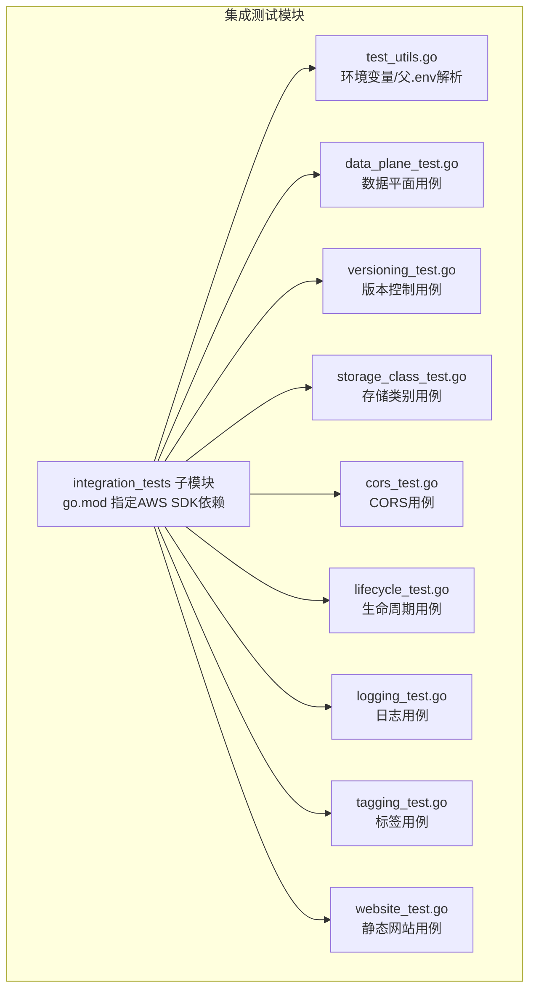
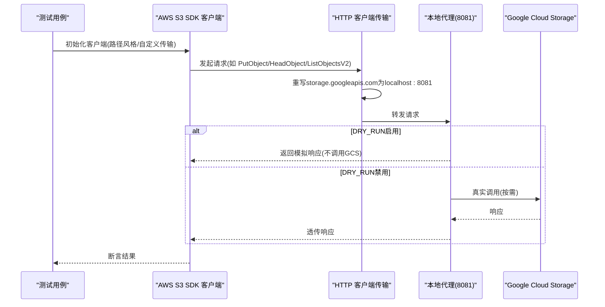
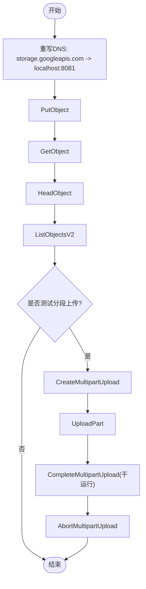
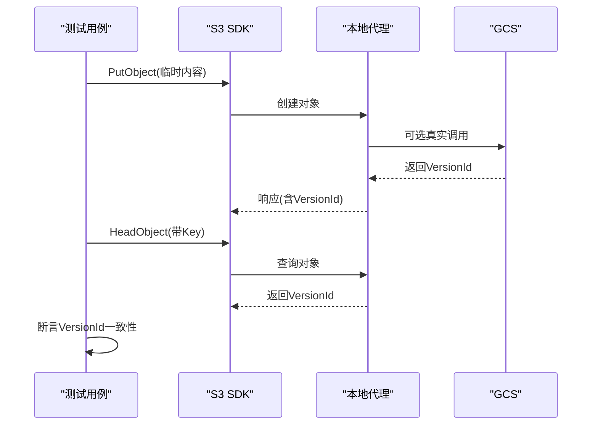
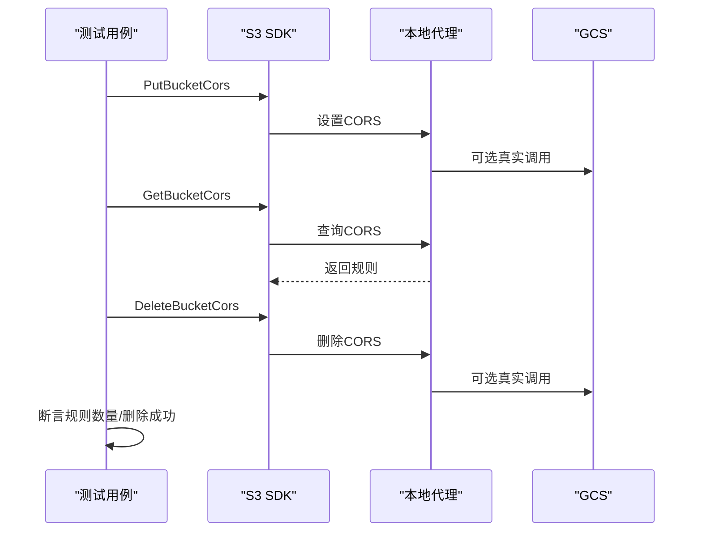
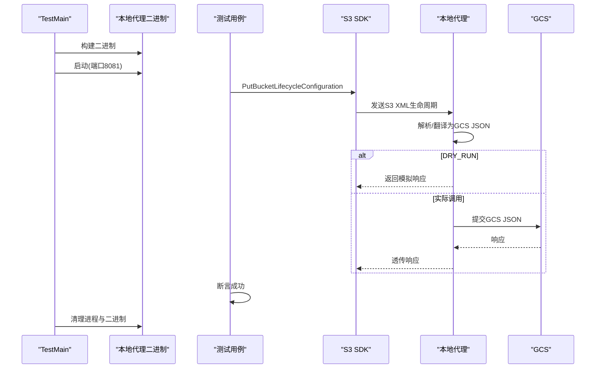
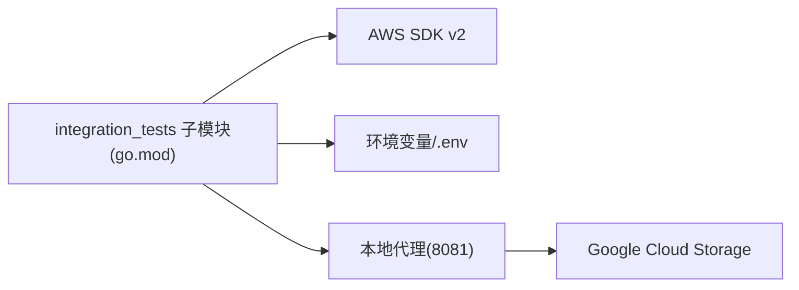

# 集成测试

<cite>
**本文引用的文件**
- [README.md](file://README.md)
- [integration_tests/go.mod](file://integration_tests/go.mod)
- [integration_tests/test_utils.go](file://integration_tests/test_utils.go)
- [integration_tests/data_plane_test.go](file://integration_tests/data_plane_test.go)
- [integration_tests/versioning_test.go](file://integration_tests/versioning_test.go)
- [integration_tests/storage_class_test.go](file://integration_tests/storage_class_test.go)
- [integration_tests/cors_test.go](file://integration_tests/cors_test.go)
- [integration_tests/lifecycle_test.go](file://integration_tests/lifecycle_test.go)
- [integration_tests/logging_test.go](file://integration_tests/logging_test.go)
- [integration_tests/tagging_test.go](file://integration_tests/tagging_test.go)
- [integration_tests/website_test.go](file://integration_tests/website_test.go)
- [pkg/translate/gcs_lifecycle.go](file://pkg/translate/gcs_lifecycle.go)
- [pkg/translate/gcs_cors.go](file://pkg/translate/gcs_cors.go)
</cite>

## 目录
1. [简介](#简介)
2. [项目结构](#项目结构)
3. [核心组件](#核心组件)
4. [架构总览](#架构总览)
5. [详细组件分析](#详细组件分析)
6. [依赖分析](#依赖分析)
7. [性能考虑](#性能考虑)
8. [故障排查指南](#故障排查指南)
9. [结论](#结论)
10. [附录](#附录)

## 简介
本文件面向S3Proxy4GCS的集成测试模块（integration_tests），系统性阐述其设计与架构，覆盖端到端测试流程、AWS S3 Go SDK的使用方式、测试工具函数、测试环境配置、测试数据管理与执行流程，并深入解析数据平面测试、版本控制测试、存储类别测试等关键场景的实现细节。同时提供测试结果分析与持续集成配置建议，帮助读者快速上手并稳定运行集成测试。

## 项目结构
integration_tests是一个独立的子模块，使用AWS S3 Go SDK对本地代理进行端到端验证。该模块通过显式HTTP客户端传输路由至本地代理（默认监听8081端口），并使用环境变量或父级.env文件中的参数作为测试目标。

图表来源
- [integration_tests/go.mod:1-32](file://integration_tests/go.mod#L1-L32)
- [integration_tests/test_utils.go:1-113](file://integration_tests/test_utils.go#L1-L113)
- [integration_tests/data_plane_test.go:1-202](file://integration_tests/data_plane_test.go#L1-L202)
- [integration_tests/versioning_test.go:1-136](file://integration_tests/versioning_test.go#L1-L136)
- [integration_tests/storage_class_test.go:1-65](file://integration_tests/storage_class_test.go#L1-L65)
- [integration_tests/cors_test.go:1-112](file://integration_tests/cors_test.go#L1-L112)
- [integration_tests/lifecycle_test.go:1-188](file://integration_tests/lifecycle_test.go#L1-L188)
- [integration_tests/logging_test.go:1-99](file://integration_tests/logging_test.go#L1-L99)
- [integration_tests/tagging_test.go:1-98](file://integration_tests/tagging_test.go#L1-L98)
- [integration_tests/website_test.go:1-91](file://integration_tests/website_test.go#L1-L91)

章节来源
- [README.md:112-123](file://README.md#L112-L123)
- [integration_tests/go.mod:1-32](file://integration_tests/go.mod#L1-L32)

## 核心组件
- 独立子模块：integration_tests使用独立go.mod隔离AWS SDK依赖，避免污染主模块。
- 测试工具函数：从环境变量或父级.env文件解析目标桶、前缀、访问凭据等配置。
- 显式HTTP客户端传输：通过自定义DialContext将storage.googleapis.com请求重定向到本地代理端口，确保SDK调用走代理。
- 自动化生命周期：lifecycle_test.go在TestMain中构建并启动本地代理二进制，测试结束后清理进程与二进制文件。
- 干运行模式：通过DRY_RUN等配置可禁用真实GCS调用，便于本地安全测试。

章节来源
- [integration_tests/go.mod:1-32](file://integration_tests/go.mod#L1-L32)
- [integration_tests/test_utils.go:1-113](file://integration_tests/test_utils.go#L1-L113)
- [integration_tests/lifecycle_test.go:20-55](file://integration_tests/lifecycle_test.go#L20-L55)

## 架构总览
集成测试采用“显式客户端传输 + 本地代理”的端到端架构。AWS S3 Go SDK发起请求时，HTTP层被重写以将GCS域名请求转发到本地代理；代理再根据配置决定是否真实调用GCS或返回干运行响应。

图表来源
- [integration_tests/data_plane_test.go:15-106](file://integration_tests/data_plane_test.go#L15-L106)
- [integration_tests/versioning_test.go:15-61](file://integration_tests/versioning_test.go#L15-L61)
- [integration_tests/storage_class_test.go:16-64](file://integration_tests/storage_class_test.go#L16-L64)
- [integration_tests/cors_test.go:18-111](file://integration_tests/cors_test.go#L18-L111)
- [integration_tests/lifecycle_test.go:57-119](file://integration_tests/lifecycle_test.go#L57-L119)
- [integration_tests/logging_test.go:18-98](file://integration_tests/logging_test.go#L18-L98)
- [integration_tests/tagging_test.go:16-97](file://integration_tests/tagging_test.go#L16-L97)
- [integration_tests/website_test.go:18-90](file://integration_tests/website_test.go#L18-L90)

## 详细组件分析

### 数据平面测试（对象操作）
- 目标：验证标准对象操作（Put/Get/Head/List/Delete）与分段上传（Create/Upload/Complete/Abort）。
- 关键点：
  - 使用自定义DialContext将GCS域名请求重定向到本地代理。
  - 通过路径风格地址与BaseEndpoint指向storage.googleapis.com，确保兼容性。
  - 分段上传测试采用“干运行”策略：创建上传后直接完成/中止，不依赖真实Part ETag。
- 断言：每个步骤均记录日志并失败时终止，确保端到端链路可用。

图表来源
- [integration_tests/data_plane_test.go:15-201](file://integration_tests/data_plane_test.go#L15-L201)

章节来源
- [integration_tests/data_plane_test.go:15-201](file://integration_tests/data_plane_test.go#L15-L201)

### 版本控制测试
- 目标：验证列出对象版本与带版本号的HeadObject行为。
- 关键点：
  - 先创建对象以获取VersionId，再断言HeadObject返回的VersionId与预期一致。
  - 列出版本接口用于验证代理对版本列表的支持。
- 断言：VersionId非空且与Put响应一致（若存在）。

图表来源
- [integration_tests/versioning_test.go:99-135](file://integration_tests/versioning_test.go#L99-L135)

章节来源
- [integration_tests/versioning_test.go:15-136](file://integration_tests/versioning_test.go#L15-L136)

### 存储类别测试
- 目标：验证S3 STANDARD_IA映射到GCS NEARLINE的行为。
- 关键点：
  - PutObject时指定StorageClass为S3 STANDARD_IA，期望代理将其转换为GCS NEARLINE。
  - 采用干运行策略，不实际写入GCS即可验证映射与转发逻辑。
- 断言：请求成功返回（代理侧验证通过）。

图表来源
- [integration_tests/storage_class_test.go:51-63](file://integration_tests/storage_class_test.go#L51-L63)
- [pkg/translate/gcs_lifecycle.go:139-154](file://pkg/translate/gcs_lifecycle.go#L139-L154)

章节来源
- [integration_tests/storage_class_test.go:16-64](file://integration_tests/storage_class_test.go#L16-L64)
- [pkg/translate/gcs_lifecycle.go:139-154](file://pkg/translate/gcs_lifecycle.go#L139-L154)

### CORS测试
- 目标：验证桶级CORS的设置、查询与删除。
- 关键点：
  - 使用PutBucketCors设置规则，GetBucketCors校验返回规则数量，DeleteBucketCors清理。
  - 通过自定义APIOptions移除特定中间件并修正参数，保证与GCS兼容。
- 断言：各步骤均成功返回，Get返回至少一条规则。

图表来源
- [integration_tests/cors_test.go:70-111](file://integration_tests/cors_test.go#L70-L111)
- [pkg/translate/gcs_cors.go:10-35](file://pkg/translate/gcs_cors.go#L10-L35)

章节来源
- [integration_tests/cors_test.go:18-111](file://integration_tests/cors_test.go#L18-L111)
- [pkg/translate/gcs_cors.go:10-35](file://pkg/translate/gcs_cors.go#L10-L35)

### 生命周期测试
- 目标：验证桶级生命周期配置的设置与多过渡规则支持。
- 关键点：
  - 在TestMain中构建并启动本地代理二进制，测试完成后清理。
  - PutBucketLifecycleConfiguration发送S3 XML生命周期配置，代理将其翻译为GCS JSON。
  - 支持单个与多个过渡规则的场景。
- 断言：请求成功返回（代理侧验证通过）。

图表来源
- [integration_tests/lifecycle_test.go:20-55](file://integration_tests/lifecycle_test.go#L20-L55)
- [integration_tests/lifecycle_test.go:57-187](file://integration_tests/lifecycle_test.go#L57-L187)
- [pkg/translate/gcs_lifecycle.go:38-105](file://pkg/translate/gcs_lifecycle.go#L38-L105)

章节来源
- [integration_tests/lifecycle_test.go:20-188](file://integration_tests/lifecycle_test.go#L20-L188)
- [pkg/translate/gcs_lifecycle.go:38-105](file://pkg/translate/gcs_lifecycle.go#L38-L105)

### 日志测试
- 目标：验证桶级日志配置的设置与查询。
- 关键点：
  - PutBucketLogging设置目标桶与前缀，GetBucketLogging校验返回值。
  - 通过自定义APIOptions移除特定中间件并修正参数，保证与GCS兼容。
- 断言：返回的LoggingEnabled非空，目标桶与前缀正确。

章节来源
- [integration_tests/logging_test.go:18-98](file://integration_tests/logging_test.go#L18-L98)

### 标签测试
- 目标：验证对象标签的设置与查询。
- 关键点：
  - 先创建对象，再设置标签，最后查询标签集合。
- 断言：标签集合非空，包含预期键值对。

章节来源
- [integration_tests/tagging_test.go:16-97](file://integration_tests/tagging_test.go#L16-L97)

### 静态网站测试
- 目标：验证桶级静态网站配置的设置。
- 关键点：
  - PutBucketWebsite设置首页与错误页文档。
- 断言：请求成功返回（代理侧验证通过）。

章节来源
- [integration_tests/website_test.go:18-90](file://integration_tests/website_test.go#L18-L90)

## 依赖分析
- 子模块隔离：integration_tests/go.mod明确声明AWS SDK依赖，避免污染主模块。
- 运行时依赖：所有测试用例共享相同的HTTP传输重写逻辑与凭据提供器。
- 外部依赖：GCS API（通过代理转发）、本地代理二进制（生命周期测试中自动构建与启动）。

图表来源
- [integration_tests/go.mod:8-12](file://integration_tests/go.mod#L8-L12)
- [integration_tests/lifecycle_test.go:20-55](file://integration_tests/lifecycle_test.go#L20-L55)

章节来源
- [integration_tests/go.mod:1-32](file://integration_tests/go.mod#L1-L32)
- [integration_tests/lifecycle_test.go:20-55](file://integration_tests/lifecycle_test.go#L20-L55)

## 性能考虑
- 传输层优化：统一使用路径风格地址与自定义HTTP传输，减少DNS解析与连接开销。
- 干运行模式：DRY_RUN开启时避免真实GCS调用，显著降低延迟与成本。
- 中间件调整：移除不必要的压缩与User-Agent头，提升兼容性与稳定性。
- 连接池：主服务具备高连接池配置，集成测试复用相同原则以保持一致性。

## 故障排查指南
- 环境变量缺失：
  - 确认TARGET_BUCKET、GCS_PREFIX、AWS_ACCESS_KEY_ID、AWS_SECRET_ACCESS_KEY存在于环境或父级.env。
  - 若未设置，测试工具函数会回退到默认值，可能导致测试失败或误触生产资源。
- 代理未启动或端口冲突：
  - 生命周期测试会在TestMain中自动构建并启动本地代理，检查端口占用与权限。
  - 如失败，查看构建与启动日志，确认代理二进制存在且可执行。
- DNS重写不生效：
  - 确保HTTP传输的DialContext正确匹配storage.googleapis.com域名。
  - 检查BaseEndpoint与UsePathStyle配置是否一致。
- GCS兼容性问题：
  - 对于CORS/日志/网站等特性，使用自定义APIOptions移除不兼容中间件并修正参数。
- 权限与密钥：
  - 确保AWS_ACCESS_KEY_ID与AWS_SECRET_ACCESS_KEY与代理配置一致。
  - 对于需要真实GCS调用的功能（如CORS/网站），确保JSON_KEY与项目ID配置正确。

章节来源
- [integration_tests/test_utils.go:9-112](file://integration_tests/test_utils.go#L9-L112)
- [integration_tests/lifecycle_test.go:20-55](file://integration_tests/lifecycle_test.go#L20-L55)
- [integration_tests/cors_test.go:51-67](file://integration_tests/cors_test.go#L51-L67)
- [integration_tests/logging_test.go:51-67](file://integration_tests/logging_test.go#L51-L67)
- [integration_tests/website_test.go:51-67](file://integration_tests/website_test.go#L51-L67)

## 结论
integration_tests模块通过独立子模块与显式HTTP传输，实现了对S3Proxy4GCS的端到端验证。它覆盖了数据平面、版本控制、存储类别、CORS、生命周期、日志、标签与静态网站等关键能力，并在生命周期测试中实现了自动化代理启动与清理。配合干运行模式与环境变量配置，测试可在本地安全、高效地运行，为持续集成提供了可靠基础。

## 附录

### 测试环境配置
- 环境变量与父级.env：
  - TARGET_BUCKET：目标GCS桶名（优先使用环境变量，否则回退到父级.env）。
  - GCS_PREFIX：命名空间前缀，用于隔离测试数据。
  - AWS_ACCESS_KEY_ID / AWS_SECRET_ACCESS_KEY：代理认证凭据。
  - PORT：本地代理监听端口（默认8081，生命周期测试中设置）。
  - DRY_RUN：是否禁用真实GCS调用（推荐在本地测试时开启）。
  - JSON_KEY：真实GCS调用所需的Service Account密钥路径。
- 执行命令：
  - 在integration_tests目录下运行：go mod tidy && go test -v ./...

章节来源
- [integration_tests/test_utils.go:9-112](file://integration_tests/test_utils.go#L9-L112)
- [README.md:112-123](file://README.md#L112-L123)

### 测试数据管理
- 命名空间：使用GCS_PREFIX为对象键添加前缀，避免与其他测试冲突。
- 临时对象：版本控制与标签测试先创建临时对象，测试后由代理或GCS清理策略处理。
- 干运行策略：存储类别与数据平面测试采用干运行，不产生持久数据。

章节来源
- [integration_tests/data_plane_test.go:48-106](file://integration_tests/data_plane_test.go#L48-L106)
- [integration_tests/versioning_test.go:99-135](file://integration_tests/versioning_test.go#L99-L135)
- [integration_tests/tagging_test.go:52-97](file://integration_tests/tagging_test.go#L52-L97)
- [integration_tests/storage_class_test.go:51-64](file://integration_tests/storage_class_test.go#L51-L64)

### 测试执行流程
- 数据平面：Put/Get/Head/List/Delete与分段上传（Create/Upload/Complete/Abort）。
- 版本控制：创建对象获取VersionId，断言HeadObject返回一致。
- 存储类别：PutObject携带STANDARD_IA，期望映射为NEARLINE。
- CORS/日志/网站：设置、查询、删除三步验证。
- 生命周期：TestMain构建并启动代理，发送XML配置，断言成功。

章节来源
- [integration_tests/data_plane_test.go:15-201](file://integration_tests/data_plane_test.go#L15-L201)
- [integration_tests/versioning_test.go:15-136](file://integration_tests/versioning_test.go#L15-L136)
- [integration_tests/storage_class_test.go:16-64](file://integration_tests/storage_class_test.go#L16-L64)
- [integration_tests/cors_test.go:18-111](file://integration_tests/cors_test.go#L18-L111)
- [integration_tests/logging_test.go:18-98](file://integration_tests/logging_test.go#L18-L98)
- [integration_tests/website_test.go:18-90](file://integration_tests/website_test.go#L18-L90)
- [integration_tests/lifecycle_test.go:20-187](file://integration_tests/lifecycle_test.go#L20-L187)

### 测试结果分析与持续集成
- 结果输出：每个测试步骤均记录日志，失败时立即终止，便于定位问题。
- CI建议：
  - 使用独立子模块运行测试，避免主模块污染。
  - 在CI中设置DRY_RUN=false以启用真实GCS调用，但需严格管理凭据与预算。
  - 将TARGET_BUCKET与GCS_PREFIX设置为CI专用桶与前缀，确保隔离。
  - 对CORS/网站等需要真实GCS调用的功能，提前准备JSON_KEY与项目ID。
  - 建议在PR中仅运行关键用例，在主分支运行全量用例。