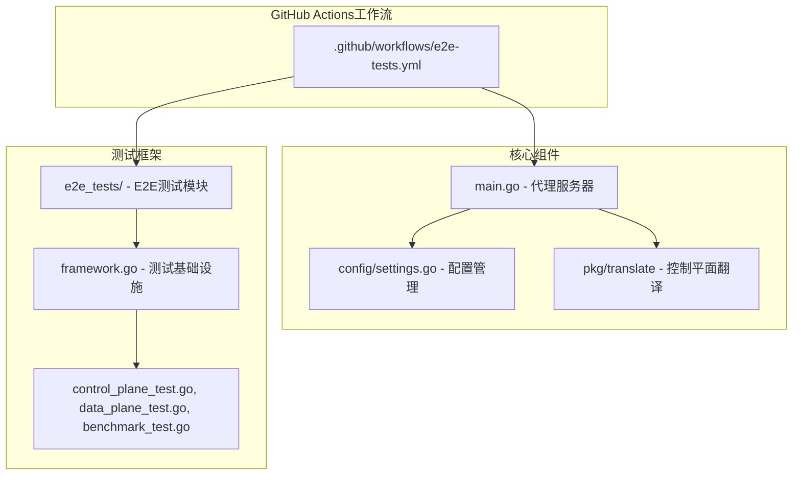
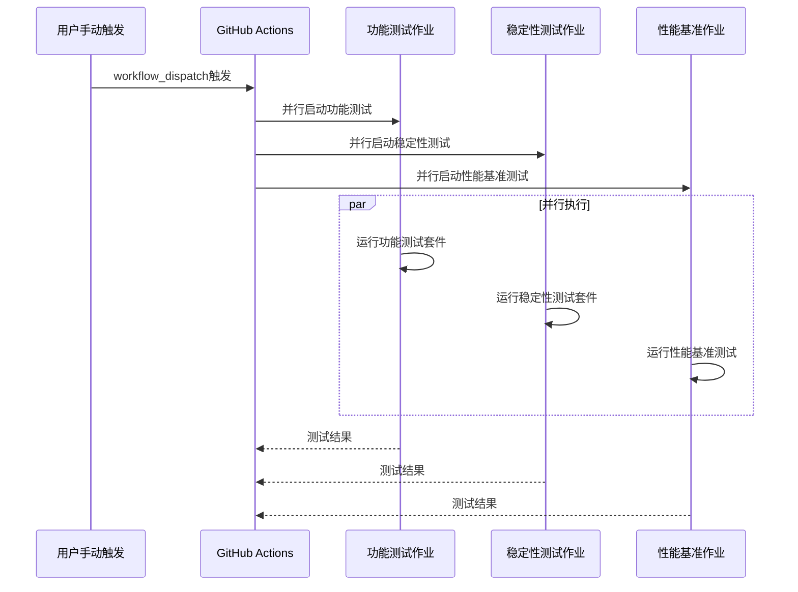
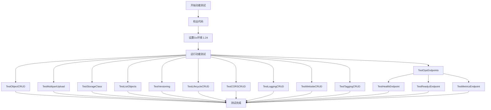
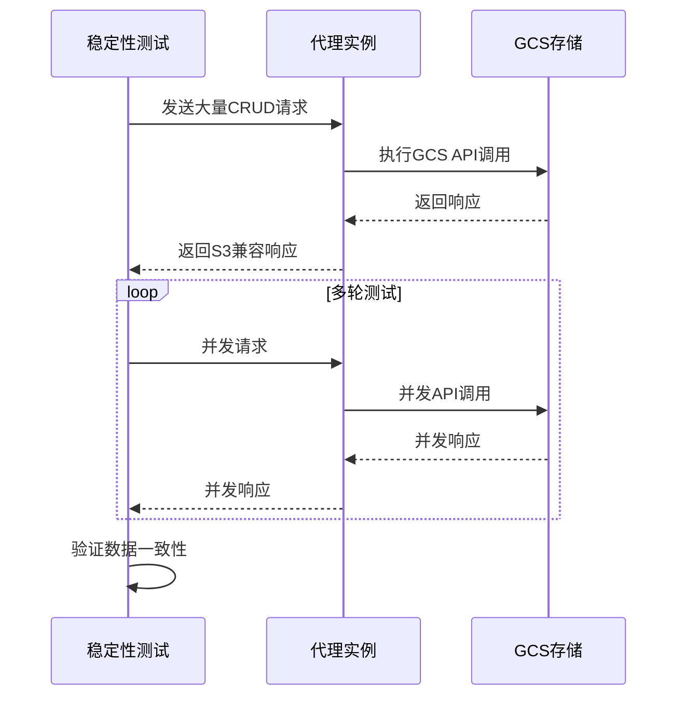
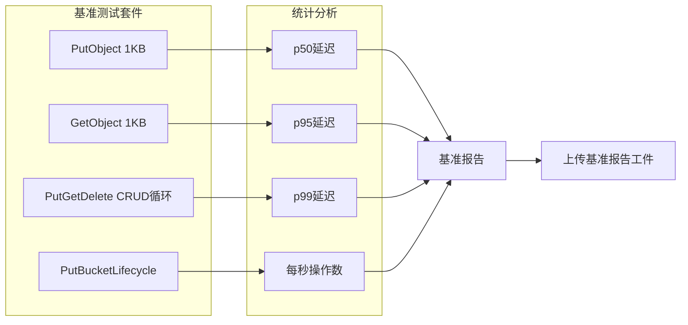
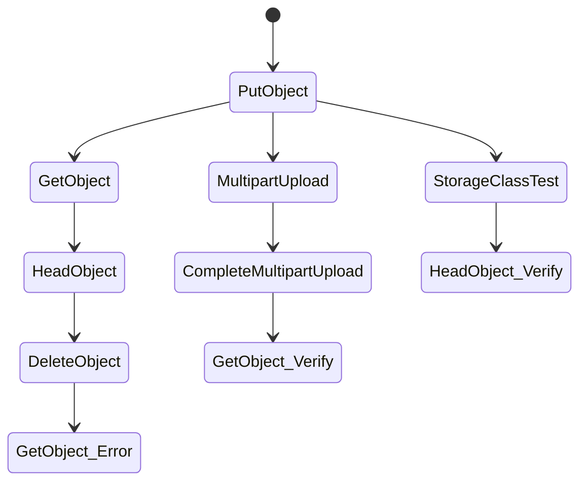
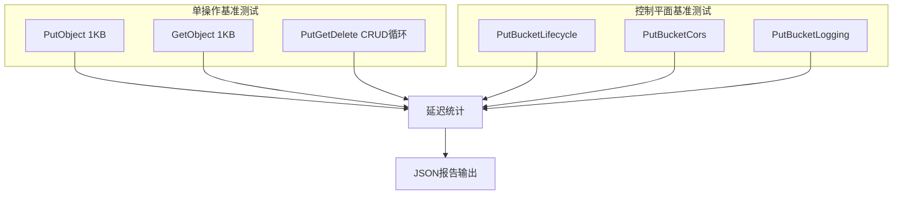

# GitHub Actions工作流

<cite>
**本文档中引用的文件**
- [.github/workflows/e2e-tests.yml](file://.github/workflows/e2e-tests.yml)
- [README.md](file://README.md)
- [main.go](file://main.go)
- [config/settings.go](file://config/settings.go)
- [e2e_tests/framework.go](file://e2e_tests/framework.go)
- [e2e_tests/go.mod](file://e2e_tests/go.mod)
- [e2e_tests/control_plane_test.go](file://e2e_tests/control_plane_test.go)
- [e2e_tests/data_plane_test.go](file://e2e_tests/data_plane_test.go)
- [e2e_tests/benchmark_test.go](file://e2e_tests/benchmark_test.go)
- [pkg/translate/gcs_lifecycle.go](file://pkg/translate/gcs_lifecycle.go)
- [pkg/translate/gcs_cors.go](file://pkg/translate/gcs_cors.go)
</cite>

## 目录
1. [简介](#简介)
2. [项目结构概览](#项目结构概览)
3. [工作流架构分析](#工作流架构分析)
4. [并行作业详解](#并行作业详解)
5. [环境配置与依赖管理](#环境配置与依赖管理)
6. [测试套件分析](#测试套件分析)
7. [性能基准测试](#性能基准测试)
8. [故障排除指南](#故障排除指南)
9. [最佳实践建议](#最佳实践建议)
10. [总结](#总结)

## 简介

本仓库包含一个完整的GitHub Actions工作流，用于执行端到端（E2E）验收测试。该工作流针对S3Proxy4GCS代理服务进行自动化测试，涵盖功能正确性、稳定性以及性能基准测试三个维度。工作流采用并行执行策略，通过手动触发方式运行，确保在生产环境中提供可靠的质量保证。

## 项目结构概览

**图表来源**
- [.github/workflows/e2e-tests.yml:1-108](file://.github/workflows/e2e-tests.yml#L1-L108)
- [main.go:1-1023](file://main.go#L1-L1023)
- [e2e_tests/framework.go:1-151](file://e2e_tests/framework.go#L1-L151)

**章节来源**
- [.github/workflows/e2e-tests.yml:1-108](file://.github/workflows/e2e-tests.yml#L1-L108)
- [README.md:203-274](file://README.md#L203-L274)

## 工作流架构分析

### 整体架构设计

**图表来源**
- [.github/workflows/e2e-tests.yml:21-108](file://.github/workflows/e2e-tests.yml#L21-L108)

### 工作流特性

该工作流具有以下关键特性：

1. **手动触发模式**：支持`workflow_dispatch`事件，允许开发者手动启动测试
2. **并行执行**：三个主要作业并行运行，提高测试效率
3. **条件依赖**：稳定性测试依赖于功能测试完成
4. **超时控制**：每个作业都有明确的超时限制
5. **环境隔离**：使用独立的Go模块进行测试

**章节来源**
- [.github/workflows/e2e-tests.yml:3-20](file://.github/workflows/e2e-tests.yml#L3-L20)
- [.github/workflows/e2e-tests.yml:47-73](file://.github/workflows/e2e-tests.yml#L47-L73)

## 并行作业详解

### 功能测试作业（Functional Tests）

功能测试作业负责验证代理的核心功能，包括数据平面和控制平面的所有关键操作。

**图表来源**
- [.github/workflows/e2e-tests.yml:22-46](file://.github/workflows/e2e-tests.yml#L22-L46)
- [README.md:255-263](file://README.md#L255-L263)

### 稳定性测试作业（Stability Tests）

稳定性测试作业专注于长时间运行和并发操作的可靠性验证。

**图表来源**
- [.github/workflows/e2e-tests.yml:47-73](file://.github/workflows/e2e-tests.yml#L47-L73)
- [README.md:262-263](file://README.md#L262-L263)

### 性能基准测试作业（Performance Benchmarks）

性能基准测试作业生成详细的性能报告，包括延迟统计和吞吐量指标。

**图表来源**
- [.github/workflows/e2e-tests.yml:75-108](file://.github/workflows/e2e-tests.yml#L75-L108)
- [e2e_tests/benchmark_test.go:19-85](file://e2e_tests/benchmark_test.go#L19-L85)

**章节来源**
- [.github/workflows/e2e-tests.yml:21-108](file://.github/workflows/e2e-tests.yml#L21-L108)

## 环境配置与依赖管理

### 环境变量管理

工作流使用以下关键环境变量：

| 变量名 | 必需性 | 描述 | 默认值 |
|--------|--------|------|--------|
| `PROXY_ENDPOINT` | 必需 | 代理服务端点URL | - |
| `GCS_HMAC_ACCESS` | 必需 | GCS HMAC访问密钥 | - |
| `GCS_HMAC_SECRET` | 必需 | GCS HMAC密钥 | - |
| `TEST_BUCKET` | 必需 | 测试目标存储桶 | - |
| `TEST_PREFIX` | 可选 | 对象键前缀，用于测试隔离 | e2e-{run_id}/ |
| `STABILITY_ROUNDS` | 可选 | 稳定性测试轮数 | 50 |
| `CONCURRENCY` | 可选 | 并发级别 | 10 |

### 依赖版本管理

工作流使用Go 1.24版本，确保与主项目保持一致的开发环境。

**章节来源**
- [.github/workflows/e2e-tests.yml:36-41](file://.github/workflows/e2e-tests.yml#L36-L41)
- [.github/workflows/e2e-tests.yml:56-61](file://.github/workflows/e2e-tests.yml#L56-L61)
- [.github/workflows/e2e-tests.yml:84-89](file://.github/workflows/e2e-tests.yml#L84-L89)

## 测试套件分析

### 数据平面测试

数据平面测试验证对象生命周期管理的核心功能：

**图表来源**
- [e2e_tests/data_plane_test.go:15-83](file://e2e_tests/data_plane_test.go#L15-L83)
- [e2e_tests/data_plane_test.go:85-166](file://e2e_tests/data_plane_test.go#L85-L166)

### 控制平面测试

控制平面测试覆盖所有S3兼容的存储桶配置功能：

| 测试类别 | 功能描述 | 验证内容 |
|----------|----------|----------|
| 生命周期管理 | Put/Get/Delete生命周期配置 | 规则完整性、状态转换、过滤器匹配 |
| CORS配置 | 跨域资源共享设置 | 方法允许、源域名、暴露头、最大年龄 |
| 日志配置 | 存储桶日志记录 | 目标存储桶、前缀、启用状态 |
| 网站托管 | 静态网站托管配置 | 主页后缀、错误文档、路由规则 |
| 标签管理 | 对象标签设置 | 标签键值对、元数据映射 |

**章节来源**
- [e2e_tests/control_plane_test.go:13-84](file://e2e_tests/control_plane_test.go#L13-L84)
- [e2e_tests/control_plane_test.go:86-153](file://e2e_tests/control_plane_test.go#L86-L153)
- [e2e_tests/control_plane_test.go:155-200](file://e2e_tests/control_plane_test.go#L155-L200)

## 性能基准测试

### 基准测试指标

性能基准测试生成以下关键指标：

| 指标类型 | 描述 | 计算方法 |
|----------|------|----------|
| p50延迟 | 中位数延迟时间 | 50%分位数延迟 |
| p95延迟 | 95分位延迟时间 | 95%分位数延迟 |
| p99延迟 | 99分位延迟时间 | 99%分位数延迟 |
| 吞吐量 | 每秒操作数 | 总操作数/总时间 |
| 平均延迟 | 所有请求的平均延迟 | 总延迟/请求数 |

### 测试场景设计

**图表来源**
- [e2e_tests/benchmark_test.go:89-200](file://e2e_tests/benchmark_test.go#L89-L200)

**章节来源**
- [e2e_tests/benchmark_test.go:19-85](file://e2e_tests/benchmark_test.go#L19-L85)

## 故障排除指南

### 常见问题诊断

| 问题类型 | 症状 | 可能原因 | 解决方案 |
|----------|------|----------|----------|
| 环境变量缺失 | 测试启动失败 | PROXY_ENDPOINT或GCS凭证未设置 | 检查GitHub Secrets配置 |
| 代理不可达 | /health端点返回非200 | 代理服务未启动或网络问题 | 验证代理部署状态 |
| GCS认证失败 | GCS API调用拒绝 | HMAC密钥无效或权限不足 | 重新生成并更新密钥 |
| 超时错误 | 测试执行超时 | 网络延迟或代理性能问题 | 增加超时时间或优化代理配置 |

### 调试建议

1. **启用详细日志**：在本地环境中设置`DEBUG_LOGGING=true`
2. **检查依赖版本**：确保Go版本与工作流配置一致
3. **验证网络连接**：确认代理能够访问GCS API端点
4. **监控资源使用**：观察代理实例的CPU和内存使用情况

**章节来源**
- [README.md:214-224](file://README.md#L214-L224)

## 最佳实践建议

### 工作流优化

1. **并行化策略**：当前的并行执行已达到最优效率，可考虑根据测试结果调整并发度
2. **缓存机制**：利用Go模块缓存减少依赖下载时间
3. **条件执行**：为不同分支设置条件触发，避免不必要的测试执行
4. **错误处理**：增强错误恢复机制，提高工作流的鲁棒性

### 测试策略改进

1. **动态参数化**：根据测试环境动态调整测试参数
2. **智能重试**：为临时性错误实现智能重试逻辑
3. **增量测试**：基于变更范围选择性执行相关测试
4. **性能回归检测**：建立性能基线，自动检测性能退化

## 总结

本GitHub Actions工作流为S3Proxy4GCS项目提供了全面的自动化测试解决方案。通过并行执行功能测试、稳定性测试和性能基准测试，确保代理服务在各种场景下的可靠性和性能表现。

工作流的关键优势包括：
- **手动触发灵活性**：支持按需执行测试
- **并行执行效率**：充分利用CI资源
- **全面测试覆盖**：涵盖数据平面和控制平面
- **性能监控**：提供详细的性能基准报告
- **环境隔离**：使用独立的测试模块避免污染

该工作流为项目的持续集成和部署提供了坚实的基础，有助于维护高质量的代码发布流程。