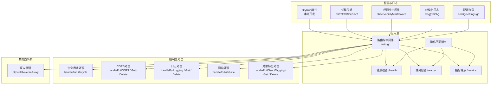
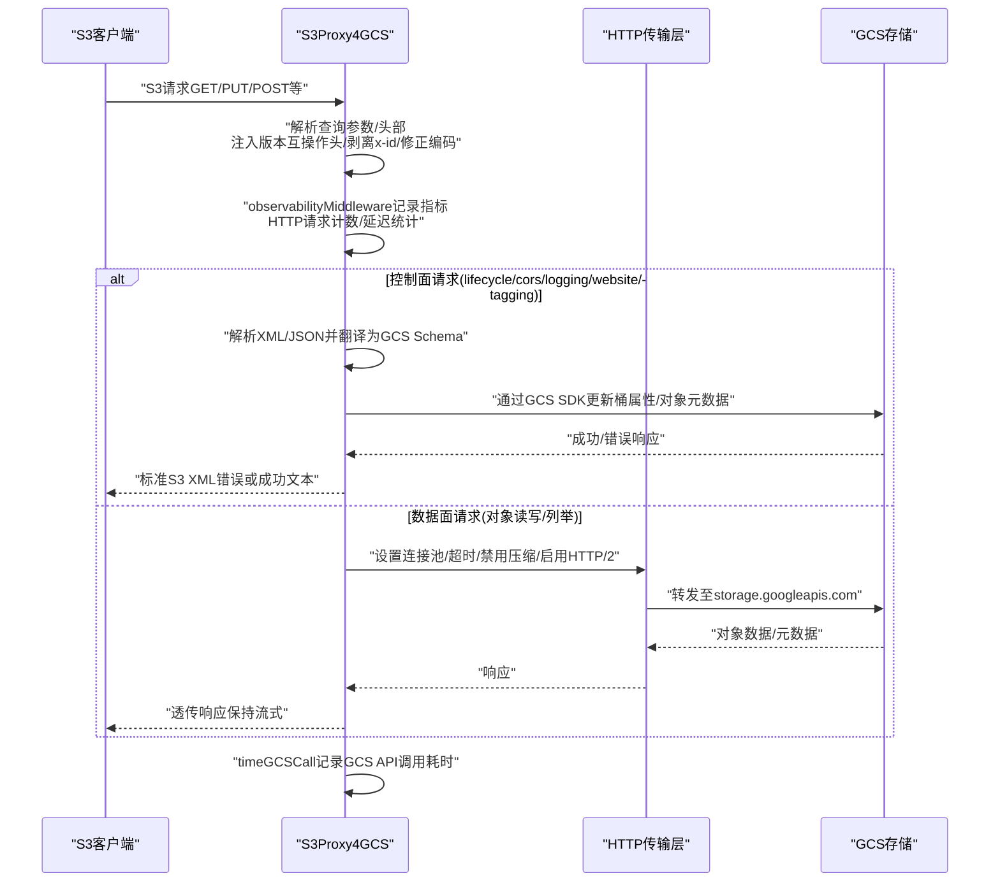
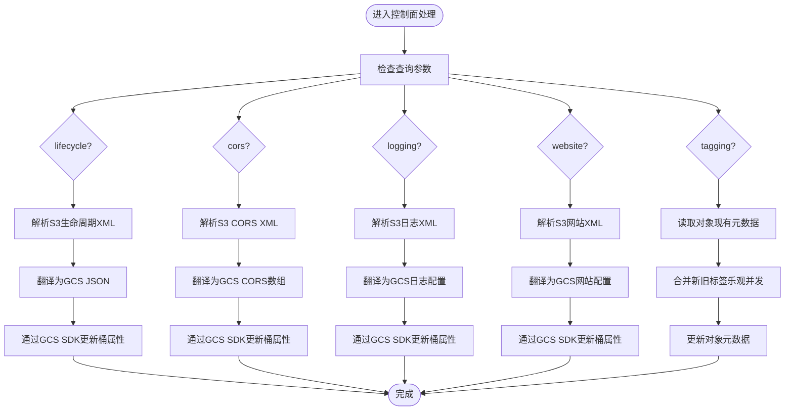
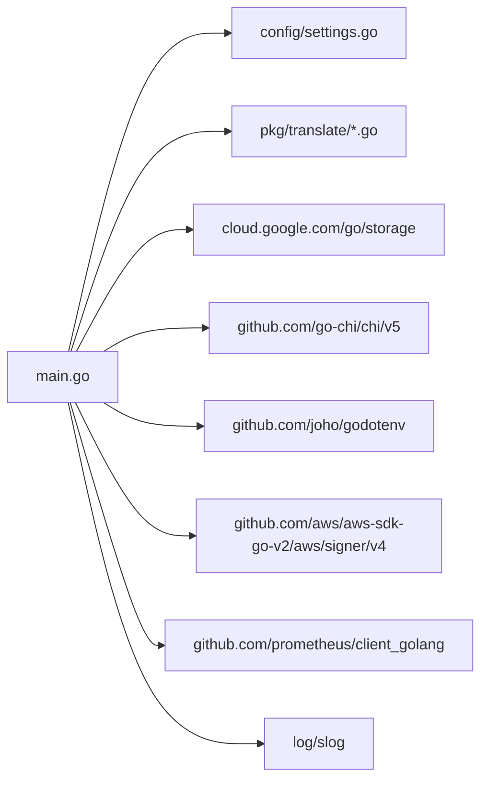
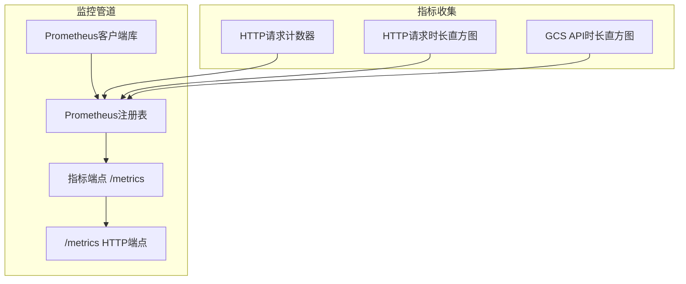

# 部署与运维

<cite>
**本文引用的文件**
- [README.md](file://README.md)
- [main.go](file://main.go)
- [config/settings.go](file://config/settings.go)
- [go.mod](file://go.mod)
- [solutions.md](file://solutions.md)
- [pkg/translate/gcs_lifecycle.go](file://pkg/translate/gcs_lifecycle.go)
- [pkg/translate/gcs_cors.go](file://pkg/translate/gcs_cors.go)
- [pkg/translate/gcs_tagging.go](file://pkg/translate/gcs_tagging.go)
- [integration_tests/data_plane_test.go](file://integration_tests/data_plane_test.go)
- [integration_tests/logging_test.go](file://integration_tests/logging_test.go)
- [integration_tests/versioning_test.go](file://integration_tests/versioning_test.go)
- [integration_tests/cors_test.go](file://integration_tests/cors_test.go)
- [integration_tests/test_utils.go](file://integration_tests/test_utils.go)
- [unsupported.txt](file://unsupported.txt)
- [AGENTS.md](file://AGENTS.md)
- [e2e_tests/ops_test.go](file://e2e_tests/ops_test.go)
- [e2e_tests/metrics_collector.go](file://e2e_tests/metrics_collector.go)
</cite>

## 更新摘要
**变更内容**
- 新增操作平面功能：健康检查、就绪检查、指标监控、结构化日志记录、优雅关闭和DryRun模式
- 更新监控与指标配置章节，包含完整的Prometheus集成
- 增强可观测性中间件和日志配置指南
- 完善操作平面端点的部署和配置说明

## 目录
1. [简介](#简介)
2. [项目结构](#项目结构)
3. [核心组件](#核心组件)
4. [架构总览](#架构总览)
5. [详细组件分析](#详细组件分析)
6. [依赖分析](#依赖分析)
7. [性能考虑](#性能考虑)
8. [监控与指标配置](#监控与指标配置)
9. [故障排查指南](#故障排查指南)
10. [结论](#结论)
11. [附录](#附录)

## 简介
本文件面向生产环境的S3Proxy4GCS部署与运维，覆盖容器化部署、Kubernetes配置、云平台集成、监控与日志、连接池与超时调优、资源限制、高可用与灾备、性能调优与容量规划，以及常见问题排查。内容基于仓库源码与配套文档进行系统化整理，确保非专业读者也能按步骤落地。

## 项目结构
- 根目录入口：主程序入口负责路由、反向代理、请求重签、版本互操作映射与健康检查。
- 配置模块：集中加载环境变量与默认值，支持.DOTENV与环境变量双路径。
- 翻译模块：对S3控制面（生命周期、CORS、日志、网站、对象标签）进行双向Schema转换。
- 集成测试：使用AWS SDK在隔离子模块中验证数据面与控制面行为。
- 文档与规范：工程规则、兼容性说明、不支持特性清单。

**图表来源**
- [main.go:197-251](file://main.go#L197-L251)
- [config/settings.go:29-57](file://config/settings.go#L29-L57)

**章节来源**
- [README.md:140-157](file://README.md#L140-L157)
- [main.go:36-251](file://main.go#L36-L251)
- [config/settings.go:11-57](file://config/settings.go#L11-L57)

## 核心组件
- 路由与中间件：基于Chi框架，启用标准日志与恢复中间件；提供/health健康端点、/readyz就绪检查和/Prometheus指标端点。
- 反向代理：针对GCS单主机反向代理，支持DryRun与真实GCS两种传输配置；注入版本互操作头、剥离x-id参数、修正Accept-Encoding等。
- 控制面拦截：对lifecycle、cors、logging、website、object-tagging等查询参数进行拦截与翻译。
- 结构化日志：使用log/slog输出JSON格式日志，支持调试级别切换。
- 观测性中间件：自定义中间件记录请求ID、方法、路径、状态码、持续时间等关键信息。
- 配置中心：统一从.DOTENV或环境变量加载，含端口、目标桶、GCS前缀、DryRun、调试开关、连接池上限、代理HMAC凭据、GCS凭据路径等。
- 错误响应：统一返回S3标准XML错误体，便于SDK识别。
- 优雅关闭：监听SIGTERM/SIGINT信号，最多等待10秒优雅关闭服务器。

**章节来源**
- [main.go:197-251](file://main.go#L197-L251)
- [main.go:253-321](file://main.go#L253-L321)
- [main.go:348-405](file://main.go#L348-L405)
- [main.go:407-486](file://main.go#L407-L486)
- [main.go:488-563](file://main.go#L488-L563)
- [main.go:565-608](file://main.go#L565-L608)
- [main.go:610-740](file://main.go#L610-L740)
- [config/settings.go:11-57](file://config/settings.go#L11-L57)

## 架构总览
下图展示S3客户端到GCS的完整链路，包括控制面翻译与数据面直通转发、重签与版本互操作映射，以及新增的监控和观测性功能。

**图表来源**
- [main.go:73-90](file://main.go#L73-L90)
- [main.go:92-182](file://main.go#L92-L182)
- [main.go:348-405](file://main.go#L348-L405)
- [main.go:407-486](file://main.go#L407-L486)
- [main.go:488-563](file://main.go#L488-L563)
- [main.go:565-608](file://main.go#L565-L608)
- [main.go:610-740](file://main.go#L610-L740)

## 详细组件分析

### 配置与环境变量
- 关键配置项：端口、GCP项目ID、目标桶、GCS基础URL、GCS前缀、DryRun、调试日志、最大空闲连接数、每主机最大空闲连接数、代理HMAC凭据、GCS凭据路径。
- 默认行为：DryRun默认开启，适合本地测试；调试日志默认关闭；连接池默认上限较高以适配高并发。
- 加载顺序：优先.DOTENV，其次环境变量；未设置时采用默认值。

**章节来源**
- [config/settings.go:11-57](file://config/settings.go#L11-L57)
- [README.md:18-29](file://README.md#L18-L29)

### 反向代理与传输层
- 传输配置：最大空闲连接、每主机空闲连接、空闲超时、TLS握手超时、ExpectContinue超时、禁用压缩、强制HTTP/2。
- 请求重定向：修改URL主机、协议与Host头，确保TLS握手正确。
- 头部与签名：检测并剥离x-id、修正Accept-Encoding、必要时重新签名以匹配GCS期望。
- 响应映射：将GCS生成号映射为S3版本ID，保证SDK兼容。

**章节来源**
- [main.go:67-90](file://main.go#L67-L90)
- [main.go:92-182](file://main.go#L92-L182)
- [main.go:184-195](file://main.go#L184-L195)

### 控制面拦截与翻译
- 生命周期：解析S3 XML，映射为GCS JSON，支持过期、过渡、非当前版本过期规则；拒绝不受支持的过滤器（大小、标签）。
- CORS：S3 XML到GCS CORS数组映射；忽略S3允许请求头（GCS不支持原生）。
- 日志：S3日志配置映射到GCS目标桶/前缀。
- 网站：S3网站配置映射到GCS网站字段。
- 对象标签：将S3标签转为GCS自定义元数据，使用乐观并发控制避免丢失更新。

**图表来源**
- [main.go:265-321](file://main.go#L265-L321)
- [main.go:348-405](file://main.go#L348-L405)
- [main.go:407-486](file://main.go#L407-L486)
- [main.go:488-563](file://main.go#L488-L563)
- [main.go:565-608](file://main.go#L565-L608)
- [main.go:610-740](file://main.go#L610-L740)
- [pkg/translate/gcs_lifecycle.go:38-105](file://pkg/translate/gcs_lifecycle.go#L38-L105)
- [pkg/translate/gcs_cors.go:10-35](file://pkg/translate/gcs_cors.go#L10-L35)
- [pkg/translate/gcs_tagging.go:10-35](file://pkg/translate/gcs_tagging.go#L10-L35)

**章节来源**
- [main.go:265-321](file://main.go#L265-L321)
- [pkg/translate/gcs_lifecycle.go:38-137](file://pkg/translate/gcs_lifecycle.go#L38-L137)
- [pkg/translate/gcs_cors.go:10-35](file://pkg/translate/gcs_cors.go#L10-L35)
- [pkg/translate/gcs_tagging.go:10-35](file://pkg/translate/gcs_tagging.go#L10-L35)

### 数据面直通与上下文传播
- 默认透传：所有S3对象操作（Get/Put/List/Delete/Head）经反向代理直通GCS。
- 上下文传播：所有对外GCS调用均使用请求上下文，客户端取消可触发自动取消，节省成本。
- 流式行为：保持流式传输，避免将整个响应体读入内存。

**章节来源**
- [main.go:319-321](file://main.go#L319-L321)
- [main.go:92-182](file://main.go#L92-L182)
- [AGENTS.md:17](file://AGENTS.md#L17)

### 操作平面功能

#### 健康检查端点
- **/health**：轻量级存活探针，返回200 OK，用于容器编排系统的存活检查。
- **实现逻辑**：直接返回200状态码和"OK"文本，不进行任何外部依赖检查。
- **用途**：快速判断进程是否仍在运行，作为Kubernetes readinessProbe的前置条件。

#### 就绪检查端点
- **/readyz**：就绪探针端点，返回JSON格式状态信息。
- **DryRun模式**：始终返回就绪状态，包含"mode":"dry_run"标识。
- **Live模式**：执行GCS连接性检查，使用5秒超时，验证目标桶可达性。
- **错误处理**：GCS客户端为空或连接失败时返回503状态码和错误原因。

#### 指标监控端点
- **/metrics**：通过Prometheus客户端库暴露指标数据。
- **自动注册**：启动时自动注册所有指标到Prometheus注册表。
- **标准暴露**：使用promhttp.Handler()提供标准的/metrics端点。

#### 结构化日志记录
- **日志格式**：使用Go 1.21的slog包输出JSON格式日志。
- **日志级别**：Info/Debug级别，可通过DEBUG_LOGGING环境变量切换。
- **日志字段**：包含request_id、method、uri、status、duration_ms、content_length、handler等。
- **输出位置**：标准错误输出，便于容器日志收集系统处理。

#### 优雅关闭机制
- **信号监听**：监听SIGTERM和SIGINT信号。
- **关闭流程**：最多等待10秒优雅关闭，期间停止接受新连接但继续处理现有请求。
- **强制关闭**：如果优雅关闭超时，强制关闭服务器。

#### DryRun模式
- **开发友好**：在DryRun模式下不进行任何真实的GCS API调用。
- **功能验证**：可以验证请求路由、参数解析和响应格式，无需真实GCS权限。
- **默认启用**：DRY_RUN环境变量默认为true，适合本地开发和测试。

**章节来源**
- [main.go:239-266](file://main.go#L239-L266)
- [main.go:268](file://main.go#L268)
- [main.go:74-80](file://main.go#L74-L80)
- [main.go:292-311](file://main.go#L292-L311)
- [main.go:97-99](file://main.go#L97-L99)

## 依赖分析
- 运行时依赖：Go标准库、Chi路由、GCS SDK、AWS签名库、godotenv。
- 间接依赖：OpenTelemetry、Envoy相关组件等（用于观测与集成场景）。
- 监控依赖：Prometheus客户端库用于指标收集和暴露。

**图表来源**
- [go.mod:5-9](file://go.mod#L5-L9)
- [main.go:21-31](file://main.go#L21-L31)

**章节来源**
- [go.mod:1-61](file://go.mod#L1-L61)
- [main.go:1-30](file://main.go#L1-L30)

## 性能考虑
- 连接池与超时
  - 最大空闲连接与每主机空闲连接：默认1000，适合高并发；可根据实例规格与QPS调整。
  - 空闲超时：90秒；TLS握手超时：10秒；ExpectContinue超时：1秒；禁用压缩保留Accept-Encoding以便签名。
  - 启用HTTP/2提升多路复用效率。
- 调度与实例选择
  - Cloud Run：低运维、按需扩缩；可通过最小实例与CPU常驻降低冷启动影响。
  - GKE：连接池与内核级TCP调优更灵活，适合极端高连接复用场景。
- 客户端侧优化
  - 使用路径风格访问；禁用自动校验和或仅在必要时计算；Java V2建议使用特定HTTP客户端以正确发送空PUT长度。
  - 存储类映射：将AWS存储类映射为GCS对应类，减少不必要的延迟与错误。
- 版本互操作
  - 注入互操作头与响应映射，避免SDK因版本ID差异导致的额外往返。

**章节来源**
- [main.go:78-90](file://main.go#L78-L90)
- [solutions.md:171-187](file://solutions.md#L171-L187)
- [solutions.md:146-159](file://solutions.md#L146-L159)
- [solutions.md:108-116](file://solutions.md#L108-L116)
- [integration_tests/data_plane_test.go:15-106](file://integration_tests/data_plane_test.go#L15-L106)

## 监控与指标配置

### Prometheus集成
S3Proxy4GCS内置完整的Prometheus监控支持，提供以下关键指标：

#### HTTP请求指标
- `s3proxy_http_requests_total`：HTTP请求总数，按方法、处理器、状态码分类
- `s3proxy_http_request_duration_seconds`：HTTP请求持续时间直方图，按方法和处理器分类

#### GCS API指标
- `s3proxy_gcs_api_duration_seconds`：GCS API调用持续时间直方图，按操作类型分类

#### 指标注册与暴露
- 自动注册所有指标到Prometheus注册表
- 通过`/metrics`端点暴露指标数据
- 支持标准Prometheus scrape配置

**图表来源**
- [main.go:39-68](file://main.go#L39-L68)
- [main.go:268](file://main.go#L268)

#### 观测性中间件
自定义中间件提供：
- 请求ID追踪：为每个请求生成唯一ID
- 结构化日志：包含方法、URI、状态码、持续时间、内容长度
- 指标收集：自动记录HTTP请求指标
- 处理器分类：区分代理处理和控制面处理

#### GCS API调用监控
- 统一的`timeGCSCall`包装器
- 记录每次GCS调用的持续时间和结果
- 包装错误日志，便于故障诊断

### 操作平面端点部署

#### 健康检查端点部署
- **/health**：存活探针端点，返回200 OK
- **/readyz**：就绪探针端点，执行GCS连接性检查
- **就绪检查逻辑**：
  - DryRun模式：始终返回就绪状态
  - Live模式：检查GCS客户端初始化和目标桶可达性
  - 超时控制：5秒超时，避免阻塞就绪检查

#### 结构化日志配置
- **日志格式**：JSON格式，便于机器解析
- **日志级别**：Info/Debug级别，Debug模式下输出更多细节
- **日志字段**：包含请求ID、方法、URI、状态码、持续时间、内容长度等
- **日志输出**：标准错误输出，支持容器日志收集

#### 优雅关闭配置
- **信号监听**：监听SIGTERM和SIGINT信号
- **关闭超时**：最多等待10秒优雅关闭
- **资源清理**：关闭GCS客户端连接

**章节来源**
- [main.go:39-68](file://main.go#L39-L68)
- [main.go:325-362](file://main.go#L325-L362)
- [main.go:373-386](file://main.go#L373-L386)
- [main.go:239-266](file://main.go#L239-L266)
- [main.go:74-80](file://main.go#L74-L80)
- [main.go:292-311](file://main.go#L292-L311)

## 故障排查指南
- 常见错误与定位
  - 签名失败：确认代理HMAC凭据已配置且请求被重签；检查User-Agent是否被剥离；确保Accept-Encoding未设为identity。
  - 生命周期规则被拒绝：不受支持的过滤器（如大小、标签）会被拒绝，检查规则是否符合GCS限制。
  - CORS配置无效：S3允许请求头在GCS中不生效，属预期行为。
  - 对象标签冲突：乐观并发冲突（412）表示同时更新导致，重试或合并后再写。
  - 版本ID缺失：确认请求中注入了互操作头或响应映射逻辑正常。
- 监控与可观测性
  - 使用结构化JSON日志，级别可切换；在调试模式下可查看头部与响应详情。
  - 健康检查端点可用于存活探测。
  - Prometheus指标可用于实时监控和告警。
- 集成测试参考
  - 数据面：Put/Get/Head/List/Delete与分片上传流程验证。
  - 控制面：CORS、日志、版本化等接口验证。
  - 工具函数：从父级.DOTENV解析测试桶、前缀与凭据，便于自动化测试。
- 操作平面端点测试
  - 健康检查：验证/health返回200 OK
  - 就绪检查：验证/readyz返回包含"ready"的状态信息
  - 指标检查：验证/metrics返回包含s3proxy_前缀的指标

**章节来源**
- [main.go:156-181](file://main.go#L156-L181)
- [pkg/translate/gcs_lifecycle.go:107-137](file://pkg/translate/gcs_lifecycle.go#L107-L137)
- [pkg/translate/gcs_cors.go:20-22](file://pkg/translate/gcs_cors.go#L20-L22)
- [main.go:661-670](file://main.go#L661-L670)
- [main.go:134-154](file://main.go#L134-L154)
- [integration_tests/data_plane_test.go:15-202](file://integration_tests/data_plane_test.go#L15-L202)
- [integration_tests/logging_test.go:18-99](file://integration_tests/logging_test.go#L18-L99)
- [integration_tests/versioning_test.go:15-136](file://integration_tests/versioning_test.go#L15-L136)
- [integration_tests/cors_test.go:18-112](file://integration_tests/cors_test.go#L18-L112)
- [integration_tests/test_utils.go:9-113](file://integration_tests/test_utils.go#L9-L113)
- [e2e_tests/ops_test.go:10-86](file://e2e_tests/ops_test.go#L10-L86)

## 结论
S3Proxy4GCS通过"控制面翻译+数据面直通"的混合架构，在保持S3语义一致性的同时，高效对接GCS能力。生产部署建议结合Cloud Run/GKE进行弹性伸缩，并通过结构化日志与健康检查实现可观测性；配合Prometheus监控指标、连接池与超时参数、客户端侧优化与版本互操作策略，可获得稳定且高性能的运行效果。新增的操作平面功能进一步增强了系统的可观测性和可靠性，为生产环境部署提供了完整的监控和运维支持。

## 附录

### 生产部署步骤（通用）
- 准备环境变量与密钥
  - 设置端口、目标桶、GCP项目ID、GCS基础URL、DryRun、调试日志、连接池参数、代理HMAC凭据、GCS凭据路径。
  - 在DryRun模式下先完成端到端验证，再切换为真实GCS模式。
- 构建与运行
  - 使用标准Go工具链构建；在容器内以非root用户运行，暴露/health端点。
- 网络与安全
  - 入站：内部VPC可选HTTP（降低握手开销），公网建议HTTPS。
  - 出站：统一使用HTTPS与HTTP/2访问GCS。
- 资源与限流
  - CPU/内存：根据QPS与并发连接数评估；Cloud Run可配置最小实例与CPU常驻。
  - 连接池：按实例数量与目标QPS设定MaxIdleConns与MaxIdleConnsPerHost。
  - 超时：结合业务SLA调整空闲超时、TLS握手超时与ExpectContinue超时。
- 高可用与灾备
  - 多副本与多区域部署（Cloud Run多区域或GKE多节点池）。
  - 使用负载均衡与健康检查；结合GCS多区域存储类与备份策略。
- 监控与日志
  - 结构化JSON日志接入平台日志服务；采集关键指标（请求量、错误率、P95/P99延迟、连接池利用率、GCS调用耗时）。
  - 健康检查端点用于存活与就绪探测。
  - Prometheus指标端点用于监控系统集成。
- 容量规划与调优
  - 以数据面吞吐为主导，控制面翻译开销较小；优先优化连接池与HTTP/2复用。
  - 客户端侧禁用自动校验和或仅在必要时启用，减少额外开销。
  - 分片上传与多部分操作建议客户端合理拆分与并发度控制。

**章节来源**
- [README.md:18-29](file://README.md#L18-L29)
- [main.go:78-90](file://main.go#L78-L90)
- [solutions.md:171-187](file://solutions.md#L171-L187)
- [solutions.md:146-159](file://solutions.md#L146-L159)

### Kubernetes（示例要点）
- Deployment
  - 设置资源请求/限制；启用水平/垂直自动扩缩（视集群策略）。
  - 挂载密钥（GCS凭据与代理HMAC凭据）为Secret。
- Service
  - 暴露/health、/readyz和/metrics端点；在内网使用ClusterIP，公网使用LoadBalancer。
- Ingress/LB
  - 入站TLS终止（可选）；后端指向Service。
- HPA/VPAs
  - 基于CPU/内存或自定义指标扩展。
- PodDisruptionBudget
  - 保障最小可用副本。
- 监控配置
  - 配置Prometheus抓取/metrics端点。
  - 设置健康检查探针指向/health和/readyz。

（本节为概念性说明，不直接对应具体源码文件）

### 云平台集成（示例要点）
- GCP
  - 使用Workload Identity绑定服务账号；授予GCS读写权限。
  - Cloud Monitoring/Cloud Logging集成；Cloud Run/GKE按需选择。
- 其他平台
  - 通过Kubernetes Secret或平台密钥管理服务注入凭据；遵循相同网络与安全策略。

（本节为概念性说明，不直接对应具体源码文件）

### 不支持特性与替代方案
- 列出的S3功能在GCS中不直接支持或存在差异，需通过代理行为或客户端改造规避。
- 替代方案：删除对象清单、库存清单、自定义域名、Post对象恢复、上传分段复制、列表版本化等，详见清单与解决方案文档。

**章节来源**
- [unsupported.txt:4-16](file://unsupported.txt#L4-L16)
- [solutions.md:39-43](file://solutions.md#L39-L43)

### Prometheus监控最佳实践
- 指标命名规范
  - 使用统一前缀`s3proxy_`标识代理相关指标
  - 指标名称清晰表达含义，避免歧义
- 监控告警配置
  - 请求错误率阈值：根据业务SLA设置
  - 响应延迟阈值：P95/P99延迟监控
  - 连接池利用率：避免连接池耗尽
- 日志与指标关联
  - 通过请求ID关联日志和指标，便于问题定位
  - 结构化日志与Prometheus指标互补

**章节来源**
- [main.go:39-68](file://main.go#L39-L68)
- [main.go:325-362](file://main.go#L325-L362)
- [main.go:373-386](file://main.go#L373-L386)

### 操作平面端点配置指南

#### 健康检查配置
- **存活探针**：使用/health端点，配置为HTTP GET请求
- **探针间隔**：建议30秒
- **超时时间**：建议5秒
- **成功阈值**：1次
- **失败阈值**：3次

#### 就绪检查配置
- **就绪探针**：使用/readyz端点，配置为HTTP GET请求
- **探针间隔**：10秒
- **超时时间**：5秒
- **成功阈值**：1次
- **失败阈值**：3次

#### 指标监控配置
- **Scrape端点**：/metrics
- **抓取间隔**：15秒
- **超时时间**：10秒
- **指标过滤**：可选择性地过滤不需要的指标

#### 结构化日志配置
- **日志级别**：生产环境使用Info级别
- **日志格式**：JSON格式
- **日志字段**：包含request_id、method、uri、status、duration_ms
- **日志输出**：标准错误输出

#### 优雅关闭配置
- **信号处理**：监听SIGTERM和SIGINT
- **优雅关闭超时**：10秒
- **资源清理**：确保GCS客户端正确关闭

**章节来源**
- [main.go:239-266](file://main.go#L239-L266)
- [main.go:268](file://main.go#L268)
- [main.go:74-80](file://main.go#L74-L80)
- [main.go:292-311](file://main.go#L292-L311)