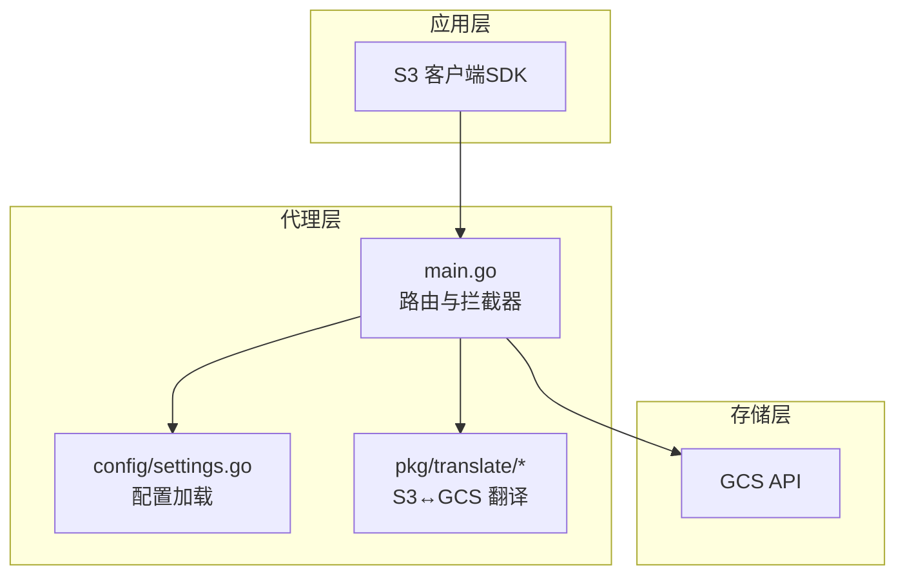
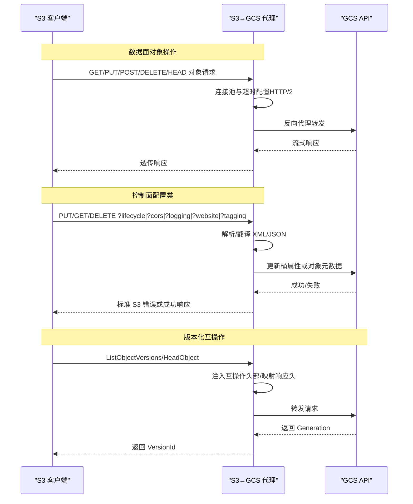
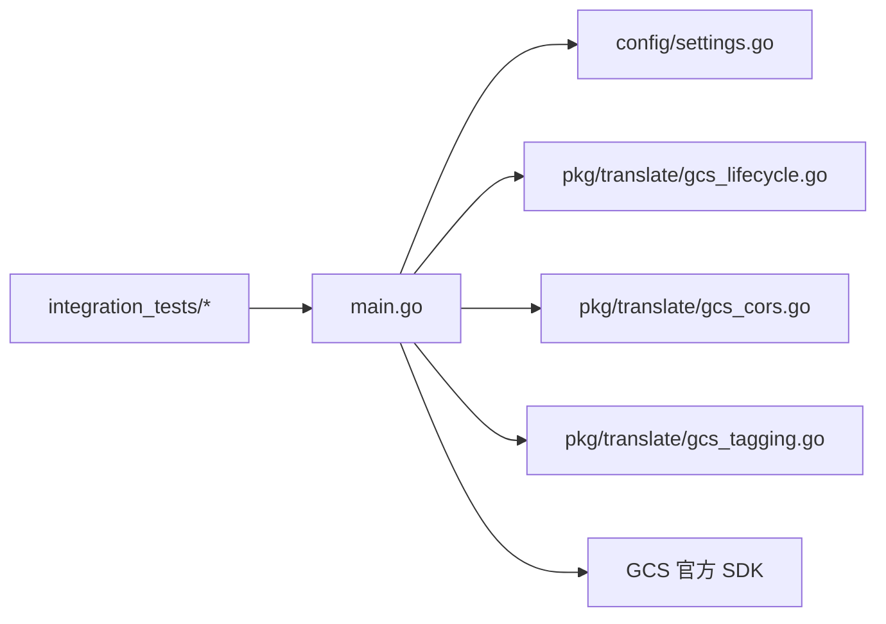

# 使用场景

<cite>
**本文引用的文件**
- [README.md](file://README.md)
- [main.go](file://main.go)
- [config/settings.go](file://config/settings.go)
- [solutions.md](file://solutions.md)
- [test_cases.md](file://test_cases.md)
- [pkg/translate/gcs_lifecycle.go](file://pkg/translate/gcs_lifecycle.go)
- [pkg/translate/gcs_cors.go](file://pkg/translate/gcs_cors.go)
- [pkg/translate/gcs_tagging.go](file://pkg/translate/gcs_tagging.go)
- [integration_tests/data_plane_test.go](file://integration_tests/data_plane_test.go)
- [integration_tests/lifecycle_test.go](file://integration_tests/lifecycle_test.go)
- [integration_tests/test_utils.go](file://integration_tests/test_utils.go)
- [AGENTS.md](file://AGENTS.md)
- [unsupported.txt](file://unsupported.txt)
</cite>

## 目录
1. [简介](#简介)
2. [项目结构](#项目结构)
3. [核心组件](#核心组件)
4. [架构总览](#架构总览)
5. [详细场景与最佳实践](#详细场景与最佳实践)
6. [依赖关系分析](#依赖关系分析)
7. [性能考量](#性能考量)
8. [故障排查指南](#故障排查指南)
9. [结论](#结论)
10. [附录：迁移实施步骤与收益](#附录迁移实施步骤与收益)

## 简介
本项目是一个透明的中间件代理，用于将 AWS S3 兼容客户端（SDK）与 Google Cloud Storage（GCS）对接。它拦截并翻译 S3 的控制面配置类请求（如生命周期、CORS、日志、静态网站、对象标签），同时以高性能反向代理的方式透传数据面对象操作，确保现有 S3 应用在不修改一行代码的前提下，即可零改造迁移到 GCS 存储后端。

## 项目结构
- 根入口与路由：主程序负责加载配置、初始化 GCS 客户端、设置反向代理、注册拦截处理器，并暴露健康检查端点。
- 配置模块：集中读取 .env 或环境变量，统一管理端口、目标桶、DryRun、连接池上限、代理凭据等。
- 翻译包：实现 S3 XML 与 GCS JSON/元数据之间的双向转换，覆盖生命周期、CORS、日志、静态网站、对象标签等。
- 集成测试：独立子模块，使用真实 AWS SDK 客户端验证数据面与控制面功能，支持本地启动代理进行端到端测试。
- 文档与规范：提供使用说明、部署建议、兼容性与限制说明、AI 协作工程规则等。

图表来源
- [main.go:37-252](file://main.go#L37-L252)
- [config/settings.go:29-56](file://config/settings.go#L29-L56)

章节来源
- [README.md:140-157](file://README.md#L140-L157)
- [main.go:37-252](file://main.go#L37-L252)
- [config/settings.go:29-56](file://config/settings.go#L29-L56)

## 核心组件
- 中间件代理与路由
  - 路由器基于轻量级框架，注册所有 S3 方法的通配处理，优先匹配控制面查询参数（如 ?lifecycle、?cors、?logging、?website、?tagging），其余走高性能反向代理。
  - 反向代理针对 GCS 做了连接池与超时优化，启用 HTTP/2，禁用压缩以保留签名完整性。
- 配置中心
  - 支持 .env 与环境变量双通道；默认 DryRun 模式安全测试；可选调试日志；连接池参数可调。
- 控制面翻译器
  - 生命周期：将 S3 XML 规则映射为 GCS JSON 生命周期配置，支持过期与过渡（含多过渡）。
  - CORS：将 S3 CORS XML 映射为 GCS CORS 列表，忽略部分不支持的请求头字段。
  - 日志：将 S3 日志配置映射为 GCS 日志目标与前缀。
  - 静态网站：将 S3 网站配置映射为 GCS 网站首页与错误页。
  - 对象标签：将 S3 对象标签映射为 GCS 自定义元数据，采用乐观并发控制避免覆盖丢失。
- 数据面透传
  - 所有对象操作（上传、下载、分片、列举等）通过反向代理直达 GCS，保持流式传输与连接复用。
- 版本化互操作
  - 请求阶段注入特定头部以触发 S3 兼容响应格式；响应阶段将 GCS 生成号映射为 S3 版本号。

章节来源
- [main.go:254-338](file://main.go#L254-L338)
- [main.go:365-422](file://main.go#L365-L422)
- [main.go:461-504](file://main.go#L461-L504)
- [main.go:542-585](file://main.go#L542-L585)
- [main.go:619-662](file://main.go#L619-L662)
- [main.go:701-766](file://main.go#L701-L766)
- [pkg/translate/gcs_lifecycle.go:38-105](file://pkg/translate/gcs_lifecycle.go#L38-L105)
- [pkg/translate/gcs_cors.go:10-35](file://pkg/translate/gcs_cors.go#L10-L35)
- [pkg/translate/gcs_tagging.go:10-35](file://pkg/translate/gcs_tagging.go#L10-L35)

## 架构总览
下图展示了典型的数据面与控制面交互路径，以及版本化互操作的关键点。

图表来源
- [main.go:198-251](file://main.go#L198-L251)
- [main.go:365-422](file://main.go#L365-L422)
- [main.go:461-504](file://main.go#L461-L504)
- [main.go:542-585](file://main.go#L542-L585)
- [main.go:619-662](file://main.go#L619-L662)
- [main.go:701-766](file://main.go#L701-L766)

## 详细场景与最佳实践

### 场景一：现有 S3 应用零代码迁移至 GCS
- 适用对象：已有大量 S3 SDK 客户端代码的企业应用，希望在不改动业务逻辑的情况下切换后端。
- 关键要点：
  - 使用系统代理环境变量或显式客户端传输路由，将 GCS S3 兼容端点指向本地代理。
  - 确保 SDK 使用路径风格访问（Path-Style），以适配 GCS S3 兼容层。
  - 在开发/测试环境开启 DryRun，避免真实 API 调用；生产环境关闭 DryRun 并配置代理凭据。
- 实施步骤（示例）
  1) 启动代理：设置端口、目标桶、DryRun、连接池参数。
  2) 配置客户端：
     - 方案A：设置系统代理环境变量，指向代理端口。
     - 方案B：在 SDK 初始化中自定义传输，将 GCS 主机重定向到代理。
  3) 验证数据面：上传/下载/列举/分片等标准对象操作。
  4) 验证控制面：生命周期、CORS、日志、静态网站、对象标签等配置。
- 最佳实践
  - 生产环境务必配置代理 HMAC 凭据，以便在需要重签时保证签名有效。
  - 使用 GCS_PREFIX 进行测试隔离，避免污染生产桶。
  - 开启调试日志定位问题，但生产环境建议关闭以降低开销。

章节来源
- [README.md:30-87](file://README.md#L30-L87)
- [README.md:126-137](file://README.md#L126-L137)
- [config/settings.go:29-56](file://config/settings.go#L29-L56)
- [integration_tests/data_plane_test.go:15-106](file://integration_tests/data_plane_test.go#L15-L106)

### 场景二：多云存储策略（混合云/多云）
- 适用对象：需要在多个云厂商之间灵活切换或并存的企业。
- 关键要点：
  - 通过代理抽象出统一的 S3 接口，屏蔽底层存储差异。
  - 不同环境/租户可共享同一代理实例，仅通过目标桶与前缀区分。
  - 控制面配置（生命周期、CORS、日志、静态网站、对象标签）在代理侧完成，无需改动应用。
- 配置差异
  - 开发/测试：DryRun + 较小连接池，便于本地快速验证。
  - 预生产/生产：真实 GCS 客户端 + 更大连接池 + 代理 HMAC 凭据。
  - 多租户：通过 GCS_PREFIX 与不同 TARGET_BUCKET 实现资源隔离。
- 最佳实践
  - 将代理部署在受控网络内，内部入站可使用明文 HTTP 以减少握手延迟，出站使用 HTTPS 保障数据加密与完整性。
  - 使用最小实例与 CPU 常驻策略（如云运行）以降低成本。

章节来源
- [solutions.md:171-200](file://solutions.md#L171-L200)
- [solutions.md:146-159](file://solutions.md#L146-L159)
- [config/settings.go:40-56](file://config/settings.go#L40-L56)

### 场景三：开发测试环境隔离
- 适用对象：团队需要在不同环境（本地、CI、预发布）进行独立验证。
- 关键要点：
  - 使用 GCS_PREFIX 作为命名空间前缀，避免跨环境冲突。
  - DryRun 模式下可进行端到端回归，无需真实 API 调用。
  - 集成测试模块独立于主模块，使用真实 SDK 客户端自动启动代理进行验证。
- 实施步骤
  1) 在 .env 中设置 GCS_PREFIX 与 TARGET_BUCKET。
  2) 启动代理（DryRun）。
  3) 运行集成测试，验证数据面与控制面功能。
  4) 清理测试数据，切换到非 DryRun 进行最终验证。
- 最佳实践
  - 将测试桶与生产桶分离，避免误删或覆盖。
  - 使用 .env 模板管理不同环境的变量，避免硬编码。

章节来源
- [integration_tests/test_utils.go:9-60](file://integration_tests/test_utils.go#L9-L60)
- [integration_tests/lifecycle_test.go:20-55](file://integration_tests/lifecycle_test.go#L20-L55)
- [integration_tests/data_plane_test.go:15-106](file://integration_tests/data_plane_test.go#L15-L106)

### 场景四：控制面功能迁移与配置一致性
- 生命周期（Lifecycle）
  - 支持过期与过渡（含多过渡），并拒绝不受支持的过滤条件（如按大小、按标签）。
  - 代理会将 S3 XML 规则翻译为 GCS JSON 生命周期配置，再通过官方 SDK 更新桶属性。
- CORS
  - 将 S3 CORS XML 映射为 GCS CORS 列表；忽略不支持的请求头字段。
- 日志
  - 将 S3 日志配置映射为 GCS 日志目标与前缀。
- 静态网站
  - 将 S3 网站配置映射为 GCS 网站首页与错误页。
- 对象标签
  - 将 S3 对象标签映射为 GCS 自定义元数据，采用乐观并发控制（If-Metageneration-Match）防止覆盖丢失。
- 最佳实践
  - 在代理侧集中维护控制面配置，避免分散在各应用中。
  - 对于不受支持的过滤条件，提前在 S3 XML 中规避，以免被代理拒绝。

章节来源
- [pkg/translate/gcs_lifecycle.go:38-105](file://pkg/translate/gcs_lifecycle.go#L38-L105)
- [pkg/translate/gcs_cors.go:10-35](file://pkg/translate/gcs_cors.go#L10-L35)
- [pkg/translate/gcs_tagging.go:10-35](file://pkg/translate/gcs_tagging.go#L10-L35)
- [main.go:365-422](file://main.go#L365-L422)
- [main.go:461-504](file://main.go#L461-L504)
- [main.go:542-585](file://main.go#L542-L585)
- [main.go:619-662](file://main.go#L619-L662)
- [main.go:701-766](file://main.go#L701-L766)

### 场景五：版本化互操作与存储类映射
- 版本化互操作
  - 请求阶段：当检测到版本化相关查询时，注入互操作头部以返回 S3 兼容的 XML。
  - 响应阶段：将 GCS 的生成号映射为 S3 的版本号，保证客户端行为一致。
- 存储类映射
  - 代理在转发前根据请求头将 AWS 存储类映射为 GCS 对应类别，必要时触发重签。
- 最佳实践
  - 对于需要版本化的应用，确保使用 ListObjectVersions/HeadObject 的互操作能力。
  - 在客户端明确指定存储类时，尽量使用 GCS 原生字符串，或依赖代理的自动映射。

章节来源
- [main.go:110-183](file://main.go#L110-L183)
- [main.go:190-196](file://main.go#L190-L196)

### 场景六：不同规模企业应用模式
- 个人开发者/小团队
  - 使用本地 DryRun 快速验证，.env 管理少量变量，单代理实例服务多个测试桶。
- 中型企业
  - 多环境（开发/测试/预生产/生产）分离，使用 GCS_PREFIX 与不同 TARGET_BUCKET，代理部署在私有网络内，内部入站明文、出站加密。
- 大型企业
  - 采用云运行或托管集群，结合最小实例与 CPU 常驻策略，按需弹性伸缩；控制面配置集中治理，版本化与存储类映射在代理侧统一处理。

章节来源
- [solutions.md:171-200](file://solutions.md#L171-L200)
- [solutions.md:146-159](file://solutions.md#L146-L159)

## 依赖关系分析
- 组件耦合
  - main.go 依赖 config/settings.go 提供配置；依赖 pkg/translate 包进行控制面翻译；依赖 GCS 官方 SDK 进行桶/对象属性更新。
  - 控制面处理器（生命周期/CORS/日志/网站/标签）均通过统一的 XML/JSON 解析与翻译函数对接 GCS。
- 外部依赖
  - AWS SDK（用于客户端测试与兼容性验证）、GCS 官方 SDK、Chi 路由器、标准库（HTTP、日志、信号处理）。
- 潜在循环依赖
  - 无直接循环导入；翻译包为纯数据结构与转换函数，不依赖 main.go。
- 集成测试
  - 独立子模块，通过构建根目录代理二进制并在测试中启动，验证数据面与控制面。

图表来源
- [main.go:21-30](file://main.go#L21-L30)
- [config/settings.go:11-25](file://config/settings.go#L11-L25)
- [pkg/translate/gcs_lifecycle.go:1-8](file://pkg/translate/gcs_lifecycle.go#L1-L8)
- [pkg/translate/gcs_cors.go:1-8](file://pkg/translate/gcs_cors.go#L1-L8)
- [pkg/translate/gcs_tagging.go:1-7](file://pkg/translate/gcs_tagging.go#L1-L7)

章节来源
- [main.go:21-30](file://main.go#L21-L30)
- [config/settings.go:11-25](file://config/settings.go#L11-L25)
- [integration_tests/lifecycle_test.go:20-55](file://integration_tests/lifecycle_test.go#L20-L55)

## 性能考量
- 连接池与超时
  - 反向代理启用 HTTP/2，禁用压缩以保留签名完整性；设置最大空闲连接数与每主机空闲连接数，延长空闲超时，降低握手开销。
- 内网入站/出站权衡
  - 内部入站使用明文 HTTP 以减少握手延迟；出站使用 HTTPS 保护数据加密与完整性。
- 版本化与存储类映射
  - 仅在必要时触发重签（如存储类变更、携带特殊查询参数），避免对高频数据面造成额外负担。
- 多租户与隔离
  - 通过 GCS_PREFIX 与不同 TARGET_BUCKET 实现资源隔离，避免跨租户争用影响吞吐。

章节来源
- [main.go:74-91](file://main.go#L74-L91)
- [solutions.md:146-159](file://solutions.md#L146-L159)

## 故障排查指南
- 常见问题与定位
  - 签名不匹配：确认是否需要重签（body 已被翻译），若需要请配置代理 HMAC 凭据。
  - 411/长度缺失：某些 SDK 默认空 PUT 缺少 Content-Length，需使用替代传输或客户端配置。
  - 检查和校验：启用调试日志查看请求/响应头，定位具体环节。
  - 控制面失败：检查 S3 XML 是否包含不受支持的过滤条件（如按大小、按标签），或代理是否处于 DryRun 模式。
- 建议流程
  1) 开启调试日志，观察代理输出。
  2) 确认客户端是否使用路径风格访问与正确的端点。
  3) 验证代理是否具备重签权限与正确的目标桶。
  4) 对照测试用例逐项验证数据面与控制面功能。
- 相关实现参考
  - 重签逻辑与头部处理位于代理主流程。
  - 控制面错误统一以标准 S3 XML 错误格式返回。

章节来源
- [main.go:157-182](file://main.go#L157-L182)
- [main.go:377-387](file://main.go#L377-L387)
- [solutions.md:89-132](file://solutions.md#L89-L132)

## 结论
S3Proxy4GCS 通过“控制面翻译 + 数据面透传”的架构，实现了现有 S3 应用对 GCS 的零代码迁移与稳定运行。配合 DryRun、连接池优化、版本化互操作与存储类映射，可在不同规模企业中灵活落地。对于不受支持的功能，项目提供了清晰的限制说明与替代方案，帮助用户做出合理的架构取舍。

## 附录：迁移实施步骤与收益

### 迁移实施步骤（从传统 S3 到 GCS）
- 第一步：准备环境
  - 创建 .env 文件，设置端口、目标桶、GCS 前缀、DryRun、连接池参数等。
  - 如需真实调用，配置代理 HMAC 凭据与 JSON 密钥。
- 第二步：选择接入方式
  - 方案A：系统代理环境变量，全局拦截所有 S3 请求。
  - 方案B：在 SDK 初始化中自定义传输，仅对 GCS 主机重定向到代理。
- 第三步：验证数据面
  - 使用集成测试或自测脚本验证上传/下载/分片/列举等标准对象操作。
- 第四步：验证控制面
  - 配置生命周期、CORS、日志、静态网站、对象标签，确认翻译与更新成功。
- 第五步：切换到生产
  - 关闭 DryRun，配置代理 HMAC 凭据，启用调试日志进行上线验证。

章节来源
- [README.md:10-29](file://README.md#L10-L29)
- [README.md:30-87](file://README.md#L30-L87)
- [integration_tests/data_plane_test.go:15-106](file://integration_tests/data_plane_test.go#L15-L106)
- [integration_tests/lifecycle_test.go:57-119](file://integration_tests/lifecycle_test.go#L57-L119)

### 实际收益
- 成本优化
  - 通过 DryRun 与连接池优化，降低测试与开发阶段的成本与资源占用。
  - 在私有网络内使用明文 HTTP 降低入站握手成本，出站 HTTPS 保障安全。
- 性能提升
  - 反向代理启用 HTTP/2 与连接池复用，显著提升高并发场景下的吞吐与延迟表现。
  - 版本化互操作与存储类映射在必要时才触发重签，避免对数据面造成额外负担。
- 功能扩展
  - 控制面统一治理，支持生命周期、CORS、日志、静态网站、对象标签等配置的集中维护。
  - 对象标签通过元数据与乐观并发控制实现，满足细粒度标记需求。

章节来源
- [solutions.md:146-159](file://solutions.md#L146-L159)
- [main.go:74-91](file://main.go#L74-L91)
- [pkg/translate/gcs_tagging.go:10-35](file://pkg/translate/gcs_tagging.go#L10-L35)