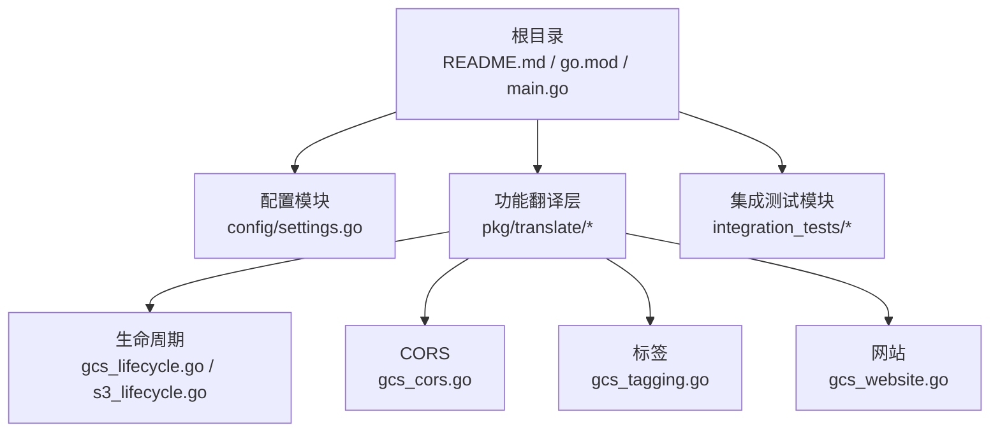
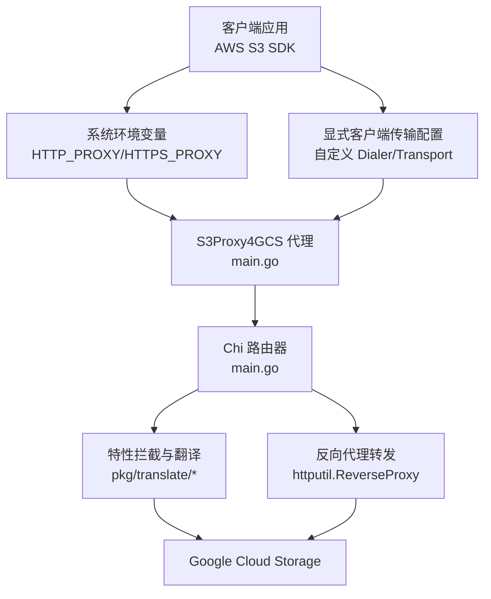
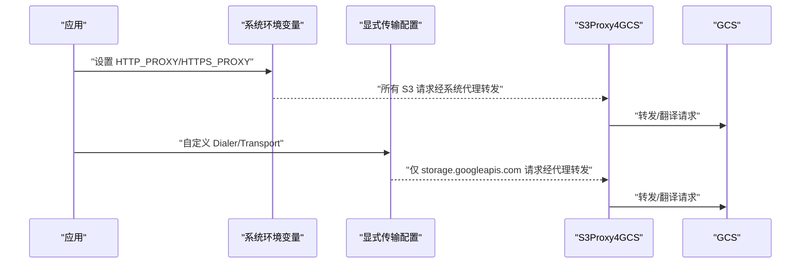
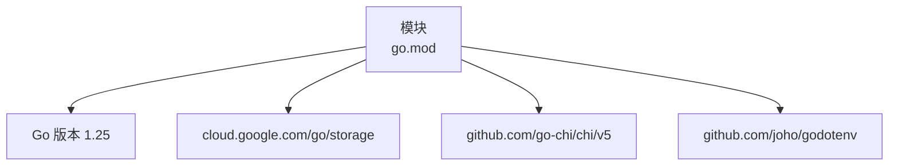

# 快速开始

<cite>
**本文引用的文件**
- [README.md](file://README.md)
- [main.go](file://main.go)
- [config/settings.go](file://config/settings.go)
- [go.mod](file://go.mod)
- [integration_tests/test_utils.go](file://integration_tests/test_utils.go)
- [integration_tests/data_plane_test.go](file://integration_tests/data_plane_test.go)
- [integration_tests/logging_test.go](file://integration_tests/logging_test.go)
- [pkg/translate/gcs_lifecycle.go](file://pkg/translate/gcs_lifecycle.go)
- [pkg/translate/gcs_cors.go](file://pkg/translate/gcs_cors.go)
- [pkg/translate/gcs_tagging.go](file://pkg/translate/gcs_tagging.go)
- [pkg/translate/gcs_website.go](file://pkg/translate/gcs_website.go)
- [pkg/translate/s3_lifecycle.go](file://pkg/translate/s3_lifecycle.go)
</cite>

## 目录
1. [简介](#简介)
2. [项目结构](#项目结构)
3. [核心组件](#核心组件)
4. [架构总览](#架构总览)
5. [详细组件分析](#详细组件分析)
6. [依赖分析](#依赖分析)
7. [性能考虑](#性能考虑)
8. [故障排查指南](#故障排查指南)
9. [结论](#结论)
10. [附录](#附录)

## 简介
本指南面向首次使用 S3Proxy4GCS 的用户，目标是帮助你在最短时间内完成安装与配置，并通过两种常见方式验证代理服务可用性：通过系统环境变量透明代理（HTTP_PROXY）与通过显式客户端传输配置。文档覆盖从 Go 环境准备、依赖安装、配置文件设置到具体使用示例与常见问题排查，确保你可以快速搭建并测试。

## 项目结构
- 根目录入口与主逻辑：main.go
- 配置模块：config/settings.go
- 功能特性（翻译层）：pkg/translate 下的生命周期、CORS、日志、网站、标签等双向转换
- 集成测试模块：integration_tests（独立子模块，使用真实 AWS SDK 测试）

**图示来源**
- [README.md](file://README.md)
- [main.go](file://main.go)
- [config/settings.go](file://config/settings.go)
- [pkg/translate/gcs_lifecycle.go](file://pkg/translate/gcs_lifecycle.go)
- [pkg/translate/s3_lifecycle.go](file://pkg/translate/s3_lifecycle.go)
- [pkg/translate/gcs_cors.go](file://pkg/translate/gcs_cors.go)
- [pkg/translate/gcs_tagging.go](file://pkg/translate/gcs_tagging.go)
- [pkg/translate/gcs_website.go](file://pkg/translate/gcs_website.go)

**章节来源**
- [README.md](file://README.md)
- [main.go](file://main.go)
- [config/settings.go](file://config/settings.go)

## 核心组件
- 服务器入口与路由：在 main.go 中初始化配置、构建反向代理、注册健康检查与 S3 请求拦截处理函数。
- 配置加载：config/settings.go 支持从 .env 或环境变量加载参数，统一管理端口、目标桶、DryRun、连接池、代理凭据与 JSON Key 等。
- 特性翻译：pkg/translate 提供 S3 XML 与 GCS JSON/SDK 类型之间的双向映射，覆盖生命周期、CORS、日志、网站、对象标签等。

**章节来源**
- [main.go](file://main.go)
- [config/settings.go](file://config/settings.go)
- [pkg/translate/gcs_lifecycle.go](file://pkg/translate/gcs_lifecycle.go)
- [pkg/translate/gcs_cors.go](file://pkg/translate/gcs_cors.go)
- [pkg/translate/gcs_tagging.go](file://pkg/translate/gcs_tagging.go)
- [pkg/translate/gcs_website.go](file://pkg/translate/gcs_website.go)

## 架构总览
下图展示了请求从客户端到代理再到 GCS 的整体流程，以及代理对特定 S3 XML 操作的拦截与翻译。

**图示来源**
- [main.go](file://main.go)
- [config/settings.go](file://config/settings.go)
- [pkg/translate/gcs_lifecycle.go](file://pkg/translate/gcs_lifecycle.go)
- [pkg/translate/gcs_cors.go](file://pkg/translate/gcs_cors.go)
- [pkg/translate/gcs_tagging.go](file://pkg/translate/gcs_tagging.go)
- [pkg/translate/gcs_website.go](file://pkg/translate/gcs_website.go)

## 详细组件分析

### 安装与运行
- Go 版本要求：项目模块声明使用 Go 1.25；建议使用与模块一致或更高版本以获得最佳兼容性。
- 初始化依赖：执行模块依赖整理。
- 启动服务：直接运行根目录入口，监听配置中指定端口。

操作要点
- 使用模块内提供的命令进行依赖整理与本地运行。
- 如需在集成测试模块中运行测试，请参考集成测试章节。

**章节来源**
- [go.mod](file://go.mod)
- [README.md](file://README.md)

### 配置文件与环境变量
- 复制模板：将仓库中的 .env 示例文件复制为 .env 并按需编辑。
- 关键配置项
  - PORT：代理监听端口，默认 8080
  - GCP_PROJECT_ID：目标 GCP 项目 ID
  - TARGET_BUCKET：目标 GCS 存储桶名称
  - STORAGE_BASE_URL：GCS 基础端点，默认 https://storage.googleapis.com
  - GCS_PREFIX：命名空间前缀，用于隔离测试数据
  - DRY_RUN：是否禁用真实 GCS API 调用（默认开启，适合本地测试）
  - JSON_KEY：GCS 服务账号密钥文件路径（启用真实 API 调用时需要）
  - PROXY_AWS_ACCESS_KEY_ID / PROXY_AWS_SECRET_ACCESS_KEY：代理用于重签名请求的凭证（可与 AWS_ACCESS_KEY_ID/SECRET_ACCESS_KEY 兼容）
  - MAX_IDLE_CONNS / MAX_IDLE_CONNS_PER_HOST：反向代理连接池上限
- 加载顺序：优先读取 .env 文件，若不存在则直接从环境变量加载。

提示
- 若未设置 JSON_KEY，代理将以 DryRun 模式运行，所有非直通对象操作仅返回模拟响应。
- 若设置了 JSON_KEY，则会初始化真实 GCS 客户端并允许对 GCS 进行写入操作。

**章节来源**
- [README.md](file://README.md)
- [config/settings.go](file://config/settings.go)

### 使用方式一：通过 HTTP_PROXY 环境变量透明代理
适用场景
- 不修改现有 SDK 初始化逻辑，通过系统级代理变量将所有 S3 请求透明转发至本地代理。

步骤
- 设置 HTTP_PROXY/HTTPS_PROXY 指向本地代理地址与端口。
- 在 SDK 初始化时保持标准 S3 端点不变，但务必启用 Path-Style 地址（这是与 GCS 兼容的关键）。
- 启动代理后，SDK 所有 S3 请求将被代理捕获并按需转发或翻译。

注意
- 该方式对全局网络生效，可能影响其他流量；如需更精确控制，可选择“使用方式二”。

**章节来源**
- [README.md](file://README.md)

### 使用方式二：通过显式客户端传输配置
适用场景
- 不改变 SDK 初始化逻辑，但通过自定义 Dialer/Transport 将指向 storage.googleapis.com 的请求定向到本地代理，避免对其他流量产生副作用。

步骤
- 自定义 http.Transport 的 DialContext，在目标为 storage.googleapis.com 时强制走本地代理端口。
- 保持 SDK BaseEndpoint 为标准 S3 兼容端点，UsePathStyle 设为 true。
- 启动代理后，SDK 对 GCS 的请求将被代理捕获并按需转发或翻译。

参考示例
- 可在集成测试中找到显式传输配置的完整示例，便于对照实现。

**章节来源**
- [README.md](file://README.md)
- [integration_tests/data_plane_test.go](file://integration_tests/data_plane_test.go)

### 两种使用方式的调用序列对比

**图示来源**
- [README.md](file://README.md)
- [integration_tests/data_plane_test.go](file://integration_tests/data_plane_test.go)

## 依赖分析
- Go 版本：模块声明为 1.25
- 主要外部依赖
  - Google Cloud Storage SDK：用于真实 GCS API 调用
  - Chi 路由器：用于请求路由与中间件
  - godotenv：用于加载 .env 文件

**图示来源**
- [go.mod](file://go.mod)

**章节来源**
- [go.mod](file://go.mod)

## 性能考虑
- 反向代理连接池：通过 MAX_IDLE_CONNS 与 MAX_IDLE_CONNS_PER_HOST 控制连接复用，减少握手开销。
- 传输层优化：启用 HTTP/2、禁用压缩以保留 S3 签名所需的 Accept-Encoding、设置合理的超时。
- 日志级别：生产环境建议关闭 DEBUG_LOGGING，以降低日志输出对性能的影响。

**章节来源**
- [config/settings.go](file://config/settings.go)
- [main.go](file://main.go)

## 故障排查指南
- 无法连接到代理
  - 检查 PORT 是否正确，确认代理进程已启动且监听对应端口。
  - 若使用 HTTP_PROXY/HTTPS_PROXY，请确认变量值格式正确且与代理端口一致。
- 代理返回 DryRun 响应
  - DRY_RUN 默认开启，若希望访问真实 GCS，请设置 DRY_RUN=false 并提供 JSON_KEY。
- 认证失败或签名错误
  - 若需要重签名请求，请设置 PROXY_AWS_ACCESS_KEY_ID 与 PROXY_AWS_SECRET_ACCESS_KEY。
  - 注意：某些 SDK 行为（如 Accept-Encoding: identity、x-id 查询参数）会被代理自动处理，必要时请在客户端侧配合调整。
- CORS/Website/Lifecycle/Logging/Tagging 等特性未生效
  - 确认已设置 JSON_KEY 以启用真实 GCS 写入。
  - 对于 Website/CORS 等配置，需确保目标存储桶存在且具备相应权限。
- 集成测试无法运行
  - 请在 integration_tests 目录下执行模块依赖整理与测试命令，确保测试模块能正确发现 .env 中的配置。

**章节来源**
- [README.md](file://README.md)
- [config/settings.go](file://config/settings.go)
- [integration_tests/test_utils.go](file://integration_tests/test_utils.go)

## 结论
通过本指南，你已经完成了 S3Proxy4GCS 的安装与基础配置，并掌握了两种使用方式（环境变量透明代理与显式客户端传输配置）。建议先以 DRY_RUN 模式进行本地验证，再在准备好 JSON_KEY 与代理凭据后切换到真实模式进行端到端测试。

## 附录

### 快速命令清单
- 复制并编辑 .env
  - cp .env.example .env
- 初始化依赖
  - go mod tidy
- 启动代理
  - go run .
- 运行集成测试（在 integration_tests 目录）
  - cd integration_tests
  - go mod tidy
  - go test -v ./...

**章节来源**
- [README.md](file://README.md)

### 关键配置项一览
- PORT：代理监听端口（默认 8080）
- GCP_PROJECT_ID：GCP 项目 ID
- TARGET_BUCKET：目标 GCS 存储桶
- STORAGE_BASE_URL：GCS 基础端点（默认 https://storage.googleapis.com）
- GCS_PREFIX：命名空间前缀
- DRY_RUN：DryRun 开关（默认 true）
- JSON_KEY：GCS 服务账号密钥文件路径
- PROXY_AWS_ACCESS_KEY_ID / PROXY_AWS_SECRET_ACCESS_KEY：代理重签名凭据
- MAX_IDLE_CONNS / MAX_IDLE_CONNS_PER_HOST：反向代理连接池上限

**章节来源**
- [config/settings.go](file://config/settings.go)

### 两种使用方式的实现要点
- 环境变量透明代理
  - 设置 HTTP_PROXY/HTTPS_PROXY 指向本地代理
  - SDK 保持标准 S3 端点，启用 Path-Style 地址
- 显式客户端传输配置
  - 自定义 http.Transport 的 DialContext，将 storage.googleapis.com 请求定向到本地代理
  - 保持 BaseEndpoint 为标准 S3 兼容端点，UsePathStyle 为 true

**章节来源**
- [README.md](file://README.md)
- [integration_tests/data_plane_test.go](file://integration_tests/data_plane_test.go)