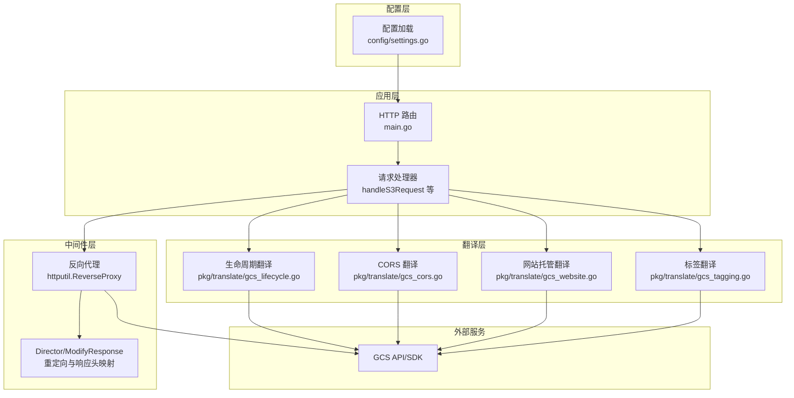
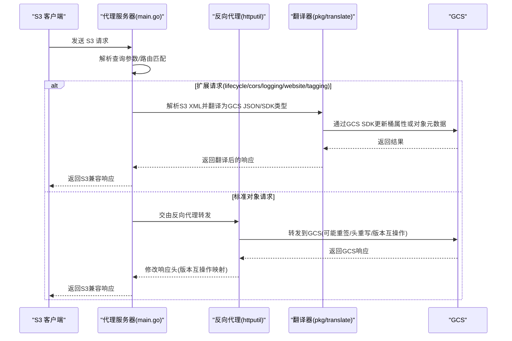
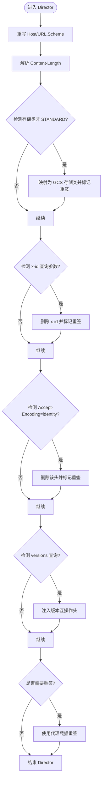
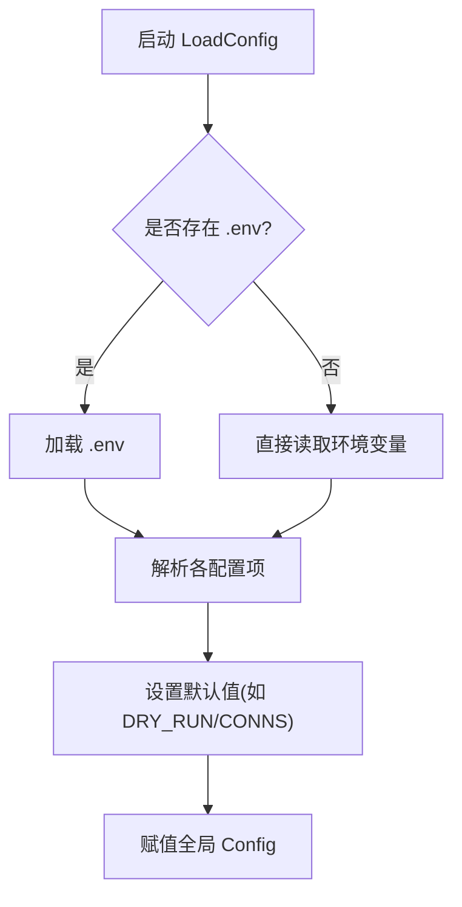
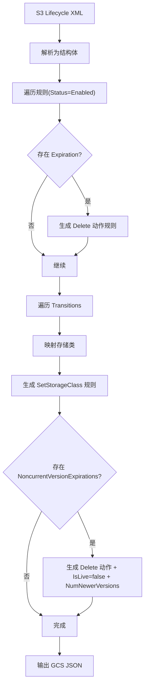
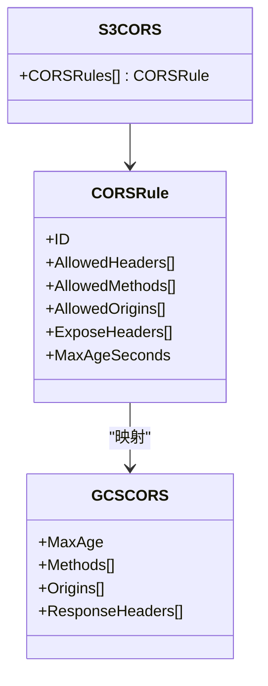
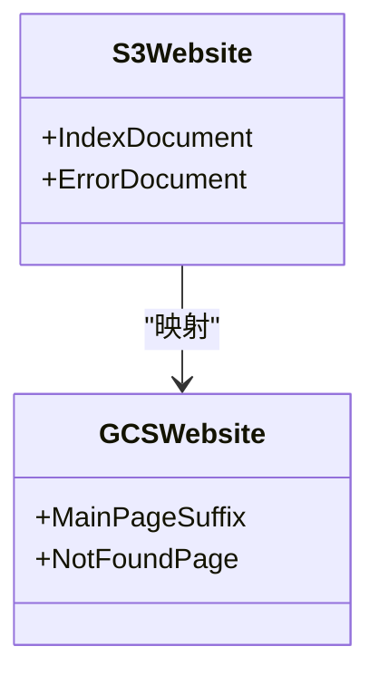
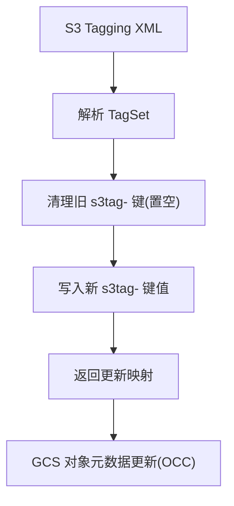
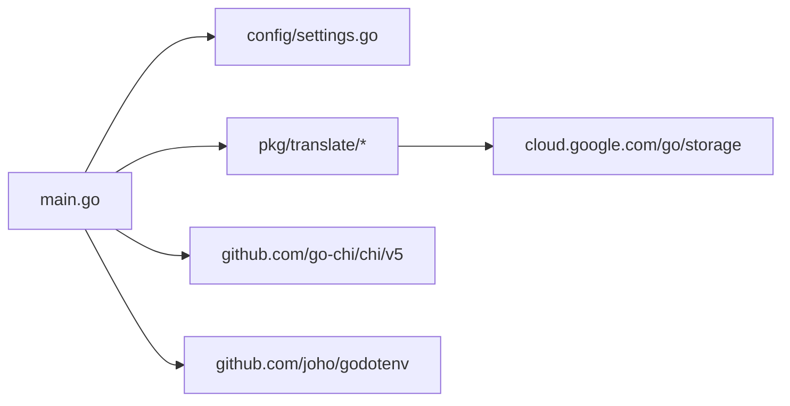

# 技术架构

<cite>
**本文引用的文件**
- [main.go](file://main.go)
- [config/settings.go](file://config/settings.go)
- [pkg/translate/s3_cors.go](file://pkg/translate/s3_cors.go)
- [pkg/translate/gcs_cors.go](file://pkg/translate/gcs_cors.go)
- [pkg/translate/s3_lifecycle.go](file://pkg/translate/s3_lifecycle.go)
- [pkg/translate/gcs_lifecycle.go](file://pkg/translate/gcs_lifecycle.go)
- [pkg/translate/s3_tagging.go](file://pkg/translate/s3_tagging.go)
- [pkg/translate/gcs_tagging.go](file://pkg/translate/gcs_tagging.go)
- [pkg/translate/gcs_website.go](file://pkg/translate/gcs_website.go)
- [go.mod](file://go.mod)
- [README.md](file://README.md)
- [integration_tests/test_utils.go](file://integration_tests/test_utils.go)
</cite>

## 目录
1. [简介](#简介)
2. [项目结构](#项目结构)
3. [核心组件](#核心组件)
4. [架构总览](#架构总览)
5. [组件详解](#组件详解)
6. [依赖关系分析](#依赖关系分析)
7. [性能与可靠性特性](#性能与可靠性特性)
8. [故障排查指南](#故障排查指南)
9. [结论](#结论)
10. [附录](#附录)

## 简介
本项目是一个面向 GCS 的 S3 兼容代理，通过反向代理与翻译器模块，将 S3 客户端的请求透明地转换为 GCS 可接受的格式，并在必要时进行签名重签与版本互操作映射。系统支持生命周期、CORS、日志、网站托管与对象标签等扩展能力的双向翻译，并提供连接池优化、优雅关闭、超时控制等工程化特性，便于在生产环境中稳定运行。

## 项目结构
- 根目录入口：main.go 提供 HTTP 路由、反向代理、请求拦截与处理器注册。
- 配置模块：config/settings.go 提供集中式环境变量加载与默认值设置。
- 翻译器模块：pkg/translate 下按功能划分的 S3/GCS 数据模型与双向翻译逻辑。
- 依赖声明：go.mod 明确第三方库与版本约束。
- 文档与测试：README.md 提供使用说明；integration_tests 子模块用于集成测试。

图示来源
- [main.go:37-252](file://main.go#L37-L252)
- [config/settings.go:29-57](file://config/settings.go#L29-L57)
- [pkg/translate/gcs_lifecycle.go:38-105](file://pkg/translate/gcs_lifecycle.go#L38-L105)
- [pkg/translate/gcs_cors.go:10-35](file://pkg/translate/gcs_cors.go#L10-L35)
- [pkg/translate/gcs_website.go:9-26](file://pkg/translate/gcs_website.go#L9-L26)
- [pkg/translate/gcs_tagging.go:10-35](file://pkg/translate/gcs_tagging.go#L10-L35)

章节来源
- [main.go:1-838](file://main.go#L1-L838)
- [config/settings.go:1-65](file://config/settings.go#L1-L65)
- [go.mod:1-61](file://go.mod#L1-L61)
- [README.md:140-157](file://README.md#L140-L157)

## 核心组件
- 配置中心：集中加载环境变量与默认值，支持端口、目标桶、DryRun、连接池参数、代理凭据与 JSON 密钥路径等。
- 反向代理：基于标准库 httputil.NewSingleHostReverseProxy，自定义 Director 与 ModifyResponse，完成 S3 头部重写、签名重签、版本互操作映射与响应头转换。
- 请求拦截器：根据查询参数识别生命周期、CORS、日志、网站、标签等扩展请求，交由对应处理器处理；其余请求透传至 GCS。
- 翻译器：提供 S3 XML 与 GCS JSON/SDK 类型之间的双向转换，覆盖生命周期、CORS、网站托管与对象标签。
- 日志与可观测性：采用 log/slog 输出结构化 JSON 日志，支持调试模式。
- 运行时控制：优雅关闭、信号处理、超时控制与连接池参数调优。

章节来源
- [config/settings.go:11-25](file://config/settings.go#L11-L25)
- [main.go:37-252](file://main.go#L37-L252)
- [main.go:254-338](file://main.go#L254-L338)
- [README.md:89-98](file://README.md#L89-L98)

## 架构总览
系统采用“路由分发 + 反向代理 + 翻译器”的分层架构：
- 路由层：基于 chi 路由注册健康检查与通配符处理器。
- 中间层：反向代理负责将请求转发到 GCS，并在 Director 中执行头部重写、签名重签与版本互操作注入。
- 翻译层：针对特定扩展请求（如 lifecycle/cors/logging/website/tagging）解析 S3 XML，转换为 GCS JSON 或 SDK 类型，再通过官方 SDK 更新 GCS。
- 配置层：统一从环境变量加载配置，支持 DryRun 模式与连接池参数调优。

图示来源
- [main.go:254-338](file://main.go#L254-L338)
- [main.go:365-422](file://main.go#L365-L422)
- [main.go:461-504](file://main.go#L461-L504)
- [main.go:542-600](file://main.go#L542-L600)
- [main.go:619-662](file://main.go#L619-L662)
- [main.go:701-766](file://main.go#L701-L766)

## 组件详解

### 反向代理与请求拦截
- 初始化：解析 STORAGE_BASE_URL 为 GCS 基础地址，创建单主机反向代理。
- Director：重写 Host/URL Scheme，处理 Content-Length，执行存储类映射、x-id 参数剥离、Accept-Encoding 规避、版本互操作注入，并在需要时进行 AWS4-HMAC 重签。
- ModifyResponse：在入站响应中将 x-goog-generation 映射为 x-amz-version-id，实现版本互操作。
- 传输层：启用 HTTP/2、禁用压缩以保留 S3 签名所需的 Accept-Encoding、设置空闲连接数与超时，提升吞吐与稳定性。
- 路由：注册 /health 健康检查与通配符处理器，拦截 ?lifecycle/?cors/?logging/?website/?tagging 查询参数，其余请求透传。

图示来源
- [main.go:93-183](file://main.go#L93-L183)

章节来源
- [main.go:68-91](file://main.go#L68-L91)
- [main.go:93-183](file://main.go#L93-L183)
- [main.go:185-196](file://main.go#L185-L196)
- [main.go:198-218](file://main.go#L198-L218)

### 配置管理
- 支持 .env 文件与环境变量混合加载，优先使用环境变量。
- 关键配置项：端口、GCP 项目、目标桶、GCS 基础 URL、前缀、DryRun、调试日志、连接池上限、代理访问密钥、代理密钥、JSON 密钥路径。
- 默认值：DRY_RUN 默认开启（安全），MAX_IDLE_CONNS/MAX_IDLE_CONNS_PER_HOST 默认较大以提升吞吐。

图示来源
- [config/settings.go:29-57](file://config/settings.go#L29-L57)

章节来源
- [config/settings.go:11-25](file://config/settings.go#L11-L25)
- [config/settings.go:29-57](file://config/settings.go#L29-L57)
- [README.md:18-29](file://README.md#L18-L29)

### 生命周期翻译器
- 输入：S3 LifecycleConfiguration XML。
- 输出：GCS JSON 字节流，或反向转换为 S3 XML。
- 支持规则：过期（Delete）、过渡（SetStorageClass）、非当前版本过期（Delete + IsLive=false + NumNewerVersions）。
- 不支持过滤：ObjectSizeGreaterThan/LessThan、Tag 过滤在 S3 到 GCS 翻译中被拒绝。
- 存储类映射：STANDARD_IA/ONEZONE_IA→NEARLINE，INTELLIGENT_TIERING→STANDARD，GLACIER/GLACIER_IR→COLDLINE，DEEP_ARCHIVE→ARCHIVE。
- 日期格式：S3 日期字符串截断为 yyyy-mm-dd。

图示来源
- [pkg/translate/s3_lifecycle.go:7-78](file://pkg/translate/s3_lifecycle.go#L7-L78)
- [pkg/translate/gcs_lifecycle.go:38-105](file://pkg/translate/gcs_lifecycle.go#L38-L105)
- [pkg/translate/gcs_lifecycle.go:107-137](file://pkg/translate/gcs_lifecycle.go#L107-L137)
- [pkg/translate/gcs_lifecycle.go:139-154](file://pkg/translate/gcs_lifecycle.go#L139-L154)

章节来源
- [pkg/translate/s3_lifecycle.go:7-78](file://pkg/translate/s3_lifecycle.go#L7-L78)
- [pkg/translate/gcs_lifecycle.go:38-105](file://pkg/translate/gcs_lifecycle.go#L38-L105)
- [pkg/translate/gcs_lifecycle.go:107-137](file://pkg/translate/gcs_lifecycle.go#L107-L137)
- [pkg/translate/gcs_lifecycle.go:139-154](file://pkg/translate/gcs_lifecycle.go#L139-L154)

### CORS 翻译器
- S3 CORS XML → GCS storage.CORS 切片：忽略 S3 的 AllowedHeaders（GCS 不原生支持），保留 MaxAge、Methods、Origins、ExposeHeaders。
- GCS CORS → S3 CORS XML：反向映射，将 MaxAge 转换为秒。

图示来源
- [pkg/translate/s3_cors.go:5-19](file://pkg/translate/s3_cors.go#L5-L19)
- [pkg/translate/gcs_cors.go:10-35](file://pkg/translate/gcs_cors.go#L10-L35)

章节来源
- [pkg/translate/s3_cors.go:5-19](file://pkg/translate/s3_cors.go#L5-L19)
- [pkg/translate/gcs_cors.go:10-35](file://pkg/translate/gcs_cors.go#L10-L35)

### 网站托管翻译器
- S3 WebsiteConfiguration → GCS storage.BucketWebsite：映射 IndexDocument.Suffix 为主页后缀，ErrorDocument.Key 为 404 页面。
- GCS → S3：反向映射主页后缀与 404 页面。

图示来源
- [pkg/translate/gcs_website.go:9-26](file://pkg/translate/gcs_website.go#L9-L26)

章节来源
- [pkg/translate/gcs_website.go:9-26](file://pkg/translate/gcs_website.go#L9-L26)

### 对象标签翻译器
- S3 Tagging → GCS Metadata：以 s3tag- 为前缀写入键，先清理旧 s3tag- 键，再写入新键值，实现幂等更新。
- GCS Metadata → S3 Tagging：过滤 s3tag- 前缀键，还原为 S3 TagSet。
- 使用对象元数据更新接口，结合乐观并发控制（IfMetagenerationMatch）避免覆盖冲突。

图示来源
- [pkg/translate/gcs_tagging.go:10-35](file://pkg/translate/gcs_tagging.go#L10-L35)

章节来源
- [pkg/translate/s3_tagging.go:5-10](file://pkg/translate/s3_tagging.go#L5-L10)
- [pkg/translate/gcs_tagging.go:10-35](file://pkg/translate/gcs_tagging.go#L10-L35)
- [main.go:701-766](file://main.go#L701-L766)

### 扩展请求处理器
- 生命周期：PUT/GET/DELETE ?lifecycle，解析 S3 XML，翻译为 GCS JSON/SDK，更新桶属性；GET 返回 S3 XML。
- CORS：PUT/GET/DELETE ?cors，解析 S3 XML，翻译为 GCS CORS，更新桶属性；GET 返回 S3 XML。
- 日志：PUT/GET/DELETE ?logging，解析 S3 XML，翻译为 GCS Logging，更新桶属性；GET 返回 S3 XML。
- 网站：PUT/GET/DELETE ?website，解析 S3 XML，翻译为 GCS Website，更新桶属性；GET 返回 S3 XML。
- 标签：PUT/GET/DELETE ?tagging，解析 S3 XML，翻译为 GCS Metadata，更新对象元数据；GET 返回 S3 XML。

章节来源
- [main.go:365-422](file://main.go#L365-L422)
- [main.go:461-504](file://main.go#L461-L504)
- [main.go:542-600](file://main.go#L542-L600)
- [main.go:619-662](file://main.go#L619-L662)
- [main.go:701-766](file://main.go#L701-L766)

## 依赖关系分析
- 第三方依赖：cloud.google.com/go/storage（GCS SDK）、github.com/go-chi/chi/v5（HTTP 路由）、github.com/joho/godotenv（.env 加载）。
- 版本约束：Go 1.25+，确保与最新云 SDK 兼容。
- 内部依赖：main.go 依赖 config 与 pkg/translate；翻译器模块相互独立，仅依赖 GCS SDK 类型。

图示来源
- [go.mod:5-9](file://go.mod#L5-L9)
- [main.go:21-29](file://main.go#L21-L29)

章节来源
- [go.mod:1-61](file://go.mod#L1-L61)
- [main.go:21-29](file://main.go#L21-L29)

## 性能与可靠性特性
- 连接池优化：http.Transport 设置 MaxIdleConns、MaxIdleConnsPerHost、IdleConnTimeout、TLSHandshakeTimeout、ExpectContinueTimeout，禁用压缩以保留 S3 签名所需头，启用 HTTP/2 提升多路复用。
- 优雅关闭：监听 SIGTERM/SIGINT，最多等待 10 秒完成现有请求，失败则强制关闭。
- 超时控制：传输层超时参数防止挂起；GCS SDK 调用使用请求上下文，可随请求取消而终止。
- DryRun：禁用真实 GCS API 调用，便于本地测试与验证翻译逻辑。
- 版本互操作：在请求头注入版本互操作标志，在响应头映射版本号，保证 S3 客户端行为一致。

章节来源
- [main.go:68-91](file://main.go#L68-L91)
- [main.go:220-251](file://main.go#L220-L251)
- [main.go:151-196](file://main.go#L151-L196)
- [README.md:94-97](file://README.md#L94-L97)

## 故障排查指南
- 启动失败：检查 STORAGE_BASE_URL、TARGET_BUCKET、GCP 项目与凭据配置；确认 .env 是否存在且字段正确。
- 代理无响应：确认 PORT 开放、防火墙策略；查看日志中是否有反向代理错误或 GCS SDK 调用失败。
- 签名问题：若未设置 PROXY_AWS_ACCESS_KEY_ID/PROXY_AWS_SECRET_ACCESS_KEY，Director 中会跳过重签，导致 GCS 认证失败。
- CORS/网站/日志/标签更新无效：确认 DryRun=false 且 JSON_KEY 路径有效；检查 GCS 权限与桶属性更新返回状态。
- 生命周期翻译失败：检查 S3 XML 结构与过滤条件；ObjectSizeGreaterThan/LessThan、Tag 过滤不被支持。
- 标签冲突：对象标签更新使用 OCC，若出现冲突（如 412），需重试读取最新元数据后再次更新。

章节来源
- [config/settings.go:29-57](file://config/settings.go#L29-L57)
- [main.go:157-182](file://main.go#L157-L182)
- [main.go:365-422](file://main.go#L365-L422)
- [main.go:701-766](file://main.go#L701-L766)

## 结论
本项目通过清晰的分层架构与完善的翻译器模块，实现了 S3 与 GCS 在协议与语义层面的互通。反向代理负责透明转发与必要的头部重写/重签，扩展请求处理器通过翻译器将 S3 XML 映射到 GCS SDK/JSON，从而在不修改客户端代码的前提下，实现对 GCS 的完整能力覆盖。配合连接池优化、优雅关闭与超时控制，系统具备良好的生产可用性与可观测性。

## 附录
- 集成测试：integration_tests 子模块使用独立 go.mod，通过 AWS S3 SDK 自动化验证代理行为，无需污染主模块。
- 环境变量参考：README.md 提供完整配置项说明与使用示例。

章节来源
- [README.md:112-123](file://README.md#L112-L123)
- [integration_tests/test_utils.go:9-112](file://integration_tests/test_utils.go#L9-L112)