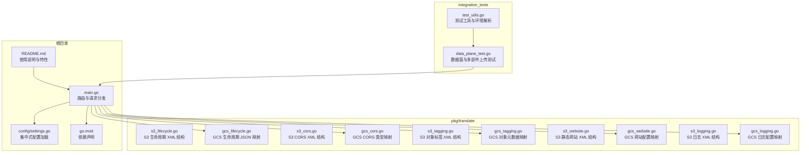
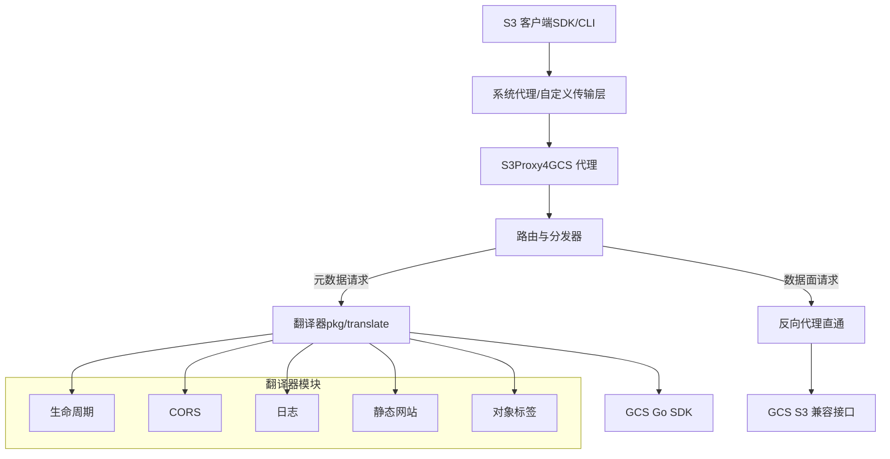
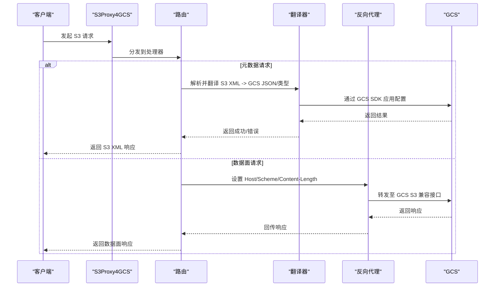
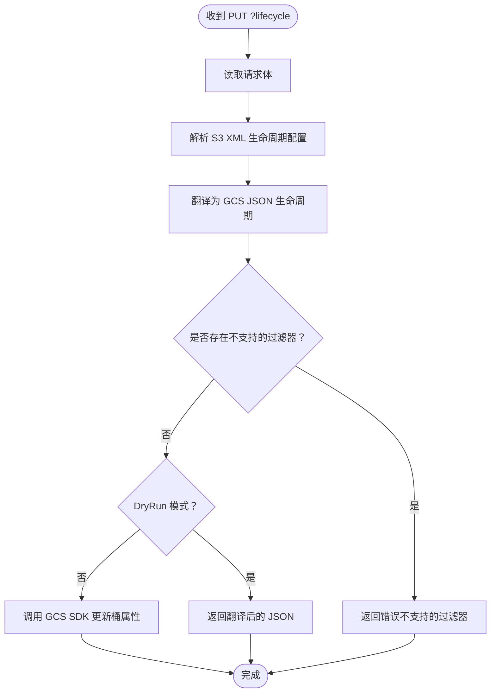
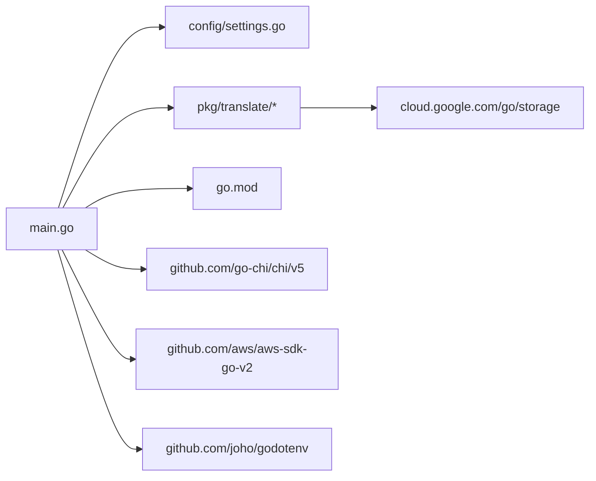

# 项目概述

<cite>
**本文档引用的文件**
- [README.md](file://README.md)
- [main.go](file://main.go)
- [config/settings.go](file://config/settings.go)
- [go.mod](file://go.mod)
- [pkg/translate/s3_cors.go](file://pkg/translate/s3_cors.go)
- [pkg/translate/gcs_cors.go](file://pkg/translate/gcs_cors.go)
- [pkg/translate/s3_lifecycle.go](file://pkg/translate/s3_lifecycle.go)
- [pkg/translate/gcs_lifecycle.go](file://pkg/translate/gcs_lifecycle.go)
- [pkg/translate/s3_tagging.go](file://pkg/translate/s3_tagging.go)
- [pkg/translate/gcs_tagging.go](file://pkg/translate/gcs_tagging.go)
- [pkg/translate/s3_website.go](file://pkg/translate/s3_website.go)
- [pkg/translate/gcs_website.go](file://pkg/translate/gcs_website.go)
- [pkg/translate/s3_logging.go](file://pkg/translate/s3_logging.go)
- [pkg/translate/gcs_logging.go](file://pkg/translate/gcs_logging.go)
- [integration_tests/test_utils.go](file://integration_tests/test_utils.go)
- [integration_tests/data_plane_test.go](file://integration_tests/data_plane_test.go)
</cite>

## 目录
1. [简介](#简介)
2. [项目结构](#项目结构)
3. [核心组件](#核心组件)
4. [架构总览](#架构总览)
5. [详细组件分析](#详细组件分析)
6. [依赖关系分析](#依赖关系分析)
7. [性能考虑](#性能考虑)
8. [故障排查指南](#故障排查指南)
9. [结论](#结论)
10. [附录](#附录)

## 简介
S3Proxy4GCS 是一个面向 AWS S3 兼容客户端 SDK 的中间件代理，用于在标准 S3 API 与 Google Cloud Storage（GCS）之间进行透明转换与转发。它拦截并翻译 S3 特有的元数据配置（如生命周期、CORS、日志、静态网站托管、对象标签）到 GCS 可用的等价模型，并通过官方 GCS Go SDK 将这些配置应用到真实存储中；对于常规的对象数据平面操作，则采用高性能反向代理直通模式，确保兼容性和性能。

本项目的核心价值在于：
- 零代码改造接入：通过环境变量或自定义 HTTP 客户端传输层，即可让现有 S3 SDK 在不修改业务代码的情况下访问 GCS。
- 透明兼容：自动处理 S3 与 GCS 的差异（如签名重签、路径风格地址、版本互操作头、存储类别映射等），屏蔽底层差异。
- 可观测与可运维：内置结构化 JSON 日志、优雅关闭、连接池与超时控制、DryRun 模式等工程能力。
- 可验证的特性覆盖：提供独立集成测试模块，使用真实 AWS S3 Go SDK 对数据面与多部件上传进行端到端验证。

## 项目结构
项目采用“根入口 + 配置中心 + 翻译包”的分层组织方式，配合独立的集成测试子模块，保证主模块的简洁与测试的隔离性。

图表来源
- [main.go:1-747](file://main.go#L1-L747)
- [config/settings.go:1-65](file://config/settings.go#L1-L65)
- [go.mod:1-61](file://go.mod#L1-L61)
- [pkg/translate/s3_lifecycle.go:1-78](file://pkg/translate/s3_lifecycle.go#L1-L78)
- [pkg/translate/gcs_lifecycle.go:1-164](file://pkg/translate/gcs_lifecycle.go#L1-L164)
- [pkg/translate/s3_cors.go:1-20](file://pkg/translate/s3_cors.go#L1-L20)
- [pkg/translate/gcs_cors.go:1-62](file://pkg/translate/gcs_cors.go#L1-L62)
- [pkg/translate/s3_tagging.go:1-10](file://pkg/translate/s3_tagging.go#L1-L10)
- [pkg/translate/gcs_tagging.go:1-48](file://pkg/translate/gcs_tagging.go#L1-L48)
- [pkg/translate/s3_website.go:1-22](file://pkg/translate/s3_website.go#L1-L22)
- [pkg/translate/gcs_website.go:1-27](file://pkg/translate/gcs_website.go#L1-L27)
- [pkg/translate/s3_logging.go:1-17](file://pkg/translate/s3_logging.go#L1-L17)
- [pkg/translate/gcs_logging.go:1-36](file://pkg/translate/gcs_logging.go#L1-L36)
- [integration_tests/test_utils.go:1-113](file://integration_tests/test_utils.go#L1-L113)
- [integration_tests/data_plane_test.go:1-202](file://integration_tests/data_plane_test.go#L1-L202)

章节来源
- [README.md:1-157](file://README.md#L1-L157)
- [main.go:1-747](file://main.go#L1-L747)
- [config/settings.go:1-65](file://config/settings.go#L1-L65)
- [go.mod:1-61](file://go.mod#L1-L61)

## 核心组件
- 路由与请求分发：基于轻量级路由器拦截特定查询参数的元数据请求（如生命周期、CORS、日志、网站、对象标签），其余请求走高性能反向代理直通。
- 配置中心：从 .env 或环境变量加载运行参数，支持 DryRun、连接池上限、调试日志、代理签名凭据等。
- 翻译包：实现 S3 XML 与 GCS 数据结构之间的双向映射，覆盖生命周期、CORS、日志、静态网站、对象标签等。
- 反向代理：统一设置 Host、Scheme、Content-Length，并在需要时对请求进行重签以适配 GCS S3 兼容签名要求。
- 集成测试：独立子模块，使用真实 AWS S3 Go SDK 验证数据面与多部件上传流程。

章节来源
- [main.go:197-321](file://main.go#L197-L321)
- [config/settings.go:29-57](file://config/settings.go#L29-L57)
- [README.md:140-157](file://README.md#L140-L157)

## 架构总览
下图展示了从 S3 客户端到 GCS 的整体交互路径，以及关键的拦截与翻译节点。

图表来源
- [main.go:253-321](file://main.go#L253-L321)
- [main.go:348-405](file://main.go#L348-L405)
- [main.go:407-486](file://main.go#L407-L486)
- [main.go:488-563](file://main.go#L488-L563)
- [main.go:565-608](file://main.go#L565-L608)
- [main.go:610-740](file://main.go#L610-L740)

## 详细组件分析

### 路由与请求分发
- 入口函数负责初始化配置、GCS 客户端（DryRun 模式下跳过）、反向代理与传输层（连接池、超时、HTTP/2）。
- 路由器对所有 HTTP 方法注册到统一处理器，按查询参数判断是否为元数据操作（lifecycle/cors/logging/website/tagging），否则直通反向代理。
- 统一错误响应格式为 S3 XML 错误体，便于客户端识别。

图表来源
- [main.go:36-90](file://main.go#L36-L90)
- [main.go:253-321](file://main.go#L253-L321)
- [main.go:348-405](file://main.go#L348-L405)
- [main.go:407-486](file://main.go#L407-L486)
- [main.go:488-563](file://main.go#L488-L563)
- [main.go:565-608](file://main.go#L565-L608)
- [main.go:610-740](file://main.go#L610-L740)

章节来源
- [main.go:36-90](file://main.go#L36-L90)
- [main.go:253-321](file://main.go#L253-L321)

### 配置中心
- 支持从 .env 或环境变量加载端口、项目 ID、目标桶、GCS 前缀、DryRun、调试日志、连接池上限、代理签名凭据、JSON 密钥等。
- 默认值安全：DryRun 默认开启，适合本地笔记本测试；连接池默认上限较高以提升吞吐。

章节来源
- [config/settings.go:29-57](file://config/settings.go#L29-L57)

### 生命周期（Lifecycle）
- 输入：S3 XML 生命周期规则（启用状态、过滤条件、过期/过渡/非当前版本过期等）。
- 翻译：将 S3 规则映射为 GCS JSON 生命周期结构，忽略不支持的过滤器（如对象大小范围、标签过滤）。
- 输出：通过 GCS SDK 更新桶属性，或在 DryRun 下返回翻译后的 JSON 供验证。

图表来源
- [main.go:348-405](file://main.go#L348-L405)
- [pkg/translate/s3_lifecycle.go:1-78](file://pkg/translate/s3_lifecycle.go#L1-L78)
- [pkg/translate/gcs_lifecycle.go:36-135](file://pkg/translate/gcs_lifecycle.go#L36-L135)

章节来源
- [main.go:348-405](file://main.go#L348-L405)
- [pkg/translate/gcs_lifecycle.go:36-135](file://pkg/translate/gcs_lifecycle.go#L36-L135)

### CORS
- 输入：S3 XML CORS 配置。
- 翻译：将允许方法、来源、暴露头、最大年龄等映射到 GCS CORS 切片；忽略 S3 请求头白名单（GCS 不支持原生对应项）。
- 读取：从 GCS 属性反向生成 S3 XML CORS 配置。

章节来源
- [main.go:407-486](file://main.go#L407-L486)
- [pkg/translate/s3_cors.go:1-20](file://pkg/translate/s3_cors.go#L1-L20)
- [pkg/translate/gcs_cors.go:10-61](file://pkg/translate/gcs_cors.go#L10-L61)

### 日志（Bucket Logging）
- 输入：S3 XML BucketLoggingStatus。
- 翻译：映射目标桶与前缀到 GCS BucketLogging。
- 读取：从 GCS 属性反向生成 S3 XML。

章节来源
- [main.go:488-563](file://main.go#L488-L563)
- [pkg/translate/s3_logging.go:1-17](file://pkg/translate/s3_logging.go#L1-L17)
- [pkg/translate/gcs_logging.go:9-35](file://pkg/translate/gcs_logging.go#L9-L35)

### 静态网站托管
- 输入：S3 XML WebsiteConfiguration（主页后缀、错误页键）。
- 翻译：映射到 GCS BucketWebsite（主页面后缀、未找到页面）。

章节来源
- [main.go:565-608](file://main.go#L565-L608)
- [pkg/translate/s3_website.go:1-22](file://pkg/translate/s3_website.go#L1-L22)
- [pkg/translate/gcs_website.go:9-26](file://pkg/translate/gcs_website.go#L9-L26)

### 对象标签（Tagging）
- 输入：S3 XML Tagging。
- 翻译：将标签写入 GCS 对象元数据，使用带前缀的键名与 OCC（基于元数据生成版本）避免并发覆盖丢失。
- 读取：从 GCS 元数据反向生成 S3 XML Tagging。

章节来源
- [main.go:610-740](file://main.go#L610-L740)
- [pkg/translate/s3_tagging.go:1-10](file://pkg/translate/s3_tagging.go#L1-L10)
- [pkg/translate/gcs_tagging.go:10-47](file://pkg/translate/gcs_tagging.go#L10-L47)

### 反向代理与签名重签
- 设置 Host/Scheme/Content-Length，必要时剥离 x-id 查询参数并重签请求，以适配 GCS S3 兼容签名。
- 注入版本互操作头，使版本列表等接口行为与 S3 保持一致。
- 提供 DryRun Transport，用于本地验证不产生真实 GCS 调用。

章节来源
- [main.go:92-195](file://main.go#L92-L195)
- [main.go:323-346](file://main.go#L323-L346)

## 依赖关系分析
- 运行时依赖：GCS Go SDK、Chi 路由器、AWS SDK v2 签名器、godotenv。
- 模块边界清晰：翻译包仅依赖标准库与 GCS SDK 类型，不引入外部 HTTP 依赖，便于单元测试与复用。
- 集成测试模块与主模块解耦，使用独立 go.mod，避免污染主模块依赖树。

图表来源
- [go.mod:5-9](file://go.mod#L5-L9)
- [main.go:3-29](file://main.go#L3-L29)

章节来源
- [go.mod:1-61](file://go.mod#L1-L61)
- [main.go:3-29](file://main.go#L3-L29)

## 性能考虑
- 连接池与超时：反向代理传输层设置最大空闲连接数、每主机空闲连接数、空闲超时、TLS 握手与 ExpectContinue 超时，禁用压缩以保留 S3 签名所需的 Accept-Encoding。
- HTTP/2：启用强制 HTTP/2 多路复用，降低延迟并提升吞吐。
- 调试日志：可选的结构化 JSON 日志，生产环境建议关闭调试以减少开销。
- DryRun：本地开发与回归验证阶段可完全避免真实 API 调用，显著降低延迟与成本。

章节来源
- [main.go:78-90](file://main.go#L78-L90)
- [config/settings.go:36-56](file://config/settings.go#L36-L56)

## 故障排查指南
- 启动失败：检查端口占用、GCP 凭据路径、目标桶名称、DryRun 与签名凭据配置。
- CORS 不生效：确认已正确设置允许方法、来源与暴露头；注意请求头白名单在 GCS 中不被支持。
- 生命周期规则未生效：检查过滤器是否包含不支持的字段（对象大小范围、标签过滤），必要时简化规则。
- 对象标签冲突：出现并发更新冲突时，检查 OCC 条件是否匹配，必要时重试。
- 版本互操作：若使用版本列表相关接口，确保注入了必要的互操作头。
- 集成测试：使用独立测试模块验证数据面与多部件上传，定位问题范围。

章节来源
- [main.go:204-250](file://main.go#L204-L250)
- [pkg/translate/gcs_lifecycle.go:105-135](file://pkg/translate/gcs_lifecycle.go#L105-L135)
- [pkg/translate/gcs_tagging.go:10-47](file://pkg/translate/gcs_tagging.go#L10-L47)
- [integration_tests/test_utils.go:1-113](file://integration_tests/test_utils.go#L1-L113)
- [integration_tests/data_plane_test.go:1-202](file://integration_tests/data_plane_test.go#L1-L202)

## 结论
S3Proxy4GCS 通过“拦截翻译 + 直通代理”的混合架构，在不侵入业务代码的前提下，实现了 S3 与 GCS 的高兼容互通。其特性覆盖了主流元数据配置场景，并提供了完善的可观测性与工程化能力。结合独立集成测试模块，用户可以安全地在本地与生产环境中验证迁移效果，逐步将 S3 客户端切换至 GCS。

## 附录

### 快速开始
- 安装与运行
  - 初始化依赖：执行模块依赖整理。
  - 启动服务：运行主程序，默认监听端口由配置决定。
- 配置要点
  - 使用 .env 或环境变量设置端口、项目 ID、目标桶、GCS 前缀、DryRun、调试日志、连接池上限、代理签名凭据、JSON 密钥等。
  - 若需真实 GCS API 调用（如网站/CORS），请提供服务账号密钥路径与代理签名凭据。
- 使用方式
  - 方式一：通过系统代理环境变量将所有 S3 流量转发到本地代理，客户端无需修改。
  - 方式二：在客户端自定义 HTTP 传输层，将 GCS 主机地址重定向到本地代理，保持标准 S3 端点不变。
  - 无论哪种方式，均需启用路径风格地址以满足 GCS S3 兼容要求。

章节来源
- [README.md:5-47](file://README.md#L5-L47)
- [README.md:48-87](file://README.md#L48-L87)
- [README.md:126-137](file://README.md#L126-L137)
- [config/settings.go:29-57](file://config/settings.go#L29-L57)