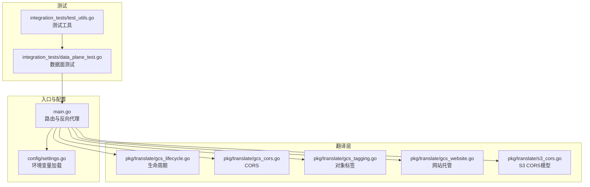
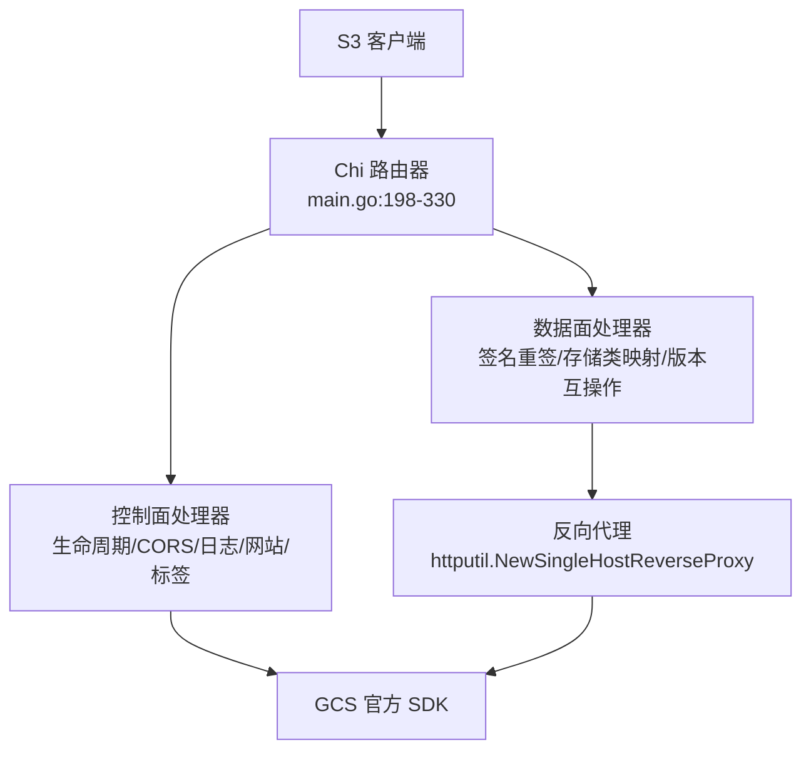
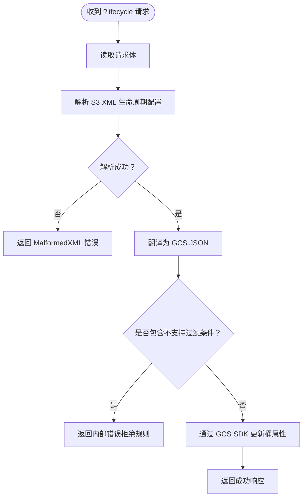
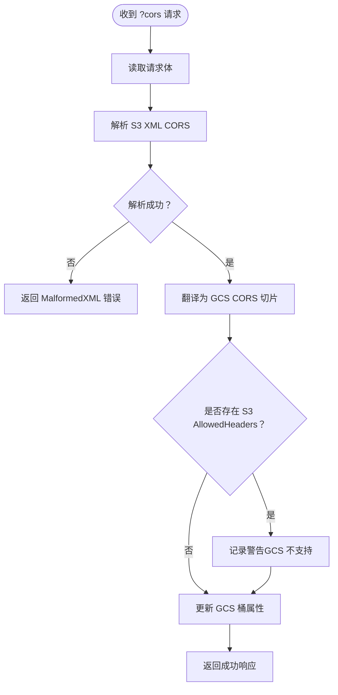
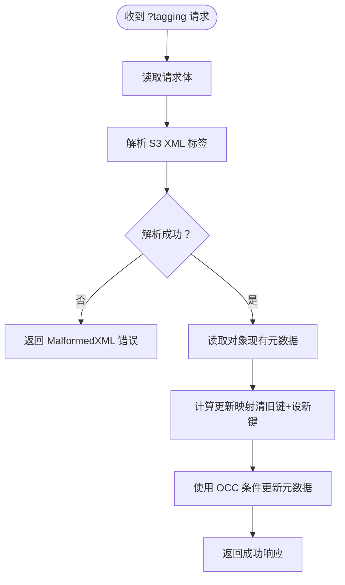
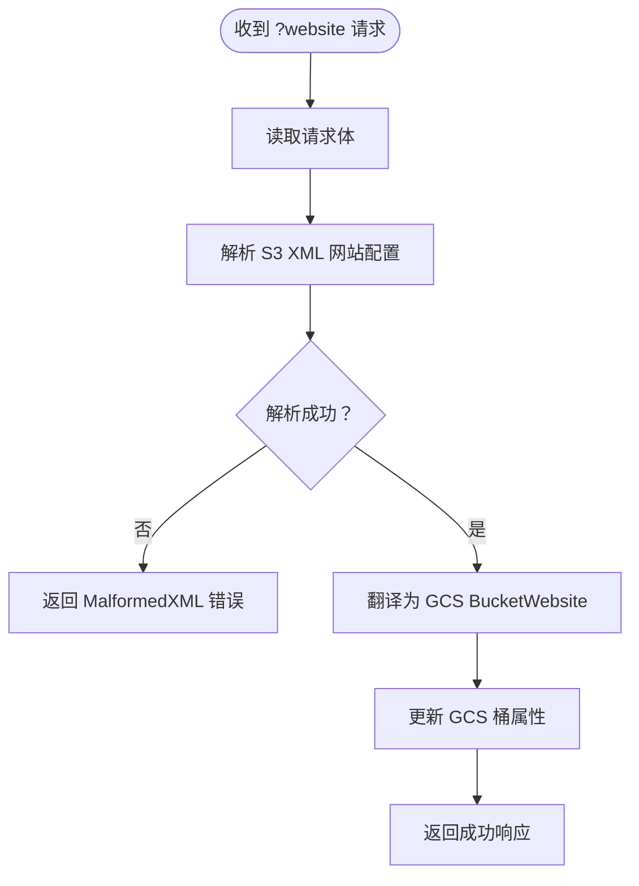
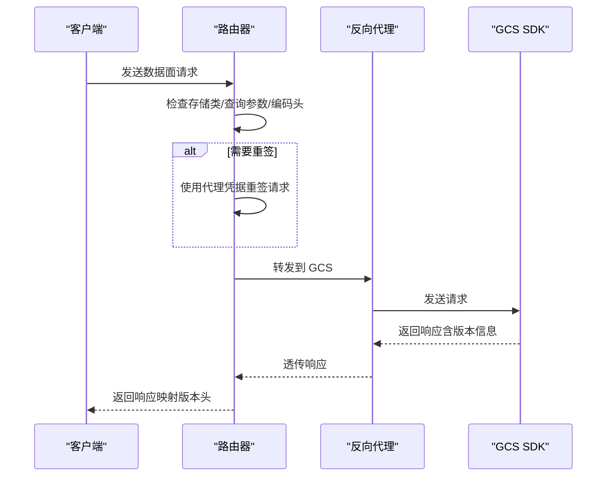
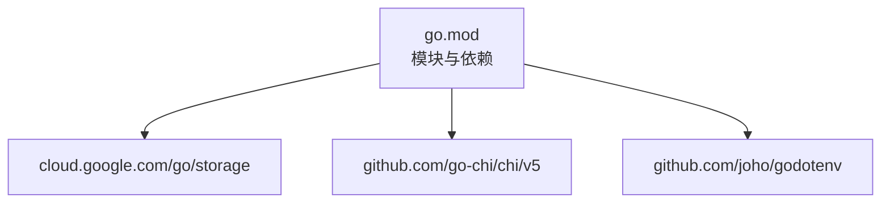

# 项目简介

<cite>
**本文档引用的文件**
- [README.md](file://README.md)
- [main.go](file://main.go)
- [config/settings.go](file://config/settings.go)
- [pkg/translate/gcs_lifecycle.go](file://pkg/translate/gcs_lifecycle.go)
- [pkg/translate/gcs_cors.go](file://pkg/translate/gcs_cors.go)
- [pkg/translate/gcs_tagging.go](file://pkg/translate/gcs_tagging.go)
- [pkg/translate/gcs_website.go](file://pkg/translate/gcs_website.go)
- [pkg/translate/s3_cors.go](file://pkg/translate/s3_cors.go)
- [integration_tests/data_plane_test.go](file://integration_tests/data_plane_test.go)
- [integration_tests/test_utils.go](file://integration_tests/test_utils.go)
- [go.mod](file://go.mod)
- [unsupported.txt](file://unsupported.txt)
- [AGENTS.md](file://AGENTS.md)
</cite>

## 目录
1. [引言](#引言)
2. [项目结构](#项目结构)
3. [核心组件](#核心组件)
4. [架构总览](#架构总览)
5. [详细组件分析](#详细组件分析)
6. [依赖关系分析](#依赖关系分析)
7. [性能考量](#性能考量)
8. [故障排查指南](#故障排查指南)
9. [结论](#结论)
10. [附录](#附录)

## 引言
S3Proxy4GCS 是一个面向企业级应用的透明中间件代理，用于在 AWS S3 兼容客户端与 Google Cloud Storage（GCS）之间进行无缝桥接。其核心价值主张是“零代码迁移”：通过标准的 S3 协议与路径风格地址，直接复用现有 S3 客户端代码，无需修改业务逻辑即可切换到 GCS 后端。项目通过拦截与翻译 S3 的桶级配置（生命周期、CORS、日志、网站托管、对象标签）以及数据面请求的签名重签与存储类映射，解决了 S3 与 GCS 在 API 差异、格式不兼容与功能缺失方面的关键问题，为企业提供稳定可靠的云存储迁移路径。

## 项目结构
项目采用模块化设计，入口控制器负责路由与反向代理，配置模块集中管理运行参数，翻译包负责 S3 与 GCS 之间的双向转换，集成测试模块独立验证数据面与控制面行为。

**图表来源**
- [main.go:1-252](file://main.go#L1-L252)
- [config/settings.go:1-65](file://config/settings.go#L1-L65)
- [pkg/translate/gcs_lifecycle.go:1-249](file://pkg/translate/gcs_lifecycle.go#L1-L249)
- [pkg/translate/gcs_cors.go:1-62](file://pkg/translate/gcs_cors.go#L1-L62)
- [pkg/translate/gcs_tagging.go:1-48](file://pkg/translate/gcs_tagging.go#L1-L48)
- [pkg/translate/gcs_website.go:1-27](file://pkg/translate/gcs_website.go#L1-L27)
- [pkg/translate/s3_cors.go:1-20](file://pkg/translate/s3_cors.go#L1-L20)
- [integration_tests/data_plane_test.go:1-202](file://integration_tests/data_plane_test.go#L1-L202)
- [integration_tests/test_utils.go:1-113](file://integration_tests/test_utils.go#L1-L113)

**章节来源**
- [README.md:140-157](file://README.md#L140-L157)
- [main.go:198-330](file://main.go#L198-L330)
- [config/settings.go:27-57](file://config/settings.go#L27-L57)

## 核心组件
- 透明路由与反向代理：基于高性能的单主机反向代理，支持连接池优化、超时控制与优雅关闭，确保数据面请求的稳定转发。
- 配置中心：统一从 .env 或环境变量加载端口、目标桶、DryRun、连接池上限、调试日志等参数。
- 控制面拦截器：针对生命周期、CORS、日志、网站托管、对象标签等桶级配置进行解析与翻译，并调用 GCS 官方 SDK 应用到桶属性。
- 数据面签名重签：对非标准存储类、特定查询参数与编码头进行检测与重签，保证与 GCS S3 兼容 API 的签名一致性。
- 结构化日志与可观测性：使用 log/slog 输出可解析的 JSON 日志，便于云原生监控与审计。
- 干运行模式：在本地或测试环境中禁用真实 GCS 调用，仅返回模拟响应，保障开发安全与成本可控。

**章节来源**
- [README.md:89-98](file://README.md#L89-L98)
- [main.go:37-91](file://main.go#L37-L91)
- [main.go:254-330](file://main.go#L254-L330)
- [config/settings.go:27-57](file://config/settings.go#L27-L57)

## 架构总览
S3Proxy4GCS 的整体架构由“入口路由器 + 翻译层 + 反向代理 + GCS SDK”构成。入口路由器拦截特定查询参数的控制面请求并进行翻译，其余数据面请求通过反向代理直连 GCS，并在必要时进行签名重签与头部调整以满足 GCS S3 兼容 API 的要求。

**图表来源**
- [main.go:198-330](file://main.go#L198-L330)
- [main.go:93-196](file://main.go#L93-L196)

**章节来源**
- [main.go:37-91](file://main.go#L37-L91)
- [main.go:254-330](file://main.go#L254-L330)

## 详细组件分析

### 生命周期（Lifecycle）翻译
- 功能概述：将 S3 XML 生命周期规则翻译为 GCS JSON，并通过官方 SDK 应用到桶属性；同时支持从 GCS 属性反向生成 S3 XML。
- 关键点：
  - 支持 Expiration（删除）、Transition（存储类变更）、NoncurrentVersionExpirations（未当前版本过期）等常见规则。
  - 对不支持的过滤条件（如对象大小、标签）进行拒绝，避免误删风险。
  - 存储类映射遵循 S3 到 GCS 的等价关系，确保成本与性能预期一致。
- 错误处理：解析失败返回标准 S3 XML 错误；翻译失败返回内部错误；GCS API 失败返回网关错误。

**图表来源**
- [main.go:357-414](file://main.go#L357-L414)
- [pkg/translate/gcs_lifecycle.go:38-137](file://pkg/translate/gcs_lifecycle.go#L38-L137)

**章节来源**
- [pkg/translate/gcs_lifecycle.go:38-137](file://pkg/translate/gcs_lifecycle.go#L38-L137)
- [main.go:357-414](file://main.go#L357-L414)

### CORS（跨域资源共享）
- 功能概述：将 S3 XML CORS 规则翻译为 GCS CORS 切片，并支持反向转换；忽略 S3 中的“请求头白名单”，因为 GCS 不支持该字段。
- 关键点：
  - MaxAge、方法列表、源列表与暴露头均按字段映射。
  - 当前实现不支持 S3 的 AllowedHeaders（请求头），会记录警告并忽略。
- 错误处理：解析失败返回标准 S3 XML 错误；GCS API 失败返回网关错误。

**图表来源**
- [main.go:453-496](file://main.go#L453-L496)
- [pkg/translate/gcs_cors.go:10-35](file://pkg/translate/gcs_cors.go#L10-L35)
- [pkg/translate/s3_cors.go:5-19](file://pkg/translate/s3_cors.go#L5-L19)

**章节来源**
- [pkg/translate/gcs_cors.go:10-35](file://pkg/translate/gcs_cors.go#L10-L35)
- [main.go:453-496](file://main.go#L453-L496)

### 对象标签（Tagging）
- 功能概述：将 S3 对象标签翻译为 GCS 自定义元数据，使用前缀隔离与乐观并发控制（OCC）防止覆盖丢失。
- 关键点：
  - 使用固定前缀将 S3 标签键转换为 GCS 元数据键，写入时先清空同名旧键，再设置新值。
  - 通过 If-MetagenerationMatch 实现 OCC，避免并发写冲突导致的数据丢失。
- 错误处理：解析失败返回标准 S3 XML 错误；GCS API 写入失败返回内部错误。

**图表来源**
- [main.go:656-721](file://main.go#L656-L721)
- [pkg/translate/gcs_tagging.go:10-35](file://pkg/translate/gcs_tagging.go#L10-L35)

**章节来源**
- [pkg/translate/gcs_tagging.go:10-35](file://pkg/translate/gcs_tagging.go#L10-L35)
- [main.go:656-721](file://main.go#L656-L721)

### 网站托管（Website）
- 功能概述：将 S3 网站配置（主页后缀、404 页面）翻译为 GCS BucketWebsite。
- 关键点：
  - IndexDocument 映射为主页后缀；ErrorDocument 映射为 404 页面键。
- 错误处理：解析失败返回标准 S3 XML 错误；GCS API 失败返回网关错误。

**图表来源**
- [main.go:611-654](file://main.go#L611-L654)
- [pkg/translate/gcs_website.go:9-26](file://pkg/translate/gcs_website.go#L9-L26)

**章节来源**
- [pkg/translate/gcs_website.go:9-26](file://pkg/translate/gcs_website.go#L9-L26)
- [main.go:611-654](file://main.go#L611-L654)

### 数据面请求处理（签名重签与存储类映射）
- 功能概述：对数据面请求进行必要的头部与查询参数调整，并在需要时进行 HMAC 重签，确保与 GCS S3 兼容 API 的签名一致。
- 关键点：
  - 存储类映射：将 S3 非标准存储类映射为 GCS 对应类别。
  - 查询参数处理：剥离特定跟踪参数并触发重签。
  - 编码头处理：移除可能影响 GCS S3 API 的编码头。
  - 版本互操作：注入/映射版本相关头部，保持 S3 语义。
- 错误处理：重签失败记录错误；GCS 响应头映射失败不影响流程。

**图表来源**
- [main.go:93-196](file://main.go#L93-L196)
- [main.go:328-330](file://main.go#L328-L330)

**章节来源**
- [main.go:93-196](file://main.go#L93-L196)
- [main.go:328-330](file://main.go#L328-L330)

## 依赖关系分析
- 运行时依赖：Go 1.25+，使用官方 GCS SDK、Chi 路由器与 dotenv 加载环境变量。
- 关键外部接口：GCS 官方 SDK 提供桶属性与对象元数据的读写能力；AWS SDK v2 的签名器用于重签请求。
- 模块化组织：根模块与独立的集成测试子模块解耦，便于在不污染主模块的情况下进行端到端验证。

**图表来源**
- [go.mod:1-61](file://go.mod#L1-L61)

**章节来源**
- [go.mod:1-61](file://go.mod#L1-L61)

## 性能考量
- 连接池优化：通过 MaxIdleConns 与 MaxIdleConnsPerHost 参数提升高并发下的连接复用效率。
- 超时控制：为传输层设置合理的空闲连接超时、TLS 握手超时与 ExpectContinue 超时，避免长时间占用资源。
- HTTP/2 启用：强制尝试 HTTP/2，提升多路复用与头部压缩性能。
- 流式处理：默认反向代理保持流式转发，避免将大对象完整读入内存，降低内存峰值。
- 上下文传播：所有对外 GCS 调用使用请求上下文，客户端断开时自动取消请求，节省成本与资源。

**章节来源**
- [main.go:79-91](file://main.go#L79-L91)
- [main.go:93-196](file://main.go#L93-L196)
- [AGENTS.md:16-17](file://AGENTS.md#L16-L17)

## 故障排查指南
- 签名失败：检查代理的 HMAC 凭据是否正确配置；确认重签流程已执行且未被 DryRun 模式屏蔽。
- 生命周期规则被拒绝：检查规则中是否包含不支持的过滤条件（如对象大小、标签），这些会被翻译层拒绝。
- CORS 配置无效：注意 AllowedHeaders 在 GCS 中不被支持，会被忽略；请使用暴露头与允许方法实现类似效果。
- 对象标签冲突：若出现 OCC 写入失败，请检查并发写入情况并重试。
- 日志与调试：启用 DEBUG_LOGGING 查看结构化 JSON 日志，定位请求头、响应头与版本号映射问题。
- 集成测试：使用独立的集成测试模块验证数据面与控制面行为，确保与真实 AWS SDK 的兼容性。

**章节来源**
- [main.go:157-182](file://main.go#L157-L182)
- [pkg/translate/gcs_lifecycle.go:112-137](file://pkg/translate/gcs_lifecycle.go#L112-L137)
- [pkg/translate/gcs_cors.go:20-22](file://pkg/translate/gcs_cors.go#L20-L22)
- [main.go:788-792](file://main.go#L788-L792)
- [integration_tests/data_plane_test.go:15-106](file://integration_tests/data_plane_test.go#L15-L106)

## 结论
S3Proxy4GCS 通过“透明中间件”的设计理念，将 S3 与 GCS 的差异在代理层内化解，使企业能够在不修改一行业务代码的前提下完成云存储平台迁移。项目具备完善的控制面翻译能力、稳健的数据面签名重签机制、可观测的日志体系与高并发的连接池优化，适合在生产环境中作为企业级解决方案长期使用。对于希望以最小成本切换至 GCS 的团队而言，S3Proxy4GCS 提供了可靠、可扩展且易于维护的桥梁。

## 附录
- 技术定位：S3 协议到 GCS 的兼容层，专注于零代码迁移与企业级稳定性。
- 目标用户：需要从 S3 迁移到 GCS 的企业与开发者团队，尤其是已有大量 S3 客户端代码的组织。
- 主要应用场景：数据归档与分层存储（生命周期）、跨域访问控制（CORS）、对象标签治理（运维与计费）、静态网站托管（Website）、以及大规模对象数据的上传下载与版本管理。