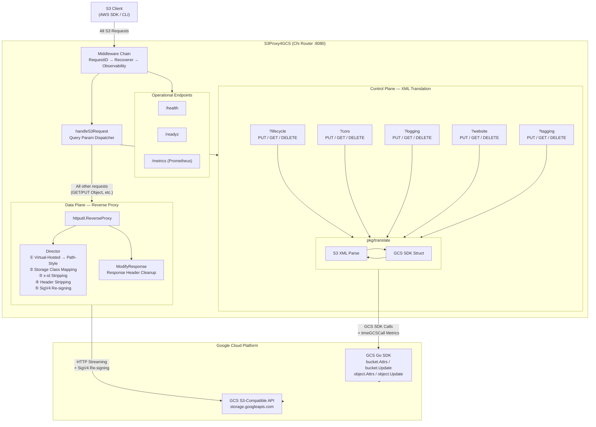

# Go S3 to GCS Proxy

This project acts as a middleware proxy between AWS S3-compatible client SDKs and Google Cloud Storage (GCS). It translates unsupported or edge-case S3 features into GCS-compatible operations transparently.

## Getting Started

### Prerequisites
- **Go 1.21+** (Download from [golang.org](https://golang.org/))

### Configuration
The proxy configuration depends on `.env` file or direct environment variables.

Copy the `.env` template:
```bash
cp .env.example .env
```

Available Configuration Options:
-   `PORT` (Default: `8080`): The port the proxy listens on.
-   `GCP_PROJECT_ID`: The target Google Cloud Project ID.
-   `TARGET_BUCKET`: The target GCS bucket name.
-   `STORAGE_BASE_URL` (Default: `https://storage.googleapis.com`): The GCS endpoint URL.
-   `GCS_PREFIX`: Subfolder prefix for testing or namespacing.
-   `DRY_RUN` (Default: `true`): Disables real GCS API hits (safe for laptop testing). Set to `false` for live integration.
-   `JSON_KEY`: Path to the Google Cloud Service Account JSON key (required for real GCS API calls like Website/CORS).
-   `AWS_ACCESS_KEY_ID` / `AWS_SECRET_ACCESS_KEY`: Proxy's HMAC credentials for re-signing requests to GCS.
-   `PROXY_BASE_DOMAIN`: Base domain for virtual-hosted style support (e.g. `s3proxy.example.com`). When set, the proxy automatically converts virtual-hosted style requests (`bucket.s3proxy.example.com/key`) to path-style (`/bucket/key`). Requires wildcard DNS (`*.s3proxy.example.com → proxy IP`). Default: empty (disabled).
-   `MAX_IDLE_CONNS` (Default: `1000`): Maximum idle connections for the reverse proxy.
-   `MAX_IDLE_CONNS_PER_HOST` (Default: `1000`): Maximum idle connections per host for the reverse pool.
-   `MAX_CONCURRENT_REQUESTS` (Default: `1000`): Maximum number of requests processed concurrently. Excess requests receive `503 Service Unavailable`. Set to `0` to disable throttling. **This value should be tuned based on machine resources (CPU cores, memory) and GCS API rate limits through performance benchmarking.**
-   `GCS_CALL_TIMEOUT_SEC` (Default: `30`): Timeout in seconds for individual GCS SDK API calls (bucket updates, attribute queries). Prevents goroutine leaks when GCS is unresponsive. Set to `0` to disable (not recommended).
-   `IDLE_CONN_TIMEOUT_SEC` (Default: `120`): How long idle connections remain in the pool before being closed. Higher values improve connection reuse under sustained load.
-   `RESPONSE_HEADER_TIMEOUT_SEC` (Default: `30`): Maximum time to wait for GCS response headers. Protects against slow backend responses.
-   `READ_BUFFER_SIZE` (Default: `65536`): TCP read buffer size (bytes) for the GET/HEAD read-path Transport. Larger values improve download throughput for large objects.
-   `WRITE_BUFFER_SIZE` (Default: `65536`): TCP write buffer size (bytes) for the PUT/POST/DELETE write-path Transport. Larger values improve upload throughput for large objects.

## Alternative: Transparent Routing via HTTP_PROXY

> **Note**: The recommended approach is direct endpoint configuration (see [Per-SDK Client Configuration](#per-sdk-client-configuration) below). This section documents an alternative approach using system proxy environment variables.

You can route all traffic from your S3 client application to the proxy transparently by setting standard proxy environment variables:

```bash
export HTTP_PROXY=http://localhost:8080
export HTTPS_PROXY=http://localhost:8080
```

This allows you to use standard S3 endpoints in your code without modifying the initialization logic. However, this affects all HTTP traffic in the process, not just S3 calls.

## Architecture



| Layer | Path | Handling |
|---|---|---|
| **Data Plane** | GET/PUT/DELETE Object, ListObjects, etc. | `ReverseProxy` streams to GCS S3-compatible API with header rewriting + SigV4 re-signing |
| **Control Plane** | `?lifecycle` `?cors` `?logging` `?website` `?tagging` | Intercepts request, bi-directional S3 XML ↔ GCS SDK translation via GCS Go SDK |
| **Operations** | `/health` `/readyz` `/metrics` | Health check, readiness probe (GCS connectivity), Prometheus metrics |

## Features

- **Lifecycle Intercept**: Translates S3 XML Lifecycle Configuration to GCS JSON.
- **Real GCS Forwarding**: Submits translated JSON to GCS via official GCS Go SDK.
- **Structured JSON Logging**: Native `log/slog` for modern cloud observability (Parsable JSON lines). Toggle `DEBUG_LOGGING=true` for verbose output.
- **Prometheus Metrics**: Request counts, latency histograms, GCS API call duration at `/metrics`.
- **Reliable Timeouts**: Set timeouts on `http.Transport` to prevent hanging connections.
- **Graceful Shutdown**: Listens for `SIGTERM`/`SIGINT` and waits up to 10s for draining requests.
- **Prefix Isolation**: Use `GCS_PREFIX` for test isolation.
- **DryRun Toggle**: Use `DRY_RUN=true` to disable real GCS API hits (safe for local laptop testing).

---

## Technical Features

### Lifecycle Translation

The proxy intercepts `PUT /?lifecycle` and maps it directly to Google Cloud Storage. Standard actions like `Expiration` (Delete) and `Transition` (SetStorageClass) are translated into GCS JSON schemas.

- To verify the translation locally, you can use the unit tests in `pkg/translate`.
- To see it in action, run the proxy and hit the endpoint with a standard S3 XML payload.

---

## 🔬 Integration Tests (Local, Isolated Module)

To run automated integration tests using the **AWS S3 Go SDK** without polluting the main project module, we use an isolated sub-module:

```bash
cd integration_tests
go mod tidy
go test -v ./...
```

The test will automatically spawn the local proxy in DryRun mode, run tests using the real AWS SDK client, and report results.

---

## 🧪 E2E Acceptance Tests (Live Environment)

The `e2e_tests/` module provides a full acceptance test suite designed to run against a **live proxy deployment** (e.g. on GKE). It covers three dimensions: **functional correctness**, **stability**, and **performance benchmarks**.

### Prerequisites

- Go 1.24+
- A running S3Proxy4GCS instance accessible via HTTP endpoint
- GCS HMAC credentials (Access Key + Secret Key)
- A GCS bucket for testing

### Environment Variables

| Variable | Required | Description |
|---|---|---|
| `PROXY_ENDPOINT` | Yes | Proxy URL, e.g. `http://s3proxy.default.svc:8080` or `http://localhost:8080` |
| `GCS_HMAC_ACCESS` | Yes | GCS HMAC Access Key ID |
| `GCS_HMAC_SECRET` | Yes | GCS HMAC Secret Access Key |
| `TEST_BUCKET` | Yes | Target GCS bucket name |
| `TEST_PREFIX` | No | Object key prefix for test isolation (default: none) |
| `STABILITY_ROUNDS` | No | Number of iterations for stability tests (default: `100`) |
| `CONCURRENCY` | No | Number of parallel goroutines for concurrency tests (default: `10`) |

### Run All Tests

```bash
cd e2e_tests
go mod tidy

export PROXY_ENDPOINT=http://<your-proxy-endpoint>:8080
export GCS_HMAC_ACCESS=<your-access-key>
export GCS_HMAC_SECRET=<your-secret-key>
export TEST_BUCKET=<your-bucket>
export TEST_PREFIX="e2e-$(date +%s)/"

# Run all tests
go test -v -count=1 -timeout 30m ./...
```

### Run Specific Test Suites

```bash
# Functional tests only (data plane + control plane + ops endpoints)
go test -v -count=1 -run 'TestObjectCRUD|TestMultipartUpload|TestStorageClass|TestListObjects|TestVersioning|TestLifecycleCRUD|TestCORSCRUD|TestLoggingCRUD|TestWebsiteCRUD|TestTaggingCRUD|TestHealthEndpoint|TestReadyzEndpoint|TestMetricsEndpoint' ./...

# Stability tests only
STABILITY_ROUNDS=200 CONCURRENCY=20 go test -v -count=1 -timeout 30m -run 'TestLongRunningCRUD|TestConcurrentOperations|TestControlPlaneConcurrency' ./...

# Performance benchmarks only (outputs benchmark_report.json)
go test -v -count=1 -timeout 20m -run 'TestBenchmarkSuite' ./...
```

### Test Coverage

| Suite | Tests | What It Validates |
|---|---|---|
| **Data Plane** | ObjectCRUD, MultipartUpload, StorageClass, ListObjectsV2, Versioning | Object lifecycle, body integrity, storage class translation, version ID mapping |
| **Control Plane** | LifecycleCRUD, CORSCRUD, LoggingCRUD, WebsiteCRUD, TaggingCRUD | Full Put→Get→Delete→Get(empty) cycle for each bucket/object configuration |
| **Operations** | HealthEndpoint, ReadyzEndpoint, MetricsEndpoint | Health check, GCS readiness probe, Prometheus metrics availability |
| **Stability** | LongRunningCRUD, ConcurrentOperations, ControlPlaneConcurrency | Repeated CRUD loops, parallel goroutine safety, no data mixing |
| **Benchmarks** | PutObject, GetObject, PutGetDelete, PutBucketLifecycle | Latency percentiles (p50/p95/p99), ops/sec, JSON report output |

### CI/CD (GitHub Actions)

The workflow at `.github/workflows/e2e-tests.yml` supports **manual trigger** (`workflow_dispatch`) with three parallel jobs:

1. **Functional Tests** — runs all CRUD and ops endpoint tests
2. **Stability Tests** — runs long-running and concurrency tests (depends on functional)
3. **Performance Benchmarks** — runs latency benchmarks and uploads `benchmark_report.json` as artifact

Required GitHub Secrets: `GCS_HMAC_ACCESS`, `GCS_HMAC_SECRET`, `TEST_BUCKET`.

---

## Multi-SDK Deployment Guide

The proxy has been validated against **6 AWS SDKs** (Go V2, Go V1, Python/boto3, Java V1, Java V2, C++) with 10 test cases each (60/60 PASS). Different SDKs require different client-side configurations to work correctly with the GCS HMAC re-signing proxy.

### Proxy-Side Header Stripping (Automatic)

The proxy Director automatically strips the following headers before SigV4 re-signing. **No user action is required** — this is handled transparently:

| Header | Source SDK | Why Stripped |
|---|---|---|
| `User-Agent` | All | AWS-format UA included in signature but not expected by GCS |
| `Content-Md5` | Go V1, Java V1 | Stripped by default (SDK-computed MD5 invalidated after re-signing); **exception: `POST ?delete` — proxy recomputes MD5 from body** (GCS requires `Content-MD5` or `x-amz-checksum-*` for bulk delete) |
| `Expect` | Go V1 | `100-continue` interferes with GCS signature verification |
| `Accept-Encoding` | Go V2 | Go V2 gzip middleware sends `identity`, GCS modifies in transport causing canonical request mismatch |
| `Amz-Sdk-Invocation-Id` | Java V1/V2 | AWS internal tracking ID, not recognized by GCS |
| `Amz-Sdk-Request` | Java V1/V2 | AWS retry metadata, not recognized by GCS |
| `X-Amz-Decoded-Content-Length` | Java V1/V2 | aws-chunked related, meaningless after decode |
| `X-Amz-Trailer` | Java V2 | Flexible Checksums trailer declaration |
| `Content-Encoding` (aws-chunked) | Java V1/V2 | Conditionally removed when value contains `aws-chunked` |

### Virtual-Hosted Style Support

By default, all SDKs must configure **path-style addressing** to work with the proxy. However, if you set `PROXY_BASE_DOMAIN`, the proxy automatically converts virtual-hosted style requests to path-style, allowing SDK clients to use their **default addressing mode** without any configuration.

**Setup:**
1. Set `PROXY_BASE_DOMAIN` to the proxy's base domain (e.g. `s3proxy.example.com`)
2. Configure wildcard DNS: `*.s3proxy.example.com → proxy IP`
3. SDK clients can now use `bucket-name.s3proxy.example.com` as the endpoint without configuring path-style

When `PROXY_BASE_DOMAIN` is not set (default), this feature is disabled and all existing path-style configurations continue to work as before.

### Per-SDK Client Configuration

#### Go V2 — Zero configuration

```go
client := s3.NewFromConfig(cfg, func(o *s3.Options) {
    o.BaseEndpoint = aws.String("http://PROXY_ENDPOINT")
})
```

> With `PROXY_BASE_DOMAIN` enabled, no path-style needed. Without it, add `o.UsePathStyle = true`.

#### Go V1 — Zero configuration

```go
sess, _ := session.NewSession(&aws.Config{
    Endpoint:    aws.String("http://PROXY_ENDPOINT"),
    Region:      aws.String("us-east-1"),
    Credentials: credentials.NewStaticCredentials(access, secret, ""),
})
```

> With `PROXY_BASE_DOMAIN` enabled, no path-style needed. Without it, add `S3ForcePathStyle: aws.Bool(true)`.

#### Python (boto3) — Zero configuration

```python
client = boto3.client(
    "s3",
    endpoint_url="http://PROXY_ENDPOINT",
    aws_access_key_id=HMAC_ACCESS,
    aws_secret_access_key=HMAC_SECRET,
    region_name="us-east-1",
)
```

> With `PROXY_BASE_DOMAIN` enabled, no path-style needed. Without it, add `config=Config(s3={"addressing_style": "path"})`.

#### Java V1 — Disable chunked encoding

```java
AmazonS3 s3 = AmazonS3ClientBuilder.standard()
    .withEndpointConfiguration(new EndpointConfiguration("http://PROXY_ENDPOINT", "us-east-1"))
    .withCredentials(new AWSStaticCredentialsProvider(new BasicAWSCredentials(access, secret)))
    .withChunkedEncodingDisabled(true)  // Required: disable aws-chunked body framing
    .build();
```

> With `PROXY_BASE_DOMAIN` enabled, no path-style needed. Without it, add `.withPathStyleAccessEnabled(true)`.

#### Java V2 — Disable chunked encoding and set env vars

```java
S3Client s3 = S3Client.builder()
    .endpointOverride(URI.create("http://PROXY_ENDPOINT"))
    .region(Region.US_EAST_1)
    .credentialsProvider(StaticCredentialsProvider.create(
        AwsBasicCredentials.create(access, secret)))
    .serviceConfiguration(S3Configuration.builder()
        .chunkedEncodingEnabled(false)      // Required: disable aws-chunked framing
        .build())
    .build();
```

**Required environment variables:**
```bash
export AWS_REQUEST_CHECKSUM_CALCULATION=WHEN_REQUIRED
export AWS_RESPONSE_CHECKSUM_VALIDATION=WHEN_REQUIRED
```

> With `PROXY_BASE_DOMAIN` enabled, no path-style needed. Without it, add `.forcePathStyle(true)`.

#### C++ — Disable payload signing and set env var

```cpp
Aws::Client::ClientConfiguration config;
config.endpointOverride = "http://PROXY_ENDPOINT";
config.region = "us-east-1";

auto s3 = Aws::MakeShared<Aws::S3::S3Client>("s3",
    creds, config,
    Aws::Client::AWSAuthV4Signer::PayloadSigningPolicy::Never,  // Recommended
    /* useVirtualAddressing */ true);
```

**Required environment variable:**
```bash
export AWS_REQUEST_CHECKSUM_CALCULATION=WHEN_REQUIRED
```

> With `PROXY_BASE_DOMAIN` enabled, virtual-hosted style works by default. Without it, set `useVirtualAddressing` to `false`.

### Quick Reference

| SDK | Special Config | Env Vars | Difficulty |
|---|---|---|---|
| **Go V2** | None | None | **Zero-config** |
| **Go V1** | None | None | **Zero-config** |
| **Python** | None | None | **Zero-config** |
| **Java V1** | `chunkedEncodingDisabled(true)` | None | Low |
| **Java V2** | `chunkedEncodingEnabled(false)` | `AWS_REQUEST_CHECKSUM_CALCULATION`, `AWS_RESPONSE_CHECKSUM_VALIDATION` | Medium |
| **C++** | `PayloadSigningPolicy::Never` (recommended) | `AWS_REQUEST_CHECKSUM_CALCULATION` | Low |

> **Note**: With `PROXY_BASE_DOMAIN` enabled on the server, all SDKs can use default virtual-hosted addressing. Path-style configuration is only needed when `PROXY_BASE_DOMAIN` is not set.

---

## Production Deployment (Kubernetes / GKE)

### Resource Configuration (Critical)

The proxy **must** use Guaranteed QoS (`requests == limits`) in Kubernetes. Burstable QoS causes CPU throttling under load due to Linux CFS bandwidth control, resulting in **30~60% throughput degradation**.

```yaml
# deployment.yaml — S3Proxy Pod
resources:
  requests:
    cpu: "1000m"      # Must equal limits
    memory: "512Mi"    # Must equal limits
  limits:
    cpu: "1000m"
    memory: "512Mi"
```

### Pod Anti-Affinity (Recommended)

When running performance-sensitive workloads alongside the proxy (e.g. benchmark jobs, high-throughput clients), use Pod anti-affinity to prevent co-location on the same node:

```yaml
affinity:
  podAntiAffinity:
    requiredDuringSchedulingIgnoredDuringExecution:
      - labelSelector:
          matchLabels:
            app: benchmark   # or your client app label
        topologyKey: kubernetes.io/hostname
```

### GKE Standard Notes

- Use **Guaranteed QoS** (`requests == limits`) to avoid CFS throttling under node contention.
- Enable **Private Google Access (PGA)** on the VPC subnet so Pods access GCS via Google's internal network (lower latency, no NAT).
- Recommended node machine type: `e2-standard-4` or higher for proxy workloads.

### Scaling Recommendations

| Scenario | Recommendation |
|---|---|
| GET/PUT 1KB~100KB at >500 ops/s | Single Pod with 1 vCPU is sufficient |
| GET/PUT 1MB+ or >1000 ops/s | Increase CPU limit to 2 vCPU, or add HPA (target CPU 70%) |
| Multi-tenant / production | HPA with min=2, max=10 replicas |

---

## Development & Usage

Initialize dependencies:
```bash
go mod tidy
```

Run the server locally:
```bash
go run .
```

---

## 📂 File Structure & Features

### Root
- **[main.go](file:///Users/deckardy/gitlab/s3proxy4gcs/main.go)**: Router entry point. Intercepts custom XML operations and falls through to a high-performance Reverse Proxy for all standard object traffic. Uses tuned connection pooling for speed. **Enforces standard S3 XML error responses and propagates request contexts for automatic cost cancellation.**
- **[config/settings.go](file:///Users/deckardy/gitlab/s3proxy4gcs/config/settings.go)**: Centralized environment configuration (Port, Bucket, DryRun, Connection Limits).

### Package `pkg/translate`
Handles bi-directional translation between AWS S3 XML schemas and Google Cloud Storage schemas:
- **`s3_*.go`**: Defines the incoming AWS S3 XML Structs (Parsing).
- **`gcs_*.go`**: Translates the parsed S3 structs into GCS SDK types or JSON payloads.

#### Feature Files:
- **[lifecycle](file:///Users/deckardy/gitlab/s3proxy4gcs/pkg/translate/gcs_lifecycle.go)**: Maps Lifecycle settings with rule rejections for unsupported filters.
- **[cors](file:///Users/deckardy/gitlab/s3proxy4gcs/pkg/translate/gcs_cors.go)**: Maps S3 XML CORS permissions to GCS Go SDK types.
- **[logging](file:///Users/deckardy/gitlab/s3proxy4gcs/pkg/translate/gcs_logging.go)**: Parses and holds bucket logging specifications.
- **[website](file:///Users/deckardy/gitlab/s3proxy4gcs/pkg/translate/gcs_website.go)**: Maps main page suffixes and 404 error documents.
- **[tagging](file:///Users/deckardy/gitlab/s3proxy4gcs/pkg/translate/gcs_tagging.go)**: Translates tags into GCS custom metadata using Optimistic Concurrency Control (OCC) to prevent overwrite losses.
