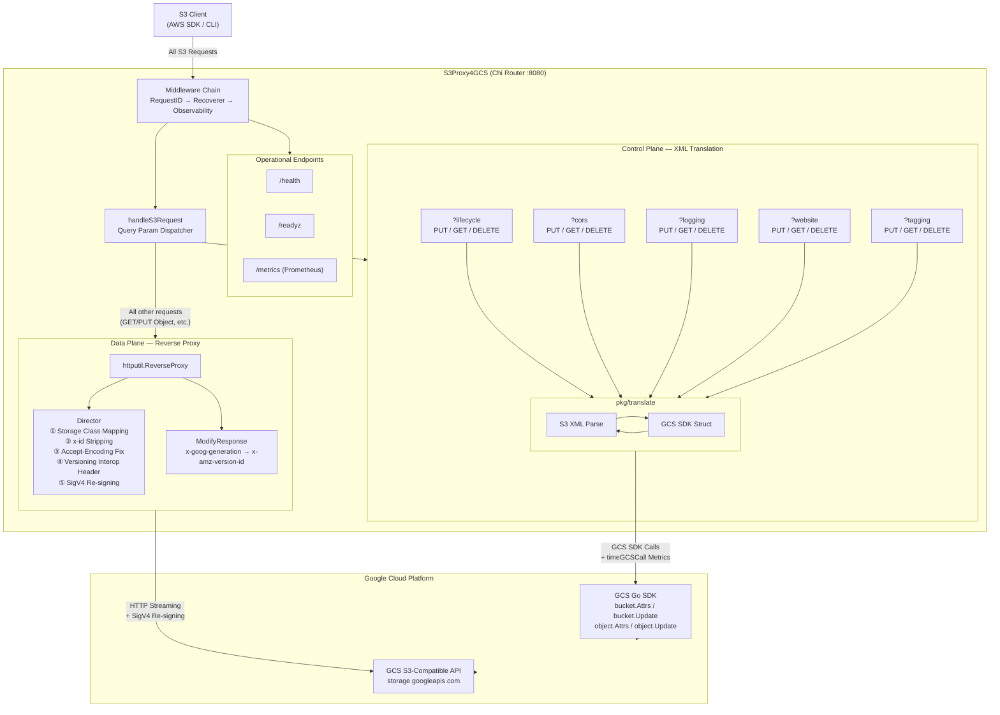

# Go S3 to GCS Proxy

This project acts as a middleware proxy between AWS S3-compatible client SDKs and Google Cloud Storage (GCS). It translates unsupported or edge-case S3 features into GCS-compatible operations transparently.

## Getting Started

### Prerequisites
- **Go 1.21+** (Download from [golang.org](https://golang.org/))

### Configuration
The proxy configuration depends on `.env` file or direct environment variables.

Copy the `.env` template:
```bash
cp .env.example .env
```

Available Configuration Options:
-   `PORT` (Default: `8080`): The port the proxy listens on.
-   `GCP_PROJECT_ID`: The target Google Cloud Project ID.
-   `TARGET_BUCKET`: The target GCS bucket name.
-   `STORAGE_BASE_URL` (Default: `https://storage.googleapis.com`): The GCS endpoint URL.
-   `GCS_PREFIX`: Subfolder prefix for testing or namespacing.
-   `DRY_RUN` (Default: `true`): Disables real GCS API hits (safe for laptop testing). Set to `false` for live integration.
-   `JSON_KEY`: Path to the Google Cloud Service Account JSON key (required for real GCS API calls like Website/CORS).
-   `AWS_ACCESS_KEY_ID` / `AWS_SECRET_ACCESS_KEY`: Proxy's HMAC credentials for re-signing requests to GCS.
-   `MAX_IDLE_CONNS` (Default: `1000`): Maximum idle connections for the reverse proxy.
-   `MAX_IDLE_CONNS_PER_HOST` (Default: `1000`): Maximum idle connections per host for the reverse pool.
-   `MAX_CONCURRENT_REQUESTS` (Default: `1000`): Maximum number of requests processed concurrently. Excess requests receive `503 Service Unavailable`. Set to `0` to disable throttling. **This value should be tuned based on machine resources (CPU cores, memory) and GCS API rate limits through performance benchmarking.**

## Using with standard AWS S3 SDK (Zero Code Change via HTTP_PROXY)

You can route all traffic from your S3 client application to the proxy transparently by setting standard proxy environment variables. This allows you to use standard S3 endpoints in your code without modifying the initialization logic.

### 1. Set Environment Variables
Set the `HTTP_PROXY` or `HTTPS_PROXY` (depending on whether your proxy uses TLS) to point to your local proxy instance.

```bash
export HTTP_PROXY=http://localhost:8081
export HTTPS_PROXY=http://localhost:8081
```

### 2. Configure Client to use PathStyle
While you don't need to change the endpoint or transport, ensure your SDK is configured to use **Path-Style addressing** (required for GCS S3 compatibility).

---

## Using with standard AWS S3 SDK (Explicit Client Transport)

Instead of setting a system-wide environment variable, you can configure your S3 client's `HTTPClient` transport to route traffic to the proxy while keeping standard endpoints in signatures. This allows you guards against side effects for non-S3 traffic.

### Go SDK v2 Example

```go
import (
	"context"
	"net"
	"net/http"
	"strings"

	"github.com/aws/aws-sdk-go-v2/aws"
	"github.com/aws/aws-sdk-go-v2/config"
	"github.com/aws/aws-sdk-go-v2/service/s3"
)

func createS3Client() (*s3.Client, error) {
	dialer := &net.Dialer{}
	transport := &http.Transport{
		DialContext: func(ctx context.Context, network, addr string) (net.Conn, error) {
			if strings.HasPrefix(addr, "storage.googleapis.com") {
				return dialer.DialContext(ctx, network, "localhost:8081")
			}
			return dialer.DialContext(ctx, network, addr)
		},
	}

	cfg, err := config.LoadDefaultConfig(context.TODO())
	if err != nil {
		return nil, err
	}

	return s3.NewFromConfig(cfg, func(o *s3.Options) {
		o.UsePathStyle = true
		o.HTTPClient = &http.Client{Transport: transport}
		o.BaseEndpoint = aws.String("http://storage.googleapis.com")
	}), nil
}
```

## Architecture



| Layer | Path | Handling |
|---|---|---|
| **Data Plane** | GET/PUT/DELETE Object, ListObjects, etc. | `ReverseProxy` streams to GCS S3-compatible API with header rewriting + SigV4 re-signing |
| **Control Plane** | `?lifecycle` `?cors` `?logging` `?website` `?tagging` | Intercepts request, bi-directional S3 XML ↔ GCS SDK translation via GCS Go SDK |
| **Operations** | `/health` `/readyz` `/metrics` | Health check, readiness probe (GCS connectivity), Prometheus metrics |

## Features

- **Lifecycle Intercept**: Translates S3 XML Lifecycle Configuration to GCS JSON.
- **Real GCS Forwarding**: Submits translated JSON to GCS via official GCS Go SDK.
- **Structured JSON Logging**: Native `log/slog` for modern cloud observability (Parsable JSON lines). Toggle `DEBUG_LOGGING=true` for verbose output.
- **Prometheus Metrics**: Request counts, latency histograms, GCS API call duration at `/metrics`.
- **Reliable Timeouts**: Set timeouts on `http.Transport` to prevent hanging connections.
- **Graceful Shutdown**: Listens for `SIGTERM`/`SIGINT` and waits up to 10s for draining requests.
- **Prefix Isolation**: Use `GCS_PREFIX` for test isolation.
- **DryRun Toggle**: Use `DRY_RUN=true` to disable real GCS API hits (safe for local laptop testing).

---

## Technical Features

### Lifecycle Translation

The proxy intercepts `PUT /?lifecycle` and maps it directly to Google Cloud Storage. Standard actions like `Expiration` (Delete) and `Transition` (SetStorageClass) are translated into GCS JSON schemas.

- To verify the translation locally, you can use the unit tests in `pkg/translate`.
- To see it in action, run the proxy and hit the endpoint with a standard S3 XML payload.

---

## 🔬 Integration Tests (Local, Isolated Module)

To run automated integration tests using the **AWS S3 Go SDK** without polluting the main project module, we use an isolated sub-module:

```bash
cd integration_tests
go mod tidy
go test -v ./...
```

The test will automatically spawn the local proxy in DryRun mode, run tests using the real AWS SDK client, and report results.

---

## 🧪 E2E Acceptance Tests (Live Environment)

The `e2e_tests/` module provides a full acceptance test suite designed to run against a **live proxy deployment** (e.g. on GKE). It covers three dimensions: **functional correctness**, **stability**, and **performance benchmarks**.

### Prerequisites

- Go 1.24+
- A running S3Proxy4GCS instance accessible via HTTP endpoint
- GCS HMAC credentials (Access Key + Secret Key)
- A GCS bucket for testing

### Environment Variables

| Variable | Required | Description |
|---|---|---|
| `PROXY_ENDPOINT` | Yes | Proxy URL, e.g. `http://s3proxy.default.svc:8080` or `http://localhost:8080` |
| `GCS_HMAC_ACCESS` | Yes | GCS HMAC Access Key ID |
| `GCS_HMAC_SECRET` | Yes | GCS HMAC Secret Access Key |
| `TEST_BUCKET` | Yes | Target GCS bucket name |
| `TEST_PREFIX` | No | Object key prefix for test isolation (default: none) |
| `STABILITY_ROUNDS` | No | Number of iterations for stability tests (default: `100`) |
| `CONCURRENCY` | No | Number of parallel goroutines for concurrency tests (default: `10`) |

### Run All Tests

```bash
cd e2e_tests
go mod tidy

export PROXY_ENDPOINT=http://<your-proxy-endpoint>:8080
export GCS_HMAC_ACCESS=<your-access-key>
export GCS_HMAC_SECRET=<your-secret-key>
export TEST_BUCKET=<your-bucket>
export TEST_PREFIX="e2e-$(date +%s)/"

# Run all tests
go test -v -count=1 -timeout 30m ./...
```

### Run Specific Test Suites

```bash
# Functional tests only (data plane + control plane + ops endpoints)
go test -v -count=1 -run 'TestObjectCRUD|TestMultipartUpload|TestStorageClass|TestListObjects|TestVersioning|TestLifecycleCRUD|TestCORSCRUD|TestLoggingCRUD|TestWebsiteCRUD|TestTaggingCRUD|TestHealthEndpoint|TestReadyzEndpoint|TestMetricsEndpoint' ./...

# Stability tests only
STABILITY_ROUNDS=200 CONCURRENCY=20 go test -v -count=1 -timeout 30m -run 'TestLongRunningCRUD|TestConcurrentOperations|TestControlPlaneConcurrency' ./...

# Performance benchmarks only (outputs benchmark_report.json)
go test -v -count=1 -timeout 20m -run 'TestBenchmarkSuite' ./...
```

### Test Coverage

| Suite | Tests | What It Validates |
|---|---|---|
| **Data Plane** | ObjectCRUD, MultipartUpload, StorageClass, ListObjectsV2, Versioning | Object lifecycle, body integrity, storage class translation, version ID mapping |
| **Control Plane** | LifecycleCRUD, CORSCRUD, LoggingCRUD, WebsiteCRUD, TaggingCRUD | Full Put→Get→Delete→Get(empty) cycle for each bucket/object configuration |
| **Operations** | HealthEndpoint, ReadyzEndpoint, MetricsEndpoint | Health check, GCS readiness probe, Prometheus metrics availability |
| **Stability** | LongRunningCRUD, ConcurrentOperations, ControlPlaneConcurrency | Repeated CRUD loops, parallel goroutine safety, no data mixing |
| **Benchmarks** | PutObject, GetObject, PutGetDelete, PutBucketLifecycle | Latency percentiles (p50/p95/p99), ops/sec, JSON report output |

### CI/CD (GitHub Actions)

The workflow at `.github/workflows/e2e-tests.yml` supports **manual trigger** (`workflow_dispatch`) with three parallel jobs:

1. **Functional Tests** — runs all CRUD and ops endpoint tests
2. **Stability Tests** — runs long-running and concurrency tests (depends on functional)
3. **Performance Benchmarks** — runs latency benchmarks and uploads `benchmark_report.json` as artifact

Required GitHub Secrets: `GCS_HMAC_ACCESS`, `GCS_HMAC_SECRET`, `TEST_BUCKET`.

---

## Development & Usage

Initialize dependencies:
```bash
go mod tidy
```

Run the server locally:
```bash
go run .
```

---

## 📂 File Structure & Features

### Root
- **[main.go](file:///Users/deckardy/gitlab/s3proxy4gcs/main.go)**: Router entry point. Intercepts custom XML operations and falls through to a high-performance Reverse Proxy for all standard object traffic. Uses tuned connection pooling for speed. **Enforces standard S3 XML error responses and propagates request contexts for automatic cost cancellation.**
- **[config/settings.go](file:///Users/deckardy/gitlab/s3proxy4gcs/config/settings.go)**: Centralized environment configuration (Port, Bucket, DryRun, Connection Limits).

### Package `pkg/translate`
Handles bi-directional translation between AWS S3 XML schemas and Google Cloud Storage schemas:
- **`s3_*.go`**: Defines the incoming AWS S3 XML Structs (Parsing).
- **`gcs_*.go`**: Translates the parsed S3 structs into GCS SDK types or JSON payloads.

#### Feature Files:
- **[lifecycle](file:///Users/deckardy/gitlab/s3proxy4gcs/pkg/translate/gcs_lifecycle.go)**: Maps Lifecycle settings with rule rejections for unsupported filters.
- **[cors](file:///Users/deckardy/gitlab/s3proxy4gcs/pkg/translate/gcs_cors.go)**: Maps S3 XML CORS permissions to GCS Go SDK types.
- **[logging](file:///Users/deckardy/gitlab/s3proxy4gcs/pkg/translate/gcs_logging.go)**: Parses and holds bucket logging specifications.
- **[website](file:///Users/deckardy/gitlab/s3proxy4gcs/pkg/translate/gcs_website.go)**: Maps main page suffixes and 404 error documents.
- **[tagging](file:///Users/deckardy/gitlab/s3proxy4gcs/pkg/translate/gcs_tagging.go)**: Translates tags into GCS custom metadata using Optimistic Concurrency Control (OCC) to prevent overwrite losses.
